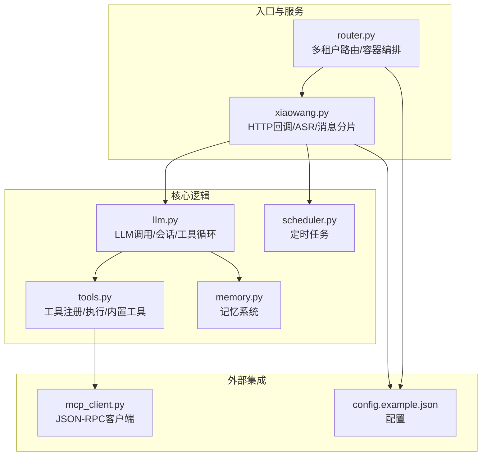
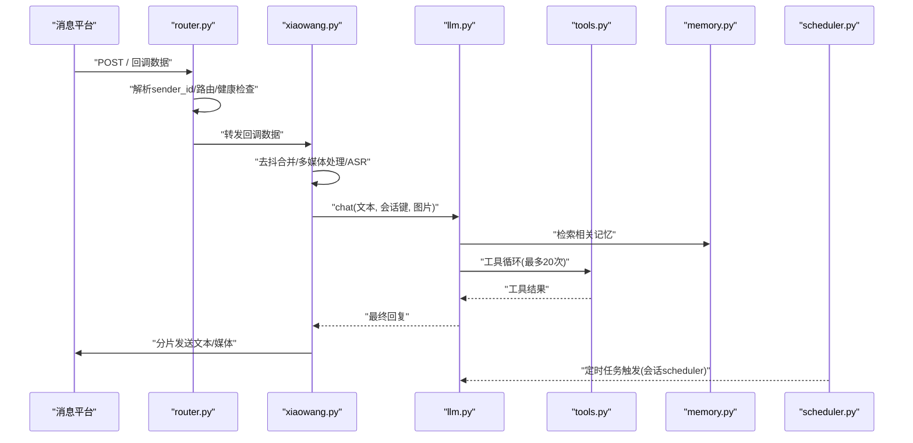
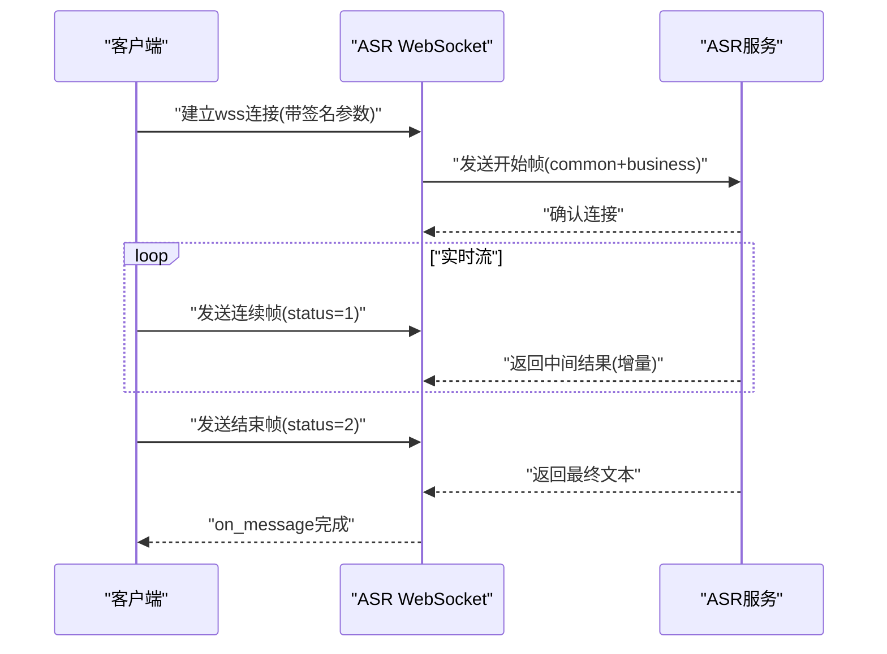
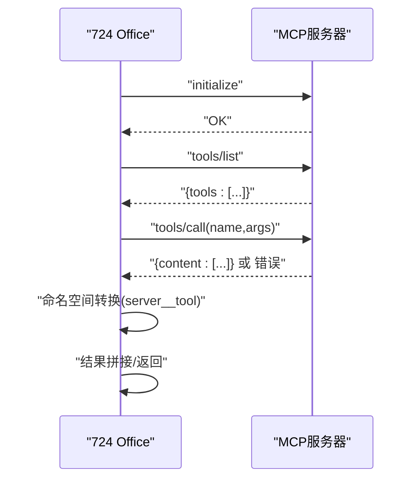
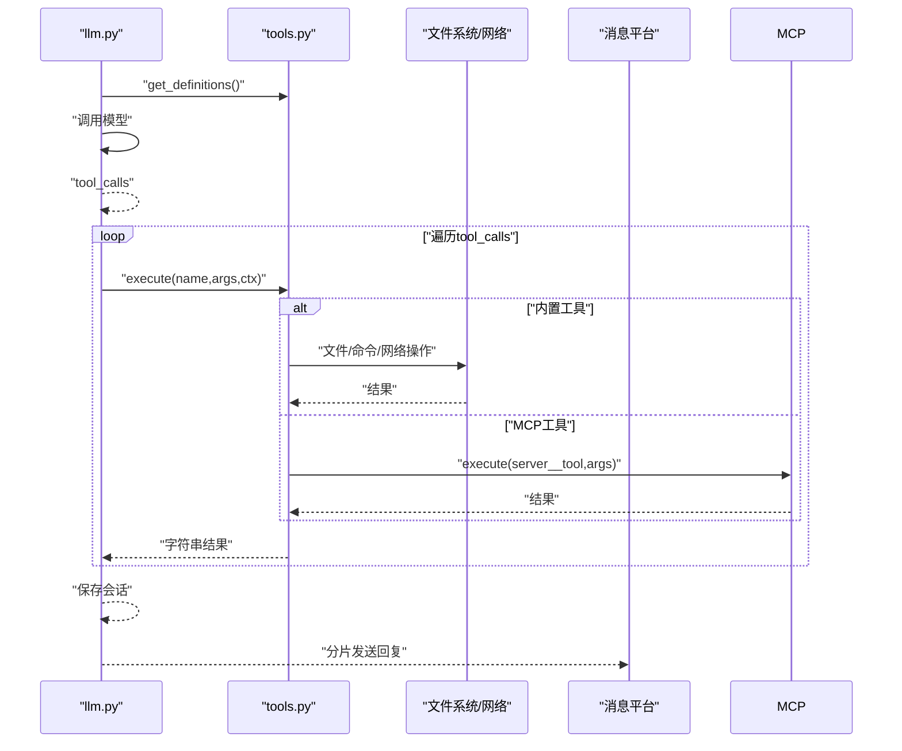
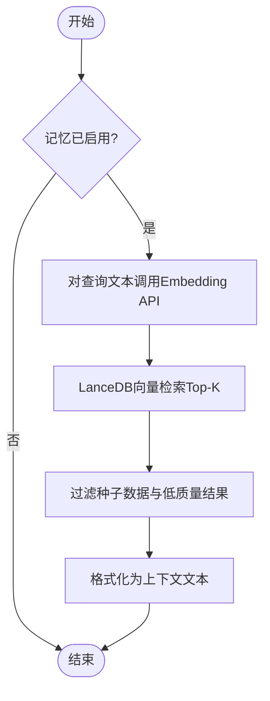
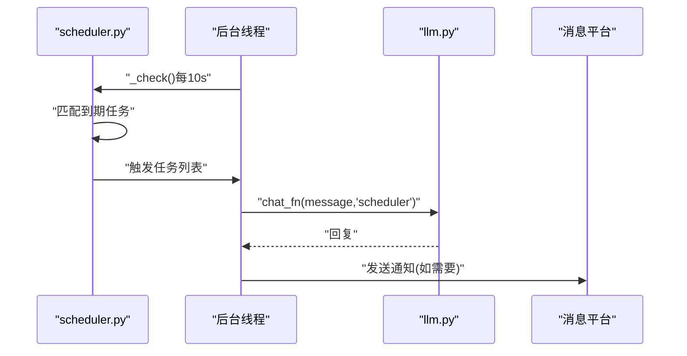
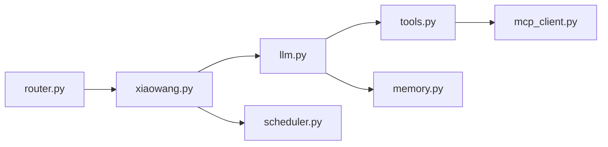

# API参考

<cite>
**本文档引用的文件**
- [README.md](file://README.md)
- [config.example.json](file://config.example.json)
- [xiaowang.py](file://xiaowang.py)
- [router.py](file://router.py)
- [llm.py](file://llm.py)
- [tools.py](file://tools.py)
- [mcp_client.py](file://mcp_client.py)
- [memory.py](file://memory.py)
- [scheduler.py](file://scheduler.py)
- [self_check_tool.py](file://self_check_tool.py)
</cite>

## 目录
1. [简介](#简介)
2. [项目结构](#项目结构)
3. [核心组件](#核心组件)
4. [架构总览](#架构总览)
5. [详细组件分析](#详细组件分析)
6. [依赖分析](#依赖分析)
7. [性能考虑](#性能考虑)
8. [故障排查指南](#故障排查指南)
9. [结论](#结论)
10. [附录](#附录)

## 简介
本项目是一个零框架依赖的生产级AI智能体系统，具备多租户路由、消息回调处理、工具调用循环、内存系统、MCP插件桥接、运行时工具创建、自修复与诊断、定时任务调度、多模态输入（文本/图片/语音/视频/链接）等功能。本文档面向开发者，提供完整的API参考，覆盖HTTP REST API、WebSocket实时交互、MCP JSON-RPC协议、工具API规范与错误处理，并给出请求/响应示例与调试建议。

## 项目结构
- 入口与HTTP服务：xiaowang.py 提供HTTP回调接收、消息去抖、多媒体处理、ASR语音识别与回复分片发送。
- 多租户路由：router.py 负责按发送者ID路由到独立容器，支持自动编排与健康检查。
- LLM与工具循环：llm.py 封装模型调用、会话管理、多模态消息构建、系统提示注入与工具循环。
- 工具系统：tools.py 定义工具注册、执行与内置26个工具，支持插件热加载与MCP工具桥接。
- MCP客户端：mcp_client.py 实现JSON-RPC over stdio/HTTP，自动重连与工具定义转换。
- 内存系统：memory.py 三阶段记忆管线（压缩/去重/检索），向LLM注入上下文。
- 调度器：scheduler.py 支持一次性与周期性任务，持久化到jobs.json。
- 配置：config.example.json 提供模型、消息平台、内存、ASR、视频生成、MCP服务器等配置项。

图表来源
- [xiaowang.py:597-626](file://xiaowang.py#L597-L626)
- [router.py:469-493](file://router.py#L469-L493)
- [llm.py:317-401](file://llm.py#L317-L401)
- [tools.py:58-74](file://tools.py#L58-L74)
- [memory.py:40-86](file://memory.py#L40-L86)
- [scheduler.py:30-43](file://scheduler.py#L30-L43)
- [mcp_client.py:272-334](file://mcp_client.py#L272-L334)
- [config.example.json:1-61](file://config.example.json#L1-L61)

章节来源
- [README.md:23-66](file://README.md#L23-L66)
- [config.example.json:1-61](file://config.example.json#L1-L61)

## 核心组件
- HTTP回调与消息处理：xiaowang.py 接收消息平台回调，进行去抖合并、多媒体下载与持久化、ASR转写、调用LLM工具循环并分片回复。
- 多租户路由：router.py 基于发送者ID将消息转发至对应容器，未知用户自动创建容器并等待健康检查。
- LLM与工具循环：llm.py 组合系统提示、会话历史与记忆检索，调用模型并根据tool_calls执行工具，最多20次迭代。
- 工具系统：tools.py 提供装饰器注册工具，内置26个工具，支持插件目录热加载与MCP工具桥接。
- MCP客户端：mcp_client.py 实现initialize/tools/list/tools/call JSON-RPC，支持stdio与HTTP传输，自动重连。
- 记忆系统：memory.py 通过压缩提取结构化记忆、向量嵌入、相似度去重后存入LanceDB，检索时注入系统提示。
- 调度器：scheduler.py 以jobs.json持久化任务，后台线程每10秒检查触发，支持一次性与周期性任务。

章节来源
- [xiaowang.py:489-588](file://xiaowang.py#L489-L588)
- [router.py:308-425](file://router.py#L308-L425)
- [llm.py:306-401](file://llm.py#L306-L401)
- [tools.py:36-74](file://tools.py#L36-L74)
- [mcp_client.py:27-91](file://mcp_client.py#L27-L91)
- [memory.py:88-119](file://memory.py#L88-L119)
- [scheduler.py:130-186](file://scheduler.py#L130-L186)

## 架构总览
系统采用“消息平台回调 -> 入口HTTP服务 -> LLM工具循环 -> 工具执行 -> 记忆/调度/消息平台”的闭环。多租户通过router.py按发送者ID路由到独立容器，实现隔离与弹性扩展。

图表来源
- [router.py:338-418](file://router.py#L338-L418)
- [xiaowang.py:489-588](file://xiaowang.py#L489-L588)
- [llm.py:317-401](file://llm.py#L317-L401)
- [memory.py:88-119](file://memory.py#L88-L119)
- [scheduler.py:166-186](file://scheduler.py#L166-L186)

## 详细组件分析

### HTTP REST API

- 基础信息
  - 端口：默认8080，可通过配置覆盖
  - 编解码：UTF-8 JSON
  - 主要端点：
    - GET /health：健康检查
    - GET /reload：重新加载路由表
    - GET /routes：查看当前路由表（调试）
    - POST /：消息平台回调入口
    - POST /test：测试对话（异步）

- 端点详情

  - GET /health
    - 功能：返回路由状态、容器数量与最大限制
    - 响应：JSON对象，字段包括status、routes、auto_containers、max_containers
    - 示例响应：{"status":"ok","routes":12,"auto_containers":8,"max_containers":20}

  - GET /reload
    - 功能：重新加载路由表
    - 响应：{"status":"reloaded","routes":N}

  - GET /routes
    - 功能：查看当前路由表（调试）
    - 响应：JSON对象，键为sender_id，值为容器地址

  - POST /
    - 功能：消息平台回调入口；立即返回200，实际处理在后台线程
    - 请求体：消息平台回调JSON（兼容data为dict或list）
    - 响应：空体，状态码200
    - 重要行为：
      - 自动跳过自身发送的消息（cmd=15000且senderId==userId）
      - 支持文本、图片、视频、文件、GIF、语音、链接、位置等消息类型
      - 语音消息触发ASR转写
      - 媒体消息下载并持久化，图片传给视觉模型

  - POST /test
    - 功能：测试对话（异步）
    - 请求体：{"message":"..."}
    - 响应：空体，状态码200

- 请求/响应示例（路径引用）
  - 请求示例（消息回调）：[回调数据示例路径:574-588](file://xiaowang.py#L574-L588)
  - 响应示例（/health）：[健康检查响应路径:314-323](file://router.py#L314-L323)

章节来源
- [router.py:314-337](file://router.py#L314-L337)
- [router.py:338-356](file://router.py#L338-L356)
- [xiaowang.py:559-592](file://xiaowang.py#L559-L592)
- [xiaowang.py:574-588](file://xiaowang.py#L574-L588)

### WebSocket API（ASR流式识别）

- 连接与认证
  - 协议：wss（WebSocket Secure）
  - 地址：从配置中读取ws_url，默认wss://asr-api.example.com/v2/asr
  - 认证：基于HMAC-SHA256签名，包含api_key、date、host与请求行
  - 参数：authorization、date、host

- 消息格式
  - 开始帧：包含common.app_id与business语言/领域/口音等参数
  - 连续帧：status=1，持续发送音频片段
  - 结束帧：status=2，表示结束
  - 返回：on_message解析data.data.result.ws中的词列表，拼接得到最终文本

- 事件类型与实时交互
  - on_open：开始发送音频数据
  - on_message：增量更新识别结果，当status==2时完成
  - on_error：错误事件
  - 流式特性：按约40ms间隔发送，模拟实时流

- 示例流程（序列图）

图表来源
- [xiaowang.py:186-284](file://xiaowang.py#L186-L284)

章节来源
- [xiaowang.py:137-284](file://xiaowang.py#L137-L284)

### MCP JSON-RPC 规范

- 协议概述
  - 传输：stdio（子进程标准IO）或HTTP（POST JSON）
  - 方法集：initialize、tools/list、tools/call
  - 命名空间：server__tool（双下划线分隔）
  - 错误处理：连接异常/超时自动重连；RPC错误映射为运行时错误

- 方法定义

  - initialize
    - 参数：protocolVersion、capabilities、clientInfo
    - 行为：握手并发送notifications/initialized通知（stdio）

  - tools/list
    - 返回：tools数组，每个元素含name、description、inputSchema
    - 转换：inputSchema直接复用为OpenAI函数调用参数定义

  - tools/call
    - 参数：name（server__tool）、arguments（字典）
    - 返回：MCP content数组，拼接为字符串；若为空则返回空串

- 执行流程（序列图）

图表来源
- [mcp_client.py:191-242](file://mcp_client.py#L191-L242)
- [mcp_client.py:296-310](file://mcp_client.py#L296-L310)

章节来源
- [mcp_client.py:27-91](file://mcp_client.py#L27-L91)
- [mcp_client.py:272-334](file://mcp_client.py#L272-L334)

### 工具API规范

- 注册与调用约定
  - 装饰器：@tool(name, description, properties, required=None)
  - 定义：返回OpenAI函数调用格式（type=function/function.parameters）
  - 执行：execute(name, args, ctx)，ctx包含owner_id、workspace、session_key
  - 返回：字符串结果，工具内部可抛异常由框架捕获并返回错误信息

- 内置工具概览（节选）
  - 核心：exec、message
  - 文件：read_file、write_file、edit_file、list_files
  - 调度：schedule、list_schedules、remove_schedule
  - 媒体发送：send_image、send_file、send_video、send_link
  - 视频：trim_video、add_bgm、generate_video
  - 搜索：web_search（多引擎）
  - 记忆：search_memory、recall
  - 诊断：self_check、diagnose
  - 插件：create_tool、list_custom_tools、remove_tool
  - MCP：reload_mcp

- 工具调用序列图（工具循环）

图表来源
- [llm.py:356-396](file://llm.py#L356-L396)
- [tools.py:58-74](file://tools.py#L58-L74)
- [mcp_client.py:296-310](file://mcp_client.py#L296-L310)

章节来源
- [tools.py:36-74](file://tools.py#L36-L74)
- [llm.py:306-401](file://llm.py#L306-L401)

### 记忆系统API

- 功能
  - 压缩：对话片段经LLM抽取结构化记忆
  - 去重：余弦相似度阈值0.92过滤重复
  - 检索：用户问题向量化后LanceDB检索Top-K

- 关键函数
  - retrieve(user_msg, session_key, top_k=None)：同步检索并格式化返回
  - compress_async(evicted_messages, session_key)：后台压缩并入库
  - get_cached_context(session_key)：硬件/语音通道零延迟上下文

- 数据流图

图表来源
- [memory.py:88-119](file://memory.py#L88-L119)
- [memory.py:158-187](file://memory.py#L158-L187)
- [memory.py:294-361](file://memory.py#L294-L361)

章节来源
- [memory.py:40-86](file://memory.py#L40-L86)
- [memory.py:88-119](file://memory.py#L88-L119)

### 调度器API

- 端点与行为
  - 添加任务：add(args) 支持delay_seconds或cron_expr，once可选
  - 列表任务：list_all()
  - 删除任务：remove(name)
  - 后台线程每10秒检查触发，一次性任务触发后移除，周期性任务更新last_run

- 任务触发
  - 触发时以message为用户消息调用chat_fn，session_key为"scheduler"
  - 失败时尝试通过chat_fn发送失败通知

- 序列图

图表来源
- [scheduler.py:130-186](file://scheduler.py#L130-L186)
- [scheduler.py:208-219](file://scheduler.py#L208-L219)

章节来源
- [scheduler.py:30-104](file://scheduler.py#L30-L104)
- [scheduler.py:130-186](file://scheduler.py#L130-L186)

## 依赖分析

- 模块耦合
  - xiaowang.py 依赖 llm.py、tools.py、scheduler.py、memory模块初始化
  - llm.py 依赖 tools.py 与 memory.py
  - tools.py 依赖 mcp_client.py（可选）与内置搜索/文件/视频等能力
  - router.py 依赖 Docker Engine API，负责容器编排与健康检查

- 外部依赖
  - croniter：定时任务解析
  - lancedb：向量数据库
  - websocket-client：ASR WebSocket客户端
  - 标准库：urllib、json、threading、subprocess等

图表来源
- [xiaowang.py:59-76](file://xiaowang.py#L59-L76)
- [llm.py:17-39](file://llm.py#L17-L39)
- [tools.py:80-83](file://tools.py#L80-L83)
- [router.py:87-116](file://router.py#L87-L116)

章节来源
- [xiaowang.py:59-76](file://xiaowang.py#L59-L76)
- [llm.py:17-39](file://llm.py#L17-L39)
- [tools.py:80-83](file://tools.py#L80-L83)
- [router.py:87-116](file://router.py#L87-L116)

## 性能考虑
- 会话截断与压缩：会话超过上限时压缩并注入长期记忆，减少历史消息体积
- 去重阈值：记忆去重阈值0.92降低冗余存储
- 零延迟缓存：硬件/语音通道预计算记忆上下文
- 工具循环上限：最多20次迭代，避免长链路阻塞
- 多线程与去抖：回调处理与ASR识别均采用线程池与去抖策略

[本节为通用指导，无需特定文件引用]

## 故障排查指南
- 常见错误与定位
  - 400/422模型错误：llm.py在HTTPError时输出响应体前500字符便于调试
  - 会话文件异常：diagnose工具检查会话首条消息合法性、tool_call_id匹配与孤儿tool消息
  - MCP连接失败：reload_mcp热重载，检查配置与进程状态
  - 容器未就绪：router.py健康检查超时，查看日志与资源限制

- 调试步骤
  - 使用/diagnostics工具收集会话、MCP、错误日志
  - 查看/jobs与/scheduler心跳日志
  - 检查内存/Memory文件状态
  - 使用/test端点验证LLM连通性

章节来源
- [llm.py:74-82](file://llm.py#L74-L82)
- [tools.py:929-1019](file://tools.py#L929-L1019)
- [router.py:222-237](file://router.py#L222-L237)
- [scheduler.py:188-206](file://scheduler.py#L188-L206)

## 结论
本API参考文档覆盖了724 Office的HTTP回调、WebSocket ASR、MCP JSON-RPC与工具系统的核心接口与行为。通过清晰的端点定义、参数说明、响应格式与错误处理指引，开发者可以快速集成消息平台、扩展工具能力、接入MCP服务器并部署多租户环境。

[本节为总结，无需特定文件引用]

## 附录

### 配置项说明（节选）
- models：默认模型与提供商列表（api_base、api_key、model、max_tokens）
- messaging：消息平台token、guid、api_url
- memory：是否启用、嵌入API（api_base、api_key、model、dimension）、检索Top-K与相似度阈值
- asr：ASR应用凭据与WebSocket地址
- video_api：视频生成API凭据与模型
- mcp_servers：MCP服务器配置（transport、command/args、env）

章节来源
- [config.example.json:1-61](file://config.example.json#L1-L61)

### 工具清单（节选）
- 核心：exec、message
- 文件：read_file、write_file、edit_file、list_files
- 调度：schedule、list_schedules、remove_schedule
- 媒体发送：send_image、send_file、send_video、send_link
- 视频：trim_video、add_bgm、generate_video
- 搜索：web_search（多引擎）
- 记忆：search_memory、recall
- 诊断：self_check、diagnose
- 插件：create_tool、list_custom_tools、remove_tool
- MCP：reload_mcp

章节来源
- [README.md:86-100](file://README.md#L86-L100)