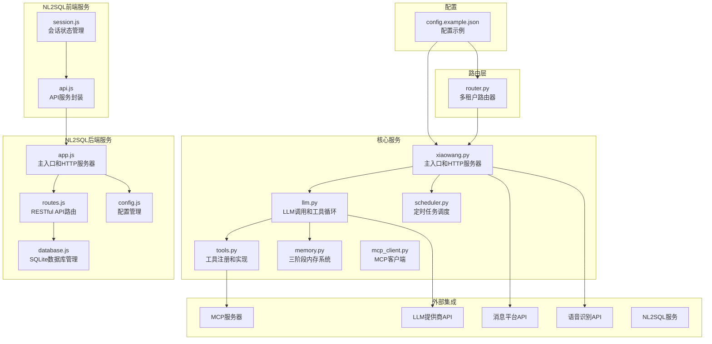
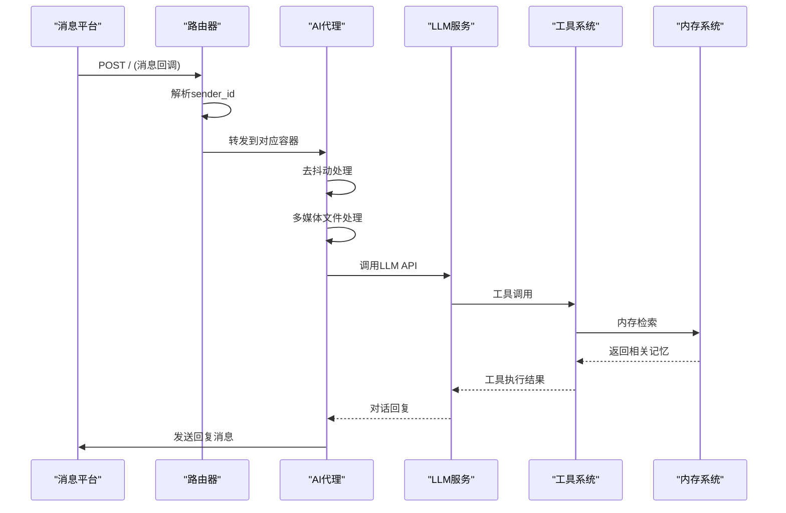

# HTTP API 文档

<cite>
**本文档引用的文件**
- [README.md](file://README.md)
- [xiaowang.py](file://xiaowang.py)
- [router.py](file://router.py)
- [llm.py](file://llm.py)
- [tools.py](file://tools.py)
- [memory.py](file://memory.py)
- [scheduler.py](file://scheduler.py)
- [mcp_client.py](file://mcp_client.py)
- [config.example.json](file://config.example.json)
- [routes.js](file://NL2SQL/backend/src/core/routes.js)
- [database.js](file://NL2SQL/backend/src/core/database.js)
- [config.js](file://NL2SQL/backend/src/core/config.js)
- [app.js](file://NL2SQL/backend/src/app.js)
- [session.js](file://NL2SQL/frontend/src/stores/session.js)
- [api.js](file://NL2SQL/frontend/src/utils/api.js)
</cite>

## 目录
1. [简介](#简介)
2. [项目结构](#项目结构)
3. [核心组件](#核心组件)
4. [架构概览](#架构概览)
5. [详细组件分析](#详细组件分析)
6. [NL2SQL RESTful API](#nl2sql-restful-api)
7. [依赖关系分析](#依赖关系分析)
8. [性能考虑](#性能考虑)
9. [故障排除指南](#故障排除指南)
10. [结论](#结论)

## 简介

724 Office 是一个基于纯Python构建的生产级AI代理系统，具有零框架依赖性。该项目实现了完整的多租户消息平台集成，支持企业微信等消息平台的回调处理，并提供了丰富的工具集和内存管理系统。

该系统的核心功能包括：
- 多租户路由和容器自动编排
- 消息回调处理和去抖动机制
- LLM工具使用循环和会话管理
- 三阶段内存系统（短期、长期、检索）
- 定时任务调度和通知
- MCP插件系统和外部工具集成

此外，NL2SQL子项目提供了完整的自然语言转SQL服务，包含RESTful API接口、会话管理和查询历史等功能。

## 项目结构



**图表来源**
- [xiaowang.py:1-626](file://xiaowang.py#L1-L626)
- [router.py:1-493](file://router.py#L1-L493)
- [app.js:1-238](file://app.js#L1-L238)
- [routes.js:1-621](file://routes.js#L1-L621)

**章节来源**
- [README.md:1-162](file://README.md#L1-L162)
- [config.example.json:1-61](file://config.example.json#L1-L61)

## 核心组件

### HTTP服务器组件

系统包含两个主要的HTTP服务器组件：

1. **主HTTP服务器** (`xiaowang.py`)
   - 监听端口8080（可配置）
   - 提供消息回调处理
   - 支持测试接口
   - 实现去抖动机制

2. **路由器HTTP服务器** (`router.py`)
   - 监听端口8080（可配置）
   - 处理多租户路由
   - 自动容器编排
   - 健康检查和负载均衡

3. **NL2SQL HTTP服务器** (`app.js`)
   - 监听端口3000（可配置）
   - 提供RESTful API服务
   - 支持会话管理、Schema查询、查询历史等功能
   - 集成SSE流式响应

### 消息处理组件

系统实现了完整的消息处理流水线：
- 消息回调接收和解析
- 去抖动缓冲和合并
- 多媒体文件下载和持久化
- ASR语音转文字
- LLM对话生成
- 消息分片和发送

**章节来源**
- [xiaowang.py:559-592](file://xiaowang.py#L559-L592)
- [router.py:309-425](file://router.py#L309-L425)

## 架构概览



**图表来源**
- [router.py:358-418](file://router.py#L358-L418)
- [xiaowang.py:489-554](file://xiaowang.py#L489-L554)

## 详细组件分析

### 主HTTP服务器 API

#### GET / - 健康检查端点

**功能描述**: 提供基本的健康检查响应，验证服务器运行状态。

**请求格式**:
- 方法: GET
- 路径: /
- 请求体: 无

**响应格式**:
```json
{
  "status": "ok",
  "service": "agent"
}
```

**状态码**:
- 200: 服务器正常运行

**请求示例**:
```bash
curl -X GET http://localhost:8080/
```

**响应示例**:
```json
{
  "status": "ok",
  "service": "agent"
}
```

**章节来源**
- [xiaowang.py:560-564](file://xiaowang.py#L560-L564)

#### POST / - 消息回调端点

**功能描述**: 接收来自消息平台的回调数据，进行去抖动处理和消息分发。

**请求格式**:
- 方法: POST
- 路径: /
- Content-Type: application/json
- 字段说明:
  - `data`: 消息数组或对象
  - `cmd`: 消息命令类型
  - `senderId`: 发送者ID
  - `msgType`: 消息类型
  - `msgData`: 消息数据对象

**响应格式**:
- 立即返回空响应体
- 异步处理消息并生成回复

**状态码**:
- 200: 回调已接收（立即响应）
- 500: 处理过程中发生错误

**请求示例**:
```json
{
  "data": [
    {
      "cmd": 15000,
      "senderId": "user_123",
      "msgType": 0,
      "msgData": {
        "content": "你好，AI助手"
      }
    }
  ]
}
```

**响应示例**:
- 立即响应: `""` (空字符串)

**消息类型定义**:
- 文本消息: `msgType = 0`
- 图片消息: `msgType = 7, 14, 101`
- 视频消息: `msgType = 22, 23, 103`
- 文件消息: `msgType = 15, 20, 102`
- GIF消息: `msgType = 29, 104`
- 语音消息: `msgType = 16`
- 链接消息: `msgType = 13`
- 位置消息: `msgType = 6`

**章节来源**
- [xiaowang.py:566-589](file://xiaowang.py#L566-L589)
- [xiaowang.py:489-554](file://xiaowang.py#L489-L554)

#### POST /test - 测试接口

**功能描述**: 提供异步测试功能，验证系统是否正常工作。

**请求格式**:
- 方法: POST
- 路径: /test
- Content-Type: application/json
- 字段: `message` (测试消息内容)

**响应格式**:
- 立即返回空响应体
- 异步执行LLM聊天并记录结果

**状态码**:
- 200: 测试请求已接收
- 500: LLM调用失败

**请求示例**:
```json
{
  "message": "测试消息"
}
```

**响应示例**:
- 立即响应: `""` (空字符串)

**章节来源**
- [xiaowang.py:579-586](file://xiaowang.py#L579-L586)

### 路由器HTTP服务器 API

#### GET /health - 路由器健康检查

**功能描述**: 提供路由器的健康状态信息，包括路由表统计和容器数量。

**请求格式**:
- 方法: GET
- 路径: /health

**响应格式**:
```json
{
  "status": "ok",
  "routes": 5,
  "auto_containers": 3,
  "max_containers": 20
}
```

**状态码**:
- 200: 路由器正常运行

**请求示例**:
```bash
curl -X GET http://localhost:8080/health
```

**响应示例**:
```json
{
  "status": "ok",
  "routes": 5,
  "auto_containers": 3,
  "max_containers": 20
}
```

**章节来源**
- [router.py:314-323](file://router.py#L314-L323)

#### GET /reload - 重新加载路由表

**功能描述**: 从持久化存储重新加载路由表配置。

**请求格式**:
- 方法: GET
- 路径: /reload

**响应格式**:
```json
{
  "status": "reloaded",
  "routes": 5
}
```

**状态码**:
- 200: 路由表重新加载成功

**请求示例**:
```bash
curl -X GET http://localhost:8080/reload
```

**响应示例**:
```json
{
  "status": "reloaded",
  "routes": 5
}
```

**章节来源**
- [router.py:325-328](file://router.py#L325-L328)

#### GET /routes - 查看路由表

**功能描述**: 返回当前的路由表配置，用于调试目的。

**请求格式**:
- 方法: GET
- 路径: /routes

**响应格式**: 路由表JSON对象（格式化输出）

**状态码**:
- 200: 路由表返回成功

**请求示例**:
```bash
curl -X GET http://localhost:8080/routes
```

**响应示例**:
```json
{
  "user_123": "http://agent-u123:8080",
  "user_456": "http://agent-u456:8080"
}
```

**章节来源**
- [router.py:330-333](file://router.py#L330-L333)

#### POST /api/chat - 语音通道代理

**功能描述**: 将语音通道的请求转发到默认后端服务。

**请求格式**:
- 方法: POST
- 路径: /api/chat
- Content-Type: application/json

**响应格式**: 直接转发后端服务的响应

**状态码**:
- 200: 转发成功
- 503: 未配置默认后端

**请求示例**:
```bash
curl -X POST http://localhost:8080/api/chat -d '{}' -H "Content-Type: application/json"
```

**响应示例**: 后端服务的原始响应

**章节来源**
- [router.py:342-349](file://router.py#L342-L349)

### 消息回调数据结构

系统支持多种消息类型的回调数据结构：

#### 文本消息
```json
{
  "cmd": 15000,
  "senderId": "user_123",
  "userId": "user_123",
  "msgType": 0,
  "msgData": {
    "content": "Hello World"
  }
}
```

#### 图片消息
```json
{
  "cmd": 15000,
  "senderId": "user_123",
  "msgType": 7,
  "msgData": {
    "fileId": "file_id_123",
    "fileAesKey": "aes_key",
    "fileSize": 1024000,
    "filename": "image.jpg"
  }
}
```

#### 语音消息
```json
{
  "cmd": 15000,
  "senderId": "user_123",
  "msgType": 16,
  "msgData": {
    "fileId": "voice_file_id",
    "fileAesKey": "voice_aes_key",
    "fileSize": 2048000
  }
}
```

#### 文件消息
```json
{
  "cmd": 15000,
  "senderId": "user_123",
  "msgType": 15,
  "msgData": {
    "filename": "document.pdf",
    "fileHttpUrl": "http://example.com/document.pdf",
    "fileSize": 512000
  }
}
```

**章节来源**
- [xiaowang.py:489-554](file://xiaowang.py#L489-L554)

### 错误处理和状态码

系统实现了完善的错误处理机制：

**HTTP状态码**:
- 200: 成功响应
- 400: 请求格式错误
- 500: 服务器内部错误
- 502: 反向代理错误
- 503: 服务不可用

**错误响应格式**:
```json
{
  "error": "错误描述",
  "code": "错误代码"
}
```

**常见错误场景**:
1. **无效JSON**: 解析回调数据失败
2. **未知消息类型**: 不支持的消息格式
3. **文件下载失败**: 多媒体文件无法下载
4. **LLM调用失败**: LLM API请求超时或错误
5. **工具执行失败**: 自定义工具调用异常

**章节来源**
- [xiaowang.py:574-577](file://xiaowang.py#L574-L577)
- [router.py:303-305](file://router.py#L303-L305)

## NL2SQL RESTful API

NL2SQL项目提供了完整的RESTful API服务，支持会话管理、Schema查询、查询历史等功能。

### 健康检查接口

#### GET /api/health - 基础健康检查

**功能描述**: 提供服务基础健康状态信息。

**请求格式**:
- 方法: GET
- 路径: /api/health

**响应格式**:
```json
{
  "status": "ok",
  "timestamp": "2024-01-01T00:00:00.000Z",
  "version": "1.0.0",
  "uptime": 1234.56,
  "memory": {
    "used": 128,
    "total": 512
  }
}
```

**状态码**:
- 200: 健康检查成功

**请求示例**:
```bash
curl -X GET http://localhost:3000/api/health
```

**响应示例**:
```json
{
  "status": "ok",
  "timestamp": "2024-01-01T00:00:00.000Z",
  "version": "1.0.0",
  "uptime": 1234.56,
  "memory": {
    "used": 128,
    "total": 512
  }
}
```

#### GET /api/health/detail - 详细健康检查

**功能描述**: 提供包含各组件状态的详细健康信息。

**请求格式**:
- 方法: GET
- 路径: /api/health/detail

**响应格式**:
```json
{
  "status": "ok",
  "timestamp": "2024-01-01T00:00:00.000Z",
  "components": {
    "database": {
      "status": "ok",
      "message": "SQLite连接正常"
    },
    "llm": {
      "status": "ok",
      "message": "LLM API配置正常"
    },
    "schema": {
      "status": "ok",
      "tables": 15
    },
    "sse": {
      "status": "ok",
      "connections": 3
    }
  }
}
```

**状态码**:
- 200: 健康检查成功
- 503: 某些组件异常

**请求示例**:
```bash
curl -X GET http://localhost:3000/api/health/detail
```

**响应示例**:
```json
{
  "status": "ok",
  "timestamp": "2024-01-01T00:00:00.000Z",
  "components": {
    "database": {
      "status": "ok",
      "message": "SQLite连接正常"
    },
    "llm": {
      "status": "ok",
      "message": "LLM API配置正常"
    },
    "schema": {
      "status": "ok",
      "tables": 15
    },
    "sse": {
      "status": "ok",
      "connections": 3
    }
  }
}
```

### Schema查询接口

#### GET /api/schema - 获取完整Schema信息

**功能描述**: 返回完整的数据库Schema信息，支持按类型筛选。

**请求格式**:
- 方法: GET
- 路径: /api/schema
- 查询参数:
  - `type`: 类型筛选（可选，支持 `tables`、`metrics`、`dimensions`）

**响应格式**: 完整Schema对象或按类型筛选的结果

**状态码**:
- 200: Schema信息获取成功
- 400: 缺少必要参数

**请求示例**:
```bash
# 获取完整Schema
curl -X GET http://localhost:3000/api/schema

# 仅获取表定义
curl -X GET "http://localhost:3000/api/schema?type=tables"
```

**响应示例**:
```json
{
  "version": "1.0",
  "tables": [...],
  "metrics": [...],
  "dimensions": [...]
}
```

#### GET /api/schema/tables/:tableName - 获取表详情

**功能描述**: 返回指定表的详细信息和关联表。

**请求格式**:
- 方法: GET
- 路径: /api/schema/tables/:tableName

**响应格式**:
```json
{
  "table": {...},
  "relatedTables": [...]
}
```

**状态码**:
- 200: 表详情获取成功
- 404: 表不存在

**请求示例**:
```bash
curl -X GET http://localhost:3000/api/schema/tables/users
```

**响应示例**:
```json
{
  "table": {
    "name": "users",
    "columns": [...],
    "primaryKey": "id"
  },
  "relatedTables": ["orders", "profiles"]
}
```

#### GET /api/schema/search - 搜索Schema

**功能描述**: 搜索相关的Schema对象。

**请求格式**:
- 方法: GET
- 路径: /api/schema/search
- 查询参数:
  - `q`: 搜索关键词（必需）
  - `limit`: 返回结果数量限制（默认5）

**响应格式**:
```json
{
  "query": "关键词",
  "count": 3,
  "tables": [...]
}
```

**状态码**:
- 200: 搜索成功
- 400: 缺少搜索关键词

**请求示例**:
```bash
curl -X GET "http://localhost:3000/api/schema/search?q=用户&limit=10"
```

**响应示例**:
```json
{
  "query": "用户",
  "count": 3,
  "tables": [
    {
      "name": "users",
      "score": 0.95
    }
  ]
}
```

### 会话管理接口

#### POST /api/sessions - 创建新会话

**功能描述**: 创建一个新的会话，返回会话ID。

**请求格式**:
- 方法: POST
- 路径: /api/sessions
- Content-Type: application/json
- 请求体:
  ```json
  {
    "user_id": "用户ID",
    "title": "会话标题（可选）"
  }
  ```

**响应格式**:
```json
{
  "id": "生成的会话ID",
  "user_id": "用户ID",
  "title": "会话标题"
  }
```

**状态码**:
- 201: 会话创建成功
- 500: 创建失败

**请求示例**:
```bash
curl -X POST http://localhost:3000/api/sessions \
  -H "Content-Type: application/json" \
  -d '{"user_id": "user_123", "title": "数据分析会话"}'
```

**响应示例**:
```json
{
  "id": "550e8400-e29b-41d4-a716-446655440000",
  "user_id": "user_123",
  "title": "数据分析会话"
}
```

#### GET /api/sessions/:sessionId - 获取会话信息

**功能描述**: 获取指定会话的详细信息。

**请求格式**:
- 方法: GET
- 路径: /api/sessions/:sessionId

**响应格式**:
```json
{
  "id": "会话ID",
  "user_id": "用户ID",
  "title": "会话标题",
  "created_at": "创建时间",
  "updated_at": "更新时间",
  "status": "active"
}
```

**状态码**:
- 200: 会话信息获取成功
- 404: 会话不存在
- 500: 获取失败

**请求示例**:
```bash
curl -X GET http://localhost:3000/api/sessions/550e8400-e29b-41d4-a716-446655440000
```

**响应示例**:
```json
{
  "id": "550e8400-e29b-41d4-a716-446655440000",
  "user_id": "user_123",
  "title": "数据分析会话",
  "created_at": "2024-01-01T00:00:00.000Z",
  "updated_at": "2024-01-01T00:00:00.000Z",
  "status": "active"
}
```

#### DELETE /api/sessions/:sessionId - 删除会话

**功能描述**: 删除指定会话及其所有相关数据。

**请求格式**:
- 方法: DELETE
- 路径: /api/sessions/:sessionId

**响应格式**:
```json
{
  "success": true,
  "message": "会话已删除"
}
```

**状态码**:
- 200: 会话删除成功
- 404: 会话不存在
- 500: 删除失败

**请求示例**:
```bash
curl -X DELETE http://localhost:3000/api/sessions/550e8400-e29b-41d4-a716-446655440000
```

**响应示例**:
```json
{
  "success": true,
  "message": "会话已删除"
}
```

**注意**: 删除会话会级联删除该会话下的所有消息和查询历史。

#### GET /api/sessions/:sessionId/messages - 获取会话消息历史

**功能描述**: 获取指定会话的消息历史记录。

**请求格式**:
- 方法: GET
- 路径: /api/sessions/:sessionId/messages
- 查询参数:
  - `limit`: 返回消息数量限制（默认50）

**响应格式**:
```json
{
  "session_id": "会话ID",
  "count": 10,
  "messages": [...]
}
```

**状态码**:
- 200: 消息历史获取成功
- 500: 获取失败

**请求示例**:
```bash
curl -X GET "http://localhost:3000/api/sessions/550e8400-e29b-41d4-a716-446655440000/messages?limit=100"
```

**响应示例**:
```json
{
  "session_id": "550e8400-e29b-41d4-a716-446655440000",
  "count": 10,
  "messages": [
    {
      "id": 1,
      "session_id": "550e8400-e29b-41d4-a716-446655440000",
      "role": "user",
      "content": "查询用户数据",
      "type": "text",
      "created_at": "2024-01-01T00:00:00.000Z"
    }
  ]
}
```

#### GET /api/users/:userId/sessions - 获取用户的所有会话

**功能描述**: 获取指定用户的所有会话列表。

**请求格式**:
- 方法: GET
- 路径: /api/users/:userId/sessions
- 查询参数:
  - `limit`: 返回会话数量限制（默认20）

**响应格式**:
```json
{
  "user_id": "用户ID",
  "count": 5,
  "sessions": [...]
}
```

**状态码**:
- 200: 会话列表获取成功
- 500: 获取失败

**请求示例**:
```bash
curl -X GET "http://localhost:3000/api/users/user_123/sessions?limit=50"
```

**响应示例**:
```json
{
  "user_id": "user_123",
  "count": 5,
  "sessions": [
    {
      "id": "550e8400-e29b-41d4-a716-446655440000",
      "user_id": "user_123",
      "title": "数据分析会话",
      "created_at": "2024-01-01T00:00:00.000Z",
      "updated_at": "2024-01-01T00:00:00.000Z",
      "status": "active"
    }
  ]
}
```

### 查询历史接口

#### GET /api/queries/history - 获取查询历史

**功能描述**: 获取查询历史记录，支持按用户和会话筛选。

**请求格式**:
- 方法: GET
- 路径: /api/queries/history
- 查询参数:
  - `user_id`: 用户ID筛选（可选）
  - `session_id`: 会话ID筛选（可选）
  - `limit`: 返回数量限制（默认20）

**响应格式**:
```json
{
  "count": 10,
  "history": [...]
}
```

**状态码**:
- 200: 查询历史获取成功
- 500: 获取失败

**请求示例**:
```bash
curl -X GET "http://localhost:3000/api/queries/history?user_id=user_123&limit=50"
```

**响应示例**:
```json
{
  "count": 10,
  "history": [
    {
      "id": 1,
      "session_id": "550e8400-e29b-41d4-a716-446655440000",
      "user_id": "user_123",
      "natural_query": "查询用户数据",
      "generated_sql": "SELECT * FROM users",
      "status": "success",
      "execution_time": 150,
      "row_count": 100,
      "created_at": "2024-01-01T00:00:00.000Z"
    }
  ]
}
```

### 统计信息接口

#### GET /api/stats - 获取服务统计信息

**功能描述**: 获取服务的实时统计信息。

**请求格式**:
- 方法: GET
- 路径: /api/stats

**响应格式**:
```json
{
  "timestamp": "2024-01-01T00:00:00.000Z",
  "connections": {
    "sse": 3
  },
  "queries": {
    "today": {
      "total_queries": 150,
      "success_count": 145,
      "failed_count": 5,
      "avg_execution_time": 250
    }
  },
  "schema": {
    "tables": 15,
    "metrics": 8,
    "dimensions": 12
  },
  "system": {
    "uptime": 1234.56,
    "memory": {
      "rss": 134217728,
      "heapTotal": 67108864,
      "heapUsed": 33554432
    },
    "node_version": "18.0.0"
  }
}
```

**状态码**:
- 200: 统计信息获取成功
- 500: 获取失败

**请求示例**:
```bash
curl -X GET http://localhost:3000/api/stats
```

**响应示例**:
```json
{
  "timestamp": "2024-01-01T00:00:00.000Z",
  "connections": {
    "sse": 3
  },
  "queries": {
    "today": {
      "total_queries": 150,
      "success_count": 145,
      "failed_count": 5,
      "avg_execution_time": 250
    }
  },
  "schema": {
    "tables": 15,
    "metrics": 8,
    "dimensions": 12
  },
  "system": {
    "uptime": 1234.56,
    "memory": {
      "rss": 134217728,
      "heapTotal": 67108864,
      "heapUsed": 33554432
    },
    "node_version": "18.0.0"
  }
}
```

### 配置接口

#### GET /api/config - 获取公开配置信息

**功能描述**: 获取服务的公开配置信息，不包含敏感信息。

**请求格式**:
- 方法: GET
- 路径: /api/config

**响应格式**:
```json
{
  "version": "1.0.0",
  "llm": {
    "model": "gpt-4",
    "api_base": "https://api.openai.com/v1"
  },
  "security": {
    "max_query_rows": 1000,
    "query_timeout": 30000
  },
  "features": {
    "streaming": true,
    "clarification": true,
    "vector_search": true
  }
}
```

**状态码**:
- 200: 配置信息获取成功

**请求示例**:
```bash
curl -X GET http://localhost:3000/api/config
```

**响应示例**:
```json
{
  "version": "1.0.0",
  "llm": {
    "model": "gpt-4",
    "api_base": "https://api.openai.com/v1"
  },
  "security": {
    "max_query_rows": 1000,
    "query_timeout": 30000
  },
  "features": {
    "streaming": true,
    "clarification": true,
    "vector_search": true
  }
}
```

### SSE流式响应接口

#### GET /api/sse/stream - 建立SSE连接

**功能描述**: 建立Server-Sent Events连接，用于接收流式消息。

**请求格式**:
- 方法: GET
- 路径: /api/sse/stream
- 查询参数:
  - `session_id`: 会话ID（必需）
  - `user_id`: 用户ID（可选，默认anonymous）

**响应格式**: 流式事件数据

**状态码**:
- 200: 连接建立成功
- 400: 缺少必要参数
- 500: 连接失败

**请求示例**:
```bash
curl -N "http://localhost:3000/api/sse/stream?session_id=550e8400-e29b-41d4-a716-446655440000"
```

**响应示例**:
```
data: {"type":"connected","data":{"message":"连接成功"}}
data: {"type":"processing","data":{"message":"正在生成SQL..."}}
data: {"type":"progress","data":{"message":"SQL生成完成","progress":100}}
data: {"type":"result","data":{"message":"查询完成","sql":"SELECT * FROM users","data":[...]}}

```

#### POST /api/sse/query - 发送查询请求

**功能描述**: 通过HTTP POST发送查询请求，结果通过SSE推送。

**请求格式**:
- 方法: POST
- 路径: /api/sse/query
- Content-Type: application/json
- 请求体:
  ```json
  {
    "session_id": "会话ID",
    "query": "查询内容"
  }
  ```

**响应格式**:
```json
{
  "success": true,
  "message": "查询已提交，请通过SSE接收结果"
}
```

**状态码**:
- 200: 查询提交成功
- 400: 缺少必要参数
- 500: 提交失败

**请求示例**:
```bash
curl -X POST http://localhost:3000/api/sse/query \
  -H "Content-Type: application/json" \
  -d '{"session_id":"550e8400-e29b-41d4-a716-446655440000","query":"查询用户数据"}'
```

**响应示例**:
```json
{
  "success": true,
  "message": "查询已提交，请通过SSE接收结果"
}
```

**章节来源**
- [routes.js:58-135](file://NL2SQL/backend/src/core/routes.js#L58-L135)
- [routes.js:141-248](file://NL2SQL/backend/src/core/routes.js#L141-L248)
- [routes.js:254-396](file://NL2SQL/backend/src/core/routes.js#L254-L396)
- [routes.js:402-505](file://NL2SQL/backend/src/core/routes.js#L402-L505)
- [routes.js:511-586](file://NL2SQL/backend/src/core/routes.js#L511-L586)

## 依赖关系分析

```mermaid
graph TD
subgraph "外部依赖"
HTTP[标准库HTTP服务器]
JSON[JSON处理]
THREAD[线程处理]
TIME[时间处理]
OS[操作系统接口]
EXPRESS[Express框架]
AXIOS[Axios HTTP客户端]
SQLITE[SQLite数据库]
UUID[UUID生成]
DAYJS[日期处理]
NODE_CRON[定时任务]
end
subgraph "核心模块"
XW[xiaowang.py]
RT[router.py]
LL[llm.py]
TM[tools.py]
ME[memory.py]
SC[scheduler.py]
MC[mcp_client.py]
end
subgraph "NL2SQL核心模块"
APP[app.js]
RT2[routes.js]
DB[database.js]
CFG[config.js]
end
subgraph "NL2SQL前端模块"
SES[session.js]
API[api.js]
end
subgraph "第三方服务"
LLM_API[LLM提供商API]
MSG_API[消息平台API]
ASR_API[语音识别API]
MCP_API[MCP服务器]
end
XW --> HTTP
XW --> JSON
XW --> THREAD
RT --> HTTP
RT --> JSON
RT --> THREAD
LL --> JSON
LL --> TIME
TM --> JSON
ME --> JSON
SC --> JSON
MC --> JSON
APP --> EXPRESS
APP --> HTTP
APP --> JSON
APP --> THREAD
RT2 --> EXPRESS
RT2 --> JSON
DB --> SQLITE
DB --> JSON
DB --> TIME
CFG --> JSON
CFG --> DAYJS
SES --> AXIOS
SES --> UUID
API --> AXIOS
API --> JSON
XW --> LLM_API
XW --> MSG_API
XW --> ASR_API
TM --> MCP_API
```



**图表来源**
- [xiaowang.py:15-76](file://xiaowang.py#L15-L76)
- [router.py:9-42](file://router.py#L9-L42)
- [app.js:22-51](file://app.js#L22-L51)
- [routes.js:16-27](file://routes.js#L16-L27)
- [database.js:12-20](file://database.js#L12-L20)
- [config.js:16-50](file://config.js#L16-L50)

**章节来源**
- [xiaowang.py:15-76](file://xiaowang.py#L15-L76)
- [router.py:9-42](file://router.py#L9-L42)
- [app.js:22-51](file://app.js#L22-L51)
- [routes.js:16-27](file://routes.js#L16-L27)
- [database.js:12-20](file://database.js#L12-L20)
- [config.js:16-50](file://config.js#L16-L50)

## 性能考虑

### 去抖动机制
系统实现了智能的去抖动机制，通过以下参数控制：
- 默认去抖动间隔: 3.0秒
- 最大消息大小: 1800字节
- 并发处理: 线程池管理

### NL2SQL性能优化

**数据库优化**:
- SQLite数据库使用外键约束和索引优化
- 会话、消息、查询历史表都有相应的索引
- 支持事务处理保证数据一致性

**内存管理**:
- 会话消息限制: 最多20条消息（可配置）
- 异步内存压缩: 后台线程处理
- 缓存策略: 零延迟硬件通道缓存

**并发处理**:
- Express服务器: 支持高并发请求
- 线程池: 每个请求独立线程
- 锁机制: 会话级别的线程安全
- 超时控制: LLM调用超时设置

**SSE流式处理**:
- Server-Sent Events支持实时数据推送
- 连接池管理多个并发连接
- 流式数据处理减少内存占用

## 故障排除指南

### 常见问题诊断

**问题1: 消息不被处理**
- 检查消息格式是否正确
- 验证senderId是否在允许列表中
- 确认去抖动时间是否过短

**问题2: LLM调用失败**
- 检查API密钥配置
- 验证网络连接
- 查看超时设置

**问题3: 多媒体文件下载失败**
- 检查文件权限
- 验证文件URL有效性
- 确认磁盘空间充足

**问题4: NL2SQL API调用失败**
- 检查数据库连接状态
- 验证会话ID有效性
- 查看请求参数格式

### 日志分析

系统提供了详细的日志记录：
- INFO级别: 正常操作和状态信息
- ERROR级别: 错误和异常情况
- DEBUG级别: 详细的技术信息

**章节来源**
- [xiaowang.py:357-363](file://xiaowang.py#L357-L363)
- [router.py:47-52](file://router.py#L47-L52)

## 结论

724 Office HTTP API提供了一个完整、健壮且易于扩展的消息平台集成解决方案。其设计特点包括：

1. **零框架依赖**: 使用纯Python标准库实现，部署简单
2. **多租户支持**: 自动容器编排和路由管理
3. **消息处理优化**: 去抖动、多媒体处理、ASR集成
4. **工具系统**: 丰富的内置工具和MCP插件支持
5. **内存管理**: 三阶段内存系统确保上下文连续性
6. **监控和诊断**: 完善的日志记录和健康检查

**NL2SQL子项目补充特性**:
- **完整的RESTful API**: 支持会话管理、Schema查询、查询历史等功能
- **数据库持久化**: 使用SQLite存储会话历史和查询记录
- **流式响应**: SSE支持实时数据推送
- **前后端分离**: Vue.js前端配合Node.js后端
- **配置管理**: 环境变量驱动的灵活配置
- **安全控制**: 白名单过滤、超时限制等安全措施

该系统适合需要自托管AI代理服务的企业和开发者使用，提供了高度可定制的解决方案。