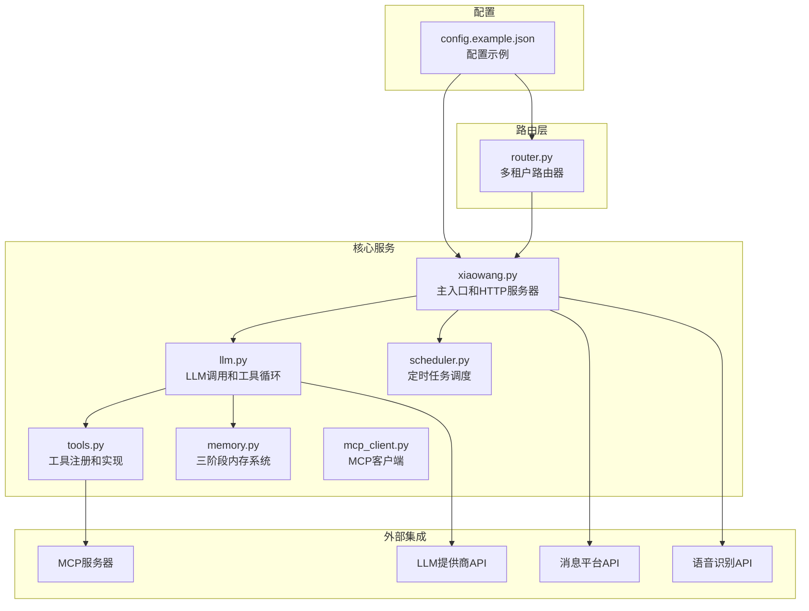
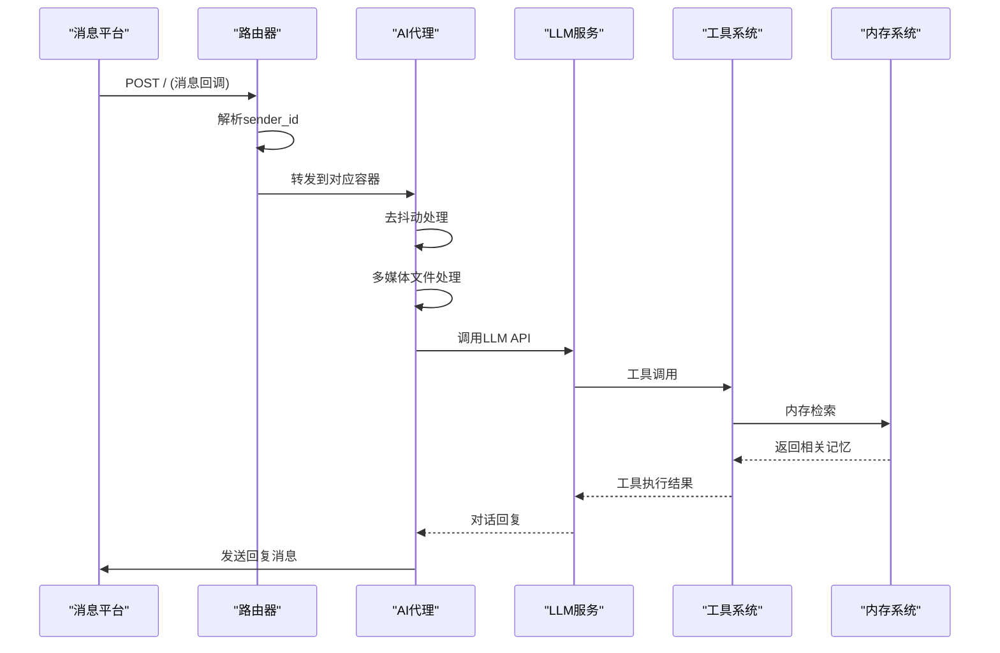
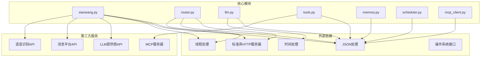

# HTTP API 文档

<cite>
**本文档引用的文件**
- [README.md](file://README.md)
- [xiaowang.py](file://xiaowang.py)
- [router.py](file://router.py)
- [llm.py](file://llm.py)
- [tools.py](file://tools.py)
- [memory.py](file://memory.py)
- [scheduler.py](file://scheduler.py)
- [mcp_client.py](file://mcp_client.py)
- [config.example.json](file://config.example.json)
</cite>

## 目录
1. [简介](#简介)
2. [项目结构](#项目结构)
3. [核心组件](#核心组件)
4. [架构概览](#架构概览)
5. [详细组件分析](#详细组件分析)
6. [依赖关系分析](#依赖关系分析)
7. [性能考虑](#性能考虑)
8. [故障排除指南](#故障排除指南)
9. [结论](#结论)

## 简介

724 Office 是一个基于纯Python构建的生产级AI代理系统，具有零框架依赖性。该项目实现了完整的多租户消息平台集成，支持企业微信等消息平台的回调处理，并提供了丰富的工具集和内存管理系统。

该系统的核心功能包括：
- 多租户路由和容器自动编排
- 消息回调处理和去抖动机制
- LLM工具使用循环和会话管理
- 三阶段内存系统（短期、长期、检索）
- 定时任务调度和通知
- MCP插件系统和外部工具集成

## 项目结构



**图表来源**
- [xiaowang.py:1-626](file://xiaowang.py#L1-L626)
- [router.py:1-493](file://router.py#L1-L493)

**章节来源**
- [README.md:1-162](file://README.md#L1-L162)
- [config.example.json:1-61](file://config.example.json#L1-L61)

## 核心组件

### HTTP服务器组件

系统包含两个主要的HTTP服务器组件：

1. **主HTTP服务器** (`xiaowang.py`)
   - 监听端口8080（可配置）
   - 提供消息回调处理
   - 支持测试接口
   - 实现去抖动机制

2. **路由器HTTP服务器** (`router.py`)
   - 监听端口8080（可配置）
   - 处理多租户路由
   - 自动容器编排
   - 健康检查和负载均衡

### 消息处理组件

系统实现了完整的消息处理流水线：
- 消息回调接收和解析
- 去抖动缓冲和合并
- 多媒体文件下载和持久化
- ASR语音转文字
- LLM对话生成
- 消息分片和发送

**章节来源**
- [xiaowang.py:559-592](file://xiaowang.py#L559-L592)
- [router.py:309-425](file://router.py#L309-L425)

## 架构概览



**图表来源**
- [router.py:358-418](file://router.py#L358-L418)
- [xiaowang.py:489-554](file://xiaowang.py#L489-L554)

## 详细组件分析

### 主HTTP服务器 API

#### GET / - 健康检查端点

**功能描述**: 提供基本的健康检查响应，验证服务器运行状态。

**请求格式**:
- 方法: GET
- 路径: /
- 请求体: 无

**响应格式**:
```json
{
  "status": "ok",
  "service": "agent"
}
```

**状态码**:
- 200: 服务器正常运行

**请求示例**:
```bash
curl -X GET http://localhost:8080/
```

**响应示例**:
```json
{
  "status": "ok",
  "service": "agent"
}
```

**章节来源**
- [xiaowang.py:560-564](file://xiaowang.py#L560-L564)

#### POST / - 消息回调端点

**功能描述**: 接收来自消息平台的回调数据，进行去抖动处理和消息分发。

**请求格式**:
- 方法: POST
- 路径: /
- Content-Type: application/json
- 字段说明:
  - `data`: 消息数组或对象
  - `cmd`: 消息命令类型
  - `senderId`: 发送者ID
  - `msgType`: 消息类型
  - `msgData`: 消息数据对象

**响应格式**:
- 立即返回空响应体
- 异步处理消息并生成回复

**状态码**:
- 200: 回调已接收（立即响应）
- 500: 处理过程中发生错误

**请求示例**:
```json
{
  "data": [
    {
      "cmd": 15000,
      "senderId": "user_123",
      "msgType": 0,
      "msgData": {
        "content": "你好，AI助手"
      }
    }
  ]
}
```

**响应示例**:
- 立即响应: `""` (空字符串)

**消息类型定义**:
- 文本消息: `msgType = 0`
- 图片消息: `msgType = 7, 14, 101`
- 视频消息: `msgType = 22, 23, 103`
- 文件消息: `msgType = 15, 20, 102`
- GIF消息: `msgType = 29, 104`
- 语音消息: `msgType = 16`
- 链接消息: `msgType = 13`
- 位置消息: `msgType = 6`

**章节来源**
- [xiaowang.py:566-589](file://xiaowang.py#L566-L589)
- [xiaowang.py:489-554](file://xiaowang.py#L489-L554)

#### POST /test - 测试接口

**功能描述**: 提供异步测试功能，验证系统是否正常工作。

**请求格式**:
- 方法: POST
- 路径: /test
- Content-Type: application/json
- 字段: `message` (测试消息内容)

**响应格式**:
- 立即返回空响应体
- 异步执行LLM聊天并记录结果

**状态码**:
- 200: 测试请求已接收
- 500: LLM调用失败

**请求示例**:
```json
{
  "message": "测试消息"
}
```

**响应示例**:
- 立即响应: `""` (空字符串)

**章节来源**
- [xiaowang.py:579-586](file://xiaowang.py#L579-L586)

### 路由器HTTP服务器 API

#### GET /health - 路由器健康检查

**功能描述**: 提供路由器的健康状态信息，包括路由表统计和容器数量。

**请求格式**:
- 方法: GET
- 路径: /health

**响应格式**:
```json
{
  "status": "ok",
  "routes": 5,
  "auto_containers": 3,
  "max_containers": 20
}
```

**状态码**:
- 200: 路由器正常运行

**请求示例**:
```bash
curl -X GET http://localhost:8080/health
```

**响应示例**:
```json
{
  "status": "ok",
  "routes": 5,
  "auto_containers": 3,
  "max_containers": 20
}
```

**章节来源**
- [router.py:314-323](file://router.py#L314-L323)

#### GET /reload - 重新加载路由表

**功能描述**: 从持久化存储重新加载路由表配置。

**请求格式**:
- 方法: GET
- 路径: /reload

**响应格式**:
```json
{
  "status": "reloaded",
  "routes": 5
}
```

**状态码**:
- 200: 路由表重新加载成功

**请求示例**:
```bash
curl -X GET http://localhost:8080/reload
```

**响应示例**:
```json
{
  "status": "reloaded",
  "routes": 5
}
```

**章节来源**
- [router.py:325-328](file://router.py#L325-L328)

#### GET /routes - 查看路由表

**功能描述**: 返回当前的路由表配置，用于调试目的。

**请求格式**:
- 方法: GET
- 路径: /routes

**响应格式**: 路由表JSON对象（格式化输出）

**状态码**:
- 200: 路由表返回成功

**请求示例**:
```bash
curl -X GET http://localhost:8080/routes
```

**响应示例**:
```json
{
  "user_123": "http://agent-u123:8080",
  "user_456": "http://agent-u456:8080"
}
```

**章节来源**
- [router.py:330-333](file://router.py#L330-L333)

#### POST /api/chat - 语音通道代理

**功能描述**: 将语音通道的请求转发到默认后端服务。

**请求格式**:
- 方法: POST
- 路径: /api/chat
- Content-Type: application/json

**响应格式**: 直接转发后端服务的响应

**状态码**:
- 200: 转发成功
- 503: 未配置默认后端

**请求示例**:
```bash
curl -X POST http://localhost:8080/api/chat -d '{}' -H "Content-Type: application/json"
```

**响应示例**: 后端服务的原始响应

**章节来源**
- [router.py:342-349](file://router.py#L342-L349)

### 消息回调数据结构

系统支持多种消息类型的回调数据结构：

#### 文本消息
```json
{
  "cmd": 15000,
  "senderId": "user_123",
  "userId": "user_123",
  "msgType": 0,
  "msgData": {
    "content": "Hello World"
  }
}
```

#### 图片消息
```json
{
  "cmd": 15000,
  "senderId": "user_123",
  "msgType": 7,
  "msgData": {
    "fileId": "file_id_123",
    "fileAesKey": "aes_key",
    "fileSize": 1024000,
    "filename": "image.jpg"
  }
}
```

#### 语音消息
```json
{
  "cmd": 15000,
  "senderId": "user_123",
  "msgType": 16,
  "msgData": {
    "fileId": "voice_file_id",
    "fileAesKey": "voice_aes_key",
    "fileSize": 2048000
  }
}
```

#### 文件消息
```json
{
  "cmd": 15000,
  "senderId": "user_123",
  "msgType": 15,
  "msgData": {
    "filename": "document.pdf",
    "fileHttpUrl": "http://example.com/document.pdf",
    "fileSize": 512000
  }
}
```

**章节来源**
- [xiaowang.py:489-554](file://xiaowang.py#L489-L554)

### 错误处理和状态码

系统实现了完善的错误处理机制：

**HTTP状态码**:
- 200: 成功响应
- 400: 请求格式错误
- 500: 服务器内部错误
- 502: 反向代理错误
- 503: 服务不可用

**错误响应格式**:
```json
{
  "error": "错误描述",
  "code": "错误代码"
}
```

**常见错误场景**:
1. **无效JSON**: 解析回调数据失败
2. **未知消息类型**: 不支持的消息格式
3. **文件下载失败**: 多媒体文件无法下载
4. **LLM调用失败**: LLM API请求超时或错误
5. **工具执行失败**: 自定义工具调用异常

**章节来源**
- [xiaowang.py:574-577](file://xiaowang.py#L574-L577)
- [router.py:303-305](file://router.py#L303-L305)

## 依赖关系分析



**图表来源**
- [xiaowang.py:15-30](file://xiaowang.py#L15-L30)
- [router.py:9-19](file://router.py#L9-L19)

**章节来源**
- [xiaowang.py:15-76](file://xiaowang.py#L15-L76)
- [router.py:9-42](file://router.py#L9-L42)

## 性能考虑

### 去抖动机制
系统实现了智能的去抖动机制，通过以下参数控制：
- 默认去抖动间隔: 3.0秒
- 最大消息大小: 1800字节
- 并发处理: 线程池管理

### 内存管理
- 会话消息限制: 最多40条消息
- 异步内存压缩: 后台线程处理
- 缓存策略: 零延迟硬件通道缓存

### 并发处理
- 线程池: 每个请求独立线程
- 锁机制: 会话级别的线程安全
- 超时控制: LLM调用超时设置

## 故障排除指南

### 常见问题诊断

**问题1: 消息不被处理**
- 检查消息格式是否正确
- 验证senderId是否在允许列表中
- 确认去抖动时间是否过短

**问题2: LLM调用失败**
- 检查API密钥配置
- 验证网络连接
- 查看超时设置

**问题3: 多媒体文件下载失败**
- 检查文件权限
- 验证文件URL有效性
- 确认磁盘空间充足

### 日志分析

系统提供了详细的日志记录：
- INFO级别: 正常操作和状态信息
- ERROR级别: 错误和异常情况
- DEBUG级别: 详细的技术信息

**章节来源**
- [xiaowang.py:357-363](file://xiaowang.py#L357-L363)
- [router.py:47-52](file://router.py#L47-L52)

## 结论

724 Office HTTP API提供了一个完整、健壮且易于扩展的消息平台集成解决方案。其设计特点包括：

1. **零框架依赖**: 使用纯Python标准库实现，部署简单
2. **多租户支持**: 自动容器编排和路由管理
3. **消息处理优化**: 去抖动、多媒体处理、ASR集成
4. **工具系统**: 丰富的内置工具和MCP插件支持
5. **内存管理**: 三阶段内存系统确保上下文连续性
6. **监控和诊断**: 完善的日志记录和健康检查

该系统适合需要自托管AI代理服务的企业和开发者使用，提供了高度可定制的解决方案。