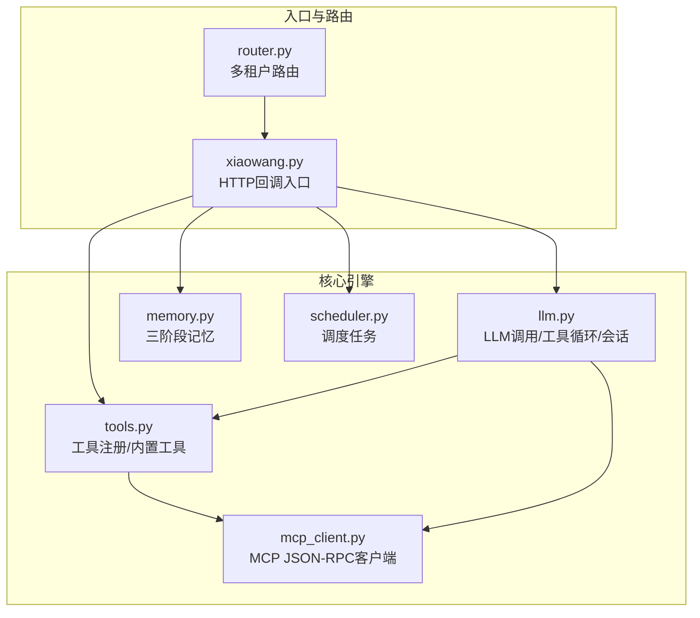
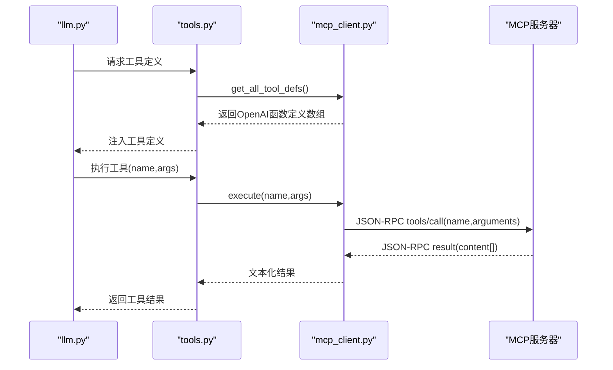
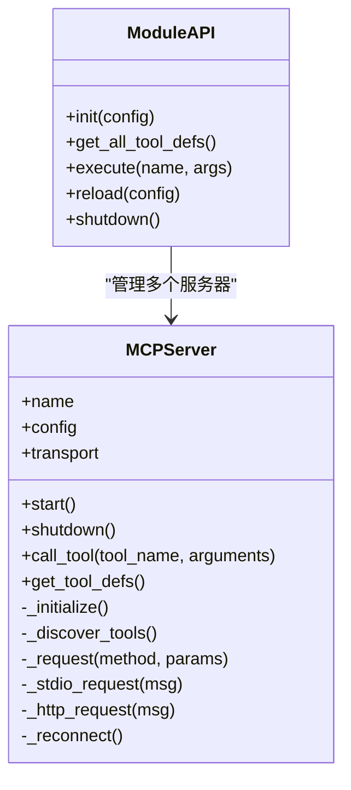
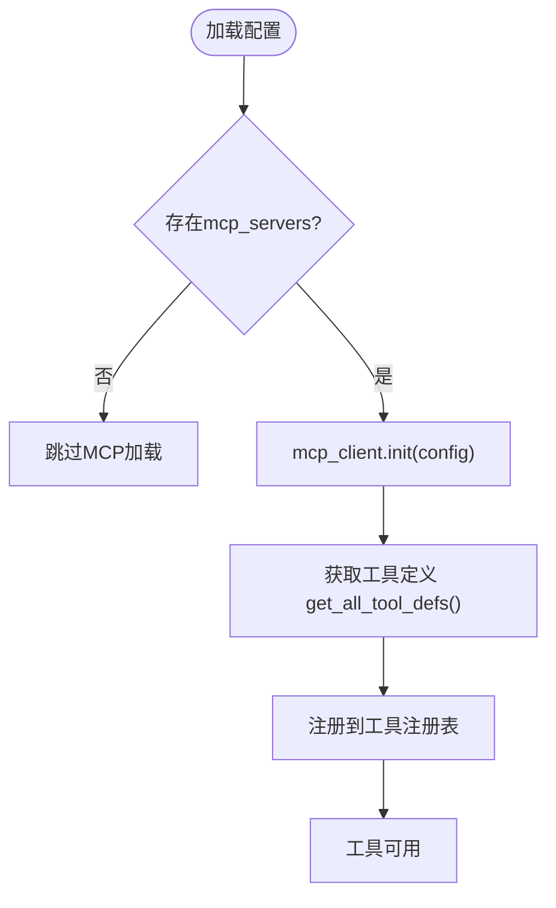
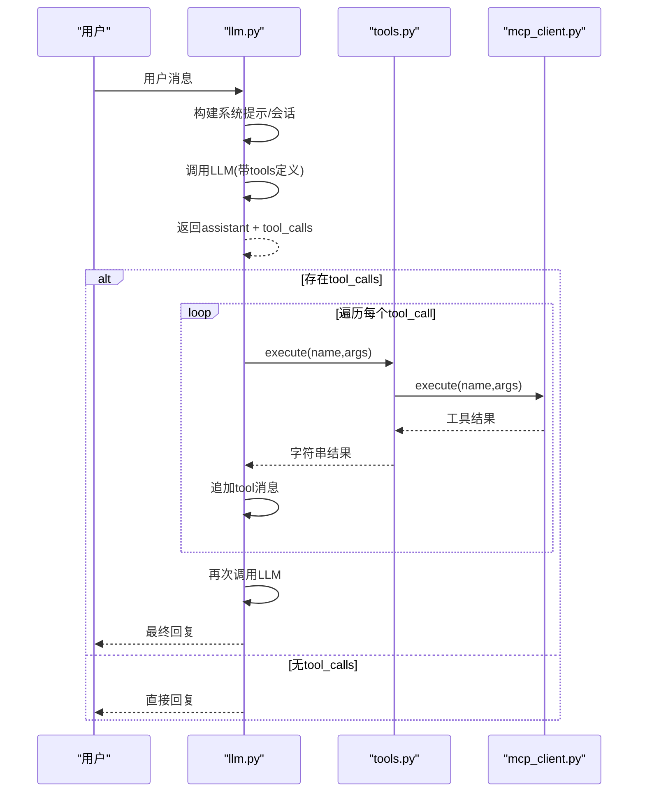
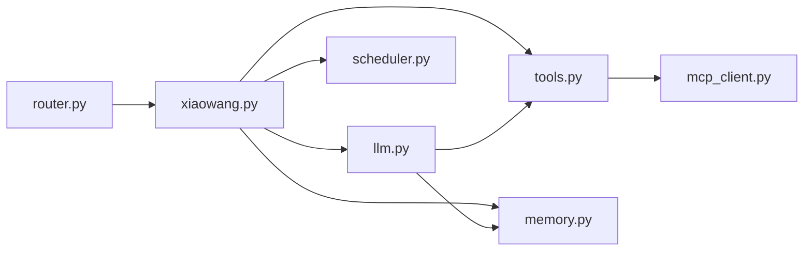

# MCP协议

<cite>
**本文引用的文件列表**
- [README.md](file://README.md)
- [mcp_client.py](file://mcp_client.py)
- [tools.py](file://tools.py)
- [llm.py](file://llm.py)
- [xiaowang.py](file://xiaowang.py)
- [config.example.json](file://config.example.json)
- [router.py](file://router.py)
- [memory.py](file://memory.py)
- [scheduler.py](file://scheduler.py)
</cite>

## 目录
1. [简介](#简介)
2. [项目结构](#项目结构)
3. [核心组件](#核心组件)
4. [架构总览](#架构总览)
5. [详细组件分析](#详细组件分析)
6. [依赖关系分析](#依赖关系分析)
7. [性能考量](#性能考量)
8. [故障排查指南](#故障排查指南)
9. [结论](#结论)
10. [附录](#附录)

## 简介
本文件系统性梳理并说明本仓库中实现的MCP（Model Context Protocol）桥接方案，重点覆盖：
- MCP JSON-RPC协议规范与实现要点（方法、参数、响应）
- 客户端初始化、连接建立与消息处理机制
- 工具集成流程：工具发现、调用与结果返回
- MCP服务器开发指南与客户端集成示例

本实现为自研JSON-RPC适配器，不依赖第三方MCP SDK，仅使用标准库与少量外部包，确保零框架依赖、可直接运行与热重载。

## 项目结构
本项目围绕“多租户代理 + 工具系统 + MCP桥接”组织，关键模块如下：
- 入口与路由：xiaowang.py（HTTP回调入口）、router.py（多租户容器路由）
- 核心对话与工具循环：llm.py（LLM调用、会话管理、工具循环）
- 工具注册与内置工具：tools.py（装饰器注册、工具定义与实现）
- MCP桥接：mcp_client.py（JSON-RPC客户端、工具发现与调用）
- 记忆系统：memory.py（三阶段记忆管线）
- 调度系统：scheduler.py（一次性与周期任务）

图表来源
- [xiaowang.py:1-626](file://xiaowang.py#L1-L626)
- [llm.py:1-401](file://llm.py#L1-L401)
- [tools.py:1-1153](file://tools.py#L1-L1153)
- [mcp_client.py:1-334](file://mcp_client.py#L1-L334)
- [router.py:1-493](file://router.py#L1-L493)
- [memory.py:1-361](file://memory.py#L1-L361)
- [scheduler.py:1-219](file://scheduler.py#L1-L219)

章节来源
- [README.md:1-162](file://README.md#L1-L162)
- [xiaowang.py:1-626](file://xiaowang.py#L1-L626)
- [router.py:1-493](file://router.py#L1-L493)

## 核心组件
- MCP客户端（mcp_client.py）
  - 单服务器连接类：MCPServer，负责生命周期、JSON-RPC请求、工具发现与调用
  - 模块级API：init、get_all_tool_defs、execute、reload、shutdown
- 工具系统（tools.py）
  - 工具装饰器与注册表；加载MCP工具并注入到注册表；提供热重载工具
- 对话与工具循环（llm.py）
  - 构建系统提示、会话管理、多模态消息、工具循环与结果回写
- 配置（config.example.json）
  - 包含mcp_servers配置示例，支持stdio与HTTP两种传输方式

章节来源
- [mcp_client.py:1-334](file://mcp_client.py#L1-L334)
- [tools.py:1-1153](file://tools.py#L1-L1153)
- [llm.py:1-401](file://llm.py#L1-L401)
- [config.example.json:1-61](file://config.example.json#L1-L61)

## 架构总览
MCP桥接在工具系统中作为“外置工具源”，通过JSON-RPC与外部MCP服务器交互。整体流程：
- 初始化时读取配置，启动各MCP服务器连接
- 执行工具循环时，将MCP工具定义注入到OpenAI函数调用格式中
- 当LLM选择调用某个MCP工具时，由工具系统转发至mcp_client执行
- mcp_client将工具调用转换为JSON-RPC请求，经stdio或HTTP发送到服务器，解析响应并返回

图表来源
- [llm.py:317-401](file://llm.py#L317-L401)
- [tools.py:63-74](file://tools.py#L63-L74)
- [mcp_client.py:296-310](file://mcp_client.py#L296-L310)
- [mcp_client.py:210-242](file://mcp_client.py#L210-L242)

## 详细组件分析

### MCP客户端（mcp_client.py）
- 协议与传输
  - 采用JSON-RPC 2.0，仅实现initialize、tools/list、tools/call三个方法
  - 支持stdio与HTTP两种传输：stdio通过子进程stdin/stdout；HTTP通过POST请求
- 生命周期与握手
  - start：根据transport启动进程或验证HTTP连通性，随后进行initialize握手并发送notifications/initialized通知（stdio）
  - shutdown：关闭子进程stdin并等待退出
  - _reconnect：stdio模式下崩溃后自动重启并重新握手
- 请求与响应
  - _request：构造jsonrpc消息，按transport选择stdio或HTTP实现
  - _stdio_request/_http_request：分别处理stdio与HTTP请求，包含超时、错误解析与异常抛出
- 工具发现与调用
  - _discover_tools：调用tools/list获取工具清单
  - call_tool：调用tools/call，将MCP返回的content数组拼接为字符串
  - get_tool_defs：将MCP工具定义转换为OpenAI函数调用格式，命名空间为“servername__toolname”
- 模块级API
  - init：遍历配置中的mcp_servers，逐一连接
  - get_all_tool_defs：聚合所有服务器的工具定义
  - execute：按“server__tool”名称调用工具
  - reload/shutdown：热重载与关闭所有连接

图表来源
- [mcp_client.py:27-334](file://mcp_client.py#L27-L334)

章节来源
- [mcp_client.py:1-334](file://mcp_client.py#L1-L334)

### 工具系统（tools.py）
- 工具注册与定义
  - 使用装饰器注册工具，生成OpenAI函数调用格式定义
  - 提供工具执行入口execute，统一捕获异常并返回错误信息
- MCP工具加载与热重载
  - _load_mcp_servers：初始化时连接MCP服务器并将工具注册到注册表
  - _reload_mcp：热重载MCP服务器，移除旧工具、注册新工具、统计变化
- 内置工具（节选）
  - 文件操作、消息发送、视频处理、网络搜索、计划任务等

图表来源
- [tools.py:1138-1152](file://tools.py#L1138-L1152)
- [mcp_client.py:272-294](file://mcp_client.py#L272-L294)

章节来源
- [tools.py:1-1153](file://tools.py#L1-L1153)
- [mcp_client.py:272-334](file://mcp_client.py#L272-L334)

### 对话与工具循环（llm.py）
- LLM调用
  - 组装OpenAI兼容的chat/completions请求，携带tools定义与消息历史
  - 解析响应，提取assistant消息与tool_calls
- 工具循环
  - 遍历tool_calls，逐个调用工具执行，将结果以tool角色消息写回历史
  - 最终返回assistant的最终回复
- 多模态与会话
  - 支持图片消息（base64 data URI），会话持久化与压缩
  - 与记忆系统结合，检索相关记忆注入系统提示

图表来源
- [llm.py:317-401](file://llm.py#L317-L401)
- [tools.py:63-74](file://tools.py#L63-L74)
- [mcp_client.py:296-310](file://mcp_client.py#L296-L310)

章节来源
- [llm.py:1-401](file://llm.py#L1-L401)

### 配置与入口（config.example.json、xiaowang.py）
- 配置
  - models、messaging、memory、asr、video_api、mcp_servers等
  - mcp_servers示例展示stdio与HTTP两种传输方式
- 入口
  - xiaowang.py启动HTTP服务，接收平台回调，触发工具循环
  - 初始化内存、调度、工具系统，加载MCP服务器

章节来源
- [config.example.json:1-61](file://config.example.json#L1-L61)
- [xiaowang.py:1-626](file://xiaowang.py#L1-L626)

## 依赖关系分析
- 模块耦合
  - llm.py依赖tools.py与memory.py；tools.py依赖mcp_client.py以加载MCP工具
  - xiaowang.py作为入口，串联llm、tools、memory、scheduler与router
- 外部依赖
  - 标准库为主；部分模块使用croniter、lancedb、websocket-client
- 循环依赖
  - 通过延迟导入避免：tools.py在需要时才导入mcp_client

图表来源
- [xiaowang.py:1-626](file://xiaowang.py#L1-L626)
- [llm.py:1-401](file://llm.py#L1-L401)
- [tools.py:1-1153](file://tools.py#L1-L1153)
- [mcp_client.py:1-334](file://mcp_client.py#L1-L334)
- [router.py:1-493](file://router.py#L1-L493)
- [memory.py:1-361](file://memory.py#L1-L361)
- [scheduler.py:1-219](file://scheduler.py#L1-L219)

章节来源
- [xiaowang.py:1-626](file://xiaowang.py#L1-L626)
- [tools.py:1-1153](file://tools.py#L1-L1153)

## 性能考量
- MCP调用超时与重试
  - stdio请求默认30秒超时；工具调用失败时尝试一次自动重连（stdio）
- 工具循环上限
  - 默认最多20轮迭代，避免长时间阻塞
- 并发与锁
  - 会话级线程锁保证同一会话内串行处理
- 记忆与检索
  - 向量检索与去重阈值控制，减少无关记忆注入带来的开销

章节来源
- [mcp_client.py:150-156](file://mcp_client.py#L150-L156)
- [mcp_client.py:217-226](file://mcp_client.py#L217-L226)
- [llm.py:358-399](file://llm.py#L358-L399)
- [llm.py:310-322](file://llm.py#L310-L322)
- [memory.py:321-338](file://memory.py#L321-L338)

## 故障排查指南
- MCP连接问题
  - 检查mcp_servers配置是否正确（transport、command/args/url）
  - stdio模式下确认命令存在且可执行；必要时使用超时命令查看启动错误
  - HTTP模式下检查URL可达性与超时设置
- 工具调用失败
  - 查看日志中的错误码与消息；确认工具名格式为“server__tool”
  - 若stdio崩溃，客户端会尝试自动重连一次
- 热重载
  - 使用reload_mcp工具在不重启的情况下重新加载MCP配置
  - 观察日志输出的新增/移除服务器统计

章节来源
- [mcp_client.py:272-334](file://mcp_client.py#L272-L334)
- [tools.py:1097-1132](file://tools.py#L1097-L1132)
- [tools.py:980-1001](file://tools.py#L980-L1001)

## 结论
本实现以最小依赖实现了MCP JSON-RPC桥接，具备以下特点：
- 明确的协议边界：仅实现initialize、tools/list、tools/call
- 双传输支持：stdio与HTTP，满足不同部署场景
- 热重载能力：无需重启即可更新MCP服务器配置
- 与工具系统的无缝集成：工具定义注入OpenAI函数调用格式，工具循环天然支持MCP工具

## 附录

### MCP JSON-RPC协议规范（基于实现）
- 协议版本
  - protocolVersion: 2024-11-05
- 方法与参数
  - initialize
    - 参数：protocolVersion、capabilities、clientInfo
    - 响应：无特定字段要求
  - notifications/initialized
    - 通知：无id字段，用于stdio握手完成后的通知
  - tools/list
    - 参数：无
    - 响应：tools数组（每项含name、description、inputSchema等）
  - tools/call
    - 参数：name（工具名）、arguments（对象）
    - 响应：result.content数组（文本类型拼接为字符串，非文本序列化为JSON）
- 错误处理
  - JSON-RPC error字段包含message与code
  - 连接断开、超时、无响应均抛出相应异常

章节来源
- [mcp_client.py:191-208](file://mcp_client.py#L191-L208)
- [mcp_client.py:210-242](file://mcp_client.py#L210-L242)

### 客户端初始化与连接流程
- 初始化
  - 读取config.json中的mcp_servers配置
  - 逐个MCPServer实例化并start
- 连接建立
  - stdio：启动子进程，握手后发送notifications/initialized
  - HTTP：直接握手，无需进程
- 工具发现
  - 调用tools/list，缓存工具定义
- 工具调用
  - execute按“server__tool”命名空间查找并调用
  - tools/call返回内容数组，客户端拼接为字符串

章节来源
- [mcp_client.py:272-334](file://mcp_client.py#L272-L334)
- [mcp_client.py:205-242](file://mcp_client.py#L205-L242)

### 工具集成流程（工具发现、调用与结果返回）
- 发现
  - mcp_client.get_all_tool_defs将MCP工具转换为OpenAI函数定义
  - tools._load_mcp_servers将这些定义注册到工具注册表
- 调用
  - llm.chat在工具循环中选择工具并调用tools.execute
  - tools.execute将调用转发至mcp_client.execute
- 结果返回
  - mcp_client.call_tool将MCP返回的content数组拼接为字符串
  - llm将结果以tool角色消息写回历史，再次调用LLM得到最终回复

章节来源
- [tools.py:1138-1152](file://tools.py#L1138-L1152)
- [llm.py:317-401](file://llm.py#L317-L401)
- [mcp_client.py:296-310](file://mcp_client.py#L296-L310)

### MCP服务器开发指南
- 实现目标
  - 支持initialize、tools/list、tools/call三个方法
  - tools/list返回工具数组，每项包含name、description、inputSchema
  - tools/call返回result，其中content为数组；文本类型拼接为字符串
- 传输建议
  - 优先考虑stdio，便于调试与资源隔离
  - HTTP适合跨主机或容器间通信
- 命名与参数
  - 工具命名遵循MCP输入schema，客户端会将其转换为OpenAI函数参数结构
  - 命名空间“server__tool”由客户端自动添加，避免冲突

章节来源
- [mcp_client.py:191-208](file://mcp_client.py#L191-L208)
- [mcp_client.py:205-242](file://mcp_client.py#L205-L242)
- [mcp_client.py:243-262](file://mcp_client.py#L243-L262)

### 客户端集成示例
- 配置示例
  - 在config.json中添加mcp_servers条目，指定transport、command/args或url
- 启动流程
  - 启动agent后，tools._load_mcp_servers会自动连接并注册MCP工具
  - 可通过reload_mcp工具进行热重载
- 使用方式
  - LLM在工具循环中可直接调用“server__tool”形式的工具名
  - 工具参数遵循MCP inputSchema结构

章节来源
- [config.example.json:52-60](file://config.example.json#L52-L60)
- [tools.py:1138-1152](file://tools.py#L1138-L1152)
- [tools.py:1097-1132](file://tools.py#L1097-L1132)