# NL2SQL API参考

<cite>
**本文档引用的文件**
- [package.json](file://NL2SQL/backend/package.json)
- [app.js](file://NL2SQL/backend/src/app.js)
- [routes.js](file://NL2SQL/backend/src/core/routes.js)
- [nl2sqlEngine.js](file://NL2SQL/backend/src/core/nl2sqlEngine.js)
- [llmService.js](file://NL2SQL/backend/src/core/llmService.js)
- [schemaLoader.js](file://NL2SQL/backend/src/core/schemaLoader.js)
- [config.js](file://NL2SQL/backend/src/core/config.js)
- [database.js](file://NL2SQL/backend/src/core/database.js)
- [vectorStore.js](file://NL2SQL/backend/src/memory/vectorStore.js)
- [longTermMemory.js](file://NL2SQL/backend/src/memory/longTermMemory.js)
- [memoryMaintenance.js](file://NL2SQL/backend/src/memory/memoryMaintenance.js)
- [logger.js](file://NL2SQL/backend/src/utils/logger.js)
- [sseHandler.js](file://NL2SQL/backend/src/core/sseHandler.js)
- [selfRepair.js](file://NL2SQL/backend/src/core/selfRepair.js)
- [api.js](file://NL2SQL/frontend/src/utils/api.js)
- [session.js](file://NL2SQL/frontend/src/stores/session.js)
- [App.vue](file://NL2SQL/frontend/src/App.vue)
- [HistoryView.vue](file://NL2SQL/frontend/src/views/HistoryView.vue)
- [ChatView.vue](file://NL2SQL/frontend/src/views/ChatView.vue)
</cite>

## 更新摘要
**变更内容**
- 重大架构变更：从WebSocket迁移到Server-Sent Events (SSE)
- 新增SSE处理器模块，替代原有的WebSocket处理器
- 更新API端点：新增/SSE/stream和/SSE/query端点
- 前端连接方式：从WebSocket改为EventSource
- 通信机制：单向流式消息传输，简化连接管理
- 会话删除功能：新增会话删除API端点和前端交互
- **新增长期记忆管理API端点**：包含偏好管理、模板管理、别名学习等功能
- **新增SSE查询接口**：POST /api/sse/query端点，支持通过HTTP POST提交查询请求
- **会话标题自动更新**：当会话标题为默认值时自动更新为查询内容
- **澄清机制增强**：新增structured clarification response和增强的SQL生成上下文处理能力
- **SQL生成接口增强**：支持missingSlots和slotDescriptions结构化响应

## 目录
1. [简介](#简介)
2. [项目结构](#项目结构)
3. [核心组件](#核心组件)
4. [架构概览](#架构概览)
5. [详细组件分析](#详细组件分析)
6. [实体解析与上下文分析](#实体解析与上下文分析)
7. [会话管理功能](#会话管理功能)
8. [长期记忆管理API](#长期记忆管理api)
9. [SSE查询接口](#sse查询接口)
10. [澄清机制与结构化响应](#澄清机制与结构化响应)
11. [依赖关系分析](#依赖关系分析)
12. [性能考虑](#性能考虑)
13. [故障排除指南](#故障排除指南)
14. [结论](#结论)

## 简介

NL2SQL API是一个基于自然语言到SQL转换技术的数据查询服务。该项目提供了完整的后端服务和前端界面，能够将用户的自然语言查询转换为标准SQL语句，并执行查询返回结果。

该系统采用现代化的技术栈，包括Node.js后端、Vue.js前端、SQLite数据库、LanceDB向量数据库，以及集成的LLM（大语言模型）服务。系统支持实时通信、会话管理、查询历史记录、Schema元数据管理等功能。

**更新** 系统已从WebSocket架构迁移到Server-Sent Events (SSE)架构，提供更简洁的单向流式通信机制。新增了实体解析和上下文分析功能，增强了系统的智能化水平，能够更好地理解用户意图和处理复杂的查询场景。同时新增了会话删除功能，提供完整的会话生命周期管理能力。**新增长期记忆管理API**，包含偏好管理、模板管理、别名学习等功能，支持用户个性化设置和查询优化。**新增SSE查询接口**，支持通过HTTP POST方式提交查询请求，结果通过SSE流式推送，进一步简化了前端集成。**澄清机制增强**，新增structured clarification response和增强的SQL生成上下文处理能力，提供更精确的查询澄清和结构化响应。

## 项目结构

NL2SQL项目采用清晰的分层架构设计：

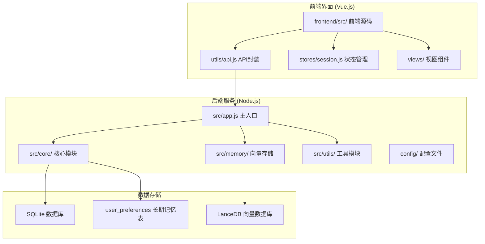

**图表来源**
- [app.js:1-238](file://NL2SQL/backend/src/app.js#L1-L238)
- [package.json:1-29](file://NL2SQL/backend/package.json#L1-L29)

**章节来源**
- [package.json:1-29](file://NL2SQL/backend/package.json#L1-L29)
- [app.js:1-238](file://NL2SQL/backend/src/app.js#L1-L238)

## 核心组件

### 1. 应用启动器 (App.js)
应用的主入口文件，负责：
- 加载环境变量配置
- 初始化核心模块
- 启动HTTP服务器和SSE服务
- 处理优雅关闭

### 2. REST API路由 (Routes.js)
提供完整的RESTful API接口：
- 健康检查接口
- Schema查询接口
- 会话管理接口
- 查询历史接口
- 统计信息接口
- **新增长期记忆管理接口**：用户偏好、查询模板、字段别名管理
- **新增SSE接口**：/api/sse/stream和/api/sse/query

### 3. NL2SQL引擎 (nl2sqlEngine.js)
核心转换引擎，实现：
- 意图识别和澄清机制
- 实体解析和上下文理解
- SQL生成和验证
- 查询执行和结果格式化
- 流式处理和进度反馈
- **长期记忆集成**：用户偏好、查询模板、字段别名的智能应用
- **增强的澄清机制**：支持structured clarification response和missingSlots结构化响应

### 4. LLM服务 (llmService.js)
LLM API通信模块：
- 支持多种LLM提供商
- HTTP请求封装和重试机制
- 流式响应处理
- Embedding向量获取

### 5. Schema管理 (schemaLoader.js)
元数据管理模块：
- Schema配置文件加载
- 表结构定义管理
- 语义搜索和匹配
- SQL验证功能

### 6. SSE处理器 (sseHandler.js)
**新增组件**：Server-Sent Events处理器，替代原有的WebSocket处理器：
- SSE连接管理
- 流式消息发送
- 进度回调支持
- 连接清理
- 多连接支持（多标签页）

### 7. 长期记忆管理 (longTermMemory.js)
**新增组件**：用户长期记忆管理模块：
- 偏好提取和存储
- 查询模式识别
- 字段别名学习
- 模板管理
- LLM智能分析
- 即时学习功能

### 8. 记忆维护 (memoryMaintenance.js)
**新增组件**：长期记忆维护模块：
- 记忆压缩和清理
- 使用频率分级保留
- 相似模式合并
- 健康统计报告

**更新** 新增实体解析功能，支持将模糊描述（如"青木"）映射到具体ID（如"30"），并增强上下文分析能力，支持对话历史的理解和融合。新增长期记忆管理功能，包括偏好管理、模板管理、别名学习等，为用户提供个性化的查询体验。

**章节来源**
- [app.js:97-166](file://NL2SQL/backend/src/app.js#L97-L166)
- [routes.js:1-895](file://NL2SQL/backend/src/core/routes.js#L1-L895)
- [nl2sqlEngine.js:1-1066](file://NL2SQL/backend/src/core/nl2sqlEngine.js#L1-L1066)
- [llmService.js:1-432](file://NL2SQL/backend/src/core/llmService.js#L1-L432)
- [schemaLoader.js:1-655](file://NL2SQL/backend/src/core/schemaLoader.js#L1-L655)
- [sseHandler.js:1-349](file://NL2SQL/backend/src/core/sseHandler.js#L1-L349)
- [longTermMemory.js:1-1134](file://NL2SQL/backend/src/memory/longTermMemory.js#L1-L1134)
- [memoryMaintenance.js:1-415](file://NL2SQL/backend/src/memory/memoryMaintenance.js#L1-L415)

## 架构概览

NL2SQL系统已从WebSocket架构迁移到Server-Sent Events (SSE)架构，主要组件交互如下：

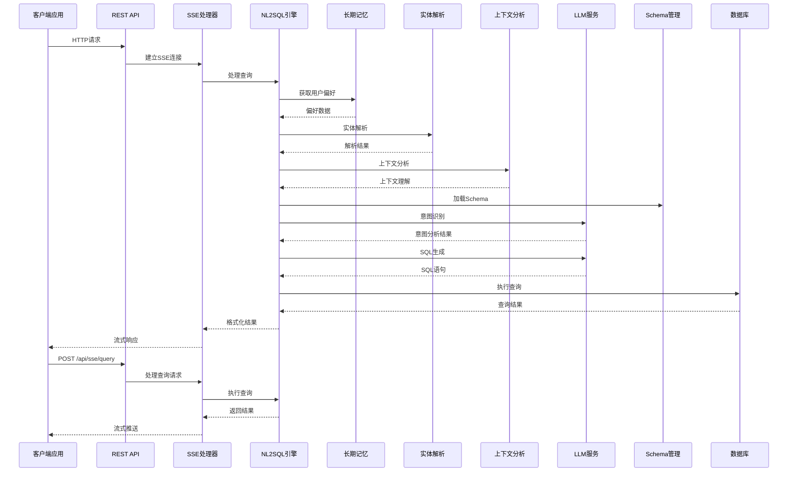

**图表来源**
- [sseHandler.js:43-112](file://NL2SQL/backend/src/core/sseHandler.js#L43-L112)
- [routes.js:549-594](file://NL2SQL/backend/src/core/routes.js#L549-L594)
- [nl2sqlEngine.js:587-778](file://NL2SQL/backend/src/core/nl2sqlEngine.js#L587-L778)

系统采用事件驱动架构，支持实时通信和异步处理。前端通过EventSource与后端保持长连接，实现单向流式响应。

**章节来源**
- [sseHandler.js:1-349](file://NL2SQL/backend/src/core/sseHandler.js#L1-L349)
- [routes.js:538-594](file://NL2SQL/backend/src/core/routes.js#L538-L594)
- [nl2sqlEngine.js:587-778](file://NL2SQL/backend/src/core/nl2sqlEngine.js#L587-L778)

## 详细组件分析

### NL2SQL引擎架构

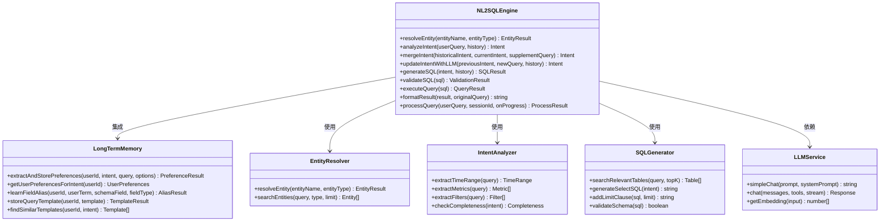

**图表来源**
- [nl2sqlEngine.js:39-166](file://NL2SQL/backend/src/core/nl2sqlEngine.js#L39-L166)
- [nl2sqlEngine.js:302-410](file://NL2SQL/backend/src/core/nl2sqlEngine.js#L302-L410)
- [longTermMemory.js:1114-1134](file://NL2SQL/backend/src/memory/longTermMemory.js#L1114-L1134)
- [llmService.js:287-311](file://NL2SQL/backend/src/core/llmService.js#L287-L311)

### SSE通信流程

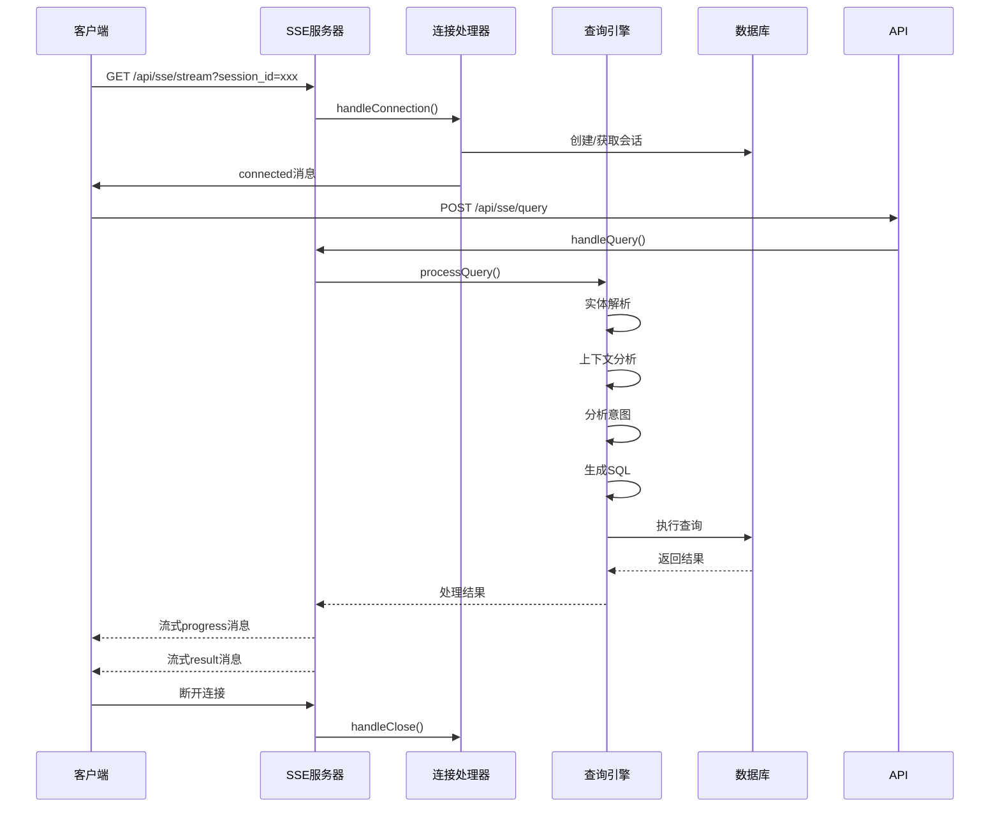

**图表来源**
- [sseHandler.js:43-112](file://NL2SQL/backend/src/core/sseHandler.js#L43-L112)
- [routes.js:549-594](file://NL2SQL/backend/src/core/routes.js#L549-L594)
- [sseHandler.js:218-280](file://NL2SQL/backend/src/core/sseHandler.js#L218-L280)

### 数据库设计

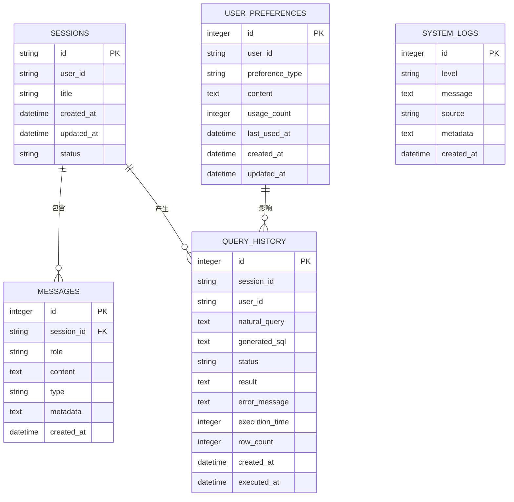

**图表来源**
- [database.js:39-189](file://NL2SQL/backend/src/core/database.js#L39-L189)

**章节来源**
- [nl2sqlEngine.js:1-1066](file://NL2SQL/backend/src/core/nl2sqlEngine.js#L1-L1066)
- [sseHandler.js:1-349](file://NL2SQL/backend/src/core/sseHandler.js#L1-L349)
- [database.js:1-850](file://NL2SQL/backend/src/core/database.js#L1-L850)

## 实体解析与上下文分析

### 实体解析功能

NL2SQL系统实现了智能的实体解析功能，能够将用户的模糊描述映射到具体的数据库实体：

```mermaid
flowchart TD
A[用户输入: "青木的游戏"] --> B[resolveEntity函数]
B --> C{数据库连接可用?}
C --> |是| D[查询数据库表]
C --> |否| E[使用模拟数据]
D --> F{找到匹配?}
F --> |是| G[返回实体ID和置信度]
F --> |否| H[返回失败]
E --> I{找到匹配?}
I --> |是| G
I --> |否| H
G --> J[精确匹配: 置信度1.0]
G --> K[相似匹配: 置信度0.7 + 替代方案]
```

**图表来源**
- [nl2sqlEngine.js:31-104](file://NL2SQL/backend/src/core/nl2sqlEngine.js#L31-L104)

实体解析支持的实体类型：
- **game**: 游戏实体，如"王者荣耀"、"和平精英"
- **channel**: 渠道实体，如"微信渠道"、"QQ渠道"

### 上下文分析功能

系统具备强大的上下文理解能力，能够结合对话历史分析用户的真实意图：

```mermaid
flowchart TD
A[用户查询: "青木上个月流水"] --> B[analyzeIntent函数]
B --> C[获取Schema摘要]
B --> D[构建对话上下文]
D --> E{历史对话存在?}
E --> |是| F[提取最近5轮对话]
E --> |否| G[空上下文]
F --> H[构建上下文摘要]
H --> I[构造系统提示词]
I --> J[调用LLM进行意图分析]
J --> K[解析JSON响应]
K --> L[后处理: 指标识别]
L --> M[返回完整意图分析]
```

**图表来源**
- [nl2sqlEngine.js:118-279](file://NL2SQL/backend/src/core/nl2sqlEngine.js#L118-L279)

上下文分析支持的场景：
- **补充信息**: 用户提供ID、修改时间范围等补充信息
- **需求变更**: 用户更换指标或查询类型
- **连续查询**: 基于上下文理解的延续性查询

### 意图融合机制

系统实现了智能的意图融合机制，能够将历史意图和当前意图进行有效合并：

```mermaid
flowchart TD
A[历史意图: "查询游戏数据"] --> B[当前意图: "提供游戏ID"]
B --> C[mergeIntent函数]
C --> D{历史意图有metrics?}
D --> |是| E[保留历史metrics]
D --> |否| F[使用当前意图metrics]
E --> G[合并filters]
F --> G
G --> H{当前意图有time_range?}
H --> |是| I[补充time_range]
H --> |否| J[保持原状]
I --> K[添加补充信息]
J --> K
K --> L[提升置信度]
L --> M[返回合并后意图]
```

**图表来源**
- [nl2sqlEngine.js:290-331](file://NL2SQL/backend/src/core/nl2sqlEngine.js#L290-L331)

**章节来源**
- [nl2sqlEngine.js:31-104](file://NL2SQL/backend/src/core/nl2sqlEngine.js#L31-L104)
- [nl2sqlEngine.js:118-279](file://NL2SQL/backend/src/core/nl2sqlEngine.js#L118-L279)
- [nl2sqlEngine.js:290-331](file://NL2SQL/backend/src/core/nl2sqlEngine.js#L290-L331)

## 会话管理功能

### 会话删除功能

NL2SQL系统新增了完整的会话删除功能，提供安全的会话生命周期管理：

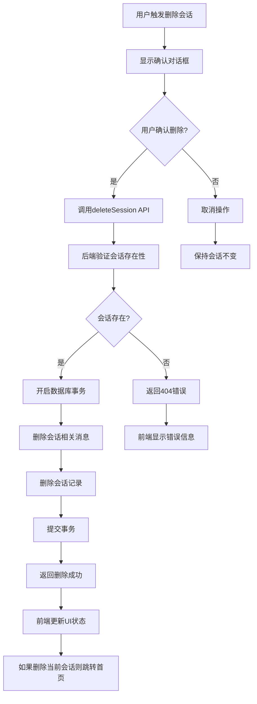

**图表来源**
- [routes.js:314-343](file://NL2SQL/backend/src/core/routes.js#L314-L343)
- [database.js:420-443](file://NL2SQL/backend/src/core/database.js#L420-L443)
- [session.js:340-368](file://NL2SQL/frontend/src/stores/session.js#L340-L368)
- [App.vue:180-206](file://NL2SQL/frontend/src/App.vue#L180-L206)

### 后端实现细节

后端通过DELETE /api/sessions/:sessionId路由端点提供会话删除功能：

**路由处理流程**：
1. 从URL参数提取sessionId
2. 验证会话是否存在且状态为active
3. 调用deleteSession数据库函数执行删除
4. 返回删除成功响应

**数据库事务保证**：
- 使用transaction函数确保删除操作的原子性
- 先删除会话相关消息，再删除会话记录
- 发生错误时自动回滚事务

### 前端实现细节

前端提供完整的会话删除UI交互：

**确认对话框**：
- 使用ElMessageBox.confirm创建确认对话框
- 显示警告样式和明确的操作按钮
- 用户确认后才执行删除操作

**状态管理**：
- 调用sessionStore.deleteSession方法
- 从本地会话列表中移除已删除的会话
- 如果删除的是当前会话，清空消息并断开SSE连接
- 自动跳转到首页

**UI交互优化**：
- 会话列表项悬停时显示删除图标
- 删除图标采用渐隐渐显效果
- 删除成功后显示成功消息
- 删除失败时显示详细错误信息

### API接口规范

会话删除API接口规范：

**请求**：
- 方法：DELETE
- 路径：/api/sessions/:sessionId
- 参数：sessionId（路径参数）

**响应**：
- 成功：{"success": true, "message": "会话已删除"}
- 会话不存在：{"error": "会话不存在"}
- 服务器错误：{"error": "删除会话失败: 错误信息"}

**章节来源**
- [routes.js:314-343](file://NL2SQL/backend/src/core/routes.js#L314-L343)
- [database.js:420-443](file://NL2SQL/backend/src/core/database.js#L420-L443)
- [api.js:188-195](file://NL2SQL/frontend/src/utils/api.js#L188-L195)
- [session.js:340-368](file://NL2SQL/frontend/src/stores/session.js#L340-L368)
- [App.vue:180-206](file://NL2SQL/frontend/src/App.vue#L180-L206)

## 长期记忆管理API

### 概述

NL2SQL系统新增了完整的长期记忆管理功能，为用户提供个性化的查询体验。该功能包括用户偏好管理、查询模板管理、字段别名学习等核心组件。

### 用户偏好管理

#### 获取用户偏好列表

**GET /api/preferences/:userId**

获取指定用户的偏好列表，支持按类型筛选和数量限制。

**查询参数**：
- type: 偏好类型筛选（query_pattern|field_alias|metric_preference|dimension_preference）
- limit: 返回数量限制（默认50）

**响应示例**：
```json
{
  "success": true,
  "user_id": "user123",
  "data": {
    "patterns": [
      {
        "id": 1,
        "content": {
          "name": "最近7天_按渠道_按流水",
          "dimensions": ["渠道"],
          "metrics": ["流水"],
          "default_time_range": {"type": "relative", "value": "最近7天"}
        }
      }
    ],
    "aliases": [
      {
        "id": 2,
        "content": {
          "user_term": "青木",
          "schema_field": "30",
          "field_type": "game"
        }
      }
    ],
    "metrics": ["流水", "DAU"],
    "dimensions": ["渠道", "日期"]
  }
}
```

#### 获取用户记忆统计

**GET /api/preferences/:userId/stats**

获取用户的长期记忆统计信息，包括各类偏好的数量和使用情况。

**响应示例**：
```json
{
  "success": true,
  "user_id": "user123",
  "data": {
    "total": 15,
    "byType": [
      {"preference_type": "query_pattern", "count": 8, "avg_usage": 3.2},
      {"preference_type": "field_alias", "count": 5, "avg_usage": 1.8},
      {"preference_type": "metric_preference", "count": 2, "avg_usage": 2.5}
    ]
  }
}
```

### 查询模板管理

#### 添加查询模板

**POST /api/preferences/:userId/templates**

手动添加查询模板，支持自定义维度、指标、时间范围等。

**请求体**：
```json
{
  "name": "模板名称",
  "dimensions": ["维度1", "维度2"],
  "metrics": ["指标1"],
  "default_time_range": {"type": "relative", "value": "最近7天"},
  "filter_pattern": [{"field": "status", "op": "=", "value": "active"}]
}
```

**响应示例**：
```json
{
  "success": true,
  "message": "模板已保存",
  "data": {
    "id": 1,
    "user_id": "user123",
    "preference_type": "query_pattern",
    "content": {
      "name": "模板名称",
      "dimensions": ["维度1", "维度2"],
      "metrics": ["指标1"],
      "default_time_range": {"type": "relative", "value": "最近7天"}
    }
  }
}
```

#### 删除用户偏好

**DELETE /api/preferences/:preferenceId**

删除指定的用户偏好记录。

**响应示例**：
```json
{
  "success": true,
  "message": "偏好已删除"
}
```

### 字段别名学习

#### 手动学习字段别名

**POST /api/preferences/:userId/learn-alias**

手动学习字段别名映射，支持用户自定义术语与数据库字段的映射关系。

**请求体**：
```json
{
  "user_term": "用户的说法",
  "schema_field": "对应的Schema字段",
  "field_type": "metric|dimension|filter"
}
```

**响应示例**：
```json
{
  "success": true,
  "message": "字段别名已学习",
  "data": {
    "id": 3,
    "user_id": "user123",
    "preference_type": "field_alias",
    "content": {
      "user_term": "青木",
      "schema_field": "30",
      "field_type": "game",
      "confidence": 0.8
    }
  }
}
```

### 长期记忆维护

#### 记忆压缩与清理

系统自动维护长期记忆，根据使用频率实施分级保留策略：

- **高频(≥10次)**：永久保留
- **中频(3-9次)**：90天未用则清理
- **低频(<3次)**：30天未用则清理
- **字段别名**：365天未用则清理

#### 相似模式合并

系统会自动合并相似的查询模式，减少冗余偏好，提高推荐质量。

### 长期记忆配置

长期记忆功能可通过配置文件进行控制：

```javascript
longTermMemory: {
  enabled: true,                    // 是否启用长期记忆功能
  useLLMForExtraction: false,       // 是否使用LLM进行智能提炼
  thresholds: {
    minConfidence: 0.7,             // 最小置信度
    minDimensionsForTemplate: 2,    // 高价值模板最小维度数
    minMetricsForTemplate: 1,       // 高价值模板最小指标数
    recentDaysForFrequency: 7,      // 频率判断天数
    minFrequencyForSimple: 2        // 简单查询最小频率
  },
  retention: {
    highUsage: null,                // 高频保留天数（null表示永久）
    mediumUsage: 90,                // 中频保留天数
    lowUsage: 30,                   // 低频保留天数
    fieldAlias: 365                 // 字段别名保留天数
  }
}
```

**章节来源**
- [routes.js:518-714](file://NL2SQL/backend/src/core/routes.js#L518-L714)
- [longTermMemory.js:1-1134](file://NL2SQL/backend/src/memory/longTermMemory.js#L1-L1134)
- [memoryMaintenance.js:1-415](file://NL2SQL/backend/src/memory/memoryMaintenance.js#L1-L415)
- [database.js:608-763](file://NL2SQL/backend/src/core/database.js#L608-L763)

## SSE查询接口

### 接口概述

NL2SQL系统新增了SSE查询接口，提供通过HTTP POST方式提交查询请求的能力。该接口特别适用于需要简化前端集成的场景，无需建立长期的SSE连接即可获取查询结果。

### POST /api/sse/query 接口

**功能**：通过HTTP POST发送查询请求，结果通过SSE推送

**请求体**：
```json
{
  "session_id": "会话ID",
  "query": "查询内容"
}
```

**响应**：
```json
{
  "success": true,
  "message": "查询已提交，请通过SSE接收结果"
}
```

### 会话标题自动更新机制

当用户通过POST /api/sse/query提交查询时，系统会自动检查会话标题：

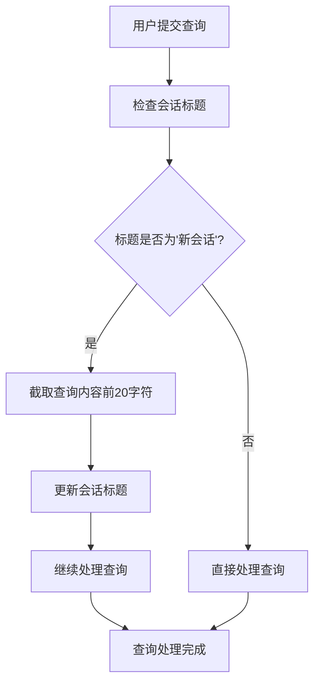

**图表来源**
- [routes.js:576-582](file://NL2SQL/backend/src/core/routes.js#L576-L582)

### 前端使用方式

前端通过api.js中的sendQuery函数调用该接口：

```javascript
// 发送查询请求
await api.sendQuery(sessionId, query)
```

该函数会：
1. 调用POST /api/sse/query接口
2. 立即返回成功响应
3. 通过已建立的SSE连接接收查询结果

### SSE处理器集成

SSE处理器通过handleQuery方法处理来自HTTP POST的查询请求：

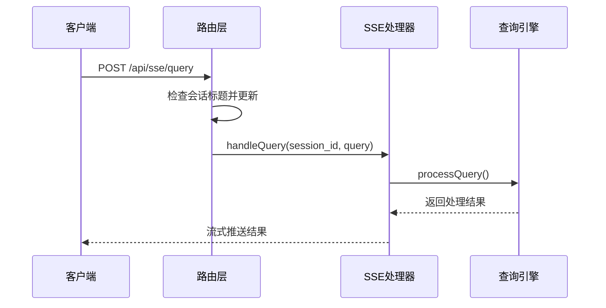

**图表来源**
- [routes.js:564-594](file://NL2SQL/backend/src/core/routes.js#L564-L594)
- [sseHandler.js:218-280](file://NL2SQL/backend/src/core/sseHandler.js#L218-L280)

**章节来源**
- [routes.js:553-594](file://NL2SQL/backend/src/core/routes.js#L553-L594)
- [api.js:246-251](file://NL2SQL/frontend/src/utils/api.js#L246-L251)
- [session.js:299-328](file://NL2SQL/frontend/src/stores/session.js#L299-L328)

## 澄清机制与结构化响应

### 结构化澄清响应

NL2SQL系统实现了增强的澄清机制，支持structured clarification response，提供更精确的查询澄清和结构化响应：

```mermaid
flowchart TD
A[用户查询: "青木上个月流水"] --> B[意图分析]
B --> C{信息完整?}
C --> |是| D[生成SQL]
C --> |否| E[生成澄清问题]
E --> F[structured clarification response]
F --> G{用户回复?}
G --> |是| H[解析回复]
H --> I[提取missingSlots]
I --> J[更新意图]
J --> K[重新生成SQL]
G --> |否| L[等待澄清]
```

**图表来源**
- [nl2sqlEngine.js:1022-1076](file://NL2SQL/backend/src/core/nl2sqlEngine.js#L1022-L1076)
- [nl2sqlEngine.js:1712-1729](file://NL2SQL/backend/src/core/nl2sqlEngine.js#L1712-L1729)

### 结构化响应格式

澄清机制支持以下结构化响应格式：

**澄清问题响应**：
```json
{
  "question": "请提供更多查询细节，例如时间范围、关注的指标等。",
  "missingSlots": ["time_range", "metrics"],
  "slotDescriptions": {
    "time_range": "需要确认查询的时间范围，如最近7天、上个月等",
    "metrics": "需要确认关注的具体指标，如流水、DAU等"
  }
}
```

**SQL生成澄清响应**：
```json
{
  "needClarification": true,
  "thought": "为什么无法推断，具体缺哪些信息",
  "clarificationQuestion": "需要向用户确认的问题",
  "missingSlots": ["缺失的信息项，如: game_id", "table_name", "time_range"]
}
```

### 缺失槽位处理

系统能够智能识别和处理缺失的业务槽位：

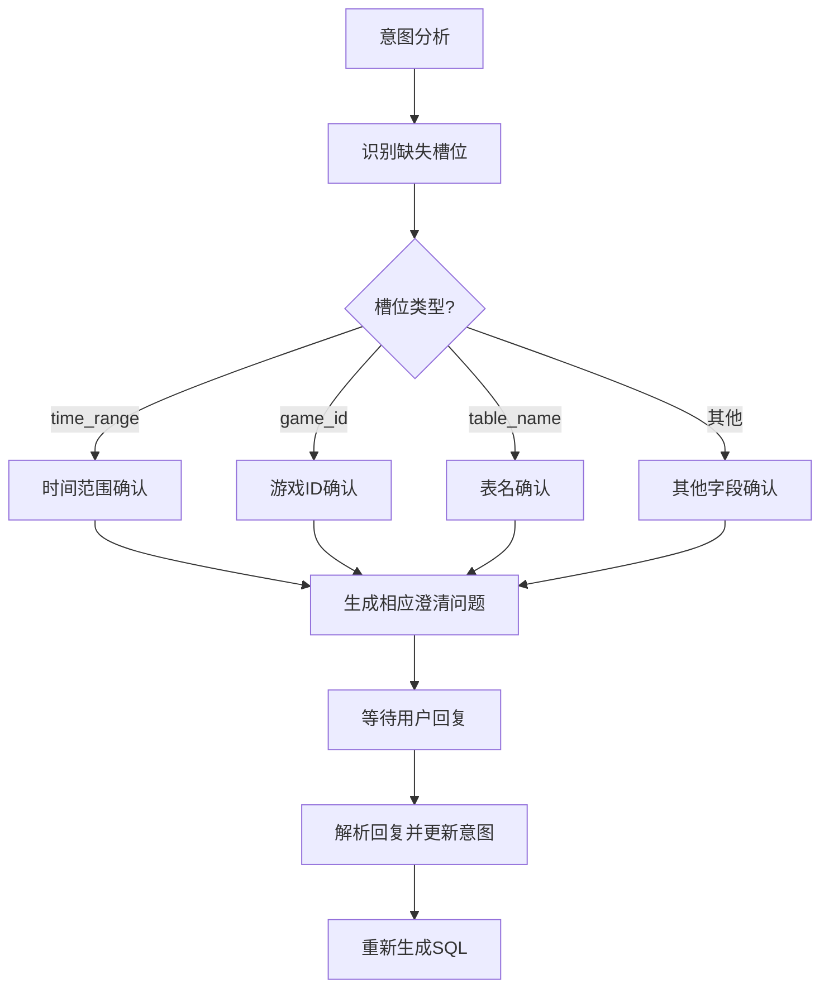

**图表来源**
- [nl2sqlEngine.js:922-1012](file://NL2SQL/backend/src/core/nl2sqlEngine.js#L922-L1012)
- [nl2sqlEngine.js:1290-1301](file://NL2SQL/backend/src/core/nl2sqlEngine.js#L1290-L1301)

### 部分回答校验

系统支持部分回答校验机制，能够处理用户部分回答的情况：

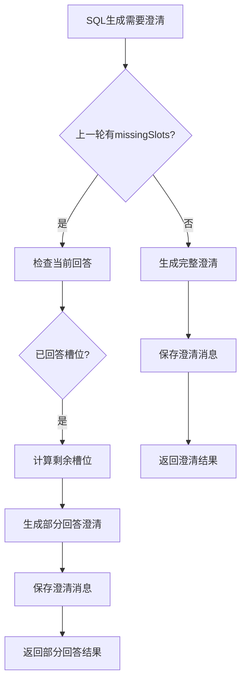

**图表来源**
- [nl2sqlEngine.js:1738-1794](file://NL2SQL/backend/src/core/nl2sqlEngine.js#L1738-L1794)

### 增强的SQL生成上下文处理

SQL生成过程集成了增强的上下文处理能力：

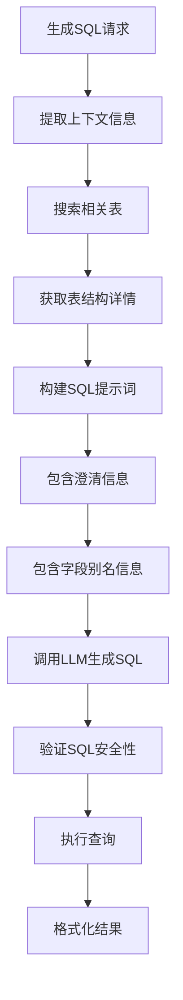

**图表来源**
- [nl2sqlEngine.js:1090-1335](file://NL2SQL/backend/src/core/nl2sqlEngine.js#L1090-L1335)

**章节来源**
- [nl2sqlEngine.js:1022-1076](file://NL2SQL/backend/src/core/nl2sqlEngine.js#L1022-L1076)
- [nl2sqlEngine.js:1712-1794](file://NL2SQL/backend/src/core/nl2sqlEngine.js#L1712-L1794)
- [nl2sqlEngine.js:1090-1335](file://NL2SQL/backend/src/core/nl2sqlEngine.js#L1090-L1335)

## 依赖关系分析

### 核心依赖关系

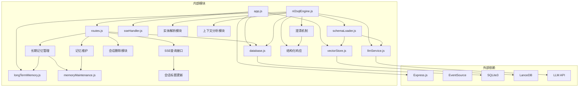

**图表来源**
- [package.json:10-21](file://NL2SQL/backend/package.json#L10-L21)
- [app.js:22-54](file://NL2SQL/backend/src/app.js#L22-L54)

### 配置管理

系统采用集中式配置管理，所有配置项从环境变量读取：

| 配置类别 | 关键配置项 | 默认值 | 用途 |
|---------|-----------|--------|------|
| 服务器 | PORT | 3000 | 监听端口 |
| LLM API | LLM_API_BASE | https://api.openai.com/v1 | API基础URL |
| LLM API | LLM_API_KEY | 无 | 认证密钥 |
| 数据库 | DB_PATH | ./data/sessions.db | SQLite路径 |
| 向量数据库 | VECTOR_DB_PATH | ./data/vectordb | LanceDB路径 |
| 长期记忆 | LTM_ENABLED | true | 是否启用长期记忆 |
| 长期记忆 | LTM_USE_LLM | false | 是否使用LLM分析 |
| 安全 | ALLOWED_TABLES | 空 | 表访问白名单 |
| 性能 | MAX_QUERY_ROWS | 1000 | 查询行数限制 |

**章节来源**
- [config.js:16-332](file://NL2SQL/backend/src/core/config.js#L16-L332)
- [package.json:10-28](file://NL2SQL/backend/package.json#L10-L28)

## 性能考虑

### 1. 缓存策略
- Schema元数据缓存：1小时过期时间
- 日志文件轮转：10MB大小限制，最多5个文件
- 向量数据库：支持强制重新向量化
- **长期记忆缓存**：用户偏好按类型缓存，减少数据库查询

### 2. 连接管理
- SSE连接超时：90秒
- 心跳检测：30秒间隔
- 会话清理：7天过期时间
- **多连接支持**：同一会话支持多个EventSource连接（多标签页）

### 3. 查询优化
- SQL生成时自动添加LIMIT限制
- 支持CTE（公用表表达式）提高复杂查询可读性
- 向量化搜索支持语义相似度匹配
- **长期记忆查询优化**：使用索引加速偏好查询
- **澄清机制优化**：结构化响应减少LLM调用次数

### 4. 错误处理
- LLM API重试机制：最多3次重试
- 请求超时控制：60秒默认超时
- 优雅关闭：确保资源正确释放

### 5. 实体解析优化
- 数据库连接可用时优先查询真实数据
- 支持模拟数据回退机制
- 实体解析结果缓存

### 6. 会话删除性能优化
- **事务原子性**：使用数据库事务确保删除操作的原子性，避免部分删除导致的数据不一致
- **批量删除**：先删除会话相关消息，再删除会话记录，减少外键约束检查次数
- **索引优化**：确保messages表的session_id字段有索引，提高删除效率
- **内存管理**：删除当前会话时及时清理内存中的消息缓存

### 7. SSE架构性能优化
- **单向通信**：简化了连接管理复杂度
- **流式传输**：支持实时进度反馈
- **连接池管理**：支持同一会话的多连接
- **自动清理**：连接断开时自动清理资源

### 8. SSE查询接口性能优化
- **即时响应**：HTTP POST请求立即返回，无需等待查询完成
- **会话标题预更新**：在查询处理前更新会话标题，提升用户体验
- **连接复用**：通过现有的SSE连接处理查询，避免重复连接开销
- **异步处理**：查询处理在后台异步进行，不影响HTTP响应速度

### 9. 长期记忆性能优化
- **数据库索引**：为user_id和preference_type创建复合索引
- **查询优化**：使用JSON函数进行内容查询，避免全表扫描
- **缓存策略**：用户偏好按类型缓存，减少重复查询
- **批量操作**：支持批量获取用户偏好，减少数据库往返
- **内存管理**：定期清理不使用的偏好缓存

### 10. 记忆维护性能优化
- **增量清理**：只处理最近更新的用户，避免全表扫描
- **分级处理**：按使用频率分批处理，提高效率
- **并行处理**：支持多用户并行压缩，充分利用CPU资源
- **统计优化**：使用聚合查询减少数据传输

### 11. 澄清机制性能优化
- **结构化响应**：减少LLM调用次数，提高响应速度
- **缺失槽位缓存**：缓存上一轮的缺失槽位信息
- **部分回答校验**：智能识别用户部分回答，减少重复澄清
- **即时学习**：澄清轮即时学习用户映射关系，提高后续查询效率

**更新** 新增长期记忆相关的性能优化策略，包括数据库索引、查询优化、缓存策略等。新增记忆维护功能的性能优化措施。新增SSE架构相关的性能优化策略，包括多连接支持和自动清理机制。新增SSE查询接口的性能优化策略，包括即时响应和连接复用机制。新增澄清机制的性能优化策略，包括结构化响应和部分回答校验。

## 故障排除指南

### 常见问题及解决方案

#### 1. LLM API连接失败
**症状**：查询处理报错，提示LLM API调用失败
**解决方案**：
- 检查LLM_API_KEY环境变量设置
- 验证API基础URL配置
- 确认网络连接正常

#### 2. 数据库连接问题
**症状**：应用启动时报数据库连接错误
**解决方案**：
- 检查DB_PATH配置路径
- 确认SQLite文件权限
- 验证数据库文件完整性

#### 3. SSE连接超时
**症状**：客户端连接后很快断开
**解决方案**：
- 检查防火墙设置
- 验证反向代理配置
- 确认客户端网络环境

#### 4. Schema加载失败
**症状**：Schema查询返回空结果
**解决方案**：
- 检查SCHEMA_CONFIG_PATH配置
- 验证Schema配置文件格式
- 确认向量数据库初始化状态

#### 5. 实体解析失败
**症状**：实体解析返回失败
**解决方案**：
- 检查数据库连接状态
- 验证实体类型支持
- 确认实体名称匹配规则

#### 6. 会话删除失败
**症状**：删除会话时报错或数据未删除
**解决方案**：
- 检查会话ID是否有效
- 验证用户权限（如果实现权限控制）
- 确认数据库事务是否正常提交
- 检查messages表的外键约束设置

#### 7. SSE查询提交失败
**症状**：POST /api/sse/query返回错误
**解决方案**：
- 检查session_id参数是否有效
- 验证查询内容是否为空
- 确认会话标题是否需要更新
- 检查SSE处理器是否正常工作

#### 8. SSE查询接口响应慢
**症状**：POST /api/sse/query响应延迟
**解决方案**：
- 检查SSE连接状态
- 验证查询处理队列
- 确认数据库连接池状态
- 检查LLM API响应时间

#### 9. 会话标题未更新
**症状**：会话标题仍显示为"新会话"
**解决方案**：
- 检查数据库连接状态
- 验证updateSessionTitle函数调用
- 确认查询内容长度限制
- 检查会话状态是否为active

#### 10. 长期记忆功能异常
**症状**：用户偏好无法保存或获取
**解决方案**：
- 检查LTM_ENABLED配置
- 验证数据库user_preferences表结构
- 确认JSON内容格式正确
- 检查用户ID格式和权限

#### 11. 记忆维护失败
**症状**：长期记忆清理或合并功能异常
**解决方案**：
- 检查数据库连接状态
- 验证SQL语句语法
- 确认用户偏好数据完整性
- 检查内存使用情况

#### 12. 字段别名学习失败
**症状**：手动学习字段别名不生效
**解决方案**：
- 检查请求体格式
- 验证用户术语和Schema字段
- 确认字段类型参数
- 检查数据库约束冲突

#### 13. 澄清机制失效
**症状**：澄清问题无法生成或响应不正确
**解决方案**：
- 检查LLM API配置
- 验证意图分析结果
- 确认缺失槽位识别正确
- 检查结构化响应格式

#### 14. 结构化响应解析失败
**症状**：澄清响应无法正确解析
**解决方案**：
- 检查LLM响应格式
- 验证JSON解析逻辑
- 确认missingSlots字段完整性
- 检查slotDescriptions格式

**更新** 新增长期记忆相关的故障排除指南，包括偏好管理、模板管理、别名学习等功能。新增记忆维护功能的故障排除指南。新增SSE架构相关的故障排除指南。新增SSE查询接口相关的故障排除指南。新增澄清机制相关的故障排除指南，包括结构化响应解析和缺失槽位处理。

**章节来源**
- [llmService.js:167-195](file://NL2SQL/backend/src/core/llmService.js#L167-L195)
- [database.js:198-252](file://NL2SQL/backend/src/core/database.js#L198-L252)
- [sseHandler.js:373-394](file://NL2SQL/backend/src/core/sseHandler.js#L373-L394)
- [longTermMemory.js:1-1134](file://NL2SQL/backend/src/memory/longTermMemory.js#L1-L1134)
- [memoryMaintenance.js:1-415](file://NL2SQL/backend/src/memory/memoryMaintenance.js#L1-L415)
- [nl2sqlEngine.js:1022-1076](file://NL2SQL/backend/src/core/nl2sqlEngine.js#L1022-L1076)

## 结论

NL2SQL API是一个功能完整、架构清晰的自然语言到SQL转换服务。系统具有以下特点：

### 技术优势
- **模块化设计**：清晰的分层架构，易于维护和扩展
- **实时通信**：基于Server-Sent Events的单向流式通信，提供良好的用户体验
- **智能处理**：集成LLM服务，支持复杂的自然语言理解
- **向量化搜索**：利用LanceDB实现语义相似度匹配
- **实体解析**：智能实体映射，支持模糊描述到具体ID的转换
- **上下文分析**：深度理解对话历史，提供准确的查询意图
- **完整的会话管理**：支持会话创建、查询、删除的完整生命周期
- **SSE架构优势**：简化连接管理，支持多连接，提高系统稳定性
- **灵活的查询接口**：支持SSE连接和HTTP POST两种查询方式
- **长期记忆管理**：提供用户偏好、查询模板、字段别名等个性化功能
- **增强的澄清机制**：支持structured clarification response和missingSlots结构化响应
- **SQL生成优化**：集成增强的上下文处理能力，提供更精确的SQL生成

### 功能特性
- 完整的RESTful API接口
- 会话管理和历史记录
- Schema元数据管理
- 查询统计和监控
- 自修复机制和健康检查
- 实体解析和上下文理解
- **会话删除功能**：提供安全的会话清理能力
- **SSE流式通信**：支持实时进度反馈和结果推送
- **SSE查询接口**：通过HTTP POST提交查询，简化前端集成
- **长期记忆管理**：用户偏好、查询模板、字段别名的完整管理
- **记忆维护**：自动清理、合并相似模式等维护功能
- **结构化澄清响应**：提供精确的查询澄清和缺失槽位识别

### 扩展建议
1. **性能优化**：考虑添加查询缓存机制
2. **安全增强**：实现更细粒度的权限控制
3. **监控完善**：添加更详细的性能指标监控
4. **文档改进**：完善API文档和使用示例
5. **实体扩展**：支持更多类型的实体解析
6. **会话管理增强**：考虑添加会话归档和恢复功能
7. **SSE优化**：考虑添加连接重连机制和心跳检测
8. **查询接口优化**：支持批量查询和并发处理
9. **长期记忆增强**：支持跨会话偏好共享和同步
10. **记忆学习优化**：增强LLM智能分析能力，提高学习准确性
11. **澄清机制优化**：支持更复杂的部分回答校验和上下文理解
12. **结构化响应扩展**：支持更多类型的结构化数据格式

该系统为数据查询场景提供了强大的自然语言接口，能够有效降低数据分析的门槛，提高工作效率。新增的实体解析、上下文分析、会话删除、长期记忆管理功能和SSE架构进一步提升了系统的智能化水平和用户体验，使其能够更好地理解和处理复杂的查询场景，同时提供完整的会话生命周期管理能力和稳定的实时通信机制。**新增的长期记忆管理API**为用户提供了个性化的查询体验，支持用户偏好、查询模板、字段别名等管理功能，进一步提升了系统的易用性和扩展性。**新增的SSE查询接口**为前端集成了更多灵活性，支持不同场景下的查询需求，进一步提升了系统的易用性和扩展性。**增强的澄清机制**通过structured clarification response和missingSlots结构化响应，提供了更精确的查询澄清能力，显著提升了系统的智能化水平和用户体验。