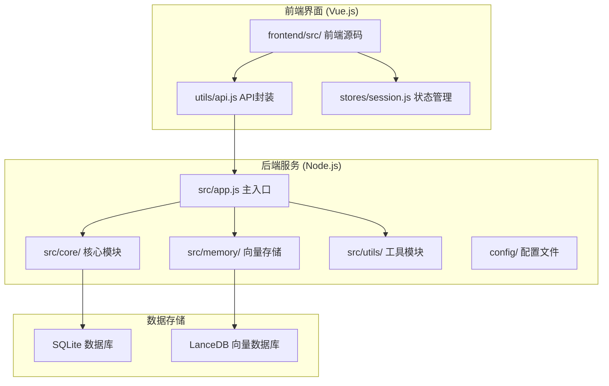
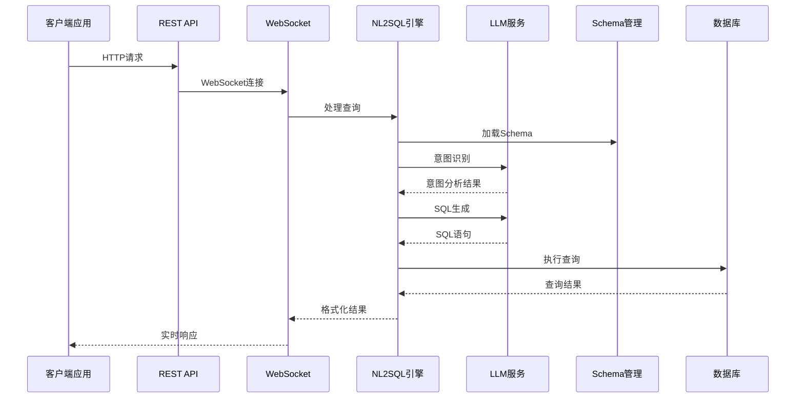
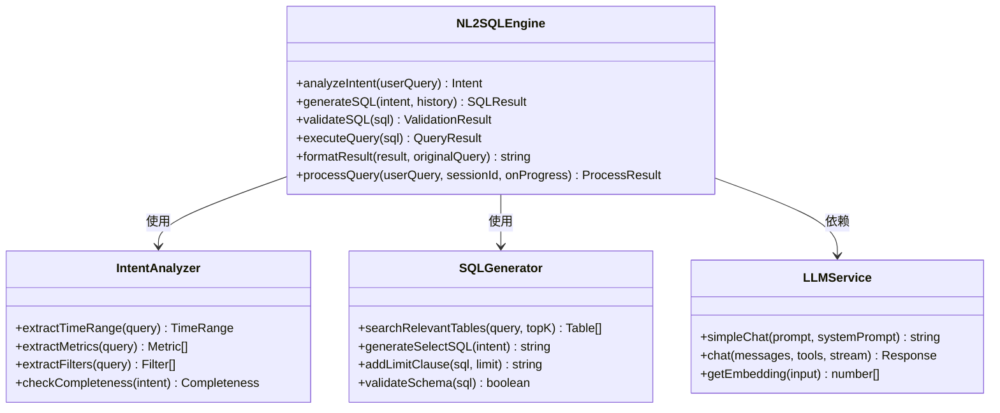
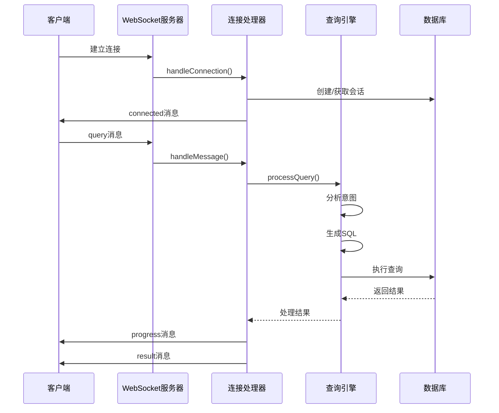
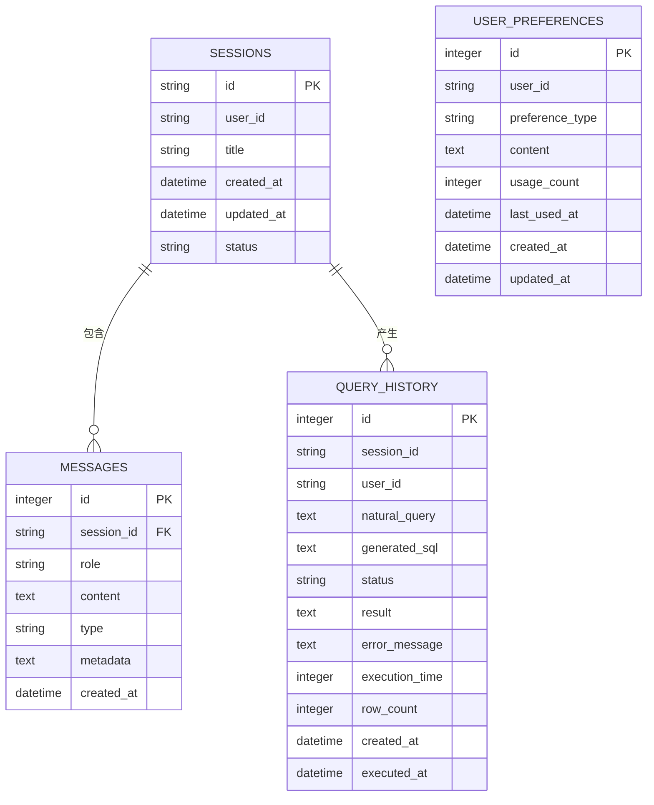
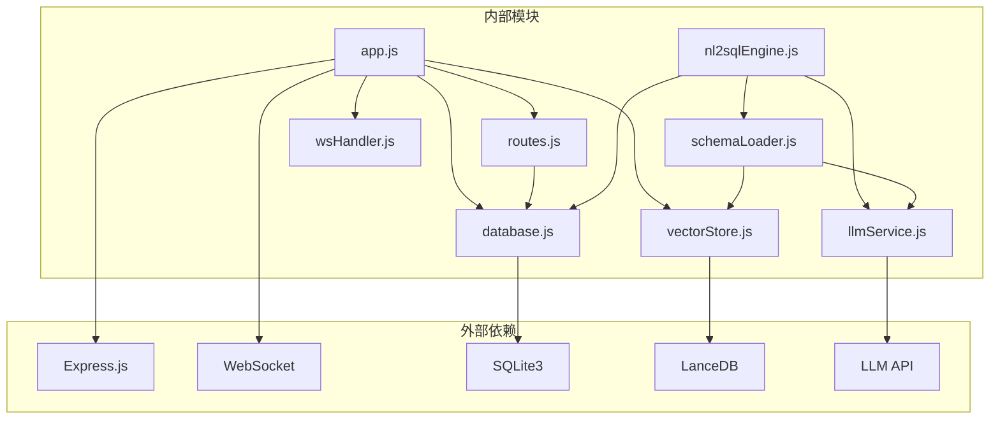

# NL2SQL API参考

<cite>
**本文档引用的文件**
- [package.json](file://NL2SQL/backend/package.json)
- [app.js](file://NL2SQL/backend/src/app.js)
- [routes.js](file://NL2SQL/backend/src/core/routes.js)
- [nl2sqlEngine.js](file://NL2SQL/backend/src/core/nl2sqlEngine.js)
- [llmService.js](file://NL2SQL/backend/src/core/llmService.js)
- [schemaLoader.js](file://NL2SQL/backend/src/core/schemaLoader.js)
- [config.js](file://NL2SQL/backend/src/core/config.js)
- [database.js](file://NL2SQL/backend/src/core/database.js)
- [vectorStore.js](file://NL2SQL/backend/src/memory/vectorStore.js)
- [logger.js](file://NL2SQL/backend/src/utils/logger.js)
- [wsHandler.js](file://NL2SQL/backend/src/core/wsHandler.js)
- [selfRepair.js](file://NL2SQL/backend/src/core/selfRepair.js)
- [api.js](file://NL2SQL/frontend/src/utils/api.js)
- [session.js](file://NL2SQL/frontend/src/stores/session.js)
</cite>

## 目录
1. [简介](#简介)
2. [项目结构](#项目结构)
3. [核心组件](#核心组件)
4. [架构概览](#架构概览)
5. [详细组件分析](#详细组件分析)
6. [依赖关系分析](#依赖关系分析)
7. [性能考虑](#性能考虑)
8. [故障排除指南](#故障排除指南)
9. [结论](#结论)

## 简介

NL2SQL API是一个基于自然语言到SQL转换技术的数据查询服务。该项目提供了完整的后端服务和前端界面，能够将用户的自然语言查询转换为标准SQL语句，并执行查询返回结果。

该系统采用现代化的技术栈，包括Node.js后端、Vue.js前端、SQLite数据库、LanceDB向量数据库，以及集成的LLM（大语言模型）服务。系统支持实时通信、会话管理、查询历史记录、Schema元数据管理等功能。

## 项目结构

NL2SQL项目采用清晰的分层架构设计：

**图表来源**
- [app.js:1-266](file://NL2SQL/backend/src/app.js#L1-L266)
- [package.json:1-29](file://NL2SQL/backend/package.json#L1-L29)

**章节来源**
- [package.json:1-29](file://NL2SQL/backend/package.json#L1-L29)
- [app.js:1-266](file://NL2SQL/backend/src/app.js#L1-L266)

## 核心组件

### 1. 应用启动器 (App.js)
应用的主入口文件，负责：
- 加载环境变量配置
- 初始化核心模块
- 启动HTTP和WebSocket服务器
- 处理优雅关闭

### 2. REST API路由 (Routes.js)
提供完整的RESTful API接口：
- 健康检查接口
- Schema查询接口
- 会话管理接口
- 查询历史接口
- 统计信息接口

### 3. NL2SQL引擎 (nl2sqlEngine.js)
核心转换引擎，实现：
- 意图识别和澄清机制
- SQL生成和验证
- 查询执行和结果格式化
- 流式处理和进度反馈

### 4. LLM服务 (llmService.js)
LLM API通信模块：
- 支持多种LLM提供商
- HTTP请求封装和重试机制
- 流式响应处理
- Embedding向量获取

### 5. Schema管理 (schemaLoader.js)
元数据管理模块：
- Schema配置文件加载
- 表结构定义管理
- 语义搜索和匹配
- SQL验证功能

**章节来源**
- [app.js:121-190](file://NL2SQL/backend/src/app.js#L121-L190)
- [routes.js:1-538](file://NL2SQL/backend/src/core/routes.js#L1-L538)
- [nl2sqlEngine.js:1-800](file://NL2SQL/backend/src/core/nl2sqlEngine.js#L1-L800)
- [llmService.js:1-432](file://NL2SQL/backend/src/core/llmService.js#L1-L432)
- [schemaLoader.js:1-655](file://NL2SQL/backend/src/core/schemaLoader.js#L1-L655)

## 架构概览

NL2SQL系统采用微服务架构，主要组件交互如下：

**图表来源**
- [wsHandler.js:197-247](file://NL2SQL/backend/src/core/wsHandler.js#L197-L247)
- [nl2sqlEngine.js:596-778](file://NL2SQL/backend/src/core/nl2sqlEngine.js#L596-L778)

系统采用事件驱动架构，支持实时通信和异步处理。前端通过WebSocket与后端保持长连接，实现即时响应。

**章节来源**
- [wsHandler.js:1-451](file://NL2SQL/backend/src/core/wsHandler.js#L1-L451)
- [nl2sqlEngine.js:587-778](file://NL2SQL/backend/src/core/nl2sqlEngine.js#L587-L778)

## 详细组件分析

### NL2SQL引擎架构

**图表来源**
- [nl2sqlEngine.js:39-166](file://NL2SQL/backend/src/core/nl2sqlEngine.js#L39-L166)
- [nl2sqlEngine.js:302-410](file://NL2SQL/backend/src/core/nl2sqlEngine.js#L302-L410)
- [llmService.js:287-311](file://NL2SQL/backend/src/core/llmService.js#L287-L311)

### WebSocket通信流程

**图表来源**
- [wsHandler.js:57-116](file://NL2SQL/backend/src/core/wsHandler.js#L57-L116)
- [wsHandler.js:197-247](file://NL2SQL/backend/src/core/wsHandler.js#L197-L247)

### 数据库设计

**图表来源**
- [database.js:39-187](file://NL2SQL/backend/src/core/database.js#L39-L187)

**章节来源**
- [nl2sqlEngine.js:1-800](file://NL2SQL/backend/src/core/nl2sqlEngine.js#L1-L800)
- [wsHandler.js:1-451](file://NL2SQL/backend/src/core/wsHandler.js#L1-L451)
- [database.js:1-531](file://NL2SQL/backend/src/core/database.js#L1-L531)

## 依赖关系分析

### 核心依赖关系

**图表来源**
- [package.json:10-21](file://NL2SQL/backend/package.json#L10-L21)
- [app.js:22-54](file://NL2SQL/backend/src/app.js#L22-L54)

### 配置管理

系统采用集中式配置管理，所有配置项从环境变量读取：

| 配置类别 | 关键配置项 | 默认值 | 用途 |
|---------|-----------|--------|------|
| 服务器 | PORT | 3000 | 监听端口 |
| LLM API | LLM_API_BASE | https://api.openai.com/v1 | API基础URL |
| LLM API | LLM_API_KEY | 无 | 认证密钥 |
| 数据库 | DB_PATH | ./data/sessions.db | SQLite路径 |
| 向量数据库 | VECTOR_DB_PATH | ./data/vectordb | LanceDB路径 |
| 安全 | ALLOWED_TABLES | 空 | 表访问白名单 |
| 性能 | MAX_QUERY_ROWS | 1000 | 查询行数限制 |

**章节来源**
- [config.js:16-246](file://NL2SQL/backend/src/core/config.js#L16-L246)
- [package.json:10-28](file://NL2SQL/backend/package.json#L10-L28)

## 性能考虑

### 1. 缓存策略
- Schema元数据缓存：1小时过期时间
- 日志文件轮转：10MB大小限制，最多5个文件
- 向量数据库：支持强制重新向量化

### 2. 连接管理
- WebSocket连接超时：90秒
- 心跳检测：30秒间隔
- 会话清理：7天过期时间

### 3. 查询优化
- SQL生成时自动添加LIMIT限制
- 支持CTE（公用表表达式）提高复杂查询可读性
- 向量化搜索支持语义相似度匹配

### 4. 错误处理
- LLM API重试机制：最多3次重试
- 请求超时控制：60秒默认超时
- 优雅关闭：确保资源正确释放

## 故障排除指南

### 常见问题及解决方案

#### 1. LLM API连接失败
**症状**：查询处理报错，提示LLM API调用失败
**解决方案**：
- 检查LLM_API_KEY环境变量设置
- 验证API基础URL配置
- 确认网络连接正常

#### 2. 数据库连接问题
**症状**：应用启动时报数据库连接错误
**解决方案**：
- 检查DB_PATH配置路径
- 确认SQLite文件权限
- 验证数据库文件完整性

#### 3. WebSocket连接超时
**症状**：客户端连接后很快断开
**解决方案**：
- 检查防火墙设置
- 验证反向代理配置
- 确认客户端网络环境

#### 4. Schema加载失败
**症状**：Schema查询返回空结果
**解决方案**：
- 检查SCHEMA_CONFIG_PATH配置
- 验证Schema配置文件格式
- 确认向量数据库初始化状态

**章节来源**
- [llmService.js:167-195](file://NL2SQL/backend/src/core/llmService.js#L167-L195)
- [database.js:198-252](file://NL2SQL/backend/src/core/database.js#L198-L252)
- [wsHandler.js:373-394](file://NL2SQL/backend/src/core/wsHandler.js#L373-L394)

## 结论

NL2SQL API是一个功能完整、架构清晰的自然语言到SQL转换服务。系统具有以下特点：

### 技术优势
- **模块化设计**：清晰的分层架构，易于维护和扩展
- **实时通信**：基于WebSocket的双向通信，提供良好的用户体验
- **智能处理**：集成LLM服务，支持复杂的自然语言理解
- **向量化搜索**：利用LanceDB实现语义相似度匹配

### 功能特性
- 完整的RESTful API接口
- 会话管理和历史记录
- Schema元数据管理
- 查询统计和监控
- 自修复机制和健康检查

### 扩展建议
1. **性能优化**：考虑添加查询缓存机制
2. **安全增强**：实现更细粒度的权限控制
3. **监控完善**：添加更详细的性能指标监控
4. **文档改进**：完善API文档和使用示例

该系统为数据查询场景提供了强大的自然语言接口，能够有效降低数据分析的门槛，提高工作效率。