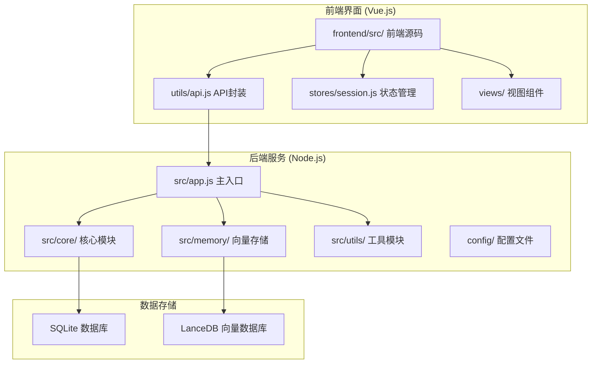
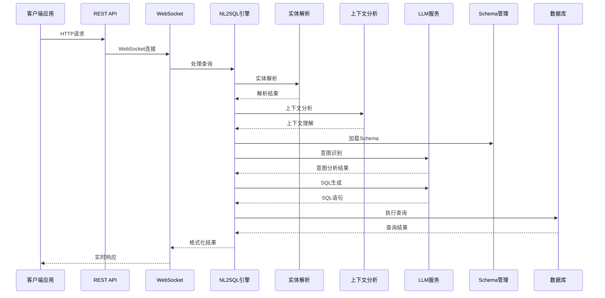
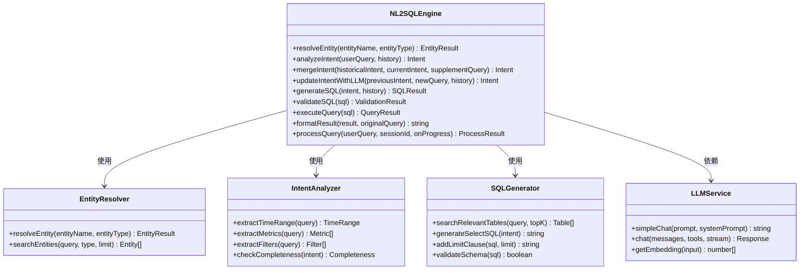
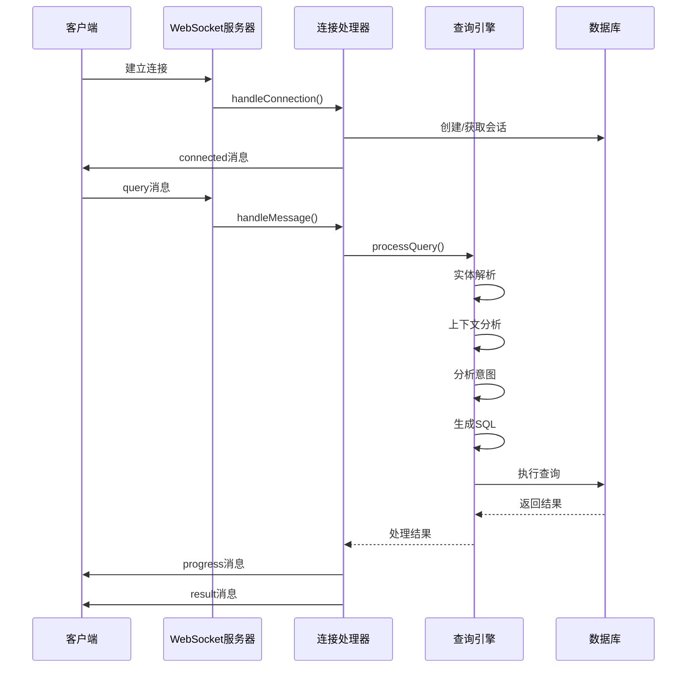
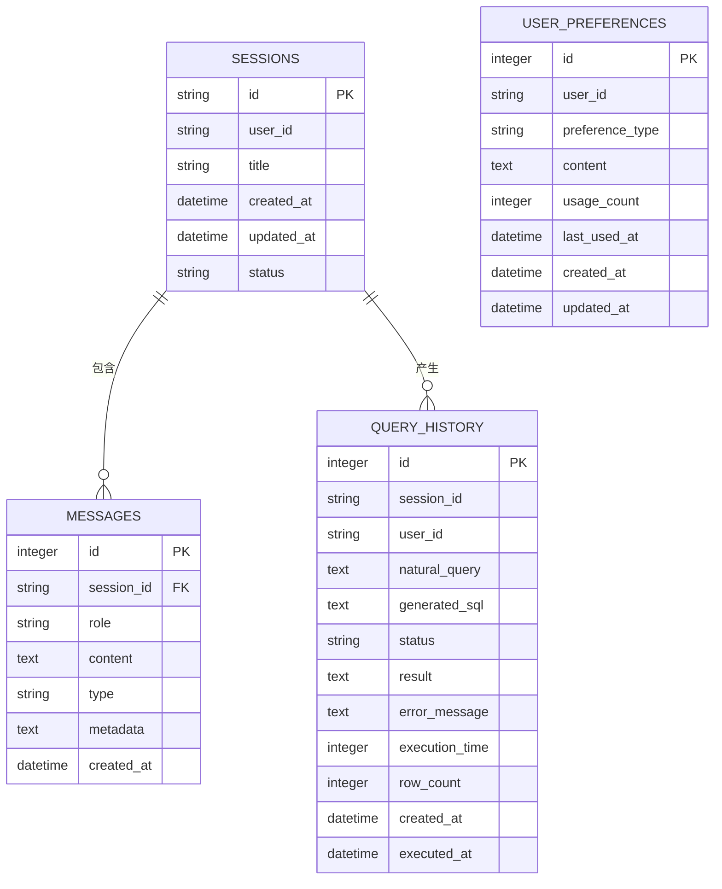
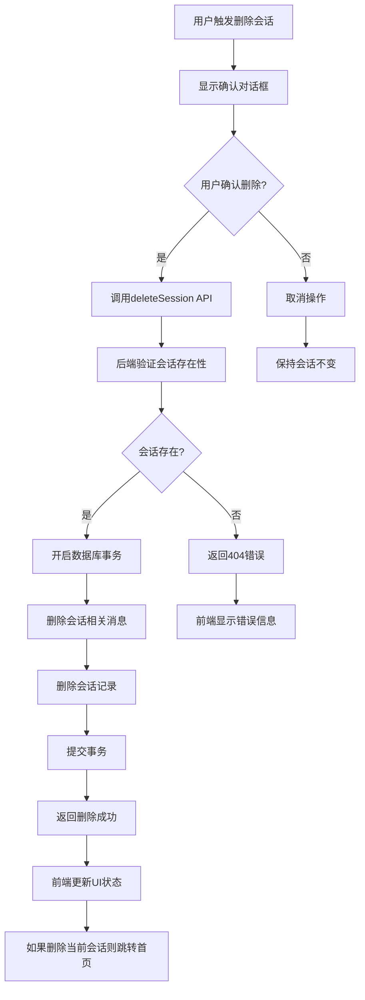
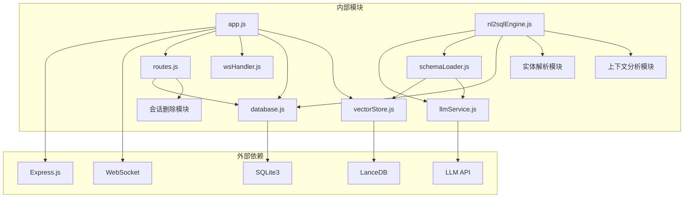

# NL2SQL API参考

<cite>
**本文档引用的文件**
- [package.json](file://NL2SQL/backend/package.json)
- [app.js](file://NL2SQL/backend/src/app.js)
- [routes.js](file://NL2SQL/backend/src/core/routes.js)
- [nl2sqlEngine.js](file://NL2SQL/backend/src/core/nl2sqlEngine.js)
- [llmService.js](file://NL2SQL/backend/src/core/llmService.js)
- [schemaLoader.js](file://NL2SQL/backend/src/core/schemaLoader.js)
- [config.js](file://NL2SQL/backend/src/core/config.js)
- [database.js](file://NL2SQL/backend/src/core/database.js)
- [vectorStore.js](file://NL2SQL/backend/src/memory/vectorStore.js)
- [logger.js](file://NL2SQL/backend/src/utils/logger.js)
- [wsHandler.js](file://NL2SQL/backend/src/core/wsHandler.js)
- [selfRepair.js](file://NL2SQL/backend/src/core/selfRepair.js)
- [api.js](file://NL2SQL/frontend/src/utils/api.js)
- [session.js](file://NL2SQL/frontend/src/stores/session.js)
- [App.vue](file://NL2SQL/frontend/src/App.vue)
- [HistoryView.vue](file://NL2SQL/frontend/src/views/HistoryView.vue)
- [ChatView.vue](file://NL2SQL/frontend/src/views/ChatView.vue)
</cite>

## 更新摘要
**变更内容**
- 新增会话删除功能，包括后端deleteSession数据库函数和DELETE /api/sessions/:sessionId路由端点
- 前端增加会话删除UI交互，包括确认对话框、删除图标、消息重新渲染优化
- 完善会话状态管理，支持删除后的状态同步和清理

## 目录
1. [简介](#简介)
2. [项目结构](#项目结构)
3. [核心组件](#核心组件)
4. [架构概览](#架构概览)
5. [详细组件分析](#详细组件分析)
6. [实体解析与上下文分析](#实体解析与上下文分析)
7. [会话管理功能](#会话管理功能)
8. [依赖关系分析](#依赖关系分析)
9. [性能考虑](#性能考虑)
10. [故障排除指南](#故障排除指南)
11. [结论](#结论)

## 简介

NL2SQL API是一个基于自然语言到SQL转换技术的数据查询服务。该项目提供了完整的后端服务和前端界面，能够将用户的自然语言查询转换为标准SQL语句，并执行查询返回结果。

该系统采用现代化的技术栈，包括Node.js后端、Vue.js前端、SQLite数据库、LanceDB向量数据库，以及集成的LLM（大语言模型）服务。系统支持实时通信、会话管理、查询历史记录、Schema元数据管理等功能。

**更新** 新增了实体解析和上下文分析功能，增强了系统的智能化水平，能够更好地理解用户意图和处理复杂的查询场景。同时新增了会话删除功能，提供完整的会话生命周期管理能力。

## 项目结构

NL2SQL项目采用清晰的分层架构设计：



**图表来源**
- [app.js:1-266](file://NL2SQL/backend/src/app.js#L1-L266)
- [package.json:1-29](file://NL2SQL/backend/package.json#L1-L29)

**章节来源**
- [package.json:1-29](file://NL2SQL/backend/package.json#L1-L29)
- [app.js:1-266](file://NL2SQL/backend/src/app.js#L1-L266)

## 核心组件

### 1. 应用启动器 (App.js)
应用的主入口文件，负责：
- 加载环境变量配置
- 初始化核心模块
- 启动HTTP和WebSocket服务器
- 处理优雅关闭

### 2. REST API路由 (Routes.js)
提供完整的RESTful API接口：
- 健康检查接口
- Schema查询接口
- 会话管理接口
- 查询历史接口
- 统计信息接口

### 3. NL2SQL引擎 (nl2sqlEngine.js)
核心转换引擎，实现：
- 意图识别和澄清机制
- 实体解析和上下文理解
- SQL生成和验证
- 查询执行和结果格式化
- 流式处理和进度反馈

### 4. LLM服务 (llmService.js)
LLM API通信模块：
- 支持多种LLM提供商
- HTTP请求封装和重试机制
- 流式响应处理
- Embedding向量获取

### 5. Schema管理 (schemaLoader.js)
元数据管理模块：
- Schema配置文件加载
- 表结构定义管理
- 语义搜索和匹配
- SQL验证功能

**更新** 新增实体解析功能，支持将模糊描述（如"青木"）映射到具体ID（如"30"），并增强上下文分析能力，支持对话历史的理解和融合。

**章节来源**
- [app.js:121-190](file://NL2SQL/backend/src/app.js#L121-L190)
- [routes.js:1-538](file://NL2SQL/backend/src/core/routes.js#L1-L538)
- [nl2sqlEngine.js:1-800](file://NL2SQL/backend/src/core/nl2sqlEngine.js#L1-L800)
- [llmService.js:1-432](file://NL2SQL/backend/src/core/llmService.js#L1-L432)
- [schemaLoader.js:1-655](file://NL2SQL/backend/src/core/schemaLoader.js#L1-L655)

## 架构概览

NL2SQL系统采用微服务架构，主要组件交互如下：



**图表来源**
- [wsHandler.js:197-247](file://NL2SQL/backend/src/core/wsHandler.js#L197-L247)
- [nl2sqlEngine.js:596-778](file://NL2SQL/backend/src/core/nl2sqlEngine.js#L596-L778)

系统采用事件驱动架构，支持实时通信和异步处理。前端通过WebSocket与后端保持长连接，实现即时响应。

**章节来源**
- [wsHandler.js:1-451](file://NL2SQL/backend/src/core/wsHandler.js#L1-L451)
- [nl2sqlEngine.js:587-778](file://NL2SQL/backend/src/core/nl2sqlEngine.js#L587-L778)

## 详细组件分析

### NL2SQL引擎架构



**图表来源**
- [nl2sqlEngine.js:39-166](file://NL2SQL/backend/src/core/nl2sqlEngine.js#L39-L166)
- [nl2sqlEngine.js:302-410](file://NL2SQL/backend/src/core/nl2sqlEngine.js#L302-L410)
- [llmService.js:287-311](file://NL2SQL/backend/src/core/llmService.js#L287-L311)

### WebSocket通信流程



**图表来源**
- [wsHandler.js:57-116](file://NL2SQL/backend/src/core/wsHandler.js#L57-L116)
- [wsHandler.js:197-247](file://NL2SQL/backend/src/core/wsHandler.js#L197-L247)

### 数据库设计



**图表来源**
- [database.js:39-187](file://NL2SQL/backend/src/core/database.js#L39-L187)

**章节来源**
- [nl2sqlEngine.js:1-800](file://NL2SQL/backend/src/core/nl2sqlEngine.js#L1-L800)
- [wsHandler.js:1-451](file://NL2SQL/backend/src/core/wsHandler.js#L1-L451)
- [database.js:1-531](file://NL2SQL/backend/src/core/database.js#L1-L531)

## 实体解析与上下文分析

### 实体解析功能

NL2SQL系统实现了智能的实体解析功能，能够将用户的模糊描述映射到具体的数据库实体：

```mermaid
flowchart TD
A[用户输入: "青木的游戏"] --> B[resolveEntity函数]
B --> C{数据库连接可用?}
C --> |是| D[查询数据库表]
C --> |否| E[使用模拟数据]
D --> F{找到匹配?}
F --> |是| G[返回实体ID和置信度]
F --> |否| H[返回失败]
E --> I{找到匹配?}
I --> |是| G
I --> |否| H
G --> J[精确匹配: 置信度1.0]
G --> K[相似匹配: 置信度0.7 + 替代方案]
```

**图表来源**
- [nl2sqlEngine.js:31-104](file://NL2SQL/backend/src/core/nl2sqlEngine.js#L31-L104)

实体解析支持的实体类型：
- **game**: 游戏实体，如"王者荣耀"、"和平精英"
- **channel**: 渠道实体，如"微信渠道"、"QQ渠道"

### 上下文分析功能

系统具备强大的上下文理解能力，能够结合对话历史分析用户的真实意图：

```mermaid
flowchart TD
A[用户查询: "青木上个月流水"] --> B[analyzeIntent函数]
B --> C[获取Schema摘要]
B --> D[构建对话上下文]
D --> E{历史对话存在?}
E --> |是| F[提取最近5轮对话]
E --> |否| G[空上下文]
F --> H[构建上下文摘要]
H --> I[构造系统提示词]
I --> J[调用LLM进行意图分析]
J --> K[解析JSON响应]
K --> L[后处理: 指标识别]
L --> M[返回完整意图分析]
```

**图表来源**
- [nl2sqlEngine.js:118-279](file://NL2SQL/backend/src/core/nl2sqlEngine.js#L118-L279)

上下文分析支持的场景：
- **补充信息**: 用户提供ID、修改时间范围等补充信息
- **需求变更**: 用户更换指标或查询类型
- **连续查询**: 基于上下文理解的延续性查询

### 意图融合机制

系统实现了智能的意图融合机制，能够将历史意图和当前意图进行有效合并：

```mermaid
flowchart TD
A[历史意图: "查询游戏数据"] --> B[当前意图: "提供游戏ID"]
B --> C[mergeIntent函数]
C --> D{历史意图有metrics?}
D --> |是| E[保留历史metrics]
D --> |否| F[使用当前意图metrics]
E --> G[合并filters]
F --> G
G --> H{当前意图有time_range?}
H --> |是| I[补充time_range]
H --> |否| J[保持原状]
I --> K[添加补充信息]
J --> K
K --> L[提升置信度]
L --> M[返回合并后意图]
```

**图表来源**
- [nl2sqlEngine.js:290-331](file://NL2SQL/backend/src/core/nl2sqlEngine.js#L290-L331)

**章节来源**
- [nl2sqlEngine.js:31-104](file://NL2SQL/backend/src/core/nl2sqlEngine.js#L31-L104)
- [nl2sqlEngine.js:118-279](file://NL2SQL/backend/src/core/nl2sqlEngine.js#L118-L279)
- [nl2sqlEngine.js:290-331](file://NL2SQL/backend/src/core/nl2sqlEngine.js#L290-L331)

## 会话管理功能

### 会话删除功能

NL2SQL系统新增了完整的会话删除功能，提供安全的会话生命周期管理：



**图表来源**
- [routes.js:314-343](file://NL2SQL/backend/src/core/routes.js#L314-L343)
- [database.js:420-443](file://NL2SQL/backend/src/core/database.js#L420-L443)
- [session.js:340-368](file://NL2SQL/frontend/src/stores/session.js#L340-L368)
- [App.vue:180-206](file://NL2SQL/frontend/src/App.vue#L180-L206)

### 后端实现细节

后端通过DELETE /api/sessions/:sessionId路由端点提供会话删除功能：

**路由处理流程**：
1. 从URL参数提取sessionId
2. 验证会话是否存在且状态为active
3. 调用deleteSession数据库函数执行删除
4. 返回删除成功响应

**数据库事务保证**：
- 使用transaction函数确保删除操作的原子性
- 先删除会话相关消息，再删除会话记录
- 发生错误时自动回滚事务

### 前端实现细节

前端提供完整的会话删除UI交互：

**确认对话框**：
- 使用ElMessageBox.confirm创建确认对话框
- 显示警告样式和明确的操作按钮
- 用户确认后才执行删除操作

**状态管理**：
- 调用sessionStore.deleteSession方法
- 从本地会话列表中移除已删除的会话
- 如果删除的是当前会话，清空消息并断开SSE连接
- 自动跳转到首页

**UI交互优化**：
- 会话列表项悬停时显示删除图标
- 删除图标采用渐隐渐显效果
- 删除成功后显示成功消息
- 删除失败时显示详细错误信息

### API接口规范

会话删除API接口规范：

**请求**：
- 方法：DELETE
- 路径：/api/sessions/:sessionId
- 参数：sessionId（路径参数）

**响应**：
- 成功：{"success": true, "message": "会话已删除"}
- 会话不存在：{"error": "会话不存在"}
- 服务器错误：{"error": "删除会话失败: 错误信息"}

**章节来源**
- [routes.js:314-343](file://NL2SQL/backend/src/core/routes.js#L314-L343)
- [database.js:420-443](file://NL2SQL/backend/src/core/database.js#L420-L443)
- [api.js:188-195](file://NL2SQL/frontend/src/utils/api.js#L188-L195)
- [session.js:340-368](file://NL2SQL/frontend/src/stores/session.js#L340-L368)
- [App.vue:180-206](file://NL2SQL/frontend/src/App.vue#L180-L206)

## 依赖关系分析

### 核心依赖关系



**图表来源**
- [package.json:10-21](file://NL2SQL/backend/package.json#L10-L21)
- [app.js:22-54](file://NL2SQL/backend/src/app.js#L22-L54)

### 配置管理

系统采用集中式配置管理，所有配置项从环境变量读取：

| 配置类别 | 关键配置项 | 默认值 | 用途 |
|---------|-----------|--------|------|
| 服务器 | PORT | 3000 | 监听端口 |
| LLM API | LLM_API_BASE | https://api.openai.com/v1 | API基础URL |
| LLM API | LLM_API_KEY | 无 | 认证密钥 |
| 数据库 | DB_PATH | ./data/sessions.db | SQLite路径 |
| 向量数据库 | VECTOR_DB_PATH | ./data/vectordb | LanceDB路径 |
| 安全 | ALLOWED_TABLES | 空 | 表访问白名单 |
| 性能 | MAX_QUERY_ROWS | 1000 | 查询行数限制 |

**章节来源**
- [config.js:16-246](file://NL2SQL/backend/src/core/config.js#L16-L246)
- [package.json:10-28](file://NL2SQL/backend/package.json#L10-L28)

## 性能考虑

### 1. 缓存策略
- Schema元数据缓存：1小时过期时间
- 日志文件轮转：10MB大小限制，最多5个文件
- 向量数据库：支持强制重新向量化

### 2. 连接管理
- WebSocket连接超时：90秒
- 心跳检测：30秒间隔
- 会话清理：7天过期时间

### 3. 查询优化
- SQL生成时自动添加LIMIT限制
- 支持CTE（公用表表达式）提高复杂查询可读性
- 向量化搜索支持语义相似度匹配

### 4. 错误处理
- LLM API重试机制：最多3次重试
- 请求超时控制：60秒默认超时
- 优雅关闭：确保资源正确释放

### 5. 实体解析优化
- 数据库连接可用时优先查询真实数据
- 支持模拟数据回退机制
- 实体解析结果缓存

### 6. 会话删除性能优化
- **事务原子性**：使用数据库事务确保删除操作的原子性，避免部分删除导致的数据不一致
- **批量删除**：先删除会话相关消息，再删除会话记录，减少外键约束检查次数
- **索引优化**：确保messages表的session_id字段有索引，提高删除效率
- **内存管理**：删除当前会话时及时清理内存中的消息缓存

**更新** 新增实体解析和上下文分析的性能优化策略，包括数据库连接优先级、模拟数据回退机制等。新增会话删除功能的性能优化措施。

## 故障排除指南

### 常见问题及解决方案

#### 1. LLM API连接失败
**症状**：查询处理报错，提示LLM API调用失败
**解决方案**：
- 检查LLM_API_KEY环境变量设置
- 验证API基础URL配置
- 确认网络连接正常

#### 2. 数据库连接问题
**症状**：应用启动时报数据库连接错误
**解决方案**：
- 检查DB_PATH配置路径
- 确认SQLite文件权限
- 验证数据库文件完整性

#### 3. WebSocket连接超时
**症状**：客户端连接后很快断开
**解决方案**：
- 检查防火墙设置
- 验证反向代理配置
- 确认客户端网络环境

#### 4. Schema加载失败
**症状**：Schema查询返回空结果
**解决方案**：
- 检查SCHEMA_CONFIG_PATH配置
- 验证Schema配置文件格式
- 确认向量数据库初始化状态

#### 5. 实体解析失败
**症状**：实体解析返回失败
**解决方案**：
- 检查数据库连接状态
- 验证实体类型支持
- 确认实体名称匹配规则

#### 6. 会话删除失败
**症状**：删除会话时报错或数据未删除
**解决方案**：
- 检查会话ID是否有效
- 验证用户权限（如果实现权限控制）
- 确认数据库事务是否正常提交
- 检查messages表的外键约束设置

**更新** 新增实体解析相关的故障排除指南和新增会话删除功能的故障排除指南。

**章节来源**
- [llmService.js:167-195](file://NL2SQL/backend/src/core/llmService.js#L167-L195)
- [database.js:198-252](file://NL2SQL/backend/src/core/database.js#L198-L252)
- [wsHandler.js:373-394](file://NL2SQL/backend/src/core/wsHandler.js#L373-L394)

## 结论

NL2SQL API是一个功能完整、架构清晰的自然语言到SQL转换服务。系统具有以下特点：

### 技术优势
- **模块化设计**：清晰的分层架构，易于维护和扩展
- **实时通信**：基于WebSocket的双向通信，提供良好的用户体验
- **智能处理**：集成LLM服务，支持复杂的自然语言理解
- **向量化搜索**：利用LanceDB实现语义相似度匹配
- **实体解析**：智能实体映射，支持模糊描述到具体ID的转换
- **上下文分析**：深度理解对话历史，提供准确的查询意图
- **完整的会话管理**：支持会话创建、查询、删除的完整生命周期

### 功能特性
- 完整的RESTful API接口
- 会话管理和历史记录
- Schema元数据管理
- 查询统计和监控
- 自修复机制和健康检查
- 实体解析和上下文理解
- **会话删除功能**：提供安全的会话清理能力

### 扩展建议
1. **性能优化**：考虑添加查询缓存机制
2. **安全增强**：实现更细粒度的权限控制
3. **监控完善**：添加更详细的性能指标监控
4. **文档改进**：完善API文档和使用示例
5. **实体扩展**：支持更多类型的实体解析
6. **会话管理增强**：考虑添加会话归档和恢复功能

该系统为数据查询场景提供了强大的自然语言接口，能够有效降低数据分析的门槛，提高工作效率。新增的实体解析、上下文分析和会话删除功能进一步提升了系统的智能化水平和用户体验，使其能够更好地理解和处理复杂的查询场景，同时提供完整的会话生命周期管理能力。