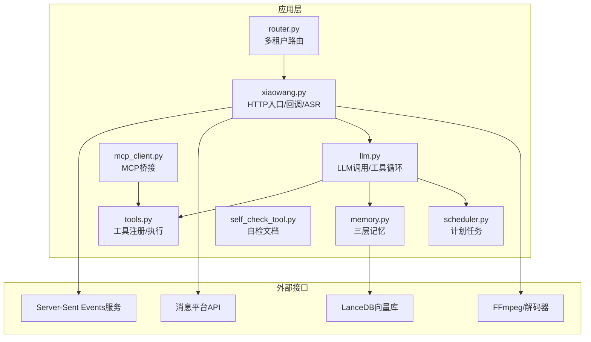
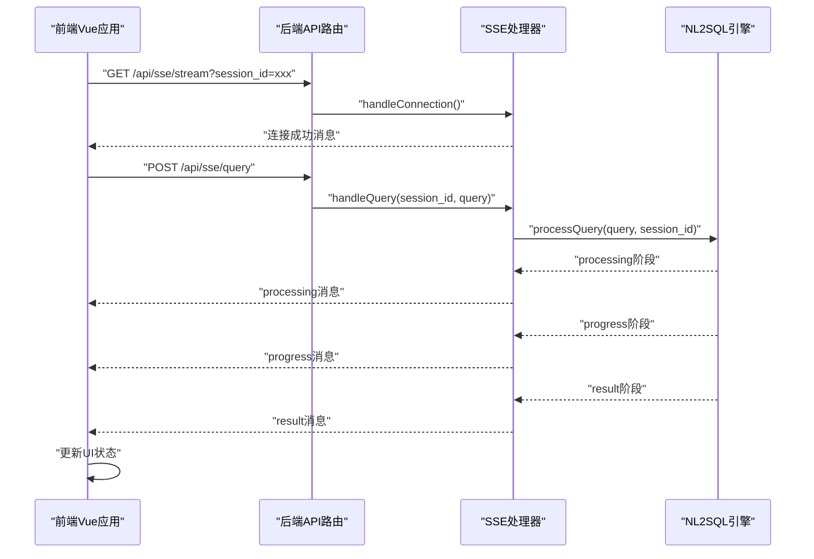
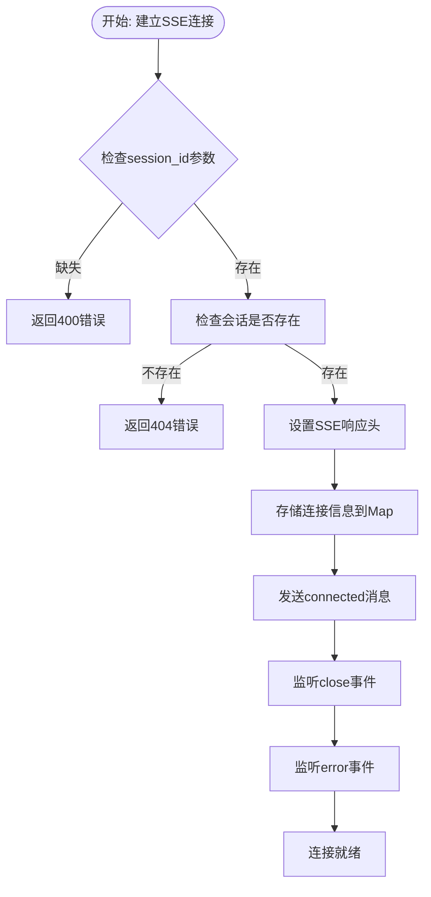
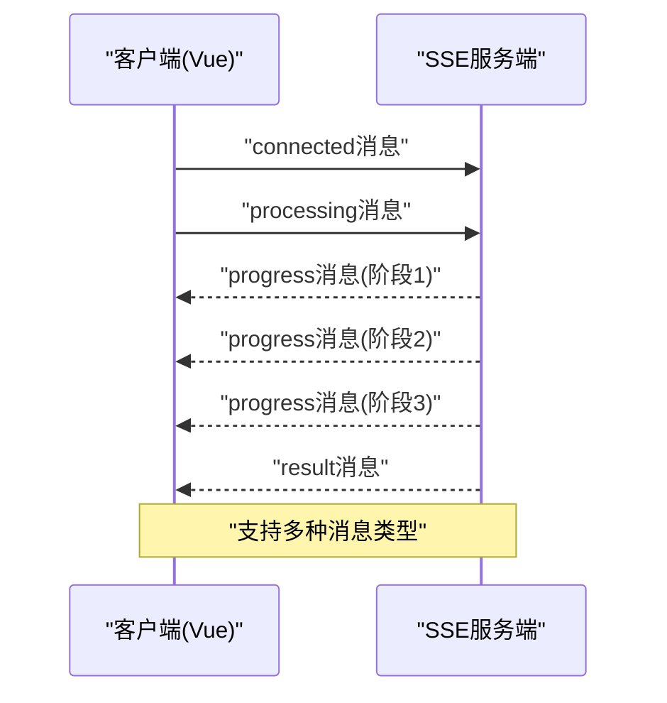
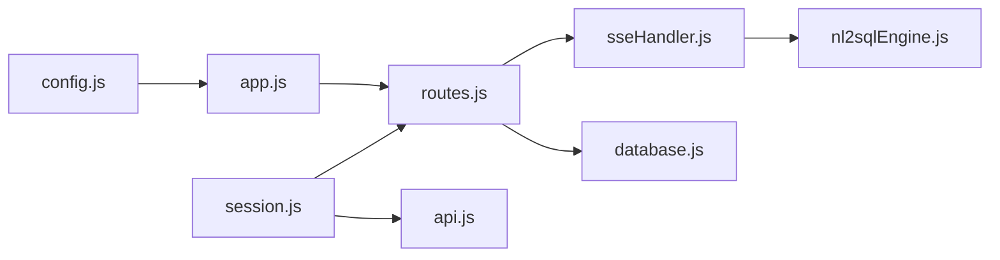
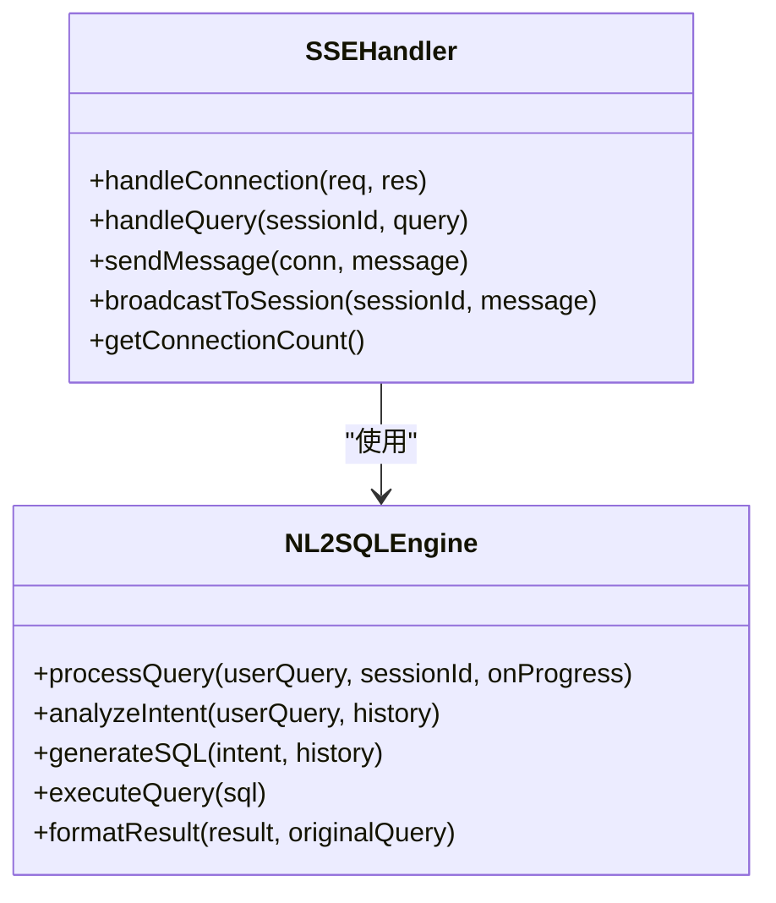

# WebSocket API

<cite>
**本文档引用的文件**
- [README.md](file://README.md)
- [config.example.json](file://config.example.json)
- [xiaowang.py](file://xiaowang.py)
- [llm.py](file://llm.py)
- [tools.py](file://tools.py)
- [memory.py](file://memory.py)
- [scheduler.py](file://scheduler.py)
- [router.py](file://router.py)
- [mcp_client.py](file://mcp_client.py)
- [self_check_tool.py](file://self_check_tool.py)
- [sseHandler.js](file://NL2SQL/backend/src/core/sseHandler.js)
- [routes.js](file://NL2SQL/backend/src/core/routes.js)
- [app.js](file://NL2SQL/backend/src/app.js)
- [session.js](file://NL2SQL/frontend/src/stores/session.js)
- [api.js](file://NL2SQL/frontend/src/utils/api.js)
- [nl2sqlEngine.js](file://NL2SQL/backend/src/core/nl2sqlEngine.js)
- [database.js](file://NL2SQL/backend/src/core/database.js)
- [config.js](file://NL2SQL/backend/src/core/config.js)
</cite>

## 更新摘要
**变更内容**
- 移除了WebSocket相关的内容，因为系统已完全迁移到Server-Sent Events (SSE)
- 新增了SSE实时通信机制的完整文档
- 更新了NL2SQL后端的实时查询处理流程
- 添加了前端Vue应用的SSE连接实现
- 移除了ASR WebSocket配置和实现

## 目录
1. [简介](#简介)
2. [项目结构](#项目结构)
3. [核心组件](#核心组件)
4. [架构总览](#架构总览)
5. [详细组件分析](#详细组件分析)
6. [依赖关系分析](#依赖关系分析)
7. [性能考虑](#性能考虑)
8. [故障排除指南](#故障排除指南)
9. [结论](#结论)
10. [附录](#附录)

## 简介
本文件为 724 Office 项目的 WebSocket API 完整技术文档，重点覆盖以下内容：
- Server-Sent Events (SSE) 实时通信机制
- NL2SQL后端的实时查询处理流程
- SSE连接建立、消息推送和状态管理
- 连接参数、错误处理与重试策略
- 在NL2SQL场景中的应用与性能考量

**重要更新**：系统现已完全迁移到Server-Sent Events (SSE) 实现实时通信，WebSocket功能已被移除。文档已相应更新以反映新的通信机制。

## 项目结构
项目采用"模块化单文件"设计，核心入口为 xiaowang.py，负责 HTTP 服务、回调处理、ASR 流程与消息分发；llm.py 提供大模型调用与工具循环；tools.py 注册与执行各类工具；memory.py 提供三层记忆系统；scheduler.py 提供定时任务；router.py 提供多租户路由；mcp_client.py 提供 MCP 协议桥接；self_check_tool.py 文档化自检与自修复模式。

**图表来源**
- [xiaowang.py:133-285](file://xiaowang.py#L133-L285)
- [llm.py:317-401](file://llm.py#L317-L401)
- [tools.py:58-74](file://tools.py#L58-L74)
- [memory.py:40-86](file://memory.py#L40-L86)
- [scheduler.py:30-43](file://scheduler.py#L30-L43)
- [router.py:469-493](file://router.py#L469-L493)
- [mcp_client.py:272-334](file://mcp_client.py#L272-L334)
- [self_check_tool.py:1-57](file://self_check_tool.py#L1-L57)

**章节来源**
- [README.md:1-162](file://README.md#L1-L162)
- [xiaowang.py:133-285](file://xiaowang.py#L133-L285)

## 核心组件
- **SSE处理器**：位于 NL2SQL/backend/src/core/sseHandler.js，负责SSE连接管理、消息推送和进度回调。
- **HTTP路由**：位于 NL2SQL/backend/src/core/routes.js，提供SSE连接端点和查询提交接口。
- **NL2SQL引擎**：位于 NL2SQL/backend/src/core/nl2sqlEngine.js，处理自然语言到SQL的转换并支持SSE流式推送。
- **前端SSE连接**：位于 NL2SQL/frontend/src/stores/session.js，管理Vue应用中的SSE连接和消息处理。
- **HTTP回调与消息处理**：xiaowang.py 接收消息平台回调，识别语音消息并触发 ASR。
- **工具循环与会话管理**：llm.py 提供工具循环、会话持久化与系统提示构建。
- **记忆系统**：memory.py 提供压缩、去重与检索三层记忆，支持零延迟硬件通道缓存。
- **多租户路由**：router.py 将不同用户路由到独立容器，支持自动编排与健康检查。
- **计划任务**：scheduler.py 提供一次性与周期性任务，支持心跳日志与失败通知。
- **MCP 桥接**：mcp_client.py 提供 JSON-RPC over stdio/HTTP 的 MCP 客户端，支持热重载与自动重连。
- **自检与自修复**：self_check_tool.py 文档化每日自检、诊断与修复流程。

**章节来源**
- [sseHandler.js:1-349](file://NL2SQL/backend/src/core/sseHandler.js#L1-L349)
- [routes.js:536-594](file://NL2SQL/backend/src/core/routes.js#L536-L594)
- [nl2sqlEngine.js:815-1012](file://NL2SQL/backend/src/core/nl2sqlEngine.js#L815-L1012)
- [session.js:182-293](file://NL2SQL/frontend/src/stores/session.js#L182-L293)
- [xiaowang.py:133-285](file://xiaowang.py#L133-L285)
- [llm.py:317-401](file://llm.py#L317-L401)
- [memory.py:40-86](file://memory.py#L40-L86)
- [scheduler.py:30-43](file://scheduler.py#L30-L43)
- [router.py:469-493](file://router.py#L469-L493)
- [mcp_client.py:272-334](file://mcp_client.py#L272-L334)
- [self_check_tool.py:1-57](file://self_check_tool.py#L1-L57)

## 架构总览
SSE实时通信在整体架构中的位置如下：

**图表来源**
- [routes.js:549-594](file://NL2SQL/backend/src/core/routes.js#L549-L594)
- [sseHandler.js:43-280](file://NL2SQL/backend/src/core/sseHandler.js#L43-L280)
- [nl2sqlEngine.js:825-1012](file://NL2SQL/backend/src/core/nl2sqlEngine.js#L825-L1012)
- [session.js:185-293](file://NL2SQL/frontend/src/stores/session.js#L185-L293)

## 详细组件分析

### Server-Sent Events (SSE) 连接与认证机制
- **连接端点**：`/api/sse/stream`，支持查询参数 `session_id` 和 `user_id`。
- **连接管理**：使用Map结构存储活跃连接，支持多标签页连接。
- **认证参数**：
  - `session_id`：必需参数，用于标识会话
  - `user_id`：可选参数，默认为 `anonymous`
- **连接状态**：维护连接时间、最后活跃时间、处理状态等信息。
- **连接清理**：监听 `close` 和 `error` 事件，自动清理连接映射。

**图表来源**
- [sseHandler.js:43-153](file://NL2SQL/backend/src/core/sseHandler.js#L43-L153)

**章节来源**
- [routes.js:549-551](file://NL2SQL/backend/src/core/routes.js#L549-L551)
- [sseHandler.js:43-153](file://NL2SQL/backend/src/core/sseHandler.js#L43-L153)

### 实时查询处理协议规范
- **消息类型**：
  - `connected`：连接成功消息
  - `processing`：开始处理消息
  - `progress`：进度更新消息
  - `result`：查询结果消息
  - `clarify`：需要澄清消息
  - `error`：错误消息
- **数据结构要点**：
  - 每条消息包含 `type` 和 `data` 字段
  - `processing` 和 `progress` 消息包含进度信息
  - `result` 消息包含格式化后的回复、SQL语句和查询数据
  - `clarify` 消息包含澄清问题和缺失信息
- **前端处理**：Vue应用根据消息类型更新UI状态和显示内容。
- **超时控制**：HTTP请求超时时间为30秒，SSE连接保持长连接。

**图表来源**
- [session.js:227-293](file://NL2SQL/frontend/src/stores/session.js#L227-L293)
- [sseHandler.js:218-280](file://NL2SQL/backend/src/core/sseHandler.js#L218-L280)

**章节来源**
- [session.js:227-293](file://NL2SQL/frontend/src/stores/session.js#L227-L293)
- [sseHandler.js:218-280](file://NL2SQL/backend/src/core/sseHandler.js#L218-L280)

### NL2SQL引擎的SSE集成
- **查询处理流程**：`processQuery` 函数支持进度回调，通过SSE推送实时状态。
- **进度回调**：支持 `loading_history`、`analyzing`、`clarifying`、`generating`、`validating`、`executing`、`formatting` 等阶段。
- **消息推送**：使用 `broadcastToSession` 函数向会话的所有连接推送消息。
- **错误处理**：查询失败时通过SSE发送 `error` 消息。
- **澄清机制**：需要更多信息时发送 `clarify` 消息，等待用户回复。

**章节来源**
- [nl2sqlEngine.js:825-1012](file://NL2SQL/backend/src/core/nl2sqlEngine.js#L825-L1012)
- [sseHandler.js:218-280](file://NL2SQL/backend/src/core/sseHandler.js#L218-L280)

### 前端Vue应用的SSE连接实现
- **EventSource连接**：使用浏览器原生 `EventSource` API建立SSE连接。
- **连接状态管理**：维护 `isConnected`、`isProcessing`、`processingStatus`、`processingProgress` 状态。
- **消息处理**：根据消息类型更新UI状态，支持多种消息类型的处理。
- **自动重连**：连接断开时自动重新连接，支持多标签页场景。
- **进度显示**：实时显示查询进度和状态信息。

**章节来源**
- [session.js:182-293](file://NL2SQL/frontend/src/stores/session.js#L182-L293)
- [api.js:246-251](file://NL2SQL/frontend/src/utils/api.js#L246-L251)

### 错误处理与重试策略
- **连接错误**：`handleError` 函数记录错误并清理连接映射。
- **业务错误**：查询处理失败时通过SSE发送 `error` 消息。
- **超时处理**：HTTP请求超时30秒，SSE连接保持长连接。
- **重试机制**：前端Vue应用支持自动重连，后端SSE处理器自动清理无效连接。
- **日志记录**：所有错误均通过日志记录，便于定位问题。

**章节来源**
- [sseHandler.js:145-153](file://NL2SQL/backend/src/core/sseHandler.js#L145-L153)
- [session.js:194-217](file://NL2SQL/frontend/src/stores/session.js#L194-L217)

### 在NL2SQL中的应用场景与集成
- **实时查询处理**：用户提交查询后，系统通过SSE实时推送处理进度和结果。
- **多标签页支持**：SSE连接映射支持同一会话的多标签页连接。
- **会话管理**：数据库模块提供会话的创建、查询和删除功能。
- **消息持久化**：所有查询历史和消息通过SQLite数据库持久化存储。
- **健康监控**：系统提供健康检查接口，监控SSE连接状态和系统性能。

**章节来源**
- [routes.js:264-396](file://NL2SQL/backend/src/core/routes.js#L264-L396)
- [database.js:374-456](file://NL2SQL/backend/src/core/database.js#L374-L456)
- [routes.js:98-135](file://NL2SQL/backend/src/core/routes.js#L98-L135)

## 依赖关系分析
- **内部模块耦合**：
  - `sseHandler.js` 依赖 `nl2sqlEngine.js` 进行查询处理。
  - `routes.js` 依赖 `sseHandler.js` 处理SSE连接和查询。
  - `session.js` 依赖 `api.js` 进行HTTP通信。
  - `database.js` 提供会话和消息的持久化存储。
  - `config.js` 提供全局配置管理。
- **外部依赖**：
  - `express`：Web服务器框架
  - `cors`：跨域处理中间件
  - `body-parser`：请求体解析中间件
  - `sqlite3`：SQLite数据库驱动
  - `axios`：HTTP客户端库
  - `uuid`：UUID生成库

**图表来源**
- [app.js:48-50](file://NL2SQL/backend/src/app.js#L48-L50)
- [routes.js:26-27](file://NL2SQL/backend/src/core/routes.js#L26-L27)
- [sseHandler.js:15-20](file://NL2SQL/backend/src/core/sseHandler.js#L15-L20)
- [session.js:22](file://NL2SQL/frontend/src/stores/session.js#L22)
- [api.js:15](file://NL2SQL/frontend/src/utils/api.js#L15)

**章节来源**
- [app.js:23-33](file://NL2SQL/backend/src/app.js#L23-L33)
- [routes.js:16-27](file://NL2SQL/backend/src/core/routes.js#L16-L27)
- [config.js:16](file://NL2SQL/backend/src/core/config.js#L16)

## 性能考虑
- **连接复用**：同一会话内的多标签页共享连接，减少连接开销。
- **流式处理**：SSE支持流式消息推送，降低延迟。
- **内存管理**：连接映射使用WeakMap避免内存泄漏。
- **数据库优化**：SQLite数据库提供高效的查询和存储。
- **前端优化**：Vue响应式系统只更新变化的部分。
- **网络优化**：SSE连接保持长连接，避免频繁握手开销。

## 故障排除指南
- **SSE连接失败**：检查 `session_id` 参数是否正确传递。
- **查询处理超时**：检查NL2SQL引擎的处理时间，可能需要调整超时设置。
- **前端连接断开**：检查EventSource的自动重连机制是否正常工作。
- **消息丢失**：确认SSE连接状态和消息推送逻辑。
- **数据库连接问题**：检查SQLite数据库文件权限和路径配置。
- **配置错误**：检查 `.env` 文件中的配置项是否正确设置。

**章节来源**
- [routes.js:564-594](file://NL2SQL/backend/src/core/routes.js#L564-L594)
- [session.js:194-217](file://NL2SQL/frontend/src/stores/session.js#L194-L217)
- [config.js:257-279](file://NL2SQL/backend/src/core/config.js#L257-L279)

## 结论
724 Office 的 SSE 实时通信能力通过简洁可靠的协议与严格的错误处理，实现了从用户查询到结果的高效实时反馈。其设计遵循"零框架依赖"的原则，易于部署与维护。SSE相比WebSocket具有更好的浏览器兼容性和更低的复杂度，特别适合实时状态推送和流式数据传输场景。建议在生产环境中结合多租户路由、计划任务与自检机制，确保系统的高可用与可演进性。

## 附录

### SSE API端点参考
- **GET `/api/sse/stream`**：建立SSE连接，查询参数 `session_id` 和 `user_id`
- **POST `/api/sse/query`**：提交查询请求，请求体包含 `session_id` 和 `query`

**章节来源**
- [routes.js:549-594](file://NL2SQL/backend/src/core/routes.js#L549-L594)

### 前端SSE连接配置
- **EventSource URL**：`/api/sse/stream?session_id=${currentSessionId.value}`
- **消息类型**：`connected`、`processing`、`progress`、`result`、`clarify`、`error`
- **连接状态**：`isConnected`、`isProcessing`、`processingStatus`、`processingProgress`

**章节来源**
- [session.js:185-293](file://NL2SQL/frontend/src/stores/session.js#L185-L293)

### 关键流程图（类图）

**图表来源**
- [sseHandler.js:43-280](file://NL2SQL/backend/src/core/sseHandler.js#L43-L280)
- [nl2sqlEngine.js:825-1012](file://NL2SQL/backend/src/core/nl2sqlEngine.js#L825-L1012)