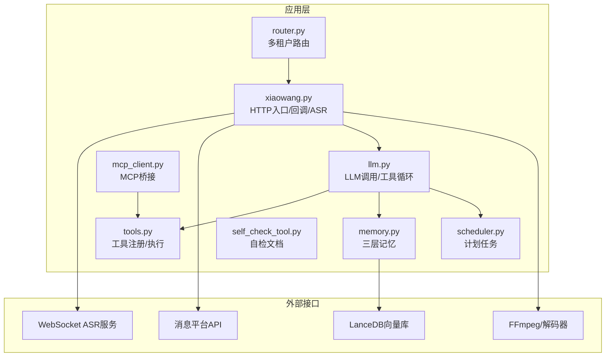
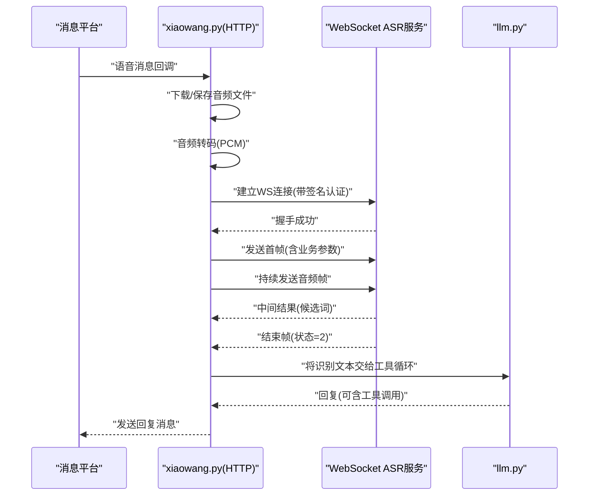
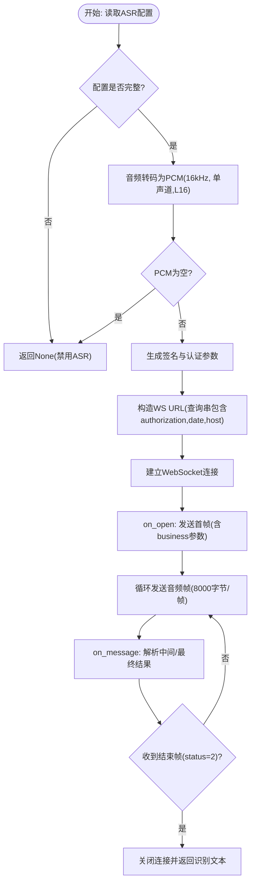
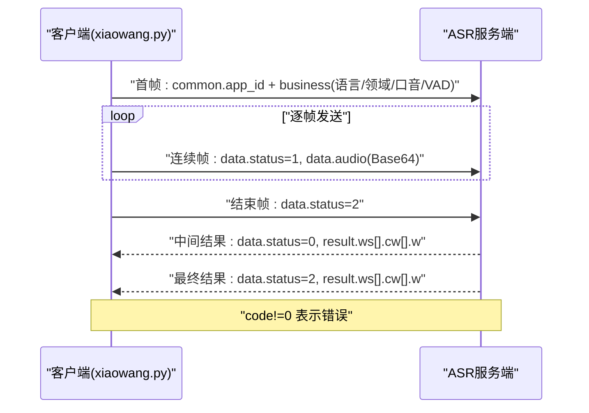
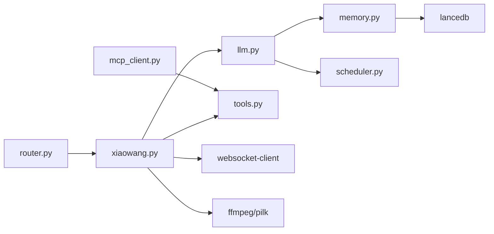
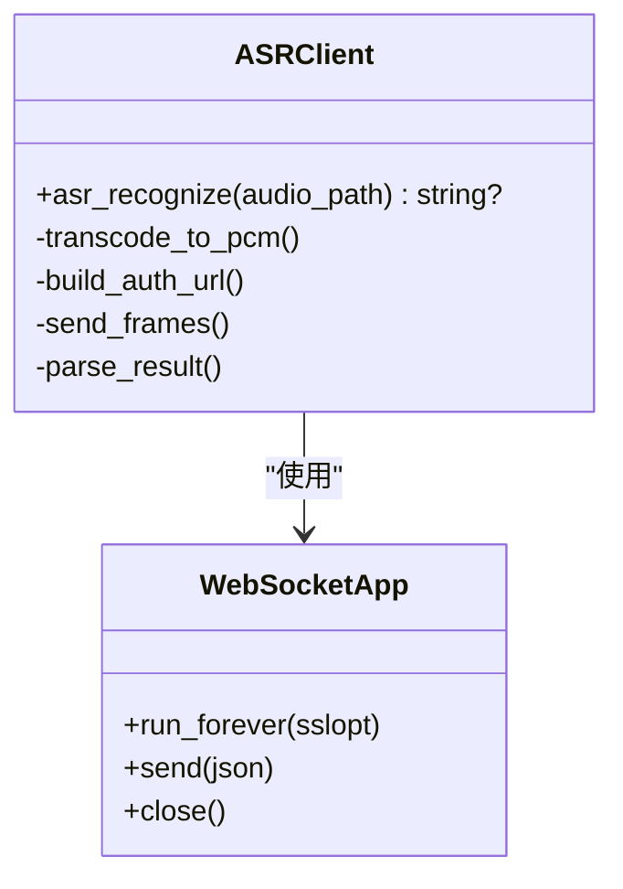

# WebSocket API

<cite>
**本文档引用的文件**
- [README.md](file://README.md)
- [config.example.json](file://config.example.json)
- [xiaowang.py](file://xiaowang.py)
- [llm.py](file://llm.py)
- [tools.py](file://tools.py)
- [memory.py](file://memory.py)
- [scheduler.py](file://scheduler.py)
- [router.py](file://router.py)
- [mcp_client.py](file://mcp_client.py)
- [self_check_tool.py](file://self_check_tool.py)
</cite>

## 目录
1. [简介](#简介)
2. [项目结构](#项目结构)
3. [核心组件](#核心组件)
4. [架构总览](#架构总览)
5. [详细组件分析](#详细组件分析)
6. [依赖关系分析](#依赖关系分析)
7. [性能考虑](#性能考虑)
8. [故障排除指南](#故障排除指南)
9. [结论](#结论)
10. [附录](#附录)

## 简介
本文件为 724 Office 项目的 WebSocket API 完整技术文档，重点覆盖以下内容：
- WebSocket 连接建立流程与认证机制
- 实时语音识别（ASR）的 WebSocket 协议规范
- 音频数据传输格式、消息序列与状态管理
- 连接参数、错误处理与重试策略
- 在 ASR 场景中的应用与性能考量

该项目以纯 Python 构建，不依赖框架，具备零配置依赖（仅使用标准库与少量小包），支持多租户路由、工具调用循环、内存系统、计划任务、MCP 插件桥接等能力。其中 WebSocket ASR 能力通过内置的音频转码与 WebSocket 客户端实现，用于将语音消息转换为文本。

## 项目结构
项目采用“模块化单文件”设计，核心入口为 xiaowang.py，负责 HTTP 服务、回调处理、ASR 流程与消息分发；llm.py 提供大模型调用与工具循环；tools.py 注册与执行各类工具；memory.py 提供三层记忆系统；scheduler.py 提供定时任务；router.py 提供多租户容器路由；mcp_client.py 提供 MCP 协议桥接；self_check_tool.py 文档化自检与自修复模式。

**图表来源**
- [xiaowang.py:133-285](file://xiaowang.py#L133-L285)
- [llm.py:317-401](file://llm.py#L317-L401)
- [tools.py:58-74](file://tools.py#L58-L74)
- [memory.py:40-86](file://memory.py#L40-L86)
- [scheduler.py:30-43](file://scheduler.py#L30-L43)
- [router.py:469-493](file://router.py#L469-L493)
- [mcp_client.py:272-334](file://mcp_client.py#L272-L334)
- [self_check_tool.py:1-57](file://self_check_tool.py#L1-L57)

**章节来源**
- [README.md:1-162](file://README.md#L1-L162)
- [xiaowang.py:133-285](file://xiaowang.py#L133-L285)

## 核心组件
- WebSocket ASR 组件：位于 xiaowang.py 的 asr_recognize 函数，负责音频转码、签名认证、WebSocket 建连、音频帧发送与结果解析。
- HTTP 回调与消息处理：xiaowang.py 接收消息平台回调，识别语音消息并触发 ASR。
- 工具循环与会话管理：llm.py 提供工具循环、会话持久化与系统提示构建。
- 记忆系统：memory.py 提供压缩、去重与检索三层记忆，支持零延迟硬件通道缓存。
- 多租户路由：router.py 将不同用户路由到独立容器，支持自动编排与健康检查。
- 计划任务：scheduler.py 提供一次性与周期性任务，支持心跳日志与失败通知。
- MCP 桥接：mcp_client.py 提供 JSON-RPC over stdio/HTTP 的 MCP 客户端，支持热重载与自动重连。
- 自检与自修复：self_check_tool.py 文档化每日自检、诊断与修复流程。

**章节来源**
- [xiaowang.py:133-285](file://xiaowang.py#L133-L285)
- [llm.py:317-401](file://llm.py#L317-L401)
- [memory.py:40-86](file://memory.py#L40-L86)
- [scheduler.py:30-43](file://scheduler.py#L30-L43)
- [router.py:469-493](file://router.py#L469-L493)
- [mcp_client.py:272-334](file://mcp_client.py#L272-L334)
- [self_check_tool.py:1-57](file://self_check_tool.py#L1-L57)

## 架构总览
WebSocket ASR 在整体架构中的位置如下：

**图表来源**
- [xiaowang.py:140-285](file://xiaowang.py#L140-L285)
- [llm.py:317-401](file://llm.py#L317-L401)

## 详细组件分析

### WebSocket 连接与认证机制
- 连接目标：从配置中读取 ws_url，默认为 wss://asr-api.example.com/v2/asr。
- 认证参数：
  - app_id：来自配置 asr.app_id
  - api_key：来自配置 asr.api_key
  - api_secret：来自配置 asr.api_secret
- 时间戳：使用 UTC 时间生成 date 字段。
- 签名算法：基于 HMAC-SHA256 对请求行与头部进行签名，再经 Base64 编码。
- 认证头：将签名后的字符串进行 Base64 编码后作为 authorization 参数拼接到查询字符串。
- 主机与路径：固定 host 为 asr-api.example.com，路径为 /v2/asr。
- 连接方式：使用 websocket-client 库的 WebSocketApp，run_forever(sslopt={"cert_reqs": ssl.CERT_NONE})。

**图表来源**
- [xiaowang.py:140-285](file://xiaowang.py#L140-L285)

**章节来源**
- [xiaowang.py:137-201](file://xiaowang.py#L137-L201)
- [config.example.json:39-44](file://config.example.json#L39-L44)

### 实时语音识别协议规范
- 传输格式：音频编码为 audio/L16;rate=16000，原始数据（raw），每帧大小 8000 字节。
- 帧状态：
  - 首帧：status=0，携带 common.app_id 与 business 参数（语言、领域、口音、VAD 结束时间）。
  - 连续帧：status=1，仅携带 data.audio。
  - 结束帧：status=2，表示音频结束。
- 数据结构要点：
  - common：仅首帧存在，包含 app_id。
  - business：仅首帧存在，包含语言、领域、口音、VAD 结束时间等。
  - data：包含 status、format、encoding、audio（Base64）。
- 结果解析：
  - 服务器返回 JSON，包含 code、message、data.result.ws[].cw[].w。
  - 当 code 非 0 时，视为错误；当 data.status=2 时，表示识别完成。
- 超时控制：WebSocket 会话等待最多 30 秒，超时则关闭连接并返回 None。

**图表来源**
- [xiaowang.py:230-285](file://xiaowang.py#L230-L285)

**章节来源**
- [xiaowang.py:230-285](file://xiaowang.py#L230-L285)

### 音频数据编码与转码
- 输入音频类型检测：若文件头包含 "SILK"，使用 pilk 解码；否则使用 ffmpeg 将输入音频转码为 16kHz、单声道、L16 格式输出至 .pcm 文件。
- 输出格式：audio/L16;rate=16000，raw 编码，Base64 后嵌入到 WebSocket 消息的 data.audio 字段。
- 转码异常处理：转码失败或生成的 PCM 为空时，记录错误并返回 None。

**章节来源**
- [xiaowang.py:140-176](file://xiaowang.py#L140-L176)

### 错误处理与重试策略
- 连接错误：on_error 回调捕获 WebSocket 异常，设置 done_event 并记录错误。
- 业务错误：on_message 中若 code 非 0，记录错误并设置 done_event。
- 超时：WebSocket 会话等待最多 30 秒，超时后关闭连接。
- 重试：当前实现未内置自动重试逻辑，建议上层调用方根据场景自行重试。
- 日志：所有错误均通过日志记录，便于定位问题。

**章节来源**
- [xiaowang.py:207-285](file://xiaowang.py#L207-L285)

### 在 ASR 中的应用场景与集成
- 语音消息处理：消息平台回调触发后，下载语音文件并保存，随后调用 asr_recognize 进行识别，识别结果回写到对话流。
- 工具循环：识别文本进入 llm.chat，由工具循环决定是否调用外部工具或直接回复。
- 多租户：router.py 将不同用户路由到独立容器，每个容器内运行独立的 xiaowang.py 实例，互不影响。
- 计划任务：可调度每日自检、清理与维护任务，保障 ASR 服务稳定性。

**章节来源**
- [xiaowang.py:467-487](file://xiaowang.py#L467-L487)
- [router.py:397-418](file://router.py#L397-L418)
- [scheduler.py:166-186](file://scheduler.py#L166-L186)

## 依赖关系分析
- 内部模块耦合：
  - xiaowang.py 依赖 llm.py 进行工具循环与会话管理。
  - xiaowang.py 依赖 tools.py 的工具定义与执行。
  - memory.py 与 llm.py 协作，提供记忆注入与检索。
  - router.py 与 xiaowang.py 协作，实现多租户路由。
  - mcp_client.py 与 tools.py 协作，提供外部工具桥接。
- 外部依赖：
  - websocket-client：WebSocket 客户端库。
  - lancedb：向量数据库，用于记忆检索。
  - croniter：计划任务表达式解析。
  - 其他：ffmpeg、pilk（可选，用于音频解码）。

**图表来源**
- [xiaowang.py:59-76](file://xiaowang.py#L59-L76)
- [llm.py:17-39](file://llm.py#L17-L39)
- [memory.py:58-84](file://memory.py#L58-L84)
- [scheduler.py:30-43](file://scheduler.py#L30-L43)
- [router.py:469-493](file://router.py#L469-L493)
- [mcp_client.py:272-334](file://mcp_client.py#L272-L334)

**章节来源**
- [README.md:101-137](file://README.md#L101-L137)

## 性能考虑
- 帧大小与延迟：每帧 8000 字节，约 0.04 秒间隔，模拟实时流，降低端到端延迟。
- 转码开销：SILK 使用 pilk 解码，其他格式使用 ffmpeg，建议在边缘设备上评估 CPU 占用。
- 连接复用：同一会话内复用 WebSocket 连接，避免频繁握手。
- 超时与并发：WebSocket 会话超时 30 秒，建议结合上层重试与并发控制。
- 存储与网络：音频文件先落盘再转码，注意磁盘 IO 与网络下载带宽。

[本节为通用性能讨论，无需具体文件分析]

## 故障排除指南
- ASR 未启用：确认配置中存在 asr 节点且字段完整。
- 转码失败：检查输入音频格式与 ffmpeg/pilk 可用性；确认权限与临时目录空间。
- WebSocket 连接失败：检查网络连通性、证书配置（sslopt）、代理设置。
- 认证失败：核对 app_id、api_key、api_secret 是否正确；确认日期与时区。
- 识别结果为空：确认音频质量与长度；检查 VAD 结束时间设置；尝试增大静音容忍。
- 超时：延长等待时间或优化网络环境；检查服务端限流策略。

**章节来源**
- [xiaowang.py:140-176](file://xiaowang.py#L140-L176)
- [xiaowang.py:207-285](file://xiaowang.py#L207-L285)
- [config.example.json:39-44](file://config.example.json#L39-L44)

## 结论
724 Office 的 WebSocket ASR 能力通过简洁可靠的协议与严格的错误处理，实现了从语音消息到文本的高效转换。其设计遵循“零框架依赖”的原则，易于部署与维护。建议在生产环境中结合多租户路由、计划任务与自检机制，确保系统的高可用与可演进性。

[本节为总结性内容，无需具体文件分析]

## 附录

### 配置项参考
- asr.app_id：应用标识
- asr.api_key：API 密钥
- asr.api_secret：API 密钥（用于签名）
- asr.ws_url：WebSocket 服务地址（默认 wss://asr-api.example.com/v2/asr）

**章节来源**
- [config.example.json:39-44](file://config.example.json#L39-L44)

### 关键流程图（类图）

**图表来源**
- [xiaowang.py:140-285](file://xiaowang.py#L140-L285)