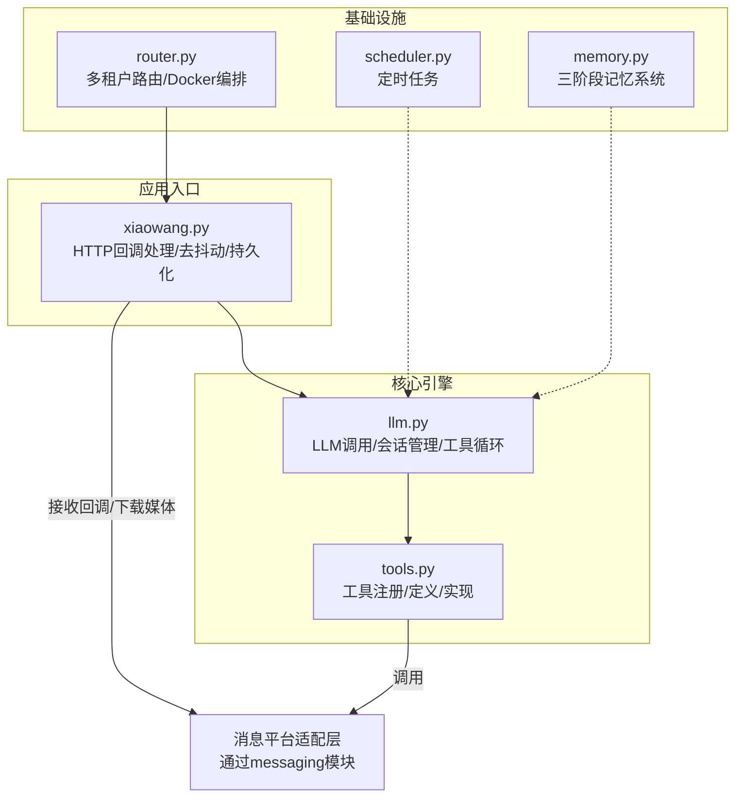
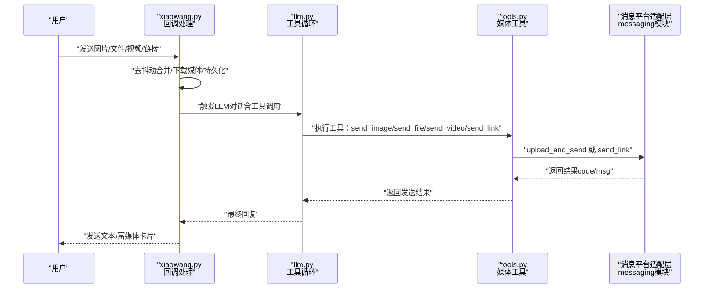
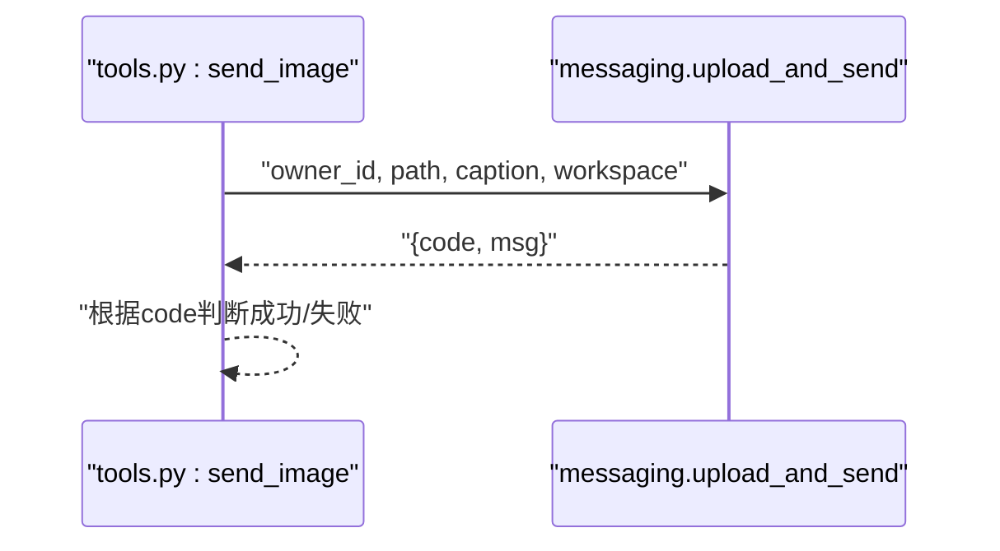
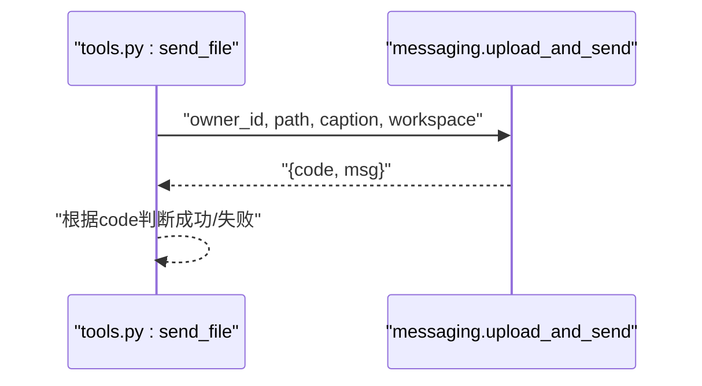
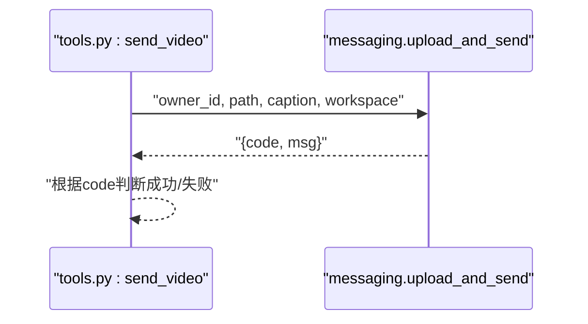
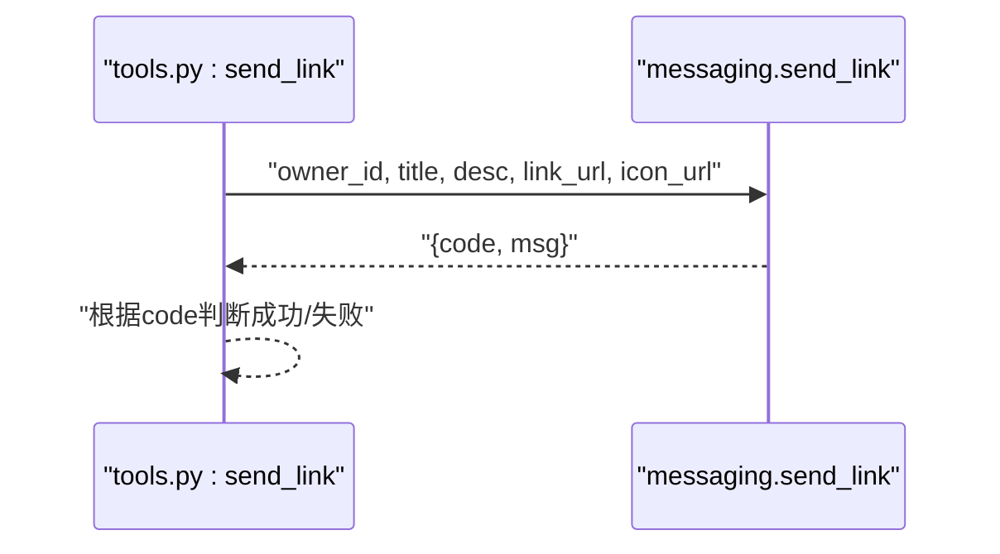
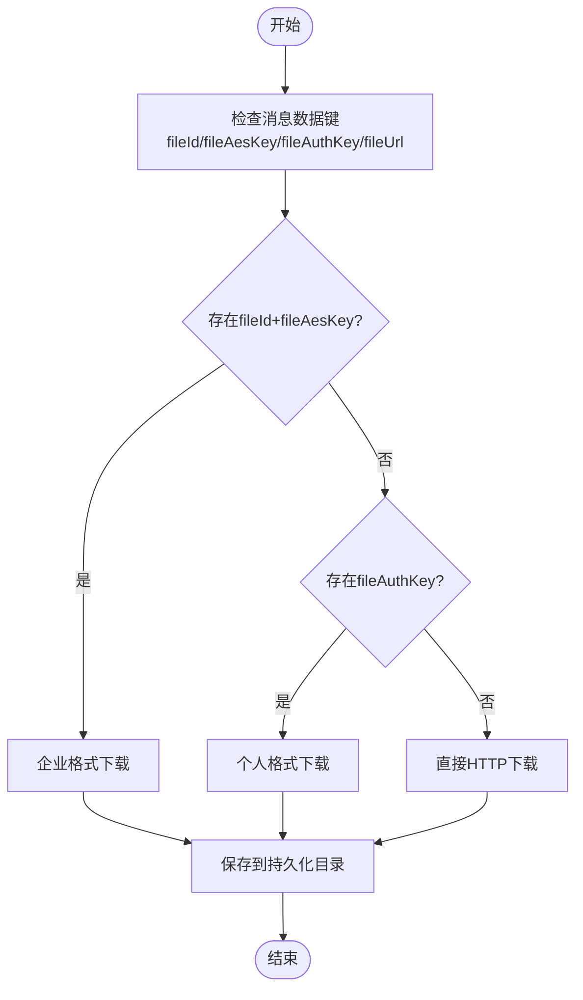
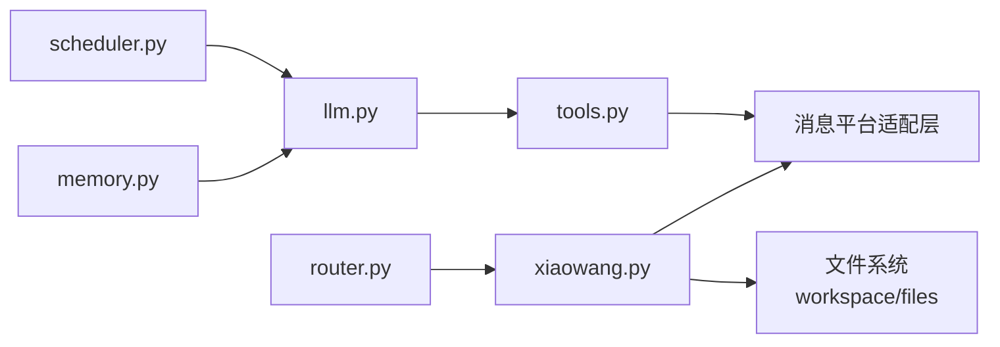

# 媒体工具

<cite>
**本文档引用的文件**
- [README.md](file://README.md)
- [tools.py](file://tools.py)
- [xiaowang.py](file://xiaowang.py)
- [llm.py](file://llm.py)
- [router.py](file://router.py)
- [scheduler.py](file://scheduler.py)
- [memory.py](file://memory.py)
</cite>

## 目录
1. [简介](#简介)
2. [项目结构](#项目结构)
3. [核心组件](#核心组件)
4. [架构总览](#架构总览)
5. [详细组件分析](#详细组件分析)
6. [依赖分析](#依赖分析)
7. [性能考虑](#性能考虑)
8. [故障排查指南](#故障排查指南)
9. [结论](#结论)
10. [附录](#附录)

## 简介
本文件面向“媒体工具”API，聚焦以下四个工具的使用与实现细节：
- send_image：发送图片（支持本地路径或HTTP/HTTPS URL）
- send_file：发送文件（PDF、Excel、Word、ZIP等），支持本地路径或HTTP/HTTPS URL
- send_video：发送视频（MP4），支持本地路径或HTTP/HTTPS URL
- send_link：发送富文本链接卡片（标题、描述、点击链接、可选图标）

内容涵盖：
- 支持的媒体格式与参数配置
- 上传机制与发送流程
- 本地文件路径处理与URL下载机制
- 消息平台集成方式
- 最佳实践与性能优化建议

## 项目结构
该系统采用“工具注册 + LLM调用循环 + 多租户路由 + 消息平台适配”的分层设计。媒体工具位于工具注册表中，通过统一的工具执行器对外暴露；实际的消息发送由消息平台适配层完成。

图表来源
- [xiaowang.py:1-626](file://xiaowang.py#L1-L626)
- [llm.py:1-401](file://llm.py#L1-L401)
- [tools.py:1-1153](file://tools.py#L1-L1153)
- [router.py:1-493](file://router.py#L1-L493)
- [scheduler.py:1-219](file://scheduler.py#L1-L219)
- [memory.py:1-361](file://memory.py#L1-L361)

章节来源
- [README.md:1-162](file://README.md#L1-L162)
- [tools.py:264-302](file://tools.py#L264-L302)
- [xiaowang.py:383-433](file://xiaowang.py#L383-L433)

## 核心组件
- 工具注册与执行
  - 工具以装饰器形式注册，统一暴露函数定义与执行接口
  - 执行时注入上下文（包含owner_id、workspace、session_key）
- 媒体发送工具
  - send_image/send_file/send_video：统一调用消息平台上传与发送
  - send_link：直接发送富文本链接卡片
- 消息平台适配
  - 通过messaging模块封装上传、下载、发送等能力（具体实现由消息平台适配层提供）
- 去抖动与回调处理
  - 接收消息后进行去抖动合并，再进入LLM工具循环
  - 支持多种媒体类型下载与本地持久化

章节来源
- [tools.py:36-74](file://tools.py#L36-L74)
- [tools.py:264-302](file://tools.py#L264-L302)
- [xiaowang.py:316-378](file://xiaowang.py#L316-L378)

## 架构总览
媒体工具的调用链路如下：

图表来源
- [tools.py:264-302](file://tools.py#L264-L302)
- [xiaowang.py:383-433](file://xiaowang.py#L383-L433)
- [llm.py:317-401](file://llm.py#L317-L401)

## 详细组件分析

### send_image 图片发送工具
- 功能概述
  - 将图片（本地路径或HTTP/HTTPS URL）上传并发送给指定接收者
  - 可选添加标题文字（caption）
- 参数配置
  - path：必填，本地绝对/相对路径或HTTP/HTTPS URL
  - caption：可选，图片标题
- 上传与发送机制
  - 调用消息平台适配层的上传与发送接口
  - 返回值包含状态码与消息，0表示成功
- 本地路径与URL处理
  - 若为URL，先下载到临时目录，再上传
  - 若为本地路径，直接上传
- 发送流程
  - 工具层 -> 消息平台适配层 -> 平台上传 -> 平台发送

图表来源
- [tools.py:266-272](file://tools.py#L266-L272)

章节来源
- [tools.py:266-272](file://tools.py#L266-L272)

### send_file 文件发送工具
- 功能概述
  - 发送各类文件（PDF、Excel、Word、ZIP等），支持本地路径或HTTP/HTTPS URL
  - 可选添加标题文字（caption）
- 参数配置
  - path：必填，本地绝对/相对路径或HTTP/HTTPS URL
  - caption：可选，文件标题
- 上传与发送机制
  - 统一通过消息平台适配层上传与发送
- 本地路径与URL处理
  - URL自动下载至临时目录，再上传
  - 本地路径直接上传
- 发送流程
  - 工具层 -> 消息平台适配层 -> 平台上传 -> 平台发送

图表来源
- [tools.py:275-281](file://tools.py#L275-L281)

章节来源
- [tools.py:275-281](file://tools.py#L275-L281)

### send_video 视频发送工具
- 功能概述
  - 发送视频（MP4），支持本地路径或HTTP/HTTPS URL
  - 可选添加标题文字（caption）
- 参数配置
  - path：必填，本地绝对/相对路径或HTTP/HTTPS URL
  - caption：可选，视频标题
- 上传与发送机制
  - 统一通过消息平台适配层上传与发送
- 本地路径与URL处理
  - URL自动下载至临时目录，再上传
  - 本地路径直接上传
- 发送流程
  - 工具层 -> 消息平台适配层 -> 平台上传 -> 平台发送

图表来源
- [tools.py:284-290](file://tools.py#L284-L290)

章节来源
- [tools.py:284-290](file://tools.py#L284-L290)

### send_link 链接卡片发送工具
- 功能概述
  - 发送富文本链接卡片，包含标题、描述、点击链接，可选图标
- 参数配置
  - title：必填，卡片标题
  - desc：必填，卡片描述
  - link_url：必填，点击跳转URL
  - icon_url：可选，卡片图标URL
- 发送机制
  - 直接调用消息平台适配层的链接发送接口
- 发送流程
  - 工具层 -> 消息平台适配层 -> 平台发送

图表来源
- [tools.py:293-301](file://tools.py#L293-L301)

章节来源
- [tools.py:293-301](file://tools.py#L293-L301)

### URL下载与本地路径处理
- URL下载策略
  - 优先尝试企业格式（fileId + AES密钥）下载
  - 其次尝试个人格式（fileAuthKey + URL）下载
  - 最后回退到直接HTTP下载
- 本地路径处理
  - 绝对路径直接使用
  - 相对路径拼接到工作空间目录
- 下载与持久化
  - 下载完成后移动到按年月分桶的持久化目录
  - 记录文件索引（类型、大小、时间、路径等）

图表来源
- [xiaowang.py:383-433](file://xiaowang.py#L383-L433)
- [xiaowang.py:99-132](file://xiaowang.py#L99-L132)

章节来源
- [xiaowang.py:383-433](file://xiaowang.py#L383-L433)
- [xiaowang.py:99-132](file://xiaowang.py#L99-L132)

### 消息平台集成
- 工具层通过messaging模块抽象消息平台能力
- send_image/send_file/send_video均调用统一的上传与发送接口
- send_link调用专用的链接发送接口
- 平台侧负责：
  - 上传媒体资源（图片/文件/视频）
  - 发送富媒体卡片（图片/文件/视频/链接）
  - 提供上传结果（状态码与消息）

章节来源
- [tools.py:266-301](file://tools.py#L266-L301)

## 依赖分析
- 工具层依赖
  - messaging模块：提供上传与发送能力
  - 工作空间目录：用于本地文件解析与持久化
- 回调处理依赖
  - 去抖动缓冲：合并短时间内的多条消息
  - 媒体下载：根据消息字段选择最优下载路径
  - 持久化：将下载后的文件按月归档并记录索引
- LLM循环依赖
  - 工具定义：工具注册表提供工具定义
  - 上下文：传递owner_id、workspace、session_key

图表来源
- [tools.py:80-83](file://tools.py#L80-L83)
- [xiaowang.py:59-76](file://xiaowang.py#L59-L76)
- [llm.py:17-20](file://llm.py#L17-L20)
- [router.py:1-493](file://router.py#L1-L493)
- [scheduler.py:1-219](file://scheduler.py#L1-L219)
- [memory.py:1-361](file://memory.py#L1-L361)

章节来源
- [tools.py:80-83](file://tools.py#L80-L83)
- [xiaowang.py:59-76](file://xiaowang.py#L59-L76)
- [llm.py:17-20](file://llm.py#L17-L20)

## 性能考虑
- 去抖动
  - 对短时间内到达的多条消息进行合并，减少LLM调用次数与平台发送频率
- 上传与发送
  - 使用统一的上传接口，避免重复上传相同资源
  - 成功/失败状态码用于快速判定，便于重试与降级
- URL下载
  - 优先企业/个人格式下载，减少HTTP直连开销
  - 下载完成后立即持久化，避免重复下载
- 文件持久化
  - 按年月分桶存储，便于清理与检索
  - 索引记录文件元信息，支持列表查询

章节来源
- [xiaowang.py:316-378](file://xiaowang.py#L316-L378)
- [xiaowang.py:383-433](file://xiaowang.py#L383-L433)
- [xiaowang.py:99-132](file://xiaowang.py#L99-L132)

## 故障排查指南
- 工具执行错误
  - 工具执行器捕获异常并返回错误信息
  - 检查日志输出，定位具体错误原因
- 上传/发送失败
  - 检查返回的状态码与消息
  - 确认消息平台适配层配置正确
- URL下载失败
  - 检查消息数据中的fileId/fileAesKey/fileAuthKey/fileUrl字段
  - 确认网络可达性与URL有效性
- 本地路径无效
  - 确认路径为绝对路径或相对于工作空间的相对路径
  - 检查文件是否存在且可读

章节来源
- [tools.py:63-74](file://tools.py#L63-L74)
- [tools.py:266-301](file://tools.py#L266-L301)
- [xiaowang.py:383-433](file://xiaowang.py#L383-L433)

## 结论
媒体工具通过统一的工具注册与执行框架，结合消息平台适配层，实现了对图片、文件、视频与链接卡片的一致化发送能力。配合去抖动、多路径下载与持久化机制，系统在易用性与性能方面达到良好平衡。建议在生产环境中：
- 明确各工具的参数约束与返回约定
- 在URL下载失败时提供重试与降级策略
- 对大文件上传设置合理的超时与断点续传机制
- 定期清理持久化目录，保持磁盘空间健康

## 附录
- 工具清单（节选）
  - send_image：发送图片
  - send_file：发送文件
  - send_video：发送视频
  - send_link：发送链接卡片
- 相关配置
  - 工作空间：workspace
  - 消息平台配置：messaging
  - LLM模型配置：models
  - 记忆系统配置：memory
  - ASR配置：asr
  - MCP服务器配置：mcp_servers

章节来源
- [README.md:86-100](file://README.md#L86-L100)
- [README.md:141-150](file://README.md#L141-L150)