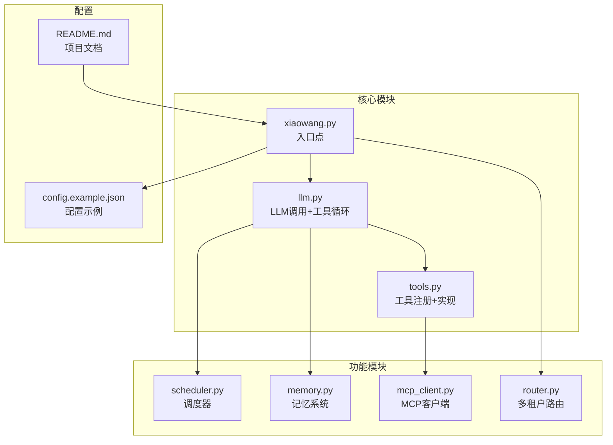
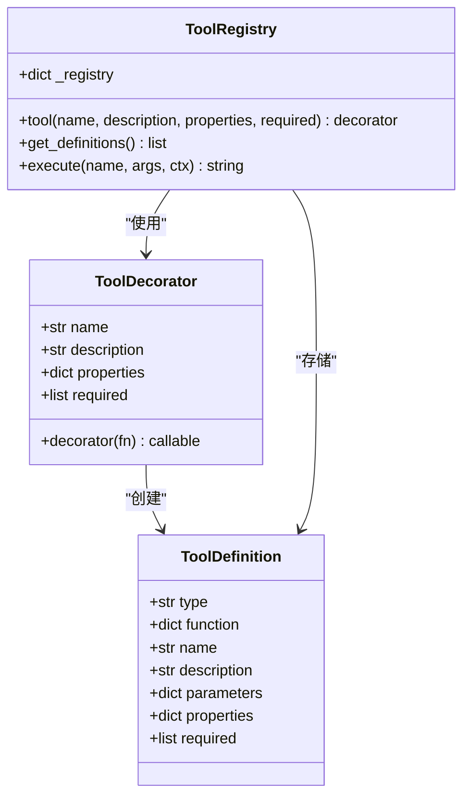
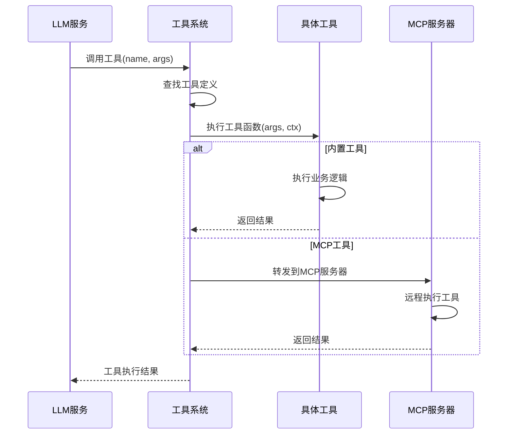
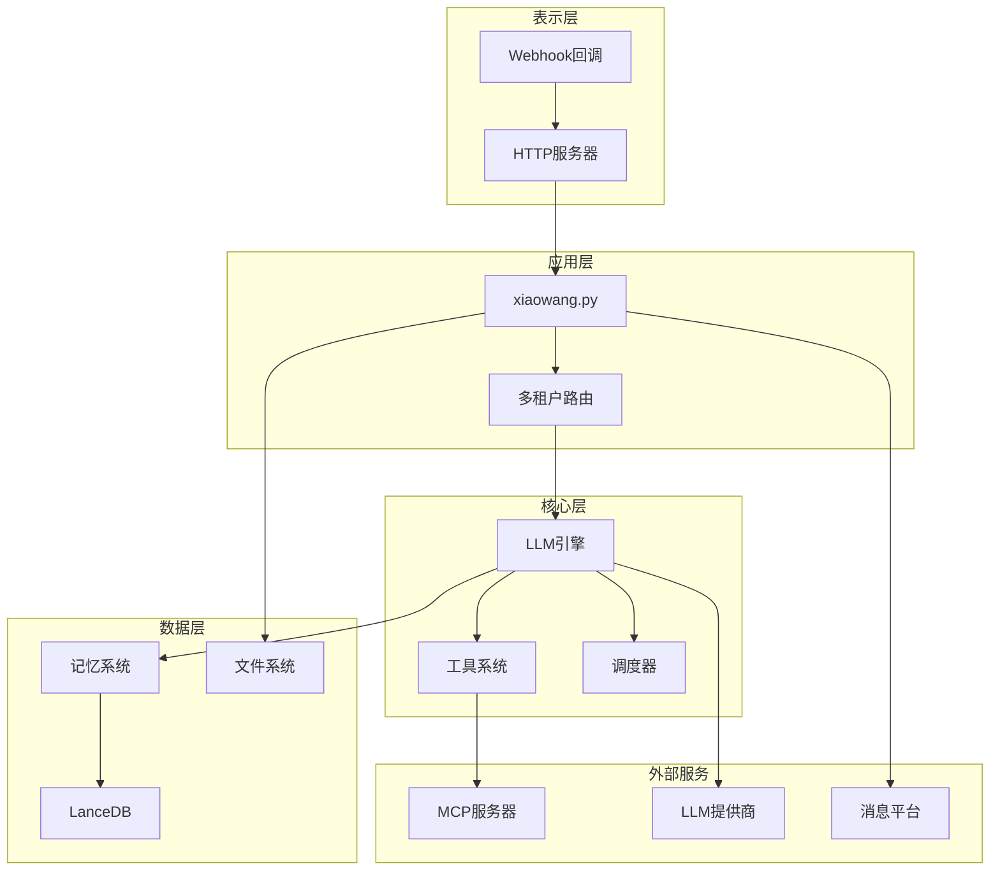
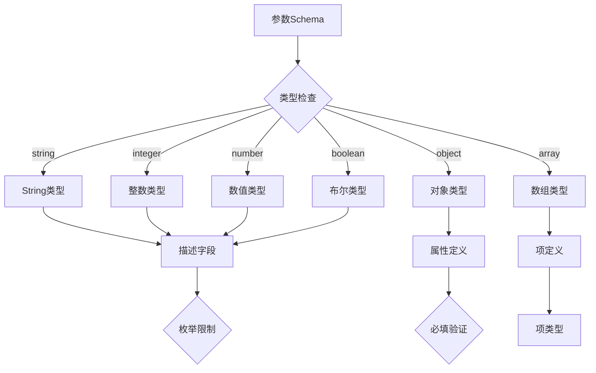
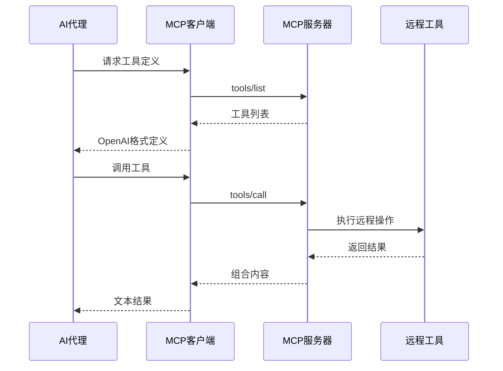
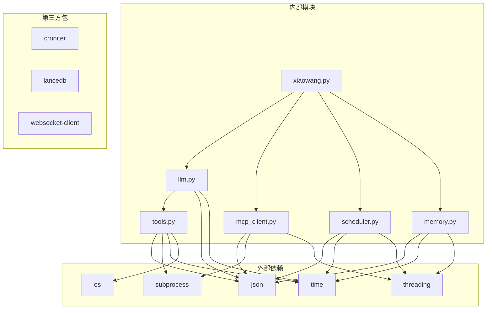
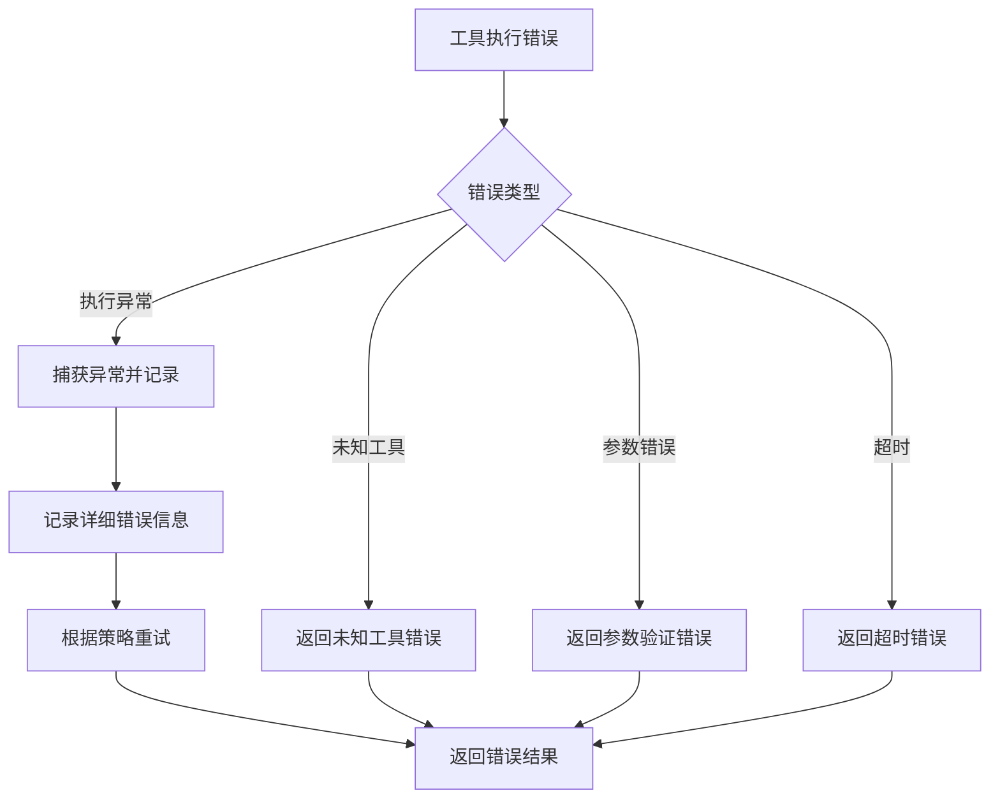

# 工具API

<cite>
**本文档引用的文件**
- [README.md](file://README.md)
- [tools.py](file://tools.py)
- [llm.py](file://llm.py)
- [xiaowang.py](file://xiaowang.py)
- [mcp_client.py](file://mcp_client.py)
- [scheduler.py](file://scheduler.py)
- [memory.py](file://memory.py)
- [router.py](file://router.py)
- [self_check_tool.py](file://self_check_tool.py)
- [config.example.json](file://config.example.json)
</cite>

## 目录
1. [简介](#简介)
2. [项目结构](#项目结构)
3. [核心组件](#核心组件)
4. [架构概览](#架构概览)
5. [详细组件分析](#详细组件分析)
6. [依赖关系分析](#依赖关系分析)
7. [性能考虑](#性能考虑)
8. [故障排除指南](#故障排除指南)
9. [结论](#结论)
10. [附录](#附录)

## 简介

7/24 Office 是一个生产级的AI代理系统，采用纯Python实现（约3500行代码），零框架依赖。该系统提供了完整的工具系统API，支持26个内置工具和动态插件扩展能力。

本文件详细说明工具系统的API规范，包括工具注册机制、工具定义格式、调用约定、错误处理策略以及最佳实践指南。

## 项目结构

系统采用模块化设计，主要文件及其职责如下：



**图表来源**
- [xiaowang.py:1-626](file://xiaowang.py#L1-L626)
- [llm.py:1-401](file://llm.py#L1-L401)
- [tools.py:1-1153](file://tools.py#L1-L1153)

**章节来源**
- [README.md:1-162](file://README.md#L1-L162)
- [xiaowang.py:55-76](file://xiaowang.py#L55-L76)

## 核心组件

### 工具注册机制

工具系统采用装饰器模式实现，提供统一的工具注册和管理机制：



**图表来源**
- [tools.py:36-74](file://tools.py#L36-L74)

### 工具执行流程

工具执行采用同步调用模式，支持超时控制和错误处理：



**图表来源**
- [llm.py:384-396](file://llm.py#L384-L396)
- [tools.py:63-74](file://tools.py#L63-L74)

**章节来源**
- [tools.py:36-74](file://tools.py#L36-L74)
- [llm.py:317-401](file://llm.py#L317-L401)

## 架构概览

系统采用分层架构，工具系统位于核心层：



**图表来源**
- [xiaowang.py:559-592](file://xiaowang.py#L559-L592)
- [llm.py:50-83](file://llm.py#L50-L83)

**章节来源**
- [README.md:23-66](file://README.md#L23-L66)

## 详细组件分析

### 工具装饰器系统

#### 装饰器定义

工具装饰器提供统一的工具注册接口：

| 参数 | 类型 | 必需 | 描述 |
|------|------|------|------|
| name | string | 是 | 工具名称，必须唯一 |
| description | string | 是 | 工具功能描述 |
| properties | dict | 是 | 参数Schema定义 |
| required | list | 否 | 必填参数列表 |

#### 参数Schema规范

每个工具的参数通过JSON Schema定义，支持以下类型：



**图表来源**
- [tools.py:36-55](file://tools.py#L36-L55)

#### 工具执行上下文

工具执行时提供标准上下文：

| 字段 | 类型 | 描述 |
|------|------|------|
| owner_id | string | 所有者标识符 |
| workspace | string | 工作空间路径 |
| session_key | string | 会话标识符 |

**章节来源**
- [tools.py:36-74](file://tools.py#L36-L74)
- [llm.py:357](file://llm.py#L357)

### 内置工具API规范

#### 核心工具

##### exec工具
- **功能**: 在服务器上执行shell命令
- **参数**:
  - command (string, 必填): 要执行的shell命令
  - timeout (integer, 可选): 超时时间，默认60秒，最大300秒
- **返回值**: 命令输出结果字符串
- **错误处理**: 超时返回超时错误，其他异常返回错误信息

##### message工具
- **功能**: 通过消息平台发送文本消息给所有者
- **参数**:
  - content (string, 必填): 消息内容
- **返回值**: 发送状态报告
- **特性**: 自动分片发送，支持长文本

**章节来源**
- [tools.py:110-146](file://tools.py#L110-L146)

#### 文件工具

##### read_file工具
- **功能**: 读取文件内容
- **参数**:
  - path (string, 必填): 文件路径（相对工作空间或绝对路径）
- **返回值**: 文件内容，超过10000字符自动截断
- **错误处理**: 文件不存在返回特定错误码

##### write_file工具
- **功能**: 写入文件（覆盖模式）
- **参数**:
  - path (string, 必填): 文件路径
  - content (string, 必填): 文件内容
- **返回值**: 写入状态和字节数

##### edit_file工具
- **功能**: 替换文件中的文本内容
- **参数**:
  - path (string, 必填): 文件路径
  - old (string, 必填): 要替换的原始文本
  - new (string, 必填): 新文本内容
- **返回值**: 编辑结果状态

##### list_files工具
- **功能**: 列出接收和保存的文件
- **参数**:
  - type (string, 可选): 文件类型过滤器（image/video/file/voice/gif）
  - limit (integer, 可选): 结果数量限制，默认20
- **返回值**: 文件列表摘要

**章节来源**
- [tools.py:150-236](file://tools.py#L150-L236)

#### 调度工具

##### schedule工具
- **功能**: 创建计划任务
- **参数**:
  - name (string, 必填): 任务名称（唯一标识符）
  - message (string, 必填): 触发时发送给LLM的消息
  - delay_seconds (integer, 可选): 延迟秒数（一次性任务）
  - cron_expr (string, 可选): Cron表达式（重复任务）
  - once (boolean, 可选): 是否只执行一次，默认true
- **返回值**: 任务创建状态

##### list_schedules工具
- **功能**: 列出所有计划任务
- **参数**: 无
- **返回值**: 任务列表摘要

##### remove_schedule工具
- **功能**: 删除计划任务
- **参数**:
  - name (string, 必填): 任务名称
- **返回值**: 删除操作结果

**章节来源**
- [tools.py:240-262](file://tools.py#L240-L262)

#### 媒体发送工具

##### send_image工具
- **功能**: 发送图片给所有者
- **参数**:
  - path (string, 必填): 图片URL或本地文件路径
  - caption (string, 可选): 图片标题
- **返回值**: 发送结果状态

##### send_file工具
- **功能**: 发送文件给所有者
- **参数**:
  - path (string, 必填): 文件URL或本地路径
  - caption (string, 可选): 文件描述
- **返回值**: 发送结果状态

##### send_video工具
- **功能**: 发送视频给所有者
- **参数**:
  - path (string, 必填): 视频URL或本地MP4文件路径
  - caption (string, 可选): 视频描述
- **返回值**: 发送结果状态

##### send_link工具
- **功能**: 发送富链接卡片给所有者
- **参数**:
  - title (string, 必填): 卡片标题
  - desc (string, 必填): 卡片描述
  - link_url (string, 必填): 点击链接
  - icon_url (string, 可选): 卡片图标URL
- **返回值**: 链接发送状态

**章节来源**
- [tools.py:266-302](file://tools.py#L266-L302)

#### 视频处理工具

##### trim_video工具
- **功能**: 裁剪视频，提取指定时间段
- **参数**:
  - input_path (string, 必填): 视频文件路径（本地或URL）
  - start (string, 必填): 开始时间，格式HH:MM:SS或秒数
  - end (string, 可选): 结束时间
  - send_to (string, 可选): 发送目标
- **返回值**: 处理结果和文件大小信息

##### add_bgm工具
- **功能**: 为视频添加背景音乐
- **参数**:
  - video_path (string, 必填): 视频文件路径（本地或URL）
  - audio_path (string, 必填): 音频文件路径（mp3/wav/aac，本地或URL）
  - volume (number, 可选): 背景音乐音量比例，默认0.3
  - send_to (string, 可选): 发送目标
- **返回值**: 处理结果和文件大小信息

##### generate_video工具
- **功能**: 从文本描述生成视频（异步任务）
- **参数**:
  - prompt (string, 必填): 视频内容描述
  - size (string, 可选): 视频分辨率，默认1280x720
  - send_to (string, 可选): 发送目标
- **返回值**: 任务提交状态或生成结果

**章节来源**
- [tools.py:326-496](file://tools.py#L326-L496)

#### 搜索工具

##### web_search工具
- **功能**: 网络搜索，支持多种搜索源
- **参数**:
  - query (string, 必填): 搜索关键词
  - source (string, 可选): 搜索源：auto/web/tavily/github/huggingface/all，默认auto
  - count (integer, 可选): 结果数量，默认5
- **返回值**: 搜索结果组合
- **特性**: 智能路由到不同搜索源

**章节来源**
- [tools.py:705-761](file://tools.py#L705-L761)

#### 记忆工具

##### search_memory工具
- **功能**: 搜索记忆文件
- **参数**:
  - query (string, 必填): 搜索关键词（空格分隔）
  - scope (string, 可选): 搜索范围：all（默认）、long（MEMORY.md）、daily（日志）
- **返回值**: 匹配结果列表
- **特性**: 支持正则表达式和全文搜索

**章节来源**
- [tools.py:766-800](file://tools.py#L766-L800)

### MCP工具系统

MCP（Model Context Protocol）工具提供与外部服务器的集成能力：



**图表来源**
- [mcp_client.py:205-242](file://mcp_client.py#L205-L242)

**章节来源**
- [mcp_client.py:1-334](file://mcp_client.py#L1-L334)

### 自定义工具开发

#### 插件系统

系统支持动态加载自定义工具插件：

```mermaid
flowchart TD
Start[启动系统] --> LoadPlugins[扫描plugins目录]
LoadPlugins --> ExecPlugin[执行插件代码]
ExecPlugin --> ToolReg[工具注册]
ToolReg --> Ready[工具可用]
subgraph "插件开发流程"
Dev[编写工具函数] --> Decorator[@tool装饰器]
Decorator --> Register[自动注册]
Register --> Test[测试工具]
end
```

**图表来源**
- [tools.py:518-545](file://tools.py#L518-L545)

#### 工具开发最佳实践

1. **参数验证**: 使用JSON Schema确保参数完整性
2. **错误处理**: 提供清晰的错误信息和回退策略
3. **资源管理**: 注意文件路径解析和权限控制
4. **性能优化**: 对耗时操作设置合理超时
5. **安全性**: 验证输入参数，防止命令注入

**章节来源**
- [tools.py:518-545](file://tools.py#L518-L545)

## 依赖关系分析

### 模块依赖图



**图表来源**
- [tools.py:19-26](file://tools.py#L19-L26)
- [llm.py:8-16](file://llm.py#L8-L16)
- [mcp_client.py:14-20](file://mcp_client.py#L14-L20)

### 工具间依赖关系

| 工具类别 | 依赖工具 | 用途 |
|----------|----------|------|
| 文件工具 | 无 | 文件操作 |
| 媒体工具 | messaging | 消息发送 |
| 视频工具 | ffmpeg | 媒体处理 |
| 搜索工具 | 多个API | 信息检索 |
| 记忆工具 | grep | 文本搜索 |

**章节来源**
- [tools.py:81-82](file://tools.py#L81-L82)
- [llm.py:17](file://llm.py#L17)

## 性能考虑

### 工具执行性能

1. **并发控制**: 工具执行采用线程锁保证同一会话的串行执行
2. **超时管理**: 内置工具默认60秒超时，可配置最长300秒
3. **内存优化**: 大文件读取自动截断，避免内存溢出
4. **缓存策略**: 记忆系统使用向量检索，支持零延迟硬件通道

### 系统性能指标

| 组件 | 默认配置 | 最大限制 |
|------|----------|----------|
| 会话消息数 | 40条 | 可配置 |
| 工具迭代次数 | 20次 | 可配置 |
| 文件大小限制 | 10000字符 | 截断处理 |
| 视频处理超时 | 300秒 | 可调整 |

**章节来源**
- [llm.py:306-401](file://llm.py#L306-L401)
- [tools.py:116-132](file://tools.py#L116-L132)

## 故障排除指南

### 常见错误类型

1. **工具未找到**: 检查工具名称是否正确
2. **参数验证失败**: 确认参数类型和必需字段
3. **执行超时**: 调整超时设置或优化工具实现
4. **权限错误**: 验证文件路径和访问权限

### 错误处理策略



**图表来源**
- [tools.py:67-74](file://tools.py#L67-L74)

### 调试技巧

1. **启用详细日志**: 检查工具执行过程
2. **参数验证**: 使用JSON Schema验证输入
3. **资源监控**: 监控文件大小和执行时间
4. **网络诊断**: 测试MCP服务器连接性

**章节来源**
- [tools.py:67-74](file://tools.py#L67-L74)

## 结论

7/24 Office的工具系统提供了完整、灵活且高性能的工具API规范。通过装饰器模式实现的工具注册机制、标准化的参数Schema定义、完善的错误处理策略，使得系统既易于使用又便于扩展。

系统的主要优势包括：
- **零框架依赖**: 完全基于标准库实现
- **动态扩展**: 支持运行时加载自定义工具
- **MCP集成**: 无缝连接外部工具服务器
- **多租户支持**: Docker容器化部署
- **自修复能力**: 内置自我诊断和修复机制

## 附录

### 工具开发示例

#### 简单工具示例
```python
@tool("hello_world", "简单的问候工具", {}, [])
def hello_world_tool(args, ctx):
    return "Hello, World!"
```

#### 复杂工具示例
```python
@tool("calculate", "数学计算工具", {
    "expression": {"type": "string", "description": "数学表达式"}
}, ["expression"])
def calculate_tool(args, ctx):
    try:
        result = eval(args["expression"])
        return f"计算结果: {result}"
    except Exception as e:
        return f"[error] 计算失败: {e}"
```

### 配置参考

系统配置包含以下关键部分：

| 配置项 | 类型 | 描述 |
|--------|------|------|
| models | object | LLM提供商配置 |
| messaging | object | 消息平台配置 |
| memory | object | 记忆系统配置 |
| asr | object | 语音识别配置 |
| video_api | object | 视频生成API配置 |
| mcp_servers | object | MCP服务器配置 |

**章节来源**
- [config.example.json:1-61](file://config.example.json#L1-L61)