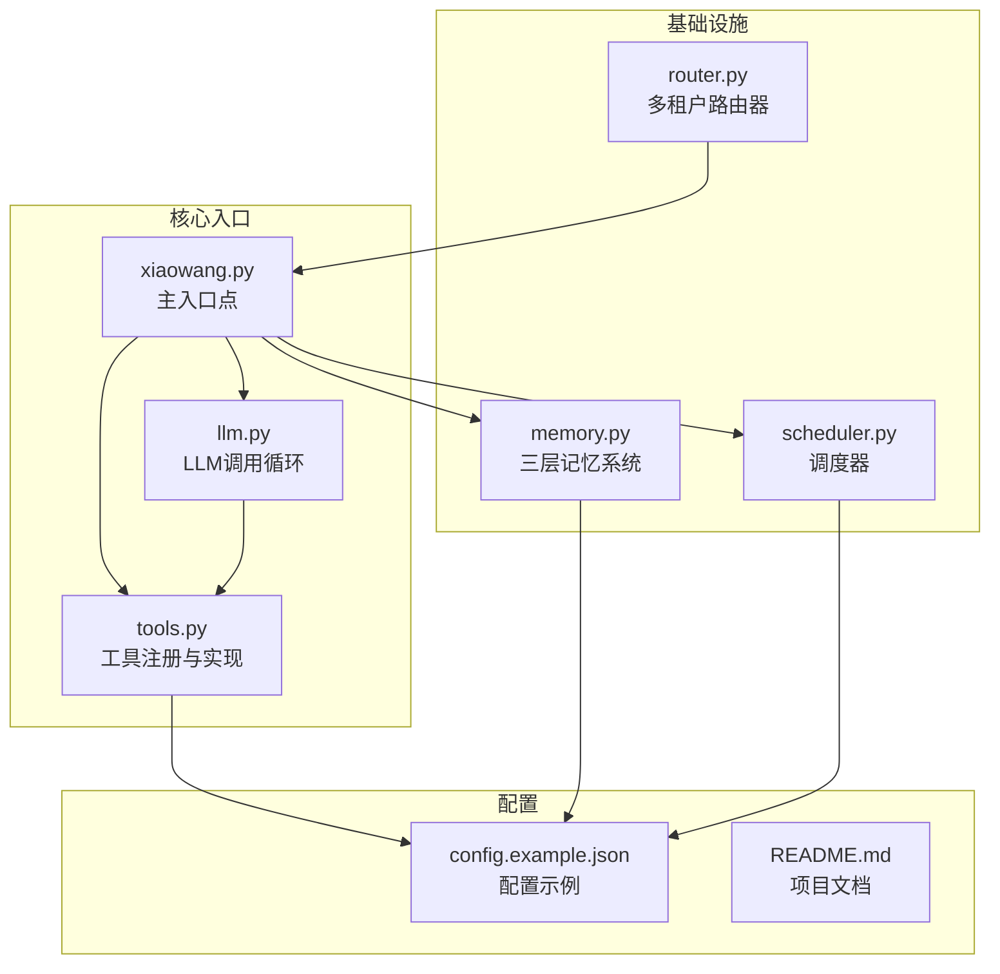
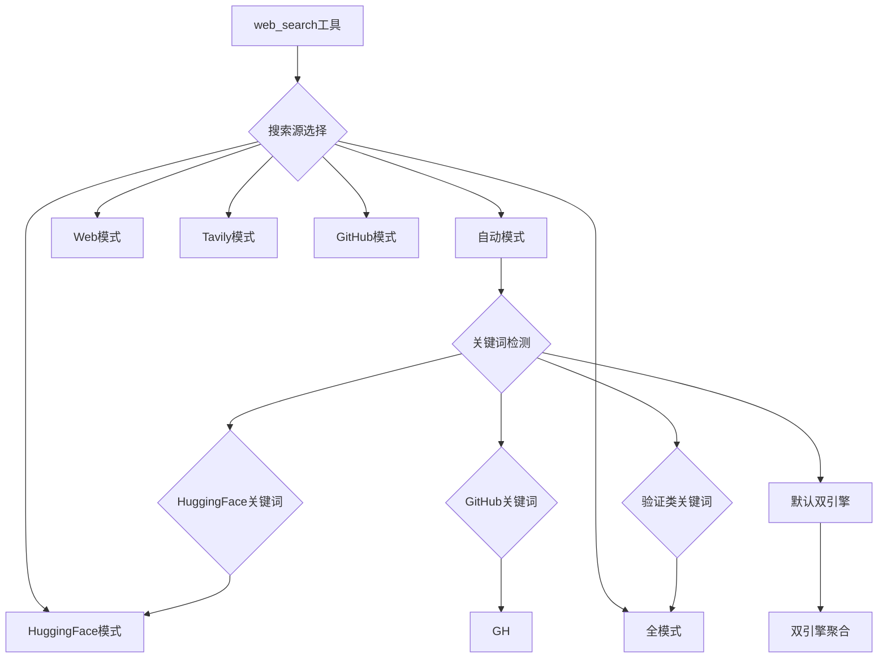
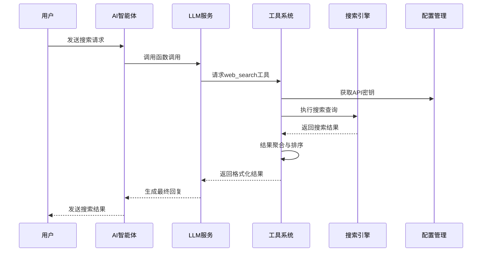
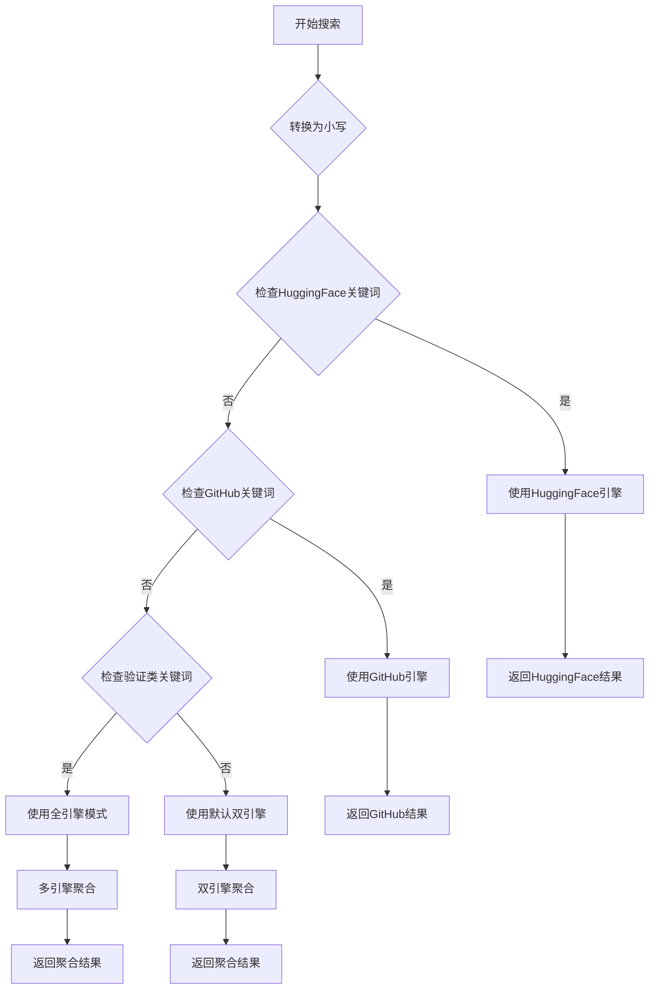
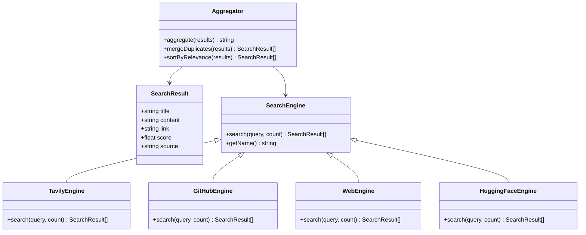
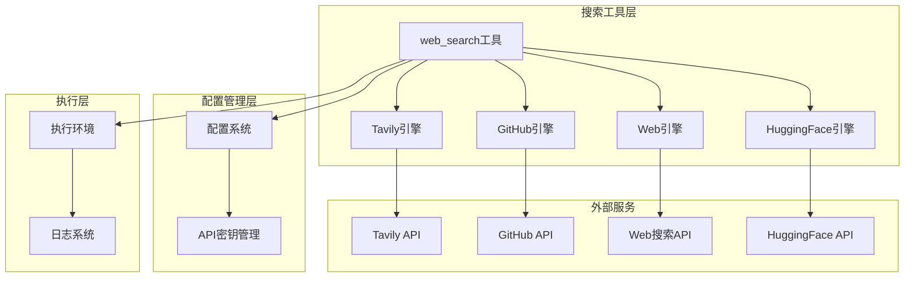

# 搜索工具

<cite>
**本文档引用的文件**
- [README.md](file://README.md)
- [tools.py](file://tools.py)
- [config.example.json](file://config.example.json)
- [xiaowang.py](file://xiaowang.py)
- [llm.py](file://llm.py)
- [router.py](file://router.py)
- [memory.py](file://memory.py)
- [scheduler.py](file://scheduler.py)
</cite>

## 目录
1. [简介](#简介)
2. [项目结构](#项目结构)
3. [核心组件](#核心组件)
4. [架构概览](#架构概览)
5. [详细组件分析](#详细组件分析)
6. [依赖关系分析](#依赖关系分析)
7. [性能考虑](#性能考虑)
8. [故障排除指南](#故障排除指南)
9. [结论](#结论)

## 简介

7/24 Office 是一个生产级的AI智能体系统，包含26个内置工具，其中web_search网络搜索工具是一个多引擎搜索引擎，支持Tavily、GitHub、Web和HuggingFace搜索源。该工具提供了智能的搜索引擎路由逻辑、自动搜索引擎选择算法和结果聚合机制。

该项目采用纯Python开发，零框架依赖，仅使用3个小型包（croniter、lancedb、websocket-client），实现了完整的AI智能体功能，包括工具调用循环、三层记忆系统、MCP插件系统等。

## 项目结构

项目采用模块化设计，主要文件组织如下：

**图表来源**
- [xiaowang.py:1-626](file://xiaowang.py#L1-L626)
- [llm.py:1-401](file://llm.py#L1-L401)
- [tools.py:1-1153](file://tools.py#L1-L1153)

**章节来源**
- [README.md:1-162](file://README.md#L1-L162)
- [xiaowang.py:1-626](file://xiaowang.py#L1-L626)

## 核心组件

### web_search工具定义

web_search工具是本项目的核心搜索功能，支持多种搜索源和智能路由机制：

**图表来源**
- [tools.py:705-761](file://tools.py#L705-L761)

### 搜索引擎配置

每个搜索引擎都有独立的配置和API密钥管理：

| 引擎类型 | 配置键 | API端点 | 认证方式 |
|---------|--------|---------|----------|
| Tavily | `tavily_api_key` | `https://api.tavily.com/search` | API密钥 |
| Web搜索 | `search_api_key` | `https://api.search-provider.example.com/v1/web-search` | Bearer Token |
| GitHub | 内置 | `https://api.github.com/search/` | User-Agent头 |
| HuggingFace | 内置 | `https://huggingface.co/api/models` | User-Agent头 |

**章节来源**
- [tools.py:548-703](file://tools.py#L548-L703)
- [config.example.json:50-51](file://config.example.json#L50-L51)

## 架构概览

搜索工具在整个系统中的位置和交互关系：

**图表来源**
- [llm.py:317-401](file://llm.py#L317-L401)
- [tools.py:713-761](file://tools.py#L713-L761)

## 详细组件分析

### 自动搜索引擎选择算法

web_search工具实现了智能的搜索引擎路由逻辑：

**图表来源**
- [tools.py:718-729](file://tools.py#L718-L729)

### 搜索参数配置

web_search工具支持以下参数配置：

| 参数名 | 类型 | 必需 | 默认值 | 描述 |
|--------|------|------|--------|------|
| `query` | string | ✓ | - | 搜索关键词 |
| `source` | string | ✗ | "auto" | 搜索源: auto/web/tavily/github/huggingface/all |
| `count` | integer | ✗ | 5 | 返回结果数量 |

### 结果聚合机制

不同搜索源的结果会按照以下规则进行聚合：

**图表来源**
- [tools.py:734-758](file://tools.py#L734-L758)

### 搜索质量与排序规则

不同搜索引擎的排序和质量控制机制：

#### Tavily搜索引擎
- 返回AI摘要和网页链接
- 基于相关性分数排序
- 支持答案生成和深度搜索

#### GitHub搜索引擎  
- 首先搜索仓库，然后补充代码搜索
- 基于星标数排序
- 去重处理，避免重复结果

#### Web搜索引擎
- 使用通用Web搜索API
- 基于摘要和标题排序
- 支持内容截断和链接展示

#### HuggingFace搜索引擎
- 搜索机器学习模型
- 基于下载量和点赞数排序
- 失败时回退到Web搜索

**章节来源**
- [tools.py:548-703](file://tools.py#L548-L703)

## 依赖关系分析

搜索工具与其他系统组件的依赖关系：

**图表来源**
- [tools.py:506-512](file://tools.py#L506-L512)
- [tools.py:705-761](file://tools.py#L705-L761)

**章节来源**
- [tools.py:19-74](file://tools.py#L19-L74)

## 性能考虑

### 并发处理
- 每个会话使用线程锁保证安全性
- 搜索请求超时控制（Tavily: 20秒，Web: 15秒）
- 多引擎并发执行，结果异步聚合

### 缓存策略
- 搜索结果按会话级别缓存
- 频繁查询去重处理
- 内存中维护搜索历史

### 错误处理
- 单个引擎失败不影响整体搜索
- 回退机制：HuggingFace失败时自动回退到Web搜索
- 详细的错误日志记录

## 故障排除指南

### 常见问题及解决方案

#### API密钥配置错误
**症状**: 搜索返回"API密钥未配置"错误
**解决方法**: 在config.json中正确配置相应的API密钥
- Tavily: `tavily_api_key`
- Web搜索: `search_api_key`

#### 搜索结果为空
**可能原因**:
- 关键词过于宽泛或模糊
- 目标引擎API限制
- 网络连接问题

**解决方法**:
- 提供更具体的搜索关键词
- 检查API配额和限制
- 验证网络连接状态

#### 性能问题
**症状**: 搜索响应缓慢
**解决方法**:
- 减少返回结果数量（count参数）
- 使用更精确的搜索源
- 检查服务器资源使用情况

**章节来源**
- [tools.py:550-553](file://tools.py#L550-L553)
- [tools.py:606-607](file://tools.py#L606-L607)

## 结论

7/24 Office的web_search搜索工具提供了一个强大而灵活的多引擎搜索解决方案。通过智能的搜索引擎路由算法、完善的错误处理机制和高效的性能优化，该工具能够满足各种搜索需求。

关键特性包括：
- **智能路由**: 基于关键词的自动搜索引擎选择
- **多引擎支持**: Tavily、GitHub、Web、HuggingFace四引擎并行
- **结果聚合**: 统一格式化的搜索结果展示
- **容错机制**: 单引擎失败不影响整体搜索体验
- **配置灵活**: 支持多种API密钥和自定义配置

该搜索工具的设计体现了项目的整体理念：零框架依赖、纯Python实现、生产级稳定性，为构建企业级AI应用提供了坚实的基础。