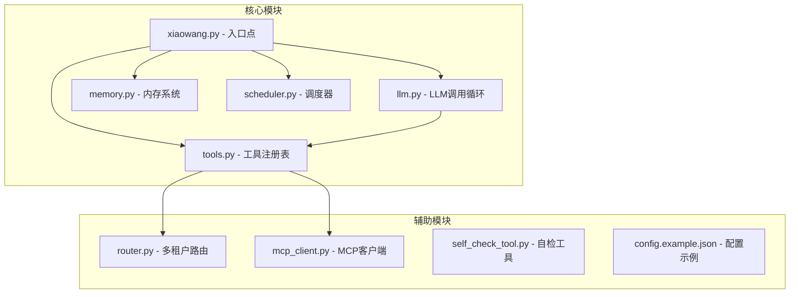
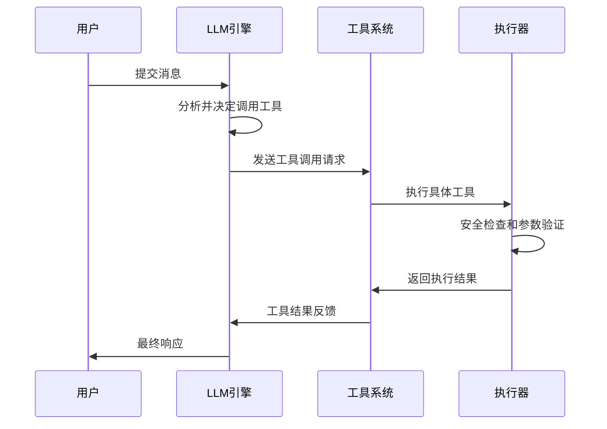
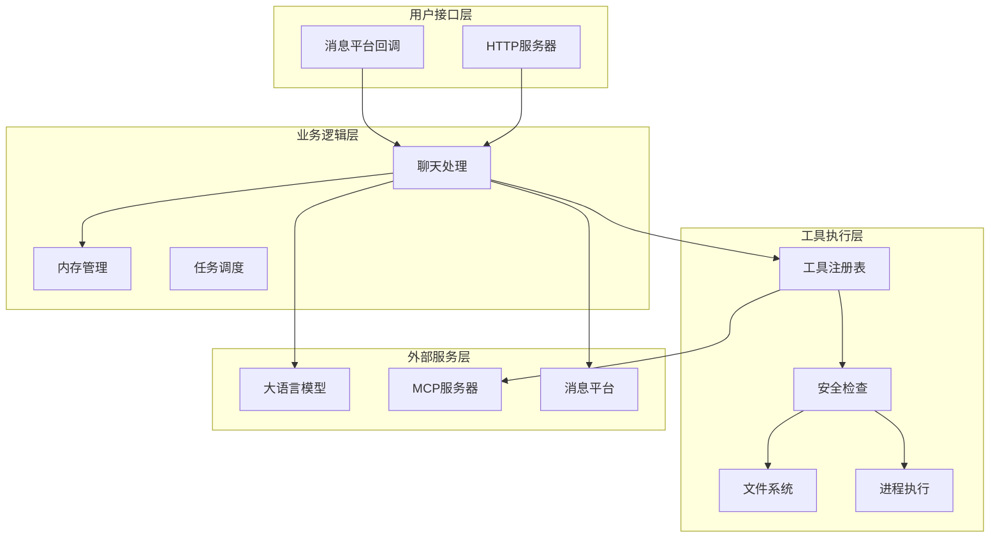
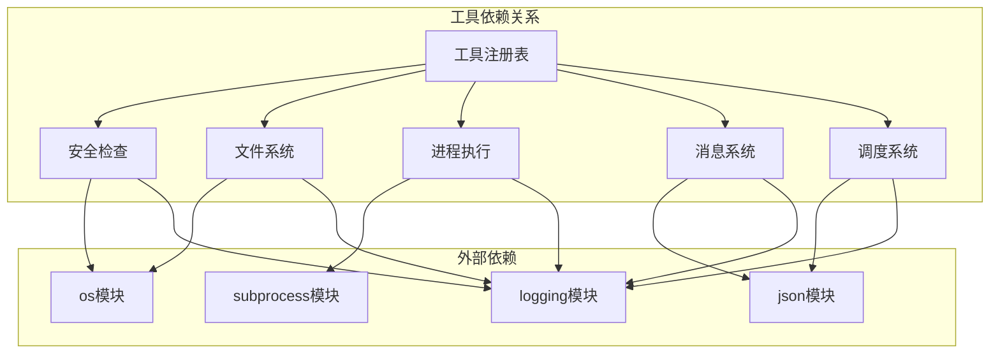

# 核心工具

<cite>
**本文档引用的文件**
- [README.md](file://README.md)
- [tools.py](file://tools.py)
- [llm.py](file://llm.py)
- [xiaowang.py](file://xiaowang.py)
- [config.example.json](file://config.example.json)
</cite>

## 目录
1. [简介](#简介)
2. [项目结构](#项目结构)
3. [核心组件](#核心组件)
4. [架构概览](#架构概览)
5. [详细组件分析](#详细组件分析)
6. [依赖关系分析](#依赖关系分析)
7. [性能考虑](#性能考虑)
8. [故障排除指南](#故障排除指南)
9. [结论](#结论)

## 简介

7/24 Office 是一个生产级的AI智能体系统，采用纯Python编写（约3500行代码），不依赖任何框架。该系统提供了26个内置工具，其中核心工具包括exec系统命令执行工具、message消息发送工具、以及文件操作相关的read_file、write_file、edit_file和list_files工具。

该系统采用三层内存架构（会话记忆、压缩长期记忆、向量检索）和MCP/插件系统，支持运行时工具创建和自修复功能。系统设计原则强调零框架依赖、单文件工具扩展、边缘部署能力、自演化能力和离线可用性。

## 项目结构

系统采用模块化设计，主要文件包括：



**图表来源**
- [README.md:23-66](file://README.md#L23-L66)
- [xiaowang.py:55-76](file://xiaowang.py#L55-L76)

**章节来源**
- [README.md:1-162](file://README.md#L1-L162)
- [README.md:86-99](file://README.md#L86-L99)

## 核心组件

系统的核心工具集包含以下6个关键工具：

### 工具分类
- **核心工具**: exec、message
- **文件工具**: read_file、write_file、edit_file、list_files
- **调度工具**: schedule、list_schedules、remove_schedule
- **媒体发送工具**: send_image、send_file、send_video、send_link
- **视频处理工具**: trim_video、add_bgm、generate_video
- **搜索工具**: web_search
- **内存工具**: search_memory、recall
- **诊断工具**: self_check、diagnose
- **插件工具**: create_tool、list_custom_tools、remove_tool
- **MCP工具**: reload_mcp

### 工具执行流程



**图表来源**
- [llm.py:317-401](file://llm.py#L317-L401)
- [tools.py:63-74](file://tools.py#L63-L74)

**章节来源**
- [README.md:86-99](file://README.md#L86-L99)
- [tools.py:36-74](file://tools.py#L36-L74)

## 架构概览

系统采用分层架构设计，核心组件通过清晰的接口进行交互：



**图表来源**
- [xiaowang.py:559-592](file://xiaowang.py#L559-L592)
- [llm.py:317-401](file://llm.py#L317-L401)
- [tools.py:36-74](file://tools.py#L36-L74)

## 详细组件分析

### exec 系统命令执行工具

exec工具允许在服务器上执行shell命令，具有安全限制和超时控制。

#### 参数规范
- **command** (必需): string - 要执行的shell命令
- **timeout** (可选): integer - 超时时间（秒），默认60秒，最大300秒

#### 返回值格式
- 成功执行：返回命令输出（stdout + stderr）
- 超时：返回错误信息 "[error] command timed out (60s)"
- 文件不存在：返回 "[error] file not found: {path}"
- 其他异常：返回 "[error] {exception}"

#### 错误处理机制
- 命令超时检测和处理
- 文件路径解析和安全检查
- 异常捕获和日志记录
- 返回码检查和错误标识

#### 使用示例
```json
{
  "command": "ls -la",
  "timeout": 60
}
```

#### 安全限制
- 基于工作空间目录的路径解析
- 默认超时60秒，慢操作最多300秒
- 命令执行在指定工作空间目录中进行

**章节来源**
- [tools.py:110-132](file://tools.py#L110-L132)

### message 消息发送工具

message工具用于向所有者发送文本消息，支持消息分割和去重。

#### 参数规范
- **content** (必需): string - 消息内容

#### 返回值格式
- 成功：返回 "Sent to owner ({count} messages)"
- 失败：返回 "[error] {error_message}"

#### 错误处理机制
- 消息内容自动分割（每条不超过1800字节）
- 连续消息间的延迟控制（0.5秒）
- 异常捕获和错误报告
- 消息发送状态检查

#### 使用示例
```json
{
  "content": "系统状态检查完成"
}
```

#### 安全限制
- 仅限所有者ID使用
- 消息长度限制（UTF-8编码）
- 自动去重和重复发送防护

**章节来源**
- [tools.py:134-145](file://tools.py#L134-L145)

### read_file 文件读取工具

read_file工具用于读取文件内容，支持相对路径和绝对路径。

#### 参数规范
- **path** (必需): string - 文件路径（相对工作空间或绝对路径）

#### 返回值格式
- 成功：返回文件内容（超过10000字符截断显示）
- 失败：返回 "[error] file not found: {path}" 或 "[error] {exception}"

#### 错误处理机制
- 文件存在性检查
- UTF-8编码读取
- 大文件截断处理（显示总字符数）
- 异常捕获和错误报告

#### 使用示例
```json
{
  "path": "documents/report.txt"
}
```

#### 安全限制
- 路径解析到工作空间目录
- 文件大小限制（超过10000字符截断）
- 编码格式统一为UTF-8

**章节来源**
- [tools.py:150-164](file://tools.py#L150-L164)

### write_file 文件写入工具

write_file工具用于覆盖写入文件内容。

#### 参数规范
- **path** (必需): string - 文件路径
- **content** (必需): string - 文件内容

#### 返回值格式
- 成功：返回 "Written to {path} ({length} chars)"
- 失败：返回 "[error] {exception}"

#### 错误处理机制
- 目录自动创建
- UTF-8编码写入
- 文件权限检查
- 异常捕获和错误报告

#### 使用示例
```json
{
  "path": "config/settings.json",
  "content": "{\n  \"setting\": \"value\"\n}"
}
```

#### 安全限制
- 路径解析到工作空间目录
- 自动创建父目录
- 编码格式统一为UTF-8

**章节来源**
- [tools.py:167-179](file://tools.py#L167-L179)

### edit_file 文件编辑工具

edit_file工具用于替换文件中的文本内容。

#### 参数规范
- **path** (必需): string - 文件路径
- **old** (必需): string - 要替换的原始文本
- **new** (必需): string - 替换后的文本

#### 返回值格式
- 成功：返回 "Edited {path}"
- 失败：返回 "[error] old string not found in {path}" 或 "[error] {exception}"

#### 错误处理机制
- 文本存在性检查
- 单次替换操作
- 文件读写权限检查
- 异常捕获和错误报告

#### 使用示例
```json
{
  "path": "config/app.conf",
  "old": "DEBUG = false",
  "new": "DEBUG = true"
}
```

#### 安全限制
- 路径解析到工作空间目录
- 单次替换确保精确匹配
- 文件完整性保护

**章节来源**
- [tools.py:182-202](file://tools.py#L182-L202)

### list_files 文件列表工具

list_files工具用于列出接收和保存的文件，支持类型过滤和数量限制。

#### 参数规范
- **type** (可选): string - 文件类型过滤（image/video/file/voice/gif），空表示全部
- **limit** (可选): integer - 结果数量，默认20

#### 返回值格式
- 成功：返回文件列表信息（总数、最近文件、文件大小等）
- 失败：返回 "No files received yet." 或 "File index read failed."

#### 错误处理机制
- 文件索引存在性检查
- JSON解析错误处理
- 类型过滤和排序
- 异常捕获和错误报告

#### 使用示例
```json
{
  "type": "image",
  "limit": 10
}
```

#### 安全限制
- 仅访问工作空间files目录
- 文件索引格式验证
- 数量限制防止过度输出

**章节来源**
- [tools.py:205-235](file://tools.py#L205-L235)

## 依赖关系分析

系统工具之间的依赖关系如下：



**图表来源**
- [tools.py:19-26](file://tools.py#L19-L26)
- [tools.py:80-83](file://tools.py#L80-L83)

**章节来源**
- [tools.py:19-83](file://tools.py#L19-L83)

## 性能考虑

### 工具执行性能

系统在工具执行方面采用了多项优化措施：

1. **超时控制**: 所有工具都有合理的超时设置，防止长时间阻塞
2. **内存管理**: 大文件读取自动截断，避免内存溢出
3. **并发处理**: 工具调用采用异步模式，提高响应速度
4. **缓存机制**: 频繁访问的工具结果可以被缓存

### 安全性能平衡

- **路径解析**: 在安全性与便利性之间找到平衡点
- **权限控制**: 严格的文件操作权限检查
- **资源限制**: 进程执行的资源使用限制

## 故障排除指南

### 常见问题及解决方案

#### 工具调用失败
- **症状**: 工具返回 "[error] {message}"
- **原因**: 参数错误、权限不足、资源不可用
- **解决**: 检查参数格式、确认权限、验证资源状态

#### 超时问题
- **症状**: 工具执行超时，返回超时错误
- **原因**: 操作耗时过长、网络延迟
- **解决**: 增加timeout参数、优化操作、检查网络连接

#### 权限问题
- **症状**: 文件操作失败，返回权限错误
- **原因**: 工作空间权限不足、文件锁定
- **解决**: 检查工作空间权限、释放文件锁、重新启动服务

#### 路径问题
- **症状**: 文件找不到或路径解析错误
- **原因**: 相对路径解析错误、绝对路径权限问题
- **解决**: 使用绝对路径、检查路径权限、验证路径存在性

### 调试技巧

1. **查看日志**: 检查系统日志中的错误信息
2. **参数验证**: 确保所有必需参数都已提供
3. **权限检查**: 验证工作空间和文件权限
4. **资源监控**: 监控系统资源使用情况

**章节来源**
- [tools.py:69-73](file://tools.py#L69-L73)
- [llm.py:369-372](file://llm.py#L369-L372)

## 结论

7/24 Office系统的核心工具集提供了强大而安全的自动化能力。通过精心设计的安全机制、错误处理和性能优化，这些工具能够在保证系统安全的前提下提供高效的自动化功能。

系统的设计原则体现了现代AI智能体的发展趋势：
- **零依赖**: 不依赖任何框架，代码透明可调试
- **可扩展**: 支持运行时工具创建和热重载
- **自修复**: 具备自我诊断和修复能力
- **离线可用**: 核心功能可在离线环境下正常工作

这些核心工具为构建复杂的AI自动化系统奠定了坚实的基础，开发者可以通过这些工具快速实现各种自动化场景，同时保持系统的安全性和稳定性。