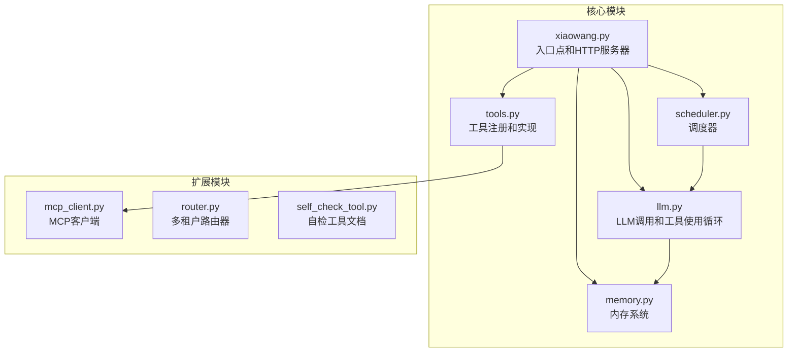
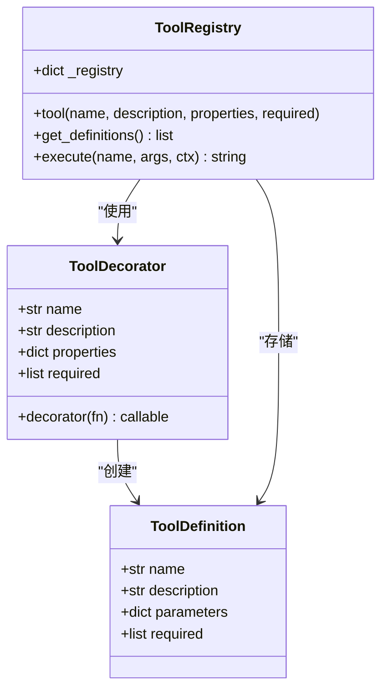
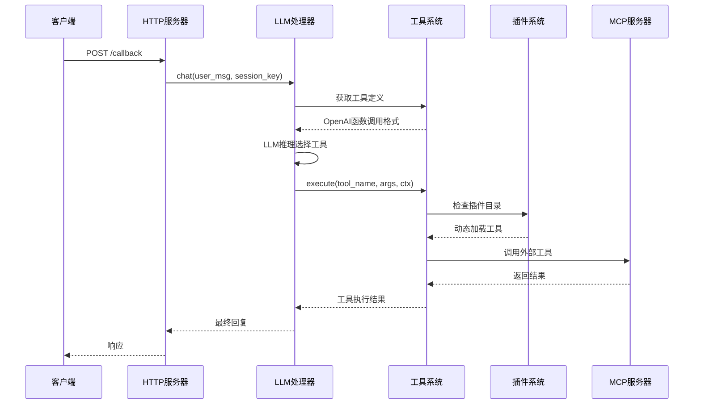
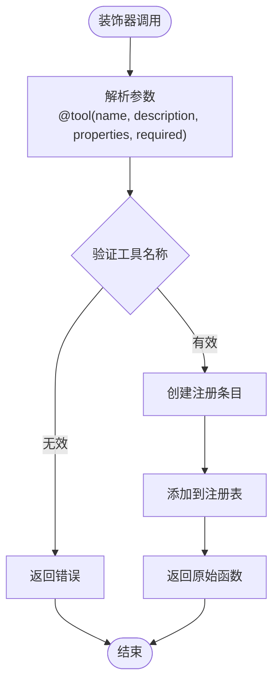
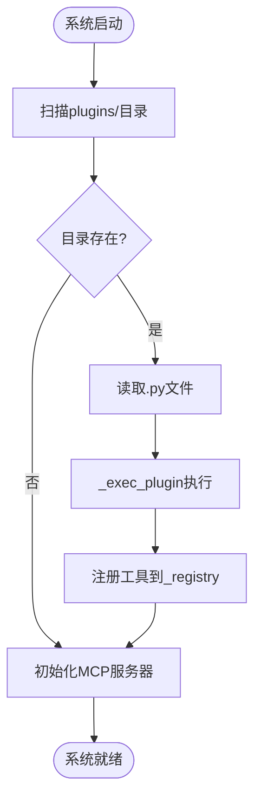
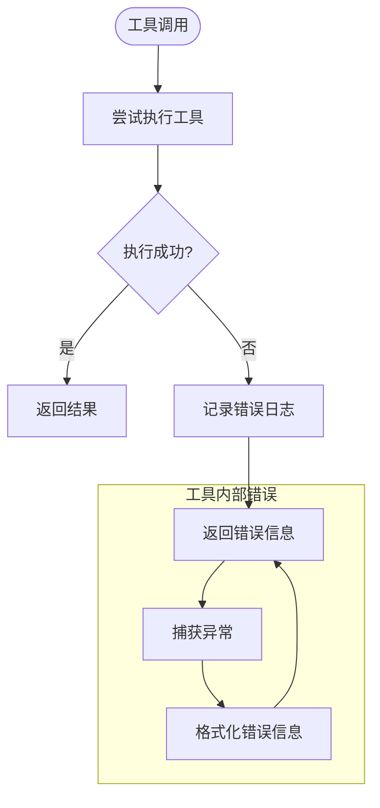
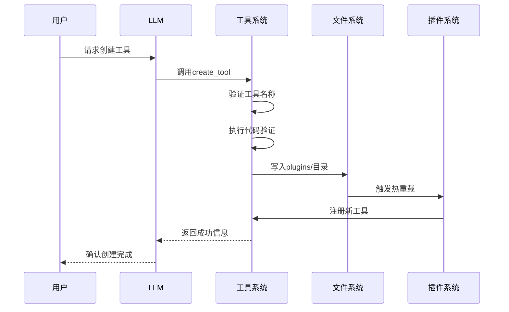
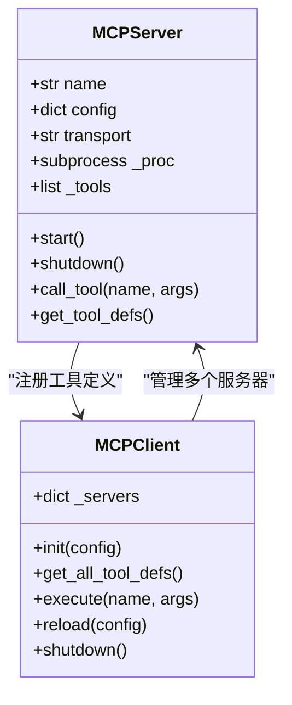
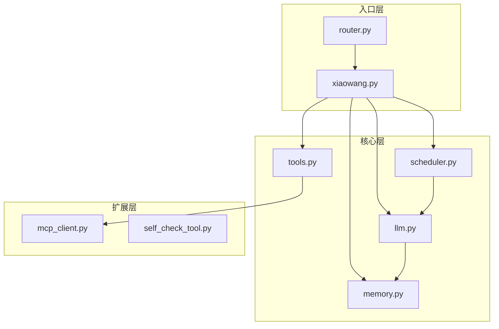
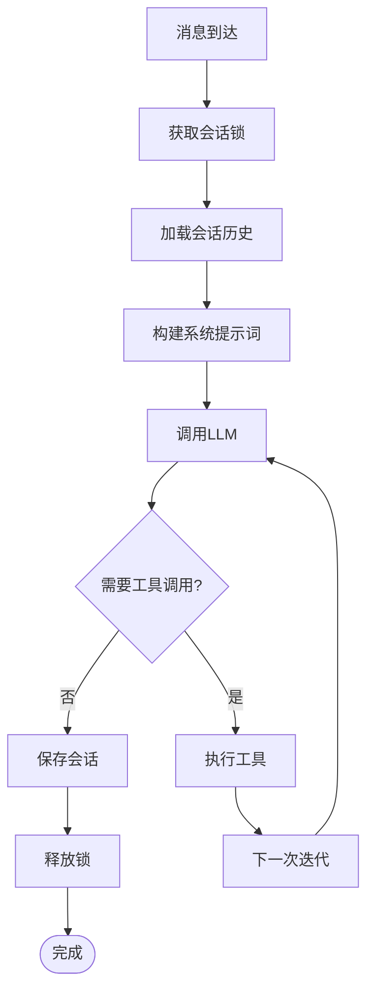

# 自定义工具开发

<cite>
**本文档引用的文件**
- [README.md](file://README.md)
- [tools.py](file://tools.py)
- [llm.py](file://llm.py)
- [xiaowang.py](file://xiaowang.py)
- [mcp_client.py](file://mcp_client.py)
- [memory.py](file://memory.py)
- [scheduler.py](file://scheduler.py)
- [router.py](file://router.py)
- [self_check_tool.py](file://self_check_tool.py)
</cite>

## 目录
1. [简介](#简介)
2. [项目结构](#项目结构)
3. [核心组件](#核心组件)
4. [架构概览](#架构概览)
5. [详细组件分析](#详细组件分析)
6. [依赖关系分析](#依赖关系分析)
7. [性能考虑](#性能考虑)
8. [故障排除指南](#故障排除指南)
9. [结论](#结论)
10. [附录](#附录)

## 简介

7/24 Office 是一个生产级的AI智能体系统，采用纯Python编写（约3500行代码），实现了零框架依赖的设计理念。该系统提供了完整的自定义工具开发能力，支持运行时工具创建、热重载和插件系统。

本指南专注于自定义工具开发的核心机制，包括：
- @tool装饰器的使用方法
- 工具注册机制和运行时加载流程
- 工具函数的参数规范和上下文传递机制
- 插件系统的实现原理和动态代码执行
- 安全限制和最佳实践
- 测试方法和性能优化建议

## 项目结构

该系统采用模块化设计，主要文件及其职责如下：



**图表来源**
- [xiaowang.py:1-626](file://xiaowang.py#L1-L626)
- [llm.py:1-401](file://llm.py#L1-L401)
- [tools.py:1-1153](file://tools.py#L1-L1153)

**章节来源**
- [README.md:1-162](file://README.md#L1-L162)
- [xiaowang.py:35-76](file://xiaowang.py#L35-L76)

## 核心组件

### 工具注册系统

工具注册系统是整个自定义工具开发的核心，基于装饰器模式实现：



**图表来源**
- [tools.py:33-74](file://tools.py#L33-L74)
- [tools.py:36-55](file://tools.py#L36-L55)

### 上下文传递机制

工具执行时通过上下文字典传递运行时信息：

| 上下文键 | 类型 | 描述 | 示例值 |
|---------|------|------|--------|
| `owner_id` | string | 所有者标识符 | "user_123" |
| `workspace` | string | 工作空间路径 | "/data/workspace" |
| `session_key` | string | 会话标识符 | "dm_user_123" |

**章节来源**
- [tools.py:10-17](file://tools.py#L10-L17)
- [llm.py:357](file://llm.py#L357)

## 架构概览

系统采用分层架构，从入口到工具执行的完整流程如下：



**图表来源**
- [xiaowang.py:589-588](file://xiaowang.py#L589-L588)
- [llm.py:356-395](file://llm.py#L356-L395)
- [tools.py:63-74](file://tools.py#L63-L74)

## 详细组件分析

### @tool装饰器详解

@tool装饰器是自定义工具开发的核心，提供了声明式工具定义方式：

#### 装饰器语法和参数



**图表来源**
- [tools.py:36-55](file://tools.py#L36-L55)

#### 参数规范

工具参数通过JSON Schema定义，支持以下类型：

| 参数类型 | 描述 | 必需字段 |
|---------|------|----------|
| string | 文本字符串 | description |
| integer | 整数 | description, minimum, maximum |
| number | 浮点数 | description, minimum, maximum |
| boolean | 布尔值 | description |
| array | 数组 | description, items |
| object | 对象 | description, properties |

**章节来源**
- [tools.py:10-17](file://tools.py#L10-L17)

### 工具注册机制

工具注册机制采用单例模式，全局维护工具注册表：

```mermaid
graph LR
subgraph "启动阶段"
A[程序启动] --> B[导入tools.py]
B --> C[初始化_registry]
C --> D[扫描@tool装饰器]
D --> E[注册内置工具]
end
subgraph "运行时阶段"
F[动态加载] --> G[_exec_plugin执行]
G --> H[新工具注册]
H --> I[热重载支持]
end
subgraph "查询阶段"
J[LLM请求] --> K[get_definitions]
K --> L[返回OpenAI格式]
end
```

**图表来源**
- [tools.py:33](file://tools.py#L33)
- [tools.py:506-511](file://tools.py#L506-L511)

**章节来源**
- [tools.py:33-60](file://tools.py#L33-L60)
- [tools.py:518-545](file://tools.py#L518-L545)

### 运行时加载流程

系统支持运行时动态加载自定义工具，实现真正的"自进化"能力：

#### 插件系统架构



**图表来源**
- [tools.py:527-545](file://tools.py#L527-L545)
- [tools.py:518-525](file://tools.py#L518-L525)

#### 动态代码执行环境

插件在受控环境中执行，仅暴露必要的API：

| 受保护变量 | 作用域 | 描述 |
|-----------|--------|------|
| __builtins__ | 内置函数 | 标准Python内置函数 |
| tool | 函数 | 工具注册装饰器 |
| log | 对象 | 日志记录器 |

**章节来源**
- [tools.py:518-525](file://tools.py#L518-L525)

### 错误处理模式

系统采用多层次的错误处理策略：



**图表来源**
- [tools.py:63-74](file://tools.py#L63-L74)

**章节来源**
- [tools.py:63-74](file://tools.py#L63-L74)
- [llm.py:392-395](file://llm.py#L392-L395)

### 插件系统实现原理

插件系统是自定义工具开发的核心功能，支持运行时热重载：

#### 工具创建流程



**图表来源**
- [tools.py:1030-1055](file://tools.py#L1030-L1055)

**章节来源**
- [tools.py:1027-1091](file://tools.py#L1027-L1091)

### MCP桥接系统

系统支持与外部MCP服务器集成，扩展工具能力：



**图表来源**
- [mcp_client.py:27-334](file://mcp_client.py#L27-L334)

**章节来源**
- [mcp_client.py:272-334](file://mcp_client.py#L272-L334)

## 依赖关系分析

系统采用松耦合设计，各模块间依赖关系清晰：



**图表来源**
- [xiaowang.py:59-76](file://xiaowang.py#L59-L76)
- [llm.py:17-18](file://llm.py#L17-L18)

**章节来源**
- [xiaowang.py:59-76](file://xiaowang.py#L59-L76)
- [llm.py:17-18](file://llm.py#L17-L18)

## 性能考虑

### 工具执行性能

系统在工具执行层面采用了多项优化措施：

1. **线程安全的聊天锁**：每个会话使用独立锁，避免并发冲突
2. **超时控制**：工具执行设置合理的超时时间
3. **结果缓存**：内存系统提供零延迟缓存机制

### 内存管理



**图表来源**
- [llm.py:317-400](file://llm.py#L317-L400)

**章节来源**
- [llm.py:317-400](file://llm.py#L317-L400)

## 故障排除指南

### 常见问题诊断

#### 工具未找到错误

当遇到"未知工具"错误时，检查：
1. 工具名称是否正确
2. 工具是否已注册到_registry
3. 插件文件是否正确加载

#### 参数验证失败

参数验证失败通常由以下原因导致：
1. 缺少必需参数
2. 参数类型不匹配
3. JSON解析错误

#### 执行超时

执行超时的常见场景：
1. 长时间运行的命令
2. 外部API响应慢
3. 文件操作耗时过长

**章节来源**
- [tools.py:67-68](file://tools.py#L67-L68)
- [llm.py:369-372](file://llm.py#L369-L372)

### 调试技巧

1. **启用详细日志**：查看工具执行过程中的详细信息
2. **使用自检工具**：定期检查系统健康状况
3. **监控内存使用**：关注长期运行的内存泄漏
4. **测试工具边界**：验证异常输入的处理

## 结论

7/24 Office的自定义工具开发系统展现了现代AI智能体的先进设计理念：

1. **零框架依赖**：完全基于标准库实现，易于部署和维护
2. **自进化能力**：支持运行时工具创建和热重载
3. **安全隔离**：插件在受控环境中执行，限制潜在风险
4. **扩展性**：MCP桥接系统支持外部工具集成
5. **可观测性**：完善的日志记录和错误处理机制

该系统为开发者提供了强大的工具开发平台，既保证了安全性，又保持了高度的灵活性和可扩展性。

## 附录

### 开发最佳实践

1. **工具命名规范**：使用有意义的工具名称，避免特殊字符
2. **参数设计**：合理设计参数结构，提供清晰的描述信息
3. **错误处理**：始终包含适当的错误处理和回退机制
4. **性能优化**：避免长时间阻塞操作，使用异步处理
5. **安全考虑**：谨慎处理用户输入，避免执行危险命令

### 测试方法

1. **单元测试**：为每个工具编写独立的测试用例
2. **集成测试**：测试工具间的协作和数据流
3. **性能测试**：评估工具在高负载下的表现
4. **安全测试**：验证插件执行的安全性
5. **回归测试**：确保更新不会破坏现有功能

### 安全限制

系统实施了多重安全限制：
- 仅允许有限的内置函数访问
- 插件执行在沙箱环境中进行
- 工具调用参数严格验证
- 文件系统访问路径限制
- 进程执行权限控制