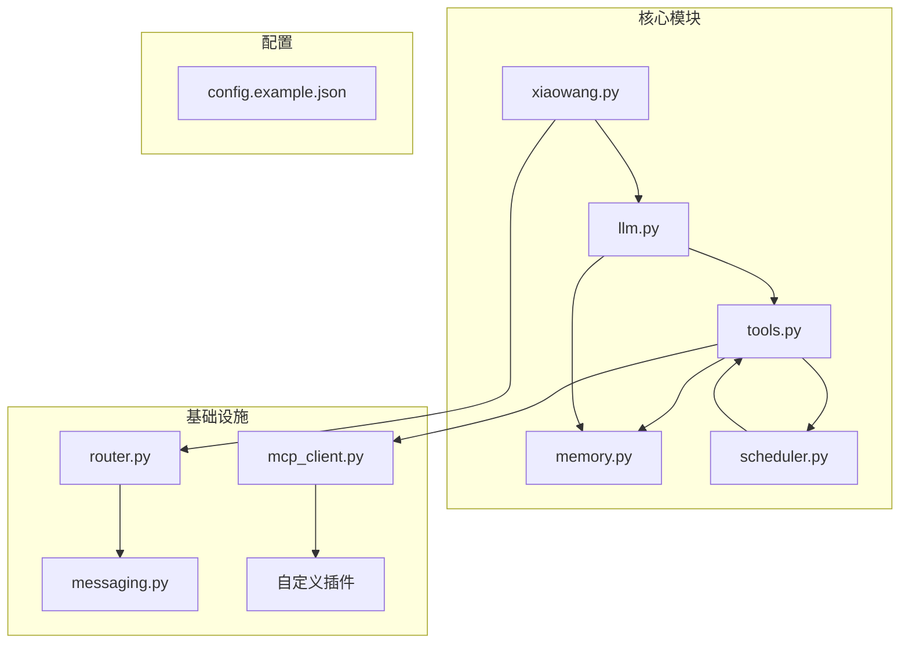
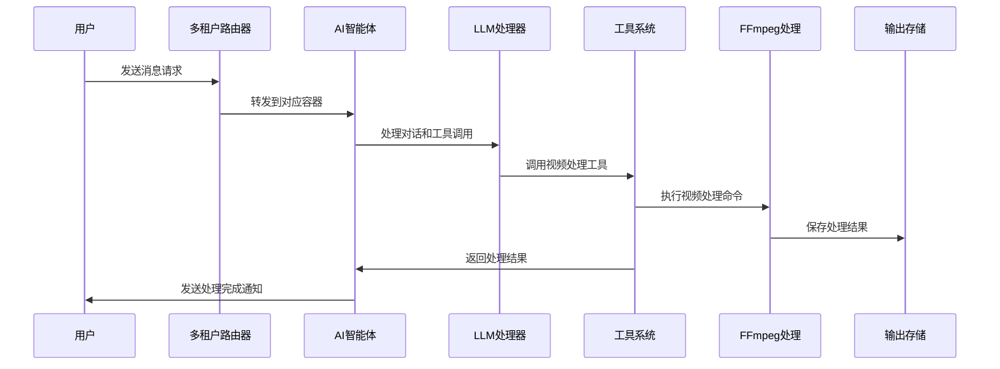
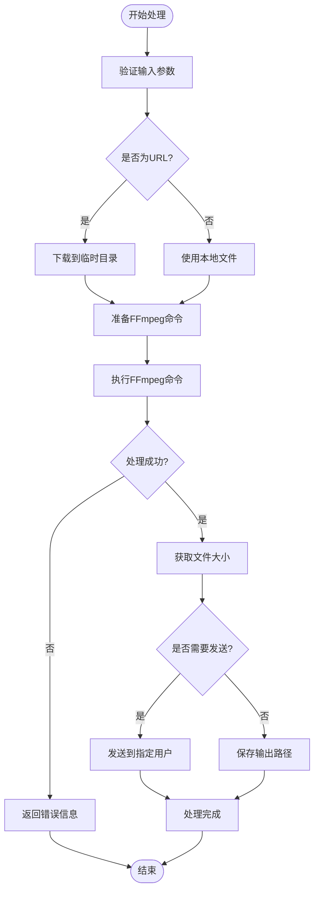
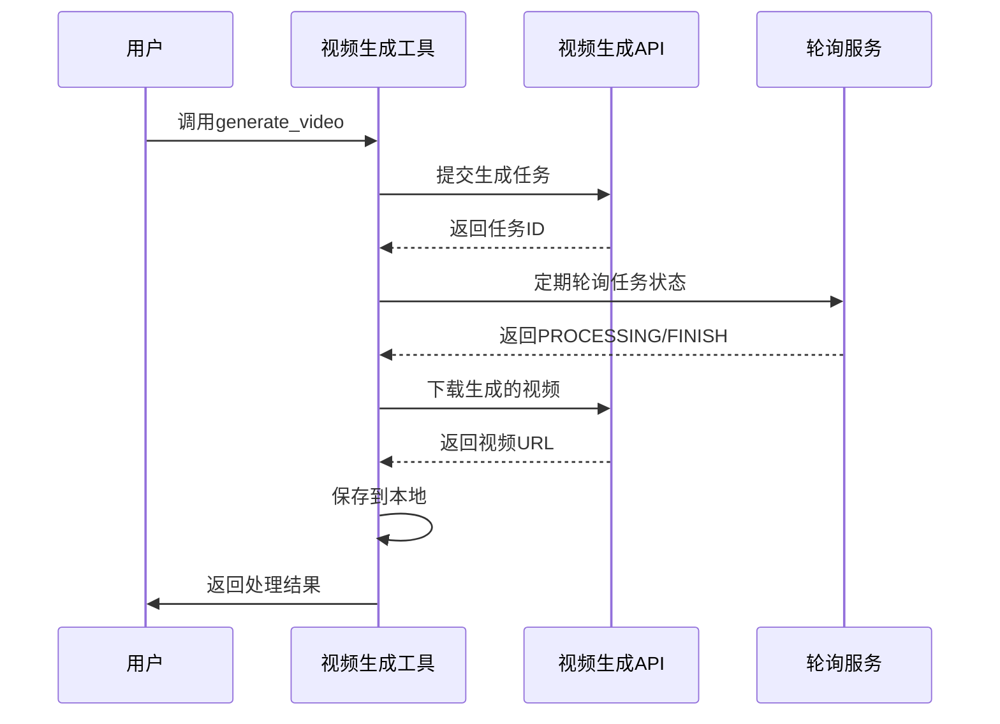
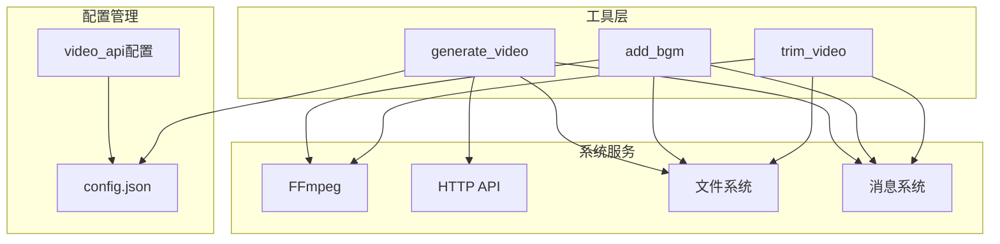

# 视频处理工具

<cite>
**本文档引用的文件**
- [README.md](file://README.md)
- [tools.py](file://tools.py)
- [config.example.json](file://config.example.json)
- [llm.py](file://llm.py)
- [xiaowang.py](file://xiaowang.py)
- [router.py](file://router.py)
- [memory.py](file://memory.py)
- [scheduler.py](file://scheduler.py)
- [mcp_client.py](file://mcp_client.py)
</cite>

## 目录
1. [简介](#简介)
2. [项目结构](#项目结构)
3. [核心组件](#核心组件)
4. [架构概览](#架构概览)
5. [详细组件分析](#详细组件分析)
6. [依赖关系分析](#依赖关系分析)
7. [性能考虑](#性能考虑)
8. [故障排除指南](#故障排除指南)
9. [结论](#结论)

## 简介

7/24 Office 是一个生产级的AI智能体系统，专为24/7运行而设计。该项目包含26个内置工具，其中视频处理工具是其核心功能之一。本文档专注于视频处理工具API，详细说明视频剪辑、背景音乐添加和AI视频生成工具的实现和使用方法。

该系统采用纯Python开发，零框架依赖，仅使用标准库和3个小型包（croniter、lancedb、websocket-client）。系统支持多租户路由、内存管理、计划任务等功能，并通过FFmpeg进行视频处理。

## 项目结构

系统采用模块化设计，主要文件组织如下：



**图表来源**
- [xiaowang.py:1-626](file://xiaowang.py#L1-L626)
- [llm.py:1-401](file://llm.py#L1-L401)
- [tools.py:1-1153](file://tools.py#L1-L1153)

**章节来源**
- [README.md:1-162](file://README.md#L1-L162)
- [xiaowang.py:35-76](file://xiaowang.py#L35-L76)

## 核心组件

视频处理工具位于 `tools.py` 文件中，包含三个主要工具：

1. **trim_video** - 视频裁剪工具
2. **add_bgm** - 背景音乐添加工具  
3. **generate_video** - AI视频生成工具

这些工具都使用 `@tool` 装饰器注册到工具系统中，支持OpenAI函数调用格式的描述。

**章节来源**
- [tools.py:304-496](file://tools.py#L304-L496)

## 架构概览

视频处理工具在整个系统中的位置和交互关系如下：



**图表来源**
- [router.py:389-418](file://router.py#L389-L418)
- [llm.py:317-400](file://llm.py#L317-L400)
- [tools.py:332-358](file://tools.py#L332-L358)

## 详细组件分析

### 视频剪辑工具 (trim_video)

#### 功能概述
视频剪辑工具使用FFmpeg进行无重新编码的视频裁剪，支持毫秒级快速处理大文件。

#### 参数定义
| 参数名 | 类型 | 必需 | 描述 |
|--------|------|------|------|
| input_path | string | 是 | 视频文件路径（本地或URL） |
| start | string | 是 | 开始时间，格式HH:MM:SS或秒数 |
| end | string | 否 | 结束时间（可选，省略则处理到末尾） |
| send_to | string | 否 | 处理完成后发送给谁（可选） |

#### FFmpeg命令参数
```bash
ffmpeg -y -ss START_TIME [-to END_TIME] -i INPUT -c:v copy -c:a copy -avoid_negative_ts make_zero OUTPUT
```

关键参数说明：
- `-y`: 自动覆盖输出文件
- `-ss`: 设置开始时间
- `-to`: 设置结束时间（可选）
- `-i`: 输入文件
- `-c:v copy`: 视频流直接复制（不重新编码）
- `-c:a copy`: 音频流直接复制（不重新编码）
- `-avoid_negative_ts make_zero`: 处理时间戳问题

#### 处理流程


**图表来源**
- [tools.py:326-358](file://tools.py#L326-L358)

**章节来源**
- [tools.py:326-358](file://tools.py#L326-L358)

### 背景音乐添加工具 (add_bgm)

#### 功能概述
背景音乐添加工具在保持原视频质量的同时，将背景音乐与原音频混合，支持音量调节。

#### 参数定义
| 参数名 | 类型 | 必需 | 描述 |
|--------|------|------|------|
| video_path | string | 是 | 视频文件路径（本地或URL） |
| audio_path | string | 是 | 音频文件路径（mp3/wav/aac，本地或URL） |
| volume | number | 否 | 背景音乐音量比例，默认0.3（30%） |
| send_to | string | 否 | 处理完成后发送给谁（可选） |

#### FFmpeg命令参数
```bash
ffmpeg -y -i VIDEO -i AUDIO -filter_complex "[1:a]volume=VOLUME[bgm];[0:a][bgm]amix=inputs=2:duration=first[a]" -map 0:v -map [a] -c:v copy -c:a aac OUTPUT
```

关键参数说明：
- `-filter_complex`: 复杂滤镜链
- `[1:a]volume=VOLUME[bgm]`: 调整背景音乐音量并重命名为bgm
- `[0:a][bgm]amix=inputs=2:duration=first`: 混合原音频和背景音乐
- `-map 0:v`: 映射原始视频流
- `-map [a]`: 映射混合后的音频流
- `-c:v copy`: 视频流直接复制
- `-c:a aac`: 音频编码为AAC

#### 音频混合机制
系统采用FFmpeg的音频混合功能，支持以下特性：
- **音量控制**: 通过volume滤镜调整背景音乐音量
- **同步处理**: 使用amix滤镜确保音频同步
- **时长处理**: duration=first确保输出时长与视频一致
- **质量保持**: 视频流直接复制，避免质量损失

**章节来源**
- [tools.py:361-396](file://tools.py#L361-L396)

### AI视频生成工具 (generate_video)

#### 功能概述
AI视频生成工具通过外部视频生成API进行异步视频生成，支持详细的提示词和分辨率设置。

#### 参数定义
| 参数名 | 类型 | 必需 | 描述 |
|--------|------|------|------|
| prompt | string | 是 | 视频内容描述（越详细越好） |
| size | string | 否 | 视频分辨率，默认1280x720 |
| send_to | string | 否 | 处理完成后发送给谁（可选） |

#### 处理流程


**图表来源**
- [tools.py:399-495](file://tools.py#L399-L495)

#### 异步处理机制
- **提交阶段**: 向API提交生成请求，获取任务ID
- **轮询阶段**: 每3秒检查一次任务状态，最多轮询100次（300秒）
- **下载阶段**: 任务完成后从API下载生成的视频
- **超时处理**: 300秒后返回超时错误

**章节来源**
- [tools.py:399-495](file://tools.py#L399-L495)

## 依赖关系分析

视频处理工具的依赖关系和集成点：



**图表来源**
- [tools.py:500-511](file://tools.py#L500-L511)
- [config.example.json:45-49](file://config.example.json#L45-L49)

**章节来源**
- [tools.py:500-511](file://tools.py#L500-L511)
- [config.example.json:45-49](file://config.example.json#L45-L49)

## 性能考虑

### 时间复杂度分析

1. **视频剪辑 (trim_video)**:
   - 时间复杂度: O(n)，其中n为视频时长
   - 空间复杂度: O(1)，使用流式处理
   - 性能特点: 无重新编码，处理速度快

2. **背景音乐添加 (add_bgm)**:
   - 时间复杂度: O(n)，音频混合线性处理
   - 空间复杂度: O(1)，音频流直接处理
   - 性能特点: 视频流复制，音频混合高效

3. **AI视频生成 (generate_video)**:
   - 时间复杂度: O(1)提交，O(k)轮询，k为生成时间
   - 空间复杂度: O(1)，异步处理
   - 性能特点: 异步非阻塞，支持长时间任务

### 内存管理

系统采用以下内存管理策略：
- **流式处理**: 大文件通过流式方式处理，避免内存峰值
- **临时文件**: 下载的文件存储在/tmp目录，处理完成后自动清理
- **超时控制**: 所有外部操作设置超时限制，防止资源泄露
- **错误恢复**: 异常情况下自动清理临时文件

### 并发处理

- **多租户隔离**: 每个用户独立容器，资源隔离
- **线程安全**: 工具调用使用锁机制保证线程安全
- **资源限制**: Docker容器设置内存限制，防止资源滥用

## 故障排除指南

### 常见问题及解决方案

#### FFmpeg相关错误
1. **FFmpeg未安装**
   - 解决方案: 安装FFmpeg并确保在PATH中可用
   - 检查命令: `ffmpeg -version`

2. **权限不足**
   - 解决方案: 确保对输入文件和输出目录有读写权限
   - 检查命令: `ls -la /path/to/files`

3. **格式不支持**
   - 解决方案: 检查输入文件格式是否被FFmpeg支持
   - 检查命令: `ffprobe input.mp4`

#### 网络相关错误
1. **AI视频生成超时**
   - 解决方案: 检查网络连接和API密钥配置
   - 建议: 增加超时时间或优化网络环境

2. **文件下载失败**
   - 解决方案: 检查URL有效性和网络连接
   - 建议: 使用本地文件替代网络URL

#### 配置相关错误
1. **缺少API密钥**
   - 解决方案: 在config.json中配置video_api.api_key
   - 检查: `cat config.json | grep api_key`

2. **路径配置错误**
   - 解决方案: 确保workspace目录存在且可写
   - 建议: 创建必要的目录结构

**章节来源**
- [tools.py:344-345](file://tools.py#L344-L345)
- [tools.py:382-383](file://tools.py#L382-L383)
- [tools.py:434-435](file://tools.py#L434-L435)

## 结论

7/24 Office的视频处理工具提供了完整、高效的视频处理解决方案。系统具有以下优势：

1. **零框架依赖**: 使用纯Python实现，部署简单
2. **高性能处理**: 无重新编码的视频剪辑和音频混合
3. **异步处理**: 支持长时间运行的AI视频生成任务
4. **多租户支持**: Docker容器隔离，支持多用户并发
5. **完善的错误处理**: 全面的异常捕获和恢复机制

推荐使用场景：
- 日常视频编辑和处理
- 批量视频文件处理
- 集成AI视频生成功能
- 多用户视频处理服务

最佳实践建议：
- 使用本地文件路径以提高处理速度
- 合理设置音量比例避免音频失真
- 监控系统资源使用情况
- 定期清理临时文件和缓存
- 配置适当的超时和重试机制