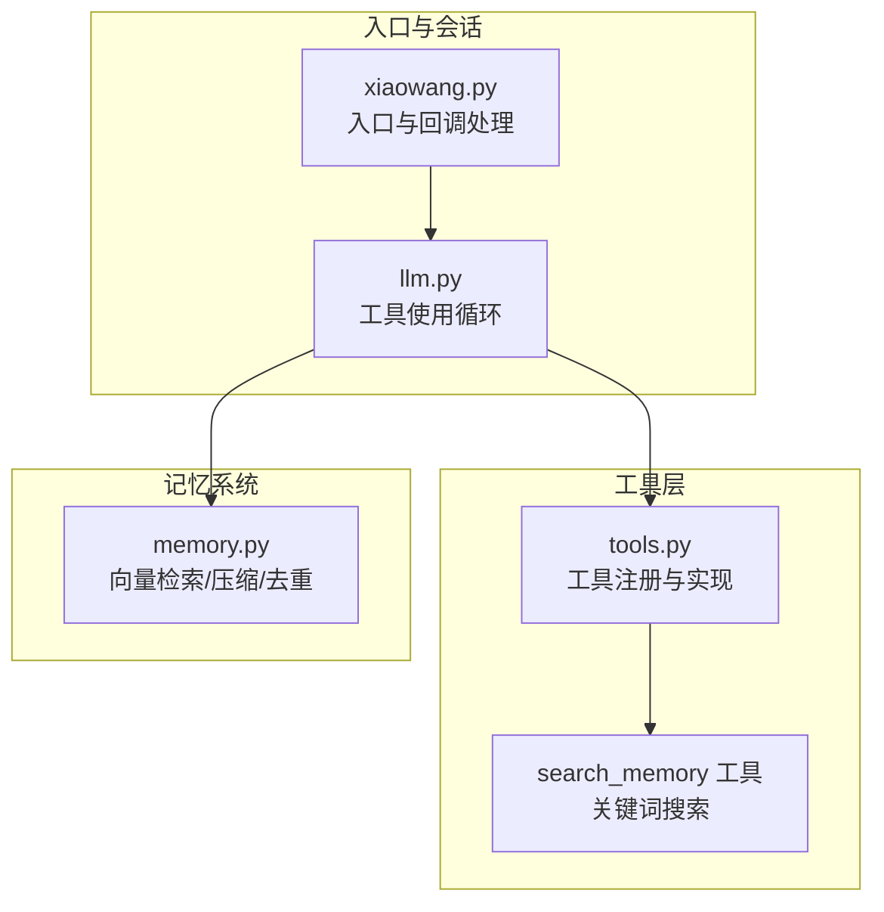
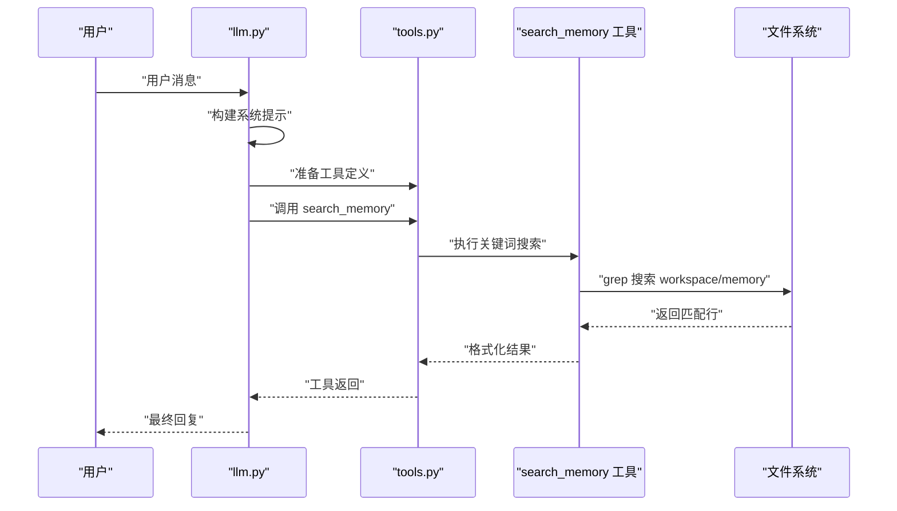
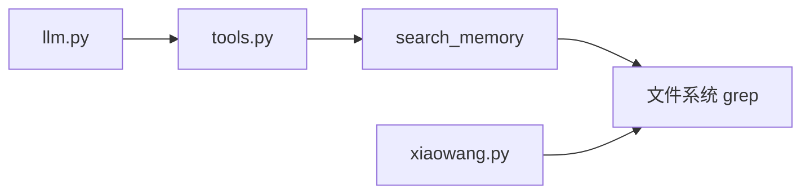

# 记忆搜索工具

<cite>
**本文档引用的文件**
- [memory.py](file://memory.py)
- [tools.py](file://tools.py)
- [llm.py](file://llm.py)
- [xiaowang.py](file://xiaowang.py)
- [config.example.json](file://config.example.json)
- [README.md](file://README.md)
</cite>

## 目录
1. [简介](#简介)
2. [项目结构](#项目结构)
3. [核心组件](#核心组件)
4. [架构总览](#架构总览)
5. [详细组件分析](#详细组件分析)
6. [依赖关系分析](#依赖关系分析)
7. [性能考量](#性能考量)
8. [故障排查指南](#故障排查指南)
9. [结论](#结论)
10. [附录](#附录)

## 简介
本文件为“记忆搜索工具”的API文档，聚焦于工具名称为 search_memory 的记忆检索能力。该工具通过在工作区的 memory 目录中执行关键词搜索，支持三种搜索范围：全部（默认）、仅长期记忆 MEMORY.md、仅每日日志文件。工具基于系统内置的 grep 命令实现，具备结果数量限制与截断提示，确保输出可控且可读。

本工具并非向量检索，而是基于文件内容的关键词匹配，适合快速定位特定主题或事实片段；与向量检索工具 recall（由 memory.py 提供）配合使用，可实现“关键词粗搜 + 语义细搜”的双层检索策略。

## 项目结构
围绕记忆搜索工具的关键文件与职责如下：
- tools.py：工具注册与实现，包含 search_memory 工具定义与实现逻辑
- memory.py：向量记忆检索（recall）与压缩/去重/持久化流程
- llm.py：对话循环、会话管理、系统提示构建、工具调用链
- xiaowang.py：入口程序、回调处理、消息分发、内存系统初始化
- config.example.json：配置示例，包含 memory 组件的嵌入式配置项
- README.md：系统概览与工具清单

图表来源
- [xiaowang.py:71-76](file://xiaowang.py#L71-L76)
- [llm.py:317-401](file://llm.py#L317-L401)
- [tools.py:764-800](file://tools.py#L764-L800)
- [memory.py:88-119](file://memory.py#L88-L119)

章节来源
- [README.md:23-66](file://README.md#L23-L66)
- [config.example.json:28-38](file://config.example.json#L28-L38)

## 核心组件
- search_memory 工具：在 workspace/memory 目录下进行关键词搜索，支持三种范围模式，返回匹配行列表，并对超量结果进行截断提示
- 会话注入：在对话循环中，系统会在系统提示前注入当前检索到的相关记忆上下文（由 recall 实现），而 search_memory 则提供文件级关键词检索能力
- 配置项：memory 组件的嵌入式配置影响向量检索行为（如 retrieve_top_k、similarity_threshold），但 search_memory 使用的是文件系统 grep 搜索

章节来源
- [tools.py:764-800](file://tools.py#L764-L800)
- [llm.py:336-346](file://llm.py#L336-L346)
- [memory.py:88-119](file://memory.py#L88-L119)
- [config.example.json:28-38](file://config.example.json#L28-L38)

## 架构总览
search_memory 的调用链路如下：
- 用户通过消息触发 LLM
- LLM 决定调用 search_memory 工具
- 工具在工作区 memory 目录执行 grep 搜索
- 返回匹配结果，LLM 将其作为工具结果返回给用户

图表来源
- [llm.py:356-399](file://llm.py#L356-L399)
- [tools.py:63-74](file://tools.py#L63-L74)
- [tools.py:764-800](file://tools.py#L764-L800)

## 详细组件分析

### search_memory 工具 API 定义
- 工具名称：search_memory
- 功能描述：在工作区 memory 目录中执行关键词搜索
- 参数
  - query（必需）：关键词，空格分隔的多个词将按 AND 条件组合
  - scope（可选）：搜索范围，默认 all，可选值为 all、long、daily
- 返回
  - 匹配行列表，每行包含文件名、行号与匹配片段
  - 若未找到，返回提示信息
  - 若匹配超过阈值，返回前若干条并提示总数

章节来源
- [tools.py:764-769](file://tools.py#L764-L769)

### 关键词搜索机制
- 搜索引擎：grep（递归、大小写不敏感、显示行号）
- 文件过滤：仅搜索 .md 文件
- 范围控制
  - all：搜索整个 memory 目录，包含所有 .md 文件
  - long：仅搜索 MEMORY.md
  - daily：仅搜索以年月命名的目录下的 .md 日志文件（例如 2024-01/*.md）

章节来源
- [tools.py:778-787](file://tools.py#L778-L787)

### 文件范围过滤
- 所有模式均限定为 .md 文件
- daily 模式进一步限定为以年-月命名的子目录中的 .md 文件
- long 模式直接指定 MEMORY.md

章节来源
- [tools.py:778-787](file://tools.py#L778-L787)

### 搜索范围配置
- scope 参数控制搜索范围
- 默认值为 all
- long 与 daily 模式分别针对 MEMORY.md 与每日日志文件

章节来源
- [tools.py:767-769](file://tools.py#L767-L769)

### 结果展示格式
- 输出为多行文本，每行包含匹配所在文件与行号
- 若匹配数超过阈值（默认 30），仅显示前若干条并提示总数
- 若无匹配，返回“未找到”提示

章节来源
- [tools.py:795-798](file://tools.py#L795-L798)

### 记忆文件组织结构
- 工作区 memory 目录
  - MEMORY.md：长期记忆文件，search_memory 支持单独检索
  - 年-月目录：存放每日日志，文件名通常为日期相关的 .md
- 搜索时仅限 .md 文件，其他类型文件不会被扫描

章节来源
- [tools.py:773-787](file://tools.py#L773-L787)

### Grep 搜索技术
- 递归搜索：-r
- 大小写不敏感：-i
- 显示行号：-n
- 文件类型过滤：--include=*.md
- daily 模式额外使用 --include=2*.md 限定年份前缀的日志文件

章节来源
- [tools.py:778-787](file://tools.py#L778-L787)

### 结果截断处理
- 当匹配行数超过阈值（默认 30）时，仅返回前若干条，并追加“总共有 N 条匹配，仅显示前 30 条”的提示
- 这一设计避免长输出导致的性能与可读性问题

章节来源
- [tools.py:796-798](file://tools.py#L796-L798)

### 与向量检索的关系
- search_memory 是文件级关键词检索，适合快速定位具体事实
- recall（向量检索）由 memory.py 提供，适合语义相似度召回
- 在对话中，系统会先注入 recall 检索到的记忆，再根据需要调用 search_memory 进行精确关键词定位

章节来源
- [llm.py:336-346](file://llm.py#L336-L346)
- [memory.py:88-119](file://memory.py#L88-L119)

### 最佳实践
- 使用空格分隔的多个关键词以缩小范围
- 优先使用 daily 模式定位当日日志，long 模式定位长期记忆
- 对于复杂查询，可先用 recall 获取语义相关记忆，再用 search_memory 精确核对
- 注意搜索结果可能包含大量匹配，必要时增加关键词以提高精度

章节来源
- [tools.py:764-769](file://tools.py#L764-L769)
- [tools.py:796-798](file://tools.py#L796-L798)

### 搜索优化建议
- 合理选择 scope，避免全量扫描
- 使用更具体的关键词，减少匹配行数
- 将重要信息写入 MEMORY.md，便于 long 模式快速检索

章节来源
- [tools.py:778-787](file://tools.py#L778-L787)

### 内容管理建议
- 将长期记忆写入 MEMORY.md，便于长期检索
- 每日日志按日期归档至年-月目录，便于按时间检索
- 保持日志文件命名规范，提升 grep 命中率

章节来源
- [tools.py:773-787](file://tools.py#L773-L787)

## 依赖关系分析
- search_memory 依赖文件系统 grep 命令
- 与 llm.py 的工具调用链耦合，但不依赖 memory.py 的向量检索
- 与 xiaowang.py 的工作区路径解析有关，确保在正确的 workspace 下执行搜索

图表来源
- [llm.py:356-399](file://llm.py#L356-L399)
- [tools.py:764-800](file://tools.py#L764-L800)
- [xiaowang.py:71-76](file://xiaowang.py#L71-L76)

章节来源
- [llm.py:356-399](file://llm.py#L356-L399)
- [tools.py:764-800](file://tools.py#L764-L800)
- [xiaowang.py:71-76](file://xiaowang.py#L71-L76)

## 性能考量
- grep 递归搜索在大型仓库中可能较慢，建议合理设置 scope
- 结果截断避免长输出带来的性能与可读性问题
- 与 recall 的组合使用可减少不必要的全量扫描

## 故障排查指南
- 未找到匹配：检查关键词是否正确，确认目标文件是否存在
- daily 模式报错：确认年-月目录存在且包含 .md 文件
- long 模式报错：确认 MEMORY.md 存在
- 权限问题：确保运行用户对 workspace/memory 具备读权限

章节来源
- [tools.py:775-782](file://tools.py#L775-L782)
- [tools.py:799-800](file://tools.py#L799-L800)

## 结论
search_memory 工具提供了轻量、高效的文件级关键词检索能力，适合与 recall 向量检索配合使用，形成“粗筛 + 精查”的完整记忆检索体系。通过合理的 scope 选择与关键词设计，可在保证性能的同时提升检索准确性与用户体验。

## 附录
- 配置参考：memory 组件的嵌入式配置影响向量检索参数（retrieve_top_k、similarity_threshold），但不影响 search_memory 的行为
- 工具清单：见 README.md 中的“工具列表”

章节来源
- [config.example.json:28-38](file://config.example.json#L28-L38)
- [README.md:86-100](file://README.md#L86-L100)