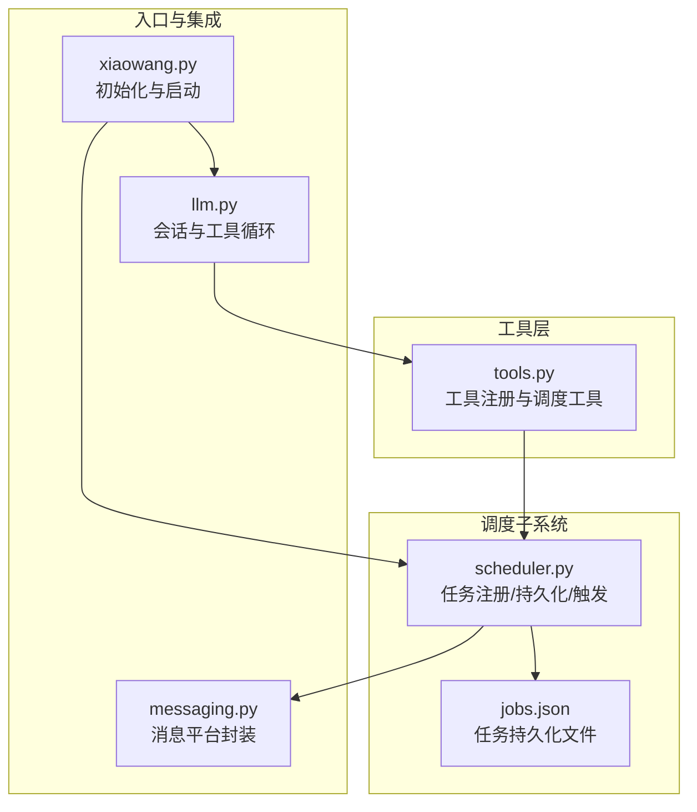
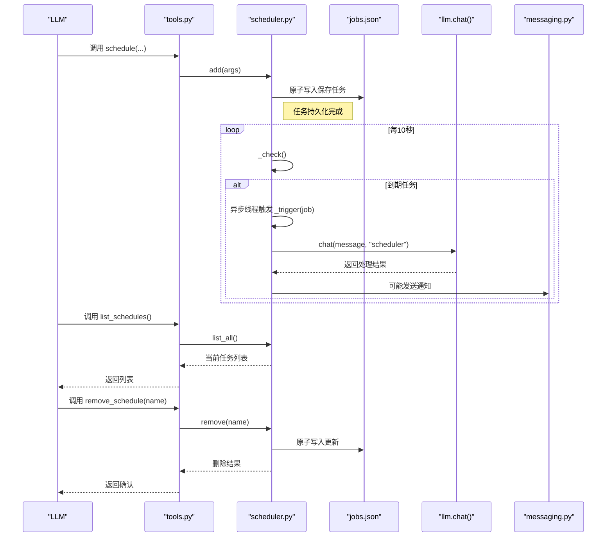
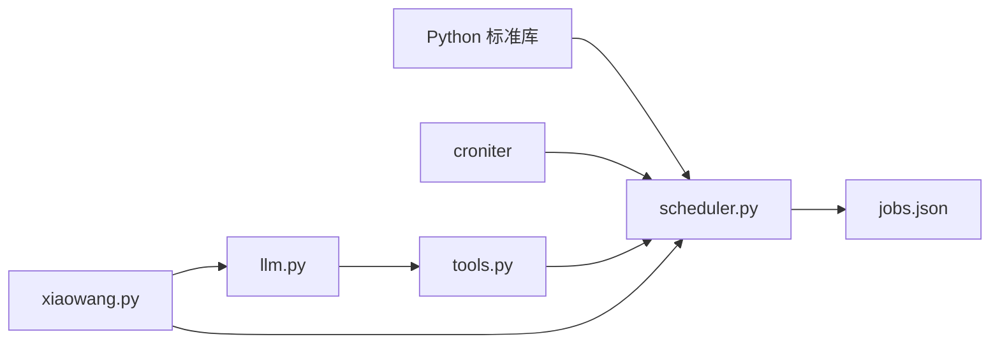

# 调度工具

<cite>
**本文引用的文件**
- [scheduler.py](file://scheduler.py)
- [tools.py](file://tools.py)
- [README.md](file://README.md)
- [config.example.json](file://config.example.json)
- [xiaowang.py](file://xiaowang.py)
</cite>

## 目录
1. [简介](#简介)
2. [项目结构](#项目结构)
3. [核心组件](#核心组件)
4. [架构总览](#架构总览)
5. [详细组件分析](#详细组件分析)
6. [依赖关系分析](#依赖关系分析)
7. [性能与可靠性](#性能与可靠性)
8. [故障排除指南](#故障排除指南)
9. [结论](#结论)
10. [附录](#附录)

## 简介
本文件为调度工具API文档，聚焦于任务调度能力，包括：
- schedule 任务创建：支持一次性延迟任务与基于Cron的周期性任务
- list_schedules 任务列表：查看当前所有已注册任务
- remove_schedule 任务删除：按名称移除指定任务

文档还涵盖Cron表达式语法、延迟任务配置、任务持久化机制、执行状态管理、线程安全、错误处理与资源清理，并提供最佳实践、性能监控与故障排除建议。

## 项目结构
调度功能由独立模块实现，通过工具注册暴露为LLM可调用接口，底层由后台线程定时检查触发条件，结合持久化文件实现跨进程重启后的任务恢复。

图表来源
- [xiaowang.py:59-76](file://xiaowang.py#L59-L76)
- [scheduler.py:30-43](file://scheduler.py#L30-L43)
- [tools.py:240-261](file://tools.py#L240-L261)

章节来源
- [README.md:23-66](file://README.md#L23-L66)
- [xiaowang.py:59-76](file://xiaowang.py#L59-L76)

## 核心组件
- 调度器模块：负责任务的创建、查询、删除、持久化与触发
- 工具注册模块：将调度器能力暴露为LLM可调用工具
- 进程入口：初始化调度器并启动后台检查线程

关键职责与交互：
- 初始化：在进程启动时加载持久化任务，注入聊天回调函数
- 后台线程：每10秒检查一次，识别到期任务并异步触发
- 持久化：采用原子写入策略，避免崩溃导致的数据损坏
- 触发执行：通过聊天回调将任务消息交由LLM处理，再由消息工具回传结果

章节来源
- [scheduler.py:30-43](file://scheduler.py#L30-L43)
- [scheduler.py:110-127](file://scheduler.py#L110-L127)
- [scheduler.py:208-218](file://scheduler.py#L208-L218)
- [tools.py:240-261](file://tools.py#L240-L261)
- [xiaowang.py:59-76](file://xiaowang.py#L59-L76)

## 架构总览
调度工具的调用链路如下：

图表来源
- [tools.py:240-261](file://tools.py#L240-L261)
- [scheduler.py:49-104](file://scheduler.py#L49-L104)
- [scheduler.py:130-168](file://scheduler.py#L130-L168)
- [scheduler.py:208-218](file://scheduler.py#L208-L218)

## 详细组件分析

### 调度器API定义
- 初始化
  - 参数：jobs_file（任务持久化文件路径）、chat_fn（聊天回调函数）
  - 行为：加载已有任务，注入回调，记录日志
- 启动
  - 行为：启动后台线程，每10秒检查一次任务
- 任务创建（schedule）
  - 支持两种模式：
    - 一次性延迟任务：delay_seconds
    - 周期性任务：cron_expr（配合 once 控制是否仅一次）
  - 返回：创建成功提示或错误信息
- 任务列表（list_schedules）
  - 返回：当前所有任务摘要（名称、类型、剩余时间或Cron表达式、消息片段）
- 任务删除（remove_schedule）
  - 参数：name（任务名）
  - 返回：删除成功或未找到提示

章节来源
- [scheduler.py:30-43](file://scheduler.py#L30-L43)
- [scheduler.py:39-43](file://scheduler.py#L39-L43)
- [scheduler.py:49-104](file://scheduler.py#L49-L104)
- [tools.py:240-261](file://tools.py#L240-L261)

### Cron表达式语法
- 使用 croniter 库解析Cron表达式
- 解析时使用本地时区（CST）进行计算，避免UTC解析偏差
- 支持一次性Cron（once_cron）与周期性Cron（cron）
- 一次性Cron在首次触发后自动从任务列表中移除
- 周期性Cron会在每次触发后更新 last_run 时间戳

章节来源
- [scheduler.py:140-159](file://scheduler.py#L140-L159)
- [scheduler.py:188-205](file://scheduler.py#L188-L205)

### 延迟任务配置
- delay_seconds：以秒为单位的延迟时间
- 触发时间：当前时间 + delay_seconds
- 类型标记：once
- 任务去重：同名任务创建时会被替换

章节来源
- [scheduler.py:50-79](file://scheduler.py#L50-L79)

### 任务持久化机制
- 文件：jobs.json
- 写入策略：先写临时文件，再原子替换目标文件，防止崩溃导致数据损坏
- 加载策略：启动时读取，失败则清空为默认值
- 并发控制：全局锁保护任务列表的增删改查

章节来源
- [scheduler.py:110-127](file://scheduler.py#L110-L127)
- [scheduler.py:24](file://scheduler.py#L24)

### 执行状态管理
- 后台检查：每10秒扫描一次到期任务
- 心跳日志：每30分钟输出一次任务统计与下次触发时间
- 触发执行：对到期任务异步启动新线程执行，避免阻塞主循环
- 失败处理：捕获异常并记录，同时尝试向“scheduler”会话发送失败通知

章节来源
- [scheduler.py:130-168](file://scheduler.py#L130-L168)
- [scheduler.py:188-205](file://scheduler.py#L188-L205)
- [scheduler.py:208-218](file://scheduler.py#L208-L218)

### 线程安全与资源清理
- 线程安全：
  - 全局锁保护任务列表的并发访问
  - 触发阶段使用独立线程，不阻塞主循环
- 资源清理：
  - 一次性Cron任务在首次触发后自动移除
  - 周期性Cron任务保留并更新 last_run
  - 异常时记录日志，必要时发送失败通知

章节来源
- [scheduler.py:24](file://scheduler.py#L24)
- [scheduler.py:135-164](file://scheduler.py#L135-L164)

### 错误处理
- Cron解析异常：记录错误并继续保留任务
- 触发执行异常：记录异常详情，尝试通过聊天回调发送失败通知
- 文件读写异常：加载失败时清空任务；保存失败不影响运行但可能丢失变更
- 循环异常：捕获并记录，保证后台线程持续运行

章节来源
- [scheduler.py:157-159](file://scheduler.py#L157-L159)
- [scheduler.py:176-185](file://scheduler.py#L176-L185)
- [scheduler.py:112-119](file://scheduler.py#L112-L119)
- [scheduler.py:212-214](file://scheduler.py#L212-L214)

## 依赖关系分析
- scheduler.py 依赖标准库与 croniter
- tools.py 将调度器方法包装为LLM可调用工具
- xiaowang.py 在启动时初始化调度器并注入聊天回调

图表来源
- [scheduler.py:10-18](file://scheduler.py#L10-L18)
- [tools.py:80-82](file://tools.py#L80-L82)
- [xiaowang.py:59-76](file://xiaowang.py#L59-L76)

章节来源
- [scheduler.py:10-18](file://scheduler.py#L10-L18)
- [tools.py:80-82](file://tools.py#L80-L82)
- [xiaowang.py:59-76](file://xiaowang.py#L59-L76)

## 性能与可靠性
- 检查频率：每10秒一次，兼顾实时性与开销平衡
- 心跳日志：每30分钟输出一次，便于运维观察
- 原子写入：降低崩溃风险，提升可靠性
- 异步触发：避免阻塞主循环，提高吞吐
- 一次性Cron：减少长期维护成本

章节来源
- [scheduler.py:208-218](file://scheduler.py#L208-L218)
- [scheduler.py:122-127](file://scheduler.py#L122-L127)
- [scheduler.py:166-168](file://scheduler.py#L166-L168)

## 故障排除指南
- 无法加载任务
  - 检查 jobs.json 是否存在且可读
  - 若读取失败，系统会清空任务列表重新开始
- Cron表达式无效
  - 查看日志中的 cron 错误信息
  - 确认表达式符合 croniter 语法
- 任务未触发
  - 检查当前时间与CST时区设置
  - 确认任务类型与参数（delay_seconds 或 cron_expr）
- 触发后无响应
  - 查看触发日志与异常栈
  - 确认聊天回调可用
- 任务删除无效
  - 确认任务名称拼写一致
  - 检查持久化文件是否被正确更新

章节来源
- [scheduler.py:112-119](file://scheduler.py#L112-L119)
- [scheduler.py:157-159](file://scheduler.py#L157-L159)
- [scheduler.py:176-185](file://scheduler.py#L176-L185)
- [scheduler.py:212-214](file://scheduler.py#L212-L214)

## 结论
该调度工具以轻量、可靠为核心设计目标：通过原子持久化与后台线程检查实现跨进程的任务恢复与触发；通过Cron表达式与延迟任务满足多样化场景；通过线程安全与错误处理保障稳定性。结合工具层的统一接口，调度能力可被LLM无缝调用，形成“计划-执行-反馈”的闭环。

## 附录

### API参考

- schedule（创建任务）
  - 名称：schedule
  - 描述：创建一个计划任务。一次性任务使用 delay_seconds；周期性任务使用 cron_expr。触发时将消息作为用户消息发送至LLM进行处理。
  - 参数：
    - name（字符串，必填）：任务唯一标识
    - message（字符串，必填）：触发时发送给LLM的消息内容（应包含如“通过消息工具发送给所有者”的指令）
    - delay_seconds（整数，可选）：延迟秒数（一次性任务）
    - cron_expr（字符串，可选）：Cron表达式（周期性任务，例如“0 9 * * *”）
    - once（布尔，可选，默认true，仅对 cron_expr 生效）：是否仅执行一次
  - 返回：创建成功提示或错误信息
  - 实现位置：[tools.py:240-249](file://tools.py#L240-L249)，[scheduler.py:49-79](file://scheduler.py#L49-L79)

- list_schedules（列出任务）
  - 名称：list_schedules
  - 描述：列出所有已注册的计划任务
  - 参数：无
  - 返回：任务列表摘要（名称、类型、剩余时间或Cron表达式、消息片段）
  - 实现位置：[tools.py:252-254](file://tools.py#L252-L254)，[scheduler.py:82-93](file://scheduler.py#L82-L93)

- remove_schedule（删除任务）
  - 名称：remove_schedule
  - 描述：删除指定名称的计划任务
  - 参数：
    - name（字符串，必填）：任务名称
  - 返回：删除成功或未找到提示
  - 实现位置：[tools.py:257-261](file://tools.py#L257-L261)，[scheduler.py:96-103](file://scheduler.py#L96-L103)

### Cron表达式示例与说明
- 示例：每天上午9点执行
  - 表达式：0 9 * * *
  - 解释：第0分钟、第9小时、每日、每月、每周
- 示例：每5分钟执行一次
  - 表达式：*/5 * * * *
  - 解释：每5分钟
- 注意事项
  - 使用本地时区（CST）解析，避免UTC差异
  - 一次性Cron在首次触发后自动移除

章节来源
- [scheduler.py:140-159](file://scheduler.py#L140-L159)

### 配置与部署要点
- 依赖安装
  - croniter：用于Cron表达式解析
- 配置文件
  - config.example.json 提供模型、消息平台、内存等配置项
- 进程启动
  - xiaowang.py 中初始化调度器并启动后台线程
  - jobs.json 默认位于工作目录

章节来源
- [README.md:112-117](file://README.md#L112-L117)
- [config.example.json:1-61](file://config.example.json#L1-L61)
- [xiaowang.py:46](file://xiaowang.py#L46)
- [xiaowang.py:66](file://xiaowang.py#L66)
- [xiaowang.py:598](file://xiaowang.py#L598)