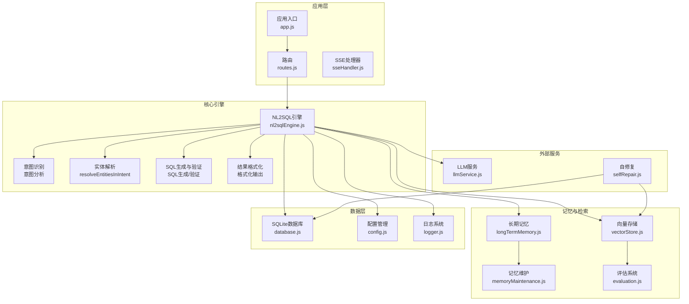
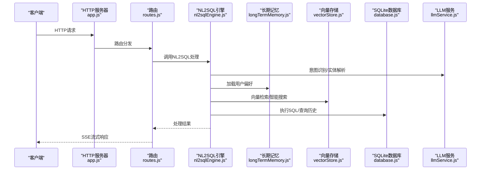
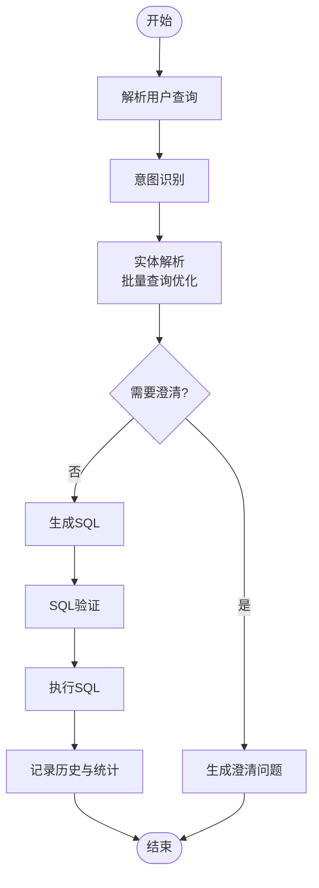
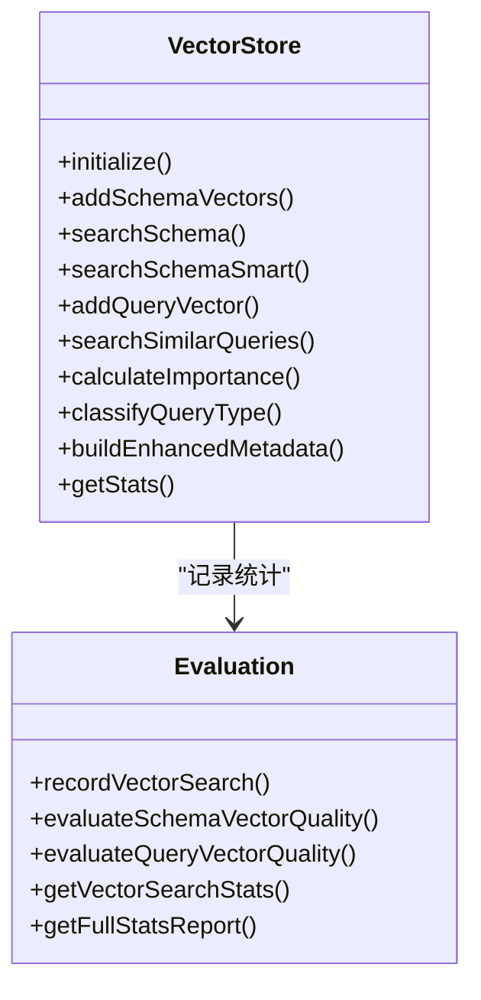
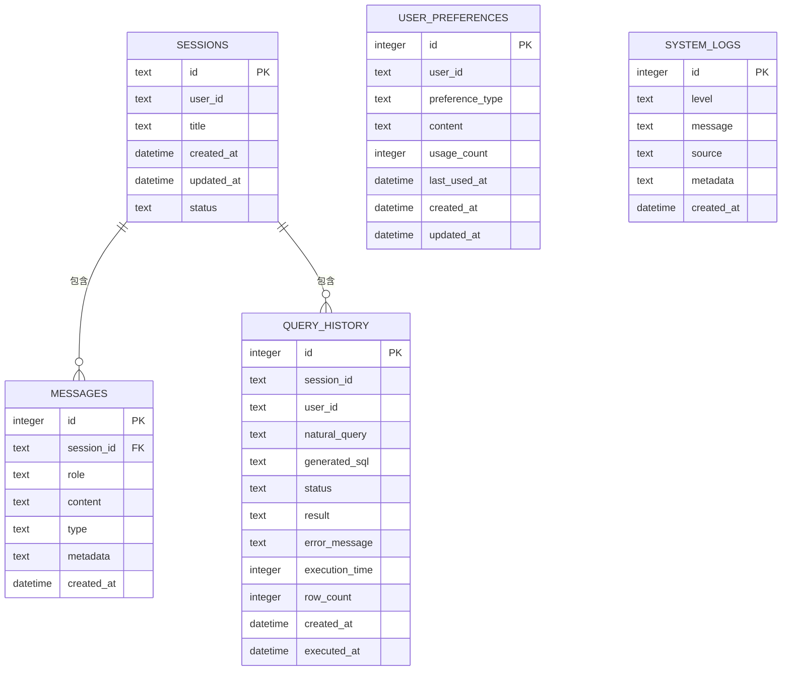
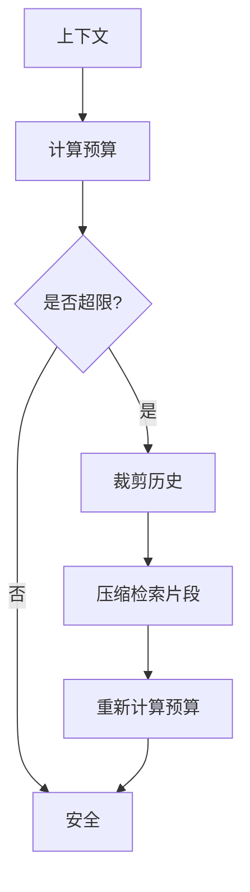
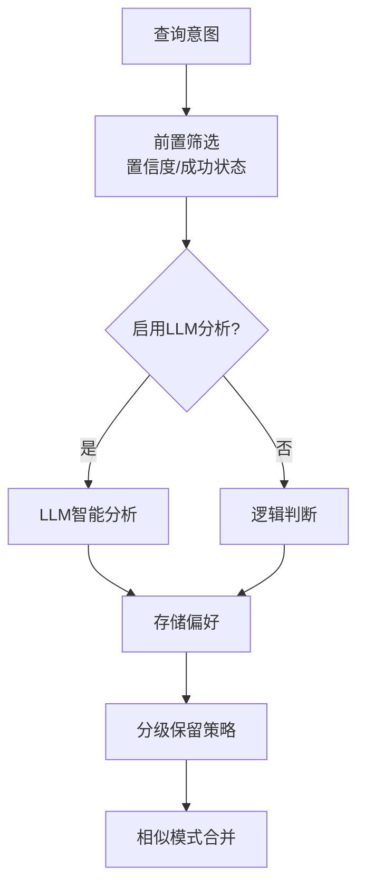
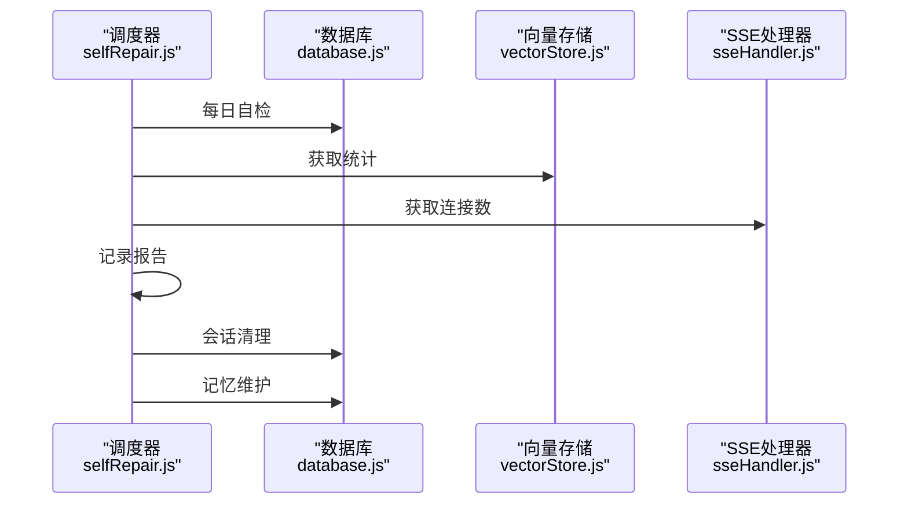
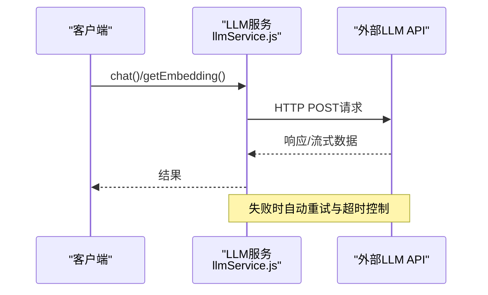
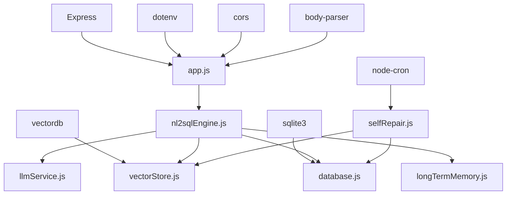

# 性能优化

<cite>
**本文档引用的文件**
- [app.js](file://NL2SQL/backend/src/app.js)
- [nl2sqlEngine.js](file://NL2SQL/backend/src/core/nl2sqlEngine.js)
- [vectorStore.js](file://NL2SQL/backend/src/memory/vectorStore.js)
- [database.js](file://NL2SQL/backend/src/core/database.js)
- [tokenBudget.js](file://NL2SQL/backend/src/utils/tokenBudget.js)
- [longTermMemory.js](file://NL2SQL/backend/src/memory/longTermMemory.js)
- [config.js](file://NL2SQL/backend/src/core/config.js)
- [evaluation.js](file://NL2SQL/backend/src/utils/evaluation.js)
- [selfRepair.js](file://NL2SQL/backend/src/core/selfRepair.js)
- [llmService.js](file://NL2SQL/backend/src/core/llmService.js)
- [memoryMaintenance.js](file://NL2SQL/backend/src/memory/memoryMaintenance.js)
- [logger.js](file://NL2SQL/backend/src/utils/logger.js)
- [package.json](file://NL2SQL/backend/package.json)
</cite>

## 目录
1. [简介](#简介)
2. [项目结构](#项目结构)
3. [核心组件](#核心组件)
4. [架构概览](#架构概览)
5. [详细组件分析](#详细组件分析)
6. [依赖分析](#依赖分析)
7. [性能考量](#性能考量)
8. [故障排查指南](#故障排查指南)
9. [结论](#结论)

## 简介
本项目是一个基于自然语言到SQL转换的查询服务，重点围绕性能优化展开。通过对NL2SQL引擎、向量数据库、SQLite持久化、Token预算管理、长期记忆系统以及自修复机制的深入分析，本文档总结了关键性能优化策略与实践，旨在帮助开发者在保证功能完整性的同时提升系统吞吐量、降低延迟并增强稳定性。

## 项目结构
后端采用模块化设计，核心模块包括：
- 应用入口与初始化：负责环境加载、中间件配置、模块初始化与优雅关闭
- NL2SQL引擎：意图识别、实体解析、SQL生成与验证、结果格式化
- 向量存储：基于LanceDB的Schema与查询历史向量化检索
- 数据库：SQLite持久化与迁移、事务管理、索引优化
- 上下文管理：Token预算估算与压缩、对话摘要
- 长期记忆：用户偏好提取与存储、分级保留策略
- 自修复：定时任务、会话清理、统计收集与健康报告
- LLM服务：API通信封装、重试机制、流式响应支持
- 评估系统：向量化质量与记忆命中率统计

**图表来源**
- [app.js:1-238](file://NL2SQL/backend/src/app.js#L1-L238)
- [nl2sqlEngine.js:1-800](file://NL2SQL/backend/src/core/nl2sqlEngine.js#L1-L800)
- [vectorStore.js:1-759](file://NL2SQL/backend/src/memory/vectorStore.js#L1-L759)
- [database.js:1-850](file://NL2SQL/backend/src/core/database.js#L1-L850)
- [longTermMemory.js:1-800](file://NL2SQL/backend/src/memory/longTermMemory.js#L1-L800)
- [memoryMaintenance.js:1-415](file://NL2SQL/backend/src/memory/memoryMaintenance.js#L1-L415)
- [evaluation.js:1-488](file://NL2SQL/backend/src/utils/evaluation.js#L1-L488)
- [llmService.js:1-468](file://NL2SQL/backend/src/core/llmService.js#L1-L468)
- [selfRepair.js:1-489](file://NL2SQL/backend/src/core/selfRepair.js#L1-L489)
- [config.js:1-398](file://NL2SQL/backend/src/core/config.js#L1-L398)
- [logger.js:1-442](file://NL2SQL/backend/src/utils/logger.js#L1-L442)

**章节来源**
- [app.js:1-238](file://NL2SQL/backend/src/app.js#L1-L238)
- [package.json:1-28](file://NL2SQL/backend/package.json#L1-L28)

## 核心组件
- 应用入口与初始化：统一加载环境变量、配置中间件、初始化数据库与向量存储、挂载路由、启动HTTP服务器与SSE服务，并实现优雅关闭与错误处理。
- NL2SQL引擎：实现意图识别、实体解析、SQL生成与验证、结果格式化，并集成长期记忆与向量检索以提升准确性与效率。
- 向量存储：基于LanceDB的Schema与查询历史向量化，支持智能搜索与重排序，提供统计与评估能力。
- SQLite持久化：表结构设计与索引优化、迁移机制、事务管理与连接池配置，确保数据一致性与查询性能。
- 上下文管理：Token预算估算与压缩、对话摘要、历史裁剪，防止LLM上下文溢出。
- 长期记忆：用户偏好提取与存储、分级保留策略、相似模式合并，提升个性化体验。
- 自修复机制：定时任务、会话清理、统计收集与健康报告，保障系统长期稳定运行。
- LLM服务：API通信封装、重试机制、超时控制与流式响应，提升外部依赖的可靠性。
- 评估系统：向量化质量评估与记忆命中率统计，为性能优化提供数据支撑。

**章节来源**
- [app.js:97-166](file://NL2SQL/backend/src/app.js#L97-L166)
- [nl2sqlEngine.js:1-800](file://NL2SQL/backend/src/core/nl2sqlEngine.js#L1-L800)
- [vectorStore.js:231-261](file://NL2SQL/backend/src/memory/vectorStore.js#L231-L261)
- [database.js:200-261](file://NL2SQL/backend/src/core/database.js#L200-L261)
- [tokenBudget.js:115-181](file://NL2SQL/backend/src/utils/tokenBudget.js#L115-L181)
- [longTermMemory.js:312-485](file://NL2SQL/backend/src/memory/longTermMemory.js#L312-L485)
- [selfRepair.js:60-125](file://NL2SQL/backend/src/core/selfRepair.js#L60-L125)
- [llmService.js:222-299](file://NL2SQL/backend/src/core/llmService.js#L222-L299)
- [evaluation.js:158-266](file://NL2SQL/backend/src/utils/evaluation.js#L158-L266)

## 架构概览
系统采用分层架构，核心流程如下：
- 请求进入HTTP服务器，经路由分发到NL2SQL引擎
- 引擎进行意图识别与实体解析，结合长期记忆与向量检索优化
- 生成SQL并执行，记录查询历史与性能指标
- 通过SSE实时返回结果，自修复机制定期维护系统健康

**图表来源**
- [app.js:78-87](file://NL2SQL/backend/src/app.js#L78-L87)
- [nl2sqlEngine.js:790-800](file://NL2SQL/backend/src/core/nl2sqlEngine.js#L790-L800)
- [longTermMemory.js:312-485](file://NL2SQL/backend/src/memory/longTermMemory.js#L312-L485)
- [vectorStore.js:450-536](file://NL2SQL/backend/src/memory/vectorStore.js#L450-L536)
- [database.js:361-424](file://NL2SQL/backend/src/core/database.js#L361-L424)
- [llmService.js:222-299](file://NL2SQL/backend/src/core/llmService.js#L222-L299)

## 详细组件分析

### NL2SQL引擎性能优化
- 实体解析优化：通过单次批量查询替代多次数据库查询，减少往返延迟；引入歧义处理与澄清机制，避免无效重试。
- 意图识别增强：结合长期记忆与向量检索，提升识别准确率与上下文理解能力。
- SQL生成与验证：严格的SQL验证与安全检查，防止注入攻击与无效查询。

**图表来源**
- [nl2sqlEngine.js:368-547](file://NL2SQL/backend/src/core/nl2sqlEngine.js#L368-L547)
- [nl2sqlEngine.js:790-800](file://NL2SQL/backend/src/core/nl2sqlEngine.js#L790-L800)

**章节来源**
- [nl2sqlEngine.js:368-547](file://NL2SQL/backend/src/core/nl2sqlEngine.js#L368-L547)
- [nl2sqlEngine.js:790-800](file://NL2SQL/backend/src/core/nl2sqlEngine.js#L790-L800)

### 向量存储与检索优化
- 智能搜索：根据查询意图识别（如游戏提及）进行优先级重排序，提升相关性。
- 元数据增强：计算查询重要性评分与分类，辅助后续学习与优化。
- 统计与评估：记录向量检索命中率与距离分布，为质量评估提供数据。

**图表来源**
- [vectorStore.js:231-261](file://NL2SQL/backend/src/memory/vectorStore.js#L231-L261)
- [vectorStore.js:450-536](file://NL2SQL/backend/src/memory/vectorStore.js#L450-L536)
- [evaluation.js:71-96](file://NL2SQL/backend/src/utils/evaluation.js#L71-L96)
- [evaluation.js:158-266](file://NL2SQL/backend/src/utils/evaluation.js#L158-L266)

**章节来源**
- [vectorStore.js:450-536](file://NL2SQL/backend/src/memory/vectorStore.js#L450-L536)
- [evaluation.js:158-266](file://NL2SQL/backend/src/utils/evaluation.js#L158-L266)

### SQLite数据库性能优化
- 索引优化：为常用查询字段建立索引，加速会话、消息、查询历史与偏好表的检索。
- 迁移与约束：启用外键约束，执行迁移修复旧表结构，确保数据一致性。
- 事务管理：使用事务包裹相关操作，减少锁竞争与提高并发性能。

**图表来源**
- [database.js:39-189](file://NL2SQL/backend/src/core/database.js#L39-L189)

**章节来源**
- [database.js:200-261](file://NL2SQL/backend/src/core/database.js#L200-L261)
- [database.js:361-424](file://NL2SQL/backend/src/core/database.js#L361-L424)

### Token预算管理与上下文优化
- 预算计算：估算系统提示词、历史对话与检索片段的Token数，计算使用率与剩余预算。
- 压缩策略：根据阈值触发历史裁剪与检索片段压缩，确保上下文不超限。
- 快捷检查：提供上下文安全检查与状态摘要，便于快速判断。

**图表来源**
- [tokenBudget.js:115-181](file://NL2SQL/backend/src/utils/tokenBudget.js#L115-L181)
- [tokenBudget.js:315-372](file://NL2SQL/backend/src/utils/tokenBudget.js#L315-L372)

**章节来源**
- [tokenBudget.js:115-181](file://NL2SQL/backend/src/utils/tokenBudget.js#L115-L181)
- [tokenBudget.js:315-372](file://NL2SQL/backend/src/utils/tokenBudget.js#L315-L372)

### 长期记忆与分级保留策略
- 存储筛选：基于置信度、查询复杂度与频率进行筛选，避免存储一次性或低价值查询。
- 分级保留：高频偏好永久保留，中频与低频偏好按天数清理，字段别名按固定周期清理。
- 相似模式合并：合并维度与指标高度重合的模式，减少冗余存储。

**图表来源**
- [longTermMemory.js:312-485](file://NL2SQL/backend/src/memory/longTermMemory.js#L312-L485)
- [memoryMaintenance.js:69-120](file://NL2SQL/backend/src/memory/memoryMaintenance.js#L69-L120)

**章节来源**
- [longTermMemory.js:312-485](file://NL2SQL/backend/src/memory/longTermMemory.js#L312-L485)
- [memoryMaintenance.js:69-120](file://NL2SQL/backend/src/memory/memoryMaintenance.js#L69-L120)

### 自修复机制与系统维护
- 定时任务：每日自检、会话清理、统计收集与记忆维护，确保系统健康运行。
- 健康报告：记录数据库连接、向量数据库状态、查询统计与系统资源使用情况。
- 记忆维护：按使用频率与时间阈值清理过期偏好，生成健康报告。

**图表来源**
- [selfRepair.js:60-125](file://NL2SQL/backend/src/core/selfRepair.js#L60-L125)
- [selfRepair.js:169-310](file://NL2SQL/backend/src/core/selfRepair.js#L169-L310)
- [selfRepair.js:341-373](file://NL2SQL/backend/src/core/selfRepair.js#L341-L373)
- [selfRepair.js:383-415](file://NL2SQL/backend/src/core/selfRepair.js#L383-L415)

**章节来源**
- [selfRepair.js:60-125](file://NL2SQL/backend/src/core/selfRepair.js#L60-L125)
- [selfRepair.js:169-310](file://NL2SQL/backend/src/core/selfRepair.js#L169-L310)
- [selfRepair.js:341-373](file://NL2SQL/backend/src/core/selfRepair.js#L341-L373)
- [selfRepair.js:383-415](file://NL2SQL/backend/src/core/selfRepair.js#L383-L415)

### LLM服务与外部依赖优化
- 重试机制：失败自动重试，指数退避策略，提升API调用成功率。
- 超时控制：为聊天与Embedding请求设置合理超时，防止阻塞。
- 流式响应：支持流式响应，改善用户体验与资源占用。

**图表来源**
- [llmService.js:222-299](file://NL2SQL/backend/src/core/llmService.js#L222-L299)
- [llmService.js:360-415](file://NL2SQL/backend/src/core/llmService.js#L360-L415)
- [llmService.js:167-195](file://NL2SQL/backend/src/core/llmService.js#L167-L195)

**章节来源**
- [llmService.js:222-299](file://NL2SQL/backend/src/core/llmService.js#L222-L299)
- [llmService.js:360-415](file://NL2SQL/backend/src/core/llmService.js#L360-L415)
- [llmService.js:167-195](file://NL2SQL/backend/src/core/llmService.js#L167-L195)

## 依赖分析
- 外部依赖：Express、vectordb、sqlite3、dotenv、cors、body-parser、uuid、dayjs、node-cron
- 内部模块：核心引擎、向量存储、数据库、上下文管理、长期记忆、自修复、LLM服务、评估系统、日志系统
- 耦合关系：NL2SQL引擎依赖LLM服务、向量存储、数据库与长期记忆；向量存储与评估系统相互协作；自修复机制贯穿各模块维护

**图表来源**
- [package.json:10-26](file://NL2SQL/backend/package.json#L10-L26)
- [app.js:23-48](file://NL2SQL/backend/src/app.js#L23-L48)

**章节来源**
- [package.json:10-26](file://NL2SQL/backend/package.json#L10-L26)
- [app.js:23-48](file://NL2SQL/backend/src/app.js#L23-L48)

## 性能考量
- 启动与初始化：确保数据目录、数据库与向量存储初始化顺序正确，避免阻塞主线程
- 数据库查询：使用批量查询与索引优化，减少往返次数；事务包裹相关操作
- 向量检索：智能搜索与元数据增强，提升相关性与减少无效匹配
- 上下文管理：Token预算估算与压缩，防止LLM上下文溢出
- 长期记忆：分级保留策略与相似模式合并，控制存储规模与提升命中率
- 自修复：定时任务与健康报告，保障系统长期稳定运行
- LLM服务：重试机制与超时控制，提升外部依赖可靠性

[本节为通用指导，无需特定文件分析]

## 故障排查指南
- 优雅关闭：监听SIGTERM/SIGINT，确保资源正确释放
- 未处理异常：捕获未处理Promise拒绝与未捕获异常，执行优雅关闭
- 日志系统：统一日志格式与级别，支持结构化日志与追踪
- 自修复：每日自检检查数据库连接、向量数据库状态、查询统计与系统资源
- 评估系统：记录向量检索命中率与距离分布，生成完整统计报告

**章节来源**
- [app.js:176-230](file://NL2SQL/backend/src/app.js#L176-L230)
- [logger.js:263-309](file://NL2SQL/backend/src/utils/logger.js#L263-L309)
- [selfRepair.js:169-310](file://NL2SQL/backend/src/core/selfRepair.js#L169-L310)
- [evaluation.js:397-407](file://NL2SQL/backend/src/utils/evaluation.js#L397-L407)

## 结论
本项目通过模块化设计与多项性能优化策略，在保证功能完整性的同时显著提升了系统性能与稳定性。关键优化包括：NL2SQL引擎的批量查询与歧义处理、向量存储的智能搜索与元数据增强、SQLite的索引优化与事务管理、Token预算的估算与压缩、长期记忆的分级保留与相似模式合并、自修复机制的定时维护与健康报告，以及LLM服务的重试与超时控制。这些措施共同构成了一个高效、可靠且可扩展的自然语言到SQL查询服务。