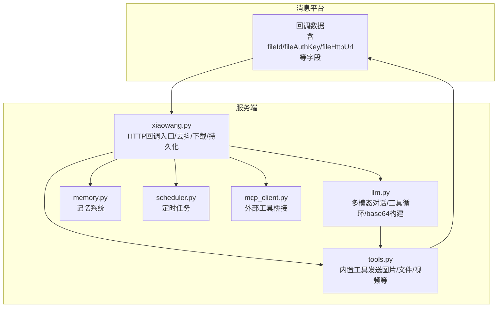
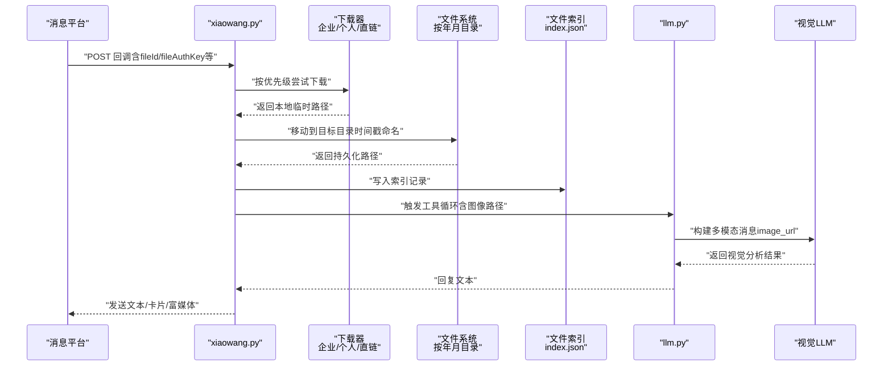
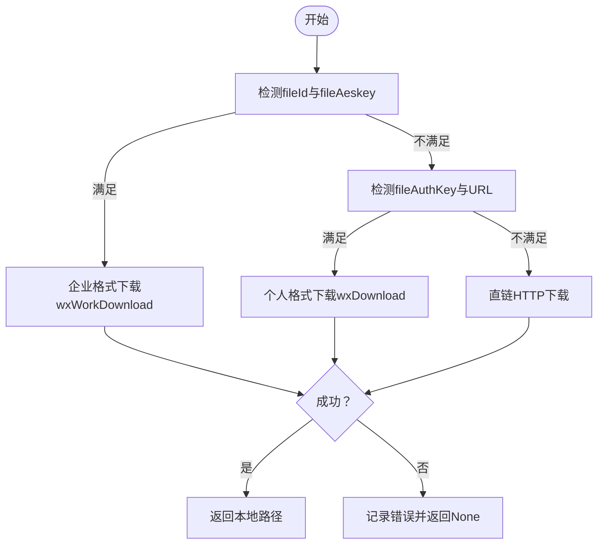
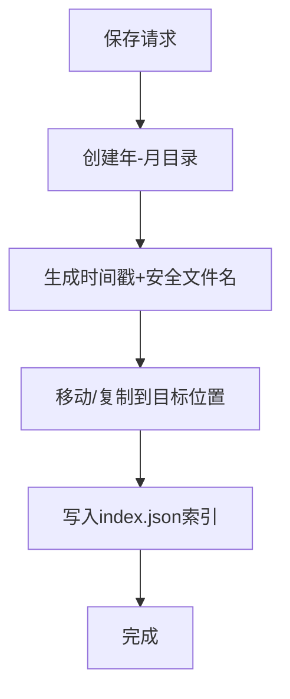
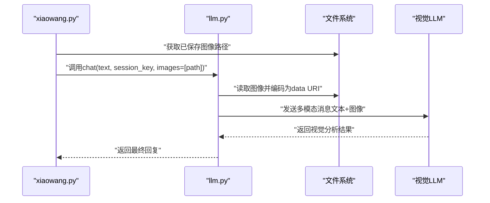
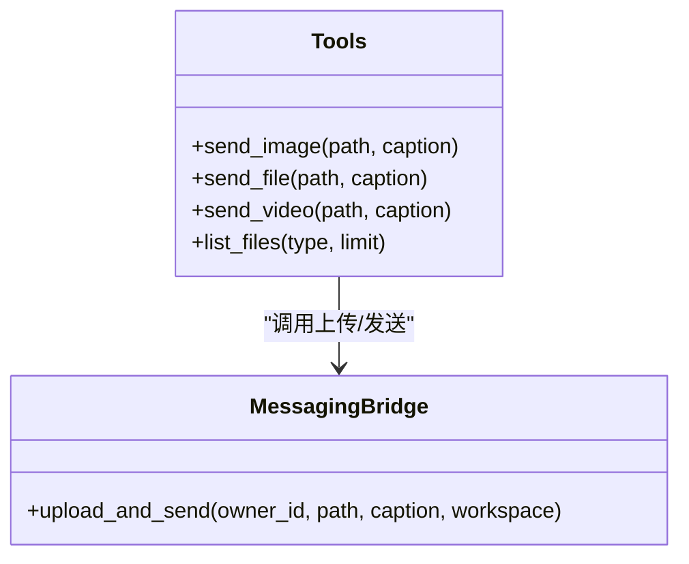
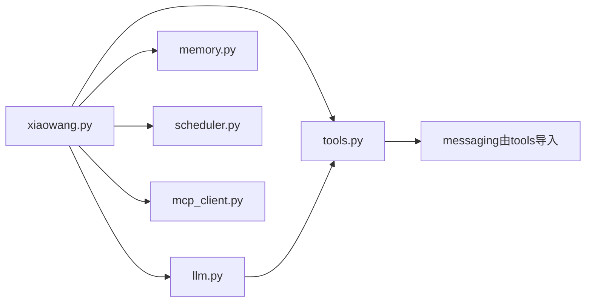

# 图像处理

<cite>
**本文引用的文件**
- [README.md](file://README.md)
- [config.example.json](file://config.example.json)
- [xiaowang.py](file://xiaowang.py)
- [llm.py](file://llm.py)
- [tools.py](file://tools.py)
- [memory.py](file://memory.py)
- [scheduler.py](file://scheduler.py)
- [router.py](file://router.py)
- [mcp_client.py](file://mcp_client.py)
- [self_check_tool.py](file://self_check_tool.py)
</cite>

## 目录
1. [简介](#简介)
2. [项目结构](#项目结构)
3. [核心组件](#核心组件)
4. [架构总览](#架构总览)
5. [详细组件分析](#详细组件分析)
6. [依赖分析](#依赖分析)
7. [性能考虑](#性能考虑)
8. [故障排查指南](#故障排查指南)
9. [结论](#结论)
10. [附录](#附录)

## 简介
本文件面向724 Office图像处理系统，聚焦于“图像消息的接收、下载、存储与处理”的完整流程。文档详细说明以下内容：
- 三种图像下载路径的优先级与实现：企业格式（fileId）、个人格式（fileAuthKey）、直接HTTP下载
- 图像文件的持久化存储策略：时间戳命名、按年月目录组织、文件索引管理
- 图像处理与视觉LLM的集成：base64编码转换、图像路径传递、视觉分析调用
- 具体API使用示例、配置参数与性能优化建议，帮助开发者快速理解并落地图像处理流程

## 项目结构
该系统采用纯Python实现，核心文件如下：
- xiaowang.py：HTTP回调入口、消息去抖、图像下载与持久化、语音转文字（ASR）
- llm.py：多模态对话循环、工具调用循环、会话管理、图像到base64的数据URI构建
- tools.py：内置工具注册与执行，包含发送图片、视频等媒体工具
- memory.py：三阶段记忆系统（压缩-去重-检索），支持向量检索
- scheduler.py：定时任务调度器，支持一次性与周期性任务
- router.py：多租户路由与容器自动编排（与图像处理流程关联不大）
- mcp_client.py：外部MCP服务器桥接，扩展工具能力
- config.example.json：模型、消息平台、内存、ASR、视频生成等配置样例
- README.md：功能特性、架构图、快速开始与配置说明

**图表来源**
- [xiaowang.py:383-433](file://xiaowang.py#L383-L433)
- [llm.py:193-224](file://llm.py#L193-L224)
- [tools.py:266-291](file://tools.py#L266-L291)
- [memory.py:88-119](file://memory.py#L88-L119)
- [scheduler.py:30-36](file://scheduler.py#L30-L36)
- [mcp_client.py:272-334](file://mcp_client.py#L272-L334)

**章节来源**
- [README.md:1-162](file://README.md#L1-L162)
- [config.example.json:1-61](file://config.example.json#L1-L61)

## 核心组件
- 回调入口与去抖：接收消息平台回调，合并短时间内的多条消息，再进入工具循环
- 媒体下载器：根据fileId/fileAuthKey/fileHttpUrl优先级选择下载路径
- 持久化存储：按年月目录保存，使用时间戳+安全文件名，维护文件索引
- 视觉LLM集成：将本地图像路径转换为base64数据URI，注入多模态消息
- 工具链：发送图片、列出文件、ASR语音识别等

**章节来源**
- [xiaowang.py:383-433](file://xiaowang.py#L383-L433)
- [xiaowang.py:99-132](file://xiaowang.py#L99-L132)
- [llm.py:193-224](file://llm.py#L193-L224)
- [tools.py:266-291](file://tools.py#L266-L291)

## 架构总览
下图展示从消息平台回调到图像处理与视觉LLM分析的端到端流程。

**图表来源**
- [xiaowang.py:383-433](file://xiaowang.py#L383-L433)
- [xiaowang.py:99-132](file://xiaowang.py#L99-L132)
- [llm.py:193-224](file://llm.py#L193-L224)

## 详细组件分析

### 组件A：图像下载与优先级处理
- 优先级顺序
  1) 企业格式：存在fileId且有fileAeskey时，调用平台企业下载接口
  2) 个人格式：存在fileAuthKey且有对应URL时，调用平台个人下载接口
  3) 直链下载：若上述失败，尝试直接HTTP下载
- 下载失败兜底：记录错误日志并返回None，后续流程根据返回值决定是否继续

**图表来源**
- [xiaowang.py:383-433](file://xiaowang.py#L383-L433)

**章节来源**
- [xiaowang.py:383-433](file://xiaowang.py#L383-L433)

### 组件B：图像持久化存储策略
- 目录结构：按年-月组织，避免单目录过大
- 文件命名：以当前时间戳开头，结合原始文件名（进行路径分隔符清理），确保安全
- 索引管理：在workspace/files/index.json中追加记录，包含路径、类型、文件名、大小、时间等字段

**图表来源**
- [xiaowang.py:99-132](file://xiaowang.py#L99-L132)

**章节来源**
- [xiaowang.py:99-132](file://xiaowang.py#L99-L132)

### 组件C：视觉LLM集成与图像路径传递
- 路径到base64：读取本地图像文件，计算MIME类型，生成data URI（base64）
- 多模态消息：将文本与image_url组合为多模态内容，注入到当前轮次的用户消息中
- 视觉分析：LLM调用视觉模型对图像进行分析，结果作为最终回复的一部分

**图表来源**
- [llm.py:193-224](file://llm.py#L193-L224)
- [llm.py:317-400](file://llm.py#L317-L400)

**章节来源**
- [llm.py:193-224](file://llm.py#L193-L224)
- [llm.py:317-400](file://llm.py#L317-L400)

### 组件D：工具链与发送图片
- 发送图片工具：支持HTTP URL或本地路径，内部通过消息平台上传并发送
- 列出文件工具：可按类型过滤，显示最近文件列表与索引信息

**图表来源**
- [tools.py:266-291](file://tools.py#L266-L291)
- [tools.py:205-236](file://tools.py#L205-L236)

**章节来源**
- [tools.py:266-291](file://tools.py#L266-L291)
- [tools.py:205-236](file://tools.py#L205-L236)

### 组件E：ASR语音转文字（与图像处理的协同）
- 语音消息到达后，先下载到本地，再进行转码与ASR识别
- 识别结果可用于多模态输入，或作为文本回复发送

**章节来源**
- [xiaowang.py:140-285](file://xiaowang.py#L140-L285)

## 依赖分析
- 模块耦合
  - xiaowang.py依赖llm.py进行工具循环与多模态消息构建
  - tools.py依赖messaging模块进行上传与发送
  - llm.py依赖tools模块获取工具定义与执行结果
  - memory.py与scheduler.py分别提供记忆检索与计划任务能力
- 外部依赖
  - 标准库：urllib、json、threading、subprocess等
  - 可选依赖：lancedb（向量数据库）、croniter（定时表达式解析）

**图表来源**
- [xiaowang.py:59-75](file://xiaowang.py#L59-L75)
- [tools.py:80-83](file://tools.py#L80-L83)
- [llm.py:17-18](file://llm.py#L17-L18)

**章节来源**
- [xiaowang.py:59-75](file://xiaowang.py#L59-L75)
- [tools.py:80-83](file://tools.py#L80-L83)
- [llm.py:17-18](file://llm.py#L17-L18)

## 性能考虑
- 去抖机制：合并短时间内多条消息，减少工具循环与LLM调用次数
- 并发控制：每个会话使用独立锁，保证线程安全；HTTP请求采用多线程处理
- 存储策略：按年-月目录组织，避免单目录文件过多导致I/O性能下降
- 编码开销：图像base64编码与多模态消息构建会增加网络与LLM调用成本，建议仅在必要时传入图像路径
- 容错与回退：下载失败时记录日志并降级为文本提示，避免阻塞主流程

[本节为通用指导，无需具体文件分析]

## 故障排查指南
- 下载失败
  - 检查fileId/fileAeskey/fileAuthKey/fileHttpUrl字段是否存在
  - 查看xiaowang.py中下载器的日志输出，确认优先级路径是否命中
- 持久化异常
  - 确认workspace/files目录可写，磁盘空间充足
  - 检查index.json是否被意外破坏，必要时重建
- 视觉LLM调用失败
  - 确认模型配置正确，API密钥有效
  - 检查图像路径是否存在且可读
- 工具执行异常
  - 使用tools.list_schedules与tools.list_files核对任务状态与文件索引
  - 查看日志中工具执行错误堆栈

**章节来源**
- [xiaowang.py:383-433](file://xiaowang.py#L383-L433)
- [xiaowang.py:99-132](file://xiaowang.py#L99-L132)
- [llm.py:317-400](file://llm.py#L317-L400)
- [tools.py:205-236](file://tools.py#L205-L236)

## 结论
724 Office图像处理系统通过清晰的消息回调入口、严格的下载优先级、稳健的持久化策略与多模态LLM集成，实现了从“接收-下载-存储-分析”的闭环。开发者可基于此框架快速扩展更多媒体处理能力，并结合定时任务与记忆系统实现更复杂的自动化场景。

[本节为总结，无需具体文件分析]

## 附录

### API使用示例（基于现有工具）
- 发送图片给所有者
  - 工具名称：send_image
  - 参数：path（HTTP URL或本地路径）、caption（可选）
  - 返回：发送结果或错误信息
- 列出最近接收的文件
  - 工具名称：list_files
  - 参数：type（image/video/file/voice/gif/all）、limit（数量限制）
  - 返回：文件列表摘要与索引信息

**章节来源**
- [tools.py:266-291](file://tools.py#L266-L291)
- [tools.py:205-236](file://tools.py#L205-L236)

### 配置参数要点
- 模型配置（models）：默认模型、提供商API基础地址、密钥、最大token数
- 消息平台配置（messaging）：token、GUID、API URL
- 内存配置（memory）：启用开关、嵌入API基础地址、维度、Top-K、相似度阈值
- ASR配置（asr）：应用ID、API密钥、密钥、WS URL
- 视频生成配置（video_api）：API基础地址、密钥、模型
- MCP服务器配置（mcp_servers）：传输方式（stdio/HTTP）、命令与参数、环境变量

**章节来源**
- [config.example.json:1-61](file://config.example.json#L1-L61)