# 多模态处理

<cite>
**本文引用的文件**   
- [README.md](file://README.md)
- [config.example.json](file://config.example.json)
- [xiaowang.py](file://xiaowang.py)
- [llm.py](file://llm.py)
- [tools.py](file://tools.py)
- [memory.py](file://memory.py)
- [router.py](file://router.py)
- [scheduler.py](file://scheduler.py)
- [mcp_client.py](file://mcp_client.py)
- [self_check_tool.py](file://self_check_tool.py)
</cite>

## 目录
1. [简介](#简介)
2. [项目结构](#项目结构)
3. [核心组件](#核心组件)
4. [架构总览](#架构总览)
5. [详细组件分析](#详细组件分析)
6. [依赖分析](#依赖分析)
7. [性能考虑](#性能考虑)
8. [故障排查指南](#故障排查指南)
9. [结论](#结论)
10. [附录](#附录)

## 简介
本文件为“724 Office 多模态处理系统”的综合技术文档，面向开发者与运维人员，系统性阐述该系统如何统一处理文本、图像、语音、视频与链接等多模态输入；如何完成多模态消息的接收、解析、转换与处理；以及语音识别（ASR）、图像识别与处理、视频处理工具链（剪辑、配乐、AI 视频生成）的实现机制与最佳实践。文档同时提供 API 使用示例、配置参数说明与性能优化建议，帮助快速理解与扩展系统能力。

## 项目结构
系统采用“单机多模块”与“容器化路由”相结合的组织方式：
- 单机入口：xiaowang.py 提供 HTTP 回调接入、消息去抖、媒体下载与持久化、ASR 流水线、工具循环调用与回复分片发送。
- 核心引擎：llm.py 负责会话管理、系统提示构建、多模态消息构造、工具定义注入与工具循环执行。
- 工具生态：tools.py 定义 26+ 内置工具，覆盖文件操作、发送媒体、视频处理、搜索、记忆检索、自诊断与热插拔插件等。
- 记忆系统：memory.py 实现三层记忆（会话压缩、向量化去重、检索注入）。
- 多租户路由：router.py 将不同用户回调路由到独立容器实例，支持自动 Provision 与健康检查。
- 定时调度：scheduler.py 支持一次性与周期性任务，异步触发工具循环。
- MCP 扩展：mcp_client.py 通过 JSON-RPC 连接外部 MCP 服务器，动态注册其工具。
- 自检与自愈：self_check_tool.py 文档化每日自检流程与自修复模式。

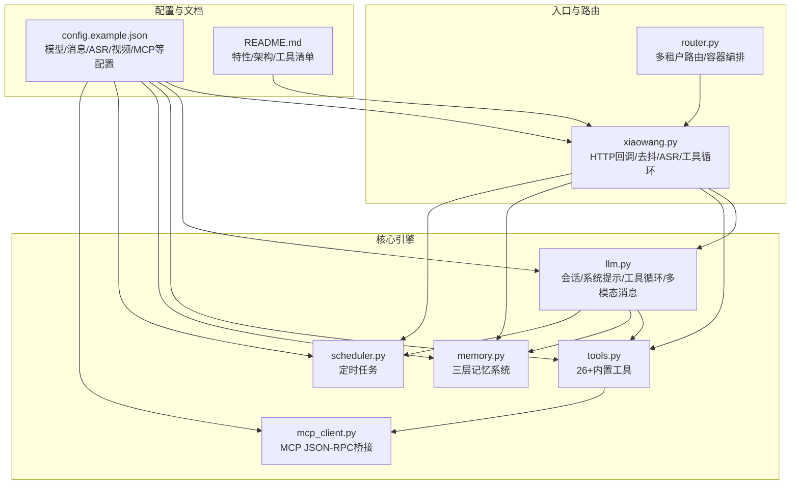

图表来源
- [router.py:1-493](file://router.py#L1-L493)
- [xiaowang.py:1-626](file://xiaowang.py#L1-L626)
- [llm.py:1-401](file://llm.py#L1-L401)
- [tools.py:1-1153](file://tools.py#L1-L1153)
- [memory.py:1-361](file://memory.py#L1-L361)
- [scheduler.py:1-219](file://scheduler.py#L1-L219)
- [mcp_client.py:1-334](file://mcp_client.py#L1-L334)
- [config.example.json:1-61](file://config.example.json#L1-L61)
- [README.md:1-162](file://README.md#L1-L162)

章节来源
- [README.md:23-66](file://README.md#L23-L66)
- [README.md:86-99](file://README.md#L86-L99)

## 核心组件
- 多模态消息处理管线
  - 接收：HTTP 回调解析消息体，区分文本、图片、视频、文件、语音、链接、位置等类型。
  - 去抖：合并短时间内多次输入，避免频繁触发工具循环。
  - 下载与持久化：根据平台字段优先级选择企业版/个人版/直链下载，保存至按年月分桶的文件索引。
  - ASR：语音消息经转码后通过 WebSocket ASR 实时流式识别，输出文本。
  - 工具循环：将文本与图像（base64 数据 URI）组合为多模态消息，注入系统提示与记忆上下文，驱动 LLM 选择工具并执行。
- 工具生态
  - 发送类：发送图片/文件/视频/链接卡片。
  - 视频处理：裁剪、加背景音乐、AI 视频生成（异步轮询结果）。
  - 搜索：多引擎聚合搜索（Tavily/Web/GitHub/HuggingFace）。
  - 记忆：关键词检索与语义召回（recall）。
  - 自诊断与自修复：自检报告、诊断日志、插件热加载与工具增删改。
- 记忆系统
  - 会话压缩：超过阈值截断并压缩历史对话为结构化记忆。
  - 向量化去重：基于余弦相似度过滤重复记忆。
  - 检索注入：查询向量匹配，将相关记忆注入系统提示。
- 多租户路由
  - 基于 Docker 的按用户容器编排，自动创建、健康检查、路由表持久化与热更新。
- MCP 扩展
  - JSON-RPC over stdio 或 HTTP，支持热重载与自动重连。
- 定时调度
  - 一次性与周期性任务，异步触发工具循环并可通知用户。

章节来源
- [xiaowang.py:389-554](file://xiaowang.py#L389-L554)
- [xiaowang.py:134-285](file://xiaowang.py#L134-L285)
- [llm.py:190-300](file://llm.py#L190-L300)
- [tools.py:264-496](file://tools.py#L264-L496)
- [memory.py:38-118](file://memory.py#L38-L118)
- [router.py:129-250](file://router.py#L129-L250)
- [mcp_client.py:269-334](file://mcp_client.py#L269-L334)
- [scheduler.py:30-104](file://scheduler.py#L30-L104)

## 架构总览
系统以“回调入口 -> 去抖与媒体处理 -> 工具循环 -> 结果回传”的主干流程为核心，结合三层记忆与多租户路由实现高可用与可扩展。

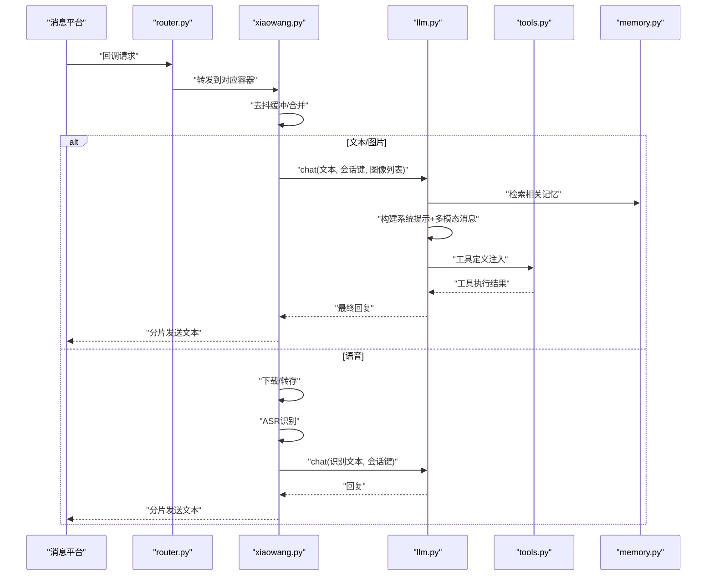

图表来源
- [router.py:389-418](file://router.py#L389-L418)
- [xiaowang.py:389-554](file://xiaowang.py#L389-L554)
- [xiaowang.py:134-285](file://xiaowang.py#L134-L285)
- [llm.py:317-401](file://llm.py#L317-L401)
- [memory.py:88-118](file://memory.py#L88-L118)
- [tools.py:58-74](file://tools.py#L58-L74)

## 详细组件分析

### 组件A：多模态消息接收与处理（xiaowang.py）
- 回调解析与类型判断：支持文本、图片、视频、文件、GIF、语音、链接、位置等类型，分别进入不同处理分支。
- 媒体下载策略：优先企业版下载（fileId + AESKey），其次个人版下载（fileAuthKey + URL），最后直链下载。
- 去抖机制：同一用户在设定时间窗口内的多次输入被合并，减少工具循环开销。
- 语音处理：下载后转存，进行 PCM 转码（SILK 使用专用解码器，其他格式使用 ffmpeg），随后通过 WebSocket ASR 实时流式识别，输出文本。
- 工具循环触发：将合并后的文本与图像路径传入 LLM，触发工具循环，再将结果按长度切片发送。

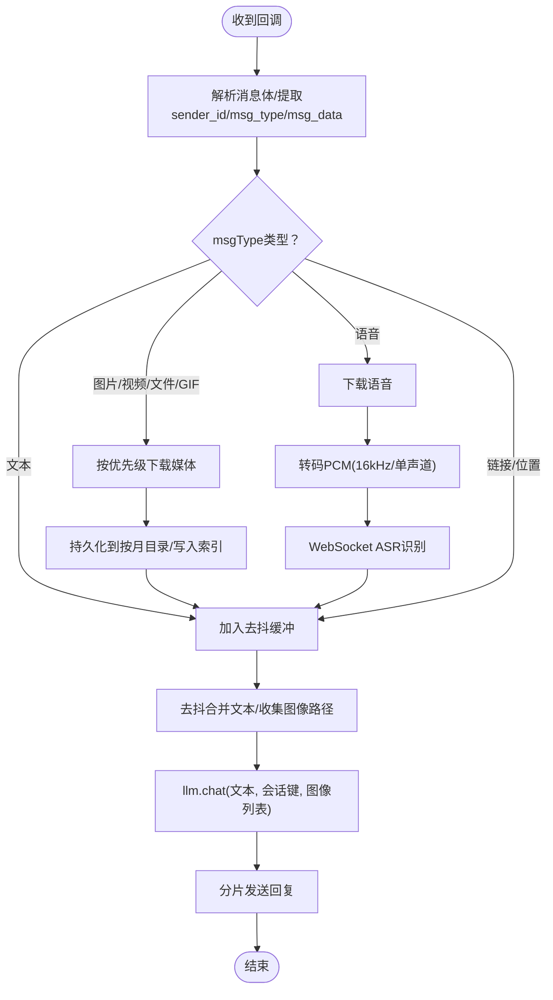

图表来源
- [xiaowang.py:389-554](file://xiaowang.py#L389-L554)
- [xiaowang.py:134-285](file://xiaowang.py#L134-L285)
- [xiaowang.py:309-378](file://xiaowang.py#L309-L378)

章节来源
- [xiaowang.py:389-554](file://xiaowang.py#L389-L554)
- [xiaowang.py:134-285](file://xiaowang.py#L134-L285)
- [xiaowang.py:309-378](file://xiaowang.py#L309-L378)

### 组件B：多模态消息构建与工具循环（llm.py）
- 多模态消息构造：支持纯文本与“文本+图片（base64 数据 URI）”混合输入；历史消息中仅保留文本标记，避免 LLM 不接受 image_url 的问题。
- 系统提示与记忆注入：从 SOUL/AGENT/USER 人格文件拼接系统提示；检索三层记忆并将相关片段注入系统提示。
- 工具循环：最多 20 次迭代，每次将系统提示与当前消息序列提交给 LLM，若返回工具调用则执行工具并将结果回填，直至无工具调用或超时。

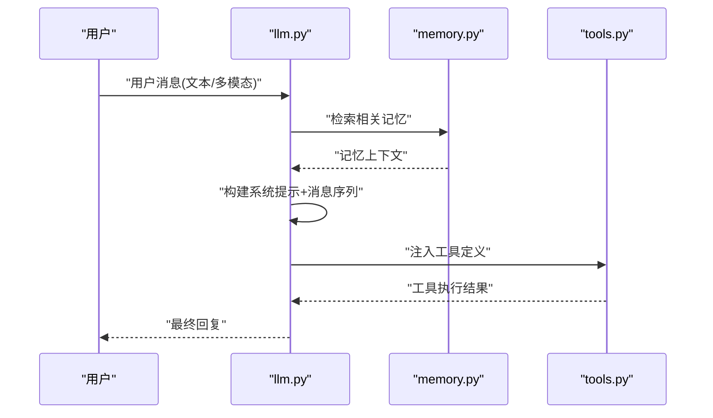

图表来源
- [llm.py:190-300](file://llm.py#L190-L300)
- [llm.py:317-401](file://llm.py#L317-L401)
- [memory.py:88-118](file://memory.py#L88-L118)
- [tools.py:58-74](file://tools.py#L58-L74)

章节来源
- [llm.py:190-300](file://llm.py#L190-L300)
- [llm.py:317-401](file://llm.py#L317-L401)
- [memory.py:88-118](file://memory.py#L88-L118)

### 组件C：语音识别（ASR）流水线（xiaowang.py）
- 音频转码：SILK 格式使用专用解码器，其他格式使用 ffmpeg 转为 16kHz/单声道/16bit PCM。
- WebSocket 流式识别：构造鉴权参数，按固定帧大小（约 8000 字节）分片发送，实时聚合识别结果，支持超时控制与错误上报。
- 输出：将识别词拼接为完整文本，失败时记录错误并提示保存原始语音文件路径。

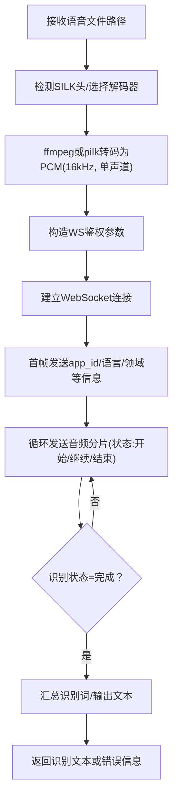

图表来源
- [xiaowang.py:140-285](file://xiaowang.py#L140-L285)

章节来源
- [xiaowang.py:140-285](file://xiaowang.py#L140-L285)

### 组件D：图像识别与处理（llm.py + tools.py）
- 图像读取与编码：将本地图片读取为 base64 数据 URI，作为多模态输入的一部分发送给 LLM。
- 图像发送工具：支持通过消息平台发送图片或本地路径/URL，便于向用户回传处理结果。
- 视觉分析：系统通过多模态消息将图像内容传递给 LLM，由 LLM 进行视觉理解与回答；未见独立视觉模型调用逻辑，依赖 LLM 的多模态能力。

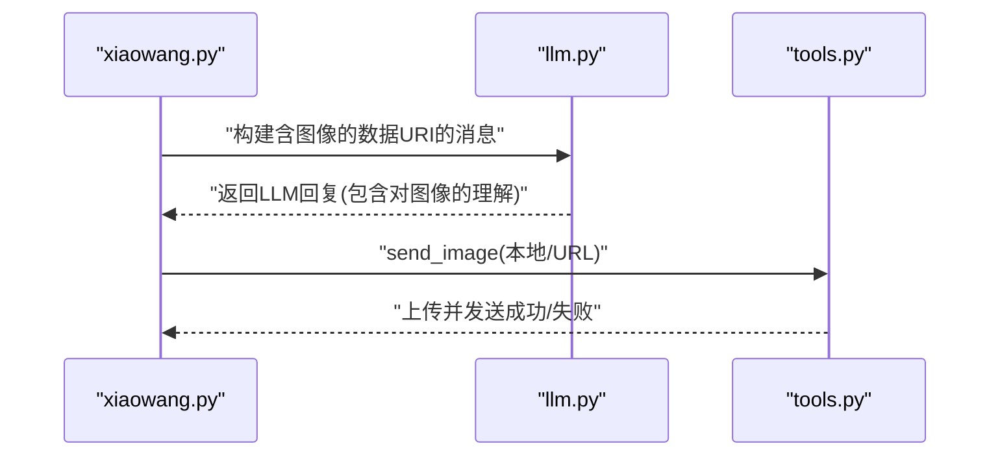

图表来源
- [llm.py:193-224](file://llm.py#L193-L224)
- [tools.py:266-302](file://tools.py#L266-L302)

章节来源
- [llm.py:193-224](file://llm.py#L193-L224)
- [tools.py:266-302](file://tools.py#L266-L302)

### 组件E：视频处理工具链（tools.py）
- 视频裁剪（trim_video）：基于 ffmpeg 的无重新编码剪辑，毫秒级定位，支持起止时间指定。
- 添加背景音乐（add_bgm）：仅混合音频轨道，保持视频流复制，可调节 BGM 音量比例。
- AI 视频生成（generate_video）：提交任务后轮询异步结果，下载生成视频并可直接发送给用户。

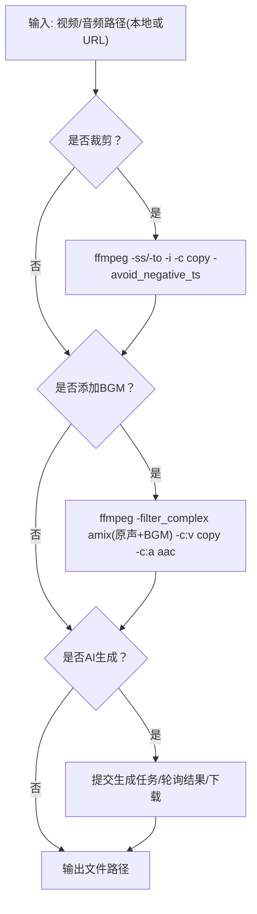

图表来源
- [tools.py:326-496](file://tools.py#L326-L496)

章节来源
- [tools.py:326-496](file://tools.py#L326-L496)

### 组件F：三层记忆系统（memory.py）
- 压缩：将会话历史中的人类与助手消息抽取为结构化记忆，过滤无效片段。
- 向量化与去重：调用嵌入 API 获取向量，使用余弦相似度阈值过滤重复记忆。
- 检索：用户消息经嵌入后在 LanceDB 中做向量检索，将 Top-K 相关记忆注入系统提示。

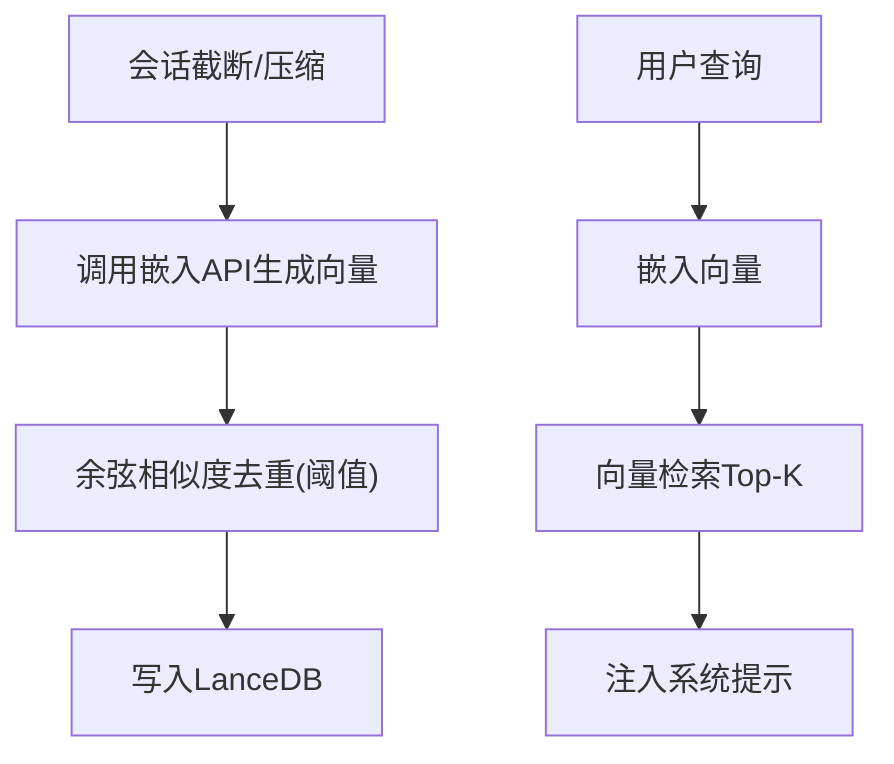

图表来源
- [memory.py:121-361](file://memory.py#L121-L361)

章节来源
- [memory.py:121-361](file://memory.py#L121-L361)

### 组件G：多租户路由与容器编排（router.py）
- 路由表：基于 sender_id 映射到后端容器地址，支持持久化与热加载。
- 自动 Provision：当新用户首次访问时，创建容器、挂载数据卷、设置健康检查，等待启动完成。
- 健康检查：通过 HTTP 可达性探测，确保转发前服务已就绪。

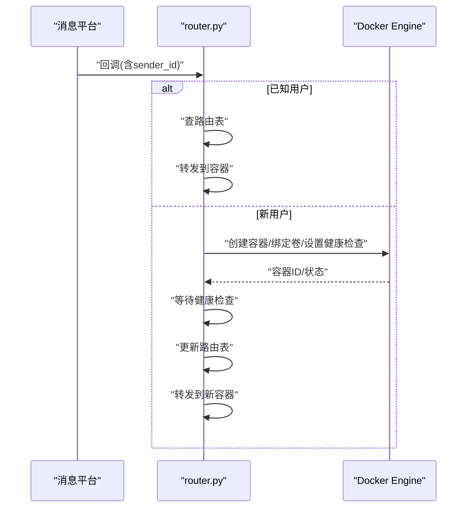

图表来源
- [router.py:141-250](file://router.py#L141-L250)
- [router.py:389-418](file://router.py#L389-L418)

章节来源
- [router.py:141-250](file://router.py#L141-L250)
- [router.py:389-418](file://router.py#L389-L418)

### 组件H：MCP 扩展与热重载（mcp_client.py）
- JSON-RPC：支持 stdio 与 HTTP 两种传输，握手、工具发现与调用均通过标准方法实现。
- 热重载：无需重启，重新读取配置、断开旧连接、建立新连接并注册工具。
- 自动重连：工具调用失败时尝试一次自动重连。

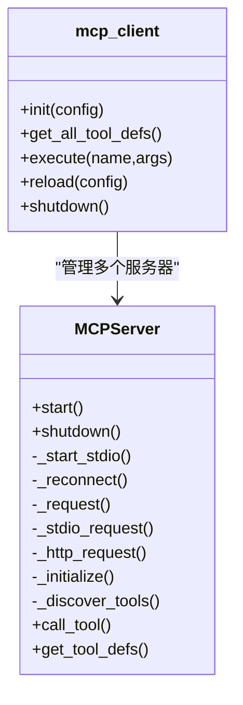

图表来源
- [mcp_client.py:27-334](file://mcp_client.py#L27-L334)

章节来源
- [mcp_client.py:27-334](file://mcp_client.py#L27-L334)

### 组件I：定时调度与自检（scheduler.py + self_check_tool.py）
- 定时任务：支持一次性延迟任务与周期性任务（cron），后台线程每 10 秒检查触发条件，触发后以工具循环方式处理消息并可通知用户。
- 自检报告：统计当日会话、消息数、工具调用次数、错误日志、服务运行时长、内存与磁盘占用、计划任务状态与记忆文件状态，形成可发送的报告。

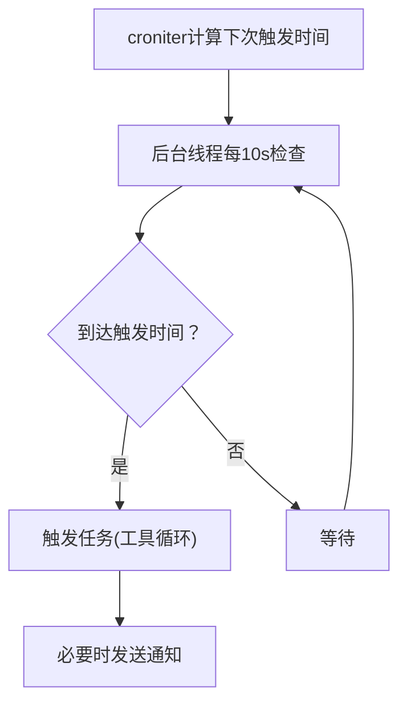

图表来源
- [scheduler.py:130-219](file://scheduler.py#L130-L219)
- [self_check_tool.py:18-31](file://self_check_tool.py#L18-L31)

章节来源
- [scheduler.py:130-219](file://scheduler.py#L130-L219)
- [self_check_tool.py:18-31](file://self_check_tool.py#L18-L31)

## 依赖分析
- 模块内聚与耦合
  - xiaowang.py 与 llm.py 通过会话键与工具循环紧密耦合，但消息输入与输出边界清晰。
  - tools.py 作为工具注册中心，与 llm.py 通过 OpenAI 兼容的函数调用格式交互，具备良好扩展性。
  - memory.py 与 llm.py 通过检索接口耦合，降低 LLM 对向量细节的依赖。
  - router.py 与 xiaowang.py 通过 HTTP 转发耦合，容器化隔离提升稳定性。
  - mcp_client.py 与 tools.py 通过命名空间工具名耦合，支持热重载。
- 外部依赖
  - LLM 与嵌入 API（OpenAI 兼容）、ASR WebSocket、视频生成 API、Docker Engine API、croniter、lancedb、websocket-client 等。

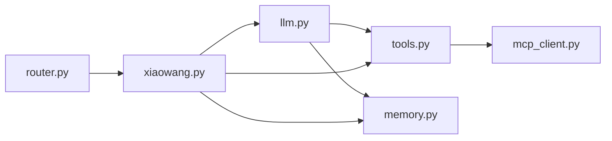

图表来源
- [xiaowang.py:59-76](file://xiaowang.py#L59-L76)
- [llm.py:17-39](file://llm.py#L17-L39)
- [tools.py:58-74](file://tools.py#L58-L74)
- [memory.py:40-86](file://memory.py#L40-L86)
- [router.py:45-63](file://router.py#L45-L63)
- [mcp_client.py:272-334](file://mcp_client.py#L272-L334)

章节来源
- [xiaowang.py:59-76](file://xiaowang.py#L59-L76)
- [llm.py:17-39](file://llm.py#L17-L39)
- [tools.py:58-74](file://tools.py#L58-L74)
- [memory.py:40-86](file://memory.py#L40-L86)
- [router.py:45-63](file://router.py#L45-L63)
- [mcp_client.py:272-334](file://mcp_client.py#L272-L334)

## 性能考虑
- 去抖与批处理：合理设置去抖窗口，减少不必要的工具循环与 LLM 调用。
- 会话截断与压缩：控制会话长度，避免历史消息过长导致上下文膨胀与成本上升。
- 历史消息清理：在保存前将多模态历史中的图片替换为文本标记，兼容部分 LLM 的限制。
- 视频处理：优先使用无重新编码的剪辑与音频混合，缩短处理时间；AI 视频生成采用异步轮询，避免阻塞主线程。
- 记忆检索：合理设置 Top-K 与相似度阈值，平衡召回质量与检索速度。
- 容器化隔离：按用户隔离可避免资源争用，提高整体吞吐。

## 故障排查指南
- 常见错误与定位
  - LLM 返回 400：检查会话文件是否以 tool 或 assistant+tool_calls 开头且存在匹配的 tool 结果，必要时清理或修复会话文件。
  - MCP 工具不可用：检查 MCP 服务器连接状态、进程存活与工具发现结果，必要时执行热重载。
  - ASR 失败：确认音频转码成功、WebSocket 鉴权参数正确、网络可达与超时设置合理。
  - 视频处理失败：检查 ffmpeg 可用性、输入路径与权限、输出目录容量。
- 自检与诊断
  - 使用自检工具生成当日统计与系统状态报告，辅助定位异常。
  - 使用诊断工具检查会话文件健康、MCP 连接状态与最近错误日志。

章节来源
- [tools.py:924-1020](file://tools.py#L924-L1020)
- [self_check_tool.py:18-31](file://self_check_tool.py#L18-L31)

## 结论
724 Office 多模态处理系统以简洁稳定的架构实现了从多模态输入到工具执行的全链路闭环，结合三层记忆与多租户容器化路由，具备良好的可扩展性与可维护性。通过 ASR、图像多模态输入、视频处理工具链与 MCP 扩展机制，系统能够覆盖办公场景中的多样化需求。建议在生产环境中关注会话截断策略、记忆检索阈值与视频处理的并发控制，以获得更优的性能与稳定性。

## 附录

### API 使用示例（路径参考）
- 发送图片
  - 工具定义：[tools.py:266-302](file://tools.py#L266-L302)
  - 调用方式：在工具循环中传入路径或 URL，系统自动上传并发送。
- 发送文件/视频/链接
  - 工具定义：[tools.py:275-302](file://tools.py#L275-L302)
- 视频处理
  - 裁剪：[tools.py:326-358](file://tools.py#L326-L358)
  - 加背景音乐：[tools.py:361-396](file://tools.py#L361-L396)
  - AI 视频生成：[tools.py:399-495](file://tools.py#L399-L495)
- 记忆检索
  - 关键词检索：[tools.py:766-801](file://tools.py#L766-L801)
  - 语义召回（recall）：[tools.py:804-814](file://tools.py#L804-L814)

章节来源
- [tools.py:266-302](file://tools.py#L266-L302)
- [tools.py:326-396](file://tools.py#L326-L396)
- [tools.py:399-495](file://tools.py#L399-L495)
- [tools.py:766-814](file://tools.py#L766-L814)

### 配置参数说明（config.example.json）
- 模型与提供商：默认模型、API 基础地址、密钥、最大 token 数等。
- 消息平台：token、GUID、API 地址。
- 作者 ID、工作区、端口、去抖窗口、记忆配置（启用开关、嵌入 API、Top-K、相似度阈值）。
- ASR：应用 ID、API Key、API Secret、WebSocket 地址。
- 视频生成：API 基础地址、密钥、模型名称。
- 搜索：Tavily 与通用搜索 API 密钥。
- MCP 服务器：传输方式（stdio/http）、命令与参数、环境变量。

章节来源
- [config.example.json:1-61](file://config.example.json#L1-L61)