# 媒体集成

<cite>
**本文档引用的文件**
- [README.md](file://README.md)
- [config.example.json](file://config.example.json)
- [llm.py](file://llm.py)
- [mcp_client.py](file://mcp_client.py)
- [memory.py](file://memory.py)
- [router.py](file://router.py)
- [scheduler.py](file://scheduler.py)
- [self_check_tool.py](file://self_check_tool.py)
- [tools.py](file://tools.py)
- [xiaowang.py](file://xiaowang.py)
</cite>

## 目录
1. [简介](#简介)
2. [项目结构](#项目结构)
3. [核心组件](#核心组件)
4. [架构概览](#架构概览)
5. [详细组件分析](#详细组件分析)
6. [依赖关系分析](#依赖关系分析)
7. [性能考虑](#性能考虑)
8. [故障排除指南](#故障排除指南)
9. [结论](#结论)
10. [附录](#附录)

## 简介

724 Office 是一个基于纯 Python 构建的生产级 AI 助手系统，专为多模态消息处理而设计。该系统支持文本、图像、语音、视频和文件的统一接收和处理，具备智能去抖动机制、媒体与 LLM 的深度集成以及高性能的并发处理能力。

本系统的核心特性包括：
- **零框架依赖**：完全基于标准库和少量小包（croniter、lancedb、websocket-client）
- **多模态处理**：支持图像、视频、文件、语音等多媒体内容
- **智能去抖动**：通过时间窗口合并连续消息，避免重复处理
- **LLM 集成**：支持视觉模型调用和多模态上下文构建
- **自修复机制**：每日自检、会话健康诊断、错误日志分析
- **多租户路由**：Docker 容器化自动部署，按用户隔离

## 项目结构

系统采用模块化设计，主要文件组织如下：

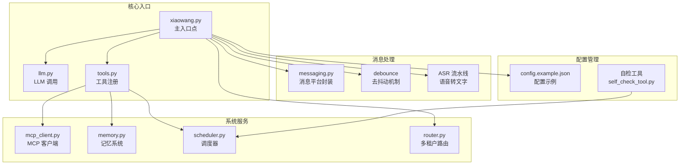

**图表来源**
- [xiaowang.py:1-626](file://xiaowang.py#L1-L626)
- [llm.py:1-401](file://llm.py#L1-L401)
- [tools.py:1-1153](file://tools.py#L1-L1153)

**章节来源**
- [README.md:1-162](file://README.md#L1-L162)
- [config.example.json:1-61](file://config.example.json#L1-L61)

## 核心组件

### 去抖动机制（Debounce）

系统实现了智能的消息去抖动机制，通过时间窗口合并连续消息：

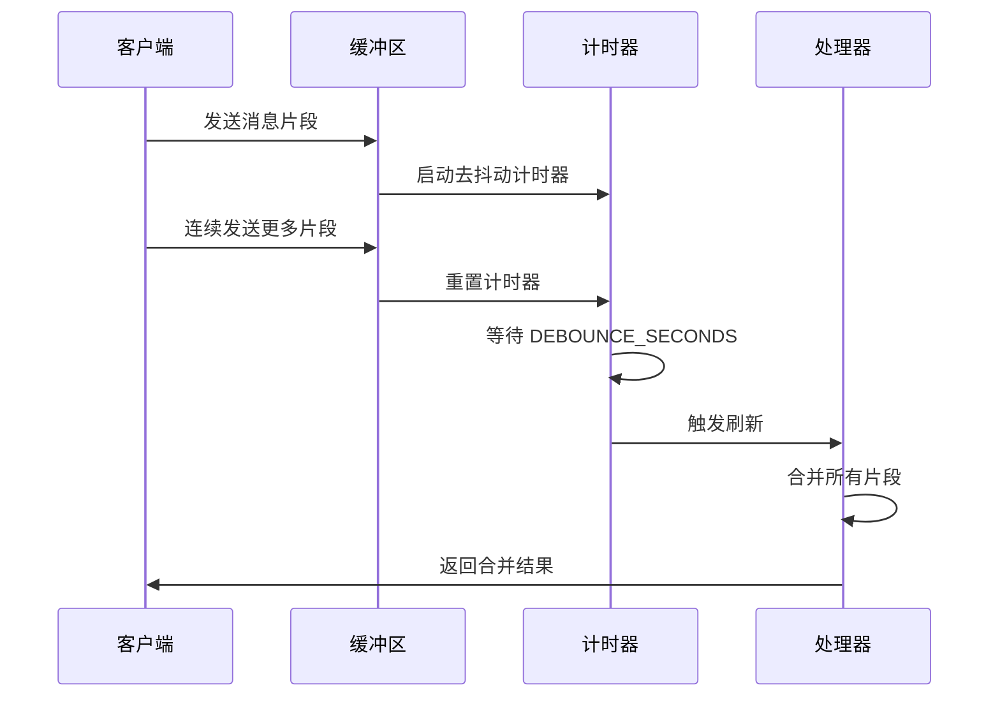

**图表来源**
- [xiaowang.py:316-378](file://xiaowang.py#L316-L378)

### 多模态消息处理

系统支持多种媒体类型的统一处理流程：

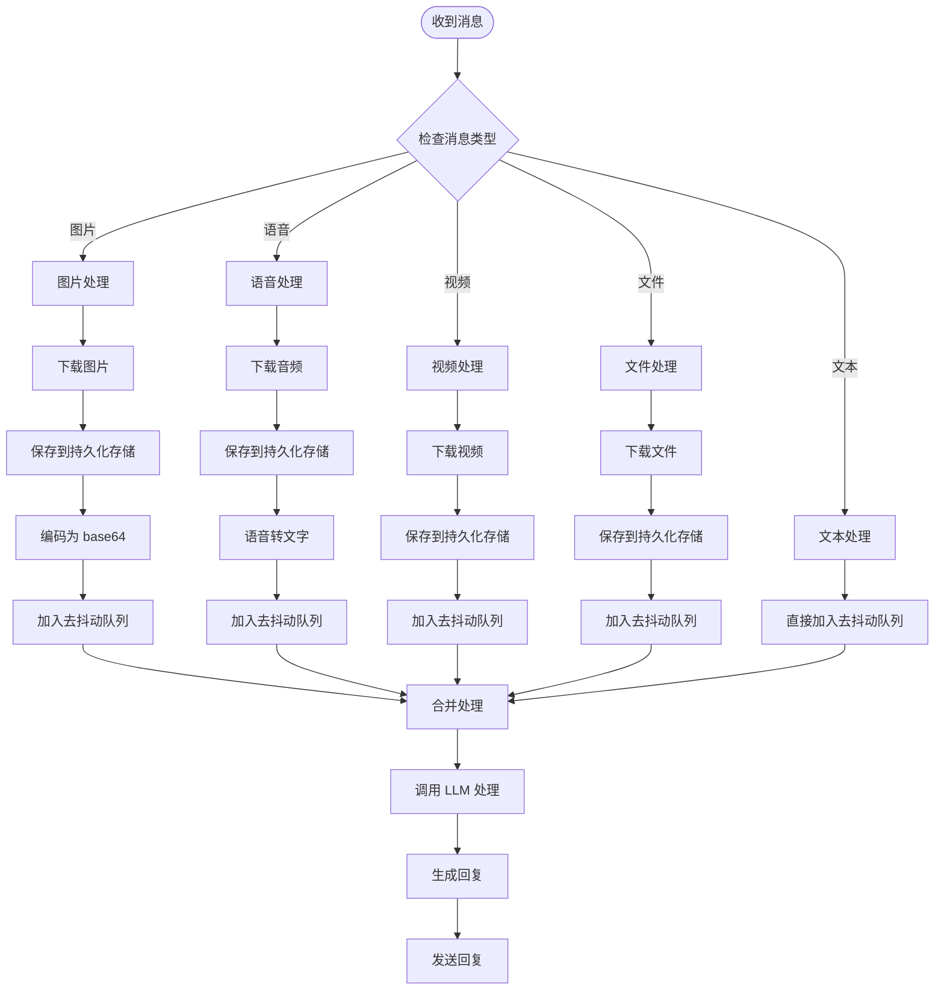

**图表来源**
- [xiaowang.py:383-487](file://xiaowang.py#L383-L487)

**章节来源**
- [xiaowang.py:311-378](file://xiaowang.py#L311-L378)
- [xiaowang.py:383-487](file://xiaowang.py#L383-L487)

## 架构概览

系统采用分层架构设计，确保各组件职责清晰且松耦合：

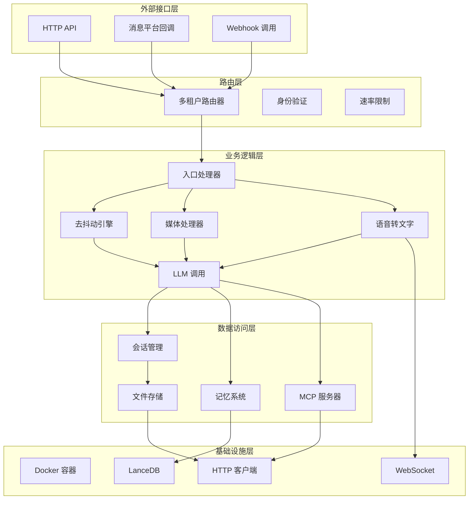

**图表来源**
- [router.py:1-493](file://router.py#L1-L493)
- [xiaowang.py:1-626](file://xiaowang.py#L1-L626)
- [llm.py:1-401](file://llm.py#L1-L401)

## 详细组件分析

### 去抖动引擎（Debounce Engine）

去抖动机制是系统处理高频消息的关键组件，通过时间窗口合并连续消息：

#### 数据结构设计

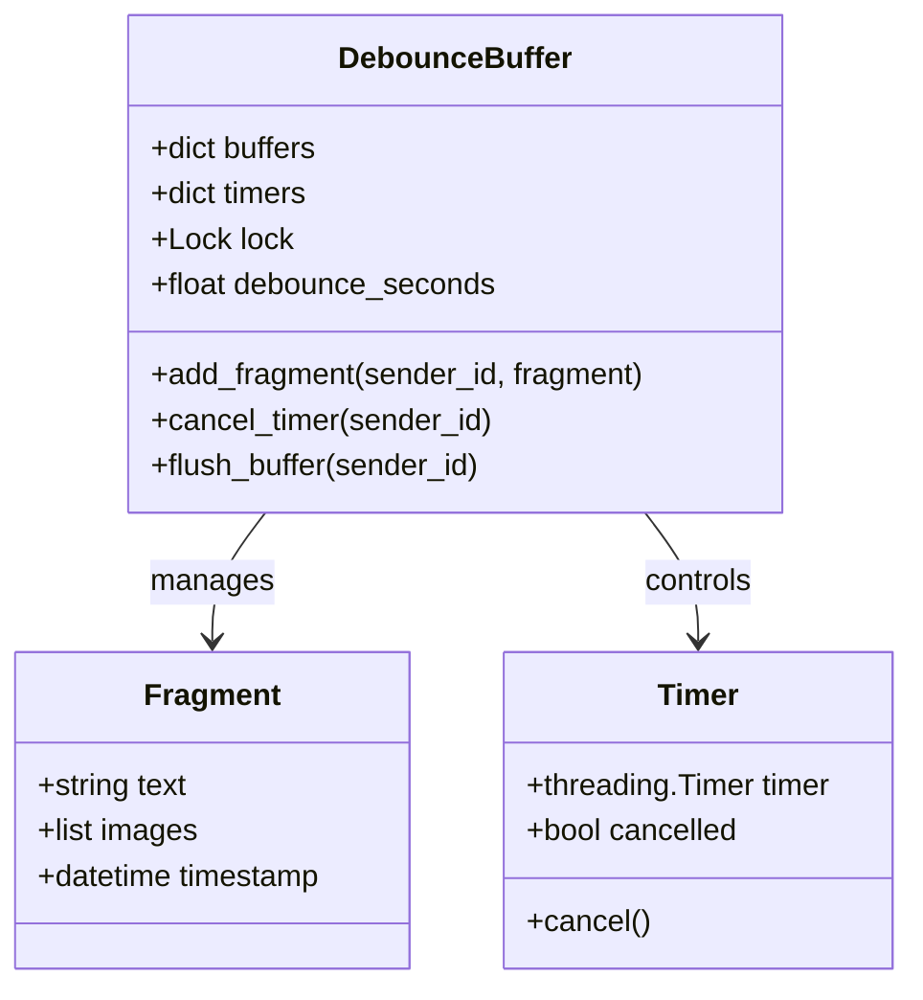

**图表来源**
- [xiaowang.py:311-378](file://xiaowang.py#L311-L378)

#### 合并策略

系统采用智能合并策略，根据消息类型和内容特征进行差异化处理：

| 消息类型 | 合并规则 | 图像处理 | 文本处理 |
|---------|---------|---------|---------|
| 文本消息 | 按时间窗口合并 | 不适用 | 连接换行符 |
| 图片消息 | 单独处理，不合并 | 收集所有图片 | 忽略文本部分 |
| 语音消息 | 转文字后按文本规则处理 | 不适用 | 合并转文字结果 |
| 视频消息 | 单独处理，不合并 | 不适用 | 忽略文本部分 |
| 文件消息 | 单独处理，不合并 | 不适用 | 忽略文本部分 |

**章节来源**
- [xiaowang.py:316-378](file://xiaowang.py#L316-L378)

### 媒体下载与存储

系统实现了多通道媒体下载机制，支持企业版和个人版格式：

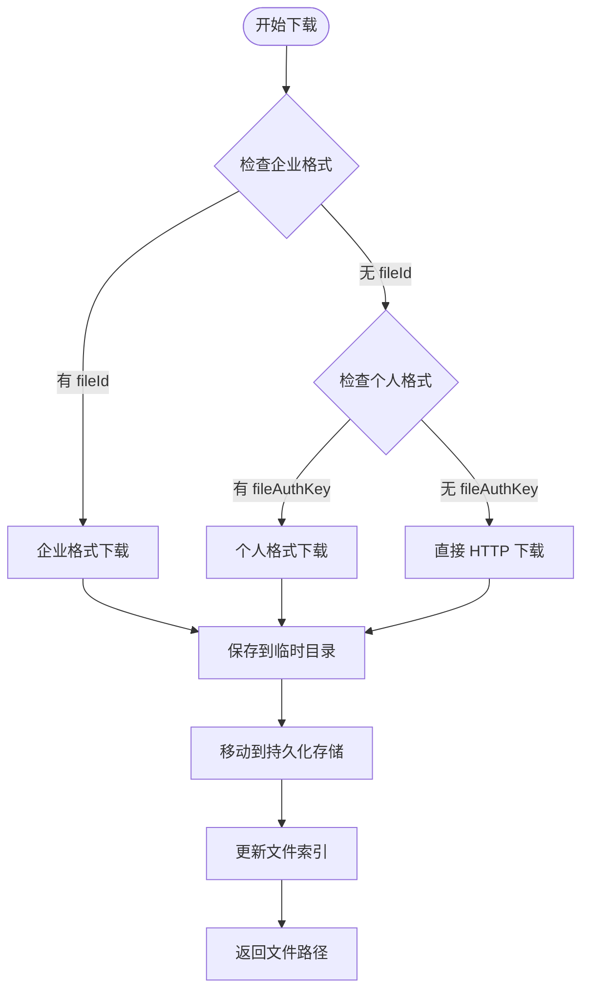

**图表来源**
- [xiaowang.py:383-432](file://xiaowang.py#L383-L432)

#### 存储策略

系统采用分层存储结构，确保媒体文件的有序管理和快速检索：

| 存储层级 | 目录结构 | 用途 | 特性 |
|---------|---------|------|------|
| 月级别 | `/files/2024-01/` | 按月份组织文件 | 自动清理旧文件 |
| 类型级别 | `/files/image/` | 按文件类型分类 | 支持快速过滤 |
| 时间戳级别 | `1704067200_filename.ext` | 精确时间定位 | 唯一标识符 |
| 索引文件 | `index.json` | 全局文件索引 | 支持查询和统计 |

**章节来源**
- [xiaowang.py:99-131](file://xiaowang.py#L99-L131)
- [xiaowang.py:383-432](file://xiaowang.py#L383-L432)

### 语音转文字（ASR）流水线

系统集成了 WebSocket 流式语音识别，支持多种音频格式：

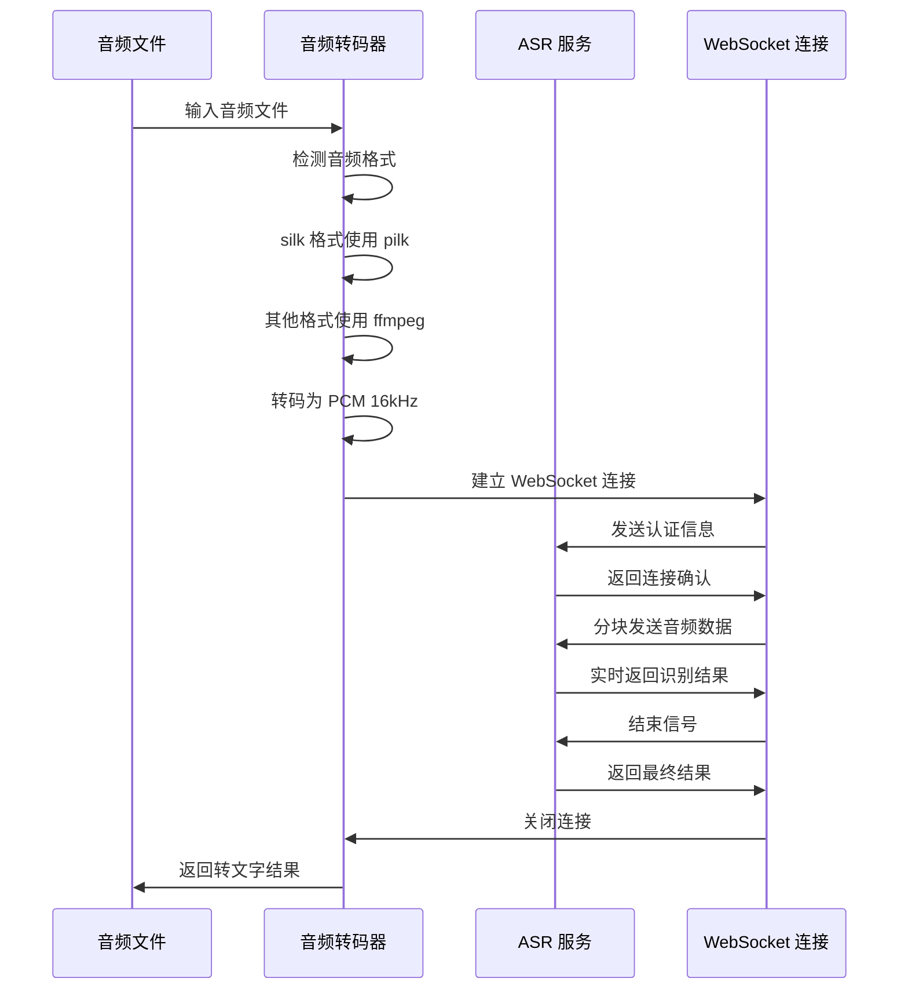

**图表来源**
- [xiaowang.py:140-284](file://xiaowang.py#L140-L284)

#### 音频格式支持

| 格式 | 编码器 | 采样率 | 通道数 | 特殊处理 |
|-----|-------|-------|-------|---------|
| silk | pilk | 16kHz | 单声道 | 专用解码器 |
| mp3 | ffmpeg | 16kHz | 单声道 | 音频转码 |
| wav | ffmpeg | 16kHz | 单声道 | 直接转码 |
| flac | ffmpeg | 16kHz | 单声道 | 音频转码 |
| 其他 | ffmpeg | 16kHz | 单声道 | 统一转码 |

**章节来源**
- [xiaowang.py:140-284](file://xiaowang.py#L140-L284)

### LLM 多模态集成

系统实现了完整的多模态 LLM 集成，支持图像、文本等多种输入格式：

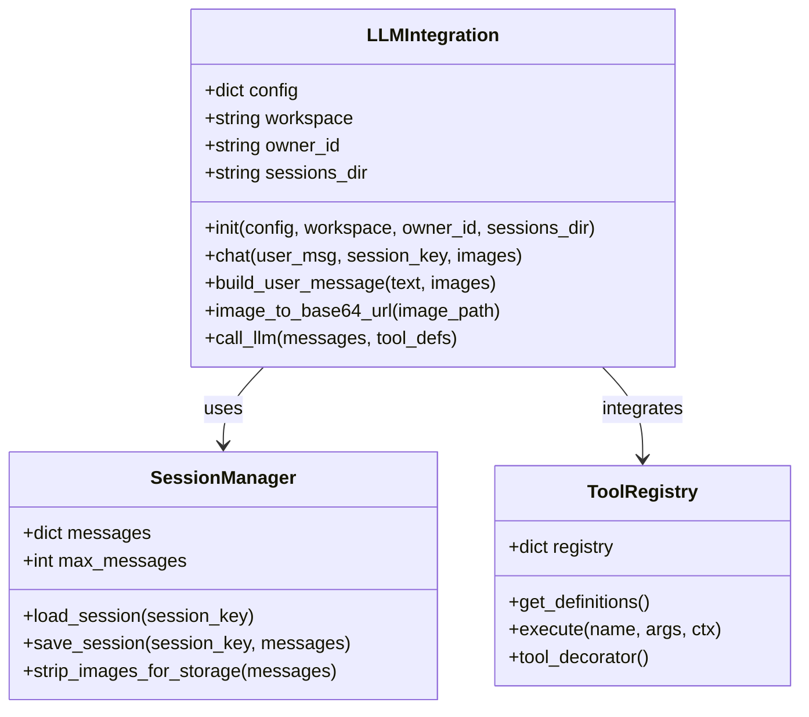

**图表来源**
- [llm.py:33-401](file://llm.py#L33-L401)

#### 多模态消息构建

系统将不同类型的媒体内容转换为 LLM 可理解的格式：

| 媒体类型 | LLM 格式 | 处理方式 | 示例 |
|---------|---------|---------|------|
| 文本 | 字符串 | 直接传递 | `"用户询问问题"` |
| 图片 | data URI | base64 编码 | `"data:image/jpeg;base64,/9j/4AAQSkZJ..."` |
| 视频 | 文件路径 | 路径引用 | `"/workspace/files/video_20240101_123456.mp4"` |
| 文件 | 文件路径 | 路径引用 | `"/workspace/files/doc_20240101_123456.pdf"` |
| 语音 | 文本 | ASR 结果 | `"用户说：你好"` |

**章节来源**
- [llm.py:204-224](file://llm.py#L204-L224)
- [llm.py:193-202](file://llm.py#L193-L202)

### 记忆系统集成

系统集成了三层记忆体系，支持多模态内容的记忆和检索：

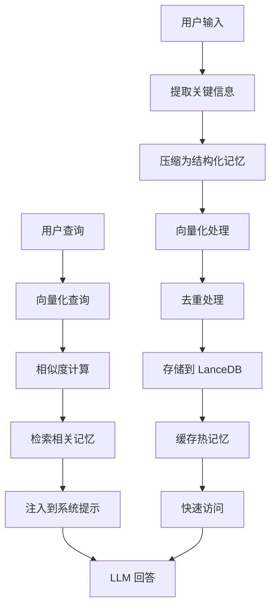

**图表来源**
- [memory.py:121-146](file://memory.py#L121-L146)
- [memory.py:294-361](file://memory.py#L294-L361)

**章节来源**
- [memory.py:121-146](file://memory.py#L121-L146)
- [memory.py:294-361](file://memory.py#L294-L361)

## 依赖关系分析

系统采用模块化设计，各组件间依赖关系清晰：

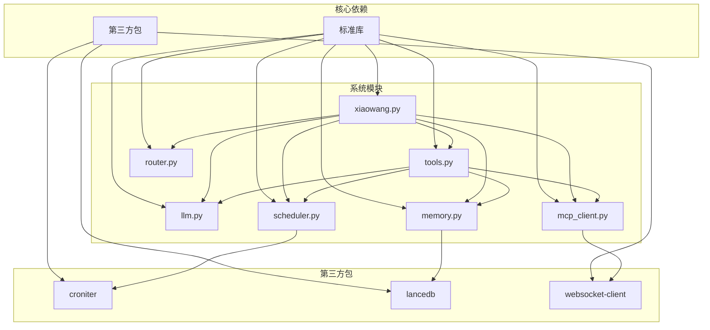

**图表来源**
- [README.md:3-8](file://README.md#L3-L8)
- [config.example.json:115-116](file://config.example.json#L115-L116)

**章节来源**
- [README.md:3-8](file://README.md#L3-L8)
- [config.example.json:115-116](file://config.example.json#L115-L116)

## 性能考虑

### 并发处理策略

系统采用多线程架构，确保高并发场景下的稳定性和响应性：

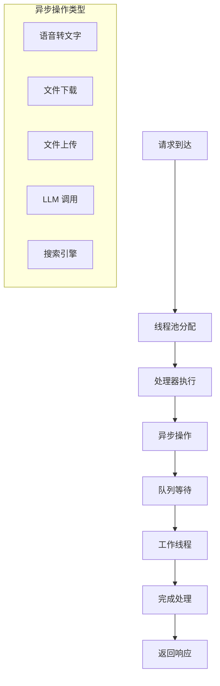

### 内存管理优化

系统实施了多项内存管理策略，确保在资源受限环境下的稳定运行：

| 优化策略 | 实现方式 | 效果 |
|---------|---------|------|
| 会话截断 | 最大保留 40 条消息 | 控制内存使用 |
| 异步压缩 | 后台线程压缩历史消息 | 减少主线程压力 |
| 文件索引 | JSON 索引文件 | 快速文件检索 |
| 缓存机制 | 热记忆缓存 | 减少数据库查询 |
| 连接池 | HTTP/WebSocket 连接复用 | 降低连接开销 |

### 资源控制

系统实现了多层次的资源控制机制：

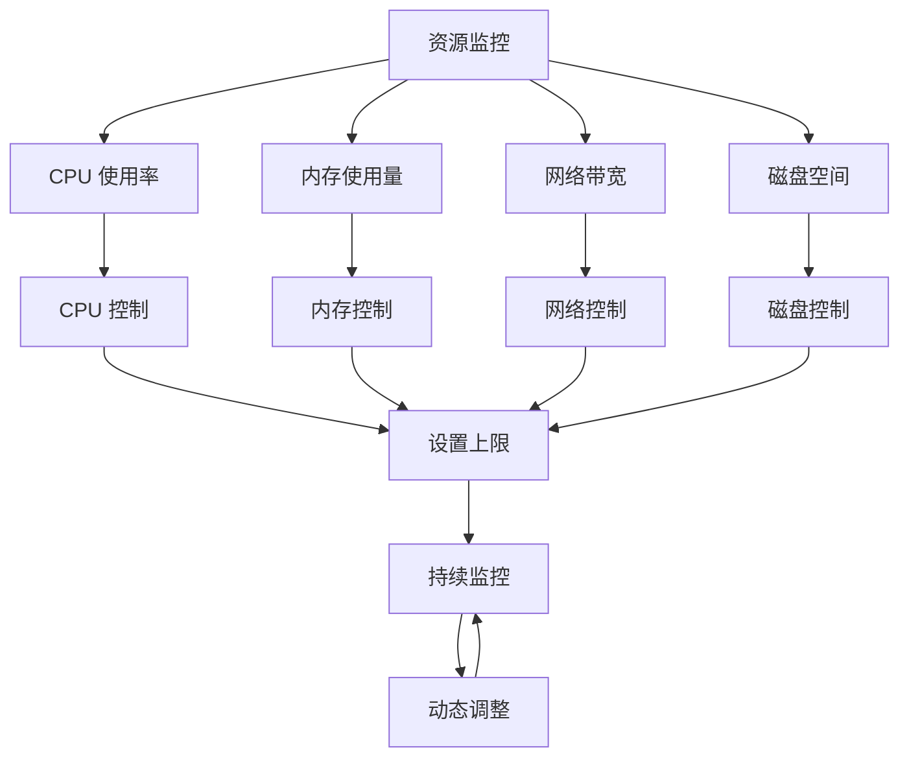

## 故障排除指南

### 常见问题诊断

#### 媒体下载失败

**症状**：用户发送的图片、视频或文件无法下载

**可能原因**：
1. 企业版格式缺少必要的加密密钥
2. 个人版格式缺少认证信息
3. 直接 HTTP 下载超时或失败

**解决方案**：
1. 检查 `fileId` 和 `fileAesKey` 是否存在
2. 验证 `fileAuthKey` 和 `fileUrl` 配置
3. 确认网络连接和防火墙设置

#### ASR 识别失败

**症状**：语音消息无法转文字

**可能原因**：
1. 音频格式不支持
2. WebSocket 连接失败
3. 语音质量过差

**解决方案**：
1. 确认音频格式是否为 silk 或标准格式
2. 检查 ASR 服务配置和网络连接
3. 提高录音质量或使用更清晰的音频

#### LLM 调用异常

**症状**：多模态消息处理失败

**可能原因**：
1. LLM API 密钥配置错误
2. 请求格式不符合要求
3. 网络连接不稳定

**解决方案**：
1. 验证 LLM 提供商配置
2. 检查消息格式是否包含正确的多模态元素
3. 确认网络连接稳定性

**章节来源**
- [xiaowang.py:431-432](file://xiaowang.py#L431-L432)
- [xiaowang.py:278-284](file://xiaowang.py#L278-L284)

### 日志分析

系统提供了详细的日志记录机制，便于问题诊断：

| 日志级别 | 用途 | 示例 |
|---------|------|------|
| DEBUG | 详细调试信息 | 媒体下载进度、ASR 识别状态 |
| INFO | 正常操作记录 | 用户交互、系统状态变化 |
| WARNING | 警告信息 | 配置问题、性能警告 |
| ERROR | 错误信息 | 处理失败、异常情况 |

## 结论

724 Office 的媒体集成功能展现了现代 AI 助手系统的设计理念和技术实现。通过智能去抖动机制、多模态消息处理、LLM 深度集成和高效性能优化，系统能够稳定处理各种复杂的媒体交互场景。

系统的主要优势包括：
- **统一处理架构**：支持文本、图像、语音、视频和文件的统一接收和处理
- **智能去抖动**：通过时间窗口合并连续消息，提升用户体验
- **深度 LLM 集成**：支持视觉模型调用和多模态上下文构建
- **高性能并发**：多线程架构确保高并发场景下的稳定性
- **资源优化**：内存管理和资源控制确保系统在低资源环境下运行

该系统为构建高效的多模态应用提供了完整的技术方案和最佳实践指导。

## 附录

### 配置参数详解

#### 基础配置

| 参数名 | 类型 | 默认值 | 描述 |
|-------|------|--------|------|
| `models.default` | string | `"deepseek-chat"` | 默认 LLM 提供商 |
| `messaging.token` | string | `""` | 消息平台访问令牌 |
| `messaging.guid` | string | `""` | 消息平台 GUID |
| `owner_ids` | array | `[]` | 系统所有者 ID 列表 |
| `workspace` | string | `"./workspace"` | 工作目录路径 |
| `port` | integer | `8080` | HTTP 服务端口 |
| `debounce_seconds` | float | `3.0` | 去抖动时间窗口（秒） |

#### 内存系统配置

| 参数名 | 类型 | 默认值 | 描述 |
|-------|------|--------|------|
| `memory.enabled` | boolean | `true` | 是否启用记忆系统 |
| `memory.embedding_api.api_base` | string | `"https://api.openai.com/v1"` | 嵌入 API 基础地址 |
| `memory.embedding_api.model` | string | `"text-embedding-3-small"` | 嵌入模型名称 |
| `memory.embedding_api.dimension` | integer | `1024` | 嵌入向量维度 |
| `memory.retrieve_top_k` | integer | `5` | 检索返回数量 |
| `memory.similarity_threshold` | float | `0.92` | 相似度阈值 |

#### ASR 配置

| 参数名 | 类型 | 默认值 | 描述 |
|-------|------|--------|------|
| `asr.app_id` | string | `""` | ASR 应用 ID |
| `asr.api_key` | string | `""` | ASR API 密钥 |
| `asr.api_secret` | string | `""` | ASR API 密钥 |
| `asr.ws_url` | string | `"wss://asr-api.example.com/v2/asr"` | ASR WebSocket 地址 |

### 最佳实践建议

1. **媒体文件管理**
   - 定期清理过期媒体文件，避免磁盘空间不足
   - 使用合适的文件命名规范，便于检索和管理
   - 实施文件大小限制，防止异常大的文件占用资源

2. **性能优化**
   - 根据硬件配置调整去抖动时间窗口
   - 监控内存使用情况，及时触发压缩机制
   - 优化 LLM 调用频率，避免过度请求

3. **安全考虑**
   - 验证所有外部输入，防止恶意文件上传
   - 实施访问控制，确保只有授权用户可以使用
   - 定期更新 API 密钥，防止泄露

4. **监控和维护**
   - 建立完善的日志监控系统
   - 设置性能指标告警
   - 定期备份重要数据和配置