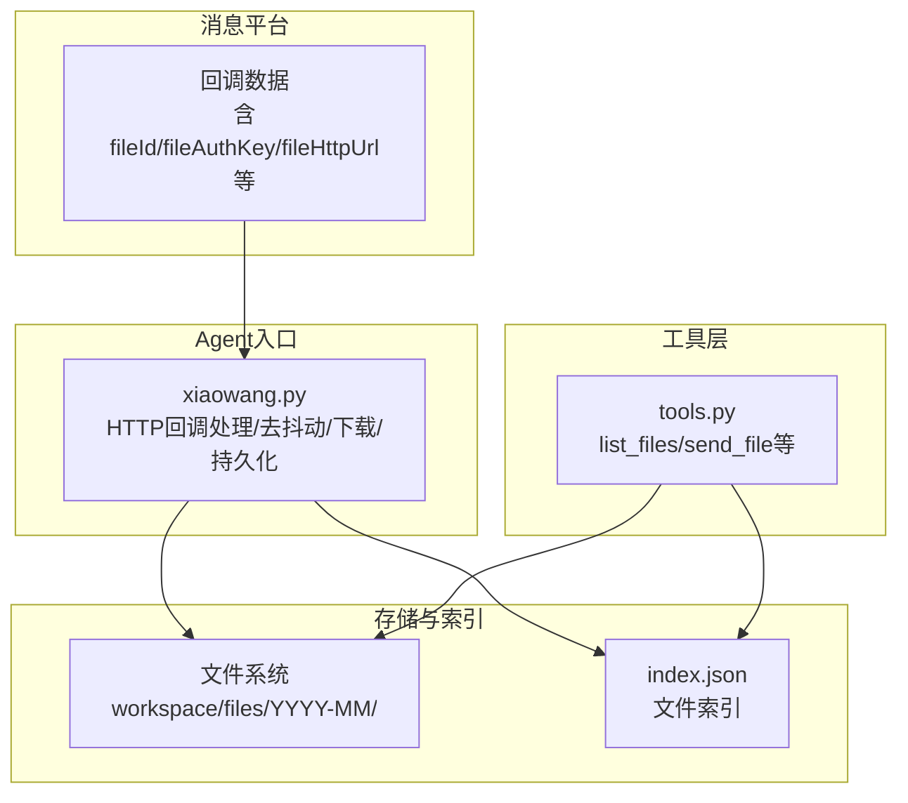
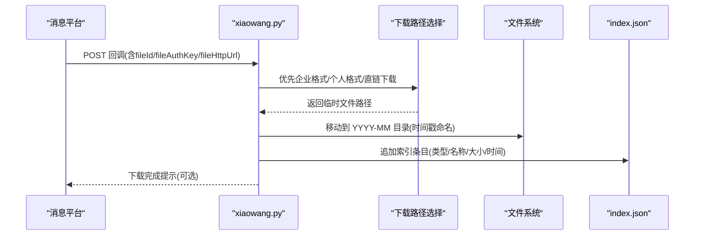
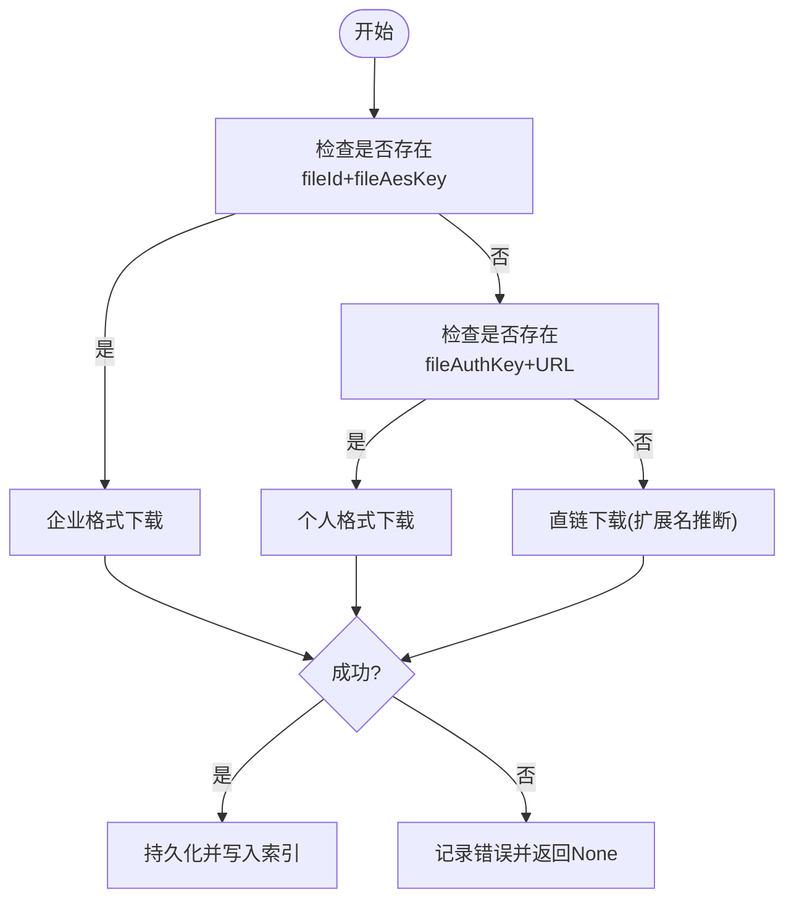
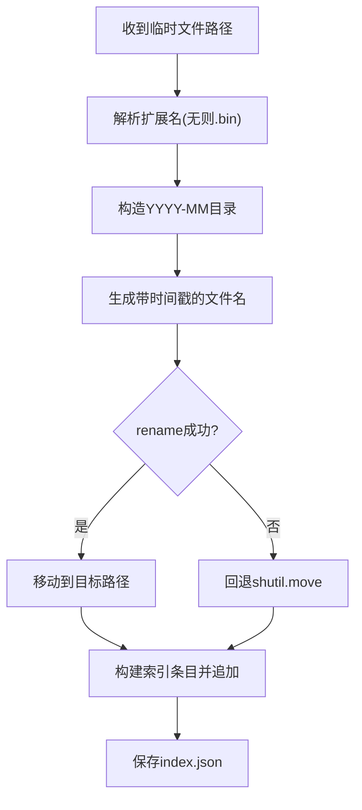
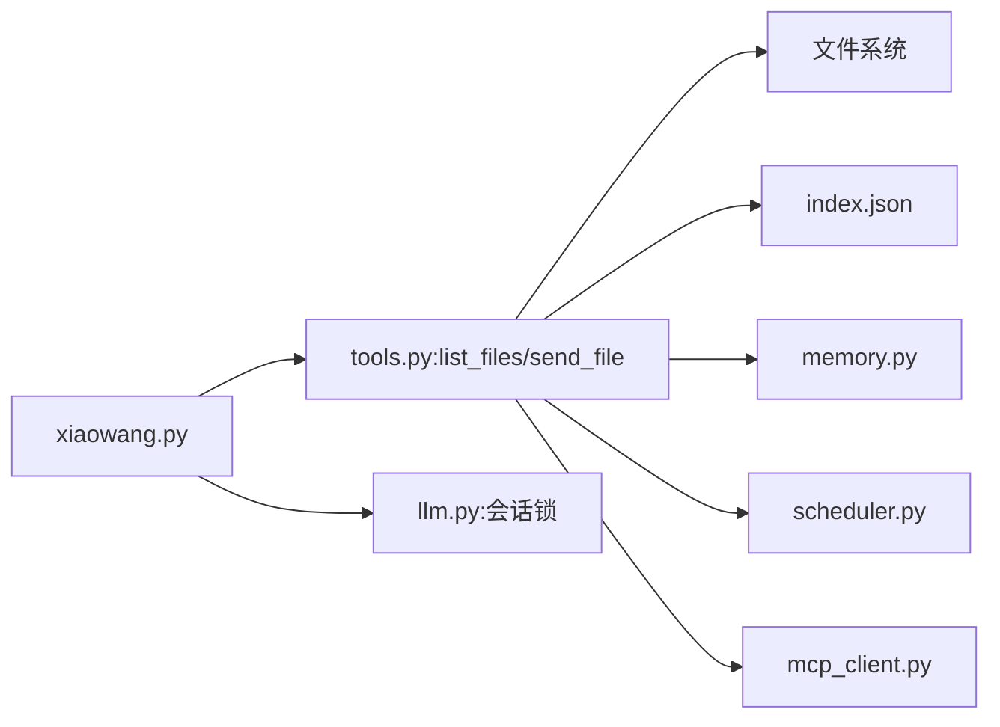

# 文件管理

<cite>
**本文引用的文件**
- [README.md](file://README.md)
- [config.example.json](file://config.example.json)
- [xiaowang.py](file://xiaowang.py)
- [tools.py](file://tools.py)
- [llm.py](file://llm.py)
- [memory.py](file://memory.py)
- [scheduler.py](file://scheduler.py)
- [router.py](file://router.py)
- [mcp_client.py](file://mcp_client.py)
- [self_check_tool.py](file://self_check_tool.py)
</cite>

## 目录
1. [简介](#简介)
2. [项目结构](#项目结构)
3. [核心组件](#核心组件)
4. [架构总览](#架构总览)
5. [详细组件分析](#详细组件分析)
6. [依赖关系分析](#依赖关系分析)
7. [性能考量](#性能考量)
8. [故障排查指南](#故障排查指南)
9. [结论](#结论)
10. [附录](#附录)

## 简介
本文件聚焦于724 Office中的“文件管理”能力，围绕以下目标展开：
- 文件下载机制：企业格式、个人格式与直接下载三条路径的优先级与实现逻辑
- 文件持久化存储策略：时间戳命名、按月分目录、文件索引管理
- 文件类型推断：媒体类型识别、扩展名获取、文件大小处理
- 线程安全与异常处理：并发控制、锁机制、错误恢复
- API使用示例、配置参数与性能优化建议

该系统通过回调入口接收消息平台的多媒体内容，统一进行下载、持久化与索引维护，并支持后续工具调用查询与发送。

## 项目结构
与文件管理相关的关键模块与职责如下：
- 入口与回调：xiaowang.py 提供HTTP服务与消息回调处理，负责下载触发、持久化与索引更新
- 工具注册与查询：tools.py 提供 list_files 等工具，用于列出已接收与保存的文件
- 会话与线程模型：llm.py 使用会话锁保证同一会话串行执行；xiaowang.py 使用去抖动缓冲与定时器合并消息
- 存储与索引：xiaowang.py 维护文件索引文件 index.json，按月目录组织文件
- 多媒体发送：tools.py 中 send_file 等工具通过 messaging 模块上传并发送文件

图示来源
- [xiaowang.py:383-433](file://xiaowang.py#L383-L433)
- [xiaowang.py:99-131](file://xiaowang.py#L99-L131)
- [tools.py:205-236](file://tools.py#L205-L236)

章节来源
- [README.md:1-162](file://README.md#L1-L162)
- [config.example.json:1-61](file://config.example.json#L1-L61)
- [xiaowang.py:35-76](file://xiaowang.py#L35-L76)
- [tools.py:148-302](file://tools.py#L148-L302)

## 核心组件
- 下载与类型推断：根据回调字段优先尝试企业格式下载，其次个人格式，最后直链下载；同时基于媒体类型映射推断文件类型
- 持久化与索引：以时间戳为前缀生成稳定文件名，按年-月创建子目录；写入索引条目包含路径、类型、名称、大小、时间
- 查询与发送：list_files 支持按类型过滤与限制数量；send_file 基于 messaging 上传并发送

章节来源
- [xiaowang.py:383-433](file://xiaowang.py#L383-L433)
- [xiaowang.py:99-131](file://xiaowang.py#L99-L131)
- [tools.py:205-236](file://tools.py#L205-L236)
- [tools.py:275-281](file://tools.py#L275-L281)

## 架构总览
文件管理在系统中的位置与交互如下：

图示来源
- [xiaowang.py:383-433](file://xiaowang.py#L383-L433)
- [xiaowang.py:99-131](file://xiaowang.py#L99-L131)

## 详细组件分析

### 文件下载机制（企业/个人/直链）
- 优先级顺序
  1) 企业格式：存在 fileId 且 fileAesKey 时，调用企业下载接口
  2) 个人格式：存在 fileAuthKey 且对应 URL 时，调用个人下载接口
  3) 直链下载：若上述失败，使用 fileHttpUrl 或 fileUrl 进行 HTTP 直接下载
- 类型推断
  - 基于 media_type 推断 file_type（image/GIF→1，video→4，voice/file→5）
  - 直链下载时通过 get_ext 获取扩展名，否则回退为 .bin
- 异常处理
  - 任一路径失败均记录日志并继续尝试下一条路径
  - 所有路径失败则返回 None，上层根据结果决定是否通知用户

图示来源
- [xiaowang.py:383-433](file://xiaowang.py#L383-L433)

章节来源
- [xiaowang.py:383-433](file://xiaowang.py#L383-L433)

### 文件持久化存储策略
- 目录组织
  - 按年-月创建子目录：workspace/files/YYYY-MM/
  - 避免跨盘移动失败，先尝试 os.rename，失败则回退到 shutil.move
- 命名规则
  - 文件名为 unix 时间戳 + 原始文件名（若提供）或 unix 时间戳 + 扩展名
  - 原始文件名中斜杠替换为下划线，确保安全
- 索引管理
  - 索引文件：workspace/files/index.json
  - 写入字段：path、type、filename、size、time
  - 读取失败时初始化为空数组；写入采用直接覆盖

图示来源
- [xiaowang.py:99-131](file://xiaowang.py#L99-L131)

章节来源
- [xiaowang.py:99-131](file://xiaowang.py#L99-L131)

### 文件类型推断与大小处理
- 类型推断
  - 通过 media_type 映射到 file_type（image/GIF→1，video→4，voice/file→5）
  - 直链下载时通过 get_ext 获取扩展名，用于后续命名与类型标注
- 大小处理
  - 持久化后立即读取真实文件大小，写入索引
  - 查询工具在展示时将字节转换为 KB/MB 并保留合适精度

章节来源
- [xiaowang.py:383-433](file://xiaowang.py#L383-L433)
- [tools.py:205-236](file://tools.py#L205-L236)

### 线程安全与异常处理
- 去抖动与并发
  - xiaowang.py 使用 _debounce_buffers 与 _debounce_timers 合并短时间内的多条消息，避免重复触发
  - flush 时串行处理，确保同一 sender_id 的消息有序进入 LLM 循环
- 会话锁
  - llm.py 对每个 session_key 维护独立锁，保证同一会话内工具循环串行执行
- 锁与保护
  - mcp_client.py 在 stdio 通信时使用线程锁保护读写，避免竞争
  - 路由器 router.py 在容器编排与路由表更新时使用 _routing_lock 与 _provision_lock
- 异常处理
  - 下载失败时记录错误并继续尝试其他路径
  - 索引读取失败时初始化空列表，避免中断流程
  - 发送工具对失败场景返回明确错误信息，便于上层提示

章节来源
- [xiaowang.py:311-378](file://xiaowang.py#L311-L378)
- [llm.py:306-322](file://llm.py#L306-L322)
- [mcp_client.py:35-90](file://mcp_client.py#L35-L90)
- [router.py:34-36](file://router.py#L34-L36)

### API使用示例与配置参数
- 列出文件（list_files）
  - 请求参数：type（可选，image/video/file/voice/gif/all）、limit（默认20）
  - 返回：索引中最近若干条记录，包含类型、名称、大小、时间与路径
- 发送文件（send_file）
  - 请求参数：path（本地路径或HTTP URL）、caption（可选）
  - 行为：内部调用 messaging 上传并发送
- 配置项
  - workspace：工作区根目录，文件存储在 workspace/files 下
  - port/debounce_seconds：HTTP端口与去抖动间隔
  - asr：语音转文字配置（非必需）

章节来源
- [tools.py:205-236](file://tools.py#L205-L236)
- [tools.py:275-281](file://tools.py#L275-L281)
- [config.example.json:24-27](file://config.example.json#L24-L27)
- [config.example.json:29-37](file://config.example.json#L29-L37)

## 依赖关系分析
- xiaowang.py 依赖 tools 的 list_files 工具进行文件查询
- tools 的 send_file 倚赖 messaging 模块上传与发送
- llm.py 的会话锁与线程模型影响工具调用的并发行为
- memory/scheduler/router/mcp_client 为系统其他能力提供支撑，间接影响文件管理的运行环境

图示来源
- [xiaowang.py:35-76](file://xiaowang.py#L35-L76)
- [tools.py:148-302](file://tools.py#L148-L302)
- [memory.py:40-86](file://memory.py#L40-L86)
- [scheduler.py:30-43](file://scheduler.py#L30-L43)
- [mcp_client.py:272-333](file://mcp_client.py#L272-L333)

章节来源
- [xiaowang.py:35-76](file://xiaowang.py#L35-L76)
- [tools.py:148-302](file://tools.py#L148-L302)

## 性能考量
- 去抖动：减少高频消息触发工具循环次数，降低 LLM 调用压力
- 直链下载：在可用时避免额外平台 API 调用，缩短端到端延迟
- 索引读写：采用简单 JSON 追加与覆盖写，避免复杂事务开销
- 并发控制：会话锁与去抖动锁避免竞态，提升稳定性
- I/O 优化：rename 优先，失败回退 move，减少跨盘复制成本

## 故障排查指南
- 下载失败
  - 检查回调字段是否包含 fileId/fileAesKey/fileAuthKey/fileHttpUrl
  - 查看日志中各路径尝试记录，定位具体失败点
- 持久化失败
  - 确认 workspace/files 可写，磁盘空间充足
  - 若 rename 失败，确认 tmp 与目标在同一文件系统
- 索引异常
  - index.json 读取失败会自动初始化为空列表，不影响继续写入
  - 如需修复，可删除损坏文件后重启服务，系统会重新写入
- 查询无结果
  - 使用 list_files 的 type 与 limit 参数缩小范围
  - 确认文件确实在对应 YYYY-MM 目录下

章节来源
- [xiaowang.py:84-96](file://xiaowang.py#L84-L96)
- [tools.py:205-236](file://tools.py#L205-L236)

## 结论
724 Office 的文件管理以简洁可靠为核心设计：优先企业/个人格式下载，回退直链；以时间戳命名与按月分目录组织，配合轻量索引实现高效检索；通过去抖动、会话锁与多处异常处理保障并发安全与稳定性。开发者可在不引入外部框架的前提下，快速扩展文件处理能力（如新增类型、自定义命名规则、索引字段扩展等）。

## 附录
- 关键路径
  - 下载与类型推断：[xiaowang.py:383-433](file://xiaowang.py#L383-L433)
  - 持久化与索引：[xiaowang.py:99-131](file://xiaowang.py#L99-L131)
  - 文件查询：[tools.py:205-236](file://tools.py#L205-L236)
  - 文件发送：[tools.py:275-281](file://tools.py#L275-L281)
- 相关配置
  - workspace/port/debounce_seconds/asr：[config.example.json:24-27](file://config.example.json#L24-L27)、[config.example.json:29-37](file://config.example.json#L29-L37)