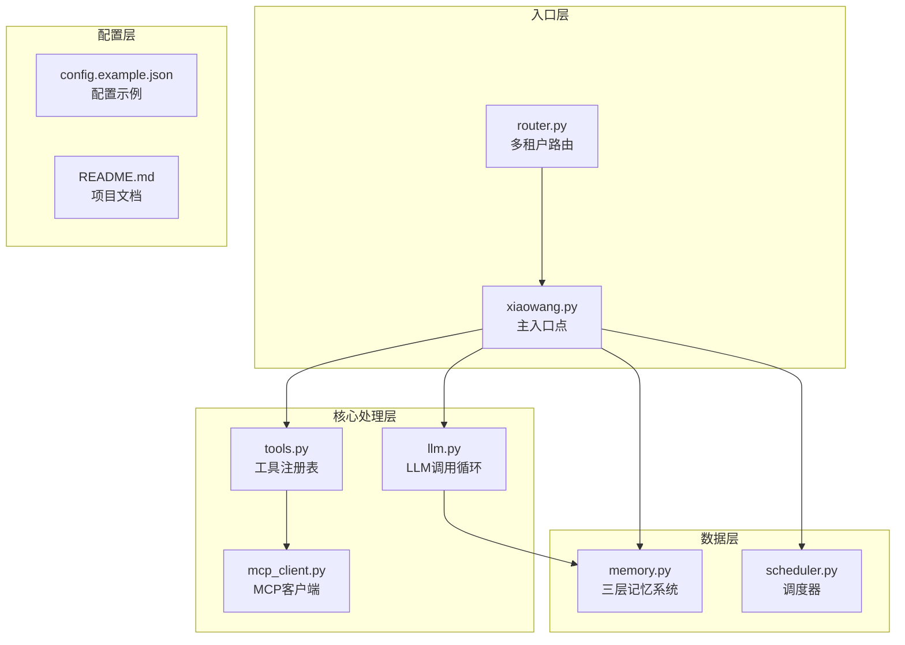
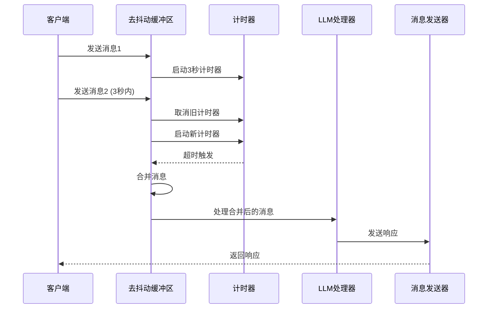
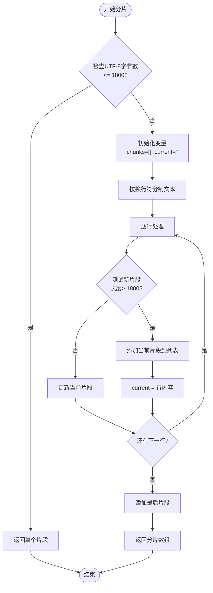
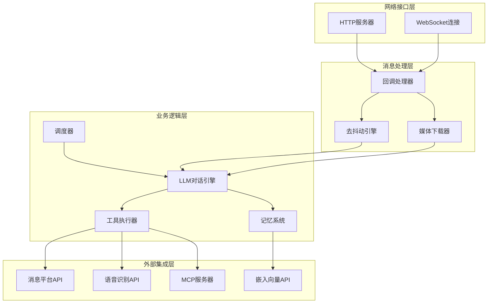
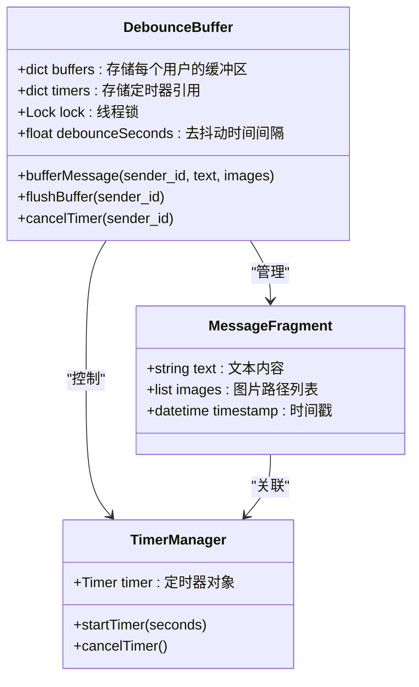
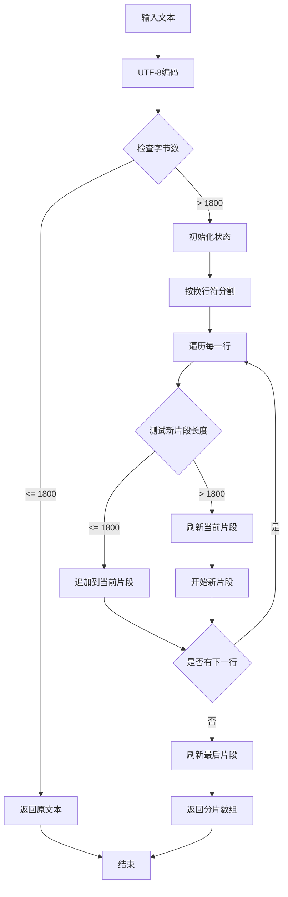
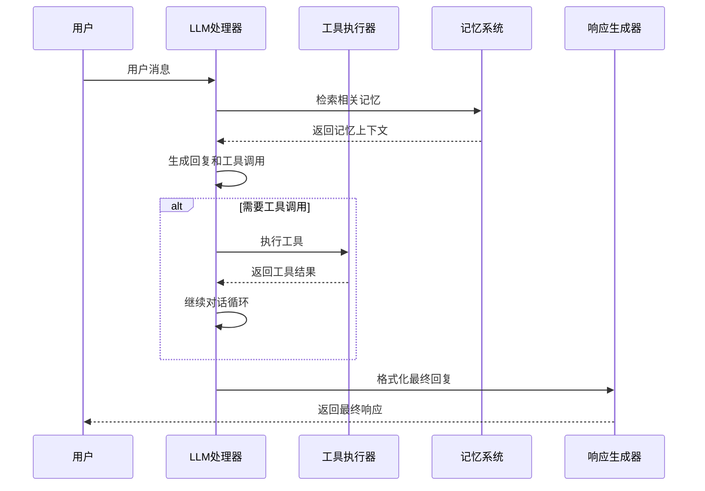
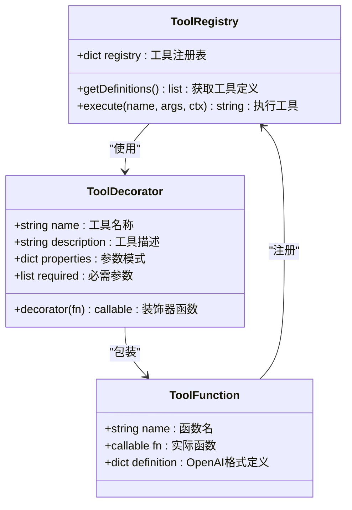
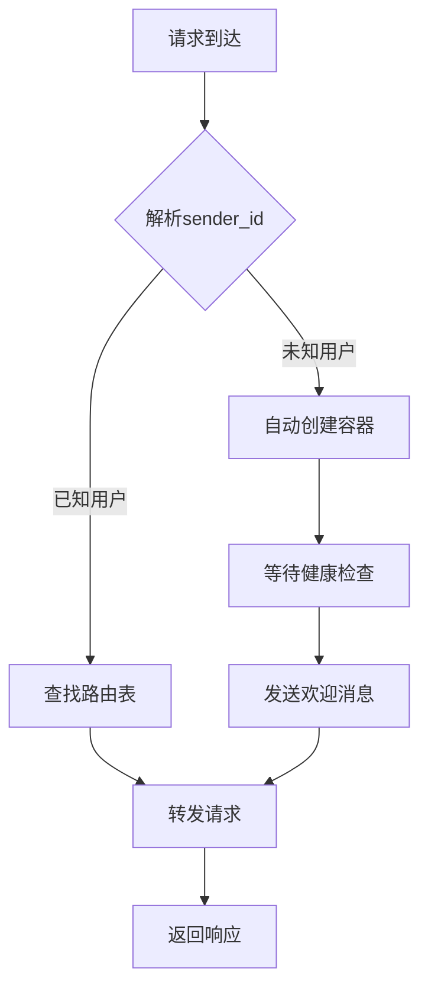
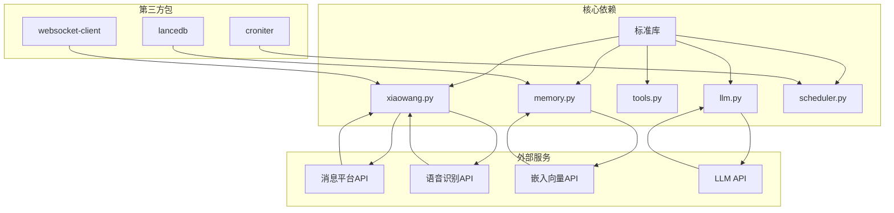

# 文本处理

<cite>
**本文档引用的文件**
- [README.md](file://README.md)
- [config.example.json](file://config.example.json)
- [xiaowang.py](file://xiaowang.py)
- [llm.py](file://llm.py)
- [tools.py](file://tools.py)
- [router.py](file://router.py)
- [memory.py](file://memory.py)
- [scheduler.py](file://scheduler.py)
- [mcp_client.py](file://mcp_client.py)
- [self_check_tool.py](file://self_check_tool.py)
</cite>

## 目录
1. [简介](#简介)
2. [项目结构](#项目结构)
3. [核心组件](#核心组件)
4. [架构概览](#架构概览)
5. [详细组件分析](#详细组件分析)
6. [依赖关系分析](#依赖关系分析)
7. [性能考虑](#性能考虑)
8. [故障排除指南](#故障排除指南)
9. [结论](#结论)

## 简介

724 Office 是一个基于纯Python构建的AI智能体系统，专为24/7运行而设计。该系统实现了完整的文本处理功能，包括消息去抖动、文本分片、多媒体处理和响应发送等核心能力。

系统的核心特性包括：
- **零框架依赖**：完全使用标准库和少量小包
- **多租户路由**：支持多个用户的独立容器实例
- **文本去抖动机制**：智能合并连续的消息输入
- **文本分片功能**：自动处理长文本的UTF-8编码分段
- **多媒体处理**：支持图片、视频、语音、文件等多种媒体类型
- **内存系统**：三层记忆架构（短期、长期、检索）

## 项目结构

系统采用模块化设计，每个文件负责特定的功能领域：

**图表来源**
- [xiaowang.py:1-626](file://xiaowang.py#L1-L626)
- [router.py:1-493](file://router.py#L1-L493)
- [llm.py:1-401](file://llm.py#L1-L401)
- [tools.py:1-800](file://tools.py#L1-L800)

**章节来源**
- [README.md:1-162](file://README.md#L1-L162)
- [config.example.json:1-61](file://config.example.json#L1-L61)

## 核心组件

### 文本去抖动机制

系统实现了智能的消息去抖动功能，通过时间窗口聚合连续的消息输入：

**图表来源**
- [xiaowang.py:316-378](file://xiaowang.py#L316-L378)

### 文本分片功能

系统支持UTF-8编码的智能文本分片，确保消息长度不超过平台限制：

**图表来源**
- [xiaowang.py:291-305](file://xiaowang.py#L291-L305)
- [tools.py:91-105](file://tools.py#L91-L105)

### 多媒体消息处理

系统支持多种媒体类型的智能处理：

| 媒体类型 | 类型码 | 处理流程 |
|---------|--------|----------|
| 普通文本 | 0 | 直接文本处理 |
| 图片 | 7, 14, 101 | 下载 → 编码 → 保存 → 视觉分析 |
| 视频 | 22, 23, 103 | 下载 → 保存 → 视频处理 |
| 文件 | 15, 20, 102 | 下载 → 保存 → 文件操作 |
| GIF | 29, 104 | 下载 → 保存 → 图像处理 |
| 语音 | 16 | 下载 → ASR转文本 → 文本处理 |
| 链接分享 | 13 | 提取标题和URL → 文本处理 |
| 位置信息 | 6 | 提取标签和地址 → 文本处理 |

**章节来源**
- [xiaowang.py:489-554](file://xiaowang.py#L489-L554)
- [xiaowang.py:383-465](file://xiaowang.py#L383-L465)

## 架构概览

系统采用分层架构设计，确保各组件职责清晰且松耦合：

**图表来源**
- [xiaowang.py:559-592](file://xiaowang.py#L559-L592)
- [llm.py:317-401](file://llm.py#L317-L401)
- [tools.py:134-146](file://tools.py#L134-L146)

## 详细组件分析

### 去抖动缓冲区管理

去抖动机制通过线程安全的数据结构实现：

**图表来源**
- [xiaowang.py:311-378](file://xiaowang.py#L311-L378)

### 文本分片算法实现

分片算法确保UTF-8编码的正确性和完整性：

**图表来源**
- [tools.py:91-105](file://tools.py#L91-L105)

### LLM对话循环

系统实现了强大的工具使用循环，支持多轮对话和工具调用：

**图表来源**
- [llm.py:317-401](file://llm.py#L317-L401)

**章节来源**
- [llm.py:306-401](file://llm.py#L306-L401)

### 工具系统架构

工具系统提供了灵活的扩展机制：

**图表来源**
- [tools.py:36-74](file://tools.py#L36-L74)

**章节来源**
- [tools.py:1-800](file://tools.py#L1-L800)

### 多租户路由系统

系统支持多用户的独立容器实例：

**图表来源**
- [router.py:397-418](file://router.py#L397-L418)

**章节来源**
- [router.py:1-493](file://router.py#L1-L493)

## 依赖关系分析

系统采用松耦合的设计，主要依赖关系如下：

**图表来源**
- [README.md:10-22](file://README.md#L10-L22)
- [config.example.json:14-18](file://config.example.json#L14-L18)

**章节来源**
- [README.md:101-138](file://README.md#L101-L138)

## 性能考虑

### 内存优化策略

1. **会话截断**：最多保留40条消息，超出部分自动压缩到长期记忆
2. **图像内容清理**：保存会话时将图像URL替换为标记，减少存储空间
3. **异步内存压缩**：后台线程处理压缩任务，不影响主线程性能

### 并发处理

1. **线程安全**：使用锁保护共享资源，避免竞态条件
2. **异步I/O**：网络请求使用非阻塞方式，提高吞吐量
3. **容器化隔离**：每个用户独立容器，避免资源争用

### 缓存机制

1. **零延迟缓存**：硬件/语音通道使用预计算的记忆摘要
2. **响应缓存**：最近的计划任务输出注入系统提示词中
3. **容器健康检查**：自动监控和重启异常容器

## 故障排除指南

### 常见问题及解决方案

| 问题类型 | 症状 | 解决方案 |
|---------|------|----------|
| 去抖动失效 | 消息频繁触发 | 检查debounce_seconds配置，调整为合适值 |
| 文本分片错误 | 长文本截断 | 验证UTF-8编码，检查最大字节数设置 |
| 媒体下载失败 | 文件无法保存 | 检查网络连接和存储权限 |
| LLM调用超时 | 对话无响应 | 增加超时时间，检查API密钥有效性 |
| 容器启动失败 | 用户无法访问 | 检查Docker配置和资源限制 |

### 调试技巧

1. **启用详细日志**：查看`/var/log/agent.log`获取详细错误信息
2. **监控系统指标**：使用`/health`端点检查系统状态
3. **测试工具链**：使用`/test`端点验证LLM连接
4. **内存使用分析**：定期检查内存占用情况

**章节来源**
- [xiaowang.py:597-626](file://xiaowang.py#L597-L626)

## 结论

724 Office文本处理系统展现了优秀的工程实践，通过以下关键特性实现了高效可靠的文本处理：

1. **智能化的消息去抖动**：通过时间窗口聚合连续输入，显著减少重复处理
2. **精确的文本分片算法**：确保UTF-8编码的完整性和平台兼容性
3. **多模态消息处理**：统一处理文本、图片、视频、语音等多种媒体类型
4. **可扩展的工具系统**：支持动态加载和热重载自定义工具
5. **健壮的多租户架构**：每个用户独立容器，确保资源隔离和稳定性

系统的设计充分体现了"零框架依赖"的理念，所有代码都可调试和修改，为生产环境提供了可靠的技术基础。通过合理的配置和监控，系统能够稳定运行在24/7环境中，为用户提供持续的智能服务。