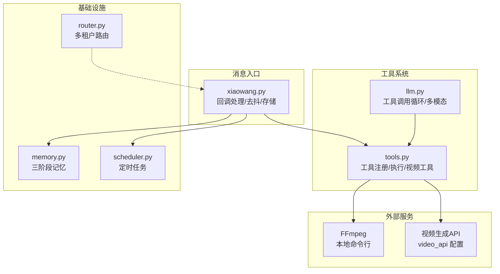
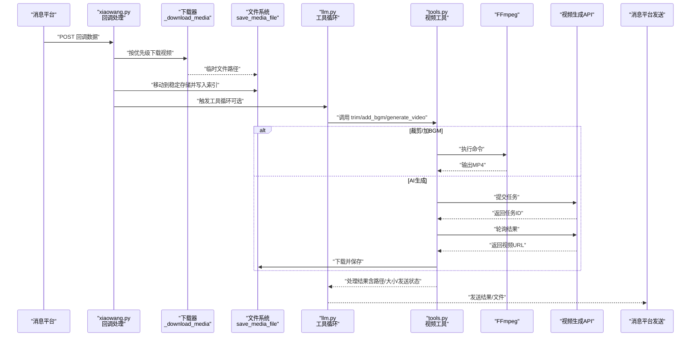
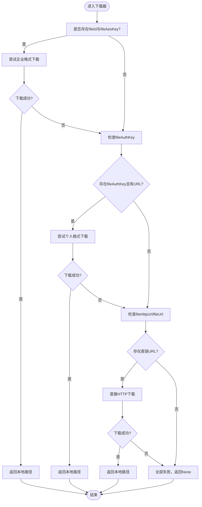
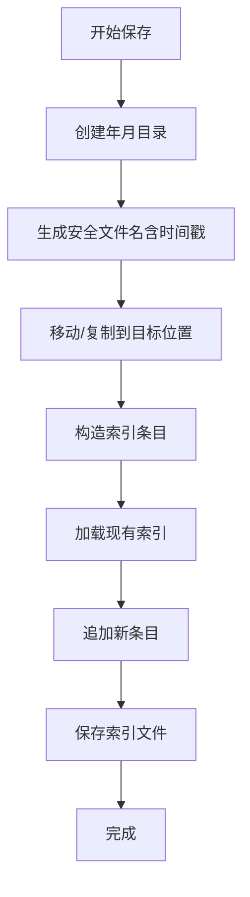
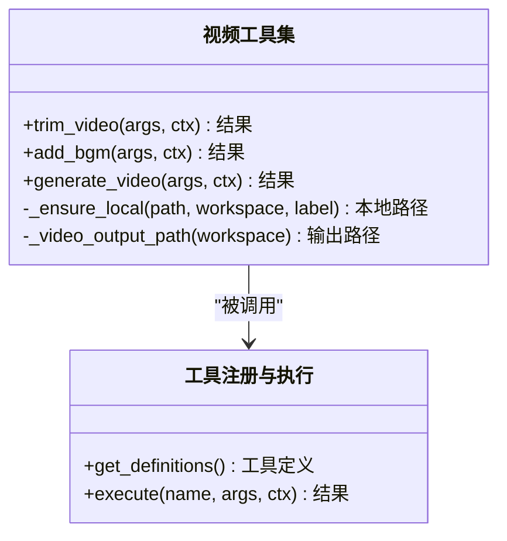
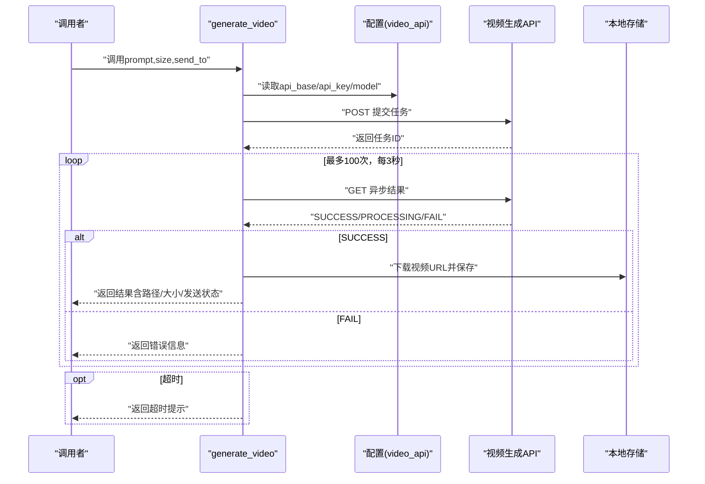
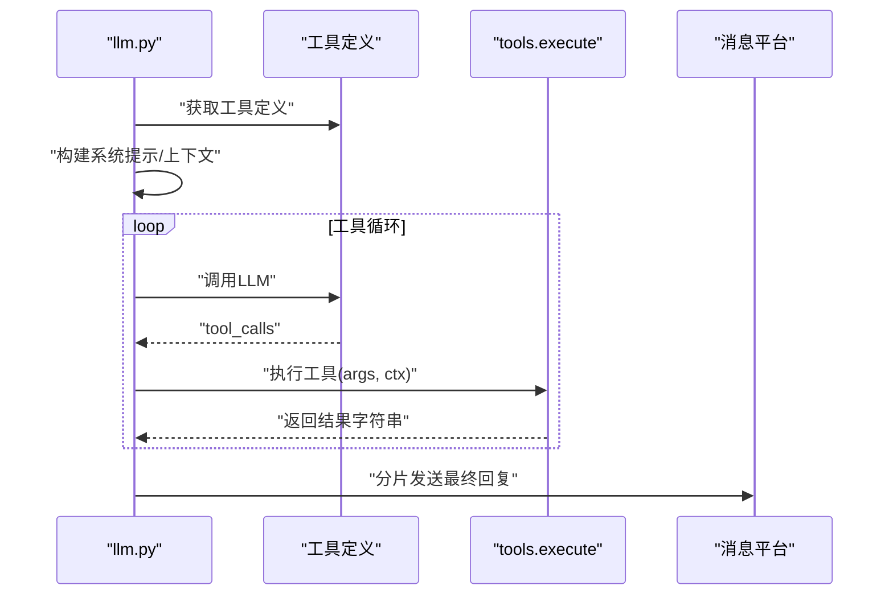
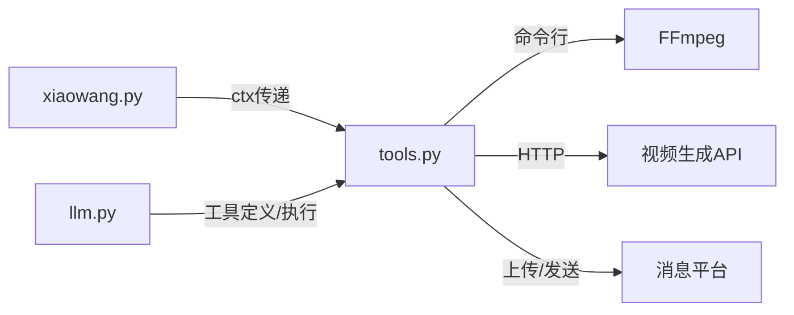

# 视频处理

<cite>
**本文引用的文件**
- [README.md](file://README.md)
- [config.example.json](file://config.example.json)
- [xiaowang.py](file://xiaowang.py)
- [tools.py](file://tools.py)
- [llm.py](file://llm.py)
- [router.py](file://router.py)
- [memory.py](file://memory.py)
- [scheduler.py](file://scheduler.py)
</cite>

## 目录
1. [简介](#简介)
2. [项目结构](#项目结构)
3. [核心组件](#核心组件)
4. [架构总览](#架构总览)
5. [详细组件分析](#详细组件分析)
6. [依赖分析](#依赖分析)
7. [性能考虑](#性能考虑)
8. [故障排查指南](#故障排查指南)
9. [结论](#结论)
10. [附录](#附录)

## 简介
本文件面向724 Office中的“视频处理”能力，围绕以下目标展开：
- 视频消息的接收、下载与存储机制，包含三种下载路径及优先级处理
- 视频文件的持久化存储策略与文件索引管理
- 视频处理工具的使用方式：视频剪辑、音效添加、AI视频生成
- 处理与工具系统的集成：工具调用参数、处理结果反馈、错误处理
- 使用示例、配置参数与最佳实践建议

该系统通过回调入口接收消息，按平台格式优先选择下载路径，落地到本地后进行持久化与索引记录；随后在工具循环中由LLM触发视频处理工具，借助外部服务或本地FFmpeg完成处理，并可选地将结果回传给消息平台。

## 项目结构
与视频处理直接相关的模块与职责概览：
- xiaowang.py：HTTP回调入口、消息去抖、视频/图片/语音/文件等多媒体处理、持久化存储与索引
- tools.py：工具注册与执行、视频处理工具（裁剪、加BGM、AI生成）、通用文件发送工具
- llm.py：多模态对话与工具调用循环，注入系统提示、记忆检索与跨会话上下文
- router.py：多租户路由（与视频处理无直接耦合，但为整体架构提供容器化与转发能力）
- memory.py：三阶段记忆系统（压缩/去重/检索），与视频处理无直接耦合
- scheduler.py：定时任务调度，与视频处理无直接耦合

图表来源
- [xiaowang.py:383-433](file://xiaowang.py#L383-L433)
- [tools.py:306-496](file://tools.py#L306-L496)
- [llm.py:317-400](file://llm.py#L317-L400)

章节来源
- [README.md:101-137](file://README.md#L101-L137)
- [config.example.json:45-49](file://config.example.json#L45-L49)

## 核心组件
- 回调与下载器：负责解析消息、识别多媒体类型、按优先级选择下载路径并落盘
- 文件持久化与索引：将临时文件移动到按年月分目录的稳定存储，并维护JSON索引
- 视频处理工具集：基于FFmpeg的视频裁剪、音频混合；基于外部API的AI视频生成
- 工具调用循环：LLM根据上下文决定是否调用视频工具，执行后将结果反馈给用户
- 发送工具：统一通过消息平台上传并发送文件/视频

章节来源
- [xiaowang.py:383-433](file://xiaowang.py#L383-L433)
- [xiaowang.py:99-131](file://xiaowang.py#L99-L131)
- [tools.py:306-496](file://tools.py#L306-L496)
- [llm.py:356-395](file://llm.py#L356-L395)

## 架构总览
下图展示从消息回调到视频处理与回传的整体流程：

图表来源
- [xiaowang.py:383-433](file://xiaowang.py#L383-L433)
- [xiaowang.py:99-131](file://xiaowang.py#L99-L131)
- [tools.py:326-396](file://tools.py#L326-L396)
- [tools.py:399-495](file://tools.py#L399-L495)

## 详细组件分析

### 组件A：视频消息接收与下载（优先级路径）
- 优先级路径
  1) 企业格式：存在fileId与fileAesKey时，走平台专用下载接口
  2) 个人格式：存在fileAuthKey与对应URL时，走平台云下载接口
  3) 直接HTTP：兜底，直接下载fileHttpUrl或fileUrl
- 下载失败处理：记录错误日志并返回None，后续流程根据返回值决定是否继续
- 类型推断：根据msgType映射到image/GIF/video/voice/file，用于下载器选择合适参数

图表来源
- [xiaowang.py:383-433](file://xiaowang.py#L383-L433)

章节来源
- [xiaowang.py:383-433](file://xiaowang.py#L383-L433)

### 组件B：视频文件持久化存储与索引管理
- 存储策略
  - 按年月分目录：workspace/files/YYYY-MM/
  - 文件名包含时间戳与原始文件名（若提供），避免冲突
  - 移动而非复制，失败时回退到shutil.move
- 索引管理
  - 索引文件：workspace/files/index.json
  - 记录字段：path、type、filename、size、time
  - 列表查询与限制：支持按类型过滤与数量限制
- 读写一致性
  - 读取失败时返回空列表
  - 写入采用追加条目并立即保存

图表来源
- [xiaowang.py:99-131](file://xiaowang.py#L99-L131)

章节来源
- [xiaowang.py:99-131](file://xiaowang.py#L99-L131)
- [tools.py:205-236](file://tools.py#L205-L236)

### 组件C：视频处理工具（裁剪、加BGM、AI生成）
- 工具注册与执行
  - 工具定义：@tool装饰器注册，描述与参数Schema
  - 执行入口：tools.execute(name, args, ctx)，返回字符串结果
- 常用上下文
  - ctx包含owner_id、workspace、session_key，供工具访问配置与工作空间
- 工具实现要点
  - _ensure_local：URL自动下载至/tmp，本地路径原样返回
  - _video_output_path：输出路径按年月分目录与时间戳命名
  - send_to：可选参数，处理完成后通过消息平台发送结果
  - 错误处理：捕获子进程返回码与异常，拼装错误信息返回

图表来源
- [tools.py:36-74](file://tools.py#L36-L74)
- [tools.py:306-496](file://tools.py#L306-L496)

章节来源
- [tools.py:36-74](file://tools.py#L36-L74)
- [tools.py:306-496](file://tools.py#L306-L496)

### 组件D：AI视频生成工具（异步任务）
- 提交任务
  - 从配置读取video_api：api_base、api_key、model
  - 请求体包含model、prompt、size
  - 返回任务ID
- 轮询结果
  - 间隔3秒，最多100次（共300秒）
  - 成功：下载返回的视频URL到本地，记录大小并可选发送
  - 失败：返回错误信息
  - 超时：返回超时提示
- 错误处理
  - HTTP异常与解析异常均做降级处理
  - 缺少API密钥时直接返回错误

图表来源
- [tools.py:399-495](file://tools.py#L399-L495)
- [config.example.json:45-49](file://config.example.json#L45-L49)

章节来源
- [tools.py:399-495](file://tools.py#L399-L495)
- [config.example.json:45-49](file://config.example.json#L45-L49)

### 组件E：工具调用与结果反馈
- LLM侧
  - 构建系统提示，注入记忆与跨会话上下文
  - 注册工具定义，构建上下文ctx
  - 循环调用LLM，解析tool_calls，执行工具并将结果注入消息流
- 工具侧
  - 执行后返回字符串，包含处理路径、大小、发送状态等
  - 若send_to存在，调用消息平台上传并发送
- 反馈
  - 将最终回复按1800字节切片发送给用户

图表来源
- [llm.py:356-395](file://llm.py#L356-L395)
- [tools.py:63-74](file://tools.py#L63-L74)

章节来源
- [llm.py:317-400](file://llm.py#L317-L400)
- [tools.py:63-74](file://tools.py#L63-L74)

## 依赖分析
- 模块内聚与耦合
  - xiaowang.py与tools.py通过ctx传递工作空间与所有者ID，耦合度低
  - 视频处理工具依赖FFmpeg与外部视频生成API，通过配置注入
  - LLM与tools解耦，仅通过工具定义与执行接口交互
- 外部依赖
  - FFmpeg：本地命令行工具，需安装于PATH
  - 视频生成API：通过video_api配置访问
  - 消息平台：统一通过messaging模块封装上传与发送（在tools.py中调用）

图表来源
- [tools.py:306-496](file://tools.py#L306-L496)
- [llm.py:356-395](file://llm.py#L356-L395)
- [config.example.json:45-49](file://config.example.json#L45-L49)

章节来源
- [tools.py:306-496](file://tools.py#L306-L496)
- [llm.py:356-395](file://llm.py#L356-L395)
- [config.example.json:45-49](file://config.example.json#L45-L49)

## 性能考虑
- 视频裁剪
  - 使用流拷贝（-c copy）避免重编码，速度极快，适合大文件
  - 时间参数支持HH:MM:SS或秒数，灵活指定片段
- 音效添加
  - 视频流仍为拷贝，仅混合音频轨道，减少CPU占用
  - 支持音量比例调节，避免掩盖原声
- AI生成
  - 异步轮询，最大等待300秒，避免阻塞主线程
  - 成功后直接下载并保存，避免中间态文件滞留
- 存储与索引
  - 年月分目录降低单目录文件数量，提升IO性能
  - 索引为纯文本JSON，读写简单可靠

## 故障排查指南
- 下载失败
  - 企业/个人格式下载失败：检查fileId/fileAesKey或fileAuthKey是否齐全
  - 直链下载失败：确认URL可达、扩展名正确、磁盘空间充足
- 处理失败
  - FFmpeg返回非零退出码：查看stderr片段定位问题（如时间参数、输入格式）
  - AI生成API失败：检查video_api配置、网络连通性、任务ID有效性
- 发送失败
  - send_to参数存在时，工具内部会尝试上传并发送，失败会返回错误信息
  - 可改用本地路径或URL作为send_to参数，或稍后通过list_files查看结果路径
- 索引异常
  - 索引文件损坏：删除index.json后重新触发一次文件接收，系统会重建索引

章节来源
- [tools.py:344-345](file://tools.py#L344-L345)
- [tools.py:427-435](file://tools.py#L427-L435)
- [tools.py:488-491](file://tools.py#L488-L491)
- [xiaowang.py:99-131](file://xiaowang.py#L99-L131)

## 结论
724 Office的视频处理能力以“高优先级下载路径 + 本地FFmpeg处理 + 外部AI生成 + 统一索引与发送”为核心设计，具备如下优势：
- 下载路径明确、容错性强，覆盖企业与个人格式
- 处理工具轻量、可组合，满足常见视频编辑需求
- 异步生成与超时控制，避免长时间阻塞
- 稳定的存储与索引，便于审计与复用

## 附录

### 使用示例（步骤说明）
- 接收视频
  - 在消息回调中识别video类型，系统自动按优先级下载并持久化
- 查看已接收文件
  - 调用list_files工具，按类型与数量筛选
- 视频剪辑
  - 调用trim_video，指定input_path、start（支持HH:MM:SS或秒）、可选end
- 添加背景音乐
  - 调用add_bgm，指定video_path、audio_path、可选volume（默认0.3）
- AI视频生成
  - 调用generate_video，指定prompt、可选size（默认1280x720）
- 发送处理结果
  - 在工具参数中设置send_to，或稍后通过list_files获取路径再发送

章节来源
- [tools.py:205-236](file://tools.py#L205-L236)
- [tools.py:326-396](file://tools.py#L326-L396)
- [tools.py:399-495](file://tools.py#L399-L495)

### 配置参数
- video_api（视频生成API）
  - api_base：服务地址
  - api_key：鉴权密钥
  - model：模型名称
- 其他相关
  - workspace：工作空间根目录
  - debounce_seconds：消息去抖间隔（影响视频/图片/语音合并发送时机）

章节来源
- [config.example.json:45-49](file://config.example.json#L45-L49)
- [xiaowang.py:42-46](file://xiaowang.py#L42-L46)

### 最佳实践
- 输入路径优先使用本地绝对路径，减少重复下载
- 裁剪前先确认时间参数格式，避免FFmpeg报错
- BGM音量建议0.2~0.4之间，兼顾原声与背景音乐
- AI生成任务较长，建议在业务允许范围内设置合理的轮询与超时
- 定期清理workspace/files下的历史文件，避免磁盘压力过大