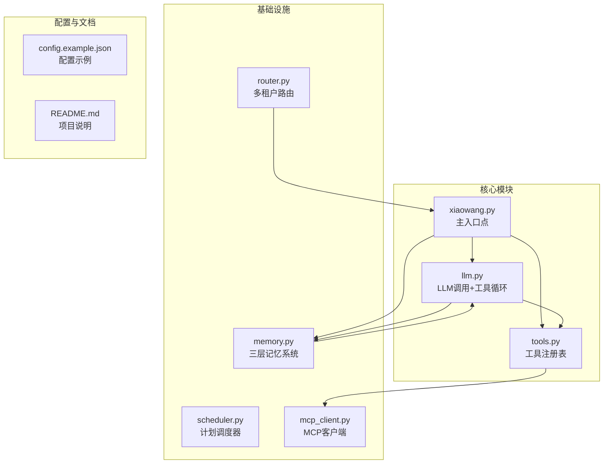
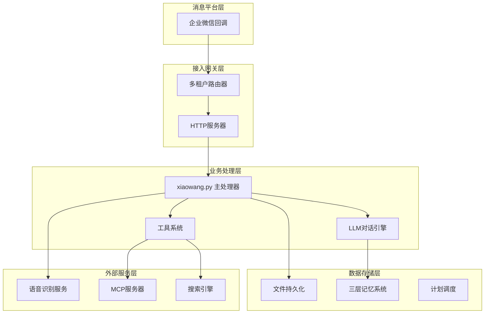
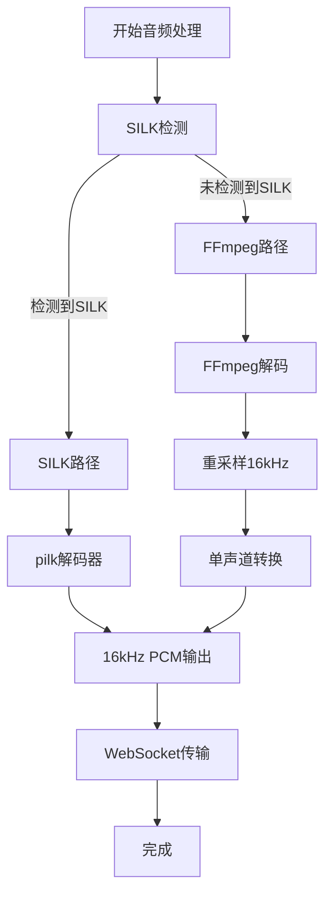
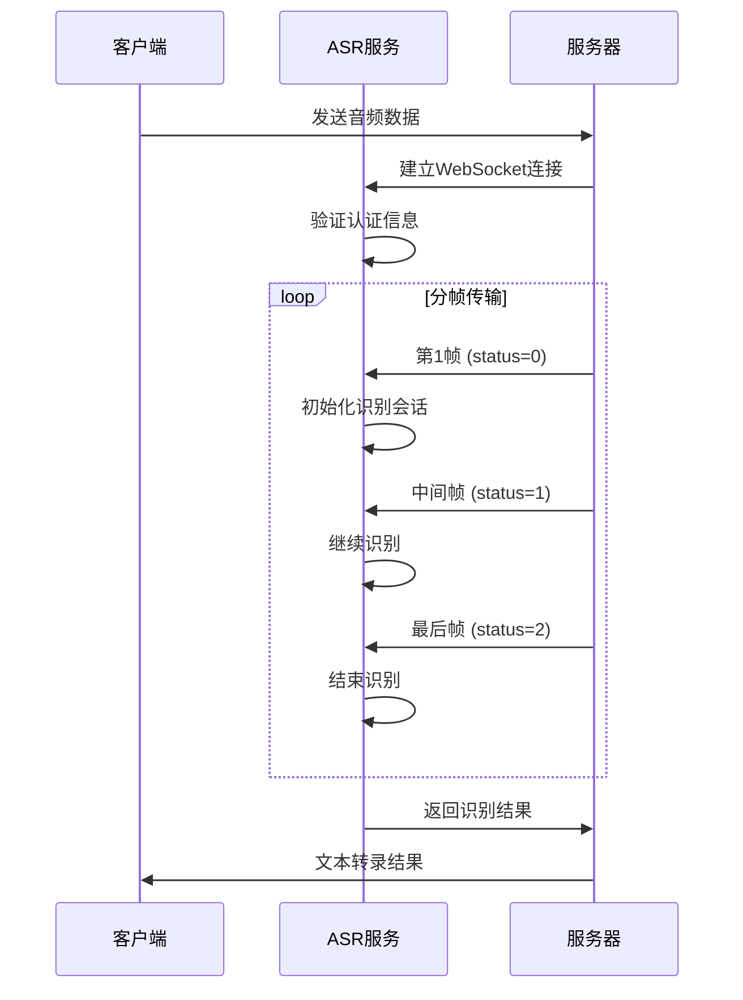
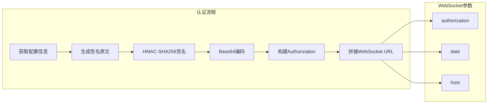
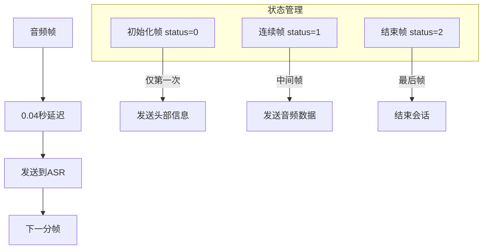
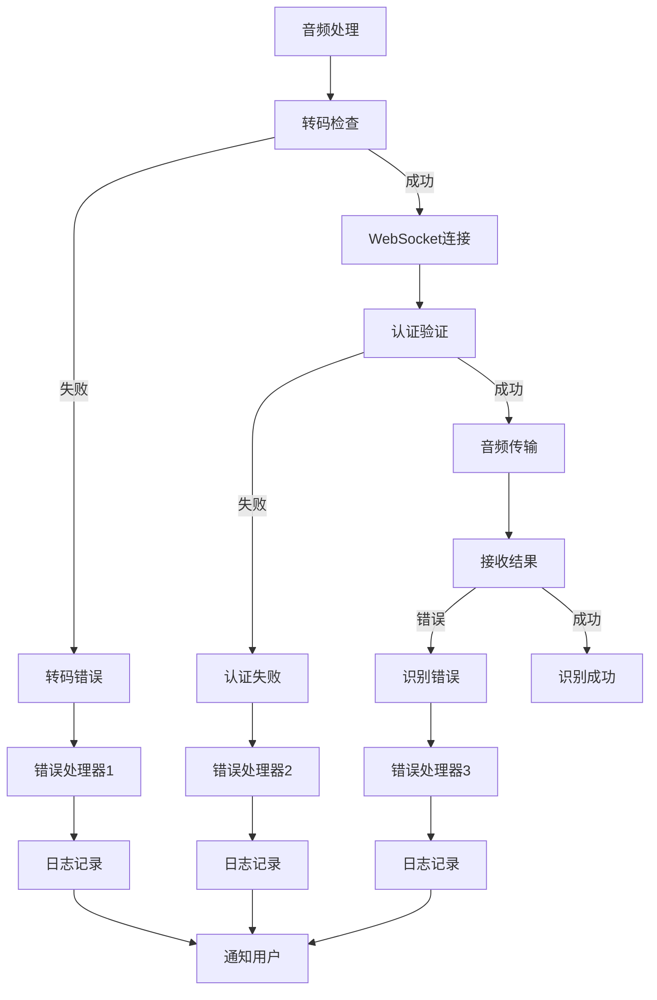
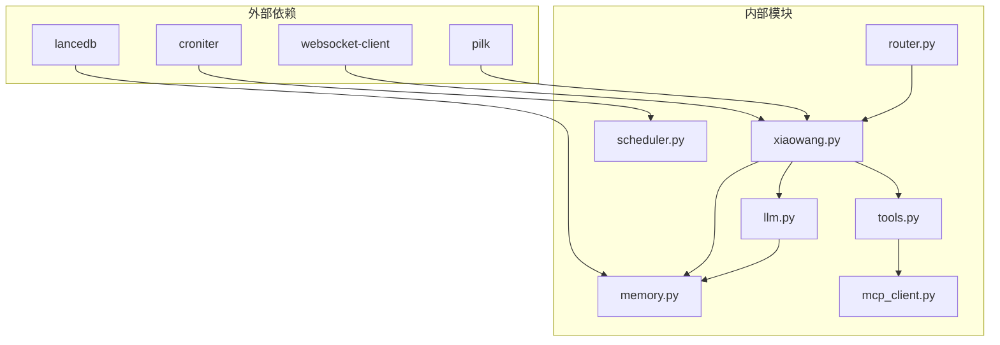

# 语音处理

<cite>
**本文档引用的文件**
- [README.md](file://README.md)
- [config.example.json](file://config.example.json)
- [xiaowang.py](file://xiaowang.py)
- [llm.py](file://llm.py)
- [tools.py](file://tools.py)
- [memory.py](file://memory.py)
- [router.py](file://router.py)
- [scheduler.py](file://scheduler.py)
- [mcp_client.py](file://mcp_client.py)
- [self_check_tool.py](file://self_check_tool.py)
</cite>

## 目录
1. [简介](#简介)
2. [项目结构](#项目结构)
3. [核心组件](#核心组件)
4. [架构总览](#架构总览)
5. [详细组件分析](#详细组件分析)
6. [依赖关系分析](#依赖关系分析)
7. [性能考虑](#性能考虑)
8. [故障排除指南](#故障排除指南)
9. [结论](#结论)

## 简介
724 Office 是一个生产级的AI智能体系统，采用纯Python实现，零框架依赖。该系统支持多模态处理，包括图像、视频、文件和语音等多种媒体类型。本文档专注于语音处理功能，特别是WebSocket流式语音识别（ASR）的完整实现，涵盖音频格式转换、实时流传输和文本转录过程。

系统基于标准库和少量小包（croniter、lancedb、websocket-client）构建，实现了24/7不间断运行的AI代理系统。该系统具备工具使用循环、三层记忆系统、MCP/插件系统、运行时工具创建、自修复能力、计划调度、多租户路由等功能。

## 项目结构
该项目采用模块化设计，每个功能模块独立封装，通过清晰的接口进行交互。主要文件组织如下：

**图表来源**
- [README.md:23-66](file://README.md#L23-L66)
- [xiaowang.py:15-76](file://xiaowang.py#L15-L76)

**章节来源**
- [README.md:1-162](file://README.md#L1-L162)
- [config.example.json:1-61](file://config.example.json#L1-L61)

## 核心组件
本系统的核心组件围绕语音处理展开，主要包括：

### 语音处理引擎
- **WebSocket ASR识别**：实现流式语音识别，支持实时音频传输
- **音频格式转换**：支持SILK和FFmpeg两种转码方案
- **实时流传输**：模拟真实语音流的分帧传输策略

### 配置管理
- **ASR配置**：语音识别API的认证信息和连接参数
- **多租户配置**：用户容器自动 provisioning 和路由管理
- **内存系统配置**：三层记忆系统的参数设置

### 工具系统
- **内置工具集**：26个预定义工具，支持文件操作、搜索、视频处理等
- **插件系统**：支持动态加载自定义工具
- **MCP桥接**：连接外部MCP服务器的JSON-RPC通信

**章节来源**
- [xiaowang.py:134-285](file://xiaowang.py#L134-L285)
- [config.example.json:39-44](file://config.example.json#L39-L44)

## 架构总览
系统采用分层架构设计，从底层基础设施到上层应用服务形成完整的处理链路：

**图表来源**
- [README.md:23-66](file://README.md#L23-L66)
- [router.py:1-493](file://router.py#L1-L493)
- [xiaowang.py:15-76](file://xiaowang.py#L15-L76)

## 详细组件分析

### WebSocket流式语音识别实现

#### 音频格式转换策略
系统实现了双路径音频转码方案，根据音频文件头自动选择最优转换方式：

**图表来源**
- [xiaowang.py:140-176](file://xiaowang.py#L140-L176)

#### 实时流传输策略
系统采用8000字节分帧策略，模拟真实语音流的实时传输：

**图表来源**
- [xiaowang.py:230-284](file://xiaowang.py#L230-L284)

#### 认证机制实现
系统实现了基于HMAC-SHA256的认证方案，确保WebSocket连接的安全性：

**图表来源**
- [xiaowang.py:177-200](file://xiaowang.py#L177-L200)

**章节来源**
- [xiaowang.py:134-285](file://xiaowang.py#L134-L285)

### 音频分帧传输策略详解

#### 帧大小计算逻辑
系统采用8000字节的固定帧大小，这是基于16kHz采样率和20ms帧长的计算结果：
- 采样率：16,000 Hz
- 位深度：16 bit
- 帧长：20 ms
- 计算：16,000 × 16 × 20ms ÷ 8 = 6,400 字节

实际实现中使用8000字节是为了留有余量，确保音频数据完整性。

#### 实时模拟机制
系统通过0.04秒的延迟模拟真实的语音流速，避免过快传输导致识别错误：

**图表来源**
- [xiaowang.py:232-265](file://xiaowang.py#L232-L265)

**章节来源**
- [xiaowang.py:230-284](file://xiaowang.py#L230-L284)

### ASR配置参数说明

#### 必需配置项
- **app_id**：语音识别服务的应用标识
- **api_key**：API访问密钥
- **api_secret**：API密钥的加密密钥
- **ws_url**：WebSocket服务地址

#### 业务参数配置
- **language**：语言类型，默认为中文普通话
- **domain**：领域类型，默认为语音识别
- **accent**：口音类型，默认为普通话
- **vad_eos**：语音活动检测的结束时间

**章节来源**
- [config.example.json:39-44](file://config.example.json#L39-L44)
- [xiaowang.py:243-248](file://xiaowang.py#L243-L248)

### 错误处理机制

#### 多层次错误处理
系统实现了多层次的错误处理机制：

**图表来源**
- [xiaowang.py:207-284](file://xiaowang.py#L207-L284)

#### 异常恢复策略
- **连接超时**：30秒超时后自动关闭连接
- **认证失败**：记录错误并返回空结果
- **识别错误**：返回错误信息但不中断整个流程

**章节来源**
- [xiaowang.py:207-284](file://xiaowang.py#L207-L284)

## 依赖关系分析

### 模块间依赖关系
系统采用松耦合的设计，各模块间通过清晰的接口进行交互：

**图表来源**
- [README.md:114-117](file://README.md#L114-L117)
- [xiaowang.py:28-29](file://xiaowang.py#L28-L29)

### 关键依赖特性
- **零框架依赖**：完全基于Python标准库构建
- **轻量级设计**：仅依赖3个小包，降低部署复杂度
- **模块化架构**：每个模块职责明确，便于维护和扩展

**章节来源**
- [README.md:114-117](file://README.md#L114-L117)
- [xiaowang.py:15-76](file://xiaowang.py#L15-L76)

## 性能考虑

### 内存使用优化
系统在设计时充分考虑了内存使用效率：
- **实时处理**：音频数据直接从内存传输，避免磁盘I/O
- **异步处理**：使用线程池处理并发请求
- **缓存机制**：对频繁访问的数据进行缓存

### 并发处理策略
- **多线程模型**：每个HTTP请求在独立线程中处理
- **非阻塞I/O**：WebSocket连接采用异步模式
- **资源池管理**：合理控制同时活跃的连接数量

### 网络优化
- **连接复用**：WebSocket连接保持长连接
- **批量处理**：支持消息去抖动，减少重复处理
- **超时控制**：合理的超时设置避免资源泄露

## 故障排除指南

### 常见问题诊断
1. **ASR连接失败**
   - 检查网络连通性和防火墙设置
   - 验证认证信息的正确性
   - 确认WebSocket URL的有效性

2. **音频转码错误**
   - 确认pilk库的安装和可用性
   - 检查FFmpeg的安装和权限
   - 验证输入音频文件的完整性

3. **识别结果为空**
   - 检查音频质量是否满足要求
   - 确认语言设置的正确性
   - 验证音频格式的兼容性

### 日志分析
系统提供了详细的日志记录机制：
- **调试级别**：详细的处理流程跟踪
- **错误级别**：异常情况的错误信息
- **性能统计**：关键操作的耗时统计

**章节来源**
- [xiaowang.py:207-284](file://xiaowang.py#L207-L284)

## 结论
724 Office语音处理系统展现了优秀的工程实践，通过精心设计的架构和实现细节，成功地将复杂的语音识别功能集成到一个轻量级的AI代理系统中。系统的主要优势包括：

1. **架构设计优秀**：采用模块化设计，职责分离清晰
2. **实现细节完善**：音频转码、实时传输、认证机制等都有完善的实现
3. **错误处理健全**：多层次的错误处理和恢复机制
4. **性能优化到位**：内存使用、并发处理、网络优化等方面都有考虑

该系统为类似的应用场景提供了很好的参考模板，展示了如何在资源受限的环境中实现复杂的AI功能。