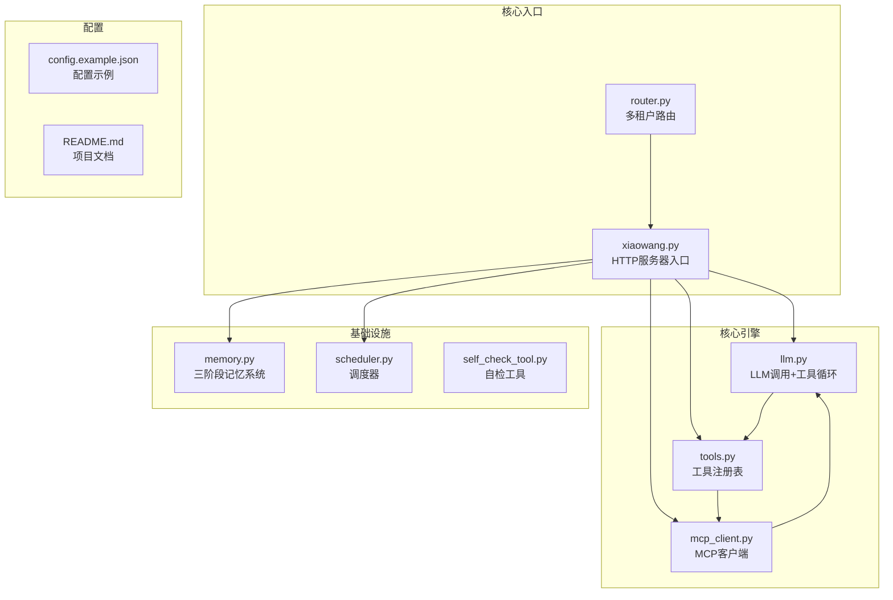
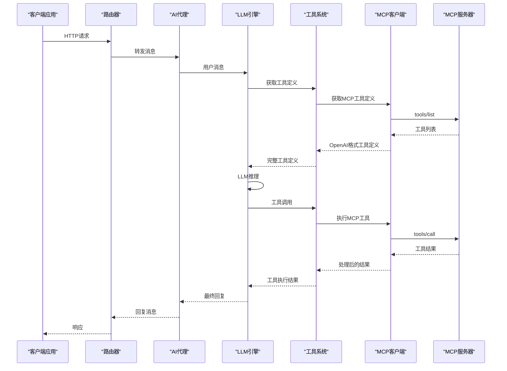
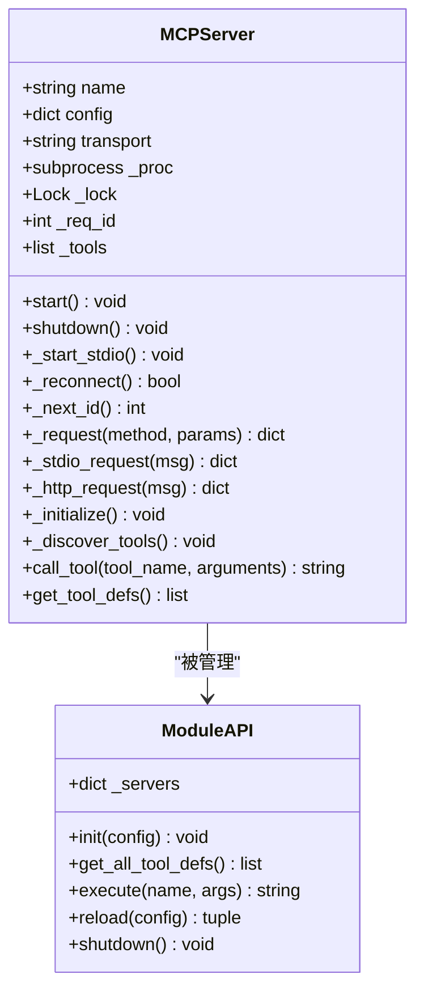
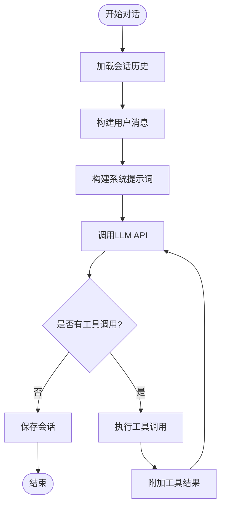
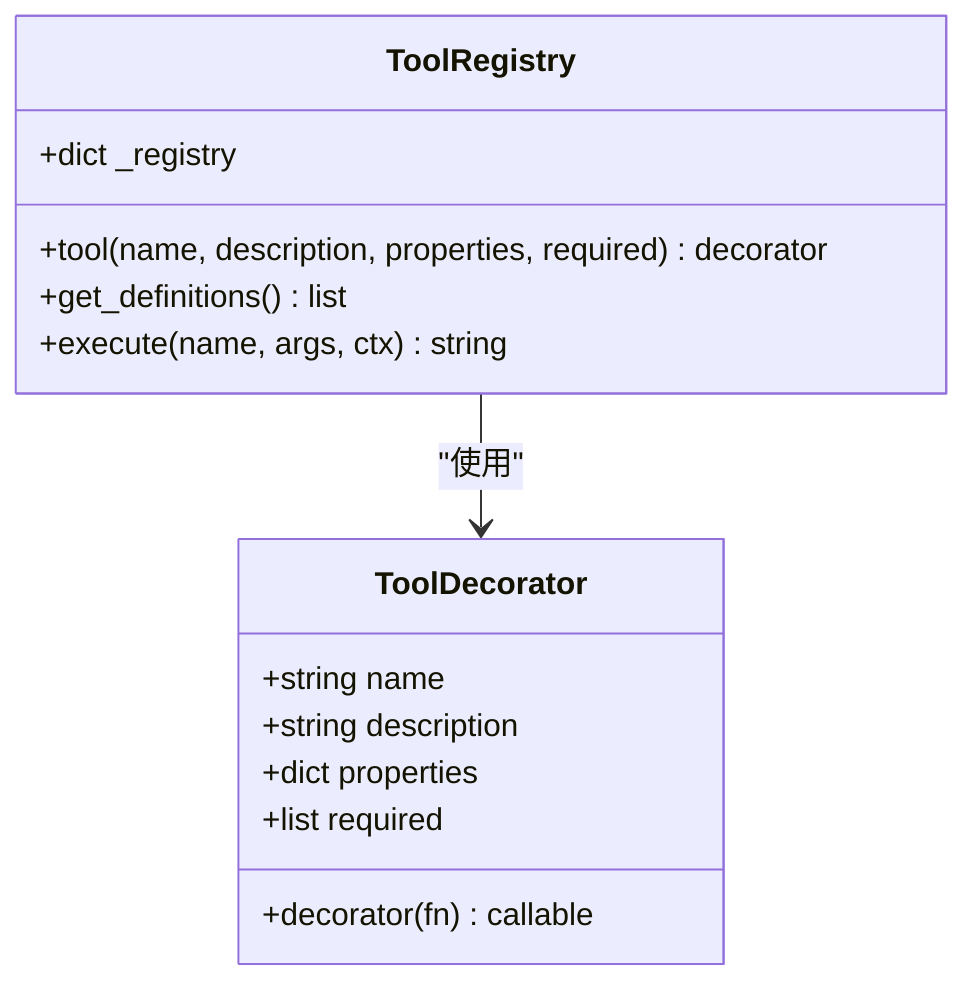
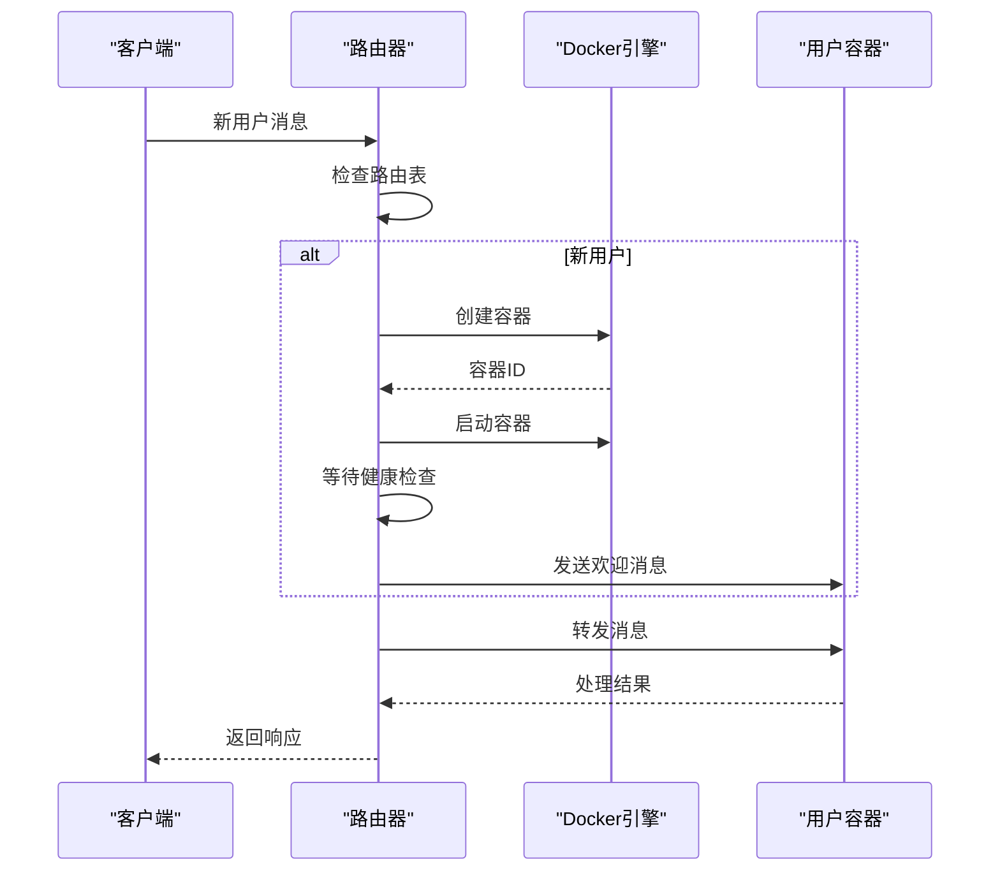
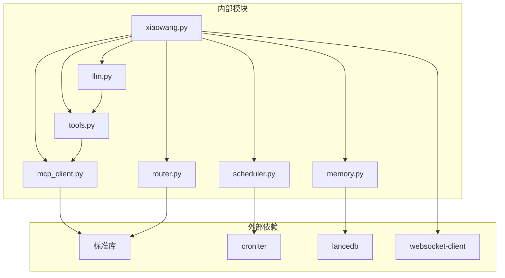

# MCP协议集成

<cite>
**本文档引用的文件**
- [README.md](file://README.md)
- [mcp_client.py](file://mcp_client.py)
- [llm.py](file://llm.py)
- [tools.py](file://tools.py)
- [router.py](file://router.py)
- [xiaowang.py](file://xiaowang.py)
- [memory.py](file://memory.py)
- [scheduler.py](file://scheduler.py)
- [self_check_tool.py](file://self_check_tool.py)
- [config.example.json](file://config.example.json)
</cite>

## 目录
1. [简介](#简介)
2. [项目结构](#项目结构)
3. [核心组件](#核心组件)
4. [架构概览](#架构概览)
5. [详细组件分析](#详细组件分析)
6. [依赖关系分析](#依赖关系分析)
7. [性能考虑](#性能考虑)
8. [故障排除指南](#故障排除指南)
9. [结论](#结论)
10. [附录](#附录)

## 简介

7/24 Office 是一个生产级的AI智能体系统，采用纯Python编写（约3500行代码），实现了完整的MCP（Model Context Protocol）协议集成。该系统无需任何框架依赖，仅使用标准库和3个小型包（croniter、lancedb、websocket-client）。

MCP协议为AI智能体提供了一个标准化的工具扩展机制，允许智能体通过JSON-RPC协议与外部MCP服务器通信，实现工具的动态发现、注册和调用。本系统支持两种传输方式：stdio管道和HTTP协议，提供了热重载功能，无需重启即可更新MCP服务器配置。

## 项目结构

该项目采用模块化设计，主要文件及其职责如下：



**图表来源**
- [xiaowang.py:1-626](file://xiaowang.py#L1-L626)
- [mcp_client.py:1-334](file://mcp_client.py#L1-L334)
- [llm.py:1-401](file://llm.py#L1-L401)
- [tools.py:1-1153](file://tools.py#L1-L1153)

**章节来源**
- [README.md:1-162](file://README.md#L1-L162)
- [xiaowang.py:1-626](file://xiaowang.py#L1-L626)

## 核心组件

### MCP客户端核心功能

MCP客户端是系统的核心组件之一，负责与外部MCP服务器建立连接、管理生命周期以及执行工具调用。其主要特性包括：

- **双传输支持**：同时支持stdio管道和HTTP两种传输方式
- **自动重连机制**：进程崩溃后自动重新连接
- **热重载功能**：无需重启即可更新MCP服务器配置
- **工具定义转换**：将MCP工具定义转换为OpenAI函数调用格式

### LLM工具使用循环

LLM引擎实现了完整的工具使用循环，支持最多20次迭代的对话，能够自动处理工具调用、结果注入和最终回复生成。

### 工具注册系统

工具注册系统提供了统一的装饰器模式，允许开发者轻松添加新的工具函数，所有工具都遵循OpenAI函数调用格式。

**章节来源**
- [mcp_client.py:27-334](file://mcp_client.py#L27-L334)
- [llm.py:306-401](file://llm.py#L306-L401)
- [tools.py:36-74](file://tools.py#L36-L74)

## 架构概览

系统采用分层架构设计，各组件之间通过清晰的接口进行交互：



**图表来源**
- [router.py:389-418](file://router.py#L389-L418)
- [llm.py:356-399](file://llm.py#L356-L399)
- [mcp_client.py:205-242](file://mcp_client.py#L205-L242)

## 详细组件分析

### MCP客户端实现

#### MCPServer类设计

MCPServer类是MCP客户端的核心实现，负责管理单个MCP服务器的生命周期：



**图表来源**
- [mcp_client.py:27-334](file://mcp_client.py#L27-L334)

#### JSON-RPC通信机制

MCP客户端实现了完整的JSON-RPC 2.0协议，支持以下核心方法：

1. **initialize**：协议握手，建立连接
2. **tools/list**：动态发现可用工具
3. **tools/call**：远程工具调用

#### 传输方式支持

系统支持两种传输方式：

**stdio传输**：
- 通过子进程启动MCP服务器
- 使用stdin/stdout进行双向通信
- 适用于本地进程间通信

**HTTP传输**：
- 通过HTTP POST发送JSON-RPC请求
- 适用于网络服务访问
- 支持RESTful API风格

**章节来源**
- [mcp_client.py:27-242](file://mcp_client.py#L27-L242)

### LLM工具使用循环

#### 核心流程设计

LLM引擎实现了高效的工具使用循环，支持最多20次迭代：



**图表来源**
- [llm.py:324-399](file://llm.py#L324-L399)

#### 多模态支持

系统支持多种消息类型，包括纯文本、图片、视频、文件等：

- **文本消息**：标准的字符串内容
- **图片消息**：支持本地文件路径和HTTP URL
- **多媒体消息**：自动下载和持久化
- **语音消息**：通过ASR转换为文本

**章节来源**
- [llm.py:317-401](file://llm.py#L317-L401)
- [xiaowang.py:489-554](file://xiaowang.py#L489-L554)

### 工具注册系统

#### 装饰器模式实现

工具注册系统采用装饰器模式，提供了简洁的工具定义语法：



**图表来源**
- [tools.py:36-74](file://tools.py#L36-L74)

#### 工具分类体系

系统内置了26个工具，按功能分为多个类别：

- **核心工具**：exec、message
- **文件操作**：read_file、write_file、edit_file、list_files
- **调度任务**：schedule、list_schedules、remove_schedule
- **媒体发送**：send_image、send_file、send_video、send_link
- **视频处理**：trim_video、add_bgm、generate_video
- **搜索功能**：web_search（多引擎）
- **记忆检索**：search_memory、recall
- **诊断工具**：self_check、diagnose
- **插件系统**：create_tool、list_custom_tools、remove_tool
- **MCP集成**：reload_mcp

**章节来源**
- [tools.py:108-800](file://tools.py#L108-L800)

### 多租户路由系统

#### Docker容器化部署

路由器实现了基于Docker的多租户路由系统，支持自动容器创建和健康检查：



**图表来源**
- [router.py:141-250](file://router.py#L141-L250)

#### 自动扩缩容机制

系统支持动态容器数量控制，防止资源耗尽：

- **最大容器数限制**：默认20个容器
- **内存限制**：每个容器256MB内存
- **健康检查**：容器启动后自动健康检查
- **超时控制**：容器创建超时45秒

**章节来源**
- [router.py:118-250](file://router.py#L118-L250)

## 依赖关系分析

### 组件耦合度分析



**图表来源**
- [xiaowang.py:15-30](file://xiaowang.py#L15-L30)
- [router.py:9-19](file://router.py#L9-L19)
- [memory.py:58-86](file://memory.py#L58-L86)

### 关键依赖关系

1. **零框架依赖原则**：所有模块仅依赖标准库和必要的第三方包
2. **模块化设计**：各模块职责明确，耦合度低
3. **异步处理**：大量使用线程池处理并发请求
4. **配置驱动**：通过配置文件控制运行时行为

**章节来源**
- [README.md:151-157](file://README.md#L151-L157)
- [config.example.json:1-61](file://config.example.json#L1-L61)

## 性能考虑

### 内存优化策略

系统针对边缘设备进行了专门优化：

- **内存预算控制**：整体内存占用控制在2GB以内
- **轻量级依赖**：仅使用3个小型包
- **缓存机制**：多级缓存减少重复计算
- **异步I/O**：非阻塞网络请求

### 并发处理

- **线程池管理**：合理控制并发线程数量
- **锁机制**：最小化锁持有时间
- **超时控制**：所有网络请求设置超时
- **资源清理**：及时释放文件句柄和网络连接

### 热重载机制

MCP系统的热重载功能确保了系统的高可用性：

- **无缝切换**：新旧配置平滑过渡
- **状态保持**：会话状态不丢失
- **错误隔离**：单个服务器故障不影响其他服务
- **自动恢复**：断线自动重连

## 故障排除指南

### 常见问题诊断

#### MCP服务器连接问题

**症状**：MCP工具无法使用，日志显示连接失败

**排查步骤**：
1. 检查MCP服务器配置是否正确
2. 验证传输方式（stdio vs HTTP）
3. 确认服务器进程是否正常运行
4. 检查防火墙和网络连接

**解决方案**：
- 对于stdio传输：确认命令路径和参数正确
- 对于HTTP传输：验证URL可达性和认证信息
- 实施重连机制：利用内置的自动重连功能

#### 工具调用超时

**症状**：工具执行超时，返回超时错误

**排查步骤**：
1. 检查工具执行时间
2. 验证网络连接稳定性
3. 监控服务器负载情况

**解决方案**：
- 增加超时时间配置
- 优化工具执行逻辑
- 实施异步处理机制

#### 内存泄漏问题

**症状**：系统运行时间越长，内存占用越高

**排查步骤**：
1. 监控关键模块的内存使用
2. 检查文件句柄和网络连接
3. 验证垃圾回收机制

**解决方案**：
- 及时释放资源
- 实施弱引用机制
- 优化数据结构使用

### 日志分析

系统提供了详细的日志记录机制：

- **MCP模块日志**：连接状态、工具调用、错误信息
- **LLM模块日志**：对话统计、性能指标、错误追踪
- **工具模块日志**：工具执行详情、参数验证
- **路由器日志**：容器管理、路由决策、健康检查

**章节来源**
- [mcp_client.py:74-90](file://mcp_client.py#L74-L90)
- [llm.py:370-372](file://llm.py#L370-L372)

## 结论

7/24 Office项目成功实现了MCP协议的完整集成，展示了如何在生产环境中构建可扩展的AI智能体系统。该系统的主要优势包括：

1. **协议兼容性**：完全符合MCP协议规范，支持标准的JSON-RPC通信
2. **灵活部署**：支持多种传输方式和部署模式
3. **高可用性**：内置热重载和自动重连机制
4. **性能优化**：针对边缘设备进行了专门优化
5. **模块化设计**：清晰的架构分离，易于维护和扩展

该系统为AI智能体的工具扩展提供了一个优秀的参考实现，展示了如何在实际生产环境中安全、可靠地集成外部工具服务。

## 附录

### MCP协议规范

#### 协议版本

系统使用MCP协议版本：2024-11-05

#### 核心方法

1. **initialize**：协议握手
   - 参数：protocolVersion、capabilities、clientInfo
   - 返回：初始化确认

2. **tools/list**：工具列表查询
   - 参数：空
   - 返回：工具定义数组

3. **tools/call**：工具调用
   - 参数：name、arguments
   - 返回：工具执行结果

#### 数据格式

- **请求格式**：JSON-RPC 2.0标准
- **响应格式**：标准JSON对象
- **错误格式**：包含错误码和消息

### 配置示例

完整的MCP服务器配置示例如下：

```json
{
  "mcp_servers": {
    "example-server": {
      "transport": "stdio",
      "command": "npx",
      "args": ["-y", "@example/mcp-server"],
      "env": {}
    }
  }
}
```

### 开发最佳实践

1. **错误处理**：始终实现完善的异常处理机制
2. **资源管理**：及时释放网络连接和文件句柄
3. **超时控制**：为所有网络请求设置合理的超时时间
4. **日志记录**：提供详细的调试信息和错误追踪
5. **测试覆盖**：为关键功能编写单元测试和集成测试