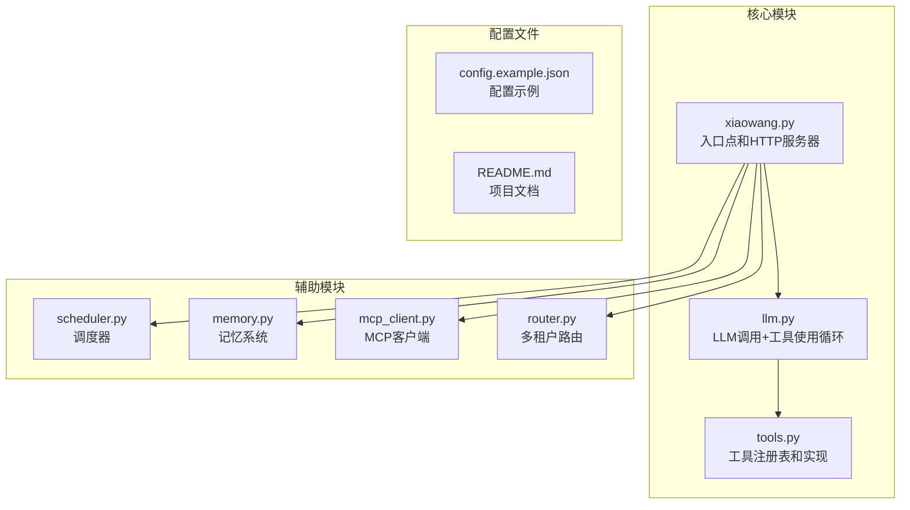
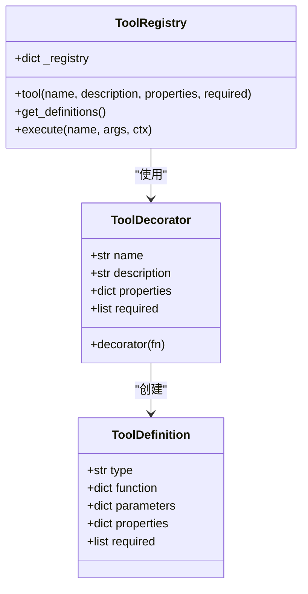
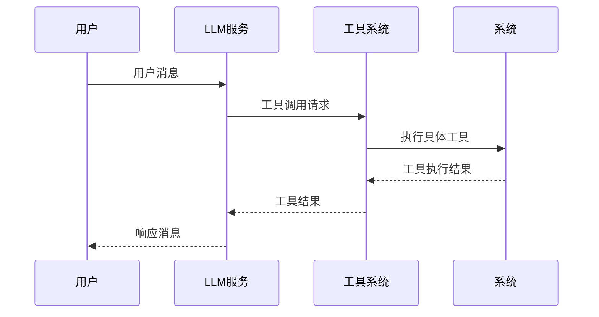
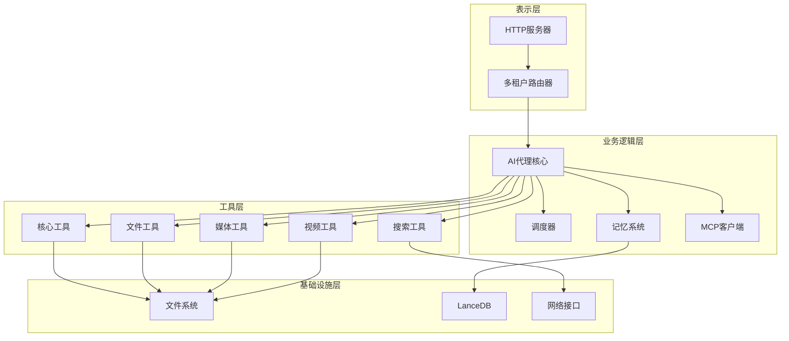
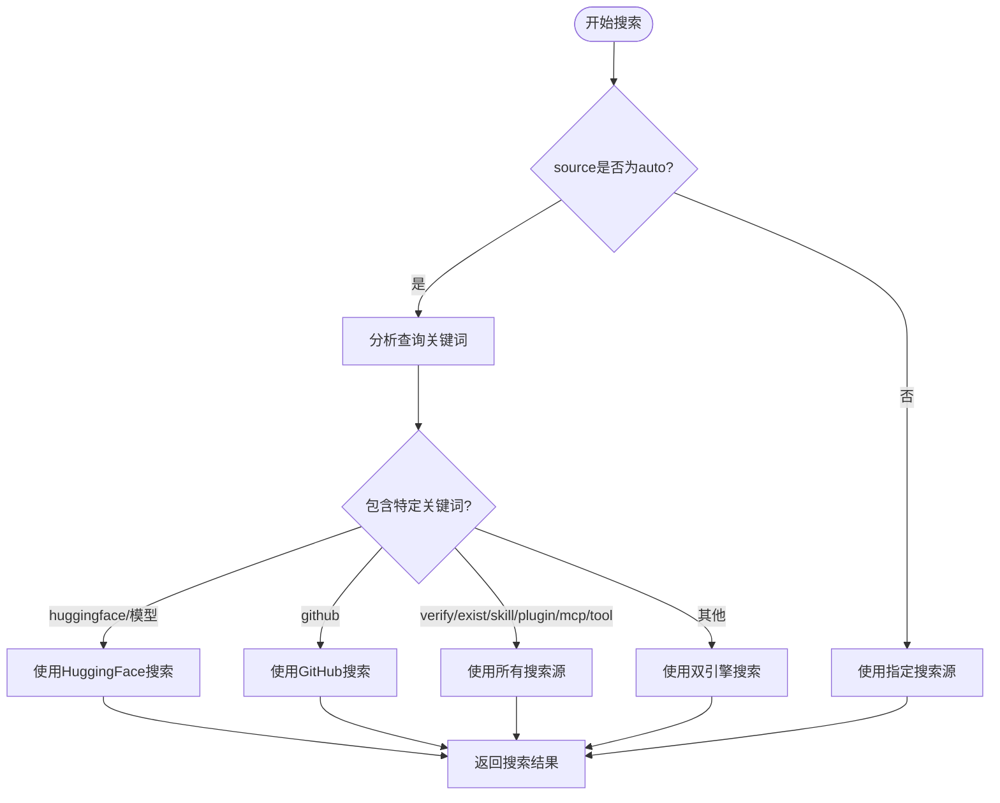
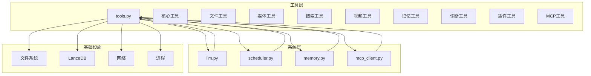

# 内置工具详解

<cite>
**本文档引用的文件**
- [README.md](file://README.md)
- [tools.py](file://tools.py)
- [llm.py](file://llm.py)
- [scheduler.py](file://scheduler.py)
- [memory.py](file://memory.py)
- [mcp_client.py](file://mcp_client.py)
- [xiaowang.py](file://xiaowang.py)
- [router.py](file://router.py)
- [self_check_tool.py](file://self_check_tool.py)
</cite>

## 目录
1. [简介](#简介)
2. [项目结构](#项目结构)
3. [核心组件](#核心组件)
4. [架构概览](#架构概览)
5. [详细组件分析](#详细组件分析)
6. [依赖关系分析](#依赖关系分析)
7. [性能考虑](#性能考虑)
8. [故障排除指南](#故障排除指南)
9. [结论](#结论)

## 简介

724 Office是一个生产级的AI智能体系统，采用纯Python编写（约3500行代码），实现了零框架依赖的自演进AI代理。该系统提供了26个内置工具，涵盖核心功能、文件管理、调度、媒体发送、视频处理、搜索、记忆检索等多个类别。

系统的核心特性包括：
- **工具使用循环** - 兼容OpenAI函数调用格式，支持自动重试，每对话最多20次迭代
- **三层记忆系统** - 会话历史 + LLM压缩长期记忆 + LanceDB向量检索
- **MCP/插件系统** - 通过JSON-RPC连接外部MCP服务器，热重载无需重启
- **运行时工具创建** - 代理可以编写、保存和加载新的Python工具
- **自我修复** - 每日自检、会话健康诊断、错误日志分析、失败自动通知

## 项目结构

该项目采用模块化设计，主要文件组织如下：



**图表来源**
- [xiaowang.py:1-626](file://xiaowang.py#L1-L626)
- [llm.py:1-401](file://llm.py#L1-L401)
- [tools.py:1-1153](file://tools.py#L1-L1153)

**章节来源**
- [README.md:1-162](file://README.md#L1-L162)
- [xiaowang.py:35-76](file://xiaowang.py#L35-L76)

## 核心组件

### 工具注册系统

系统使用装饰器模式实现工具注册，所有工具都通过统一的注册机制管理：



**图表来源**
- [tools.py:36-74](file://tools.py#L36-L74)

### LLM集成层

LLM层负责处理工具调用循环，支持多模态输入（文本、图像）：



**图表来源**
- [llm.py:317-401](file://llm.py#L317-L401)

**章节来源**
- [tools.py:36-74](file://tools.py#L36-L74)
- [llm.py:50-83](file://llm.py#L50-L83)

## 架构概览

系统采用分层架构设计，各层职责明确：



**图表来源**
- [xiaowang.py:59-76](file://xiaowang.py#L59-L76)
- [llm.py:33-40](file://llm.py#L33-L40)

## 详细组件分析

### 核心工具

#### exec工具
执行shell命令，支持超时控制和工作目录限制。

**参数定义**：
- `command` (string, 必需): 要执行的shell命令
- `timeout` (integer, 可选): 超时时间（秒，默认60，最大300）

**使用场景**：
- 系统维护操作
- 文件系统检查
- 进程状态查询

**返回值**：
- 成功：命令输出（包含标准输出和标准错误）
- 失败：错误信息或超时提示

**OpenAI函数调用格式**：
```json
{
  "type": "function",
  "function": {
    "name": "exec",
    "description": "在服务器上执行shell命令。默认超时60秒。慢操作设置超时为300。",
    "parameters": {
      "type": "object",
      "properties": {
        "command": {"type": "string", "description": "要执行的shell命令"},
        "timeout": {"type": "integer", "description": "超时时间（秒），默认60，最大300"}
      },
      "required": ["command"]
    }
  }
}
```

#### message工具
通过消息平台发送文本消息给所有者。

**参数定义**：
- `content` (string, 必需): 消息内容

**使用场景**：
- 定时任务通知
- 系统状态报告
- 错误告警

**返回值**：
- 成功：发送统计信息
- 失败：错误信息

**OpenAI函数调用格式**：
```json
{
  "type": "function",
  "function": {
    "name": "message",
    "description": "通过消息平台向所有者发送文本消息。用于定时任务通知。正常对话回复不需要此工具。",
    "parameters": {
      "type": "object",
      "properties": {
        "content": {"type": "string", "description": "消息内容"}
      },
      "required": ["content"]
    }
  }
}
```

**章节来源**
- [tools.py:110-146](file://tools.py#L110-L146)

### 文件管理工具

#### read_file工具
读取文件内容，支持工作目录相对路径。

**参数定义**：
- `path` (string, 必需): 文件路径（相对工作目录或绝对路径）

**使用场景**：
- 配置文件查看
- 日志文件分析
- 文档内容提取

**返回值**：
- 成功：文件内容（超过10000字符时截断）
- 失败：错误信息

#### write_file工具
写入文件内容（覆盖模式）。

**参数定义**：
- `path` (string, 必需): 文件路径
- `content` (string, 必需): 文件内容

**使用场景**：
- 配置文件更新
- 日志文件写入
- 数据导出

**返回值**：
- 成功：写入统计信息
- 失败：错误信息

#### edit_file工具
编辑文件内容，替换指定文本。

**参数定义**：
- `path` (string, 必需): 文件路径
- `old` (string, 必需): 要替换的原始文本
- `new` (string, 必需): 替换文本

**使用场景**：
- 配置修改
- 文档更新
- 代码片段替换

**返回值**：
- 成功：编辑确认
- 失败：错误信息

#### list_files工具
列出接收和保存的文件。

**参数定义**：
- `type` (string, 可选): 文件类型过滤（image/video/file/voice/gif），空表示全部
- `limit` (integer, 可选): 结果数量（默认20）

**使用场景**：
- 文件管理
- 媒体库浏览
- 存储空间监控

**返回值**：
- 成功：文件列表摘要
- 失败：错误信息

**章节来源**
- [tools.py:150-236](file://tools.py#L150-L236)

### 调度工具

#### schedule工具
创建计划任务，支持一次性和周期性任务。

**参数定义**：
- `name` (string, 必需): 任务名称（唯一标识符）
- `message` (string, 必需): 触发时发送给LLM的消息（应包含如"通过message工具发送给所有者"的指令）
- `delay_seconds` (integer, 可选): 延迟秒数（一次性任务）
- `cron_expr` (string, 可选): Cron表达式（周期性任务，如"0 9 * * *"）
- `once` (boolean, 可选): 仅执行一次（默认true，仅对cron_expr有效）

**使用场景**：
- 定时报告生成
- 周期性维护任务
- 自动化流程触发

**返回值**：
- 成功：任务创建确认
- 失败：错误信息

#### list_schedules工具
列出所有计划任务。

**使用场景**：
- 任务状态监控
- 调度器健康检查
- 任务审计

**返回值**：
- 成功：任务列表
- 失败：错误信息

#### remove_schedule工具
删除计划任务。

**参数定义**：
- `name` (string, 必需): 任务名称

**使用场景**：
- 任务清理
- 调度器维护
- 错误任务移除

**返回值**：
- 成功：删除确认
- 失败：错误信息

**章节来源**
- [tools.py:240-262](file://tools.py#L240-L262)
- [scheduler.py:49-104](file://scheduler.py#L49-L104)

### 媒体发送工具

#### send_image工具
发送图片给所有者，支持HTTP URL或本地文件路径。

**参数定义**：
- `path` (string, 必需): 图片URL（http/https）或本地文件路径
- `caption` (string, 可选): 可选的文本标题

**使用场景**：
- 图片分享
- 报告截图
- 状态可视化

**返回值**：
- 成功：发送确认
- 失败：错误信息

#### send_file工具
发送文件给所有者，支持HTTP URL或本地路径。

**参数定义**：
- `path` (string, 必需): 文件URL（http/https）或本地文件路径
- `caption` (string, 可选): 可选的文本标题

**使用场景**：
- 文档分享
- 数据导出
- 报告附件

**返回值**：
- 成功：发送确认
- 失败：错误信息

#### send_video工具
发送视频给所有者，支持HTTP URL或本地MP4文件路径。

**参数定义**：
- `path` (string, 必需): 视频URL（http/https）或本地文件路径
- `caption` (string, 可选): 可选的文本标题

**使用场景**：
- 视频分享
- 录制回放
- 媒体展示

**返回值**：
- 成功：发送确认
- 失败：错误信息

#### send_link工具
发送富链接卡片给所有者。

**参数定义**：
- `title` (string, 必需): 卡片标题
- `desc` (string, 必需): 卡片描述
- `link_url` (string, 必需): 点击链接URL
- `icon_url` (string, 可选): 卡片图标URL

**使用场景**：
- 网页分享
- 资源推荐
- 导航链接

**返回值**：
- 成功：链接卡片发送确认
- 失败：错误信息

**章节来源**
- [tools.py:266-302](file://tools.py#L266-L302)

### 视频处理工具

#### trim_video工具
裁剪视频：提取时间片段。使用-c copy（无重新编码），毫秒级快速处理大文件。

**参数定义**：
- `input_path` (string, 必需): 视频文件路径（本地或URL）
- `start` (string, 必需): 开始时间，格式HH:MM:SS或秒数
- `end` (string, 可选): 结束时间（可选，省略表示到末尾）
- `send_to` (string, 可选): 裁剪完成后发送给谁

**使用场景**：
- 视频片段提取
- 剪辑预览
- 内容精简

**返回值**：
- 成功：处理完成信息和文件大小
- 失败：错误信息

#### add_bgm工具
为视频添加背景音乐。视频流不重新编码（-c:v copy），仅混合音频轨道。

**参数定义**：
- `video_path` (string, 必需): 视频文件路径（本地或URL）
- `audio_path` (string, 必需): 音频文件路径（mp3/wav/aac，本地或URL）
- `volume` (number, 可选): 背景音乐音量比例，默认0.3（30%），避免盖过原音频
- `send_to` (string, 可选): 处理完成后发送给谁

**使用场景**：
- 视频配乐
- 音频增强
- 媒体制作

**返回值**：
- 成功：处理完成信息和文件大小
- 失败：错误信息

#### generate_video工具
从文本描述生成视频（AI视频生成API）。异步任务，通常需要2-5分钟。

**参数定义**：
- `prompt` (string, 必需): 视频内容描述（越详细越好）
- `size` (string, 可选): 视频分辨率，默认1280x720
- `send_to` (string, 可选): 生成完成后发送给谁

**使用场景**：
- 自动生成视频内容
- 创意媒体生成
- 快速原型制作

**返回值**：
- 成功：处理完成信息和文件大小
- 失败：错误信息

**章节来源**
- [tools.py:326-496](file://tools.py#L326-L496)

### 搜索工具

#### web_search工具
网络搜索，支持多个搜索源。

**参数定义**：
- `query` (string, 必需): 搜索关键词
- `source` (string, 可选): 搜索源：auto/web/tavily/github/huggingface/all，默认auto
- `count` (integer, 可选): 结果数量（默认5）

**使用场景**：
- 信息检索
- 知识查询
- 资料收集

**返回值**：
- 成功：搜索结果
- 失败：错误信息

**搜索源路由策略**：


**图表来源**
- [tools.py:718-761](file://tools.py#L718-L761)

**章节来源**
- [tools.py:705-761](file://tools.py#L705-L761)

### 记忆搜索工具

#### search_memory工具
搜索内存文件，在工作目录的workspace/memory/中使用关键字搜索。

**参数定义**：
- `query` (string, 必需): 搜索关键词（空格分隔）
- `scope` (string, 可选): 搜索范围：all（默认）、long（MEMORY.md）、daily（每日日志）

**使用场景**：
- 历史信息检索
- 记忆查询
- 上下文回顾

**返回值**：
- 成功：匹配结果
- 失败：错误信息

#### recall工具
长期内存的语义搜索。比search_memory更智能（向量语义匹配vs关键字匹配）。

**参数定义**：
- `query` (string, 必需): 搜索关键词或问题

**使用场景**：
- 深度记忆检索
- 历史信息理解
- 智能问答

**返回值**：
- 成功：相关记忆
- 失败：错误信息

**章节来源**
- [tools.py:766-814](file://tools.py#L766-L814)
- [memory.py:88-119](file://memory.py#L88-L119)

### 诊断工具

#### self_check工具
系统自检：收集今天的对话统计、系统健康状况、错误日志、计划任务状态等。

**使用场景**：
- 系统健康检查
- 性能监控
- 故障预防

**返回值**：
- 成功：自检报告
- 失败：错误信息

#### diagnose工具
诊断系统问题。检查会话文件健康状况、MCP服务器连接状态、最近错误日志详情。

**参数定义**：
- `target` (string, 必需): 诊断目标：'session'、'mcp'、'errors'、'all'

**使用场景**：
- 系统故障排查
- 连接状态检查
- 错误分析

**返回值**：
- 成功：诊断报告
- 失败：错误信息

**章节来源**
- [tools.py:818-1020](file://tools.py#L818-L1020)

### 插件管理工具

#### create_tool工具
创建新的自定义工具插件。代码保存到plugins/目录并立即热加载。

**参数定义**：
- `name` (string, 必需): 工具名称（用作文件名，如'weather'创建plugins/weather.py）
- `code` (string, 必需): 完整的Python插件代码，包含导入、@tool装饰器和函数定义

**使用场景**：
- 功能扩展
- 自定义工具开发
- 系统自演化

**返回值**：
- 成功：创建确认
- 失败：错误信息

#### list_custom_tools工具
列出所有自定义工具插件（在plugins/目录中）。

**使用场景**：
- 插件管理
- 功能审计
- 系统维护

**返回值**：
- 成功：插件列表
- 失败：错误信息

#### remove_tool工具
删除自定义工具插件。只能删除plugins/工具，不能删除内置工具。

**参数定义**：
- `name` (string, 必需): 要删除的工具名称

**使用场景**：
- 插件清理
- 功能移除
- 系统维护

**返回值**：
- 成功：删除确认
- 失败：错误信息

**章节来源**
- [tools.py:1024-1091](file://tools.py#L1024-L1091)

### MCP热重载工具

#### reload_mcp工具
热重载MCP服务器：重新读取config.json中的mcp_servers配置，连接新服务器，断开已移除的服务器。无需重启。

**使用场景**：
- MCP服务器动态管理
- 配置热更新
- 服务发现

**返回值**：
- 成功：重载结果
- 失败：错误信息

**章节来源**
- [tools.py:1097-1132](file://tools.py#L1097-L1132)

## 依赖关系分析

### 组件耦合度分析



**图表来源**
- [tools.py:80-83](file://tools.py#L80-L83)
- [llm.py:17-18](file://llm.py#L17-L18)

### 外部依赖关系

系统的主要外部依赖包括：

| 依赖包 | 版本要求 | 用途 |
|--------|----------|------|
| croniter | 最新版 | Cron表达式解析 |
| lancedb | 最新版 | 向量数据库存储 |
| websocket-client | 最新版 | WebSocket通信 |

**章节来源**
- [README.md:115-116](file://README.md#L115-L116)

## 性能考虑

### 工具执行优化

1. **超时控制**：所有工具都有合理的超时设置，防止长时间阻塞
2. **资源限制**：文件操作限制单次读取大小，避免内存溢出
3. **并发处理**：使用线程池处理异步任务，提高响应速度
4. **缓存机制**：内存系统使用缓存减少重复计算

### 内存管理

1. **会话截断**：保持最近40条消息，超出部分压缩到长期记忆
2. **向量存储**：使用LanceDB进行高效的向量检索
3. **垃圾回收**：定期清理临时文件和缓存数据

### 网络优化

1. **批量发送**：消息分块发送，避免超长消息
2. **连接复用**：MCP服务器连接复用，减少建立连接的开销
3. **异步处理**：大量I/O操作采用异步方式

## 故障排除指南

### 常见错误类型

#### 工具执行错误
- **超时错误**：检查命令执行时间和系统负载
- **权限错误**：验证工作目录访问权限
- **路径错误**：确认文件路径正确性和存在性

#### 网络连接错误
- **MCP服务器连接失败**：检查服务器配置和网络连通性
- **API调用失败**：验证API密钥和网络配置
- **超时错误**：调整超时参数或优化网络环境

#### 内存相关错误
- **内存不足**：检查系统内存使用情况
- **磁盘空间不足**：清理临时文件和日志
- **向量数据库异常**：重建数据库或检查配置

### 调试技巧

1. **启用详细日志**：查看系统日志了解错误详情
2. **使用diagnose工具**：自动诊断系统问题
3. **检查配置文件**：验证所有配置项正确性
4. **测试独立功能**：单独测试有问题的工具

**章节来源**
- [tools.py:63-74](file://tools.py#L63-L74)
- [llm.py:362-401](file://llm.py#L362-L401)

## 结论

724 Office系统通过精心设计的26个内置工具，构建了一个功能完整、性能优异的AI智能体平台。系统的主要优势包括：

1. **模块化设计**：清晰的组件分离和职责划分
2. **零框架依赖**：完全基于标准库，易于部署和维护
3. **自演化能力**：支持运行时工具创建和MCP热重载
4. **生产就绪**：具备完善的错误处理和监控机制

该系统为开发者提供了一个强大的基础平台，可以在此基础上快速构建各种AI应用和服务。通过理解各个工具的功能特性和最佳实践，开发者可以更好地利用这个系统来解决实际问题。