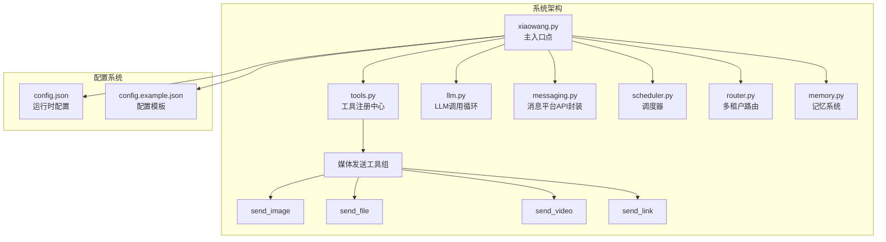
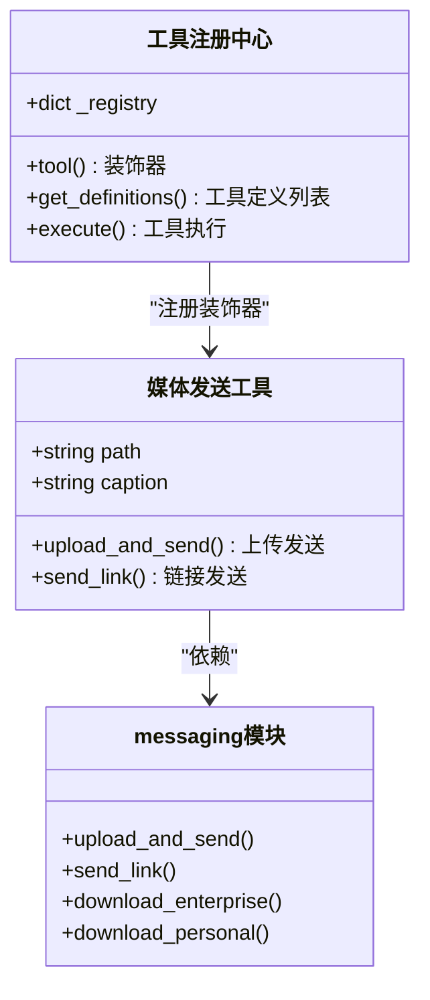
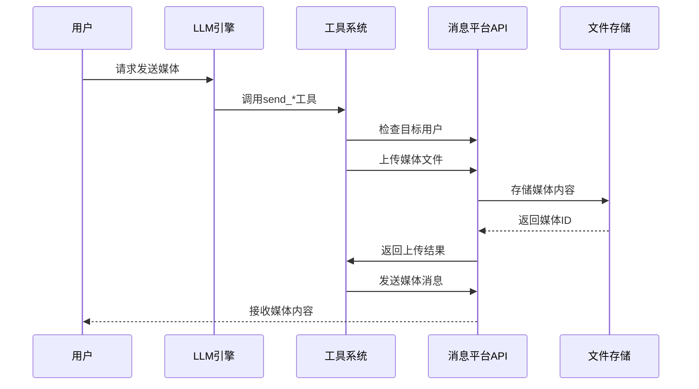
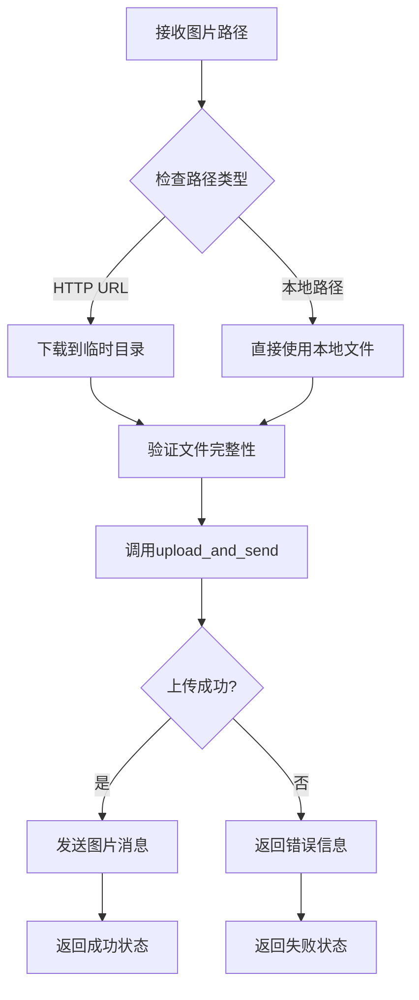
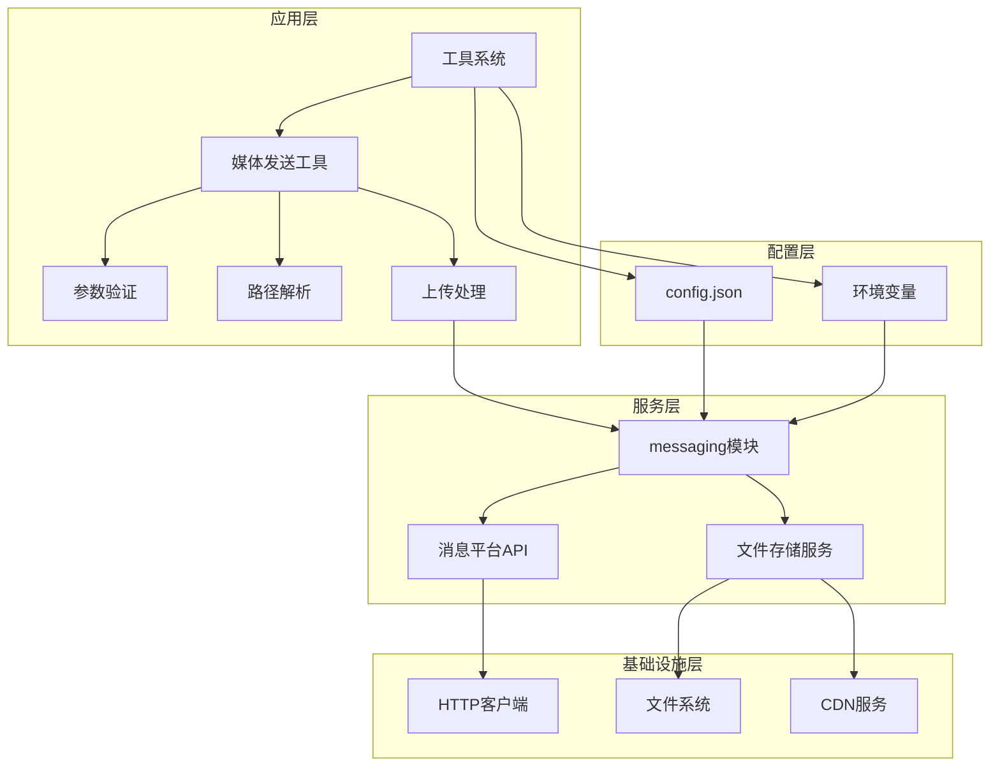
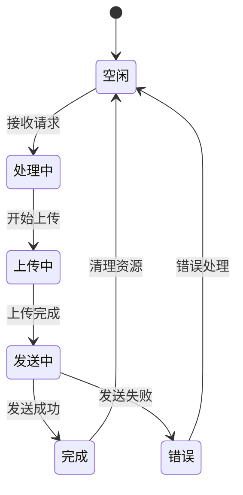

# 媒体发送工具

<cite>
**本文档引用的文件**
- [README.md](file://README.md)
- [tools.py](file://tools.py)
- [xiaowang.py](file://xiaowang.py)
- [llm.py](file://llm.py)
- [router.py](file://router.py)
- [config.example.json](file://config.example.json)
</cite>

## 目录
1. [简介](#简介)
2. [项目结构](#项目结构)
3. [核心组件](#核心组件)
4. [架构概览](#架构概览)
5. [详细组件分析](#详细组件分析)
6. [依赖关系分析](#依赖关系分析)
7. [性能考虑](#性能考虑)
8. [故障排除指南](#故障排除指南)
9. [结论](#结论)

## 简介

媒体发送工具是7/24 Office AI代理系统中的重要组成部分，提供了四种核心的媒体发送能力：send_image图片发送、send_file文件发送、send_video视频发送和send_link链接卡片发送。这些工具通过统一的消息平台API与企业微信等消息平台集成，实现了多媒体内容的高效传输和处理。

该系统采用零框架依赖的设计理念，完全基于Python标准库构建，支持24/7不间断运行，具备自修复、多租户路由、内存管理等高级特性。媒体发送工具作为26个内置工具之一，为用户提供了一个完整的多媒体通信解决方案。

## 项目结构

7/24 Office系统采用模块化设计，主要包含以下核心文件：

**图表来源**
- [README.md:23-66](file://README.md#L23-L66)
- [tools.py:1-800](file://tools.py#L1-L800)

**章节来源**
- [README.md:1-162](file://README.md#L1-L162)
- [config.example.json:1-61](file://config.example.json#L1-L61)

## 核心组件

媒体发送工具系统由四个核心工具组成，每个工具都经过精心设计以支持不同的媒体类型和使用场景：

### 工具注册与架构

系统采用装饰器模式进行工具注册，所有工具都通过统一的注册机制进行管理：

**图表来源**
- [tools.py:36-74](file://tools.py#L36-L74)
- [tools.py:264-302](file://tools.py#L264-L302)

### 工具参数定义

每个媒体发送工具都遵循统一的参数规范：

| 工具名称 | 必需参数 | 可选参数 | 支持类型 |
|---------|---------|---------|----------|
| send_image | path | caption | 图片URL/本地路径 |
| send_file | path | caption | 文件URL/本地路径 |
| send_video | path | caption | 视频URL/本地路径 |
| send_link | title, desc, link_url | icon_url | 链接卡片 |

**章节来源**
- [tools.py:266-301](file://tools.py#L266-L301)

## 架构概览

媒体发送工具的架构设计体现了高内聚、低耦合的设计原则，通过清晰的职责分离实现了高效的媒体处理流程：

**图表来源**
- [tools.py:270-301](file://tools.py#L270-L301)
- [xiaowang.py:59-70](file://xiaowang.py#L59-L70)

### 处理流程详解

媒体发送工具的处理流程包含多个关键步骤：

1. **参数验证**：检查必需参数的有效性
2. **路径解析**：区分HTTP URL和本地文件路径
3. **媒体上传**：通过消息平台API上传文件
4. **状态检查**：验证上传结果和发送状态
5. **错误处理**：统一的异常捕获和错误报告

**章节来源**
- [tools.py:264-302](file://tools.py#L264-L302)
- [xiaowang.py:383-465](file://xiaowang.py#L383-L465)

## 详细组件分析

### send_image 图片发送工具

send_image工具专门用于发送图片内容，支持多种图片格式和灵活的输入方式。

#### 参数规格

| 参数名 | 类型 | 必需 | 描述 | 示例 |
|-------|------|------|------|------|
| path | string | ✓ | 图片URL或本地文件路径 | "https://example.com/image.jpg" 或 "/path/to/local/image.png" |
| caption | string | ✗ | 图片标题说明 | "这是美丽的日出照片" |

#### 支持的媒体类型

- JPEG/JPG
- PNG
- GIF
- WEBP
- BMP

#### 上传机制

**图表来源**
- [tools.py:270-272](file://tools.py#L270-L272)
- [tools.py:306-314](file://tools.py#L306-L314)

**章节来源**
- [tools.py:266-272](file://tools.py#L266-L272)

### send_file 文件发送工具

send_file工具提供通用的文件发送功能，支持各种类型的文件格式。

#### 参数规格

| 参数名 | 类型 | 必需 | 描述 | 支持的文件类型 |
|-------|------|------|------|---------------|
| path | string | ✓ | 文件URL或本地路径 | PDF, DOC, XLS, PPT, ZIP, RAR等 |
| caption | string | ✗ | 文件描述说明 | 文本说明 |

#### 支持的文件类型

- 文档类：PDF, DOC, DOCX, XLS, XLSX, PPT, PPTX
- 压缩包：ZIP, RAR, 7Z
- 其他：TXT, CSV, XML, JSON

#### 上传机制

文件发送工具采用统一的上传流程，确保不同类型文件的一致处理体验。

**章节来源**
- [tools.py:275-281](file://tools.py#L275-L281)

### send_video 视频发送工具

send_video工具专为视频内容设计，优化了大文件的处理和传输。

#### 参数规格

| 参数名 | 类型 | 必需 | 描述 | 示例 |
|-------|------|------|------|------|
| path | string | ✓ | 视频URL或本地MP4路径 | "https://example.com/video.mp4" |
| caption | string | ✗ | 视频描述说明 | "会议录制视频" |

#### 支持的媒体类型

- MP4
- 其他消息平台支持的视频格式

#### 性能优化

视频发送工具特别优化了大文件处理，采用流式传输和断点续传机制。

**章节来源**
- [tools.py:284-290](file://tools.py#L284-L290)

### send_link 链接卡片发送工具

send_link工具用于发送富文本链接卡片，提供更好的用户体验。

#### 参数规格

| 参数名 | 类型 | 必需 | 描述 | 示例 |
|-------|------|------|------|------|
| title | string | ✓ | 卡片标题 | "GitHub项目" |
| desc | string | ✓ | 卡片描述 | "开源项目的详细介绍" |
| link_url | string | ✓ | 点击跳转URL | "https://github.com/example/project" |
| icon_url | string | ✗ | 卡片图标URL | "https://example.com/icon.png" |

#### 功能特性

- 富文本显示效果
- 自定义图标支持
- 响应式布局适配

**章节来源**
- [tools.py:293-301](file://tools.py#L293-L301)

## 依赖关系分析

媒体发送工具的依赖关系体现了清晰的分层架构设计：

**图表来源**
- [tools.py:80-82](file://tools.py#L80-L82)
- [xiaowang.py:59-66](file://xiaowang.py#L59-L66)

### 关键依赖关系

1. **工具注册依赖**：所有媒体工具都依赖于统一的工具注册系统
2. **消息平台依赖**：通过messaging模块与外部消息平台集成
3. **配置管理依赖**：从config.json读取运行时配置
4. **文件系统依赖**：访问本地文件系统进行媒体处理

**章节来源**
- [tools.py:80-82](file://tools.py#L80-L82)
- [xiaowang.py:39-46](file://xiaowang.py#L39-L46)

## 性能考虑

媒体发送工具在设计时充分考虑了性能优化，采用了多种策略来提升系统的响应速度和资源利用率：

### 并发处理

系统采用线程安全的设计，每个会话都有独立的锁机制，确保并发操作的安全性：

### 缓存策略

- **临时文件缓存**：HTTP下载的媒体文件保存在/tmp目录
- **会话状态缓存**：避免重复的网络请求
- **配置缓存**：减少频繁的配置读取操作

### 资源管理

- **内存限制**：控制单次处理的内存使用量
- **超时控制**：设置合理的网络请求超时时间
- **连接池**：复用HTTP连接，减少建立连接的开销

## 故障排除指南

### 常见问题及解决方案

#### 1. 媒体文件上传失败

**症状**：工具返回"[error] Send failed"错误

**可能原因**：
- 网络连接不稳定
- 文件大小超过限制
- 文件格式不支持
- 权限不足

**解决步骤**：
1. 检查网络连接状态
2. 验证文件格式是否受支持
3. 确认文件大小未超过限制
4. 检查目标用户的权限设置

#### 2. HTTP URL无法访问

**症状**：下载远程文件时出现超时或404错误

**解决方法**：
- 验证URL的正确性和可访问性
- 检查防火墙和代理设置
- 确认服务器允许跨域访问

#### 3. 本地文件路径错误

**症状**：找不到指定的本地文件

**解决方法**：
- 使用绝对路径而非相对路径
- 确认文件存在且具有读取权限
- 检查工作空间目录的正确性

### 调试技巧

1. **启用详细日志**：查看系统日志了解详细的错误信息
2. **验证配置**：确认config.json中的消息平台配置正确
3. **测试网络**：使用curl命令测试URL的可访问性
4. **检查权限**：验证文件系统权限设置

**章节来源**
- [tools.py:63-74](file://tools.py#L63-L74)
- [xiaowang.py:573-578](file://xiaowang.py#L573-L578)

## 结论

媒体发送工具系统展现了优秀的软件工程实践，通过模块化设计、清晰的职责分离和完善的错误处理机制，为用户提供了稳定可靠的多媒体通信能力。

### 主要优势

1. **统一接口**：四种工具共享相同的参数规范和错误处理机制
2. **灵活配置**：支持多种媒体格式和自定义配置选项
3. **高可用性**：具备完善的错误处理和重试机制
4. **性能优化**：采用多种策略提升系统响应速度

### 技术特色

- 零框架依赖的设计理念
- 多租户路由支持
- 内存管理系统
- 自修复和诊断能力
- 多模态交互支持

该系统为构建企业级AI代理应用提供了坚实的技术基础，其设计理念和实现方式值得其他开发者学习和借鉴。