# 搜索工具

<cite>
**本文档引用的文件**
- [README.md](file://README.md)
- [tools.py](file://tools.py)
- [config.example.json](file://config.example.json)
- [llm.py](file://llm.py)
- [xiaowang.py](file://xiaowang.py)
- [router.py](file://router.py)
- [memory.py](file://memory.py)
- [scheduler.py](file://scheduler.py)
- [mcp_client.py](file://mcp_client.py)
</cite>

## 目录
1. [简介](#简介)
2. [项目结构](#项目结构)
3. [核心组件](#核心组件)
4. [架构概览](#架构概览)
5. [详细组件分析](#详细组件分析)
6. [依赖关系分析](#依赖关系分析)
7. [性能考虑](#性能考虑)
8. [故障排除指南](#故障排除指南)
9. [结论](#结论)

## 简介

7/24 Office 是一个生产级的AI代理系统，具备零框架依赖的纯Python实现。该系统包含26个内置工具，其中搜索工具是核心功能之一，提供了多引擎综合搜索能力。

本系统的核心特性包括：
- **工具使用循环** - 支持OpenAI兼容的函数调用，最多20次迭代
- **三层记忆系统** - 会话历史 + LLM压缩的长期记忆 + LanceDB向量检索
- **MCP/插件系统** - 通过JSON-RPC连接外部MCP服务器，支持热重载
- **运行时工具创建** - 代理可以编写、保存和加载新的Python工具
- **多租户路由器** - 基于Docker的自动配置，每个用户一个容器
- **Web搜索** - 多引擎（Tavily、网络搜索、GitHub、HuggingFace）的自动路由

## 项目结构

系统采用模块化设计，主要文件组织如下：

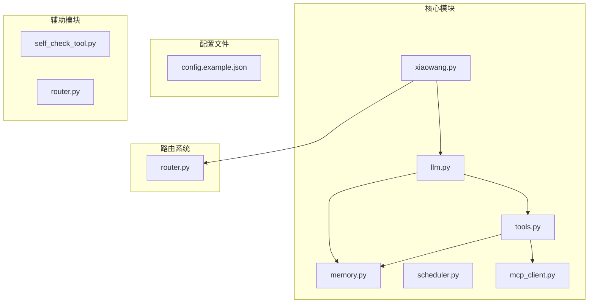

**图表来源**
- [xiaowang.py:1-626](file://xiaowang.py#L1-L626)
- [llm.py:1-401](file://llm.py#L1-L401)
- [tools.py:1-1153](file://tools.py#L1-L1153)

**章节来源**
- [README.md:1-162](file://README.md#L1-L162)
- [config.example.json:1-61](file://config.example.json#L1-L61)

## 核心组件

### 搜索工具架构

搜索工具位于 `tools.py` 文件中，实现了统一的搜索接口，支持多种搜索源的智能路由：

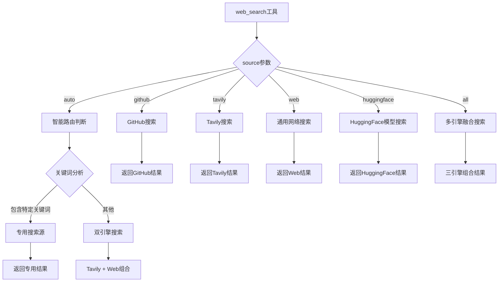

**图表来源**
- [tools.py:705-761](file://tools.py#L705-L761)

### 搜索源特点

| 搜索源 | 特点 | 适用场景 | 配置要求 |
|--------|------|----------|----------|
| Tavily | 高质量英文内容摘要 | 技术问题解答、学术搜索 | `tavily_api_key` |
| GitHub | 仓库优先策略 | 开源项目查找、代码搜索 | 无需额外配置 |
| HuggingFace | 模型信息获取 | AI模型查找、ML项目 | 无API密钥需求 |
| 通用Web | 标准网络搜索 | 一般性信息查询 | `search_api_key` |

**章节来源**
- [tools.py:548-761](file://tools.py#L548-L761)

## 架构概览

搜索工具在整个系统中的位置和交互关系：

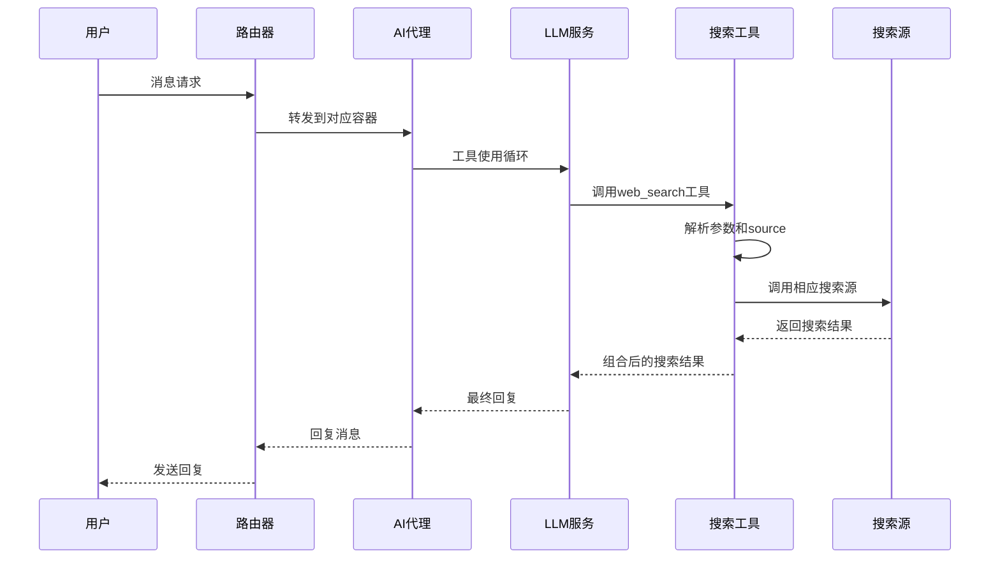

**图表来源**
- [xiaowang.py:489-588](file://xiaowang.py#L489-L588)
- [llm.py:317-400](file://llm.py#L317-L400)
- [tools.py:705-761](file://tools.py#L705-L761)

## 详细组件分析

### web_search工具实现

`web_search` 工具是搜索功能的核心入口，提供了灵活的参数配置和智能路由机制：

#### 参数配置

| 参数名 | 类型 | 必需 | 默认值 | 描述 |
|--------|------|------|--------|------|
| query | string | 是 | - | 搜索关键词 |
| source | string | 否 | "auto" | 搜索源类型 |
| count | integer | 否 | 5 | 结果数量 |

#### 智能路由机制

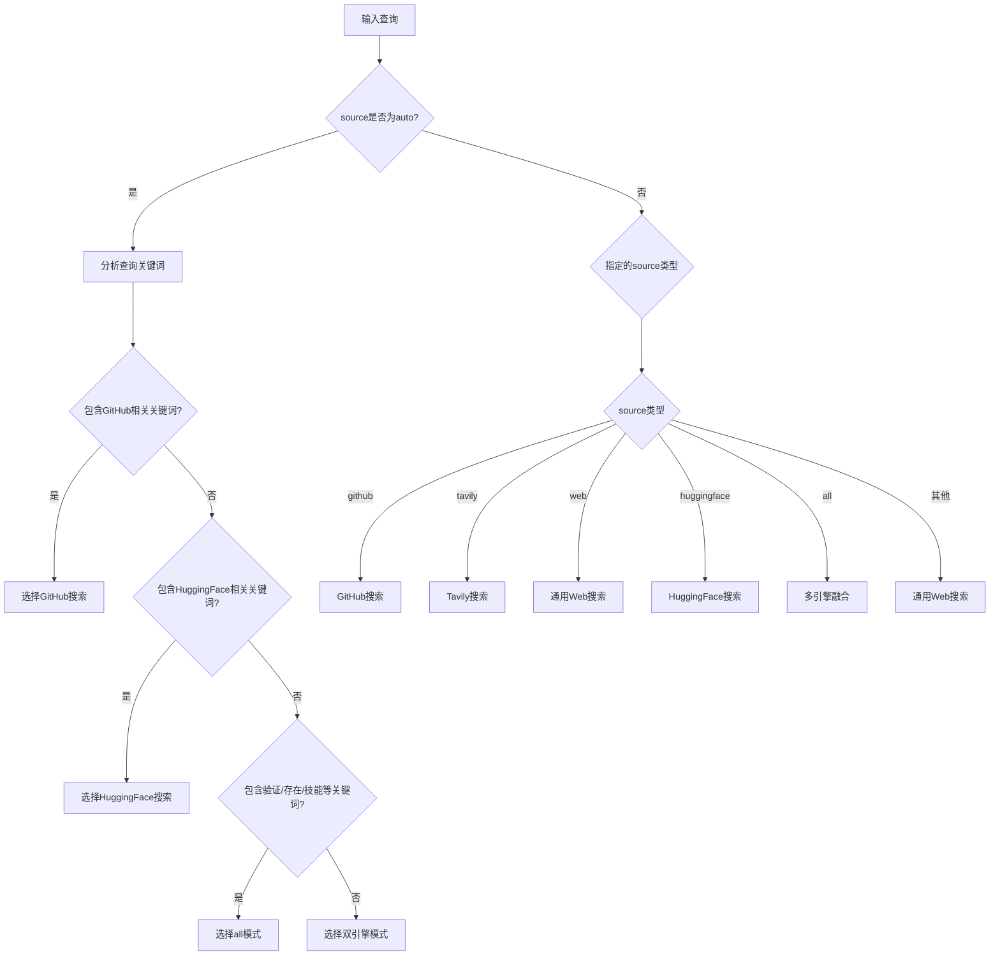

**图表来源**
- [tools.py:713-761](file://tools.py#L713-L761)

#### 搜索源实现

##### Tavily搜索引擎

Tavily搜索提供了高质量的英文内容摘要和链接：

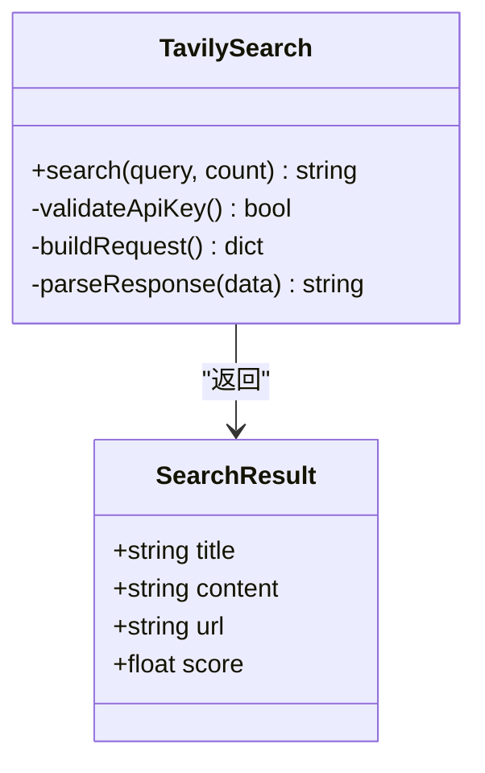

**图表来源**
- [tools.py:548-589](file://tools.py#L548-L589)

##### GitHub代码搜索

GitHub搜索采用了仓库优先策略，结合代码搜索进行补充：

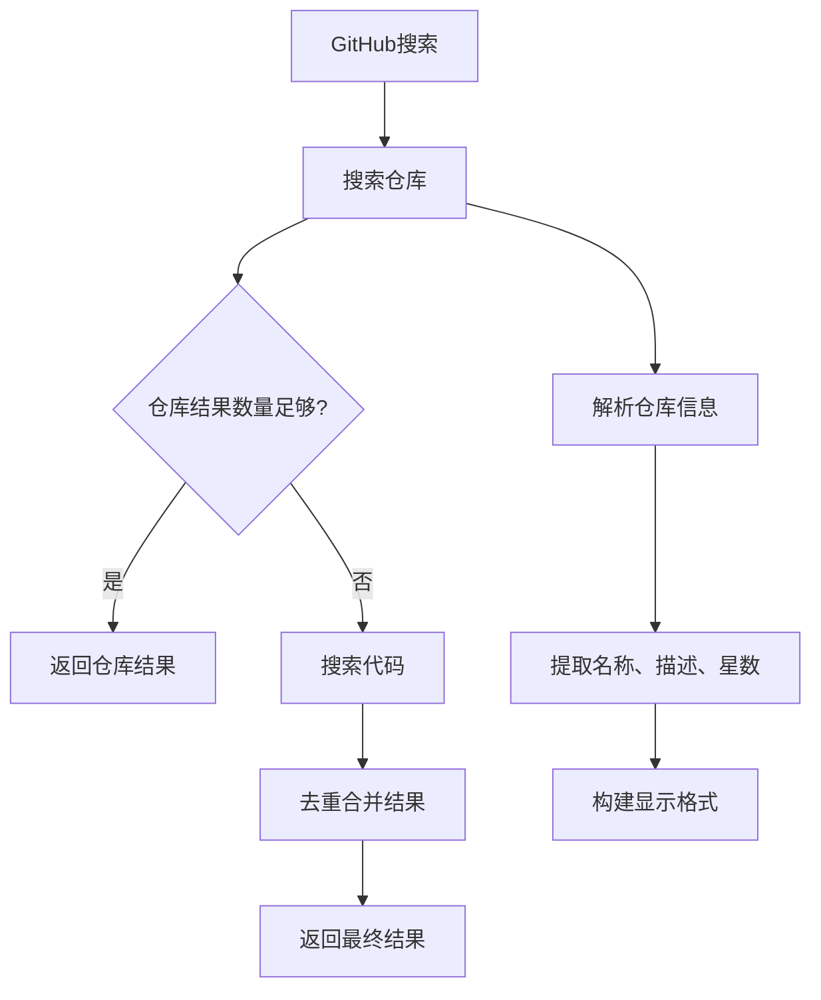

**图表来源**
- [tools.py:621-677](file://tools.py#L621-L677)

##### HuggingFace模型搜索

HuggingFace搜索专门用于AI模型的查找和信息获取：

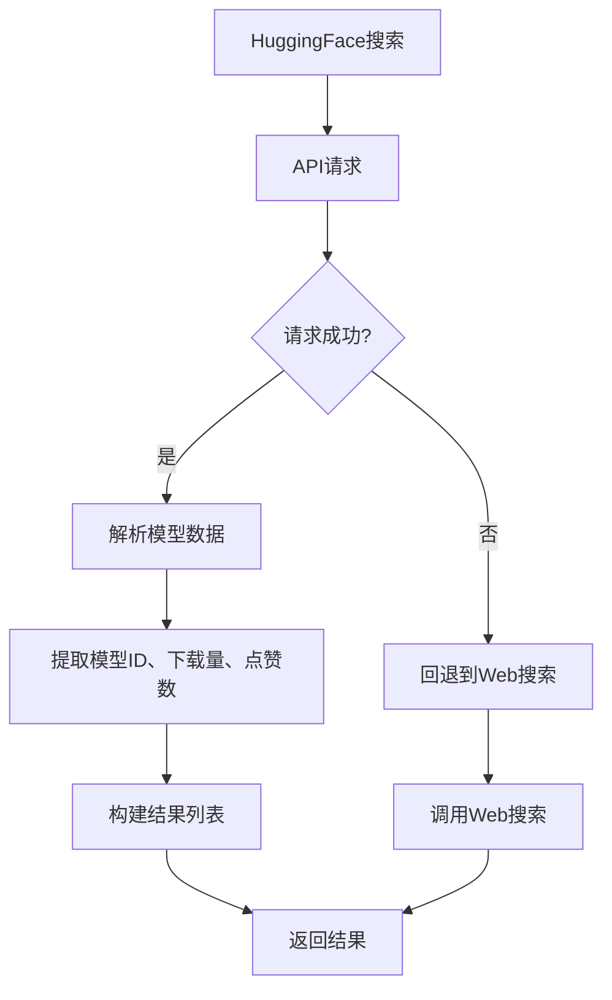

**图表来源**
- [tools.py:679-702](file://tools.py#L679-L702)

##### 通用网络搜索

通用网络搜索作为基础搜索能力，支持标准的Web搜索API：

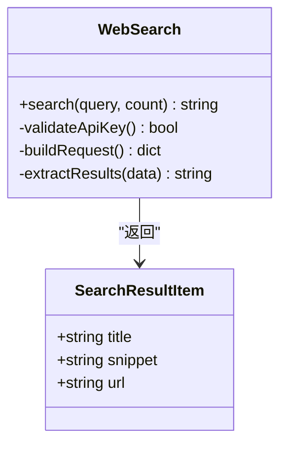

**图表来源**
- [tools.py:591-618](file://tools.py#L591-L618)

### 多引擎融合搜索

当source设置为"all"时，系统会同时调用多个搜索源并进行结果整合：

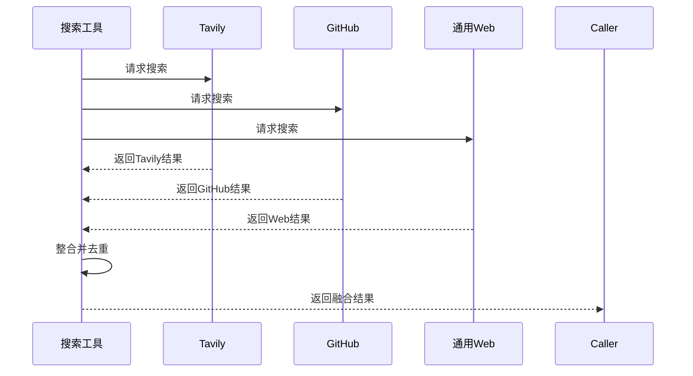

**图表来源**
- [tools.py:746-758](file://tools.py#L746-L758)

**章节来源**
- [tools.py:498-761](file://tools.py#L498-L761)

## 依赖关系分析

搜索工具与其他系统组件的依赖关系：

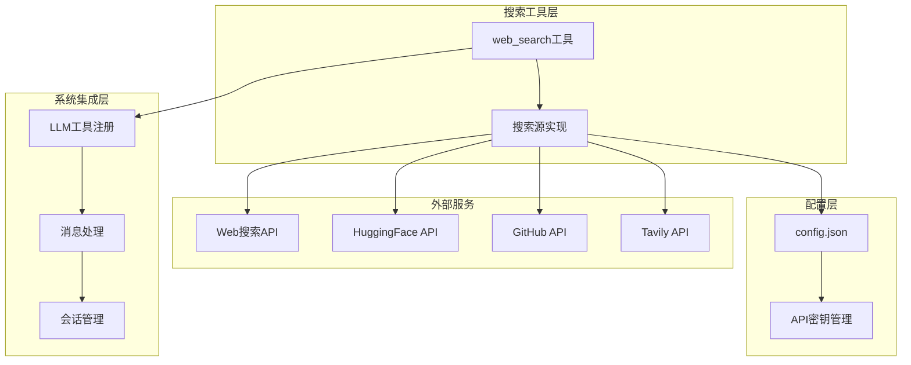

**图表来源**
- [tools.py:506-511](file://tools.py#L506-L511)
- [config.example.json:50-51](file://config.example.json#L50-L51)

### 配置管理

搜索工具通过 `init_extra` 函数接收配置信息：

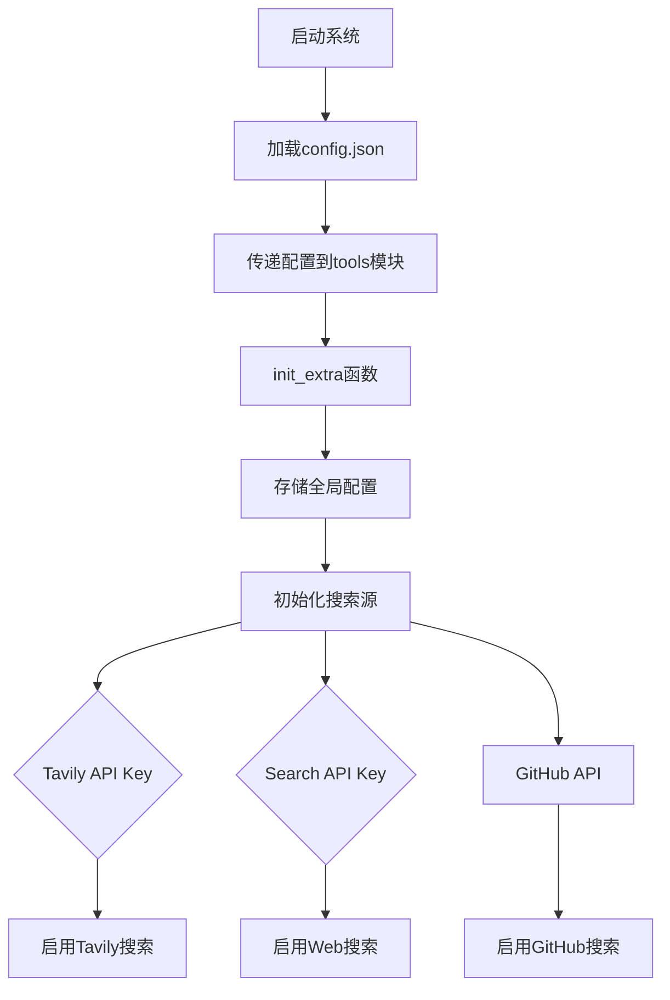

**图表来源**
- [tools.py:506-511](file://tools.py#L506-L511)
- [xiaowang.py:68-69](file://xiaowang.py#L68-L69)

**章节来源**
- [config.example.json:1-61](file://config.example.json#L1-L61)
- [tools.py:506-511](file://tools.py#L506-L511)

## 性能考虑

### 并发处理

搜索工具在多线程环境中安全运行，每个会话都有独立的锁机制：

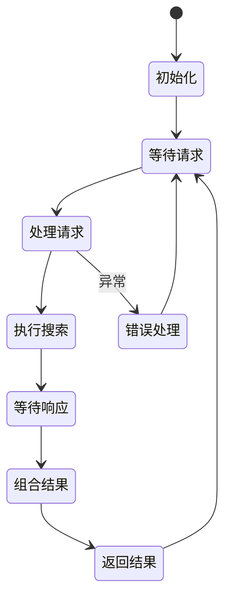

### 超时控制

各搜索源都设置了合理的超时时间：

| 搜索源 | 超时时间 | 错误处理 |
|--------|----------|----------|
| Tavily | 20秒 | 返回错误信息 |
| GitHub | 15秒 | 继续其他搜索源 |
| Web搜索 | 15秒 | 继续其他搜索源 |
| HuggingFace | 15秒 | 回退到Web搜索 |

### 内存优化

搜索结果采用流式处理，避免大量内存占用：

## 故障排除指南

### 常见问题及解决方案

#### API密钥配置错误

**问题症状**：搜索返回"API密钥未配置"错误

**解决步骤**：
1. 检查 `config.json` 中的API密钥配置
2. 确认密钥格式正确且有效
3. 重新启动系统应用新配置

#### 搜索超时

**问题症状**：搜索操作超时或响应缓慢

**解决步骤**：
1. 检查网络连接状态
2. 调整超时参数（如可能）
3. 尝试减少搜索关键词的复杂度
4. 检查外部服务的可用性

#### 结果为空

**问题症状**：搜索返回"未找到相关内容"

**解决步骤**：
1. 尝试更通用的搜索关键词
2. 检查是否需要特定的搜索源
3. 确认目标平台的可访问性
4. 查看系统日志获取更多错误信息

#### 智能路由错误

**问题症状**：搜索被路由到不合适的搜索源

**解决步骤**：
1. 明确指定 `source` 参数
2. 使用更精确的搜索关键词
3. 检查关键词与搜索源的匹配度

**章节来源**
- [tools.py:548-761](file://tools.py#L548-L761)

## 结论

7/24 Office 的搜索工具系统展现了高度的模块化设计和智能化路由能力。通过统一的接口抽象，系统能够灵活地集成多种搜索源，并根据查询内容自动选择最适合的搜索策略。

### 主要优势

1. **多引擎支持** - 同时支持Tavily、GitHub、HuggingFace和通用Web搜索
2. **智能路由** - 基于关键词分析的自动搜索源选择
3. **容错机制** - 各搜索源失败时的回退策略
4. **配置灵活** - 支持运行时配置和热重载
5. **性能优化** - 合理的超时控制和内存管理

### 应用场景

- **技术问答** - 利用Tavily的高质量摘要
- **开源项目查找** - GitHub仓库优先策略
- **AI模型搜索** - HuggingFace专业搜索
- **综合信息查询** - 多引擎融合搜索

该搜索工具系统为7/24 Office提供了强大的信息检索能力，是整个AI代理系统的重要基础设施。