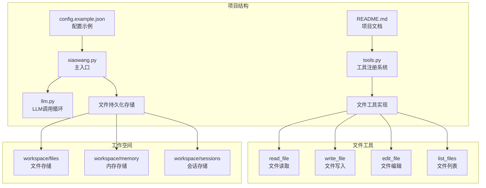
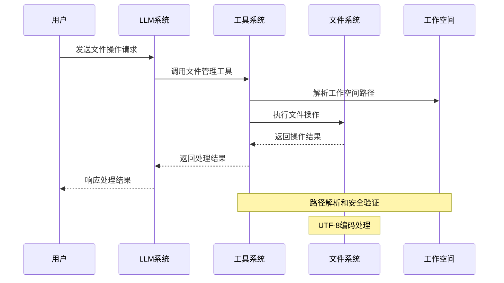
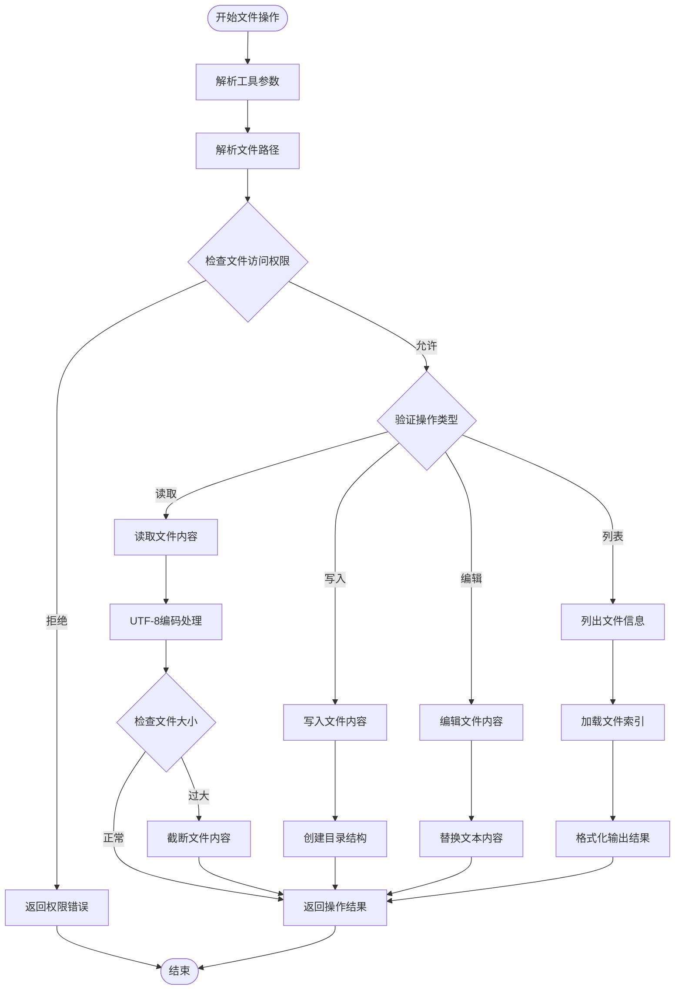
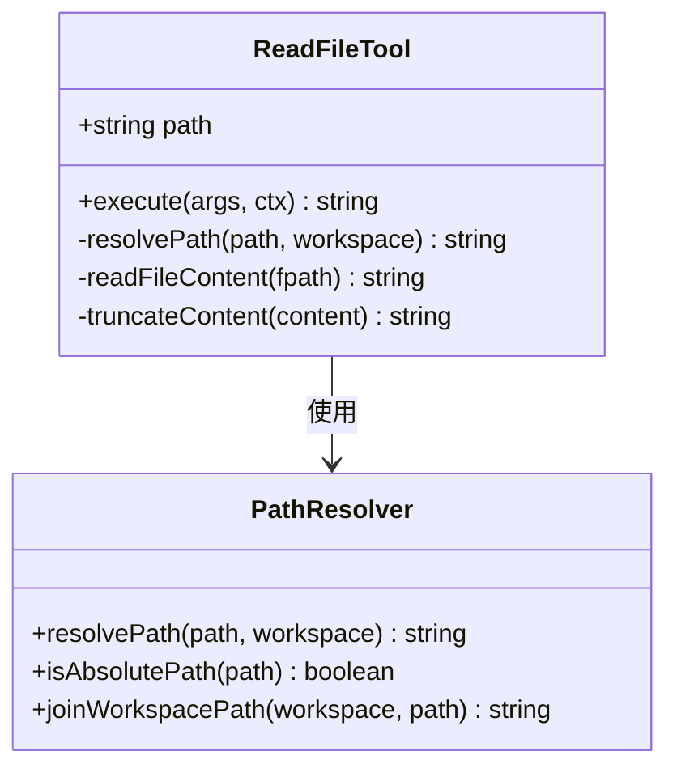
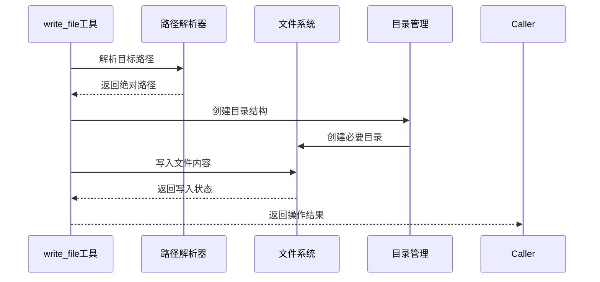
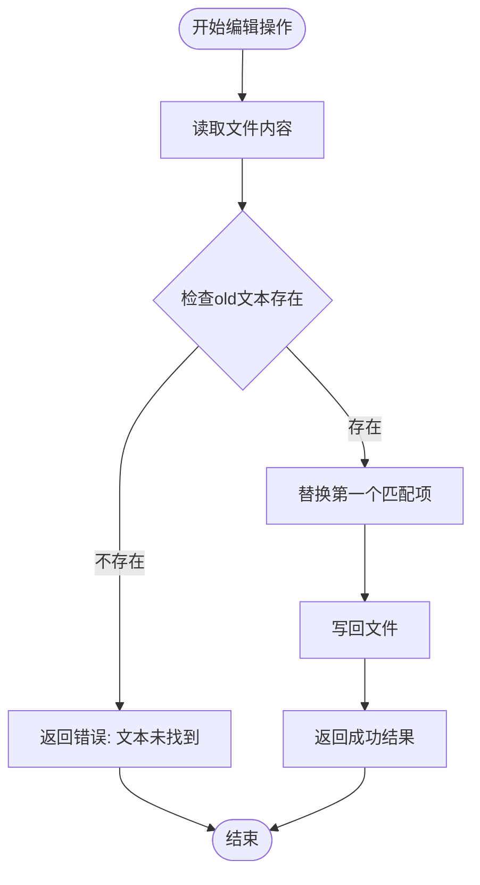
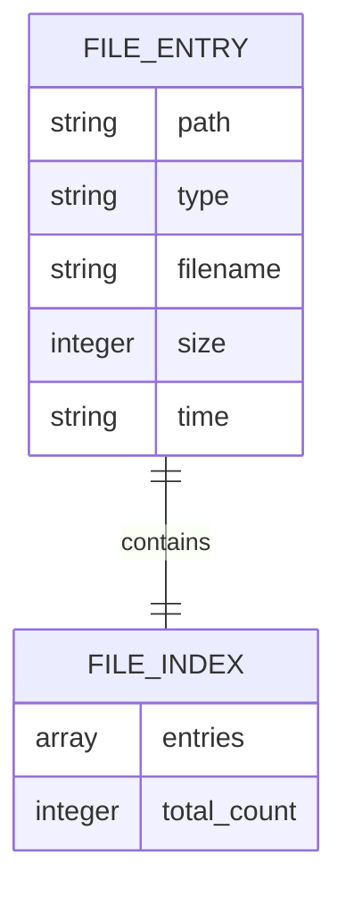
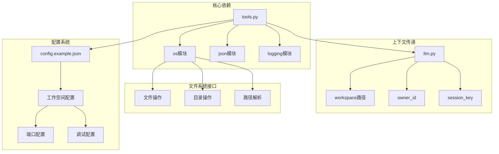
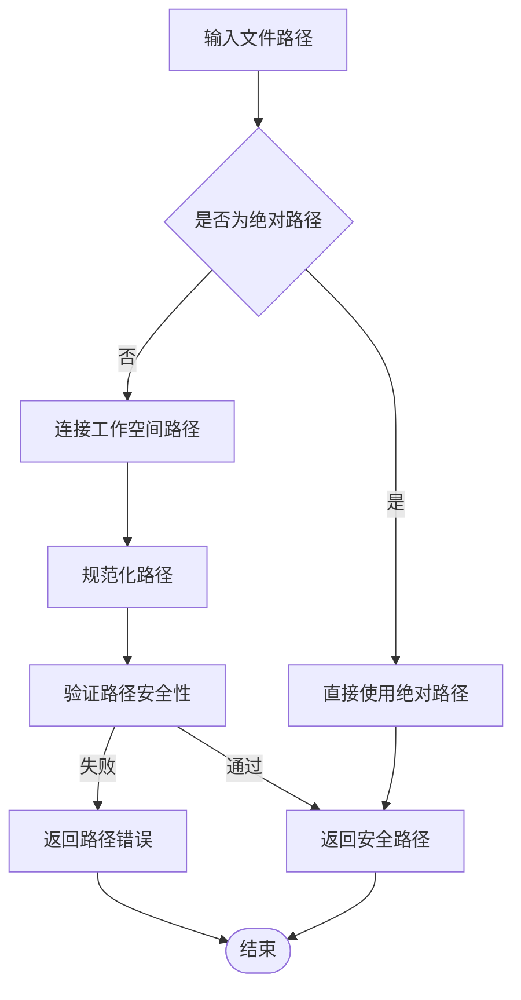

# 文件管理工具

<cite>
**本文档引用的文件**
- [README.md](file://README.md)
- [tools.py](file://tools.py)
- [llm.py](file://llm.py)
- [xiaowang.py](file://xiaowang.py)
- [config.example.json](file://config.example.json)
</cite>

## 目录
1. [简介](#简介)
2. [项目结构](#项目结构)
3. [核心组件](#核心组件)
4. [架构概览](#架构概览)
5. [详细组件分析](#详细组件分析)
6. [依赖关系分析](#依赖关系分析)
7. [性能考虑](#性能考虑)
8. [故障排除指南](#故障排除指南)
9. [结论](#结论)

## 简介

文件管理工具是7/24 Office AI代理系统中的重要组成部分，提供了四个核心的文件操作功能：`read_file`文件读取、`write_file`文件写入、`edit_file`文件编辑和`list_files`文件列表。这些工具允许AI代理与文件系统进行交互，支持相对路径和绝对路径的文件操作，具备完善的安全机制和错误处理策略。

该系统采用纯Python实现，无框架依赖，运行在标准库基础上，通过零配置的工具注册机制提供灵活的文件管理能力。

## 项目结构

7/24 Office项目采用模块化设计，文件管理工具位于核心的工具注册系统中：

**图表来源**
- [README.md:86-99](file://README.md#L86-L99)
- [tools.py:148-236](file://tools.py#L148-L236)
- [xiaowang.py:42-50](file://xiaowang.py#L42-L50)

**章节来源**
- [README.md:1-162](file://README.md#L1-L162)
- [tools.py:1-1153](file://tools.py#L1-L1153)
- [xiaowang.py:1-626](file://xiaowang.py#L1-L626)

## 核心组件

文件管理工具系统包含以下四个核心组件：

### 工具注册系统
- **装饰器模式**：使用`@tool`装饰器注册工具函数
- **动态加载**：支持运行时创建和加载新工具
- **OpenAI兼容**：工具定义符合OpenAI函数调用格式

### 路径解析机制
- **相对路径处理**：自动将相对路径解析到工作空间目录
- **绝对路径支持**：直接使用绝对路径访问文件系统
- **路径安全验证**：防止路径遍历攻击

### 编码处理系统
- **UTF-8编码**：统一使用UTF-8编码处理文件内容
- **字节长度计算**：基于UTF-8字节长度进行内容截断
- **多语言支持**：完整支持中文等多字节字符

**章节来源**
- [tools.py:36-74](file://tools.py#L36-L74)
- [tools.py:85-88](file://tools.py#L85-L88)
- [tools.py:150-164](file://tools.py#L150-L164)

## 架构概览

文件管理工具在整个系统架构中的位置和交互关系：

**图表来源**
- [llm.py:356-395](file://llm.py#L356-L395)
- [tools.py:85-88](file://tools.py#L85-L88)
- [tools.py:153-164](file://tools.py#L153-L164)

### 工具执行流程

**图表来源**
- [tools.py:150-235](file://tools.py#L150-L235)
- [tools.py:85-88](file://tools.py#L85-L88)

## 详细组件分析

### read_file 文件读取工具

#### 功能特性
- **文件读取**：从指定路径读取文件内容
- **大小限制**：超过10000字符自动截断
- **错误处理**：完善的异常捕获和错误报告
- **空文件处理**：识别并处理空文件情况

#### 参数定义
- **path** (必需): 文件路径，支持相对路径和绝对路径

#### 实现细节

**图表来源**
- [tools.py:150-164](file://tools.py#L150-L164)
- [tools.py:85-88](file://tools.py#L85-L88)

#### 安全考虑
- **路径解析**：使用工作空间前缀确保文件访问范围
- **大小限制**：防止大文件读取导致内存溢出
- **编码处理**：统一UTF-8编码避免乱码问题

**章节来源**
- [tools.py:150-164](file://tools.py#L150-L164)

### write_file 文件写入工具

#### 功能特性
- **文件创建**：支持创建新文件和覆盖现有文件
- **目录创建**：自动创建必要的目录结构
- **内容写入**：将字符串内容写入文件
- **字符计数**：统计写入的字符数量

#### 参数定义
- **path** (必需): 目标文件路径
- **content** (必需): 要写入的文件内容

#### 实现细节

**图表来源**
- [tools.py:167-179](file://tools.py#L167-L179)
- [tools.py:85-88](file://tools.py#L85-L88)

#### 权限控制
- **工作空间限制**：只能在工作空间目录内创建文件
- **目录权限**：确保父目录具有写入权限
- **文件存在性**：支持覆盖现有文件但不删除

**章节来源**
- [tools.py:167-179](file://tools.py#L167-L179)

### edit_file 文件编辑工具

#### 功能特性
- **文本替换**：在文件中查找并替换指定文本
- **精确匹配**：只替换第一个匹配项
- **存在性验证**：确保要替换的文本存在于文件中
- **原子操作**：读取-修改-写入的原子性保证

#### 参数定义
- **path** (必需): 目标文件路径
- **old** (必需): 要被替换的原始文本
- **new** (必需): 替换后的新文本

#### 实现逻辑

**图表来源**
- [tools.py:182-202](file://tools.py#L182-L202)

#### 错误处理策略
- **文件不存在**：捕获并报告文件未找到错误
- **文本不存在**：明确提示要替换的文本不在文件中
- **IO异常**：处理磁盘空间不足等IO错误

**章节来源**
- [tools.py:182-202](file://tools.py#L182-L202)

### list_files 文件列表工具

#### 功能特性
- **文件索引查询**：从文件索引中获取文件信息
- **类型过滤**：支持按文件类型过滤（image/video/file/voice/gif）
- **结果限制**：支持限制返回的文件数量
- **排序显示**：按时间倒序显示最近的文件

#### 参数定义
- **type** (可选): 文件类型过滤器
- **limit** (可选): 结果数量限制，默认20

#### 数据结构

**图表来源**
- [tools.py:205-235](file://tools.py#L205-L235)

#### 输出格式
- **统计信息**：显示总文件数和当前过滤条件下的数量
- **文件详情**：包含文件名、大小、时间戳和完整路径
- **格式化显示**：友好的人类可读格式

**章节来源**
- [tools.py:205-235](file://tools.py#L205-L235)

## 依赖关系分析

文件管理工具与其他系统组件的依赖关系：

**图表来源**
- [tools.py:19-26](file://tools.py#L19-L26)
- [llm.py:357](file://llm.py#L357)
- [config.example.json:24-26](file://config.example.json#L24-L26)

### 路径安全机制

**图表来源**
- [tools.py:85-88](file://tools.py#L85-L88)

**章节来源**
- [tools.py:85-88](file://tools.py#L85-L88)
- [llm.py:357](file://llm.py#L357)

## 性能考虑

### 内存管理
- **读取限制**：read_file工具对大文件进行截断，防止内存溢出
- **流式处理**：对于超大文件建议分块处理
- **缓存策略**：合理利用系统文件缓存机制

### I/O优化
- **批量操作**：多个文件操作建议合并执行
- **异步处理**：大文件操作建议异步执行
- **磁盘I/O**：避免频繁的小文件读写操作

### 编码效率
- **UTF-8优化**：统一UTF-8编码减少转换开销
- **字节计算**：使用字节长度而非字符长度提高性能
- **缓冲区管理**：合理设置文件读写缓冲区大小

## 故障排除指南

### 常见错误及解决方案

#### 路径相关错误
- **错误**：`[error] file not found: /path/to/file`
- **原因**：文件不存在或路径解析失败
- **解决**：检查文件路径是否正确，确认文件权限

#### 权限相关错误
- **错误**：`[error] permission denied`
- **原因**：没有足够的文件系统权限
- **解决**：检查工作空间目录权限，确保有读写权限

#### 编码相关错误
- **错误**：`UnicodeDecodeError`
- **原因**：文件编码与预期不符
- **解决**：确认文件使用UTF-8编码，或调整编码设置

#### 大小限制错误
- **现象**：read_file返回截断内容
- **原因**：文件内容超过10000字符限制
- **解决**：使用list_files查看完整文件大小，必要时分块处理

**章节来源**
- [tools.py:158-164](file://tools.py#L158-L164)
- [tools.py:193-202](file://tools.py#L193-L202)

### 调试技巧

1. **启用日志**：检查系统日志获取详细错误信息
2. **路径验证**：使用list_files确认文件存在性
3. **权限检查**：验证工作空间目录权限设置
4. **编码验证**：确认文件编码格式一致性

## 结论

文件管理工具系统为7/24 Office AI代理提供了强大而安全的文件操作能力。通过精心设计的路径解析机制、严格的权限控制和完善的错误处理策略，确保了文件操作的安全性和可靠性。

### 主要优势
- **安全性**：严格的工作空间限制和路径验证
- **易用性**：简洁的API设计和清晰的错误信息
- **可靠性**：完善的异常处理和恢复机制
- **扩展性**：模块化的架构支持功能扩展

### 最佳实践建议
1. **路径管理**：优先使用相对路径，避免硬编码绝对路径
2. **错误处理**：始终检查工具返回值，处理可能的异常情况
3. **资源管理**：注意文件大小限制，合理规划文件操作
4. **安全意识**：定期审查工作空间权限，确保最小权限原则

该文件管理工具系统为AI代理的文件操作需求提供了坚实的基础，支持从简单的文件读写到复杂的文件管理任务，是整个AI代理生态系统的重要组成部分。