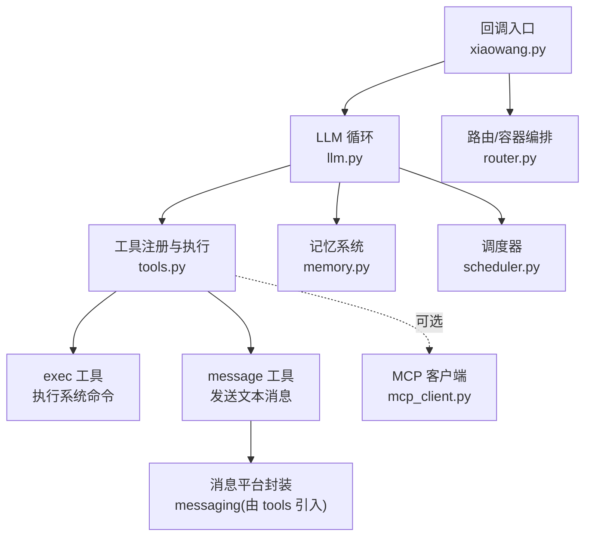
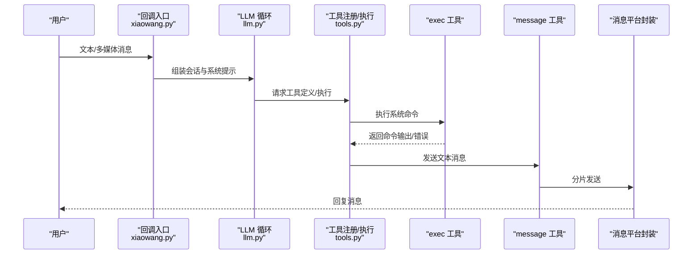
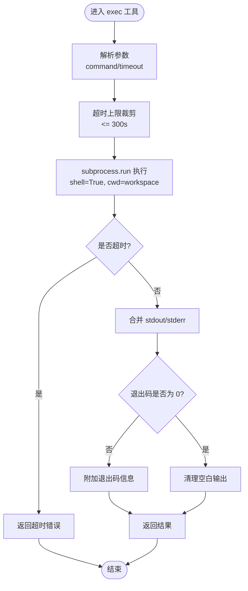
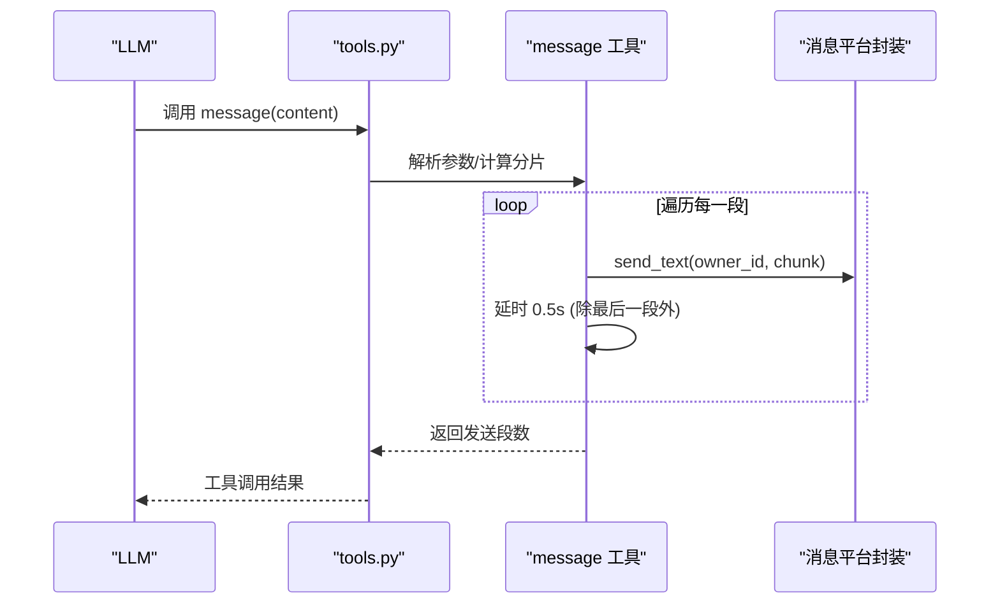
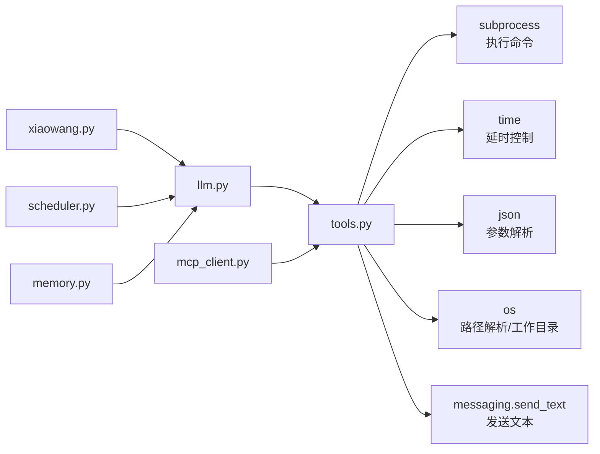

# 核心工具

<cite>
**本文档引用的文件**
- [tools.py](file://tools.py)
- [llm.py](file://llm.py)
- [xiaowang.py](file://xiaowang.py)
- [mcp_client.py](file://mcp_client.py)
- [router.py](file://router.py)
- [scheduler.py](file://scheduler.py)
- [memory.py](file://memory.py)
- [config.example.json](file://config.example.json)
</cite>

## 目录
1. [简介](#简介)
2. [项目结构](#项目结构)
3. [核心组件](#核心组件)
4. [架构总览](#架构总览)
5. [详细组件分析](#详细组件分析)
6. [依赖分析](#依赖分析)
7. [性能考虑](#性能考虑)
8. [故障排查指南](#故障排查指南)
9. [结论](#结论)

## 简介
本文件聚焦于两个最基础且关键的工具：exec 系统命令执行工具与 message 消息发送工具。它们在 AI 助手系统中承担“执行”和“通信”的双重基础职责，支撑着从日常对话到自动化运维、从即时通知到跨会话上下文桥接的完整链路。

- exec 工具负责在受控工作目录下以受限方式执行系统命令，支持超时控制与输出整合，是系统自检、日志清理、资源监控等任务的“执行器”。
- message 工具负责向所有者发送文本消息，内置分片与延时策略，确保长文本可靠送达，是调度任务通知与系统报告的“通信器”。

## 项目结构
该系统围绕“回调入口 -> 会话管理 -> LLM 推理 -> 工具调用 -> 结果回传”的循环展开，核心文件如下：
- 入口与回调：xiaowang.py
- LLM 调用与会话：llm.py
- 工具注册与实现：tools.py
- 消息平台封装：messaging（由 tools.py 引入）
- 外部 MCP 服务器集成：mcp_client.py
- 调度器：scheduler.py
- 内存系统：memory.py
- 配置示例：config.example.json

图表来源
- [xiaowang.py:1-120](file://xiaowang.py#L1-L120)
- [llm.py:317-401](file://llm.py#L317-L401)
- [tools.py:58-146](file://tools.py#L58-L146)
- [mcp_client.py:272-334](file://mcp_client.py#L272-L334)
- [scheduler.py:30-80](file://scheduler.py#L30-L80)
- [memory.py:40-120](file://memory.py#L40-L120)
- [router.py:390-425](file://router.py#L390-L425)

章节来源
- [xiaowang.py:1-120](file://xiaowang.py#L1-L120)
- [llm.py:317-401](file://llm.py#L317-L401)
- [tools.py:58-146](file://tools.py#L58-L146)

## 核心组件
本节对 exec 与 message 两大工具进行深入解析，涵盖参数、行为、安全与使用场景，并给出在 LLM 对话中的调用示例路径与最佳实践。

- exec 工具
  - 参数
    - command：必填，待执行的 shell 命令字符串
    - timeout：可选，超时秒数，默认 60，最大 300
  - 行为
    - 在工作目录（ctx.workspace）下以 shell 执行
    - 捕获标准输出与标准错误，合并返回
    - 返回非零退出码时附加退出码信息
    - 超时则返回超时错误提示
  - 安全与限制
    - 使用 subprocess.run 并设置 shell=True，但限定超时与工作目录
    - 建议仅在受信任的命令上使用，避免危险操作
    - 建议配合最小权限原则与白名单策略
  - 使用场景
    - 日常诊断（如查看日志、磁盘占用）
    - 资源清理（临时文件、缓存）
    - 简单运维脚本（需谨慎）

- message 工具
  - 参数
    - content：必填，要发送的文本内容
  - 行为
    - 将内容按 UTF-8 字节上限 1800 进行行级切分
    - 逐段通过 messaging.send_text 发送
    - 多段之间插入 0.5 秒延时，降低平台限流风险
  - 安全与限制
    - 仅发送纯文本，不包含图片/文件等多媒体
    - 依赖 messaging 层的鉴权与限流配置
  - 使用场景
    - 调度任务触发后的通知
    - 自检报告的汇总发送
    - 与 llm 的 tool_use 循环结合，形成“汇报-执行-反馈”的闭环

章节来源
- [tools.py:110-131](file://tools.py#L110-L131)
- [tools.py:134-145](file://tools.py#L134-L145)
- [tools.py:91-105](file://tools.py#L91-L105)
- [xiaowang.py:291-305](file://xiaowang.py#L291-L305)

## 架构总览
exec 与 message 在系统中的位置如下：

图表来源
- [xiaowang.py:340-362](file://xiaowang.py#L340-L362)
- [llm.py:356-395](file://llm.py#L356-L395)
- [tools.py:58-74](file://tools.py#L58-L74)
- [tools.py:110-131](file://tools.py#L110-L131)
- [tools.py:134-145](file://tools.py#L134-L145)

## 详细组件分析

### exec 工具详解
- 实现要点
  - 参数校验与超时裁剪：默认 60s，最大 300s
  - 工作目录约束：在 ctx.workspace 下执行，避免越权访问
  - 输出整合：stdout 与 stderr 合并，非零退出码附带状态
  - 超时处理：捕获 TimeoutExpired 并返回明确错误
- 安全与合规
  - 建议在配置中限制可用命令清单，或通过白名单前置校验
  - 对敏感路径与系统命令进行拦截
  - 记录命令与输出，便于审计
- 性能与稳定性
  - 合理设置 timeout，避免长时间阻塞
  - 对可能产生大量输出的命令，建议先截断或重定向到文件再读取

图表来源
- [tools.py:110-131](file://tools.py#L110-L131)

章节来源
- [tools.py:110-131](file://tools.py#L110-L131)

### message 工具详解
- 实现要点
  - 分片策略：按行拼接，超过 1800 字节即切分
  - 发送节奏：多段之间延时 0.5 秒，降低平台限流风险
  - 结果统计：返回发送的段数，便于确认完整性
- 与会话系统的协作
  - 在 llm 的 tool_use 循环中，assistant 生成 tool_calls，message 工具作为最终“汇报”手段
  - 与 scheduler 协作：定时任务触发后，message 用于向所有者发送通知
- 错误处理
  - 若某一段发送失败，当前实现不会回滚已发送段，建议上层在业务层面记录并重试

图表来源
- [tools.py:134-145](file://tools.py#L134-L145)
- [tools.py:91-105](file://tools.py#L91-L105)
- [xiaowang.py:291-305](file://xiaowang.py#L291-L305)

章节来源
- [tools.py:134-145](file://tools.py#L134-L145)
- [tools.py:91-105](file://tools.py#L91-L105)
- [xiaowang.py:291-305](file://xiaowang.py#L291-L305)

### 在 LLM 对话中的调用示例与最佳实践
以下示例均以“代码片段路径”形式给出，避免直接粘贴具体代码：

- 示例一：使用 exec 查看磁盘占用并汇报
  - 步骤
    - LLM 判断需要诊断磁盘空间
    - 生成 tool_calls：exec(command="df -h", timeout=60)
    - 执行后将输出通过 message 工具发送给所有者
  - 参考路径
    - [llm.py:384-395](file://llm.py#L384-L395)
    - [tools.py:110-131](file://tools.py#L110-L131)
    - [tools.py:134-145](file://tools.py#L134-L145)

- 示例二：使用 message 发送长文本报告
  - 步骤
    - LLM 生成自检报告（可能很长）
    - 调用 message(content=报告文本)，自动分片并延时发送
  - 参考路径
    - [tools.py:134-145](file://tools.py#L134-L145)
    - [tools.py:91-105](file://tools.py#L91-L105)

- 最佳实践
  - 对 exec：严格限制命令范围，必要时增加前缀校验；对大输出命令，优先写入临时文件再读取
  - 对 message：对超长文本进行摘要化处理，减少分片数量；对关键通知增加去重与幂等
  - 错误处理：在 llm 循环中捕获工具异常并返回友好提示；对网络波动采用指数退避重试

章节来源
- [llm.py:384-395](file://llm.py#L384-L395)
- [tools.py:110-131](file://tools.py#L110-L131)
- [tools.py:134-145](file://tools.py#L134-L145)

## 依赖分析
exec 与 message 的依赖关系如下：

图表来源
- [tools.py:19-26](file://tools.py#L19-L26)
- [tools.py:80-83](file://tools.py#L80-L83)
- [llm.py:17-17](file://llm.py#L17-L17)
- [xiaowang.py:59-76](file://xiaowang.py#L59-L76)
- [mcp_client.py:14-21](file://mcp_client.py#L14-L21)

章节来源
- [tools.py:19-26](file://tools.py#L19-L26)
- [tools.py:80-83](file://tools.py#L80-L83)
- [llm.py:17-17](file://llm.py#L17-L17)
- [xiaowang.py:59-76](file://xiaowang.py#L59-L76)
- [mcp_client.py:14-21](file://mcp_client.py#L14-L21)

## 性能考虑
- exec
  - 超时设置直接影响响应时间与资源占用，建议根据命令类型合理分配
  - 大输出命令应避免直接打印到 stdout，改用临时文件并限制读取长度
- message
  - 分片大小与延时可平衡吞吐与限流风险，可根据平台能力调整
  - 多段发送时建议记录每段的发送状态，便于后续重试与审计

## 故障排查指南
- exec 常见问题
  - 命令超时：检查 timeout 设置与命令复杂度；必要时拆分为多个短命令
  - 权限不足：确认执行用户与工作目录权限；避免使用 root 或高权限账户
  - 输出过大：命令输出被截断或内存溢出，建议重定向到文件
- message 常见问题
  - 分片未达预期：确认文本编码与字节上限；必要时调整分片阈值
  - 发送失败：检查消息平台鉴权与配额；对失败段进行重试
- 系统级问题
  - LLM 调用异常：查看 llm.py 中的 HTTP 错误日志与超时配置
  - 调度任务未触发：核对 scheduler 的 cron 配置与时间偏移

章节来源
- [llm.py:74-82](file://llm.py#L74-L82)
- [tools.py:130-131](file://tools.py#L130-L131)
- [scheduler.py:130-168](file://scheduler.py#L130-L168)

## 结论
exec 与 message 是 AI 助手系统中最基础也最关键的两类工具：前者提供“执行能力”，后者提供“通信能力”。通过严格的参数校验、超时控制与分片策略，二者在保证安全性的同时，实现了稳定可靠的自动化闭环。在实际部署中，建议结合配置文件与调度器，形成“诊断-汇报-执行”的自愈体系，并持续优化分片与延时策略以适配不同消息平台的限流规则。