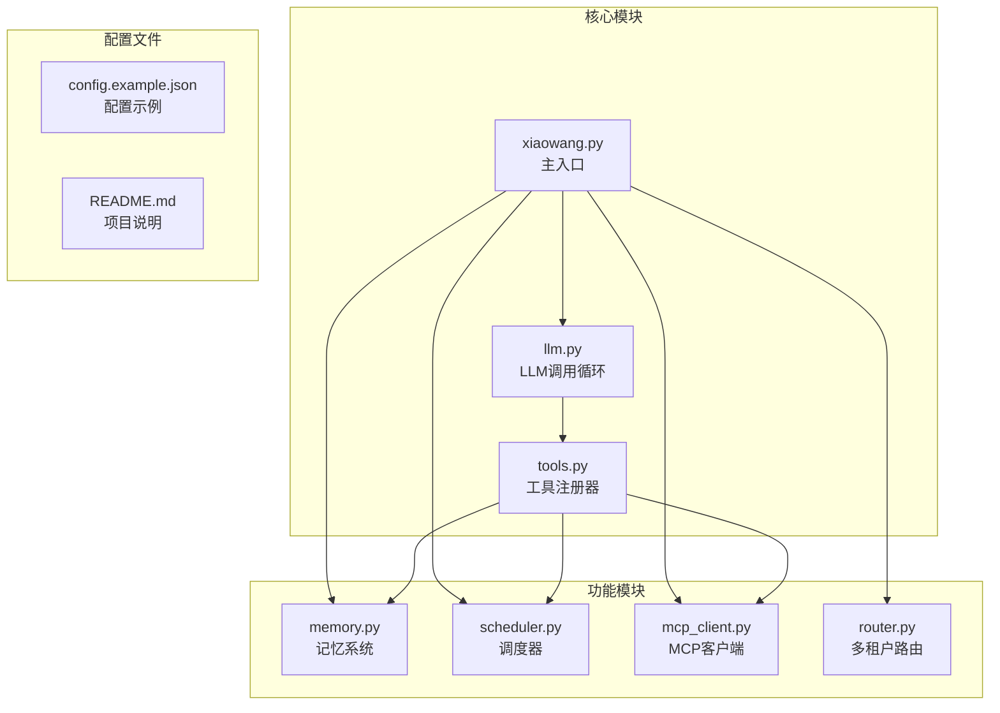
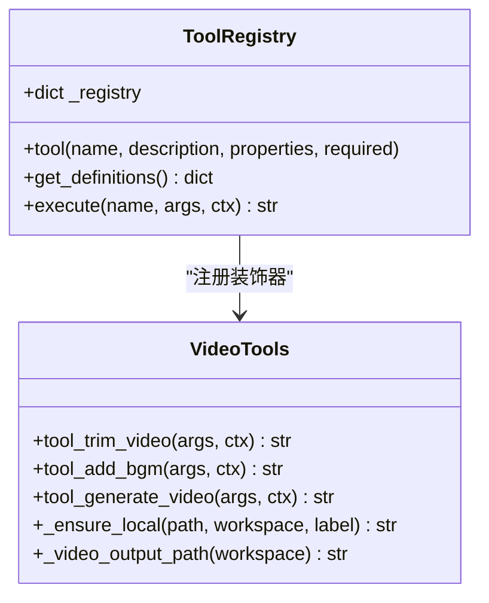
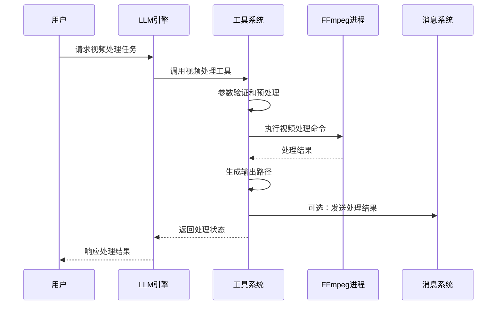
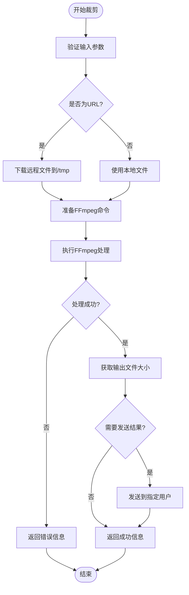
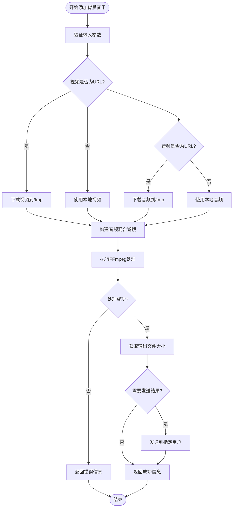
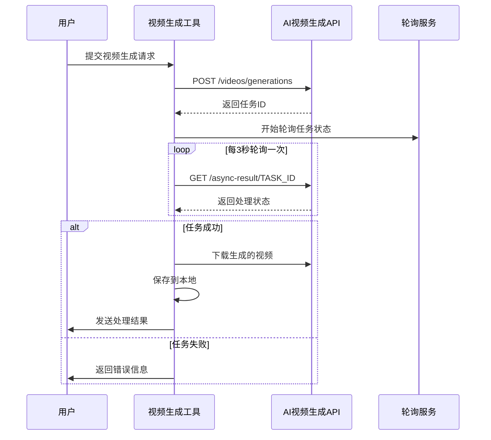
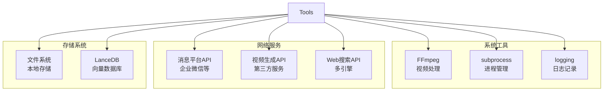
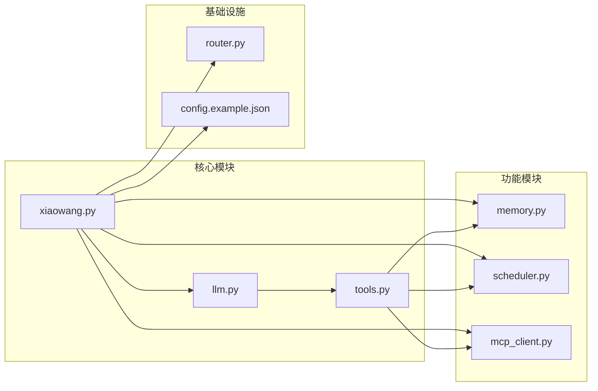
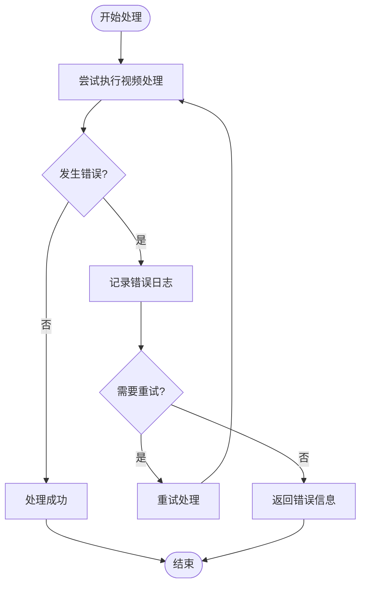

# 视频处理工具

<cite>
**本文档引用的文件**
- [README.md](file://README.md)
- [tools.py](file://tools.py)
- [config.example.json](file://config.example.json)
- [xiaowang.py](file://xiaowang.py)
- [llm.py](file://llm.py)
- [memory.py](file://memory.py)
- [scheduler.py](file://scheduler.py)
- [mcp_client.py](file://mcp_client.py)
- [router.py](file://router.py)
</cite>

## 目录
1. [简介](#简介)
2. [项目结构](#项目结构)
3. [核心组件](#核心组件)
4. [架构概览](#架构概览)
5. [详细组件分析](#详细组件分析)
6. [依赖关系分析](#依赖关系分析)
7. [性能考虑](#性能考虑)
8. [故障排除指南](#故障排除指南)
9. [结论](#结论)

## 简介

7/24 Office 是一个基于纯Python开发的生产级AI代理系统，具备零框架依赖特性。该系统包含26个内置工具，其中视频处理工具是其核心功能之一。本文档专注于三个视频处理工具：`trim_video`（视频裁剪）、`add_bgm`（添加背景音乐）和`generate_video`（视频生成）。

这些工具通过FFmpeg进行底层视频处理，支持本地文件和HTTP URL两种输入方式，提供毫秒级快速处理能力。系统还集成了消息发送工具，可以自动将处理结果发送给指定的接收者。

## 项目结构

该系统采用模块化设计，主要文件组织如下：



**图表来源**
- [xiaowang.py:1-626](file://xiaowang.py#L1-L626)
- [llm.py:1-401](file://llm.py#L1-L401)
- [tools.py:1-1153](file://tools.py#L1-L1153)

**章节来源**
- [README.md:1-162](file://README.md#L1-L162)
- [config.example.json:1-61](file://config.example.json#L1-L61)

## 核心组件

### 工具注册系统

系统采用装饰器模式实现工具注册，所有工具都通过统一的注册机制管理：



**图表来源**
- [tools.py:36-74](file://tools.py#L36-L74)
- [tools.py:326-496](file://tools.py#L326-L496)

### 视频处理工具架构

三个视频处理工具共享相同的基础架构模式：

- **输入验证**：检查必需参数和数据类型
- **资源准备**：处理本地文件和远程URL
- **FFmpeg执行**：构建并执行视频处理命令
- **结果处理**：生成输出路径和可选的消息发送

**章节来源**
- [tools.py:304-496](file://tools.py#L304-L496)

## 架构概览

系统采用分层架构设计，视频处理工具位于应用层，通过工具注册器暴露给LLM调用循环：



**图表来源**
- [llm.py:317-401](file://llm.py#L317-L401)
- [tools.py:63-74](file://tools.py#L63-L74)

## 详细组件分析

### trim_video 视频裁剪工具

#### 功能概述
`trim_video`工具提供高效的视频裁剪功能，支持毫秒级快速处理，无需重新编码视频流。

#### 参数定义

| 参数名 | 类型 | 必需 | 描述 |
|--------|------|------|------|
| input_path | string | 是 | 输入视频文件路径（本地或HTTP URL） |
| start | string | 是 | 开始时间，支持HH:MM:SS格式或秒数 |
| end | string | 否 | 结束时间（可选，默认到视频末尾） |
| send_to | string | 否 | 处理完成后发送给指定用户的标识符 |

#### FFmpeg命令构建

工具使用 `-c copy` 参数实现无损复制，确保处理速度：

```bash
ffmpeg -y -ss START_TIME -to END_TIME -i INPUT_PATH -c:v copy -c:a copy -avoid_negative_ts make_zero OUTPUT_PATH
```

#### 处理流程



**图表来源**
- [tools.py:326-358](file://tools.py#L326-L358)

#### 使用示例

1. **基本裁剪**
   ```
   {
     "input_path": "https://example.com/video.mp4",
     "start": "00:01:30",
     "end": "00:03:45"
   }
   ```

2. **从指定时间开始到结尾**
   ```
   {
     "input_path": "/path/to/local/video.mp4",
     "start": "00:05:00"
   }
   ```

3. **带发送功能**
   ```
   {
     "input_path": "video.mp4",
     "start": "00:02:15",
     "end": "00:04:30",
     "send_to": "user_123"
   }
   ```

**章节来源**
- [tools.py:326-358](file://tools.py#L326-L358)

### add_bgm 添加背景音乐工具

#### 功能概述
`add_bgm`工具在现有视频基础上添加背景音乐，通过音频轨道混合实现，保持视频流不重新编码。

#### 参数定义

| 参数名 | 类型 | 必需 | 描述 |
|--------|------|------|------|
| video_path | string | 是 | 输入视频文件路径（本地或HTTP URL） |
| audio_path | string | 是 | 音频文件路径（mp3/wav/aac），本地或HTTP URL |
| volume | number | 否 | 背景音乐音量比例，默认0.3（30%） |
| send_to | string | 否 | 处理完成后发送给指定用户的标识符 |

#### FFmpeg命令构建

工具使用复杂的滤镜链实现音频混合：

```bash
ffmpeg -y -i VIDEO_PATH -i AUDIO_PATH -filter_complex "[1:a]volume=VOLUME[bgm];[0:a][bgm]amix=inputs=2:duration=first[a]" -map 0:v -map "[a]" -c:v copy -c:a aac OUTPUT_PATH
```

#### 处理流程



**图表来源**
- [tools.py:361-396](file://tools.py#L361-L396)

#### 使用示例

1. **基础背景音乐添加**
   ```
   {
     "video_path": "video.mp4",
     "audio_path": "background_music.mp3",
     "volume": 0.25
   }
   ```

2. **高音量背景音乐**
   ```
   {
     "video_path": "movie.mp4",
     "audio_path": "ambient_sound.wav",
     "volume": 0.5,
     "send_to": "user_456"
   }
   ```

**章节来源**
- [tools.py:361-396](file://tools.py#L361-L396)

### generate_video 视频生成工具

#### 功能概述
`generate_video`工具通过AI视频生成API创建视频内容，支持异步任务处理，通常需要2-5分钟完成。

#### 参数定义

| 参数名 | 类型 | 必需 | 描述 |
|--------|------|------|------|
| prompt | string | 是 | 视频内容描述（越详细越好） |
| size | string | 否 | 视频分辨率，默认1280x720 |
| send_to | string | 否 | 处理完成后发送给指定用户的标识符 |

#### API交互流程



**图表来源**
- [tools.py:399-496](file://tools.py#L399-L496)

#### 使用示例

1. **简单场景生成**
   ```
   {
     "prompt": "一个美丽的日落海滩，海浪轻柔地拍打着沙滩，夕阳西下时天空呈现橙红色渐变",
     "size": "1280x720"
   }
   ```

2. **复杂场景描述**
   ```
   {
     "prompt": "动画风格的城市夜景，霓虹灯闪烁，高楼大厦林立，街道上有行人和车辆，远处有摩天轮在夜空中旋转",
     "size": "1920x1080"
   }
   ```

**章节来源**
- [tools.py:399-496](file://tools.py#L399-L496)

## 依赖关系分析

### 外部依赖

系统依赖以下外部工具和服务：



**图表来源**
- [tools.py:19-26](file://tools.py#L19-L26)
- [config.example.json:45-49](file://config.example.json#L45-L49)

### 内部模块依赖



**图表来源**
- [xiaowang.py:59-76](file://xiaowang.py#L59-L76)
- [llm.py:17-39](file://llm.py#L17-L39)

**章节来源**
- [tools.py:19-26](file://tools.py#L19-L26)
- [config.example.json:45-49](file://config.example.json#L45-L49)

## 性能考虑

### 处理速度优化

1. **无重新编码策略**
   - `trim_video`使用 `-c copy` 参数实现毫秒级快速裁剪
   - `add_bgm`仅混合音频轨道，保持视频流不变
   - 这些优化避免了耗时的重新编码过程

2. **并发处理**
   - 工具调用循环支持最多20次迭代
   - 每个会话使用线程锁保证安全性
   - 异步任务（视频生成）避免阻塞主线程

3. **内存管理**
   - 远程文件下载到 `/tmp/` 目录
   - 处理完成后自动清理临时文件
   - 文件索引系统避免重复处理

### 存储优化

1. **文件组织结构**
   - 输出文件按年月目录组织
   - 自动生成唯一文件名避免冲突
   - 支持多种媒体类型的分类存储

2. **缓存机制**
   - 记忆系统提供长期存储
   - 向量数据库加速检索
   - 零延迟缓存用于硬件通道

**章节来源**
- [tools.py:326-358](file://tools.py#L326-L358)
- [tools.py:361-396](file://tools.py#L361-L396)
- [tools.py:399-496](file://tools.py#L399-L496)

## 故障排除指南

### 常见问题及解决方案

#### FFmpeg相关错误

1. **FFmpeg不可用**
   - 确保系统已安装FFmpeg
   - 检查FFmpeg版本兼容性
   - 验证FFmpeg权限设置

2. **输入文件格式不支持**
   - 确认输入文件格式受支持
   - 尝试转换为标准格式（MP4）
   - 检查文件完整性

#### 网络连接问题

1. **远程文件下载失败**
   - 检查网络连接稳定性
   - 验证URL有效性
   - 确认防火墙设置允许访问

2. **API调用超时**
   - 检查API密钥配置
   - 验证API服务可用性
   - 调整超时参数设置

#### 内存和存储问题

1. **磁盘空间不足**
   - 清理临时文件目录
   - 检查存储配额限制
   - 定期清理旧文件

2. **内存使用过高**
   - 监控内存使用情况
   - 调整批量处理大小
   - 实施内存回收机制

### 错误处理机制



**图表来源**
- [tools.py:63-74](file://tools.py#L63-L74)

**章节来源**
- [tools.py:63-74](file://tools.py#L63-L74)

## 结论

7/24 Office的视频处理工具系统展现了优秀的工程实践：

1. **模块化设计**：清晰的工具注册机制和独立的功能模块
2. **性能优化**：无重新编码策略和并发处理能力
3. **可靠性保障**：完善的错误处理和重试机制
4. **扩展性**：支持自定义工具和插件系统

这三个视频处理工具（`trim_video`、`add_bgm`、`generate_video`）提供了完整的视频处理解决方案，从基础的视频编辑到高级的AI生成，满足不同层次的视频处理需求。系统的设计理念体现了"零框架依赖"和"单文件工具"的特点，使得功能扩展和维护变得异常简单。

通过合理的参数设计、FFmpeg命令构建和错误处理机制，这些工具能够在生产环境中稳定运行，为用户提供高质量的视频处理服务。