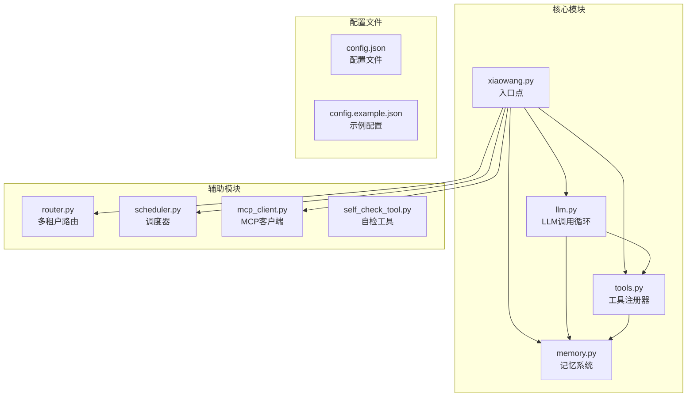
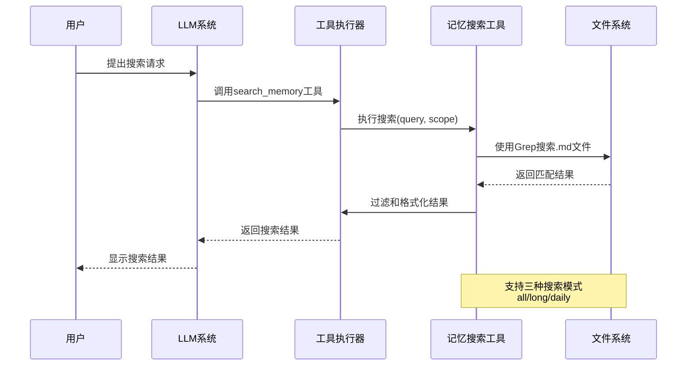
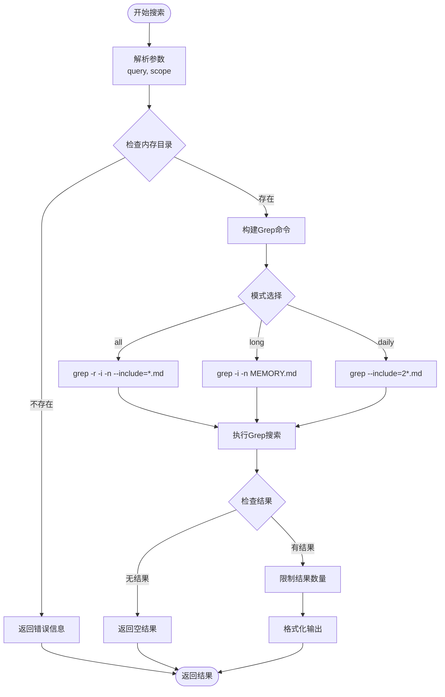
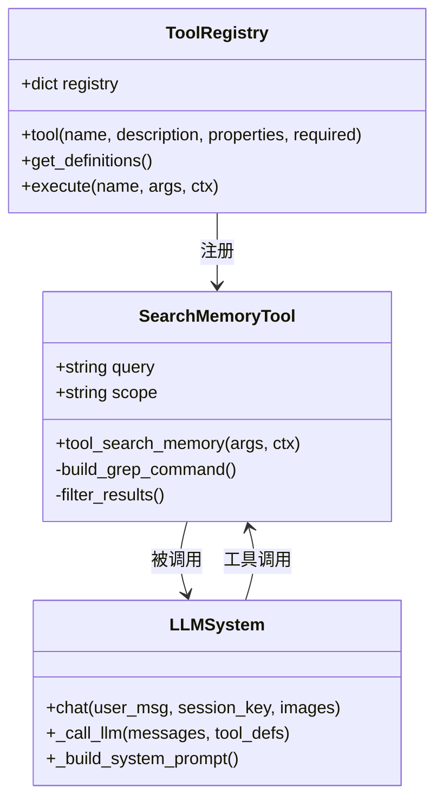
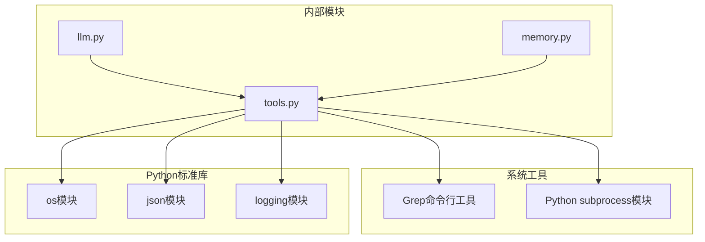

# 记忆搜索工具

<cite>
**本文档引用的文件**
- [README.md](file://README.md)
- [memory.py](file://memory.py)
- [tools.py](file://tools.py)
- [llm.py](file://llm.py)
- [xiaowang.py](file://xiaowang.py)
- [config.example.json](file://config.example.json)
</cite>

## 目录
1. [简介](#简介)
2. [项目结构](#项目结构)
3. [核心组件](#核心组件)
4. [架构概览](#架构概览)
5. [详细组件分析](#详细组件分析)
6. [依赖关系分析](#依赖关系分析)
7. [性能考虑](#性能考虑)
8. [故障排除指南](#故障排除指南)
9. [结论](#结论)

## 简介

记忆搜索工具(search_memory)是7/24 Office AI代理系统中的一个关键组件，专门用于在记忆文件中进行关键词搜索。该工具提供了三种不同的搜索模式：全局搜索(all)、长期记忆搜索(long)和每日日志搜索(daily)，能够高效地在workspace/memory/目录下的Markdown文件中查找相关信息。

该工具采用Grep搜索实现，支持大小写不敏感的关键词匹配，并且具有智能的结果过滤机制。通过与LLM工具使用循环的集成，记忆搜索工具能够在对话过程中为用户提供准确的记忆检索能力。

## 项目结构

7/24 Office是一个基于纯Python开发的生产级AI代理系统，包含以下主要模块：



**图表来源**
- [xiaowang.py:59-76](file://xiaowang.py#L59-L76)
- [llm.py:17-18](file://llm.py#L17-L18)
- [tools.py:33-56](file://tools.py#L33-L56)

**章节来源**
- [README.md:23-66](file://README.md#L23-L66)
- [xiaowang.py:59-76](file://xiaowang.py#L59-L76)

## 核心组件

### 记忆搜索工具功能概述

记忆搜索工具(search_memory)是26个内置工具之一，专门设计用于在记忆文件中进行关键词搜索。该工具的核心功能包括：

- **多模式搜索**：支持全局搜索、长期记忆搜索和每日日志搜索三种模式
- **Grep集成**：利用系统Grep命令进行高效的文本搜索
- **智能过滤**：自动过滤无关结果，提供高质量的搜索体验
- **错误处理**：完善的异常处理机制，确保系统稳定性

### 参数定义

记忆搜索工具接受以下参数：

| 参数名 | 类型 | 必需 | 描述 | 默认值 |
|--------|------|------|------|--------|
| query | string | 是 | 搜索关键词，支持空格分隔的多个关键词 | - |
| scope | string | 否 | 搜索范围，可选值：all(全局)、long(长期记忆)、daily(每日日志) | all |

### 搜索模式详解

#### 全局搜索(all)
- 搜索范围：workspace/memory/目录下所有.md文件
- 匹配规则：大小写不敏感，支持多个关键词组合
- 结果限制：最多显示30个匹配项，超出部分会被截断

#### 长期记忆搜索(long)
- 搜索范围：仅搜索MEMORY.md文件
- 使用场景：检索长期记忆中的特定信息
- 性能优势：搜索范围受限，速度更快

#### 每日日志搜索(daily)
- 搜索范围：workspace/memory/目录下以2开头的.md文件
- 文件命名：符合YYYY-MM-DD格式的日期文件
- 时间范围：仅搜索当前日期的日志文件

**章节来源**
- [tools.py:764-801](file://tools.py#L764-L801)

## 架构概览

记忆搜索工具在整个系统架构中扮演着重要的角色，它与LLM工具使用循环紧密集成：



**图表来源**
- [tools.py:764-801](file://tools.py#L764-L801)
- [llm.py:317-401](file://llm.py#L317-L401)

### 记忆文件组织结构

记忆文件按照以下结构组织：

```
workspace/
└── memory/
    ├── MEMORY.md          # 长期记忆文件
    ├── 2024-01-15.md      # 每日日志 - 2024年1月15日
    ├── 2024-01-16.md      # 每日日志 - 2024年1月16日
    └── 2024-01-17.md      # 每日日志 - 2024年1月17日
```

每个记忆文件都包含用户与AI代理的对话历史，以及相关的任务和决策记录。

**章节来源**
- [tools.py:764-801](file://tools.py#L764-L801)
- [llm.py:317-401](file://llm.py#L317-L401)

## 详细组件分析

### Grep搜索实现

记忆搜索工具采用系统级Grep命令实现高效的文本搜索：



**图表来源**
- [tools.py:770-801](file://tools.py#L770-L801)

### 结果过滤机制

搜索结果经过多层过滤和格式化：

1. **数量限制**：最多显示30个匹配项
2. **格式化**：将原始Grep输出转换为易读的格式
3. **统计信息**：显示总匹配数和显示数量

### 错误处理策略

记忆搜索工具实现了完善的错误处理机制：

- **目录不存在**：检查workspace/memory/目录是否存在
- **文件不存在**：long模式下检查MEMORY.md文件
- **搜索失败**：捕获Grep命令执行异常
- **超时处理**：设置10秒超时限制

**章节来源**
- [tools.py:764-801](file://tools.py#L764-L801)

### 与LLM工具使用循环的集成

记忆搜索工具与LLM系统深度集成：



**图表来源**
- [tools.py:36-74](file://tools.py#L36-L74)
- [tools.py:764-801](file://tools.py#L764-L801)
- [llm.py:317-401](file://llm.py#L317-L401)

**章节来源**
- [tools.py:36-74](file://tools.py#L36-L74)
- [llm.py:317-401](file://llm.py#L317-L401)

## 依赖关系分析

### 外部依赖

记忆搜索工具依赖以下外部组件：



**图表来源**
- [tools.py:19-26](file://tools.py#L19-L26)
- [tools.py:764-801](file://tools.py#L764-L801)

### 内部模块依赖

记忆搜索工具与其他模块的依赖关系：

- **工具注册器**：通过@tool装饰器注册
- **运行时上下文**：访问工作空间和会话信息
- **文件系统**：读取记忆文件内容

**章节来源**
- [tools.py:19-26](file://tools.py#L19-L26)
- [tools.py:36-74](file://tools.py#L36-L74)

## 性能考虑

### 搜索性能优化

记忆搜索工具在设计时充分考虑了性能因素：

1. **Grep命令优化**：
   - 使用`-r`参数递归搜索
   - 使用`-i`参数忽略大小写
   - 使用`-n`参数显示行号
   - 限制文件类型为.md

2. **结果限制**：
   - 最多显示30个匹配项
   - 自动截断多余结果
   - 提供总数统计

3. **超时控制**：
   - 设置10秒超时限制
   - 防止长时间阻塞

### 存储优化

- **文件组织**：按日期组织日志文件，便于快速定位
- **索引机制**：依赖文件系统索引，无需额外索引维护
- **缓存策略**：结合LLM的零延迟缓存机制

## 故障排除指南

### 常见问题及解决方案

#### 1. 搜索结果为空
**可能原因**：
- 关键词拼写错误
- 记忆文件不存在
- 搜索范围设置不当

**解决方法**：
- 检查关键词拼写
- 确认记忆文件存在
- 调整搜索范围参数

#### 2. 搜索超时
**可能原因**：
- 搜索范围过大
- 文件数量过多
- 系统负载过高

**解决方法**：
- 缩小搜索范围到daily或long模式
- 清理不必要的记忆文件
- 等待系统资源空闲

#### 3. 权限错误
**可能原因**：
- 无权访问workspace/memory/目录
- 文件权限不足

**解决方法**：
- 检查目录权限
- 修改文件权限设置
- 联系系统管理员

### 调试技巧

1. **验证环境**：确认Grep命令可用
2. **检查路径**：验证workspace/memory/目录存在
3. **测试单文件**：使用long模式测试MEMORY.md文件
4. **查看日志**：检查系统日志中的错误信息

**章节来源**
- [tools.py:764-801](file://tools.py#L764-L801)

## 结论

记忆搜索工具作为7/24 Office AI代理系统的重要组成部分，提供了高效、可靠的关键词搜索能力。通过三种不同的搜索模式和智能的结果过滤机制，该工具能够满足用户在不同场景下的记忆检索需求。

该工具的设计体现了以下特点：
- **简洁性**：基于系统Grep命令，实现简单可靠
- **灵活性**：支持多种搜索模式，适应不同使用场景
- **性能**：通过结果限制和超时控制，确保响应速度
- **集成性**：与LLM工具使用循环无缝集成

随着AI代理系统的不断发展，记忆搜索工具将继续发挥重要作用，为用户提供更加智能化的记忆检索体验。