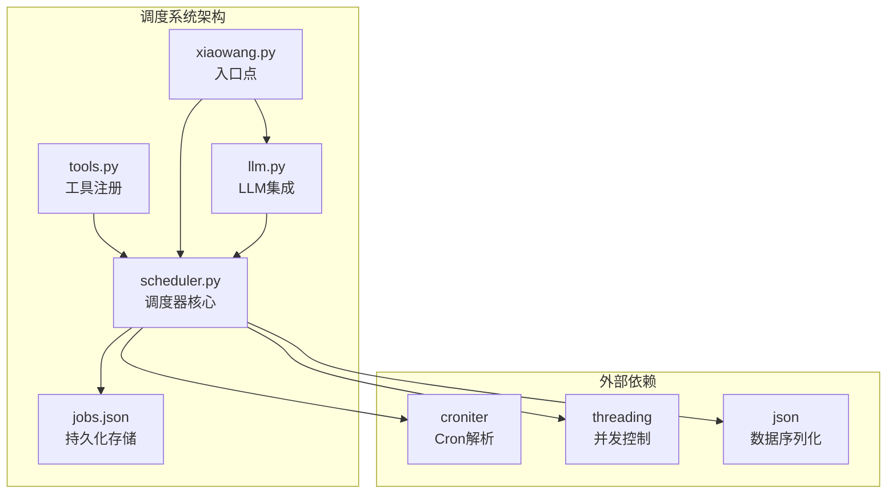
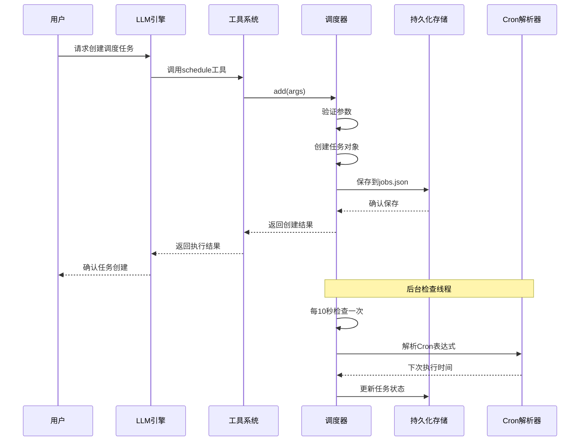
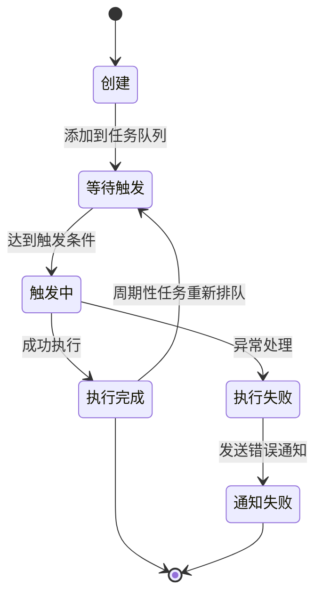
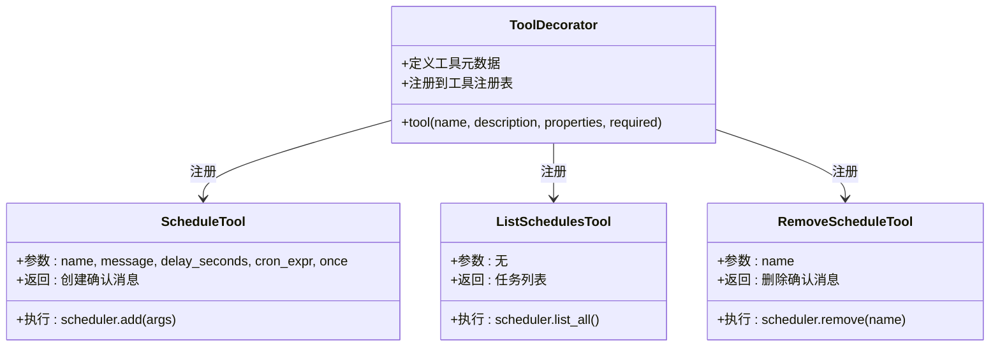
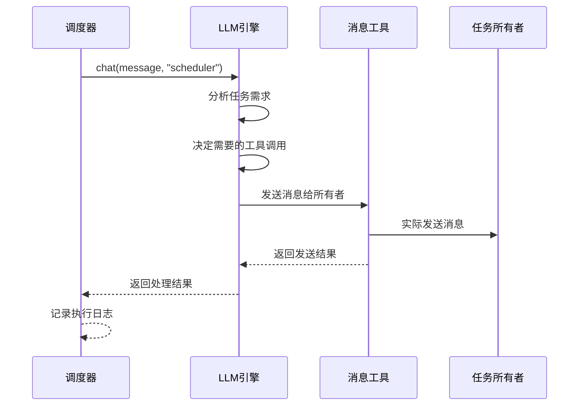
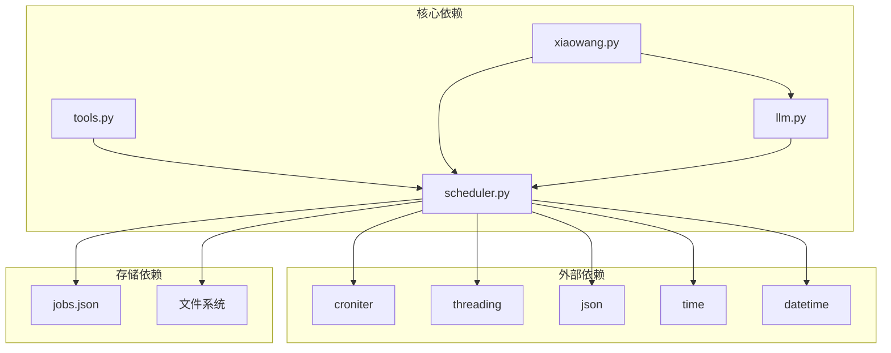

# 调度工具

<cite>
**本文档引用的文件**
- [scheduler.py](file://scheduler.py)
- [tools.py](file://tools.py)
- [xiaowang.py](file://xiaowang.py)
- [llm.py](file://llm.py)
- [README.md](file://README.md)
- [self_check_tool.py](file://self_check_tool.py)
</cite>

## 目录
1. [简介](#简介)
2. [项目结构](#项目结构)
3. [核心组件](#核心组件)
4. [架构概览](#架构概览)
5. [详细组件分析](#详细组件分析)
6. [依赖关系分析](#依赖关系分析)
7. [性能考虑](#性能考虑)
8. [故障排除指南](#故障排除指南)
9. [结论](#结论)

## 简介

调度工具是7/24 Office AI代理系统中的核心功能模块，提供了强大的任务调度能力。该系统支持两种类型的任务调度：一次性任务和周期性任务，具有持久化存储、错误处理和通知机制。

调度系统的主要特点：
- **零框架依赖**：纯Python实现，无外部依赖
- **持久化存储**：任务状态保存在本地文件中
- **多租户支持**：每个用户容器独立的任务管理
- **自修复机制**：系统崩溃后重启仍能恢复任务状态
- **Cron表达式支持**：标准Cron语法，支持时区感知

## 项目结构

调度工具位于项目的根目录下，与主要模块协同工作：



**图表来源**
- [scheduler.py:1-219](file://scheduler.py#L1-L219)
- [tools.py:238-262](file://tools.py#L238-L262)
- [xiaowang.py:66](file://xiaowang.py#L66)

**章节来源**
- [README.md:23-66](file://README.md#L23-L66)
- [scheduler.py:1-219](file://scheduler.py#L1-L219)

## 核心组件

调度系统包含三个核心工具，每个都提供特定的功能：

### schedule任务创建工具
负责创建新的调度任务，支持一次性延迟任务和周期性Cron任务。

### list_schedules任务列表工具  
列出当前所有已创建的调度任务及其状态。

### remove_schedule任务删除工具
删除指定名称的调度任务。

**章节来源**
- [tools.py:238-262](file://tools.py#L238-L262)
- [README.md:92](file://README.md#L92)

## 架构概览

调度系统采用模块化设计，通过工具注册机制与主系统集成：



**图表来源**
- [scheduler.py:30-80](file://scheduler.py#L30-L80)
- [scheduler.py:130-169](file://scheduler.py#L130-L169)
- [tools.py:248-250](file://tools.py#L248-L250)

## 详细组件分析

### 调度器核心模块

调度器是系统的核心组件，负责任务的创建、管理和执行。

#### 任务类型和参数

调度器支持两种任务类型：

1. **一次性任务 (Once)**：使用`delay_seconds`参数
   - 在指定延迟后执行一次
   - 执行后自动从任务列表中移除

2. **周期性任务 (Cron)**：使用`cron_expr`参数
   - 支持标准Cron表达式语法
   - 可选择是否只执行一次（once参数）

#### 参数配置详解

| 参数名 | 类型 | 必需 | 描述 | 示例 |
|--------|------|------|------|------|
| name | string | 是 | 任务唯一标识符 | "daily-report" |
| message | string | 是 | 触发时发送给LLM的消息内容 | "生成今日报告并发送给用户" |
| delay_seconds | integer | 否 | 延迟秒数（一次性任务） | 3600 |
| cron_expr | string | 否 | Cron表达式（周期性任务） | "0 9 * * *" |
| once | boolean | 否 | 是否只执行一次（默认true） | false |

#### 任务状态管理



**图表来源**
- [scheduler.py:130-186](file://scheduler.py#L130-L186)

#### 错误处理机制

调度器实现了多层次的错误处理：

1. **参数验证**：确保必需参数存在且格式正确
2. **Cron解析**：捕获Cron表达式解析异常
3. **任务执行**：捕获任务执行过程中的异常
4. **通知机制**：任务失败时自动通知所有者

**章节来源**
- [scheduler.py:49-80](file://scheduler.py#L49-L80)
- [scheduler.py:130-186](file://scheduler.py#L130-L186)

### 工具注册系统

调度工具通过装饰器模式注册到工具系统中：



**图表来源**
- [tools.py:36-56](file://tools.py#L36-L56)
- [tools.py:238-262](file://tools.py#L238-L262)

**章节来源**
- [tools.py:238-262](file://tools.py#L238-L262)

### LLM集成机制

调度系统与LLM引擎深度集成，任务触发时会调用LLM进行处理：



**图表来源**
- [scheduler.py:171-186](file://scheduler.py#L171-L186)
- [llm.py:231-286](file://llm.py#L231-L286)

**章节来源**
- [llm.py:231-286](file://llm.py#L231-L286)

## 依赖关系分析

调度系统与其他模块的依赖关系：



**图表来源**
- [scheduler.py:10-18](file://scheduler.py#L10-L18)
- [xiaowang.py:66](file://xiaowang.py#L66)

**章节来源**
- [scheduler.py:10-18](file://scheduler.py#L10-L18)
- [xiaowang.py:66](file://xiaowang.py#L66)

## 性能考虑

调度系统在设计时充分考虑了性能和可靠性：

### 并发控制
- 使用线程锁确保任务状态的原子性更新
- 后台线程每10秒检查一次任务状态
- 异步执行任务触发，避免阻塞主流程

### 存储优化
- 采用原子写入方式防止数据损坏
- 使用临时文件确保写入完整性
- 任务状态持久化到本地JSON文件

### 内存管理
- 任务列表在内存中维护，减少磁盘I/O
- 定期心跳日志帮助监控系统健康状况
- 支持大量任务的高效管理

## 故障排除指南

### 常见问题及解决方案

#### 任务未按预期执行
1. **检查Cron表达式语法**
   - 确保表达式符合标准格式
   - 验证时区设置是否正确

2. **查看任务状态**
   ```bash
   # 使用list_schedules工具查看任务状态
   # 或检查jobs.json文件
   ```

#### 任务创建失败
1. **验证必需参数**
   - 确保name和message参数存在
   - 检查delay_seconds或cron_expr至少有一个

2. **检查权限问题**
   - 确保有写入jobs.json的权限
   - 验证工作目录可访问性

#### 任务执行异常
1. **查看错误日志**
   - 检查调度器日志输出
   - 查看LLM引擎的错误信息

2. **测试Cron表达式**
   - 使用在线Cron表达式测试工具
   - 验证下次执行时间计算

**章节来源**
- [scheduler.py:157-159](file://scheduler.py#L157-L159)
- [scheduler.py:176-185](file://scheduler.py#L176-L185)

## 结论

调度工具为7/24 Office AI代理系统提供了强大而可靠的自动化能力。通过简洁的API设计和完善的错误处理机制，系统能够满足各种任务调度需求。

### 主要优势
- **简单易用**：直观的参数配置和API接口
- **高可靠**：持久化存储和自修复机制
- **灵活扩展**：支持多种任务类型和复杂调度需求
- **深度集成**：与LLM系统无缝协作

### 应用场景
- **系统监控**：定期执行健康检查和状态报告
- **数据备份**：定时备份重要数据和配置
- **业务流程**：自动化日常业务操作
- **通知提醒**：定时发送重要信息给用户

调度系统的设计体现了"零框架依赖"的理念，通过纯Python实现所有功能，确保了系统的可移植性和可维护性。随着AI代理系统的不断发展，调度工具将继续发挥重要作用，为用户提供更加智能和自动化的服务体验。