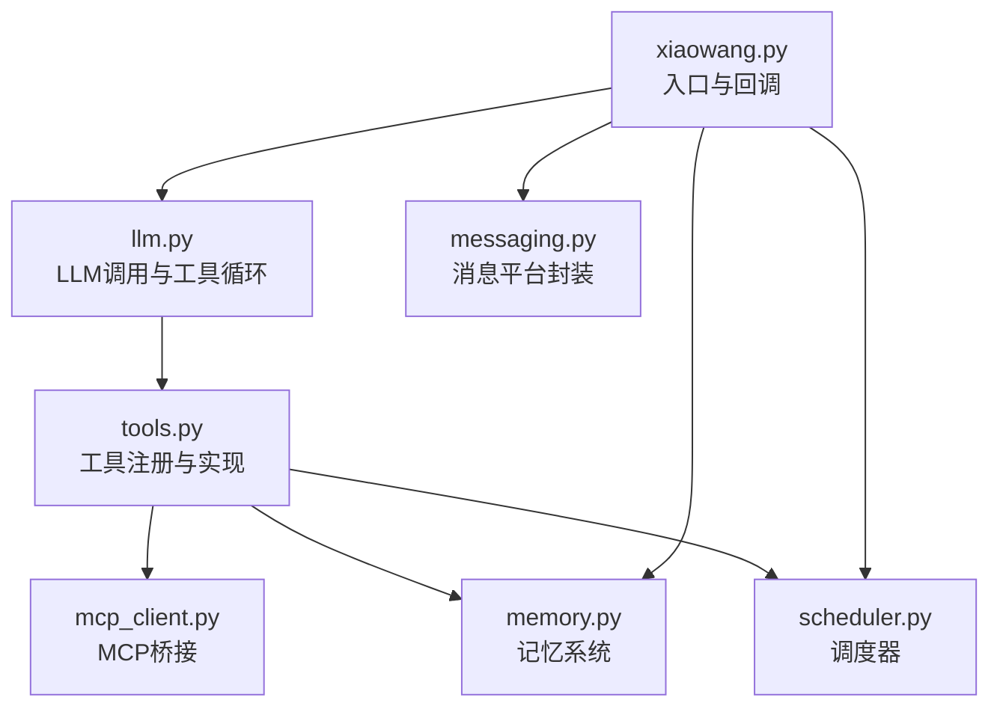
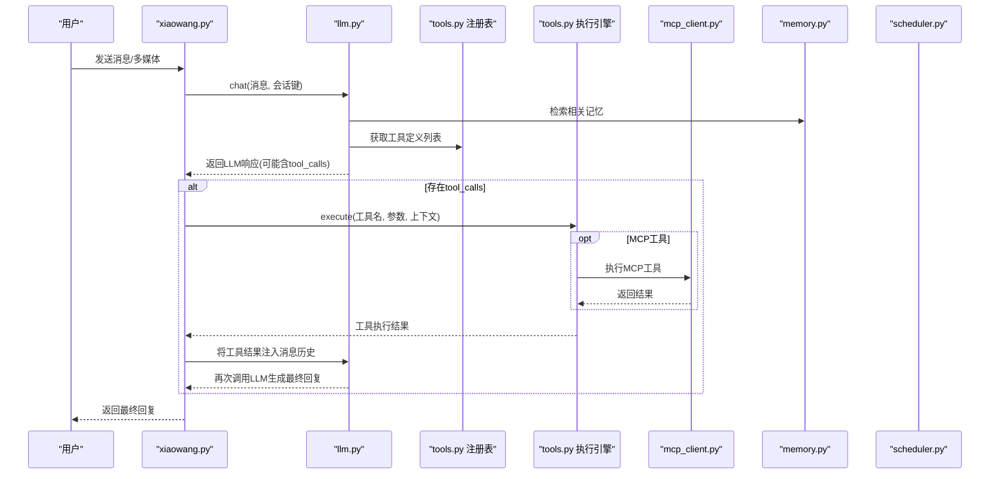
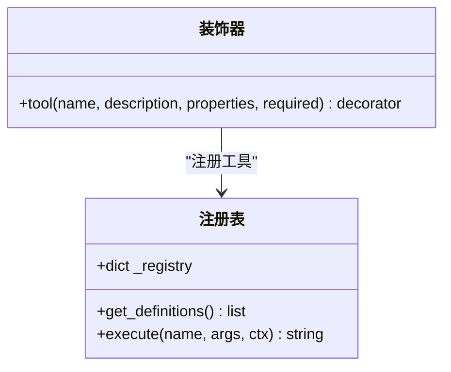
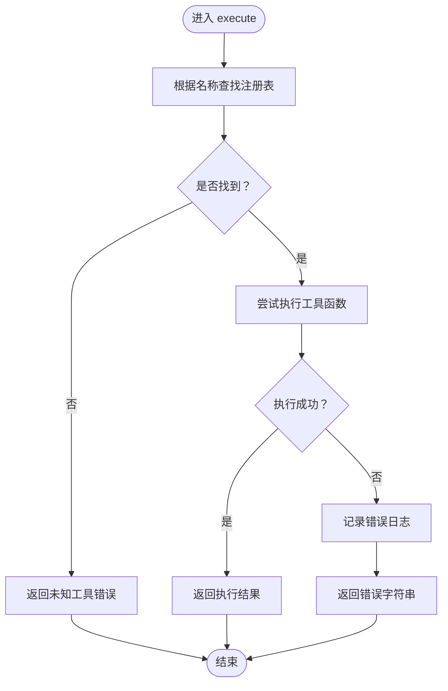
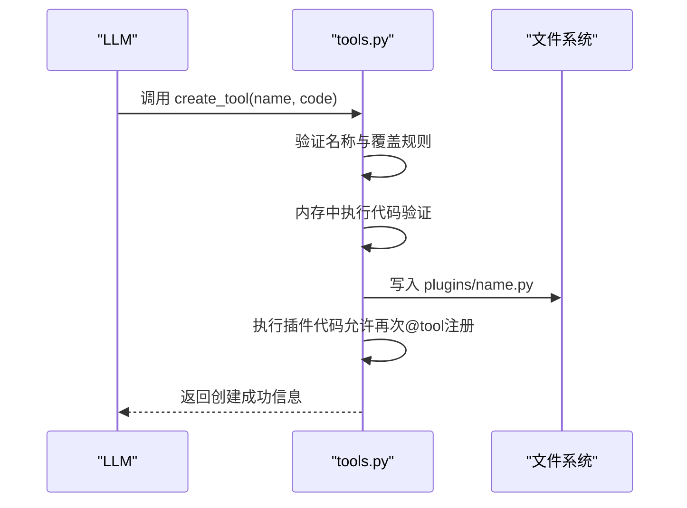
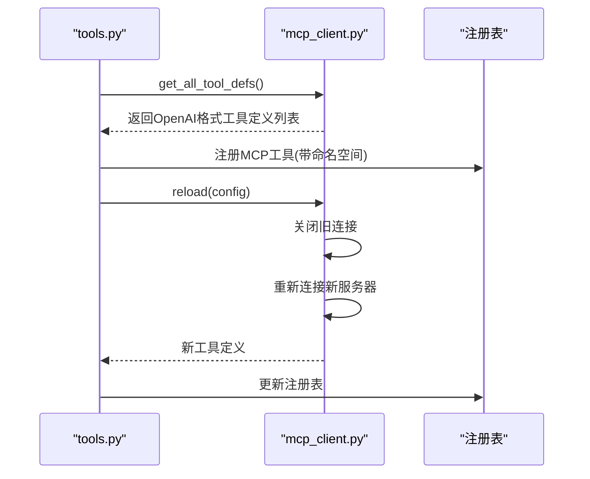
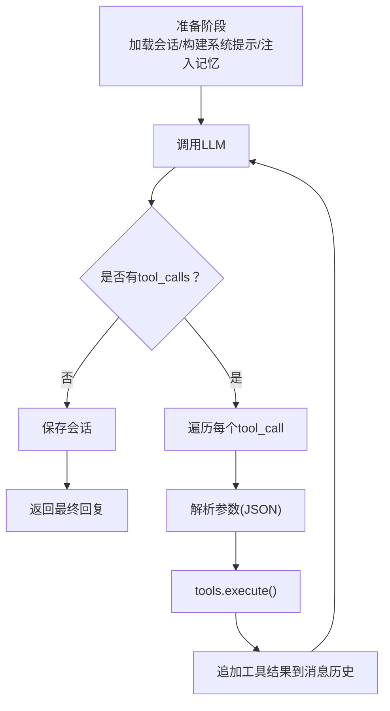
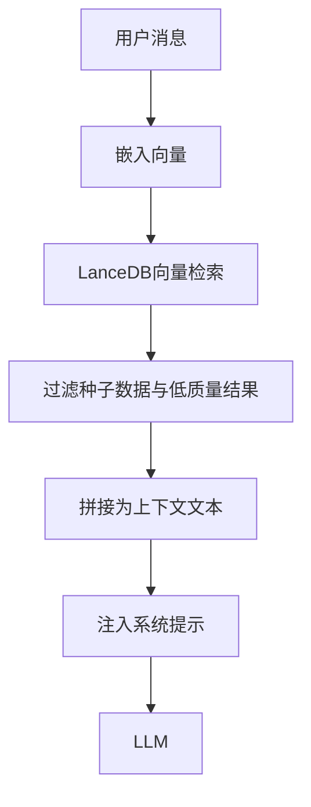
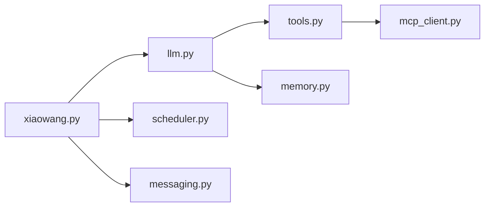

# 工具注册系统

<cite>
**本文档引用的文件**
- [README.md](file://README.md)
- [tools.py](file://tools.py)
- [llm.py](file://llm.py)
- [xiaowang.py](file://xiaowang.py)
- [mcp_client.py](file://mcp_client.py)
- [memory.py](file://memory.py)
- [scheduler.py](file://scheduler.py)
- [self_check_tool.py](file://self_check_tool.py)
</cite>

## 目录
1. [简介](#简介)
2. [项目结构](#项目结构)
3. [核心组件](#核心组件)
4. [架构总览](#架构总览)
5. [详细组件分析](#详细组件分析)
6. [依赖分析](#依赖分析)
7. [性能考虑](#性能考虑)
8. [故障排查指南](#故障排查指南)
9. [结论](#结论)
10. [附录](#附录)

## 简介
本系统是一个纯Python实现的生产级AI代理工具注册与执行框架，具备以下关键能力：
- 装饰器驱动的工具注册机制（@tool），支持OpenAI函数调用格式的自动生成
- 运行时工具创建与热加载（create_tool），支持插件目录的动态扩展
- MCP外部工具桥接，支持JSON-RPC协议的热重载
- 三段式记忆系统与多模态会话管理
- 自诊断与自修复能力，支持每日健康检查与问题定位

该系统强调“零框架依赖”、“单文件工具即能力”、“可自我演进”的设计原则，适合在资源受限环境下稳定运行。

## 项目结构
项目采用按职责分层的模块化组织：
- 入口与回调：xiaowang.py（HTTP服务、消息去抖、ASR、文件持久化）
- LLM与工具使用循环：llm.py（模型调用、会话管理、工具循环）
- 工具注册与实现：tools.py（装饰器、工具注册表、内置工具、插件系统、MCP桥接）
- 记忆系统：memory.py（压缩-去重-检索三阶段）
- 调度器：scheduler.py（一次性与周期性任务）
- MCP客户端：mcp_client.py（JSON-RPC桥接、热重载）
- 自检工具文档：self_check_tool.py（自修复模式说明）

图表来源
- [xiaowang.py:59-76](file://xiaowang.py#L59-L76)
- [llm.py:17-19](file://llm.py#L17-L19)
- [tools.py:33-55](file://tools.py#L33-L55)
- [mcp_client.py:269-334](file://mcp_client.py#L269-L334)
- [memory.py:40-86](file://memory.py#L40-L86)
- [scheduler.py:30-37](file://scheduler.py#L30-L37)

章节来源
- [README.md:23-66](file://README.md#L23-L66)
- [xiaowang.py:59-76](file://xiaowang.py#L59-L76)
- [llm.py:17-19](file://llm.py#L17-L19)
- [tools.py:33-55](file://tools.py#L33-L55)

## 核心组件
- 装饰器与注册表：@tool装饰器负责将工具函数注册到全局注册表，并生成OpenAI兼容的函数定义；tools.get_definitions()统一导出所有工具定义。
- 工具执行引擎：tools.execute()根据名称从注册表中查找并调用对应函数，同时进行异常捕获与日志记录。
- 插件系统：支持在plugins/目录下动态创建、加载与删除自定义工具，实现“单文件工具即能力”的扩展模式。
- MCP桥接：将外部MCP服务器的工具以命名空间形式注册到注册表，支持热重载与断线重连。
- LLM工具循环：llm.chat()负责构建系统提示、注入记忆上下文、调用LLM、解析tool_calls并执行工具，最终返回人类可读回复。

章节来源
- [tools.py:36-74](file://tools.py#L36-L74)
- [tools.py:506-512](file://tools.py#L506-L512)
- [tools.py:1024-1091](file://tools.py#L1024-L1091)
- [mcp_client.py:269-334](file://mcp_client.py#L269-L334)
- [llm.py:317-401](file://llm.py#L317-L401)

## 架构总览
系统通过装饰器模式实现“声明式工具注册”，结合运行时插件与MCP桥接，形成统一的工具生态。LLM工具循环贯穿消息流，将自然语言指令转化为具体工具调用，再由工具执行引擎完成实际操作。

图表来源
- [llm.py:317-401](file://llm.py#L317-L401)
- [tools.py:63-74](file://tools.py#L63-L74)
- [mcp_client.py:296-309](file://mcp_client.py#L296-L309)
- [memory.py:88-118](file://memory.py#L88-L118)

## 详细组件分析

### 装饰器与工具注册表（@tool）
- 装饰器作用：接收工具元数据（名称、描述、参数Schema、必填字段），将工具函数注册到全局注册表，并生成OpenAI函数调用格式的definition。
- 注册表结构：_registry为字典，键为工具名，值包含“函数对象”和“OpenAI函数定义”两部分。
- 定义生成：definition遵循OpenAI function calling格式，包含type、function.name、function.description、function.parameters（含properties与可选required）。
- 工具查询：get_definitions()返回所有definition的列表，供LLM调用。

图表来源
- [tools.py:36-74](file://tools.py#L36-L74)
- [tools.py:58-61](file://tools.py#L58-L61)
- [tools.py:63-74](file://tools.py#L63-L74)

章节来源
- [tools.py:36-74](file://tools.py#L36-L74)
- [tools.py:58-61](file://tools.py#L58-L61)

### 工具执行引擎
- 执行流程：根据工具名从注册表获取函数与定义；若未找到返回错误信息；捕获异常并记录日志后返回错误字符串。
- 上下文传递：执行时传入ctx包含owner_id、workspace、session_key等运行时信息。
- 日志记录：执行前记录工具调用摘要，异常时记录详细堆栈。

图表来源
- [tools.py:63-74](file://tools.py#L63-L74)

章节来源
- [tools.py:63-74](file://tools.py#L63-L74)

### 运行时工具创建（create_tool）
- 功能概述：允许在运行时创建自定义工具插件，保存至plugins/目录并立即加载生效；支持列出与删除自定义工具。
- 安全策略：仅允许覆盖已存在的插件文件，防止覆盖内置工具；先在内存中验证代码可执行性，再写盘。
- 加载机制：启动时扫描plugins/目录，逐个文件执行，允许插件内再次使用@tool注册工具。

图表来源
- [tools.py:1024-1056](file://tools.py#L1024-L1056)
- [tools.py:518-545](file://tools.py#L518-L545)

章节来源
- [tools.py:1024-1056](file://tools.py#L1024-L1056)
- [tools.py:518-545](file://tools.py#L518-L545)

### MCP工具桥接与热重载
- 命名空间：MCP工具以“servername__toolname”的形式注册，避免冲突。
- 定义转换：将MCP的inputSchema直接映射为OpenAI function.parameters。
- 执行路径：tools.execute()将MCP工具名拆分为服务器名与工具名，交由mcp_client执行。
- 热重载：reload()关闭旧连接，重新读取配置并建立新连接，更新注册表中的工具定义。

图表来源
- [tools.py:1138-1153](file://tools.py#L1138-L1153)
- [tools.py:1097-1131](file://tools.py#L1097-L1131)
- [mcp_client.py:288-322](file://mcp_client.py#L288-L322)

章节来源
- [tools.py:1138-1153](file://tools.py#L1138-L1153)
- [tools.py:1097-1131](file://tools.py#L1097-L1131)
- [mcp_client.py:288-322](file://mcp_client.py#L288-L322)

### LLM工具使用循环
- 初始化：llm.init()注入模型配置、工作区、所有者ID与会话目录。
- 会话管理：加载/保存会话，必要时对历史消息进行压缩与清理，确保消息序列合法。
- 工具循环：构建系统提示（含记忆与跨会话上下文），调用LLM获取tool_calls，逐一执行工具并将结果注入消息历史，直至无tool_calls或达到最大迭代次数。
- 性能统计：记录准备时间、LLM耗时、工具调用次数与总耗时。

图表来源
- [llm.py:317-401](file://llm.py#L317-L401)
- [llm.py:356-396](file://llm.py#L356-L396)

章节来源
- [llm.py:317-401](file://llm.py#L317-L401)

### 记忆系统与跨会话上下文
- 记忆检索：基于用户输入向量搜索，返回相关记忆摘要，注入系统提示增强上下文。
- 跨会话桥接：从scheduler会话提取最近发送的消息内容，注入当前DM会话，便于连续对话。
- 记忆压缩：将会话溢出的历史消息压缩为结构化事实，去重后存入LanceDB，支持零延迟缓存。

图表来源
- [memory.py:88-118](file://memory.py#L88-L118)
- [llm.py:231-286](file://llm.py#L231-L286)

章节来源
- [memory.py:88-118](file://memory.py#L88-L118)
- [llm.py:231-286](file://llm.py#L231-L286)

### 自诊断与自修复
- 自检工具：收集当日会话统计、错误日志、服务状态、磁盘与内存占用、计划任务状态、记忆文件状态。
- 诊断工具：检查会话文件健康、MCP连接状态、近期错误详情，提供修复建议。
- 自修复模式：通过每日定时任务触发自检，格式化报告并通过消息工具发送给所有者，形成闭环。

章节来源
- [self_check_tool.py:1-57](file://self_check_tool.py#L1-L57)
- [tools.py:818-921](file://tools.py#L818-L921)
- [tools.py:925-1019](file://tools.py#L925-L1019)

## 依赖分析
- 模块耦合
  - tools.py与mcp_client.py通过工具定义与执行接口耦合，但不直接导入mcp_client，通过tools.execute()间接调用。
  - llm.py依赖tools模块获取工具定义与执行工具，同时依赖memory模块检索记忆。
  - xiaowang.py作为入口，初始化各子系统并处理消息回调。
- 外部依赖
  - croniter：用于Cron表达式解析与下一触发时间计算。
  - lancedb：向量数据库，用于记忆检索。
  - websocket-client：ASR WebSocket通信。
  - 标准库：subprocess、urllib、threading、json等。

图表来源
- [xiaowang.py:59-76](file://xiaowang.py#L59-L76)
- [llm.py:17-19](file://llm.py#L17-L19)
- [tools.py:81-82](file://tools.py#L81-L82)

章节来源
- [xiaowang.py:59-76](file://xiaowang.py#L59-L76)
- [llm.py:17-19](file://llm.py#L17-L19)
- [tools.py:81-82](file://tools.py#L81-L82)

## 性能考虑
- 工具循环限制：每次对话最多20次迭代，避免长时间阻塞。
- 会话截断与压缩：超过阈值的消息会被压缩并异步写入长期记忆，减少历史长度。
- 记忆检索优化：向量检索与阈值去重，降低无关记忆干扰。
- 并发控制：同一会话的聊天请求串行化，避免并发写冲突。
- I/O与网络：MCP工具调用与外部API调用均设置超时，失败时记录并回退。

## 故障排查指南
- 工具未找到：检查工具名大小写与拼写，确认是否在注册表中存在。
- 工具执行异常：查看日志中的错误堆栈，定位具体工具实现的问题。
- MCP工具不可用：使用diagnose工具检查MCP连接状态，必要时通过reload_mcp热重载。
- 会话文件损坏：使用diagnose检查会话文件的完整性，必要时清理或重建。
- 记忆检索失败：检查嵌入API配置与网络连通性，确认LanceDB可用。

章节来源
- [tools.py:63-74](file://tools.py#L63-L74)
- [tools.py:925-1019](file://tools.py#L925-L1019)
- [tools.py:1097-1131](file://tools.py#L1097-L1131)

## 结论
该工具注册系统通过装饰器模式实现了声明式的工具注册与OpenAI函数调用格式生成，结合运行时插件与MCP桥接，形成了灵活且可扩展的工具生态。LLM工具循环与记忆系统共同提升了对话的连贯性与智能性。自诊断与自修复机制进一步增强了系统的稳定性与可维护性。整体设计遵循“零框架依赖、单文件工具即能力、可自我演进”的原则，适合在多种环境中部署与运行。

## 附录

### 自定义工具开发指南
- 编写规范
  - 在tools.py末尾添加工具函数，并使用@tool装饰器注册。
  - 函数签名：def tool_xxx(args, ctx)，其中args为LLM传入的参数字典，ctx为运行时上下文。
  - 参数Schema：在装饰器中定义properties与可选required字段，确保LLM正确推断参数。
- 参数验证
  - 在工具内部对参数进行显式校验，返回明确的错误信息。
  - 对外部API调用设置超时与重试策略。
- 错误处理
  - 使用try/except捕获异常，记录日志并返回统一的错误字符串。
  - 对于MCP工具，利用mcp_client的断线重连与错误包装。
- 日志记录
  - 使用log记录关键步骤与异常堆栈，便于排障。
  - 对敏感信息进行脱敏处理，避免泄露。

章节来源
- [tools.py:10-17](file://tools.py#L10-L17)
- [tools.py:63-74](file://tools.py#L63-L74)
- [mcp_client.py:210-242](file://mcp_client.py#L210-L242)