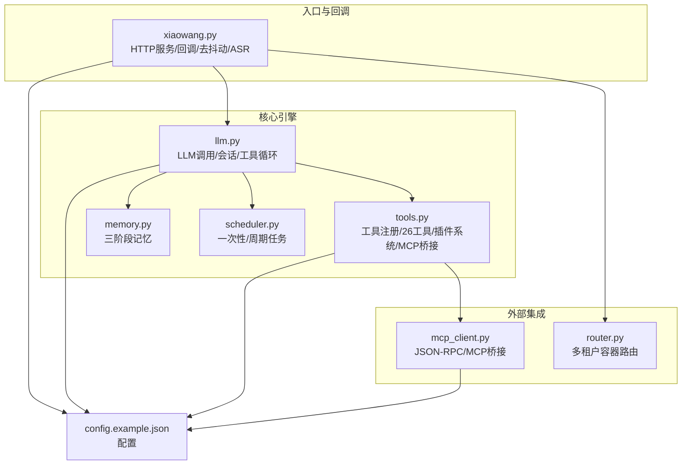
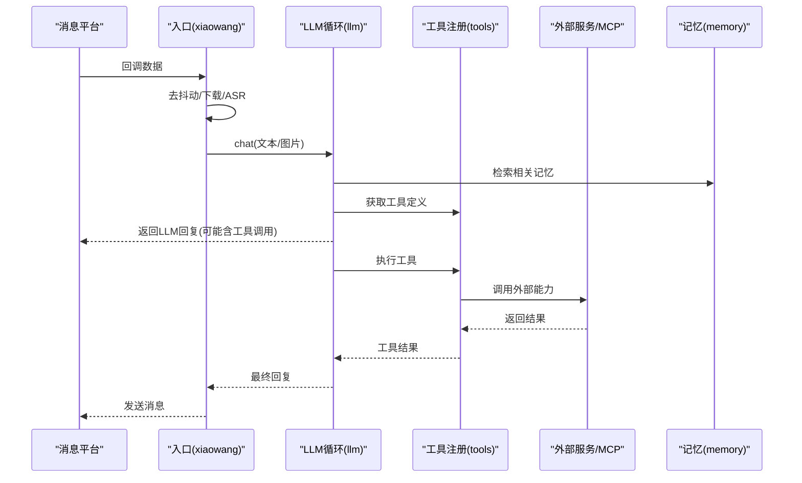
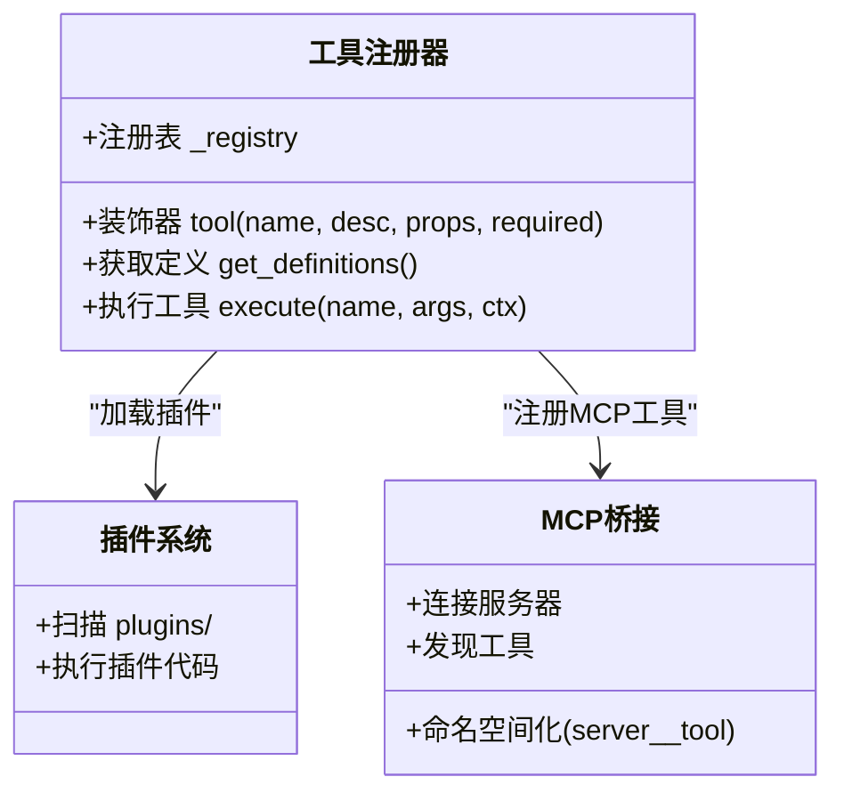
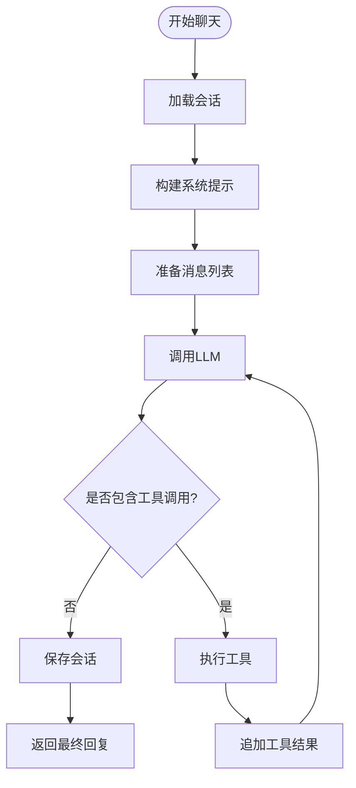
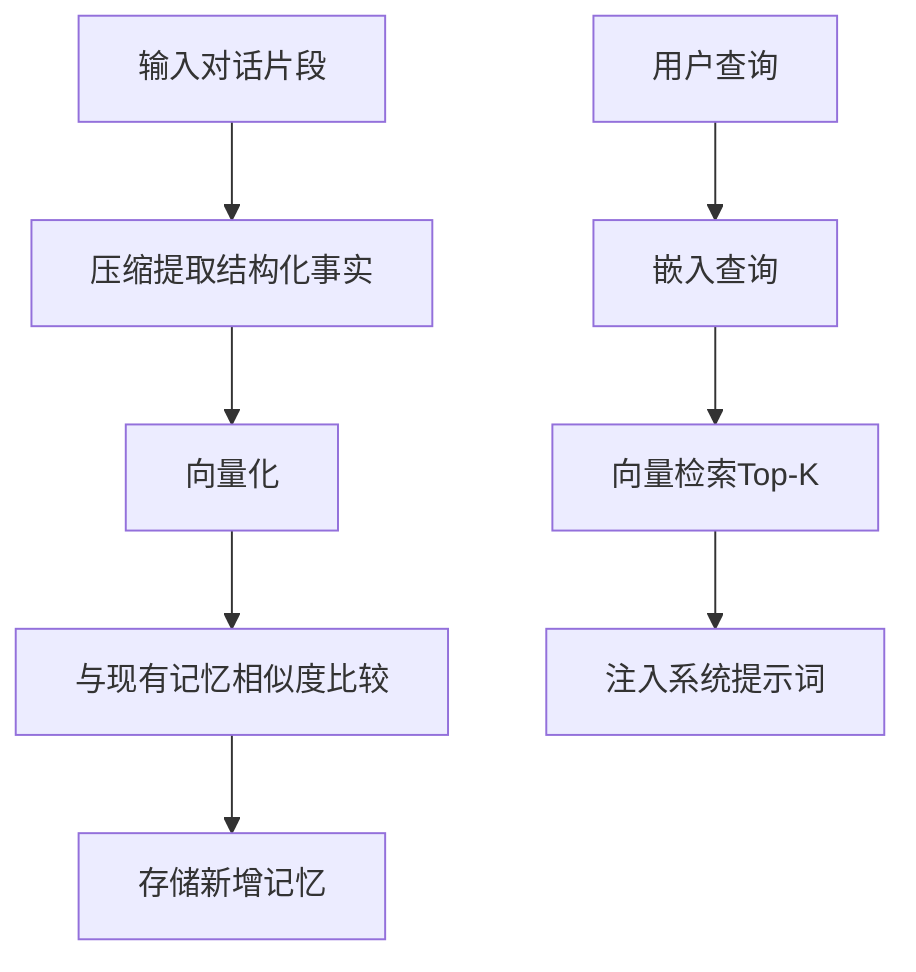
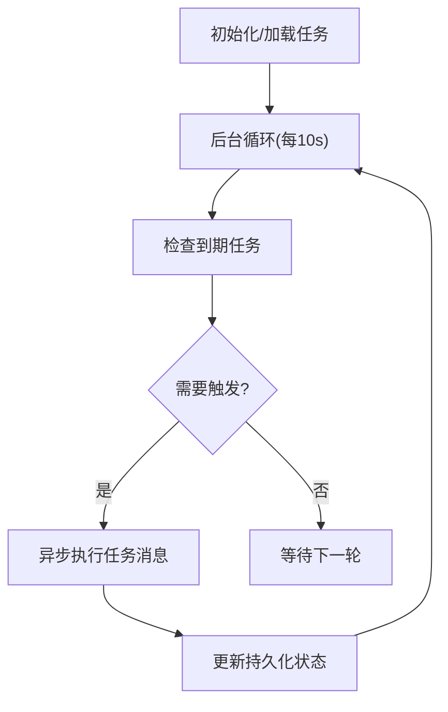
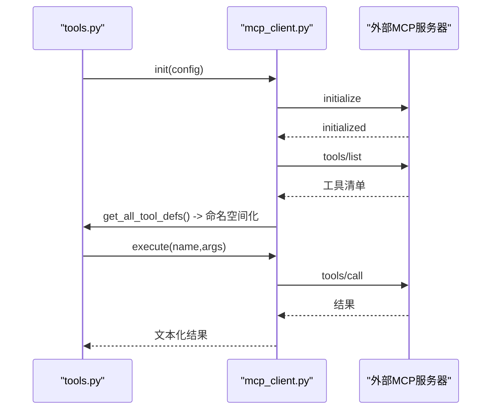
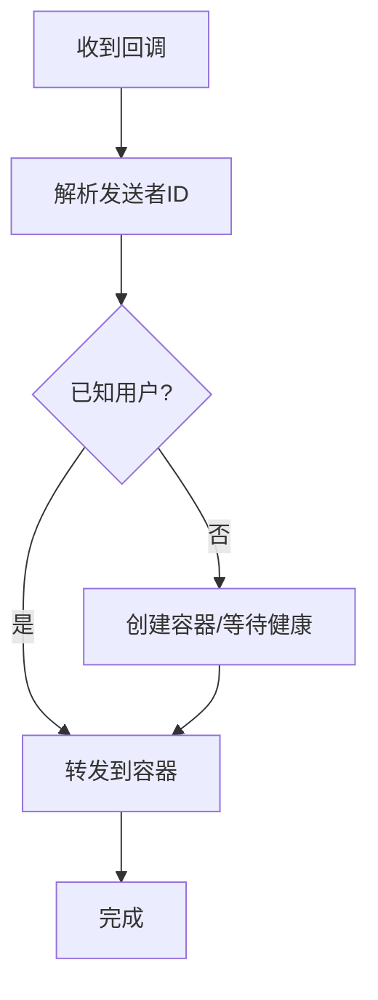
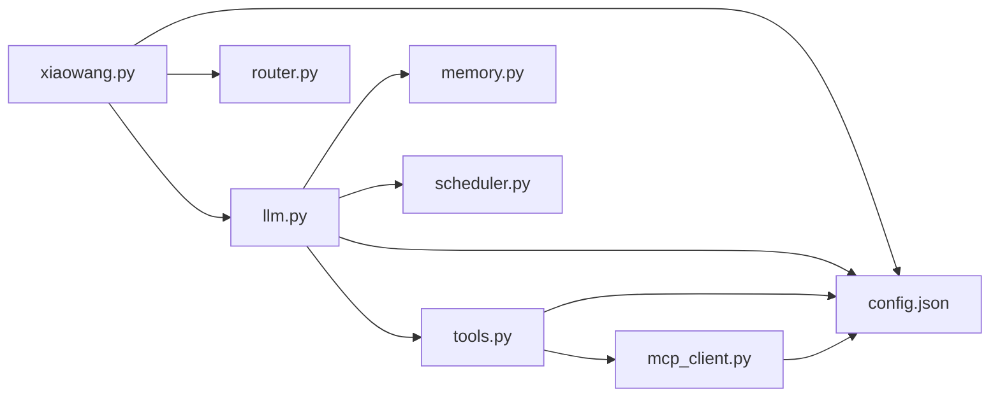
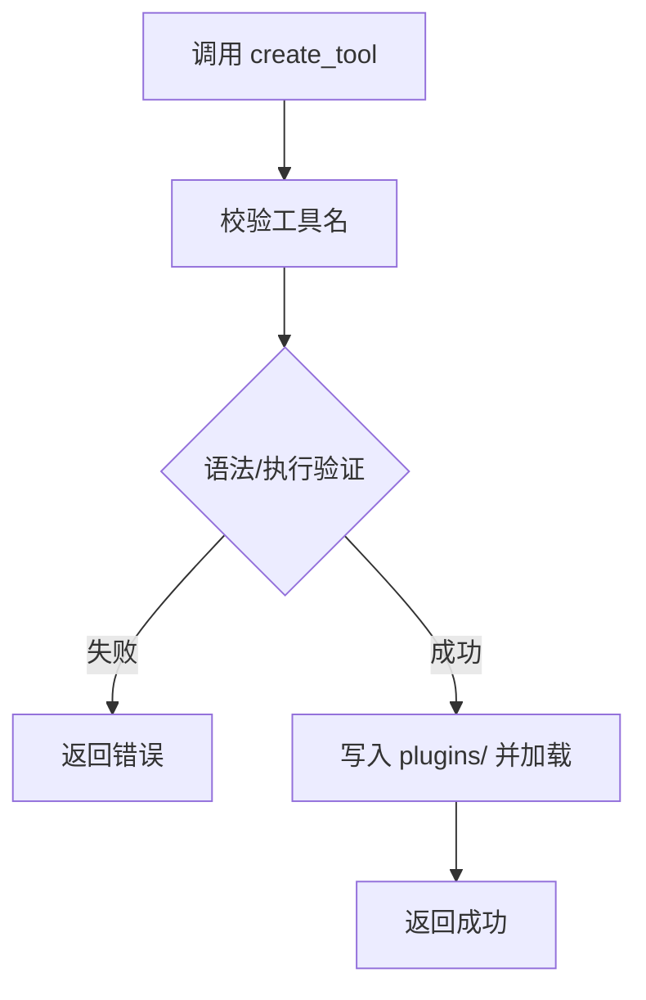

# 工具生态系统

<cite>
**本文引用的文件**
- [README.md](file://README.md)
- [config.example.json](file://config.example.json)
- [xiaowang.py](file://xiaowang.py)
- [llm.py](file://llm.py)
- [tools.py](file://tools.py)
- [mcp_client.py](file://mcp_client.py)
- [memory.py](file://memory.py)
- [scheduler.py](file://scheduler.py)
- [router.py](file://router.py)
- [self_check_tool.py](file://self_check_tool.py)
</cite>

## 目录
1. [简介](#简介)
2. [项目结构](#项目结构)
3. [核心组件](#核心组件)
4. [架构总览](#架构总览)
5. [详细组件分析](#详细组件分析)
6. [依赖关系分析](#依赖关系分析)
7. [性能考量](#性能考量)
8. [故障排查指南](#故障排查指南)
9. [结论](#结论)
10. [附录](#附录)

## 简介
本项目是一个“零框架依赖”的生产级AI代理系统，具备26个内置工具与MCP插件体系，支持多租户路由、三阶段记忆、计划任务、多媒体处理、视频处理、网络搜索、诊断自检与运行时工具创建。系统采用纯Python实现，强调可读性、可维护性与可扩展性，适合在边缘设备上部署与长期运行。

## 项目结构
系统由8个核心模块组成，围绕“入口HTTP服务”“工具注册与执行”“LLM调用循环”“记忆与调度”“MCP桥接”“多租户路由”展开。

图表来源
- [xiaowang.py:1-626](file://xiaowang.py#L1-L626)
- [llm.py:1-401](file://llm.py#L1-L401)
- [tools.py:1-1153](file://tools.py#L1-L1153)
- [mcp_client.py:1-334](file://mcp_client.py#L1-L334)
- [memory.py:1-361](file://memory.py#L1-L361)
- [scheduler.py:1-219](file://scheduler.py#L1-L219)
- [router.py:1-493](file://router.py#L1-L493)
- [config.example.json:1-61](file://config.example.json#L1-L61)

章节来源
- [README.md:1-162](file://README.md#L1-L162)
- [config.example.json:1-61](file://config.example.json#L1-L61)

## 核心组件
- 工具注册与执行：装饰器模式注册工具，统一定义与执行接口，支持内置工具、插件工具与MCP工具。
- LLM调用循环：OpenAI兼容函数调用，自动重试与最大迭代控制，跨会话上下文注入。
- 记忆系统：压缩-去重-检索三层管道，向系统提示词注入相关记忆。
- 调度系统：持久化任务列表，后台线程定时检查触发，支持一次性与周期任务。
- MCP桥接：JSON-RPC客户端，支持stdio与HTTP传输，热重载与自动重连。
- 多租户路由：按发送者ID路由到独立容器，自动创建与健康检查。
- 入口HTTP服务：回调解析、去抖动合并、多媒体下载与持久化、ASR语音转写。

章节来源
- [tools.py:36-74](file://tools.py#L36-L74)
- [llm.py:50-401](file://llm.py#L50-L401)
- [memory.py:40-120](file://memory.py#L40-L120)
- [scheduler.py:30-219](file://scheduler.py#L30-L219)
- [mcp_client.py:27-334](file://mcp_client.py#L27-L334)
- [router.py:45-493](file://router.py#L45-L493)
- [xiaowang.py:59-626](file://xiaowang.py#L59-L626)

## 架构总览
系统采用“入口回调→LLM工具循环→工具执行→外部服务/本地能力”的闭环。工具层同时承载内置工具、插件工具与MCP工具，形成统一的OpenAI函数调用格式。

图表来源
- [xiaowang.py:489-588](file://xiaowang.py#L489-L588)
- [llm.py:317-401](file://llm.py#L317-L401)
- [tools.py:58-74](file://tools.py#L58-L74)
- [memory.py:88-119](file://memory.py#L88-L119)

## 详细组件分析

### 工具注册系统与装饰器模式
- 装饰器@tool负责：
  - 将工具函数注册到全局注册表，生成OpenAI函数调用格式定义。
  - 统一参数schema与必填字段声明。
- 注册表结构：键为工具名，值包含“函数对象”和“定义字典”。
- 工具执行：根据名称从注册表取出函数并调用，异常捕获与日志记录。
- 插件系统：启动时扫描plugins目录，动态执行插件代码，允许插件内再次使用@tool注册工具。
- MCP桥接：启动时连接MCP服务器，将工具命名空间化(server__tool)，统一注册到注册表。

图表来源
- [tools.py:36-74](file://tools.py#L36-L74)
- [tools.py:518-545](file://tools.py#L518-L545)
- [tools.py:1138-1153](file://tools.py#L1138-L1153)
- [mcp_client.py:27-334](file://mcp_client.py#L27-L334)

章节来源
- [tools.py:36-74](file://tools.py#L36-L74)
- [tools.py:518-545](file://tools.py#L518-L545)
- [tools.py:1138-1153](file://tools.py#L1138-L1153)

### LLM调用循环与会话管理
- 初始化：注入模型配置、工作区、所有者ID、会话目录。
- 会话加载与截断：最多保留固定数量消息，超出部分压缩后写入长记忆。
- 系统提示：注入个性文件与最近调度输出上下文。
- 工具循环：最多20次迭代，逐次调用LLM→工具→LLM，直至无工具调用或超时。
- 多模态：支持图片base64编码作为用户消息内容。

图表来源
- [llm.py:317-401](file://llm.py#L317-L401)
- [llm.py:356-396](file://llm.py#L356-L396)

章节来源
- [llm.py:33-401](file://llm.py#L33-L401)

### 记忆系统（三阶段）
- 压缩：对会话溢出消息调用LLM抽取结构化事实，过滤无效信息。
- 去重：对新事实计算向量并与已有记忆进行余弦相似度比较，阈值过滤重复。
- 检索：用户消息嵌入后向量检索Top-K，注入系统提示词。

图表来源
- [memory.py:194-282](file://memory.py#L194-L282)
- [memory.py:284-361](file://memory.py#L284-L361)
- [memory.py:88-119](file://memory.py#L88-L119)

章节来源
- [memory.py:40-120](file://memory.py#L40-L120)
- [memory.py:194-361](file://memory.py#L194-L361)

### 调度系统
- 支持一次性延迟任务与周期任务（cron表达式），持久化jobs.json。
- 后台线程每10秒检查一次，触发时调用LLM处理消息并发送通知。
- 提供增删查操作，支持单次与重复两种模式。

图表来源
- [scheduler.py:130-186](file://scheduler.py#L130-L186)
- [scheduler.py:208-219](file://scheduler.py#L208-L219)

章节来源
- [scheduler.py:30-219](file://scheduler.py#L30-L219)

### MCP（Model Context Protocol）集成
- JSON-RPC实现：支持stdio与HTTP两种传输；握手、工具列举、工具调用。
- 自动重连：stdio断开后尝试重启进程并重新握手。
- 命名空间：将工具名格式化为“server__tool”，避免冲突。
- 热重载：无需重启，重新读取配置并重建连接，动态注册/注销工具。

图表来源
- [mcp_client.py:27-334](file://mcp_client.py#L27-L334)
- [tools.py:1138-1153](file://tools.py#L1138-L1153)

章节来源
- [mcp_client.py:27-334](file://mcp_client.py#L27-L334)
- [tools.py:1097-1131](file://tools.py#L1097-L1131)

### 多租户路由
- 按发送者ID路由到对应容器，未知用户自动创建容器并等待健康检查。
- 支持环境变量配置镜像、网络、内存限制与最大容器数。
- 提供健康检查端点与路由表重载端点，便于运维。

图表来源
- [router.py:397-418](file://router.py#L397-L418)
- [router.py:141-250](file://router.py#L141-L250)

章节来源
- [router.py:45-493](file://router.py#L45-L493)

### 入口HTTP服务与多媒体处理
- 解析消息类型：文本、图片、视频、文件、语音、链接、位置等。
- 去抖动：将短时间内的多条消息合并为一次对话。
- 下载与持久化：统一保存到按年月分目录的文件索引中。
- ASR：WebSocket流式识别，支持silk与ffmpeg转码。
- 单用户模式：默认仅接受配置中的所有者ID。

章节来源
- [xiaowang.py:489-588](file://xiaowang.py#L489-L588)
- [xiaowang.py:316-378](file://xiaowang.py#L316-L378)
- [xiaowang.py:140-285](file://xiaowang.py#L140-L285)

## 依赖关系分析
- 模块耦合：
  - llm.py依赖tools.py（工具定义与执行）、memory.py（检索上下文）、scheduler.py（会话上下文桥接）。
  - tools.py依赖mcp_client.py（MCP工具注册）、memory.py（语义检索）、scheduler.py（调度工具）。
  - xiaowang.py依赖llm.py、tools.py、memory.py、scheduler.py、router.py、messaging（未在本文件中直接导入）。
- 外部依赖：标准库为主，croniter、lancedb、websocket-client。
- 配置驱动：config.json集中管理模型、消息、记忆、ASR、视频、搜索、MCP等。

图表来源
- [xiaowang.py:59-76](file://xiaowang.py#L59-L76)
- [llm.py:17-39](file://llm.py#L17-L39)
- [tools.py:506-512](file://tools.py#L506-L512)
- [mcp_client.py:272-286](file://mcp_client.py#L272-L286)

章节来源
- [config.example.json:1-61](file://config.example.json#L1-L61)

## 性能考量
- 会话截断与压缩：避免历史消息无限增长，减少LLM上下文长度。
- 记忆检索Top-K：控制检索规模，降低延迟。
- 工具循环上限：防止过度推理导致资源耗尽。
- 多线程与锁：会话级互斥，保证并发安全。
- ASR与视频处理：外部API与ffmpeg，注意超时与资源占用。

[本节为通用指导，不直接分析具体文件]

## 故障排查指南
- 400错误与消息序列问题：使用诊断工具检查会话文件开头是否为“工具消息”或“助手+工具调用但缺少结果”。
- MCP工具不可用：检查MCP服务器连接状态、进程存活、命令是否存在、启动日志。
- 错误日志定位：查看最近一小时错误与400类请求，结合会话文件与MCP状态进行交叉验证。
- 自检报告：每日运行自检工具，汇总会话统计、错误计数、服务启动时间、内存与磁盘、计划任务状态、记忆文件状态。

章节来源
- [tools.py:925-1019](file://tools.py#L925-L1019)
- [tools.py:818-920](file://tools.py#L818-L920)

## 结论
该工具生态系统以“装饰器注册+统一执行+可插拔扩展”为核心设计，实现了从消息接入、多模态处理、记忆增强、计划任务到MCP桥接的完整闭环。其零框架依赖与纯Python实现，使其具备极高的可读性与可维护性，适合在边缘与生产环境中长期稳定运行。

[本节为总结，不直接分析具体文件]

## 附录

### 工具清单与分类
- 核心：exec、message
- 文件：read_file、write_file、edit_file、list_files
- 调度：schedule、list_schedules、remove_schedule
- 媒体发送：send_image、send_file、send_video、send_link
- 视频：trim_video、add_bgm、generate_video
- 搜索：web_search（多引擎聚合）
- 记忆：search_memory（关键词）、recall（语义）
- 诊断：self_check、diagnose
- 插件管理：create_tool、list_custom_tools、remove_tool
- MCP：reload_mcp

章节来源
- [README.md:86-100](file://README.md#L86-L100)

### 自定义工具开发指南
- 在tools.py底部添加函数，使用@tool装饰器注册，声明参数schema与必填项。
- 函数签名：接收args与ctx，返回字符串结果。
- 参数校验：在函数内部进行必要校验，异常统一被捕获并返回错误信息。
- 测试方法：通过llm.chat发起测试消息，观察工具调用与返回；或使用create_tool创建临时插件进行验证。
- 最佳实践：保持幂等、设置合理超时、避免敏感命令、记录关键日志。

章节来源
- [tools.py:36-74](file://tools.py#L36-L74)
- [tools.py:1024-1056](file://tools.py#L1024-L1056)

### 运行时工具创建流程
- 使用create_tool工具提交工具名与完整代码，系统先验证语法，再持久化到plugins/目录并立即加载。
- 已存在的插件可覆盖，但内置工具名不允许覆盖。
- 删除工具使用remove_tool，仅限plugins/目录下的自定义工具。

图表来源
- [tools.py:1024-1056](file://tools.py#L1024-L1056)

章节来源
- [tools.py:1024-1091](file://tools.py#L1024-L1091)

### MCP热重载机制
- reload_mcp工具：重新读取配置→断开旧连接→建立新连接→注册新工具→清理旧MCP工具→返回统计。
- 自动重连：stdio断开后尝试重启进程并重新握手。
- 命名空间：server__tool避免工具名冲突。

章节来源
- [tools.py:1097-1131](file://tools.py#L1097-L1131)
- [mcp_client.py:74-91](file://mcp_client.py#L74-L91)
- [mcp_client.py:296-322](file://mcp_client.py#L296-L322)

### 配置要点
- 模型：支持多提供商，默认模型与超时设置。
- 记忆：启用开关、嵌入API、相似度阈值、检索Top-K。
- ASR：WebSocket地址、鉴权参数。
- 视频：视频生成API基础地址、密钥、模型。
- 搜索：Tavily与通用搜索API密钥。
- MCP：服务器传输方式、命令与参数、环境变量。

章节来源
- [config.example.json:1-61](file://config.example.json#L1-L61)