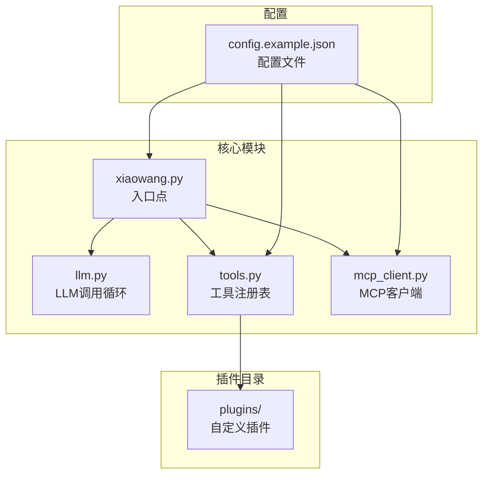
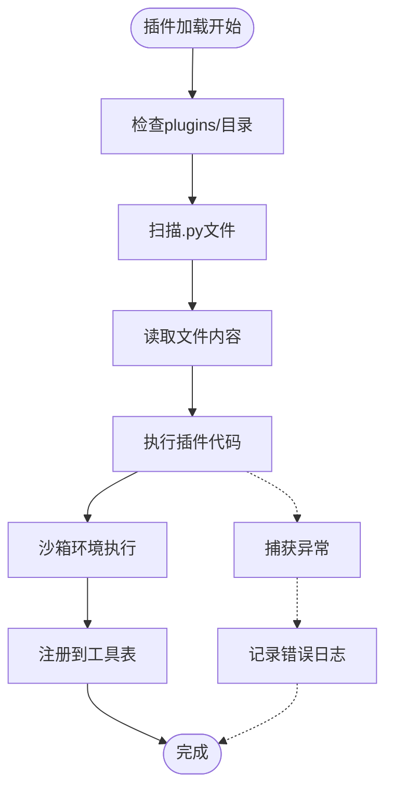
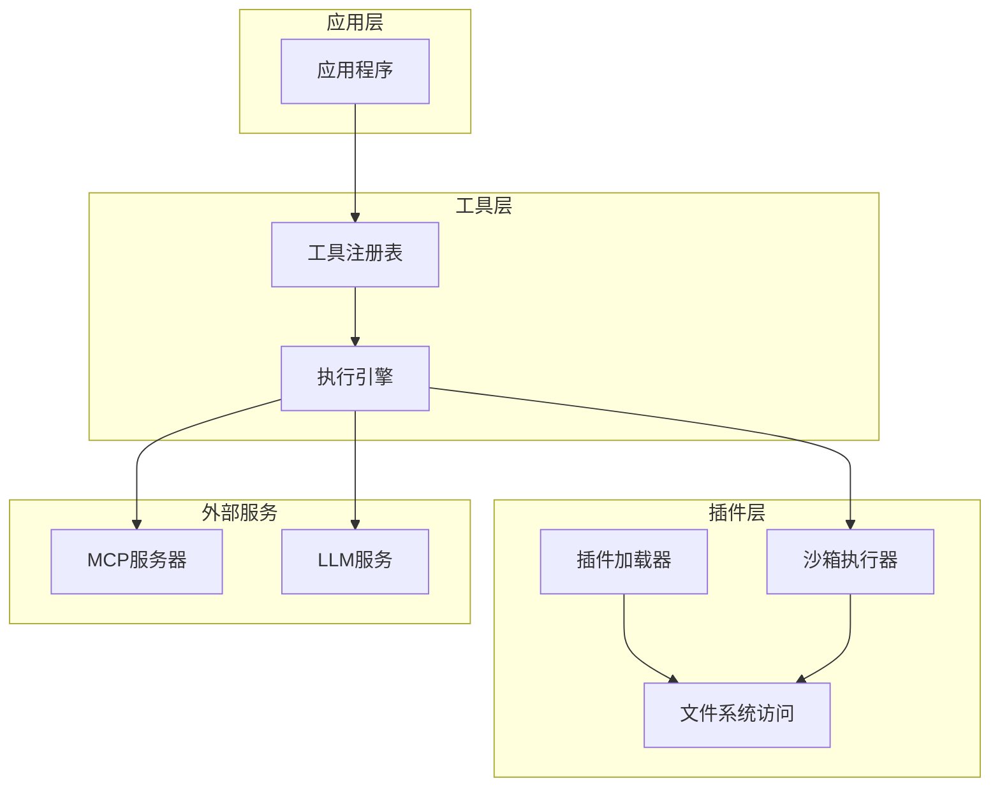
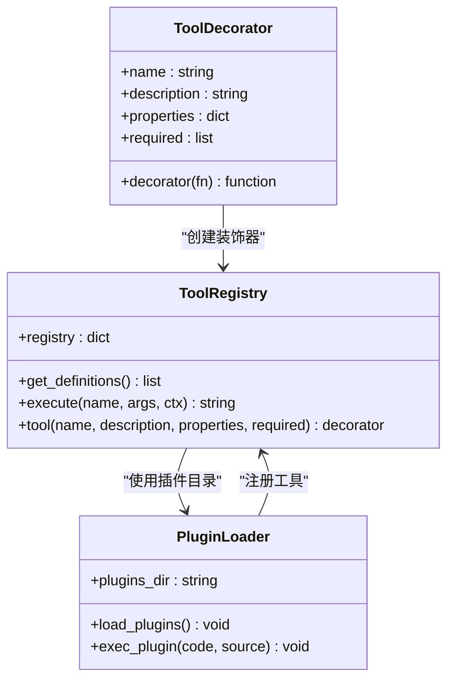
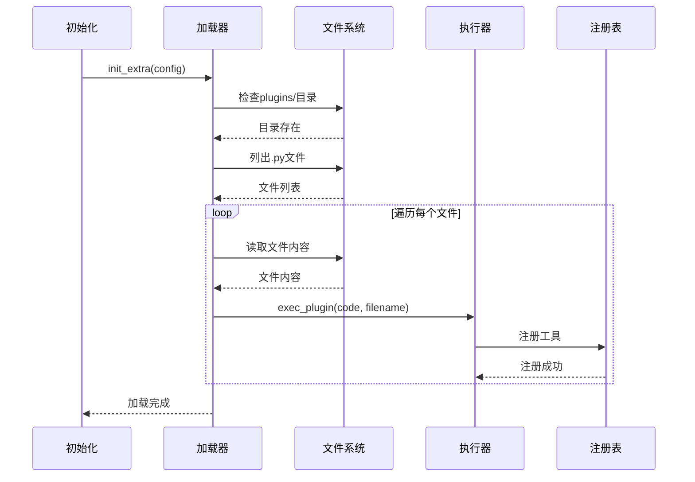
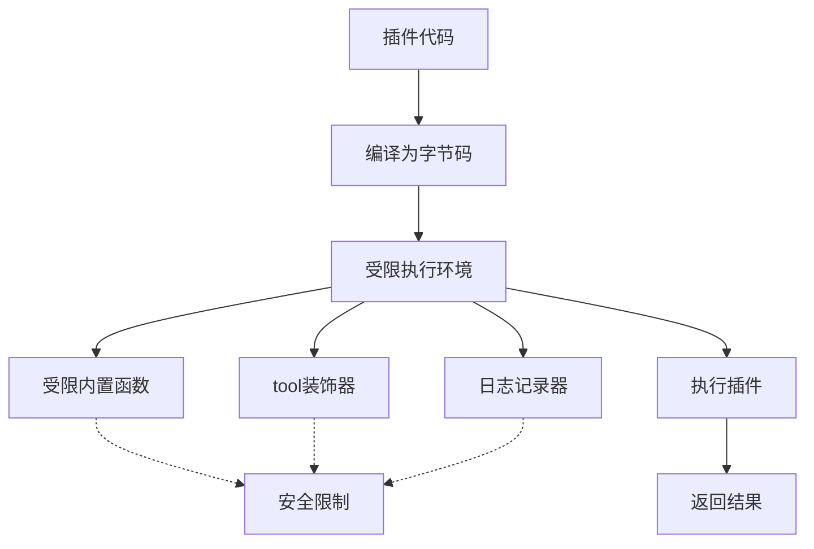
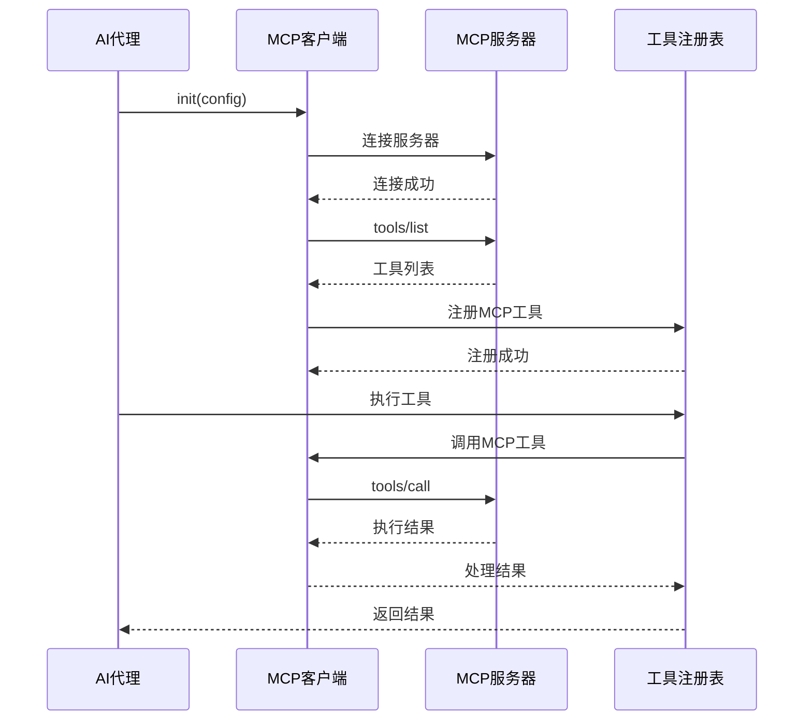
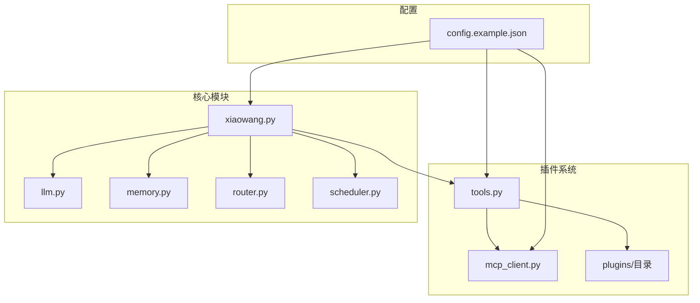

# 插件系统

<cite>
**本文档引用的文件**
- [README.md](file://README.md)
- [tools.py](file://tools.py)
- [mcp_client.py](file://mcp_client.py)
- [xiaowang.py](file://xiaowang.py)
- [llm.py](file://llm.py)
- [config.example.json](file://config.example.json)
</cite>

## 目录
1. [简介](#简介)
2. [项目结构](#项目结构)
3. [核心组件](#核心组件)
4. [架构概览](#架构概览)
5. [详细组件分析](#详细组件分析)
6. [依赖关系分析](#依赖关系分析)
7. [性能考虑](#性能考虑)
8. [故障排除指南](#故障排除指南)
9. [结论](#结论)
10. [附录](#附录)

## 简介

7/24 Office 是一个生产级的AI代理系统，采用纯Python实现，零框架依赖。该系统的核心特性之一是其强大的插件系统，支持自定义工具的动态加载和执行。插件系统允许开发者通过简单的装饰器语法创建新的工具函数，并将其无缝集成到AI代理的工具调用循环中。

插件系统的主要特点：
- **零框架依赖**：完全基于标准库实现
- **热重载支持**：无需重启即可动态加载和卸载插件
- **沙箱安全机制**：受控的执行环境
- **MCP协议支持**：可连接外部MCP服务器
- **自扩展能力**：支持运行时创建新工具

## 项目结构

该项目采用模块化设计，插件系统主要分布在以下文件中：



**图表来源**
- [xiaowang.py:59-75](file://xiaowang.py#L59-L75)
- [tools.py:502-511](file://tools.py#L502-L511)
- [config.example.json:52-59](file://config.example.json#L52-L59)

**章节来源**
- [README.md:13-16](file://README.md#L13-L16)
- [README.md:23-66](file://README.md#L23-L66)

## 核心组件

### 工具注册表系统

插件系统的核心是工具注册表，它负责管理所有可用的工具函数。系统提供了统一的装饰器接口，使得添加新工具变得极其简单。

关键组件包括：
- **工具装饰器**：`@tool` 装饰器用于注册工具
- **注册表管理**：维护工具名称到实现的映射
- **定义生成**：自动生成OpenAI兼容的工具定义
- **执行引擎**：安全地执行工具函数

### 插件执行环境

插件在受控的执行环境中运行，确保安全性的同时保持灵活性：



**图表来源**
- [tools.py:527-544](file://tools.py#L527-L544)
- [tools.py:518-525](file://tools.py#L518-L525)

**章节来源**
- [tools.py:36-74](file://tools.py#L36-L74)
- [tools.py:518-544](file://tools.py#L518-L544)

## 架构概览

插件系统采用分层架构设计，确保模块间的松耦合和高内聚：



**图表来源**
- [tools.py:506-511](file://tools.py#L506-L511)
- [mcp_client.py:27-48](file://mcp_client.py#L27-L48)

## 详细组件分析

### 工具装饰器系统

工具装饰器是插件系统的核心机制，它简化了工具的创建和注册过程：



**图表来源**
- [tools.py:36-56](file://tools.py#L36-L56)
- [tools.py:58-74](file://tools.py#L58-L74)
- [tools.py:527-544](file://tools.py#L527-L544)

#### 装饰器工作流程

1. **装饰器调用**：`@tool(name, description, properties, required)`
2. **装饰器返回**：返回装饰器函数
3. **函数包装**：装饰器函数包装原始函数
4. **注册到表**：将工具信息注册到全局注册表
5. **定义生成**：生成OpenAI兼容的工具定义

**章节来源**
- [tools.py:36-56](file://tools.py#L36-L56)
- [tools.py:58-74](file://tools.py#L58-L74)

### 插件加载机制

插件系统支持多种加载方式，包括启动时自动加载和运行时动态加载：

#### 启动时加载

系统在初始化时自动扫描并加载插件目录中的所有Python文件：



**图表来源**
- [tools.py:506-511](file://tools.py#L506-L511)
- [tools.py:527-544](file://tools.py#L527-L544)

#### 运行时动态加载

系统提供了完整的API来管理插件的动态创建、删除和修改：

**章节来源**
- [tools.py:1024-1055](file://tools.py#L1024-L1055)
- [tools.py:1058-1090](file://tools.py#L1058-L1090)

### 沙箱安全机制

为了确保系统的安全性，插件在执行时运行在一个受控的沙箱环境中：

#### 受控执行环境

插件代码在执行时被限制在特定的命名空间中：



**图表来源**
- [tools.py:518-525](file://tools.py#L518-L525)

#### 安全限制策略

沙箱环境实施了多重安全措施：

1. **内置函数限制**：只暴露必要的内置函数
2. **导入限制**：限制第三方模块的导入
3. **文件系统访问**：限制对敏感文件的访问
4. **网络访问**：限制不受控制的网络请求
5. **资源限制**：防止资源耗尽攻击

**章节来源**
- [tools.py:518-525](file://tools.py#L518-L525)

### MCP协议集成

插件系统还支持与外部MCP服务器的集成，扩展了工具的功能范围：



**图表来源**
- [mcp_client.py:272-286](file://mcp_client.py#L272-L286)
- [mcp_client.py:1138-1153](file://mcp_client.py#L1138-L1153)

**章节来源**
- [mcp_client.py:27-48](file://mcp_client.py#L27-L48)
- [mcp_client.py:288-333](file://mcp_client.py#L288-L333)

## 依赖关系分析

插件系统与其他模块之间的依赖关系如下：



**图表来源**
- [xiaowang.py:59-75](file://xiaowang.py#L59-L75)
- [tools.py:506-511](file://tools.py#L506-L511)
- [config.example.json:52-59](file://config.example.json#L52-L59)

**章节来源**
- [xiaowang.py:59-75](file://xiaowang.py#L59-L75)
- [tools.py:506-511](file://tools.py#L506-L511)

## 性能考虑

插件系统在设计时充分考虑了性能因素：

### 内存管理

- **延迟加载**：插件按需加载，避免启动时的内存压力
- **缓存机制**：已加载的插件信息会被缓存，减少重复加载开销
- **垃圾回收**：及时清理不再使用的插件对象

### 执行效率

- **线程安全**：插件执行使用锁机制，确保并发安全
- **超时控制**：为插件执行设置合理的超时时间
- **资源限制**：防止恶意插件消耗过多系统资源

### 热重载优化

- **增量更新**：只重新加载发生变化的插件
- **原子操作**：确保插件更新的原子性
- **回滚机制**：失败时自动回滚到之前的稳定状态

## 故障排除指南

### 常见问题及解决方案

#### 插件加载失败

**症状**：插件无法加载，出现异常错误

**可能原因**：
1. 插件代码语法错误
2. 缺少必要的导入模块
3. 权限不足访问文件系统

**解决步骤**：
1. 检查插件文件的语法正确性
2. 确认所有依赖模块都已安装
3. 验证插件目录的读写权限

#### 工具执行错误

**症状**：工具调用失败，返回错误信息

**排查方法**：
1. 查看插件执行日志
2. 检查工具参数的有效性
3. 验证工具的前置条件

#### 性能问题

**症状**：系统响应缓慢，插件执行时间过长

**优化建议**：
1. 减少插件中的I/O操作
2. 实现适当的缓存机制
3. 使用异步编程模式

**章节来源**
- [tools.py:541-544](file://tools.py#L541-L544)
- [tools.py:1044-1047](file://tools.py#L1044-L1047)

## 结论

7/24 Office的插件系统是一个设计精良、功能强大的扩展机制。它通过简洁的装饰器语法、安全的沙箱执行环境和灵活的热重载机制，为AI代理提供了强大的自扩展能力。

系统的主要优势包括：
- **易用性**：简单的装饰器语法降低了插件开发门槛
- **安全性**：完善的沙箱机制保护了系统安全
- **灵活性**：支持多种加载方式和集成方案
- **性能**：优化的设计确保了良好的运行效率

随着AI技术的发展，插件系统将继续演进，为用户提供更加强大和灵活的扩展能力。

## 附录

### 插件开发最佳实践

#### 代码组织结构

建议按照以下结构组织插件代码：

```
plugins/
├── weather.py          # 天气查询插件
├── news.py            # 新闻聚合插件
├── calculator.py      # 计算器插件
└── utils.py           # 工具函数集合
```

#### 开发规范

1. **命名规范**：使用小写字母和下划线分隔的工具名称
2. **参数验证**：始终验证输入参数的有效性
3. **错误处理**：提供清晰的错误信息和异常处理
4. **文档注释**：为每个工具函数添加详细的文档说明

#### 调试技巧

1. **日志记录**：使用系统提供的日志功能进行调试
2. **单元测试**：为插件编写单元测试确保质量
3. **性能监控**：监控插件的执行时间和资源使用情况
4. **版本管理**：使用版本控制系统管理插件的变更历史

### 配置参考

插件系统相关的配置选项：

| 配置项 | 类型 | 默认值 | 描述 |
|--------|------|--------|------|
| `plugins_dir` | string | `plugins/` | 插件目录路径 |
| `max_plugins` | integer | 100 | 最大插件数量限制 |
| `plugin_timeout` | integer | 30 | 插件执行超时时间（秒） |
| `enable_hot_reload` | boolean | true | 是否启用热重载功能 |

**章节来源**
- [config.example.json:52-59](file://config.example.json#L52-L59)
- [tools.py:502-511](file://tools.py#L502-L511)