# 自定义工具开发

<cite>
**本文档引用的文件**
- [README.md](file://README.md)
- [tools.py](file://tools.py)
- [llm.py](file://llm.py)
- [xiaowang.py](file://xiaowang.py)
- [scheduler.py](file://scheduler.py)
- [memory.py](file://memory.py)
- [mcp_client.py](file://mcp_client.py)
- [self_check_tool.py](file://self_check_tool.py)
- [config.example.json](file://config.example.json)
</cite>

## 目录
1. [简介](#简介)
2. [项目结构](#项目结构)
3. [核心组件](#核心组件)
4. [架构概览](#架构概览)
5. [详细组件分析](#详细组件分析)
6. [依赖关系分析](#依赖关系分析)
7. [性能考虑](#性能考虑)
8. [故障排除指南](#故障排除指南)
9. [结论](#结论)
10. [附录](#附录)

## 简介

7/24 Office 是一个生产级的AI智能体系统，采用纯Python实现（约3500行代码），实现了零框架依赖的设计理念。该系统提供了完整的自定义工具开发能力，支持运行时创建和加载新的Python工具，具备自我修复、多租户路由、内存管理、MCP插件系统等功能。

本指南将详细介绍如何从零开始开发自定义工具，包括工具需求分析、设计思路、代码实现和测试验证的完整流程。

## 项目结构

该项目采用模块化设计，每个功能模块都有明确的职责分工：

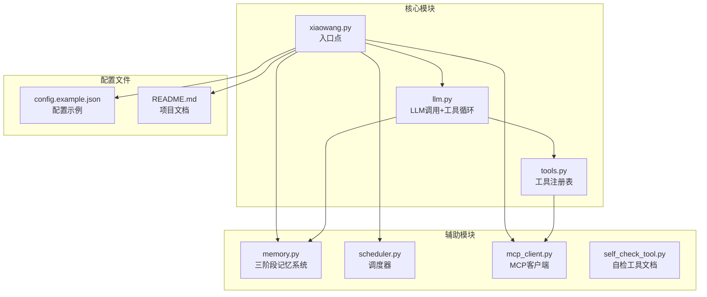

**图表来源**
- [xiaowang.py:1-626](file://xiaowang.py#L1-L626)
- [llm.py:1-401](file://llm.py#L1-L401)
- [tools.py:1-1153](file://tools.py#L1-L1153)

**章节来源**
- [README.md:1-162](file://README.md#L1-L162)
- [config.example.json:1-61](file://config.example.json#L1-L61)

## 核心组件

### 工具注册表系统

工具注册表是整个系统的核心，负责管理所有可用的工具及其元数据。它提供了装饰器模式来注册新工具，并维护OpenAI函数调用格式的兼容性。

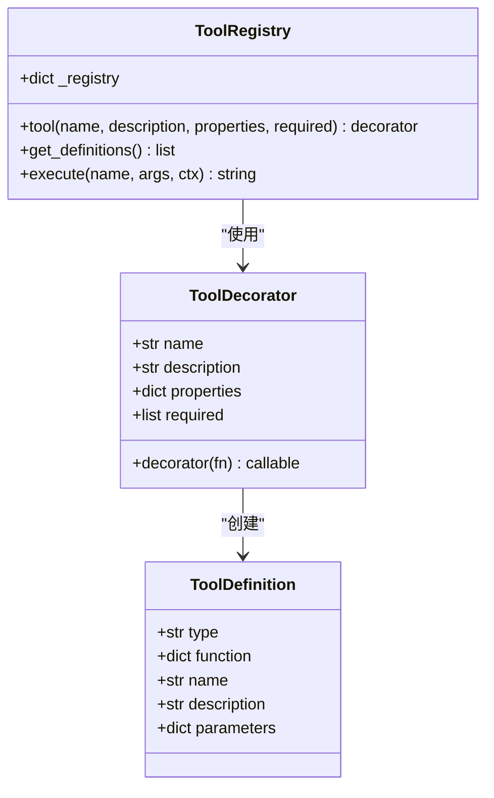

**图表来源**
- [tools.py:36-74](file://tools.py#L36-L74)

### LLM工具使用循环

LLM工具使用循环是系统的核心执行引擎，负责协调LLM推理、工具调用和结果处理：

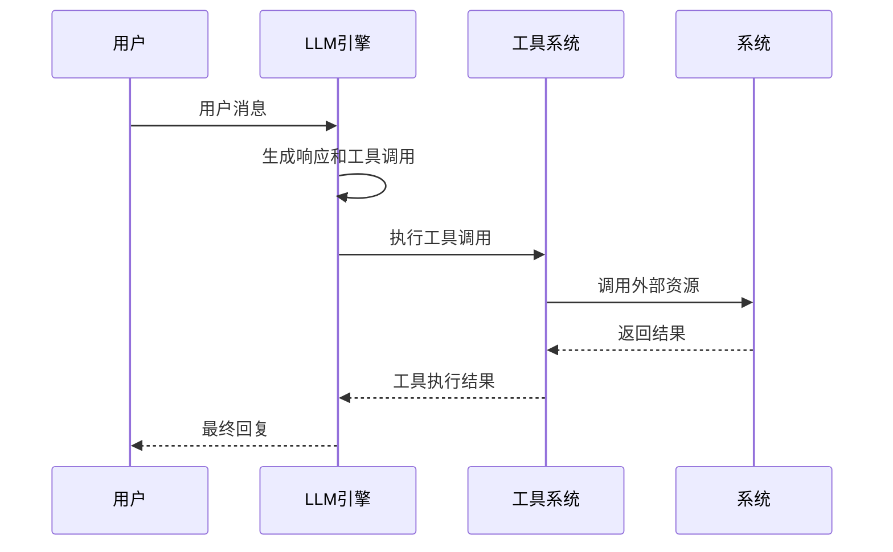

**图表来源**
- [llm.py:317-401](file://llm.py#L317-L401)

**章节来源**
- [tools.py:1-800](file://tools.py#L1-L800)
- [llm.py:1-401](file://llm.py#L1-L401)

## 架构概览

系统采用分层架构设计，确保高内聚低耦合：

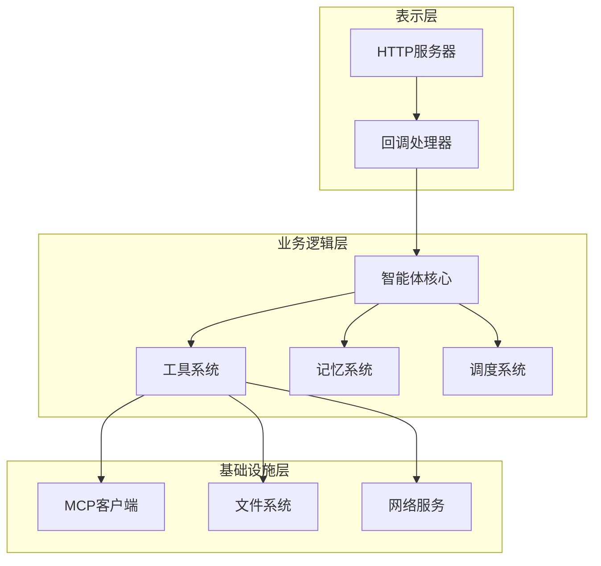

**图表来源**
- [xiaowang.py:559-626](file://xiaowang.py#L559-L626)
- [llm.py:317-401](file://llm.py#L317-L401)

## 详细组件分析

### 工具开发基础

#### 工具装饰器模式

每个工具都通过`@tool`装饰器进行注册，该装饰器提供了统一的工具定义接口：

```mermaid
flowchart TD
Start([开始开发工具]) --> Define[定义工具函数]
Define --> Decorate[使用@tool装饰器]
Decorate --> Schema[定义参数模式]
Schema --> Register[自动注册到注册表]
Register --> Test[测试工具功能]
Test --> Deploy[部署到生产环境]
Deploy --> Monitor[监控工具性能]
Monitor --> Iterate[迭代改进]
Iterate --> Define
```

**图表来源**
- [tools.py:36-56](file://tools.py#L36-L56)

#### 工具参数定义规范

工具的参数定义遵循OpenAI函数调用格式，确保与LLM的兼容性：

| 参数类型 | 描述 | 示例 |
|---------|------|------|
| string | 文本参数 | `"path": {"type": "string", "description": "文件路径"}` |
| integer | 整数参数 | `"timeout": {"type": "integer", "description": "超时时间"}` |
| boolean | 布尔参数 | `"send_to": {"type": "boolean", "description": "是否发送"}` |
| number | 数值参数 | `"volume": {"type": "number", "description": "音量比例"}` |

**章节来源**
- [tools.py:109-146](file://tools.py#L109-L146)
- [tools.py:167-179](file://tools.py#L167-L179)

### 文件操作工具

#### 文件读取工具

文件读取工具提供了安全的文件访问机制，支持绝对路径和相对路径：

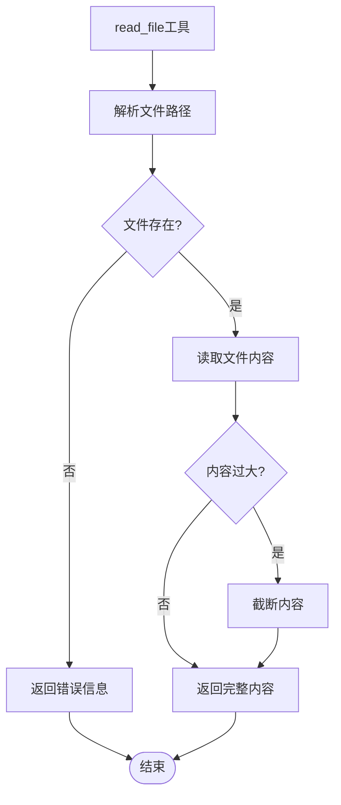

**图表来源**
- [tools.py:150-165](file://tools.py#L150-L165)

#### 文件写入工具

文件写入工具提供了安全的文件创建和修改功能：

**章节来源**
- [tools.py:148-203](file://tools.py#L148-L203)

### 系统命令执行工具

#### 安全的命令执行

系统命令执行工具提供了受控的shell命令执行能力：

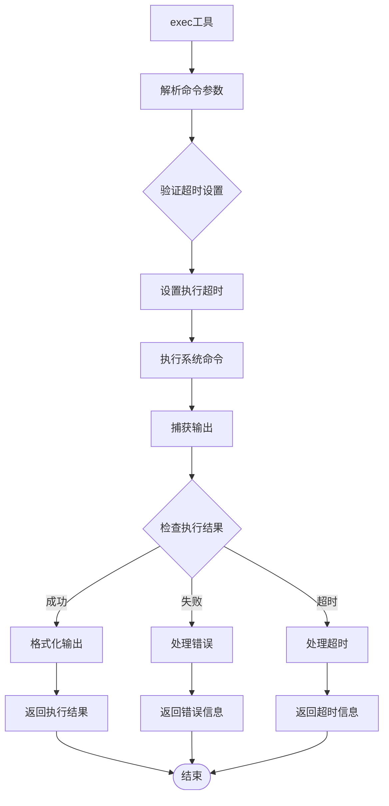

**图表来源**
- [tools.py:110-132](file://tools.py#L110-L132)

**章节来源**
- [tools.py:109-132](file://tools.py#L109-L132)

### 网络请求工具

#### 多源搜索工具

系统集成了多种搜索源，提供了灵活的信息检索能力：

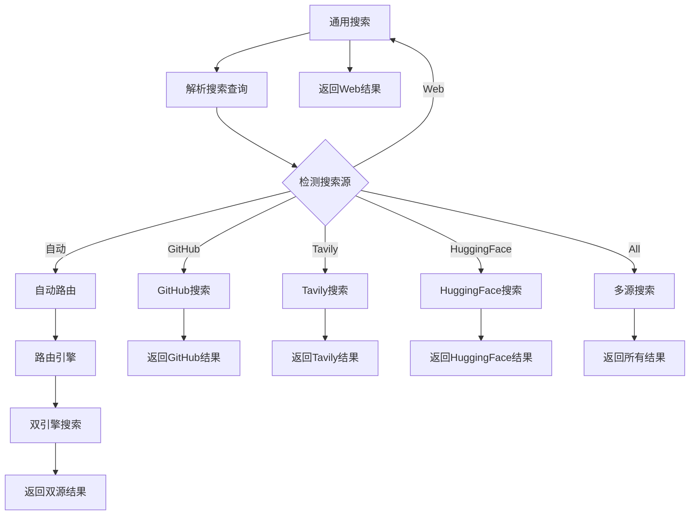

**图表来源**
- [tools.py:705-761](file://tools.py#L705-L761)

**章节来源**
- [tools.py:498-761](file://tools.py#L498-L761)

### 媒体处理工具

#### 视频处理工具

系统提供了完整的视频处理能力，包括剪辑、添加背景音乐和AI视频生成：

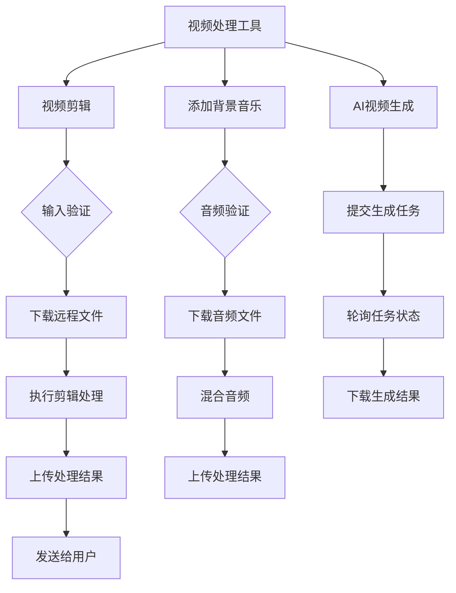

**图表来源**
- [tools.py:326-496](file://tools.py#L326-L496)

**章节来源**
- [tools.py:304-496](file://tools.py#L304-L496)

### 调度系统工具

#### 任务调度工具

调度系统提供了灵活的任务管理和执行能力：

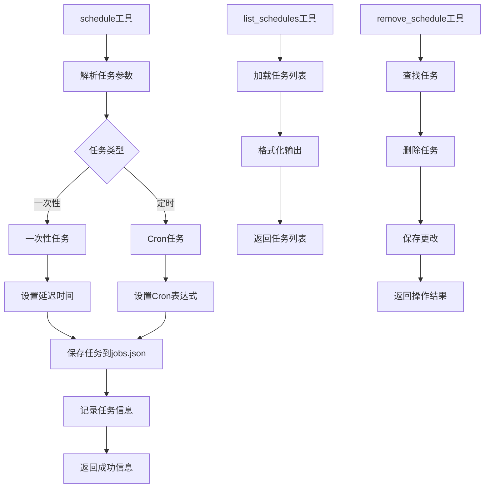

**图表来源**
- [tools.py:240-262](file://tools.py#L240-L262)

**章节来源**
- [tools.py:238-262](file://tools.py#L238-L262)
- [scheduler.py:49-104](file://scheduler.py#L49-L104)

### 自检工具模式

#### 自我修复机制

系统实现了完整的自我监控和修复能力：

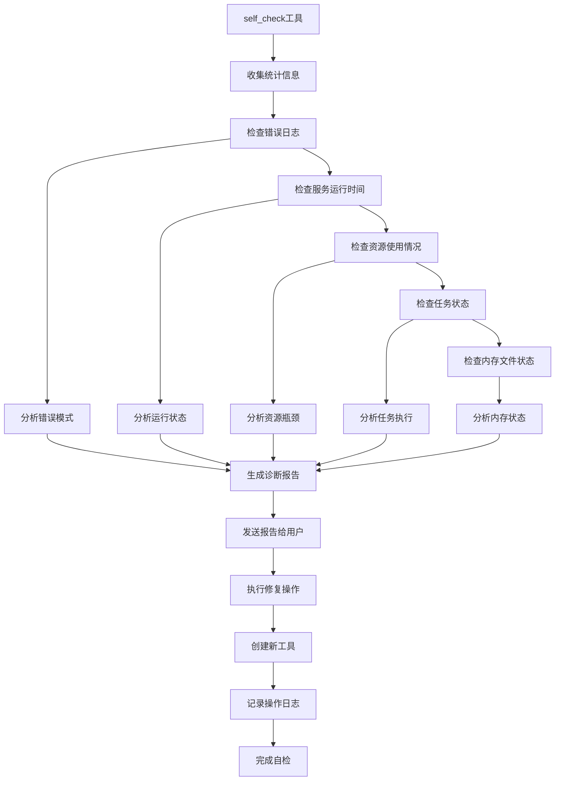

**图表来源**
- [self_check_tool.py:1-57](file://self_check_tool.py#L1-L57)

**章节来源**
- [self_check_tool.py:1-57](file://self_check_tool.py#L1-L57)

## 依赖关系分析

系统采用松耦合的设计，各模块之间的依赖关系清晰明确：

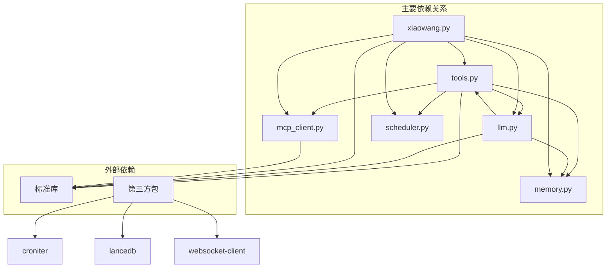

**图表来源**
- [tools.py:80-83](file://tools.py#L80-L83)
- [llm.py:17](file://llm.py#L17)
- [xiaowang.py:59-75](file://xiaowang.py#L59-L75)

**章节来源**
- [tools.py:80-83](file://tools.py#L80-L83)
- [llm.py:17](file://llm.py#L17)
- [xiaowang.py:59-75](file://xiaowang.py#L59-L75)

## 性能考虑

### 内存管理优化

系统采用了三层内存管理策略，确保在资源受限环境下的稳定运行：

1. **会话内存**：限制最近40条消息，超出部分自动压缩
2. **长期记忆**：使用向量数据库存储重要信息
3. **缓存机制**：为硬件通道提供零延迟访问

### 并发控制

系统实现了线程安全的聊天锁机制，确保同一会话的消息处理顺序：

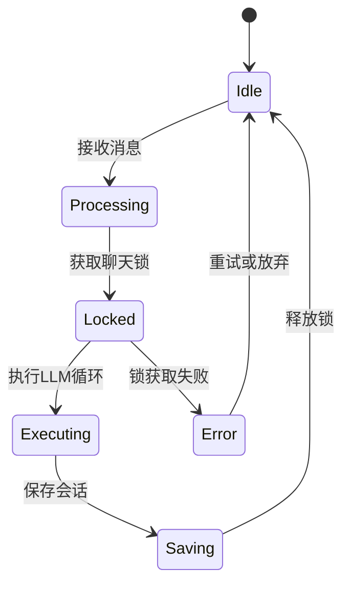

**图表来源**
- [llm.py:310-322](file://llm.py#L310-L322)

### 资源限制

系统对各种操作设置了合理的超时和大小限制：

- **命令执行超时**：默认60秒，最长300秒
- **文件读取限制**：超过10000字符自动截断
- **消息长度限制**：单次发送不超过1800字节
- **搜索结果限制**：默认显示5个结果

## 故障排除指南

### 常见问题诊断

#### 工具执行失败

当工具执行失败时，系统会返回详细的错误信息：

1. **未知工具名称**：检查工具是否正确注册
2. **参数验证失败**：确认必需参数是否提供
3. **权限不足**：检查文件系统访问权限
4. **网络连接失败**：验证API密钥和网络配置

#### LLM调用错误

LLM调用失败通常由以下原因引起：

1. **HTTP错误**：检查API端点和认证信息
2. **超时错误**：增加超时时间或优化请求
3. **模型不兼容**：确认模型支持函数调用格式

#### 内存系统问题

内存系统故障的常见症状：

1. **向量数据库初始化失败**：检查嵌入API配置
2. **压缩过程异常**：验证LLM提供商设置
3. **检索结果为空**：确认索引是否建立

**章节来源**
- [tools.py:63-74](file://tools.py#L63-L74)
- [llm.py:74-83](file://llm.py#L74-L83)

### 调试技巧

#### 日志分析

系统提供了丰富的日志信息，便于问题定位：

1. **工具执行日志**：记录工具调用详情
2. **LLM交互日志**：跟踪对话历史
3. **系统状态日志**：监控内存和资源使用

#### 性能监控

使用内置的性能计数器监控系统表现：

- **准备时间**：系统初始化和预处理耗时
- **LLM调用时间**：模型推理耗时
- **工具执行次数**：工具使用频率
- **总处理时间**：单次对话完整耗时

## 结论

7/24 Office系统提供了一个完整、可扩展的自定义工具开发平台。通过其简洁的装饰器模式、完善的错误处理机制和灵活的配置系统，开发者可以快速构建各种类型的工具来满足特定需求。

系统的最大优势在于其零框架依赖的设计理念，使得每个组件都是透明且可调试的。同时，强大的MCP插件系统和运行时工具创建能力，为系统的持续演进提供了坚实基础。

对于新工具开发者，建议遵循以下最佳实践：
1. 使用统一的装饰器模式注册工具
2. 提供清晰的参数定义和错误处理
3. 实现适当的超时和资源限制
4. 编写充分的单元测试和集成测试
5. 添加必要的日志记录和监控指标

## 附录

### 工具开发模板

#### 基础工具模板

```python
@tool("工具名称", "工具描述", {
    "参数名": {"type": "参数类型", "description": "参数描述"}
}, ["必需参数列表"])
def tool_function(args, ctx):
    """
    工具实现逻辑
    """
    try:
        # 工具具体实现
        return "执行结果"
    except Exception as e:
        return f"[error] {e}"
```

#### 文件操作工具模板

```python
@tool("文件操作工具", "文件操作描述", {
    "path": {"type": "string", "description": "文件路径"},
    "content": {"type": "string", "description": "文件内容"}
}, ["path", "content"])
def tool_file_operation(args, ctx):
    fpath = _resolve_path(args["path"], ctx["workspace"])
    try:
        # 文件操作实现
        return f"操作结果: {fpath}"
    except Exception as e:
        return f"[error] {e}"
```

#### 网络请求工具模板

```python
@tool("网络请求工具", "网络请求描述", {
    "url": {"type": "string", "description": "请求URL"},
    "timeout": {"type": "integer", "description": "超时时间"}
}, ["url"])
def tool_network_request(args, ctx):
    try:
        # 网络请求实现
        return "请求结果"
    except urllib.error.HTTPError as e:
        return f"[error] HTTP {e.code}: {e.reason}"
    except Exception as e:
        return f"[error] 请求失败: {e}"
```

### 配置参考

#### 工具配置示例

```json
{
  "tools": {
    "custom_tool": {
      "name": "自定义工具",
      "description": "自定义工具描述",
      "parameters": {
        "type": "object",
        "properties": {
          "param1": {"type": "string", "description": "参数1描述"},
          "param2": {"type": "integer", "description": "参数2描述"}
        },
        "required": ["param1"]
      }
    }
  }
}
```

#### 环境变量配置

- `AGENT_CONFIG`: 指定配置文件路径
- `WORKSPACE`: 指定工作目录
- `PORT`: 指定HTTP服务端口

### 测试验证清单

#### 单元测试要点

1. **参数验证测试**
   - 必需参数缺失
   - 参数类型不匹配
   - 参数范围验证

2. **边界条件测试**
   - 空输入处理
   - 超长字符串处理
   - 特殊字符处理

3. **错误场景测试**
   - 网络连接失败
   - 文件权限不足
   - 超时处理

4. **性能测试**
   - 响应时间测量
   - 资源使用监控
   - 并发处理能力

#### 集成测试要点

1. **工具链路测试**
   - LLM -> 工具 -> 结果验证
   - 多工具组合使用
   - 错误传播机制

2. **系统集成测试**
   - HTTP服务集成
   - 文件系统集成
   - 外部API集成

3. **监控集成测试**
   - 日志记录验证
   - 性能指标收集
   - 异常告警机制

**章节来源**
- [config.example.json:1-61](file://config.example.json#L1-L61)
- [README.md:101-162](file://README.md#L101-L162)