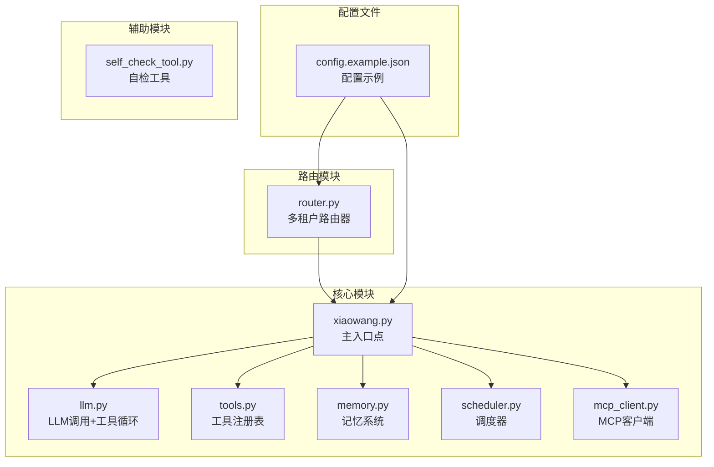
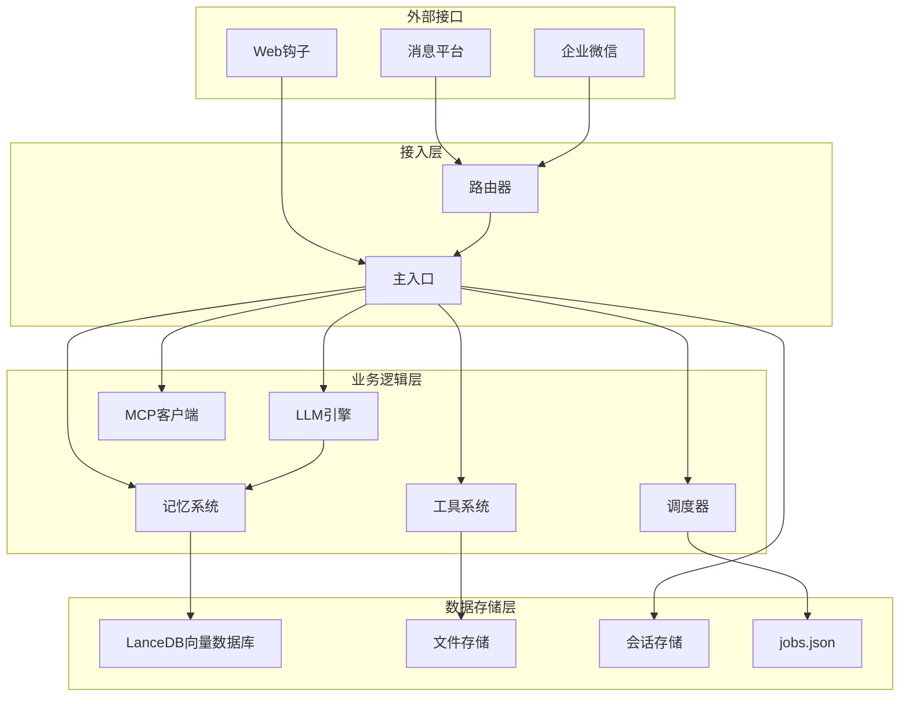
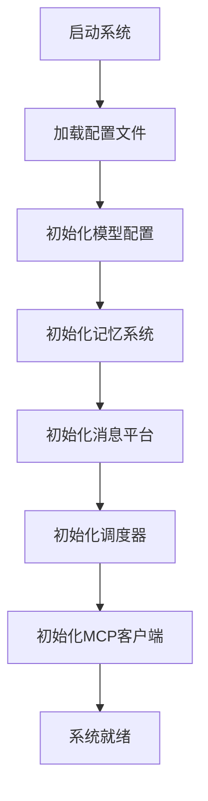
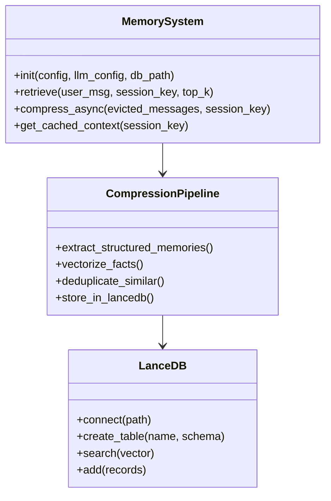
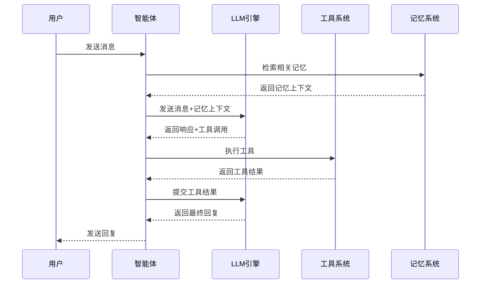
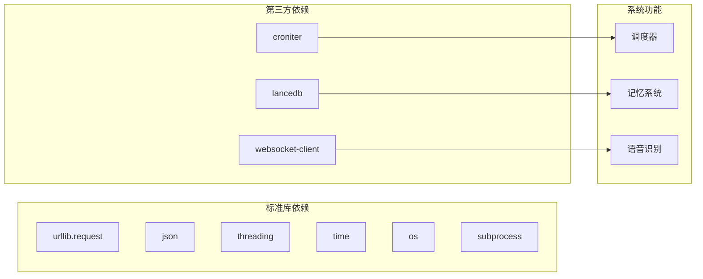

# 快速开始

<cite>
**本文档引用的文件**
- [README.md](file://README.md)
- [config.example.json](file://config.example.json)
- [xiaowang.py](file://xiaowang.py)
- [llm.py](file://llm.py)
- [tools.py](file://tools.py)
- [memory.py](file://memory.py)
- [scheduler.py](file://scheduler.py)
- [router.py](file://router.py)
- [mcp_client.py](file://mcp_client.py)
- [self_check_tool.py](file://self_check_tool.py)
</cite>

## 目录
1. [简介](#简介)
2. [项目结构](#项目结构)
3. [核心组件](#核心组件)
4. [架构概览](#架构概览)
5. [详细组件分析](#详细组件分析)
6. [依赖分析](#依赖分析)
7. [性能考虑](#性能考虑)
8. [故障排除指南](#故障排除指南)
9. [结论](#结论)

## 简介

724 Office是一个基于纯Python构建的生产级AI智能体系统，具有零框架依赖性。该项目在约3,500行纯Python代码中实现了完整的AI助手功能，无需LangChain、LlamaIndex或CrewAI等外部框架依赖。

该系统的核心特性包括：
- **工具使用循环** - 支持自动重试的OpenAI兼容函数调用，每对话最多20次迭代
- **三层记忆系统** - 会话历史 + LLM压缩的长期记忆 + LanceDB向量检索
- **MCP/插件系统** - 通过JSON-RPC连接外部MCP服务器，支持热重载
- **运行时工具创建** - 智能体可以在运行时编写、保存和加载新的Python工具
- **自我修复** - 每日自检、会话健康诊断、错误日志分析和失败自动通知

## 项目结构

项目采用模块化设计，每个核心功能都封装在独立的Python文件中：

**图表来源**
- [xiaowang.py:1-626](file://xiaowang.py#L1-L626)
- [llm.py:1-401](file://llm.py#L1-L401)
- [tools.py:1-800](file://tools.py#L1-L800)
- [memory.py:1-361](file://memory.py#L1-L361)
- [scheduler.py:1-219](file://scheduler.py#L1-L219)
- [router.py:1-493](file://router.py#L1-L493)
- [mcp_client.py:1-334](file://mcp_client.py#L1-L334)
- [self_check_tool.py:1-57](file://self_check_tool.py#L1-L57)

**章节来源**
- [README.md:1-162](file://README.md#L1-L162)
- [config.example.json:1-61](file://config.example.json#L1-L61)

## 核心组件

### 主入口点 (xiaowang.py)
主入口点负责初始化所有子系统并启动HTTP服务器。它处理消息平台回调、去抖动机制和多媒体消息处理。

### LLM核心 (llm.py)
实现核心的LLM调用循环，支持多模态输入（文本、图像），管理会话状态，并与记忆系统集成。

### 工具系统 (tools.py)
提供26个内置工具的注册表，包括文件操作、调度、媒体发送、视频处理、网络搜索等功能。

### 记忆系统 (memory.py)
实现三层记忆管道：压缩、去重和检索，使用LanceDB进行向量存储。

### 调度器 (scheduler.py)
支持一次性延迟任务和Cron表达式重复任务，使用croniter库进行时间计算。

### 多租户路由器 (router.py)
支持多用户容器化部署，为每个用户自动创建和管理独立的AI助手容器。

**章节来源**
- [xiaowang.py:35-76](file://xiaowang.py#L35-L76)
- [llm.py:33-401](file://llm.py#L33-L401)
- [tools.py:36-74](file://tools.py#L36-L74)
- [memory.py:40-86](file://memory.py#L40-L86)
- [scheduler.py:30-43](file://scheduler.py#L30-L43)
- [router.py:23-42](file://router.py#L23-L42)

## 架构概览

系统采用分层架构设计，各组件职责明确且松耦合：

**图表来源**
- [router.py:1-493](file://router.py#L1-L493)
- [xiaowang.py:59-626](file://xiaowang.py#L59-L626)
- [llm.py:1-401](file://llm.py#L1-L401)
- [memory.py:1-361](file://memory.py#L1-L361)
- [scheduler.py:1-219](file://scheduler.py#L1-L219)
- [mcp_client.py:1-334](file://mcp_client.py#L1-L334)

## 详细组件分析

### 配置系统

配置系统采用JSON格式，支持多种配置选项：

**图表来源**
- [config.example.json:1-61](file://config.example.json#L1-L61)
- [xiaowang.py:38-76](file://xiaowang.py#L38-L76)

### 记忆系统架构

三层记忆系统提供了完整的知识管理能力：

**图表来源**
- [memory.py:40-86](file://memory.py#L40-L86)
- [memory.py:294-361](file://memory.py#L294-L361)

### 工具使用循环

核心的工具使用循环实现了智能体的决策过程：

**图表来源**
- [llm.py:317-401](file://llm.py#L317-L401)
- [tools.py:63-74](file://tools.py#L63-L74)

**章节来源**
- [config.example.json:1-61](file://config.example.json#L1-L61)
- [memory.py:1-361](file://memory.py#L1-L361)
- [llm.py:305-401](file://llm.py#L305-L401)
- [tools.py:1-800](file://tools.py#L1-L800)

## 依赖分析

系统依赖关系简洁明了，主要依赖于标准库和三个小而精的第三方包：

**图表来源**
- [scheduler.py:1-219](file://scheduler.py#L1-L219)
- [memory.py:1-361](file://memory.py#L1-L361)
- [xiaowang.py:1-626](file://xiaowang.py#L1-L626)

**章节来源**
- [scheduler.py:1-219](file://scheduler.py#L1-L219)
- [memory.py:1-361](file://memory.py#L1-L361)
- [xiaowang.py:1-626](file://xiaowang.py#L1-L626)

## 性能考虑

系统在设计时充分考虑了性能优化：

- **内存管理**：会话消息限制在40条以内，超出部分自动压缩到长期记忆
- **缓存策略**：硬件/语音通道使用零延迟缓存
- **异步处理**：记忆压缩和工具执行都是异步进行
- **资源限制**：容器化部署支持内存限制和并发控制

## 故障排除指南

### 常见问题及解决方案

1. **依赖安装问题**
   - 确保正确安装croniter、lancedb、websocket-client
   - 某些平台可能需要额外的编解码器支持

2. **配置文件问题**
   - 确保config.json中的API密钥正确无误
   - 检查工作空间目录权限

3. **内存系统问题**
   - 确保LanceDB嵌入API密钥有效
   - 检查磁盘空间是否充足

4. **多租户路由问题**
   - 确保Docker守护进程正常运行
   - 检查网络配置和端口占用

**章节来源**
- [README.md:101-162](file://README.md#L101-L162)
- [config.example.json:1-61](file://config.example.json#L1-L61)

## 结论

724 Office提供了一个完整、可扩展且易于维护的AI智能体解决方案。其零框架依赖的设计理念使得系统透明度极高，便于调试和定制。通过合理的模块化设计和清晰的依赖关系，该系统能够在各种环境中稳定运行。

建议用户根据具体需求调整配置参数，并充分利用系统的自检和自我修复能力来确保长期稳定运行。