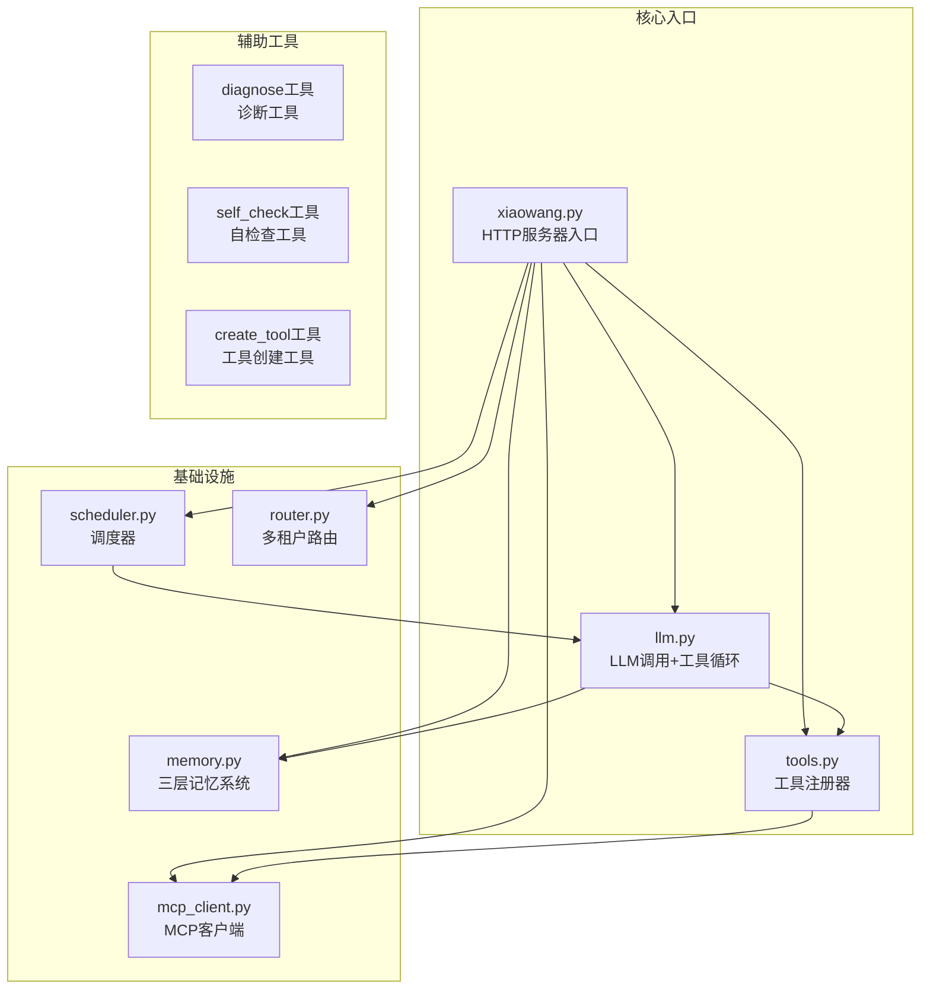
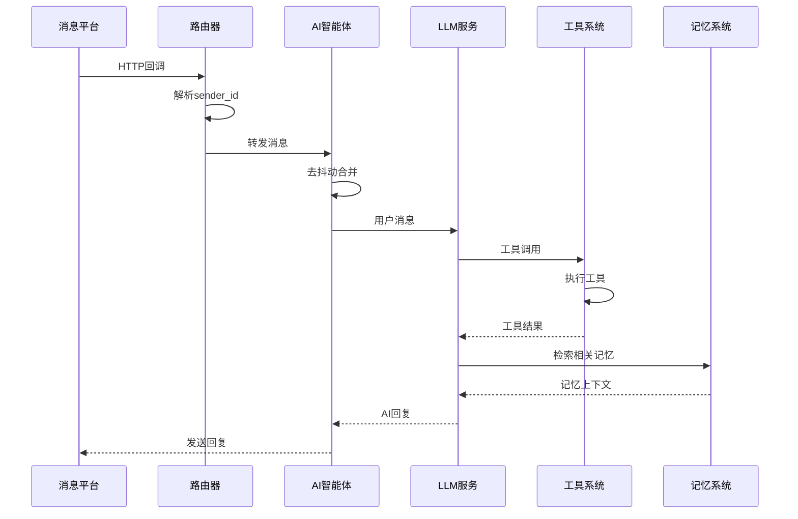
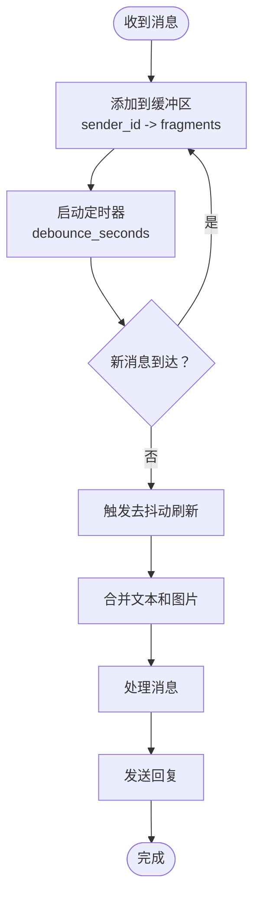
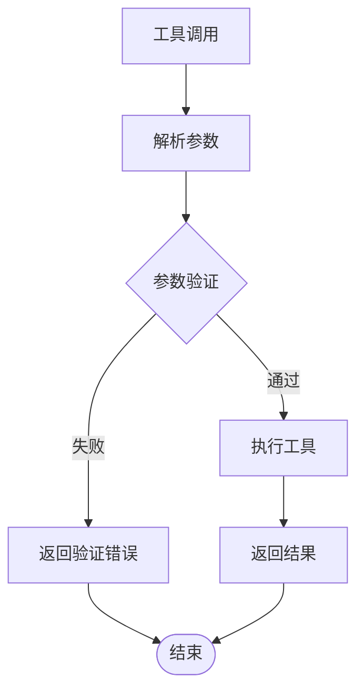
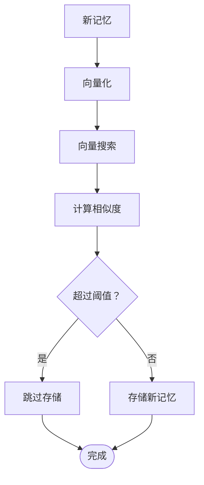
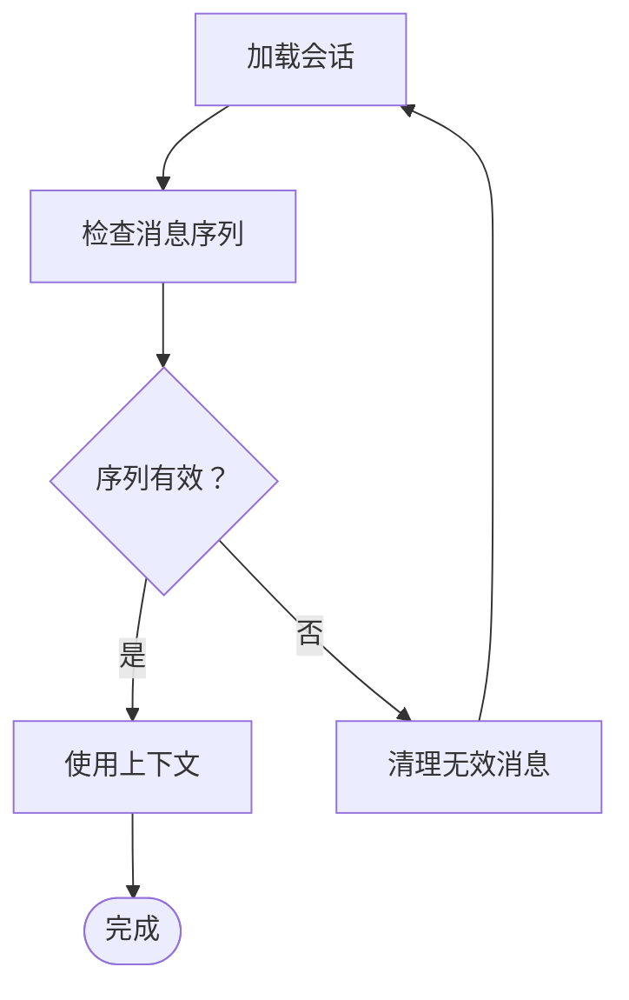
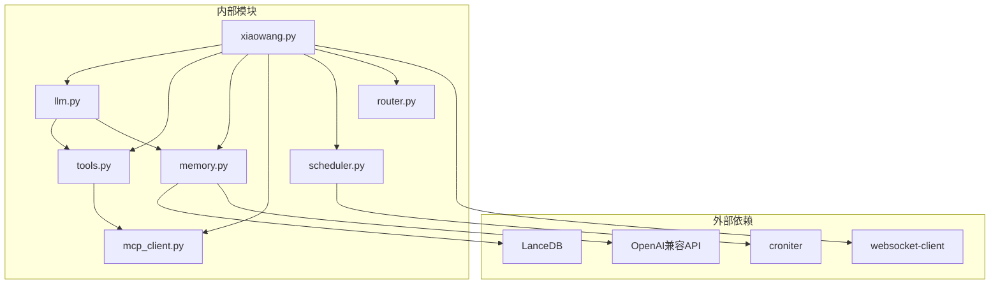
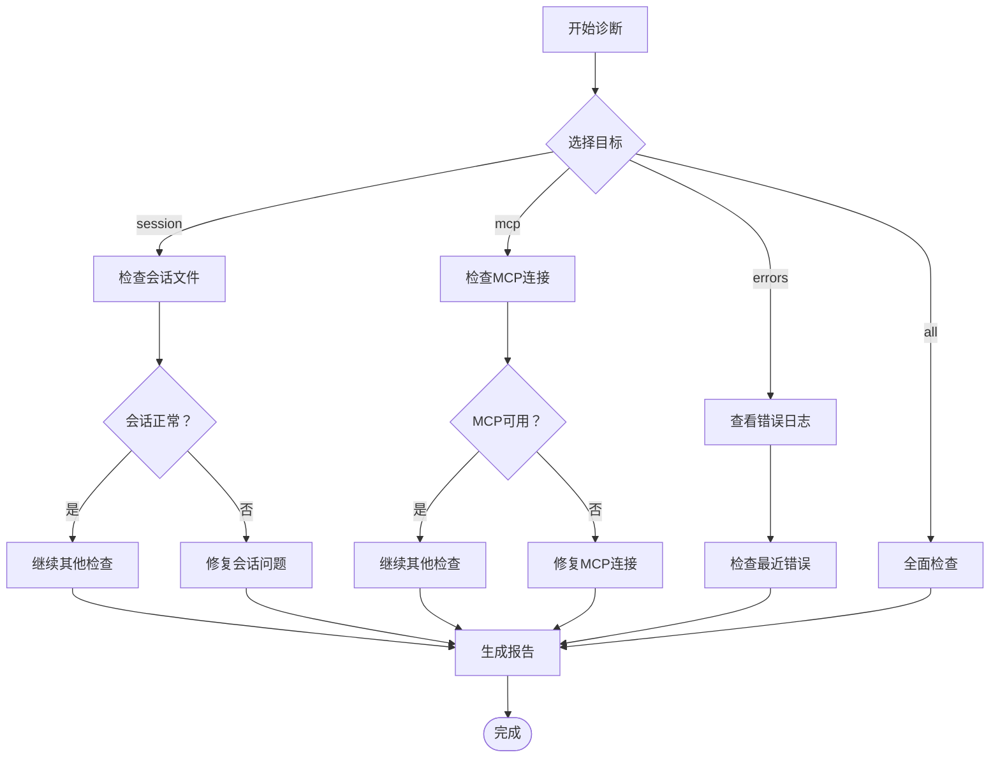

# 常见问题诊断

<cite>
**本文档引用的文件**
- [README.md](file://README.md)
- [xiaowang.py](file://xiaowang.py)
- [llm.py](file://llm.py)
- [tools.py](file://tools.py)
- [memory.py](file://memory.py)
- [mcp_client.py](file://mcp_client.py)
- [router.py](file://router.py)
- [scheduler.py](file://scheduler.py)
- [self_check_tool.py](file://self_check_tool.py)
</cite>

## 目录
1. [简介](#简介)
2. [项目结构](#项目结构)
3. [核心组件](#核心组件)
4. [架构概览](#架构概览)
5. [详细组件分析](#详细组件分析)
6. [依赖关系分析](#依赖关系分析)
7. [性能考虑](#性能考虑)
8. [故障排除指南](#故障排除指南)
9. [结论](#结论)

## 简介

724 Office 是一个基于纯Python构建的生产级AI智能体系统，具有零框架依赖性。该系统实现了完整的多租户消息处理、工具调用循环、三层记忆系统、MCP插件系统、运行时工具创建、自修复机制等功能。本文档提供了针对该系统的常见问题诊断指南，涵盖消息处理失败、工具调用异常、内存系统问题、会话管理问题等关键场景的诊断方法和解决方案。

## 项目结构

724 Office采用模块化设计，主要包含以下核心文件：

**图表来源**
- [xiaowang.py:1-626](file://xiaowang.py#L1-L626)
- [llm.py:1-401](file://llm.py#L1-L401)
- [tools.py:1-1153](file://tools.py#L1-L1153)

**章节来源**
- [README.md:1-162](file://README.md#L1-L162)
- [xiaowang.py:1-626](file://xiaowang.py#L1-L626)

## 核心组件

### 消息处理组件
- **HTTP回调处理器**: 处理来自消息平台的回调，支持文本、图片、视频、语音、文件等多种消息类型
- **去抖动机制**: 合并连续的消息请求，避免重复处理
- **多媒体处理**: 支持企业微信格式、个人格式、HTTP直链等多种下载方式

### 工具调用组件
- **工具注册器**: 统一管理所有可调用工具，支持内置工具和MCP插件工具
- **参数验证**: 对工具参数进行严格验证和转换
- **执行超时控制**: 防止长时间阻塞操作影响系统稳定性

### 记忆系统组件
- **三层记忆**: 会话历史、压缩长期记忆、LanceDB向量检索
- **向量嵌入**: 使用OpenAI兼容的嵌入API进行向量化
- **去重机制**: 基于余弦相似度的智能去重

### 会话管理组件
- **线程安全**: 使用锁机制确保同一会话的串行处理
- **会话持久化**: JSON文件存储会话历史
- **跨会话上下文**: 支持调度任务与用户对话的上下文桥接

**章节来源**
- [xiaowang.py:383-550](file://xiaowang.py#L383-L550)
- [llm.py:306-401](file://llm.py#L306-L401)
- [memory.py:1-361](file://memory.py#L1-L361)

## 架构概览

**图表来源**
- [router.py:358-418](file://router.py#L358-L418)
- [xiaowang.py:489-550](file://xiaowang.py#L489-L550)
- [llm.py:324-401](file://llm.py#L324-L401)

## 详细组件分析

### 消息处理失败诊断

#### HTTP回调接收异常
当消息平台无法正确接收回调时，需要检查以下方面：

1. **端点配置检查**
   - 确认HTTP服务器端口配置正确
   - 验证回调URL是否指向正确的IP和端口
   - 检查防火墙设置是否允许外部访问

2. **回调格式验证**
   - 检查消息数据格式是否符合预期
   - 验证必需字段是否存在
   - 确认消息类型识别逻辑正常工作

3. **网络连通性测试**
   - 使用curl命令测试回调端点
   - 检查DNS解析是否正常
   - 验证SSL证书配置

#### 去抖动机制失效
去抖动机制用于合并连续的消息请求，防止重复处理：

**图表来源**
- [xiaowang.py:316-378](file://xiaowang.py#L316-L378)

**章节来源**
- [xiaowang.py:316-378](file://xiaowang.py#L316-L378)

### 工具调用异常诊断

#### 工具注册失败
工具注册失败通常由以下原因引起：

1. **装饰器使用错误**
   - 确认@tool装饰器语法正确
   - 检查工具名称唯一性
   - 验证参数模式定义完整

2. **导入问题**
   - 确认工具模块正确导入
   - 检查插件目录权限
   - 验证Python路径配置

3. **MCP工具加载失败**
   - 检查MCP服务器配置
   - 验证JSON-RPC协议实现
   - 确认工具命名空间格式

#### 参数验证错误
参数验证错误是最常见的工具调用问题：

**图表来源**
- [tools.py:63-74](file://tools.py#L63-L74)

#### 执行超时问题
工具执行超时通常发生在长时间运行的操作中：

**章节来源**
- [tools.py:115-132](file://tools.py#L115-L132)
- [tools.py:63-74](file://tools.py#L63-L74)

### 内存系统问题诊断

#### 记忆存储异常
记忆存储异常涉及多个层面的问题：

1. **LanceDB连接问题**
   - 检查数据库文件路径权限
   - 验证磁盘空间充足
   - 确认LanceDB版本兼容性

2. **向量检索失败**
   - 验证嵌入API配置正确
   - 检查网络连接稳定性
   - 确认API密钥有效

3. **压缩过程错误**
   - 检查对话内容格式
   - 验证LLM压缩提示词
   - 确认输出解析逻辑

#### 记忆去重机制
去重机制基于余弦相似度计算：

**图表来源**
- [memory.py:320-337](file://memory.py#L320-L337)

**章节来源**
- [memory.py:40-86](file://memory.py#L40-L86)
- [memory.py:294-361](file://memory.py#L294-L361)

### 会话管理问题诊断

#### 会话丢失问题
会话丢失通常由以下原因导致：

1. **文件系统问题**
   - 检查会话目录权限
   - 验证磁盘空间充足
   - 确认文件锁定机制正常

2. **线程安全问题**
   - 验证会话锁机制
   - 检查并发访问控制
   - 确认消息序列完整性

3. **内存溢出问题**
   - 监控会话大小限制
   - 检查压缩触发条件
   - 验证历史消息清理

#### 上下文错误
上下文错误影响AI的理解能力：

**图表来源**
- [llm.py:109-118](file://llm.py#L109-L118)

**章节来源**
- [llm.py:89-160](file://llm.py#L89-L160)

## 依赖关系分析

**图表来源**
- [README.md:115-116](file://README.md#L115-L116)
- [xiaowang.py:15-30](file://xiaowang.py#L15-L30)

**章节来源**
- [README.md:115-116](file://README.md#L115-L116)

## 性能考虑

### 并发处理优化
系统采用多线程架构处理并发请求：

1. **线程池管理**: 使用线程混合类处理HTTP请求
2. **会话锁机制**: 确保同一会话的串行处理
3. **异步内存压缩**: 后台线程处理记忆压缩

### 缓存策略
- **零延迟缓存**: 硬件/语音通道的记忆摘要缓存
- **响应时间监控**: 实时记录各阶段处理时间
- **资源使用监控**: 监控内存和CPU使用情况

## 故障排除指南

### 错误代码对照表

| 错误类型 | 错误代码 | 可能原因 | 解决方案 |
|---------|---------|---------|---------|
| HTTP错误 | 400 Bad Request | 请求格式错误 | 检查回调数据格式，验证必需字段 |
| HTTP错误 | 401 Unauthorized | 认证失败 | 检查API密钥配置，验证权限设置 |
| HTTP错误 | 403 Forbidden | 权限不足 | 验证消息平台权限，检查IP白名单 |
| HTTP错误 | 429 Rate Limit | 请求频率过高 | 实施退避策略，检查配额限制 |
| HTTP错误 | 500 Internal Server Error | 服务器内部错误 | 检查日志，重启服务进程 |
| HTTP错误 | 502 Bad Gateway | 网关错误 | 检查上游服务可用性 |
| HTTP错误 | 503 Service Unavailable | 服务不可用 | 检查服务健康状态，扩容资源 |
| HTTP错误 | 504 Gateway Timeout | 网关超时 | 增加超时时间，优化后端性能 |

### 诊断工具使用

#### 自诊断工具 (diagnose)

**图表来源**
- [tools.py:925-1020](file://tools.py#L925-L1020)

#### 自检查工具 (self_check)
自检查工具提供系统健康状态报告：
- 今日对话统计
- 错误日志摘要
- 系统运行时间
- 内存文件状态
- 磁盘使用情况

**章节来源**
- [tools.py:852-921](file://tools.py#L852-L921)
- [tools.py:925-1020](file://tools.py#L925-L1020)

### 常见问题解决方案

#### 消息处理问题
1. **回调无法接收**
   - 检查端点可达性
   - 验证签名验证逻辑
   - 确认防火墙规则

2. **消息重复处理**
   - 调整去抖动时间间隔
   - 检查消息去重逻辑
   - 验证消息ID唯一性

#### 工具调用问题
1. **工具不可用**
   - 使用reload_mcp工具热重载
   - 检查工具注册状态
   - 验证参数模式匹配

2. **工具执行失败**
   - 查看工具执行日志
   - 检查依赖服务状态
   - 验证权限配置

#### 记忆系统问题
1. **向量检索失败**
   - 检查嵌入API配置
   - 验证网络连接
   - 确认API密钥有效

2. **记忆存储异常**
   - 检查磁盘空间
   - 验证LanceDB连接
   - 确认表结构正确

#### 会话管理问题
1. **会话丢失**
   - 检查文件系统权限
   - 验证会话目录存在
   - 确认磁盘空间充足

2. **上下文错误**
   - 检查消息序列完整性
   - 验证会话文件格式
   - 确认历史消息清理

**章节来源**
- [tools.py:1097-1123](file://tools.py#L1097-L1123)
- [memory.py:40-86](file://memory.py#L40-L86)

## 结论

724 Office提供了一个完整且健壮的AI智能体诊断体系。通过内置的诊断工具、自检查机制和详细的日志记录，系统能够有效地识别和解决各种运行时问题。

关键的诊断策略包括：
- 使用diagnose工具进行系统性检查
- 定期运行self_check工具监控系统健康
- 利用工具注册器的参数验证机制
- 通过会话管理的线程安全保证
- 借助三层记忆系统的容错能力

对于生产环境部署，建议：
1. 设置适当的日志级别和轮转策略
2. 配置监控告警机制
3. 定期备份重要数据
4. 建立故障恢复流程
5. 持续优化性能参数

通过遵循本文档提供的诊断方法和最佳实践，可以有效提升系统的稳定性和可靠性，确保AI智能体在生产环境中持续稳定运行。