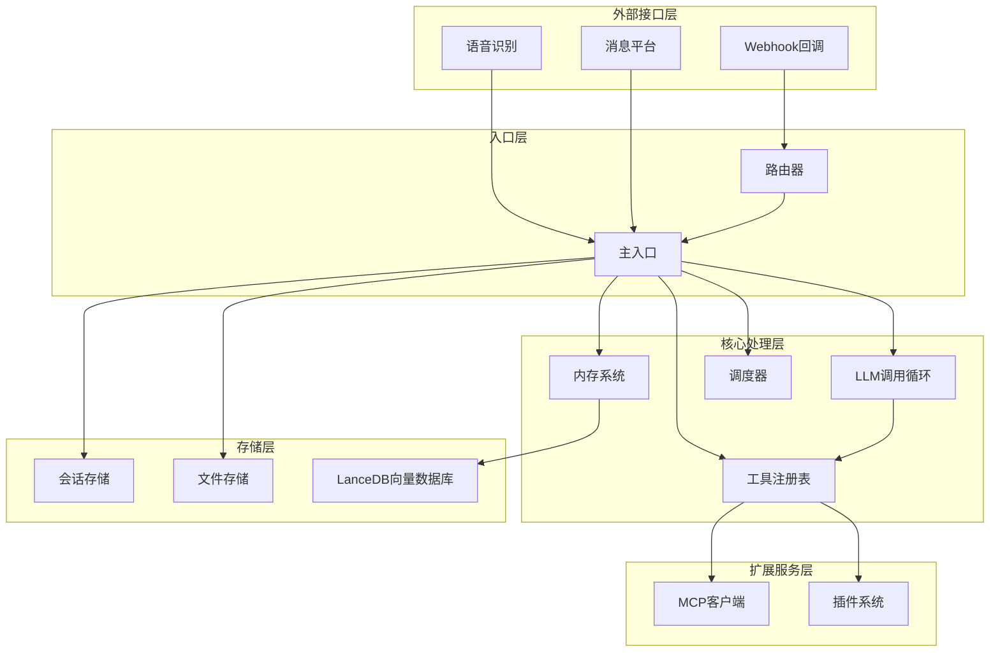
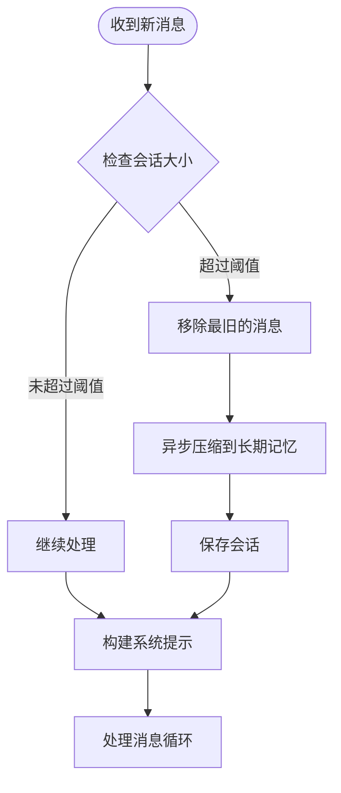
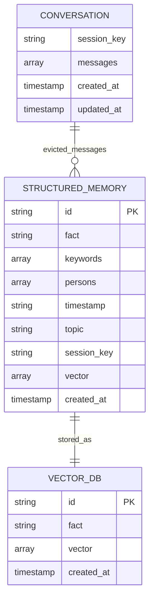
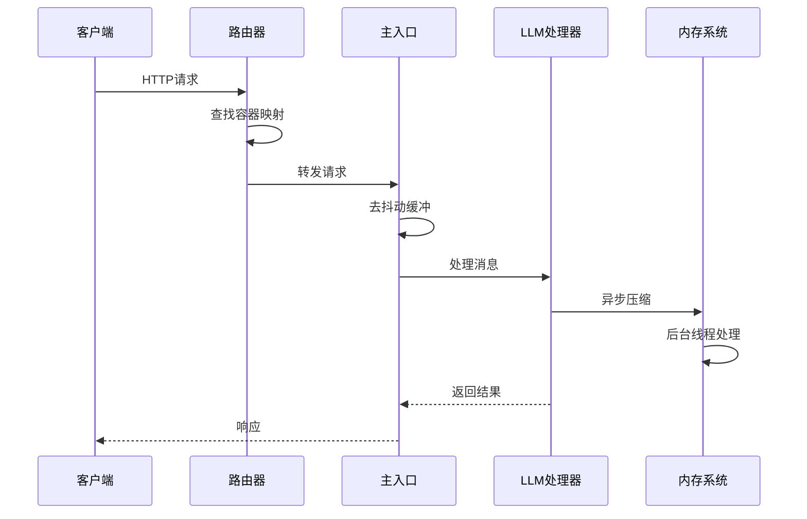
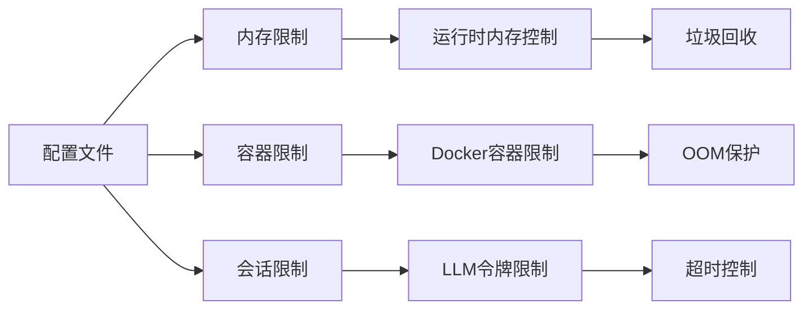
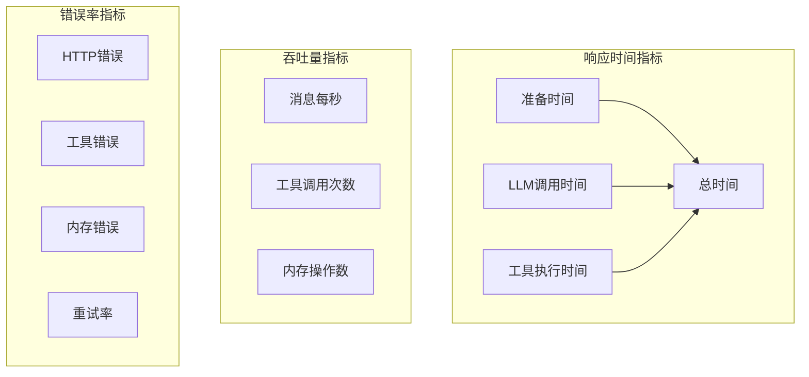
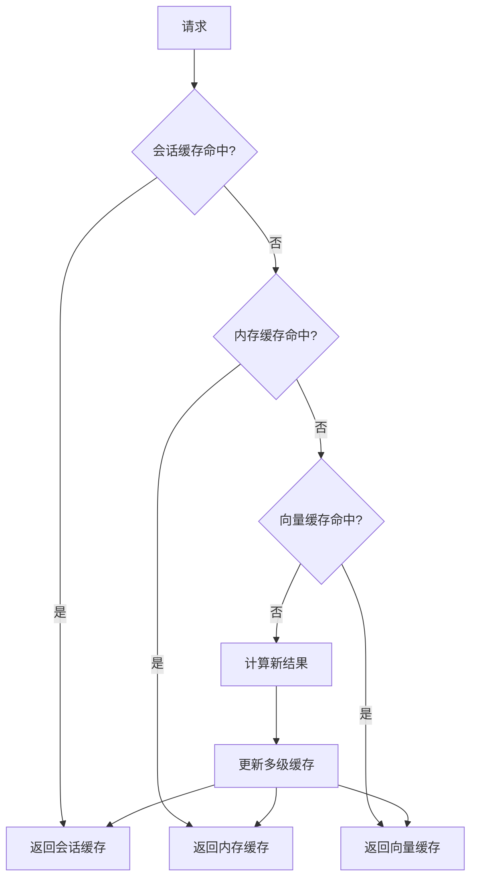

# 性能优化建议

<cite>
**本文档引用的文件**
- [README.md](file://README.md)
- [llm.py](file://llm.py)
- [memory.py](file://memory.py)
- [router.py](file://router.py)
- [scheduler.py](file://scheduler.py)
- [xiaowang.py](file://xiaowang.py)
- [tools.py](file://tools.py)
- [mcp_client.py](file://mcp_client.py)
- [config.example.json](file://config.example.json)
</cite>

## 目录
1. [简介](#简介)
2. [项目架构概览](#项目架构概览)
3. [内存使用优化](#内存使用优化)
4. [并发处理优化](#并发处理优化)
5. [资源限制配置](#资源限制配置)
6. [性能监控与指标收集](#性能监控与指标收集)
7. [缓存策略优化](#缓存策略优化)
8. [系统级性能优化](#系统级性能优化)
9. [故障排除指南](#故障排除指南)
10. [总结](#总结)

## 简介

724 Office是一个生产级的AI代理系统，采用纯Python实现，无框架依赖。该系统包含26个内置工具，支持多租户路由、三阶段内存系统、MCP插件系统、运行时工具创建、自修复等功能。系统设计目标是在Jetson Orin Nano（8GB RAM，ARM64 + GPU）上运行，内存预算控制在2GB以内。

## 项目架构概览

**图表来源**
- [router.py: 469-493:469-493](file://router.py#L469-L493)
- [xiaowang.py: 597-626:597-626](file://xiaowang.py#L597-L626)
- [llm.py: 306-401:306-401](file://llm.py#L306-L401)

## 内存使用优化

### 短期记忆清理策略

系统实现了智能的短期记忆清理机制：

**图表来源**
- [llm.py: 94-160:94-160](file://llm.py#L94-L160)
- [llm.py: 324-401:324-401](file://llm.py#L324-L401)

### 长期记忆压缩算法

系统采用三层内存架构：

1. **会话层（短期）**：最多40条消息，JSON文件存储
2. **压缩层（中期）**：LLM提取结构化事实
3. **检索层（长期）**：LanceDB向量检索

**图表来源**
- [memory.py: 194-282:194-282](file://memory.py#L194-L282)
- [memory.py: 294-361:294-361](file://memory.py#L294-L361)

### 向量存储优化

系统使用LanceDB进行向量存储，支持：

- **相似度阈值**：0.92的余弦相似度过滤重复记忆
- **维度配置**：可配置的嵌入维度（默认1024）
- **批量操作**：异步向量插入和查询

**章节来源**
- [memory.py: 284-361:284-361](file://memory.py#L284-L361)
- [config.example.json: 28-38:28-38](file://config.example.json#L28-L38)

## 并发处理优化

### 线程池配置

系统采用多种并发模式：

**图表来源**
- [router.py: 390-418:390-418](file://router.py#L390-L418)
- [xiaowang.py: 365-378:365-378](file://xiaowang.py#L365-L378)

### 异步任务管理

系统通过以下方式管理异步任务：

1. **内存压缩**：后台线程异步处理
2. **消息去抖动**：定时器合并连续消息
3. **容器自动扩容**：按需创建Docker容器

**章节来源**
- [memory.py: 121-146:121-146](file://memory.py#L121-L146)
- [xiaowang.py: 365-378:365-378](file://xiaowang.py#L365-L378)
- [router.py: 141-250:141-250](file://router.py#L141-L250)

### 资源竞争避免

系统通过以下机制避免资源竞争：

- **会话锁**：每个会话键使用独立锁
- **全局锁**：路由表和配置更新使用锁保护
- **线程安全**：所有共享状态访问都使用锁

**章节来源**
- [llm.py: 306-322:306-322](file://llm.py#L306-L322)
- [router.py: 34-36:34-36](file://router.py#L34-L36)

## 资源限制配置

### 内存上限设置

系统支持多种内存限制配置：

**图表来源**
- [config.example.json: 28-38:28-38](file://config.example.json#L28-L38)
- [router.py: 131-139:131-139](file://router.py#L131-L139)

### CPU使用率控制

系统通过以下方式控制CPU使用：

- **线程池大小**：根据硬件配置调整
- **超时设置**：LLM调用超时控制
- **批处理大小**：向量检索的top_k限制

**章节来源**
- [llm.py: 70-83:70-83](file://llm.py#L70-L83)
- [memory.py: 92-94:92-94](file://memory.py#L92-L94)

### 文件描述符管理

系统采用高效的文件描述符管理：

- **临时文件**：使用/tmp目录进行媒体文件处理
- **索引文件**：文件索引采用增量更新
- **连接复用**：HTTP请求连接复用

**章节来源**
- [xiaowang.py: 99-132:99-132](file://xiaowang.py#L99-L132)
- [router.py: 291-306:291-306](file://router.py#L291-L306)

## 性能监控与指标收集

### 关键性能指标

系统记录以下性能指标：

**图表来源**
- [llm.py: 380-399:380-399](file://llm.py#L380-L399)

### 监控实现

系统通过日志记录性能数据：

- **性能日志**：详细记录各阶段耗时
- **错误日志**：捕获异常和错误信息
- **心跳日志**：定期输出系统状态

**章节来源**
- [llm.py: 380-399:380-399](file://llm.py#L380-L399)
- [scheduler.py: 188-206:188-206](file://scheduler.py#L188-L206)

## 缓存策略优化

### 多级缓存设计

系统实现三级缓存架构：

**图表来源**
- [memory.py: 148-151:148-151](file://memory.py#L148-L151)
- [llm.py: 336-352:336-352](file://llm.py#L336-L352)

### 缓存失效策略

系统采用智能缓存失效机制：

- **时间戳失效**：基于创建时间和最近使用时间
- **内容变更失效**：检测底层数据变更
- **容量控制失效**：LRU淘汰策略

### 预加载机制

系统支持以下预加载功能：

- **硬件/语音通道预计算**：零延迟缓存
- **容器预热**：新用户容器启动时的预加载
- **向量预索引**：批量向量插入优化

**章节来源**
- [memory.py: 148-151:148-151](file://memory.py#L148-L151)
- [router.py: 219-238:219-238](file://router.py#L219-L238)

## 系统级性能优化

### 硬件优化

针对Jetson Orin Nano的优化：

- **内存预算控制**：保持在2GB以内
- **GPU加速**：利用CUDA进行向量计算
- **I/O优化**：使用SSD存储和高效文件系统

### 网络优化

系统网络层面的优化：

- **连接池**：HTTP请求连接复用
- **超时控制**：合理的超时设置
- **重试机制**：智能重试策略

### 存储优化

存储系统的优化策略：

- **分层存储**：不同类型数据采用不同存储策略
- **压缩存储**：长期记忆的压缩存储
- **索引优化**：向量索引的高效查询

## 故障排除指南

### 常见性能问题

1. **内存泄漏排查**
   - 检查会话文件是否正确清理
   - 监控向量数据库增长情况
   - 验证异步任务是否正常完成

2. **并发问题诊断**
   - 检查锁竞争情况
   - 监控线程池使用率
   - 分析死锁可能性

3. **内存不足处理**
   - 调整会话消息数量限制
   - 优化向量维度配置
   - 实施更激进的缓存清理策略

### 监控告警设置

建议设置以下告警：

- **内存使用率**：超过80%
- **响应时间**：超过5秒
- **错误率**：超过1%
- **容器健康**：不健康状态

**章节来源**
- [self_check_tool.py: 1-57:1-57](file://self_check_tool.py#L1-L57)
- [scheduler.py: 171-186:171-186](file://scheduler.py#L171-L186)

## 总结

724 Office系统通过以下关键技术实现了高性能：

1. **智能内存管理**：三阶段内存架构，自动清理和压缩
2. **并发优化**：多层并发模型，避免资源竞争
3. **缓存策略**：多级缓存设计，零延迟访问
4. **资源控制**：严格的资源限制和监控
5. **自修复能力**：自动诊断和恢复机制

这些优化使得系统能够在资源受限的环境中稳定运行，同时保持良好的性能表现。建议根据实际部署环境进一步调整配置参数，以达到最佳性能。