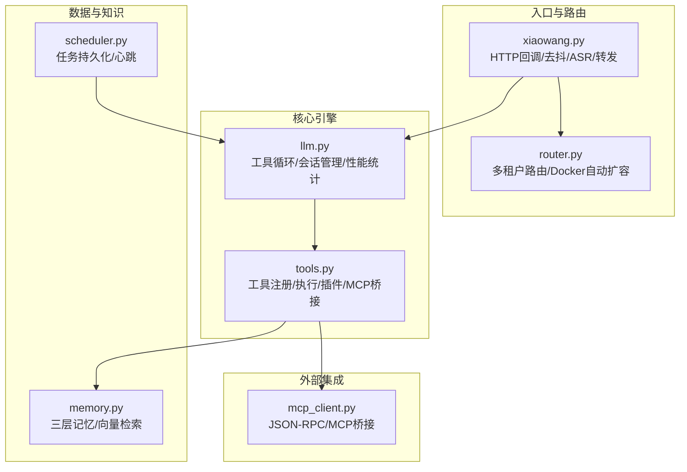
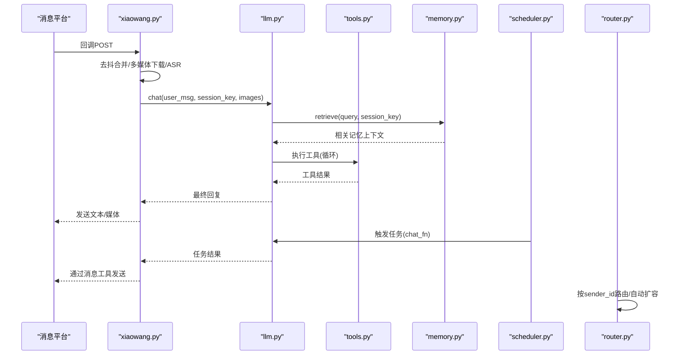
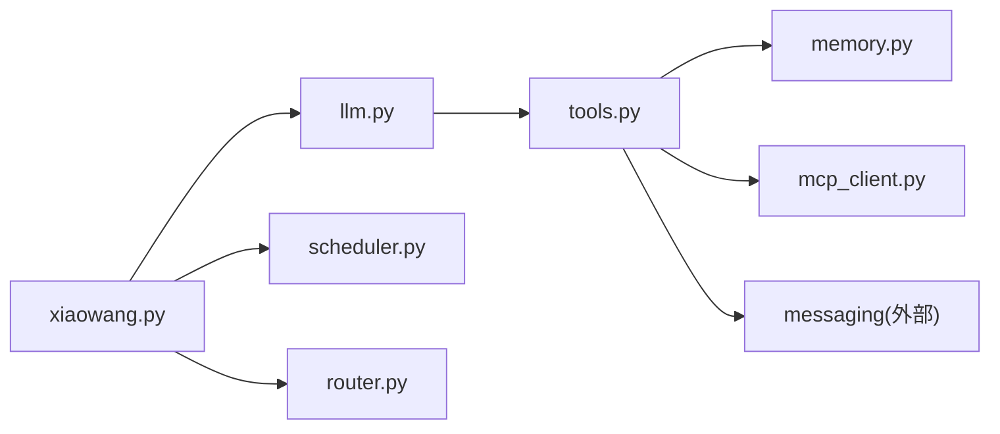

# 故障排除

<cite>
**本文引用的文件**
- [README.md](file://README.md)
- [config.example.json](file://config.example.json)
- [xiaowang.py](file://xiaowang.py)
- [llm.py](file://llm.py)
- [tools.py](file://tools.py)
- [memory.py](file://memory.py)
- [scheduler.py](file://scheduler.py)
- [router.py](file://router.py)
- [mcp_client.py](file://mcp_client.py)
- [self_check_tool.py](file://self_check_tool.py)
</cite>

## 目录
1. [简介](#简介)
2. [项目结构](#项目结构)
3. [核心组件](#核心组件)
4. [架构总览](#架构总览)
5. [详细组件分析与故障场景](#详细组件分析与故障场景)
6. [依赖关系分析](#依赖关系分析)
7. [性能考量与优化建议](#性能考量与优化建议)
8. [日志分析与定位策略](#日志分析与定位策略)
9. [自修复机制与日常运维](#自修复机制与日常运维)
10. [调试工具与问题复现技巧](#调试工具与问题复现技巧)
11. [社区支持与问题反馈](#社区支持与问题反馈)
12. [结论](#结论)

## 简介
本指南面向724 Office生产环境使用者，聚焦于常见故障的诊断与解决，覆盖消息处理失败、工具调用异常、内存系统问题、任务调度错误等典型场景；同时提供日志分析方法、自修复机制说明、性能优化建议、调试工具使用与社区支持渠道，帮助快速定位问题并恢复服务。

## 项目结构
系统采用“入口模块 + 核心引擎 + 工具注册 + 外部桥接”的分层设计：
- 入口与路由：xiaowang.py负责HTTP回调接入、去抖合并、多媒体下载与ASR、转发至LLM引擎
- LLM引擎：llm.py实现多轮对话循环、工具调用、会话持久化、性能统计
- 工具系统：tools.py注册26个内置工具，并支持插件与MCP工具热加载
- 内存系统：memory.py实现三层记忆（会话压缩、向量检索、零延迟缓存）
- 调度系统：scheduler.py提供一次性与周期性任务，带持久化与心跳日志
- 多租户路由：router.py按sender_id路由到容器，支持自动扩容与健康检查
- MCP桥接：mcp_client.py连接外部MCP服务器，支持stdio/http、重连与命名空间工具定义
- 自修复文档：self_check_tool.py说明每日自检与自愈闭环

图表来源
- [xiaowang.py:59-76](file://xiaowang.py#L59-L76)
- [llm.py:317-400](file://llm.py#L317-L400)
- [tools.py:58-74](file://tools.py#L58-L74)
- [memory.py:40-86](file://memory.py#L40-L86)
- [scheduler.py:30-43](file://scheduler.py#L30-L43)
- [router.py:469-493](file://router.py#L469-L493)
- [mcp_client.py:272-334](file://mcp_client.py#L272-L334)

章节来源
- [README.md:23-66](file://README.md#L23-L66)
- [xiaowang.py:59-76](file://xiaowang.py#L59-L76)

## 核心组件
- 入口与消息处理：xiaowang.py负责回调解析、去抖合并、多媒体下载与ASR、转发至LLM聊天循环
- LLM工具循环：llm.py实现多轮对话、工具调用、会话截断与压缩、性能指标记录
- 工具系统：tools.py注册工具、执行工具、插件与MCP工具热加载
- 记忆系统：memory.py三层记忆流水线（压缩/去重/检索），支持零延迟缓存
- 调度系统：scheduler.py任务持久化、心跳日志、失败通知
- 多租户路由：router.py按sender_id路由到容器，自动扩容与健康检查
- MCP桥接：mcp_client.py连接外部MCP服务器，支持stdio/http、重连与命名空间工具定义

章节来源
- [xiaowang.py:490-588](file://xiaowang.py#L490-L588)
- [llm.py:306-400](file://llm.py#L306-L400)
- [tools.py:36-74](file://tools.py#L36-L74)
- [memory.py:40-118](file://memory.py#L40-L118)
- [scheduler.py:30-43](file://scheduler.py#L30-L43)
- [router.py:309-425](file://router.py#L309-L425)
- [mcp_client.py:272-334](file://mcp_client.py#L272-L334)

## 架构总览
系统通过入口模块接收消息回调，经去抖与多媒体处理后进入LLM工具循环；工具循环可调用内置工具、插件与MCP工具；记忆系统在会话压缩阶段抽取结构化事实并写入向量数据库；调度器定期触发任务并通过消息工具回传结果；多租户路由为不同用户分配独立容器并进行健康检查。

图表来源
- [xiaowang.py:490-588](file://xiaowang.py#L490-L588)
- [llm.py:306-400](file://llm.py#L306-L400)
- [tools.py:63-74](file://tools.py#L63-L74)
- [memory.py:88-118](file://memory.py#L88-L118)
- [scheduler.py:166-186](file://scheduler.py#L166-L186)
- [router.py:397-417](file://router.py#L397-L417)

## 详细组件分析与故障场景

### 消息处理失败（回调解析/去抖/ASR/转发）
常见症状
- 回调无法解析或为空
- 去抖后无回复或空回复
- 媒体下载失败或ASR识别为空
- 转发到后端容器失败

诊断步骤
- 检查回调路径与内容长度解析是否成功
- 查看去抖缓冲区与定时器状态
- 验证多媒体下载优先级与临时文件保存
- 确认ASR转码与WebSocket流式识别参数
- 校验转发目标URL与超时设置

定位要点
- 回调解析与消息类型分支
- 去抖缓冲与合并逻辑
- 媒体下载三种路径与失败回退
- ASR鉴权与音频帧发送
- 转发HTTP请求头与超时

章节来源
- [xiaowang.py:490-588](file://xiaowang.py#L490-L588)
- [xiaowang.py:316-378](file://xiaowang.py#L316-L378)
- [xiaowang.py:383-465](file://xiaowang.py#L383-L465)
- [xiaowang.py:140-284](file://xiaowang.py#L140-L284)
- [xiaowang.py:291-306](file://xiaowang.py#L291-L306)
- [xiaowang.py:291-306](file://xiaowang.py#L291-L306)

### 工具调用异常（工具未找到/执行失败/参数错误）
常见症状
- 返回“未知工具”提示
- 工具执行抛出异常并记录错误
- 参数解析失败导致默认空参

诊断步骤
- 使用工具定义查询确认工具是否存在
- 检查工具函数签名与参数schema
- 观察工具执行日志与异常栈
- 核对上下文字段（owner_id/workspace/session_key）

定位要点
- 工具注册表与定义导出
- 工具执行入口与异常捕获
- 参数JSON解析与默认值处理

章节来源
- [tools.py:58-74](file://tools.py#L58-L74)
- [tools.py:63-74](file://tools.py#L63-L74)
- [llm.py:384-395](file://llm.py#L384-L395)

### 内存系统问题（压缩/去重/检索失败）
常见症状
- 压缩线程启动但无输出
- 向量嵌入数量不匹配
- 检索返回空或异常
- 相似度阈值导致重复被跳过

诊断步骤
- 检查内存模块初始化与嵌入API配置
- 核对压缩输入消息过滤条件
- 验证嵌入API响应与维度一致性
- 查看去重相似度计算与阈值
- 确认LanceDB表存在与种子数据

定位要点
- 初始化与启用标志
- 压缩工作线程与过滤规则
- 嵌入调用与返回校验
- 去重相似度与存储写入

章节来源
- [memory.py:40-86](file://memory.py#L40-L86)
- [memory.py:121-146](file://memory.py#L121-L146)
- [memory.py:294-360](file://memory.py#L294-L360)
- [memory.py:88-118](file://memory.py#L88-L118)

### 任务调度错误（任务未触发/超时/失败通知）
常见症状
- 一次性任务未按时触发
- Cron表达式解析失败
- 任务执行超时或异常
- 失败后通过消息工具通知

诊断步骤
- 检查jobs.json持久化与原子写入
- 校验时间戳与下次触发计算
- 观察后台检查线程与心跳日志
- 确认chat_fn回调与消息工具可用

定位要点
- 任务增删改查与持久化
- Cron迭代器与本地时区
- 触发线程与异常捕获
- 失败通知与重试策略

章节来源
- [scheduler.py:30-43](file://scheduler.py#L30-L43)
- [scheduler.py:49-104](file://scheduler.py#L49-L104)
- [scheduler.py:130-186](file://scheduler.py#L130-L186)
- [scheduler.py:208-219](file://scheduler.py#L208-L219)

### 多租户路由问题（未知用户/容器扩容/健康检查）
常见症状
- 新用户回调无法路由
- 容器创建失败或未就绪
- 健康检查超时
- 路由表不一致

诊断步骤
- 检查ROUTING_FILE与锁保护
- 校验Docker API调用与容器计数上限
- 观察健康检查HTTP可达性
- 确认环境变量与网络配置

定位要点
- 路由表加载/保存与锁
- 容器创建与启动流程
- 健康检查与超时控制
- 启动自愈：扫描现有容器重建路由

章节来源
- [router.py:45-63](file://router.py#L45-L63)
- [router.py:141-250](file://router.py#L141-L250)
- [router.py:221-245](file://router.py#L221-L245)
- [router.py:433-465](file://router.py#L433-L465)

### MCP工具异常（连接失败/重连/命名空间冲突）
常见症状
- MCP服务器连接失败
- 工具调用超时或返回错误
- 工具定义冲突（命名空间重复）
- 重连后仍不可用

诊断步骤
- 检查传输方式（stdio/http）与命令参数
- 观察握手与工具列表发现过程
- 校验工具命名空间与参数schema
- 确认重连逻辑与异常处理

定位要点
- 连接生命周期与重连
- JSON-RPC请求/响应与错误码
- 工具定义转换与命名空间
- 执行失败后的重试与降级

章节来源
- [mcp_client.py:272-334](file://mcp_client.py#L272-L334)
- [mcp_client.py:98-187](file://mcp_client.py#L98-L187)
- [mcp_client.py:210-242](file://mcp_client.py#L210-L242)
- [mcp_client.py:243-262](file://mcp_client.py#L243-L262)

## 依赖关系分析
- 模块耦合
  - xiaowang.py依赖llm、tools、memory、scheduler、messaging
  - llm.py依赖tools与memory
  - tools.py依赖messaging、scheduler、mcp_client（动态导入）
  - memory.py依赖lancedb与urllib
  - scheduler.py依赖croniter
  - router.py依赖docker unix socket与urllib
  - mcp_client.py依赖subprocess与urllib
- 关键依赖链
  - 入口回调 -> 去抖/ASR -> LLM工具循环 -> 工具执行 -> 记忆/消息/MCP
  - 调度触发 -> LLM聊天 -> 消息工具 -> 用户

图表来源
- [xiaowang.py:59-76](file://xiaowang.py#L59-L76)
- [llm.py:337-345](file://llm.py#L337-L345)
- [tools.py:81-83](file://tools.py#L81-L83)
- [memory.py:57-85](file://memory.py#L57-L85)
- [scheduler.py:30-43](file://scheduler.py#L30-L43)
- [router.py:469-493](file://router.py#L469-L493)
- [mcp_client.py:272-334](file://mcp_client.py#L272-L334)

## 性能考量与优化建议
- 会话与压缩
  - 控制会话最大消息数，避免历史消息过长导致400错误
  - 在会话截断时异步压缩并去重，减少主线程阻塞
- 工具执行
  - 对耗时工具设置合理超时，必要时拆分为异步任务
  - 使用批量工具与缓存减少重复调用
- 记忆系统
  - 合理设置相似度阈值与Top-K，平衡召回与冗余
  - 零延迟缓存适用于硬件/语音通道，降低检索开销
- 并发与线程
  - 使用线程锁保护共享状态，避免竞态
  - 后台线程执行I/O密集型任务（压缩/下载/检索）
- 资源限制
  - Docker容器内存限制与重启策略
  - 文件索引与临时目录清理策略

章节来源
- [llm.py:94-118](file://llm.py#L94-L118)
- [llm.py:143-160](file://llm.py#L143-L160)
- [memory.py:121-146](file://memory.py#L121-L146)
- [memory.py:320-358](file://memory.py#L320-L358)
- [router.py:131-139](file://router.py#L131-L139)
- [router.py:175-196](file://router.py#L175-L196)

## 日志分析与定位策略
- 日志级别与输出
  - 使用标准库logging，入口模块默认INFO级别
  - 各模块使用统一logger名称（如agent），便于筛选
- 关键信息提取
  - LLM：HTTP错误码、响应体摘要、性能统计
  - 工具：工具名、参数、异常栈
  - 记忆：压缩条数、嵌入数量、去重数量
  - 调度：任务名称、下次触发、心跳日志
  - 路由：容器创建/启动/健康检查状态
  - MCP：连接/重连/工具调用结果
- 问题定位流程
  - 从入口回调开始，逐层定位到具体模块
  - 结合性能日志（prep/llm/tools/total）判断瓶颈
  - 使用诊断工具收集会话文件健康、MCP状态、最近错误详情
  - 通过自检工具汇总今日对话统计、错误日志、服务运行时长、内存文件状态

章节来源
- [xiaowang.py:52-53](file://xiaowang.py#L52-L53)
- [llm.py:74-83](file://llm.py#L74-L83)
- [llm.py:380-399](file://llm.py#L380-L399)
- [tools.py:65-73](file://tools.py#L65-L73)
- [memory.py:117](file://memory.py#L117)
- [scheduler.py:188-205](file://scheduler.py#L188-L205)
- [router.py:221-245](file://router.py#L221-L245)
- [mcp_client.py:74-90](file://mcp_client.py#L74-L90)
- [tools.py:929-1019](file://tools.py#L929-L1019)
- [tools.py:820-920](file://tools.py#L820-L920)

## 自修复机制与日常运维
- 自检工具
  - 收集今日对话统计、错误日志、服务运行时长、内存文件状态
  - 通过调度器每日触发，生成报告并通过消息工具发送给所有者
- 诊断工具
  - 检查会话文件健康（起始消息合法性、孤儿工具消息）
  - 检查MCP服务器连接状态与配置
  - 提取最近一小时错误详情
- 自愈闭环
  - 代理可使用exec执行修复命令
  - 可使用create_tool创建新的诊断/修复工具
  - 将发现与行动透明上报给所有者

章节来源
- [self_check_tool.py:1-57](file://self_check_tool.py#L1-L57)
- [tools.py:820-920](file://tools.py#L820-L920)
- [tools.py:929-1019](file://tools.py#L929-L1019)
- [scheduler.py:166-186](file://scheduler.py#L166-L186)

## 调试工具与问题复现技巧
- 断点调试
  - 在入口回调处打印原始payload与消息类型，验证去抖与多媒体处理
  - 在LLM工具循环中插入临时日志，观察每轮消息与工具调用
- 性能分析
  - 利用性能日志（prep/llm/tools/total）定位瓶颈
  - 对慢工具进行拆分或缓存
- 问题复现
  - 使用测试接口触发LLM聊天循环
  - 通过消息工具发送测试消息，观察回复与错误
  - 模拟MCP工具调用失败，验证重连与降级

章节来源
- [xiaowang.py:579-588](file://xiaowang.py#L579-L588)
- [llm.py:380-399](file://llm.py#L380-L399)
- [tools.py:110-132](file://tools.py#L110-L132)

## 社区支持与问题反馈
- 配置参考
  - 参考示例配置文件，确保模型、消息平台、内存、ASR、视频、搜索、MCP等配置项齐全
- 工具与插件
  - 通过create_tool创建自定义工具，保存到plugins目录并热加载
- 任务与自检
  - 使用schedule工具创建每日自检任务，确保系统持续自我监控
- 反馈渠道
  - 通过消息工具向所有者汇报问题与修复进展

章节来源
- [config.example.json:1-61](file://config.example.json#L1-L61)
- [tools.py:1024-1050](file://tools.py#L1024-L1050)
- [scheduler.py:49-104](file://scheduler.py#L49-L104)

## 结论
724 Office通过清晰的模块边界与自修复闭环，能够有效应对消息处理、工具调用、内存系统与任务调度等常见故障。建议在生产环境中：
- 建立标准化日志采集与告警
- 使用自检与诊断工具定期巡检
- 优化会话与记忆策略，提升稳定性
- 通过工具与插件扩展能力，形成自演进的智能代理