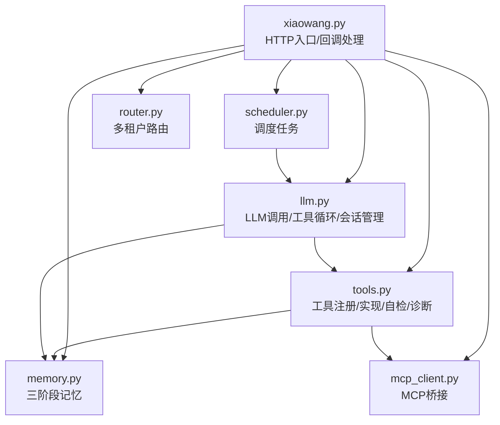
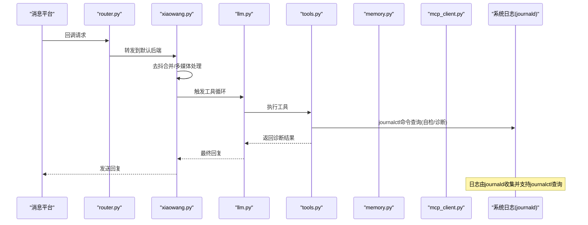
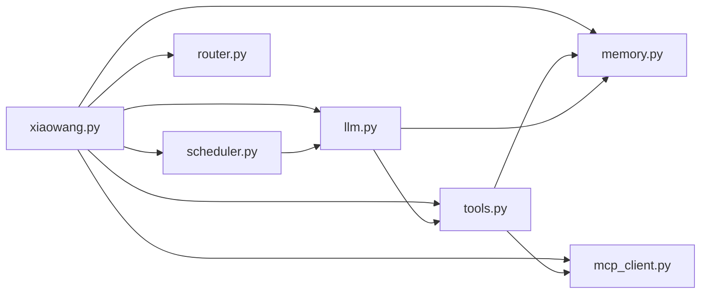

# 日志分析方法

<cite>
**本文引用的文件**
- [README.md](file://README.md)
- [config.example.json](file://config.example.json)
- [xiaowang.py](file://xiaowang.py)
- [llm.py](file://llm.py)
- [tools.py](file://tools.py)
- [memory.py](file://memory.py)
- [mcp_client.py](file://mcp_client.py)
- [scheduler.py](file://scheduler.py)
- [router.py](file://router.py)
- [self_check_tool.py](file://self_check_tool.py)
</cite>

## 目录
1. [简介](#简介)
2. [项目结构](#项目结构)
3. [核心组件](#核心组件)
4. [架构总览](#架构总览)
5. [详细组件分析](#详细组件分析)
6. [依赖分析](#依赖分析)
7. [性能考量](#性能考量)
8. [故障排查指南](#故障排查指南)
9. [结论](#结论)
10. [附录](#附录)

## 简介
本指南面向724 Office生产级AI代理系统的日志分析与运维实践，围绕日志级别、关键信息提取、问题定位策略、journalctl日志采集与分析、以及日志格式化与报告生成进行系统性阐述。文档基于仓库中实际代码实现，结合模块职责与日志输出模式，帮助读者快速理解系统运行状态与问题根因。

## 项目结构
系统采用“单进程入口 + 多模块协作”的结构：
- 入口模块负责HTTP回调接收、消息去抖、多媒体处理与转发至工具循环
- LLM模块负责对话轮次、工具调用循环、会话持久化与性能统计
- 工具模块注册并执行各类能力，内置自检与诊断工具
- 内存模块负责三阶段记忆流水线（压缩/去重/检索）
- MCP客户端负责外部插件桥接
- 调度器负责一次性与周期性任务
- 路由器负责多租户容器路由与自动编排

图表来源
- [xiaowang.py:52-76](file://xiaowang.py#L52-L76)
- [llm.py:19](file://llm.py#L19)
- [tools.py:36-74](file://tools.py#L36-L74)
- [memory.py:40-86](file://memory.py#L40-L86)
- [mcp_client.py:272-333](file://mcp_client.py#L272-L333)
- [scheduler.py:30-43](file://scheduler.py#L30-L43)
- [router.py:469-492](file://router.py#L469-L492)

章节来源
- [README.md:23-66](file://README.md#L23-L66)
- [xiaowang.py:52-76](file://xiaowang.py#L52-L76)

## 核心组件
- 日志初始化与级别
  - 全局日志初始化在入口与各模块中分别完成，统一格式为“时间戳 [级别] 消息”
  - 入口模块与路由器显式设置基础日志级别与格式
  - 其他模块通过获取命名logger记录业务日志
- 日志级别与使用场景
  - DEBUG：细粒度调试（如ASR识别过程、MCP请求细节）——本仓库未直接使用DEBUG级别
  - INFO：常规运行状态、性能统计、成功事件
  - WARNING：可恢复异常、连接重试、容量告警
  - ERROR：致命错误、异常抛出、系统不可用
- 关键信息提取
  - 时间戳：统一使用标准库时间格式，便于跨模块对齐
  - 请求/会话标识：会话键、消息片段计数、工具名称
  - 错误堆栈：异常捕获时启用exc_info以输出堆栈
  - 性能指标：预处理耗时、LLM调用耗时、工具调用次数、总耗时
- 日志格式化与报告生成
  - 自检工具整合今日会话统计、错误日志汇总、服务状态、内存磁盘、任务状态与记忆文件状态
  - 诊断工具按目标维度检查会话文件健康、MCP连接状态、最近错误详情

章节来源
- [xiaowang.py:52](file://xiaowang.py#L52)
- [router.py:20](file://router.py#L20)
- [llm.py:380](file://llm.py#L380)
- [llm.py:398](file://llm.py#L398)
- [tools.py:65](file://tools.py#L65)
- [tools.py:72](file://tools.py#L72)
- [tools.py:858](file://tools.py#L858)
- [tools.py:1009](file://tools.py#L1009)
- [tools.py:820-920](file://tools.py#L820-L920)
- [tools.py:929-1019](file://tools.py#L929-L1019)

## 架构总览
下图展示日志在系统中的流向与落点，以及与journalctl的集成方式。

图表来源
- [router.py:342-417](file://router.py#L342-L417)
- [xiaowang.py:588-589](file://xiaowang.py#L588-L589)
- [llm.py:317-400](file://llm.py#L317-L400)
- [tools.py:820-1019](file://tools.py#L820-L1019)

## 详细组件分析

### 日志级别与配置
- 入口模块
  - 设置全局日志级别与格式，便于统一输出
  - 使用命名logger记录业务事件
- 路由器模块
  - 显式设置基础日志级别与格式
  - 记录路由表加载/保存、环境变量解析、容器编排等关键事件
- LLM模块
  - 记录HTTP错误响应体、会话加载/保存、视觉编码失败、性能统计等
- 工具模块
  - 记录工具执行开始与异常，便于定位具体工具问题
- 内存模块
  - 初始化、检索、压缩、嵌入、去重等阶段均有日志
- MCP客户端
  - 连接建立、工具发现、调用失败与重连、关闭等
- 调度器
  - 任务添加/删除/触发、心跳打印、循环异常

章节来源
- [xiaowang.py:52](file://xiaowang.py#L52)
- [router.py:20](file://router.py#L20)
- [router.py:469-492](file://router.py#L469-L492)
- [llm.py:74-83](file://llm.py#L74-L83)
- [llm.py:108](file://llm.py#L108)
- [llm.py:152](file://llm.py#L152)
- [llm.py:221](file://llm.py#L221)
- [llm.py:345](file://llm.py#L345)
- [llm.py:370](file://llm.py#L370)
- [llm.py:380](file://llm.py#L380)
- [llm.py:398](file://llm.py#L398)
- [tools.py:65](file://tools.py#L65)
- [tools.py:72](file://tools.py#L72)
- [memory.py:46](file://memory.py#L46)
- [memory.py:84](file://memory.py#L84)
- [memory.py:117](file://memory.py#L117)
- [memory.py:360](file://memory.py#L360)
- [mcp_client.py:48](file://mcp_client.py#L48)
- [mcp_client.py:86](file://mcp_client.py#L86)
- [mcp_client.py:308](file://mcp_client.py#L308)
- [mcp_client.py:331](file://mcp_client.py#L331)
- [scheduler.py:36](file://scheduler.py#L36)
- [scheduler.py:158](file://scheduler.py#L158)
- [scheduler.py:177](file://scheduler.py#L177)
- [scheduler.py:214](file://scheduler.py#L214)

### 关键信息提取方法
- 错误堆栈跟踪
  - 在异常捕获处使用exc_info参数输出堆栈，便于定位调用链
  - 示例：工具执行异常、LLM调用异常、MCP调用异常
- 时间戳分析
  - 统一使用标准库时间格式，便于跨模块对齐与排序
  - 性能统计包含预处理、LLM、工具调用与总耗时，便于瓶颈定位
- 请求ID关联
  - 会话键作为请求上下文标识，贯穿会话加载/保存、性能统计
  - 工具名称与参数在日志中可见，便于串联工具调用链

章节来源
- [llm.py:370](file://llm.py#L370)
- [llm.py:380](file://llm.py#L380)
- [tools.py:72](file://tools.py#L72)
- [mcp_client.py:218](file://mcp_client.py#L218)

### 问题定位策略与技巧
- 时间线分析
  - 利用统一时间戳对齐消息回调、会话处理、工具调用、性能统计
  - 结合会话文件修改时间判断当日活跃会话与消息数量
- 调用链追踪
  - 从入口回调到LLM工具循环，再到具体工具执行，逐层查看日志
  - 对MCP工具调用，关注工具定义、调用与重连流程
- 资源使用监控
  - 自检工具汇总内存、磁盘使用情况，辅助判断资源瓶颈
  - 诊断工具检查会话文件健康与MCP连接状态

章节来源
- [tools.py:820-920](file://tools.py#L820-L920)
- [tools.py:929-1019](file://tools.py#L929-L1019)
- [llm.py:317-400](file://llm.py#L317-L400)
- [mcp_client.py:272-333](file://mcp_client.py#L272-L333)

### journalctl日志收集与分析
- 收集范围
  - 自检工具：统计今日错误总数，并列出最近若干条错误
  - 诊断工具：近一小时内的错误与400/坏请求等关键信息
- 过滤与聚合
  - 使用journalctl -u 服务名 --since/--until进行时间段过滤
  - 使用grep进行关键字过滤（如ERROR、400、Bad Request）
  - 使用tail限制输出行数，便于快速审阅
- 趋势分析
  - 通过定时任务每日运行自检工具，形成每日错误趋势
  - 结合会话统计与任务状态，观察系统稳定性变化

章节来源
- [tools.py:858](file://tools.py#L858)
- [tools.py:864](file://tools.py#L864)
- [tools.py:1009](file://tools.py#L1009)

### 日志格式化与报告生成
- 自检报告字段
  - 今日对话统计：活跃会话数、用户消息数、助手回复数、工具调用数
  - 错误日志：今日错误总数与最近错误摘要
  - 系统状态：服务启动时间
  - 资源使用：内存与磁盘使用情况
  - 调度任务：任务数量与最近运行时间
  - 记忆文件：MEMORY.md与当日日志文件状态
- 诊断报告字段
  - 会话文件健康：起始角色异常、缺失工具结果、孤儿工具消息等
  - MCP服务器状态：连接状态、工具数量、进程存活
  - 最近错误详情：近一小时内的错误与400/坏请求

章节来源
- [tools.py:820-920](file://tools.py#L820-L920)
- [tools.py:929-1019](file://tools.py#L929-L1019)

## 依赖分析
- 模块耦合
  - 入口模块与LLM模块强耦合：入口负责回调与去抖，LLM负责工具循环
  - 工具模块与内存/MCP模块弱耦合：通过函数调用与配置注入
  - 调度器与LLM模块弱耦合：通过回调函数注入
  - 路由器与Docker API弱耦合：仅在容器编排场景使用
- 外部依赖
  - systemd/journald：用于服务状态与日志收集
  - croniter：用于Cron表达式解析
  - lancedb：向量数据库
  - websocket-client：ASR WebSocket通信

图表来源
- [xiaowang.py:63-75](file://xiaowang.py#L63-L75)
- [llm.py:19](file://llm.py#L19)
- [tools.py:36-74](file://tools.py#L36-L74)
- [memory.py:40-86](file://memory.py#L40-L86)
- [mcp_client.py:272-333](file://mcp_client.py#L272-L333)
- [scheduler.py:30-43](file://scheduler.py#L30-L43)
- [router.py:469-492](file://router.py#L469-L492)

章节来源
- [xiaowang.py:63-75](file://xiaowang.py#L63-L75)
- [llm.py:19](file://llm.py#L19)
- [tools.py:36-74](file://tools.py#L36-L74)
- [memory.py:40-86](file://memory.py#L40-L86)
- [mcp_client.py:272-333](file://mcp_client.py#L272-L333)
- [scheduler.py:30-43](file://scheduler.py#L30-L43)
- [router.py:469-492](file://router.py#L469-L492)

## 性能考量
- 性能统计
  - 预处理耗时、LLM调用耗时、工具调用次数、总耗时均在日志中体现
  - 可据此识别慢调用与高负载时段
- 并发与锁
  - 会话锁保证同一会话串行处理
  - 路由器与调度器使用线程池与锁避免竞态
- I/O与网络
  - 文件索引写入采用原子替换，避免崩溃导致损坏
  - LLM与MCP调用设置超时，防止阻塞

章节来源
- [llm.py:380](file://llm.py#L380)
- [llm.py:398](file://llm.py#L398)
- [router.py:144-249](file://router.py#L144-L249)
- [scheduler.py:208-218](file://scheduler.py#L208-L218)
- [tools.py:120-132](file://tools.py#L120-L132)

## 故障排查指南
- 常见问题与定位
  - 400错误：检查会话文件是否以工具消息开头或缺少匹配工具结果
  - MCP工具不可用：检查连接状态、进程存活与命令可执行性
  - 错误日志过多：使用自检/诊断工具查看今日错误与最近错误详情
- 快速修复建议
  - 清理异常会话文件或删除重建
  - 重启MCP服务进程或修正启动命令
  - 查看journalctl输出并结合自检报告定位根因

章节来源
- [tools.py:946](file://tools.py#L946)
- [tools.py:948](file://tools.py#L948)
- [tools.py:958](file://tools.py#L958)
- [tools.py:988](file://tools.py#L988)
- [tools.py:1009](file://tools.py#L1009)
- [tools.py:858](file://tools.py#L858)

## 结论
本指南基于724 Office的实际代码实现了系统化的日志分析方法：明确日志级别与使用场景、掌握关键信息提取技巧、建立时间线与调用链追踪策略、规范journalctl日志收集与分析流程，并通过自检与诊断工具实现日志驱动的自动化报告生成。这些实践有助于快速定位问题、评估系统健康状况并持续优化运行效率。

## 附录
- 日志级别对照
  - DEBUG：细粒度调试（本仓库未直接使用）
  - INFO：常规运行状态、性能统计、成功事件
  - WARNING：可恢复异常、连接重试、容量告警
  - ERROR：致命错误、异常抛出、系统不可用
- journalctl常用命令示例
  - 查看今日错误总数：journalctl -u 服务名 --since today --no-pager | grep -ci "error"
  - 查看最近错误：journalctl -u 服务名 --since today --no-pager | grep -i "error" | tail -5
  - 查看近一小时错误与400/坏请求：journalctl -u 服务名 --no-pager -n 500 --since "1 hour ago" | grep -B 1 -A 2 "ERROR|400|Bad Request" | tail -30