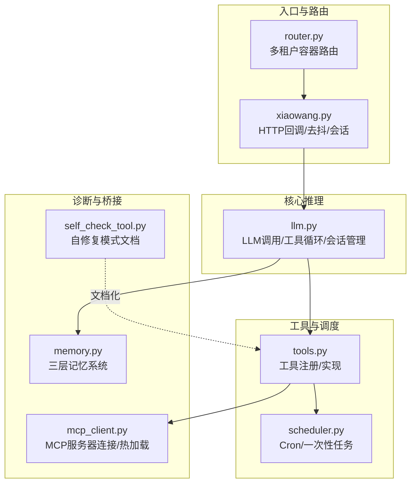
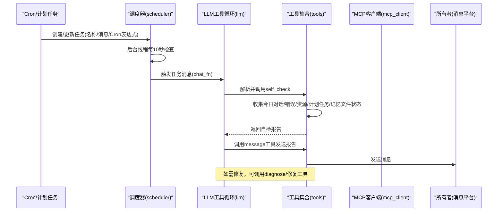
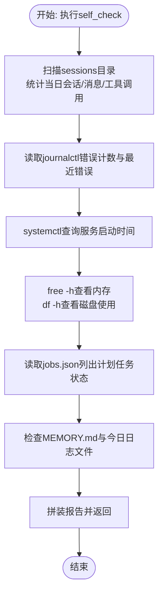
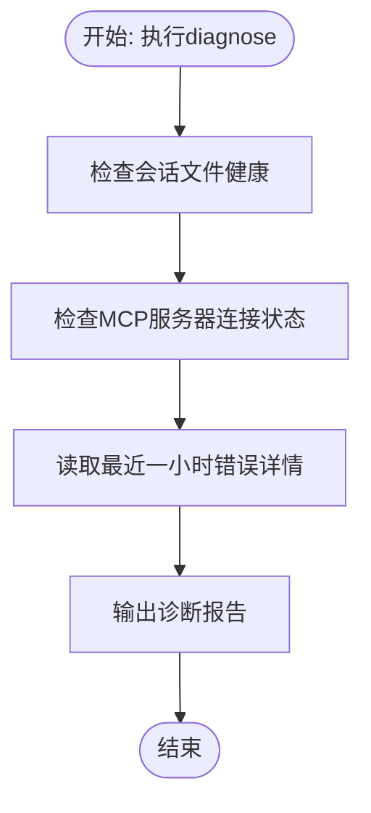
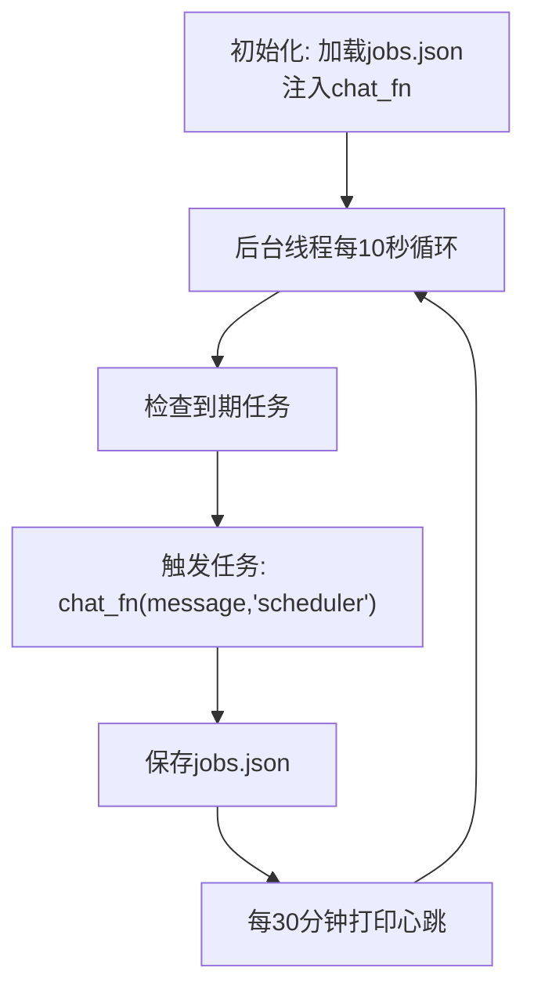
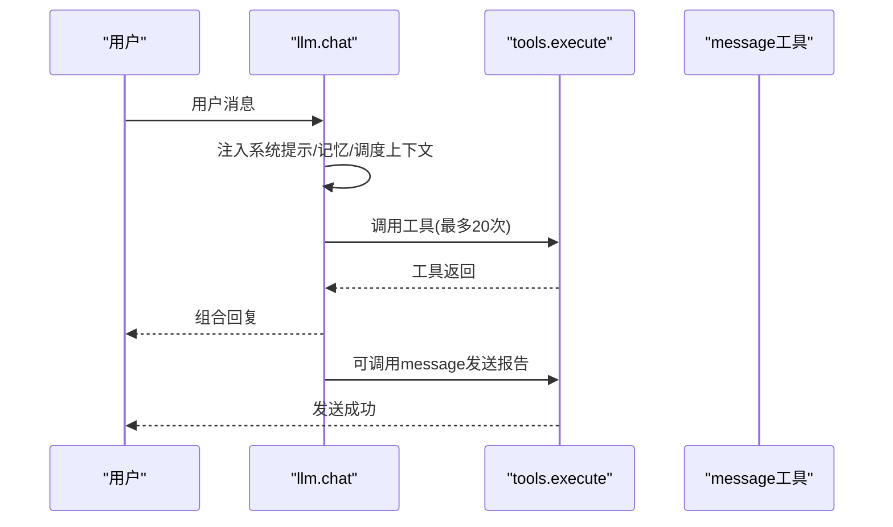
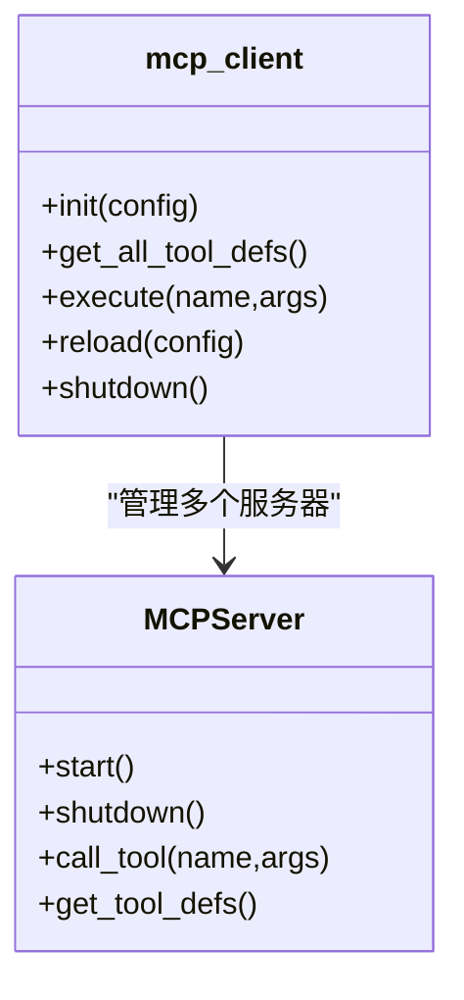
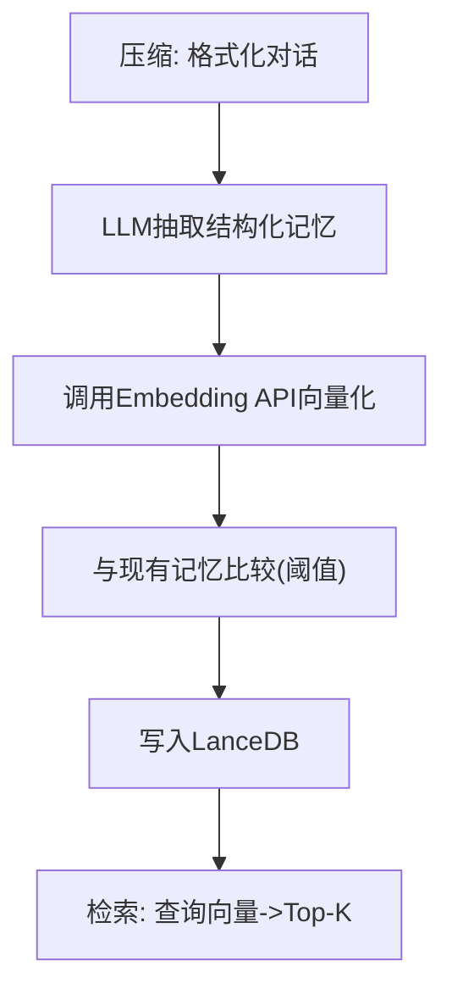
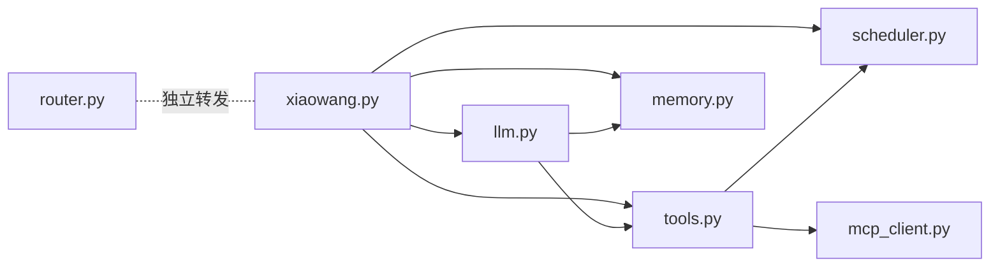

# 系统自修复机制

<cite>
**本文引用的文件**
- [README.md](file://README.md)
- [self_check_tool.py](file://self_check_tool.py)
- [scheduler.py](file://scheduler.py)
- [llm.py](file://llm.py)
- [tools.py](file://tools.py)
- [xiaowang.py](file://xiaowang.py)
- [mcp_client.py](file://mcp_client.py)
- [memory.py](file://memory.py)
- [router.py](file://router.py)
- [config.example.json](file://config.example.json)
</cite>

## 目录
1. [简介](#简介)
2. [项目结构](#项目结构)
3. [核心组件](#核心组件)
4. [架构总览](#架构总览)
5. [详细组件分析](#详细组件分析)
6. [依赖分析](#依赖分析)
7. [性能考量](#性能考量)
8. [故障排查指南](#故障排查指南)
9. [结论](#结论)
10. [附录](#附录)

## 简介
本文件面向724 Office系统“自修复机制”的深入说明，围绕每日自检与自动修复展开，覆盖以下主题：
- 自检流程：今日对话统计收集、错误日志汇总、服务运行时长监控、内存磁盘使用情况检查、计划任务状态检查、记忆文件状态检查
- 触发机制：Cron作业配置、调度器集成、消息工具调用等自动化执行流程
- 自修复流程：问题检测、根因诊断、修复执行、结果报告
- 报告解读：关键指标含义、异常阈值设定、趋势分析技巧
- 能力扩展：新增诊断工具、修复脚本、自动化决策逻辑

该系统以纯Python实现，零框架依赖，具备自演进能力，支持通过工具链进行自我诊断与修复，并通过消息平台向所有者汇报。

## 项目结构
系统采用“模块化+工具注册”架构，核心模块如下：
- 入口与路由：xiaowang.py负责HTTP回调、去抖合并、会话分发；router.py负责多租户容器路由
- 核心推理：llm.py负责LLM调用、工具循环、会话管理
- 工具体系：tools.py集中定义与注册所有可被LLM调用的工具
- 计划任务：scheduler.py提供一次性与周期性任务调度
- 自检与诊断：self_check_tool.py文档化自修复模式；tools.py中实现self_check与diagnose工具
- 外部桥接：mcp_client.py连接外部MCP服务器，热加载其工具
- 记忆系统：memory.py实现三层记忆管道（压缩/去重/检索）
- 配置示例：config.example.json提供模型、消息、内存、ASR、视频、搜索、MCP等配置模板

图表来源
- [xiaowang.py:59-76](file://xiaowang.py#L59-L76)
- [llm.py:317-401](file://llm.py#L317-L401)
- [tools.py:58-74](file://tools.py#L58-L74)
- [scheduler.py:30-43](file://scheduler.py#L30-L43)
- [self_check_tool.py:1-57](file://self_check_tool.py#L1-L57)
- [mcp_client.py:272-334](file://mcp_client.py#L272-L334)
- [memory.py:40-86](file://memory.py#L40-L86)

章节来源
- [README.md:23-66](file://README.md#L23-L66)
- [xiaowang.py:59-76](file://xiaowang.py#L59-L76)

## 核心组件
- 自检工具（self_check）：收集今日对话统计、错误日志、服务启动时间、内存与磁盘、计划任务状态、记忆文件状态
- 诊断工具（diagnose）：检查会话文件健康、MCP服务器连接状态、最近错误详情
- 调度器（scheduler）：持久化任务列表，后台线程每10秒检查一次，支持一次性与周期性任务
- LLM工具循环：在每次对话中注入系统提示、跨会话上下文、记忆检索，最多20次迭代
- MCP桥接：热加载外部工具，命名空间为“服务器名__工具名”
- 记忆系统：三层管道（压缩/去重/检索），支持跨会话检索

章节来源
- [tools.py:816-921](file://tools.py#L816-L921)
- [tools.py:923-1019](file://tools.py#L923-L1019)
- [scheduler.py:130-169](file://scheduler.py#L130-L169)
- [llm.py:317-401](file://llm.py#L317-L401)
- [mcp_client.py:272-334](file://mcp_client.py#L272-L334)
- [memory.py:40-86](file://memory.py#L40-L86)

## 架构总览
自修复机制通过“计划任务触发→LLM工具循环→工具执行→消息汇报”的闭环实现。每日定时任务触发self_check，生成报告后由message工具发送给所有者；如出现异常，可先调用diagnose进行根因诊断，再根据诊断结果选择修复动作（如清理会话、重启MCP、执行shell命令等），最后再次发送修复报告。

图表来源
- [scheduler.py:130-169](file://scheduler.py#L130-L169)
- [llm.py:317-401](file://llm.py#L317-L401)
- [tools.py:816-921](file://tools.py#L816-L921)
- [tools.py:923-1019](file://tools.py#L923-L1019)

## 详细组件分析

### 自检工具（self_check）工作原理
- 今日对话统计：扫描sessions目录，统计当日活跃会话数、用户消息数、助手回复数、工具调用次数
- 错误日志汇总：通过journalctl读取当日错误条目数量与最近几条错误摘要
- 服务运行时长：systemctl查询agent服务启动时间
- 内存与磁盘：free -h查看内存使用；df -h查看根分区使用率
- 计划任务状态：读取jobs.json，列出每个任务的Cron表达式与最近运行时间
- 记忆文件状态：检查MEMORY.md与今日日志文件大小与修改时间

图表来源
- [tools.py:816-921](file://tools.py#L816-L921)

章节来源
- [tools.py:816-921](file://tools.py#L816-L921)

### 诊断工具（diagnose）工作原理
- 会话文件健康检查：验证会话JSON是否以user/assistant开头、是否存在缺失的tool_call_id匹配、是否存在孤立的tool消息
- MCP服务器状态：检查已连接服务器数量、各服务器工具数量、进程状态；对未连接的stdio服务器给出调试建议
- 最近错误详情：读取最近一小时内的ERROR/400/Bad Request等错误上下文

图表来源
- [tools.py:923-1019](file://tools.py#L923-L1019)

章节来源
- [tools.py:923-1019](file://tools.py#L923-L1019)

### 调度器（scheduler）与Cron作业
- 初始化：加载jobs.json，注入chat_fn回调
- 后台线程：每10秒检查一次，识别到期任务
- Cron解析：使用croniter按本地时区计算下次触发时间，支持一次性与周期性任务
- 任务触发：通过chat_fn将任务消息交给LLM处理，失败时尝试通知所有者
- 心跳日志：每半小时打印任务数量与下一次触发时间预估

图表来源
- [scheduler.py:30-43](file://scheduler.py#L30-L43)
- [scheduler.py:130-169](file://scheduler.py#L130-L169)
- [scheduler.py:188-219](file://scheduler.py#L188-L219)

章节来源
- [scheduler.py:30-43](file://scheduler.py#L30-L43)
- [scheduler.py:130-169](file://scheduler.py#L130-L169)
- [scheduler.py:188-219](file://scheduler.py#L188-L219)

### LLM工具循环与跨会话上下文
- 系统提示：注入当前时间、个性文件（SOUL/AGENT/USER）与最近调度输出
- 记忆检索：从三层记忆中检索相关事实，注入系统提示
- 工具循环：最多20次迭代，支持tool_calls与tool结果回传
- 性能日志：记录准备阶段、LLM推理、工具调用与总耗时

图表来源
- [llm.py:288-300](file://llm.py#L288-L300)
- [llm.py:331-352](file://llm.py#L331-L352)
- [llm.py:362-400](file://llm.py#L362-L400)

章节来源
- [llm.py:288-300](file://llm.py#L288-L300)
- [llm.py:331-352](file://llm.py#L331-L352)
- [llm.py:362-400](file://llm.py#L362-L400)

### MCP桥接与热加载
- 连接方式：支持stdio与HTTP两种传输
- 命名空间：server__tool
- 热加载：无需重启，重新读取配置并注册/注销工具
- 容错：断连后尝试自动重连

图表来源
- [mcp_client.py:27-91](file://mcp_client.py#L27-L91)
- [mcp_client.py:272-334](file://mcp_client.py#L272-L334)

章节来源
- [mcp_client.py:27-91](file://mcp_client.py#L27-L91)
- [mcp_client.py:272-334](file://mcp_client.py#L272-L334)

### 记忆系统（三层管道）
- 压缩：将会话片段交由LLM抽取结构化记忆
- 去重：基于余弦相似度阈值过滤重复
- 检索：向量检索Top-K相关记忆注入系统提示

图表来源
- [memory.py:194-282](file://memory.py#L194-L282)
- [memory.py:294-361](file://memory.py#L294-L361)

章节来源
- [memory.py:194-282](file://memory.py#L194-L282)
- [memory.py:294-361](file://memory.py#L294-L361)

## 依赖分析
- 模块耦合
  - llm.py依赖tools.py（工具定义）、memory.py（检索）、scheduler（跨会话上下文）
  - tools.py依赖scheduler（任务管理）、mcp_client（外部工具桥接）
  - xiaowang.py依赖llm.py、scheduler、tools、memory
  - router.py独立于上述模块，仅通过HTTP转发消息
- 外部依赖
  - croniter：Cron解析
  - lancedb：向量数据库
  - websocket-client：ASR流式识别
  - 标准库：json、subprocess、threading、urllib等

图表来源
- [xiaowang.py:59-76](file://xiaowang.py#L59-L76)
- [llm.py:317-401](file://llm.py#L317-L401)
- [tools.py:58-74](file://tools.py#L58-L74)
- [scheduler.py:30-43](file://scheduler.py#L30-L43)
- [mcp_client.py:272-334](file://mcp_client.py#L272-L334)
- [memory.py:40-86](file://memory.py#L40-L86)

章节来源
- [xiaowang.py:59-76](file://xiaowang.py#L59-L76)
- [llm.py:317-401](file://llm.py#L317-L401)
- [tools.py:58-74](file://tools.py#L58-L74)
- [scheduler.py:30-43](file://scheduler.py#L30-L43)
- [mcp_client.py:272-334](file://mcp_client.py#L272-L334)
- [memory.py:40-86](file://memory.py#L40-L86)

## 性能考量
- 工具循环上限：最大20次迭代，避免长时间阻塞
- 会话截断与压缩：超过阈值的消息会被压缩到长期记忆，减少历史长度
- 记忆检索：Top-K限制与缓存，降低延迟
- 调度器轮询：10秒间隔，平衡及时性与CPU占用
- 并发模型：线程池/守护线程处理请求与任务，避免阻塞

[本节为通用指导，不直接分析具体文件]

## 故障排查指南
- 自检报告为空或异常
  - 检查Cron任务是否正确创建与触发
  - 确认message工具可用且所有者ID正确
  - 查看journalctl中agent服务日志
- 诊断显示会话文件问题
  - 会话以tool/assistant+tool_calls开头会导致400错误
  - 存在孤儿tool消息或缺少匹配tool_call_id
  - 建议使用edit_file/write_file修复或删除重建
- MCP服务器不可用
  - 检查stdio命令是否存在与可执行
  - 查看启动超时与错误输出
  - 使用reload_mcp热加载最新配置
- 资源不足
  - 关注内存与磁盘使用率，必要时清理缓存或扩容
- 跨会话上下文缺失
  - 确保最近一次调度输出未过期（2小时窗口）

章节来源
- [tools.py:923-1019](file://tools.py#L923-L1019)
- [tools.py:1097-1131](file://tools.py#L1097-L1131)
- [llm.py:231-286](file://llm.py#L231-L286)

## 结论
724 Office系统通过“计划任务+LLM工具循环+工具执行+消息汇报”的闭环，实现了稳定的每日自检与自修复能力。自检工具覆盖对话、日志、资源、计划任务与记忆文件等关键维度；诊断工具提供根因定位；MCP热加载与自定义工具扩展进一步增强系统适应性。配合清晰的报告解读与故障排查指引，系统可在无人值守情况下保持稳定运行并持续演进。

[本节为总结，不直接分析具体文件]

## 附录

### 自检报告解读方法
- 今日对话统计
  - 活跃会话数：反映并发用户规模
  - 用户消息/助手回复/工具调用：衡量工具使用频率与交互深度
- 错误日志
  - 当日错误计数与最近错误摘要：快速定位异常类型与发生时间
- 服务运行时长
  - 启动时间：判断服务重启频率与稳定性
- 内存与磁盘
  - 内存使用率与可用容量：评估资源压力
  - 磁盘使用率：关注根分区与数据分区
- 计划任务状态
  - Cron表达式与最近运行时间：确认任务按时执行
- 记忆文件状态
  - MEMORY.md与今日日志文件大小与修改时间：确保记忆系统正常写入

章节来源
- [tools.py:816-921](file://tools.py#L816-L921)

### 自修复流程（建议实践）
- 问题检测：每日自检报告异常项
- 根因诊断：调用diagnose，获取会话、MCP、错误详情
- 修复执行：根据诊断结果选择修复动作（清理会话、重启MCP、执行shell命令、写入修复文件）
- 结果报告：再次调用self_check并发送报告给所有者

章节来源
- [tools.py:816-921](file://tools.py#L816-L921)
- [tools.py:923-1019](file://tools.py#L923-L1019)

### 扩展自修复能力（开发者指南）
- 新增诊断工具
  - 在tools.py中添加新的@tool函数，遵循参数schema与返回字符串约定
  - 将工具注册到工具定义列表，供LLM在诊断场景中调用
- 编写修复脚本
  - 使用exec工具执行shell命令或脚本
  - 通过write_file/edit_file创建/更新配置文件或修复脚本
- 自动化决策逻辑
  - 在LLM系统提示中加入规则与策略，使工具循环在诊断后自动选择修复路径
  - 利用create_tool动态创建临时修复工具，完成一次性修复后可移除

章节来源
- [tools.py:1022-1091](file://tools.py#L1022-L1091)
- [tools.py:1097-1131](file://tools.py#L1097-L1131)
- [llm.py:288-300](file://llm.py#L288-L300)