# NL2SQL系统架构设计

<cite>
**本文档引用的文件**
- [app.js](file://NL2SQL/backend/src/app.js)
- [routes.js](file://NL2SQL/backend/src/core/routes.js)
- [nl2sqlEngine.js](file://NL2SQL/backend/src/core/nl2sqlEngine.js)
- [llmService.js](file://NL2SQL/backend/src/core/llmService.js)
- [database.js](file://NL2SQL/backend/src/core/database.js)
- [vectorStore.js](file://NL2SQL/backend/src/memory/vectorStore.js)
- [schemaLoader.js](file://NL2SQL/backend/src/core/schemaLoader.js)
- [config.js](file://NL2SQL/backend/src/core/config.js)
- [logger.js](file://NL2SQL/backend/src/utils/logger.js)
- [wsHandler.js](file://NL2SQL/backend/src/core/wsHandler.js)
- [selfRepair.js](file://NL2SQL/backend/src/core/selfRepair.js)
- [main.js](file://NL2SQL/frontend/src/main.js)
- [package.json](file://NL2SQL/backend/package.json)
- [package.json](file://NL2SQL/frontend/package.json)
- [README.md](file://README.md)
</cite>

## 更新摘要
**变更内容**
- 新增实体解析架构，支持模糊描述到具体ID的映射
- 增强上下文理解能力，实现多轮对话状态管理
- 完善LLM意图识别和SQL生成流程
- 优化向量数据库集成，支持Schema语义匹配
- 增强错误处理和自修复机制

## 目录
1. [项目概述](#项目概述)
2. [系统架构总览](#系统架构总览)
3. [核心组件分析](#核心组件分析)
4. [数据流分析](#数据流-analysis)
5. [配置管理](#配置管理)
6. [错误处理与监控](#错误处理与监控)
7. [性能优化策略](#性能优化策略)
8. [部署与运维](#部署与运维)
9. [总结](#总结)

## 项目概述

NL2SQL系统是一个基于人工智能技术的自然语言到SQL查询转换平台。该系统允许用户通过自然语言查询数据库，系统自动将其转换为标准SQL语句并执行，最终将结果以自然语言形式反馈给用户。

### 系统特性

- **多模态交互**：支持HTTP REST API和WebSocket实时通信
- **智能查询转换**：基于LLM的自然语言到SQL转换
- **语义检索**：利用向量数据库实现Schema语义匹配
- **会话管理**：完整的对话历史和状态管理
- **安全防护**：多层SQL安全验证和访问控制
- **自修复机制**：自动健康检查和故障恢复
- **实体解析**：支持模糊描述到具体ID的智能映射

## 系统架构总览

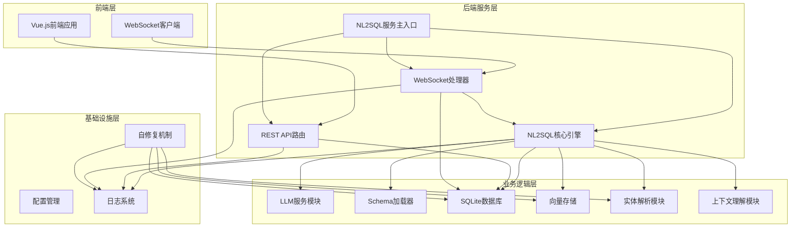

**图表来源**
- [app.js:117-190](file://NL2SQL/backend/src/app.js#L117-L190)
- [routes.js:1-538](file://NL2SQL/backend/src/core/routes.js#L1-L538)
- [wsHandler.js:1-451](file://NL2SQL/backend/src/core/wsHandler.js#L1-L451)

## 核心组件分析

### 1. 应用主入口 (app.js)

应用主入口负责整个服务的启动和初始化，采用模块化设计确保各组件的独立性和可维护性。

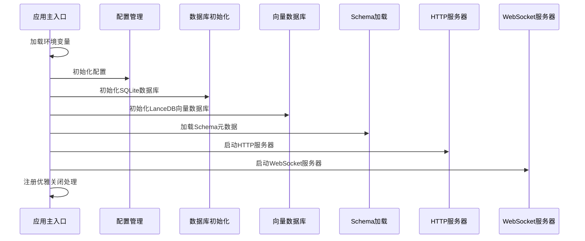

**图表来源**
- [app.js:121-190](file://NL2SQL/backend/src/app.js#L121-L190)

**章节来源**
- [app.js:1-266](file://NL2SQL/backend/src/app.js#L1-L266)

### 2. NL2SQL核心引擎 (nl2sqlEngine.js)

核心引擎实现了完整的自然语言到SQL转换流程，包含意图识别、澄清机制、SQL生成、验证和结果格式化等关键步骤。**更新**：增强了上下文理解和实体解析能力。

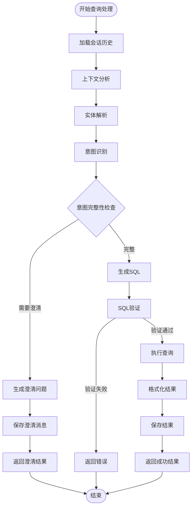

**图表来源**
- [nl2sqlEngine.js:596-778](file://NL2SQL/backend/src/core/nl2sqlEngine.js#L596-L778)

**章节来源**
- [nl2sqlEngine.js:1-829](file://NL2SQL/backend/src/core/nl2sqlEngine.js#L1-L829)

### 3. 实体解析模块 (nl2sqlEngine.js)

**新增**：专门负责将模糊描述（如游戏名称）映射到具体ID的实体解析功能。

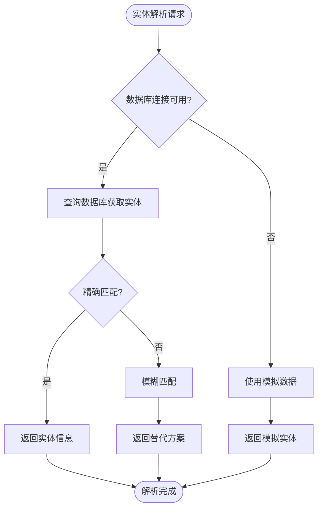

**图表来源**
- [nl2sqlEngine.js:38-104](file://NL2SQL/backend/src/core/nl2sqlEngine.js#L38-L104)

**章节来源**
- [nl2sqlEngine.js:28-104](file://NL2SQL/backend/src/core/nl2sqlEngine.js#L28-L104)

### 4. 上下文理解模块 (nl2sqlEngine.js)

**新增**：实现多轮对话的状态管理和上下文融合。

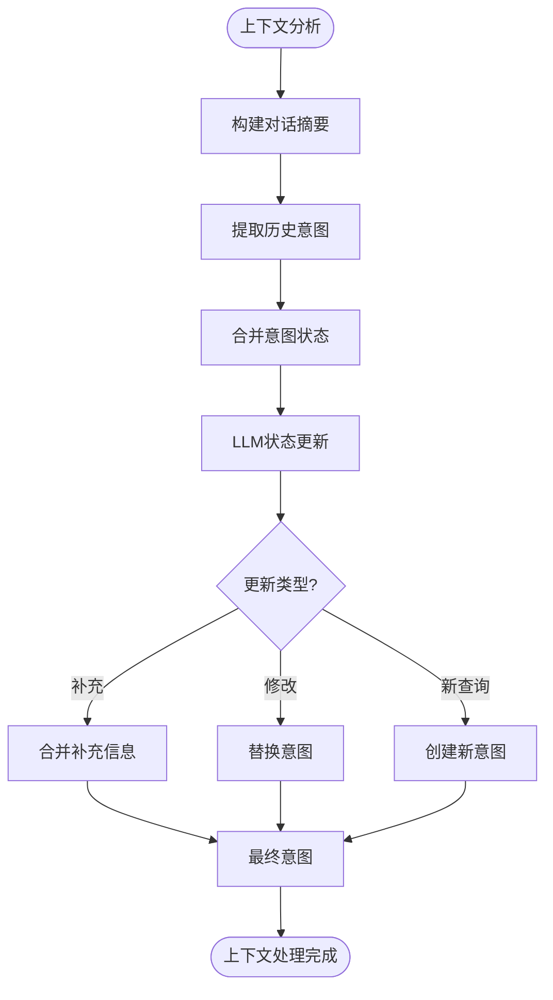

**图表来源**
- [nl2sqlEngine.js:290-406](file://NL2SQL/backend/src/core/nl2sqlEngine.js#L290-L406)

**章节来源**
- [nl2sqlEngine.js:118-406](file://NL2SQL/backend/src/core/nl2sqlEngine.js#L118-L406)

### 5. LLM服务模块 (llmService.js)

LLM服务模块提供了与外部语言模型的统一接口，支持聊天、嵌入向量生成等功能，并具备完善的错误处理和重试机制。

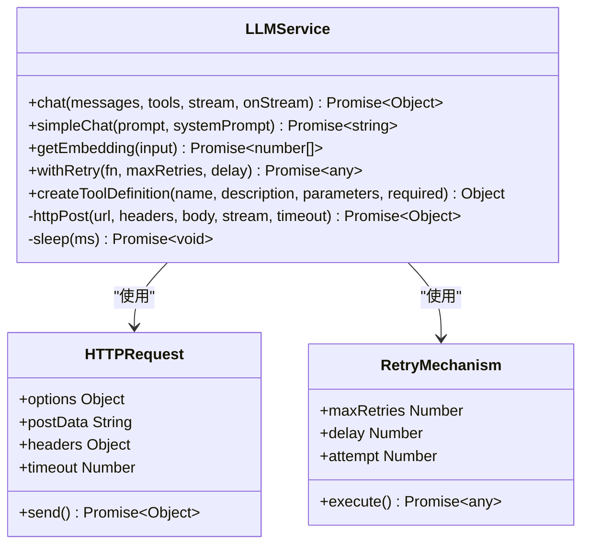

**图表来源**
- [llmService.js:1-432](file://NL2SQL/backend/src/core/llmService.js#L1-L432)

**章节来源**
- [llmService.js:1-432](file://NL2SQL/backend/src/core/llmService.js#L1-L432)

### 6. 数据库管理系统 (database.js)

SQLite数据库管理系统负责会话历史、查询日志等数据的持久化存储，采用事务处理确保数据一致性。

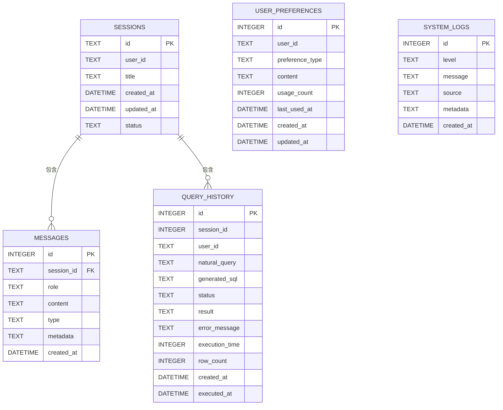

**图表来源**
- [database.js:39-187](file://NL2SQL/backend/src/core/database.js#L39-L187)

**章节来源**
- [database.js:1-531](file://NL2SQL/backend/src/core/database.js#L1-L531)

### 7. 向量存储系统 (vectorStore.js)

基于LanceDB的向量存储系统，支持Schema信息和查询历史的向量化存储，实现语义相似度搜索。

**章节来源**
- [vectorStore.js:1-442](file://NL2SQL/backend/src/memory/vectorStore.js#L1-L442)

### 8. Schema管理器 (schemaLoader.js)

Schema加载器负责管理数据表的元数据信息，提供Schema查询、匹配和验证功能。**更新**：增强了向量数据库集成和语义搜索能力。

**章节来源**
- [schemaLoader.js:1-655](file://NL2SQL/backend/src/core/schemaLoader.js#L1-L655)

### 9. WebSocket处理器 (wsHandler.js)

WebSocket处理器实现了实时双向通信，支持查询处理、历史获取、连接管理和心跳检测等功能。

**章节来源**
- [wsHandler.js:1-451](file://NL2SQL/backend/src/core/wsHandler.js#L1-L451)

## 数据流分析

### 1. HTTP API数据流

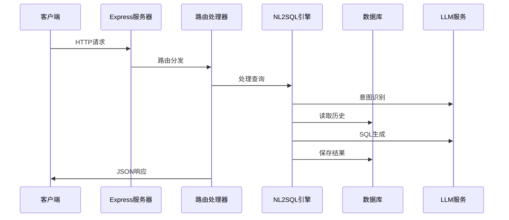

**图表来源**
- [routes.js:264-340](file://NL2SQL/backend/src/core/routes.js#L264-L340)
- [nl2sqlEngine.js:596-778](file://NL2SQL/backend/src/core/nl2sqlEngine.js#L596-L778)

### 2. WebSocket数据流

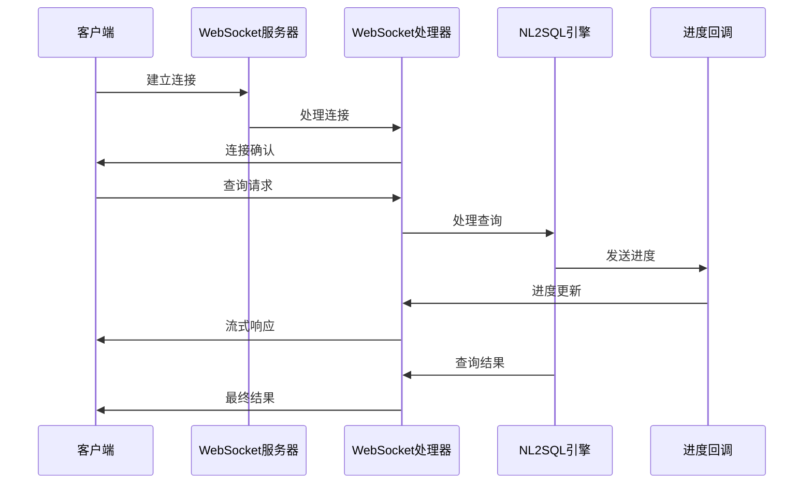

**图表来源**
- [wsHandler.js:197-247](file://NL2SQL/backend/src/core/wsHandler.js#L197-L247)

### 3. 实体解析数据流

**新增**：展示实体解析的完整流程。

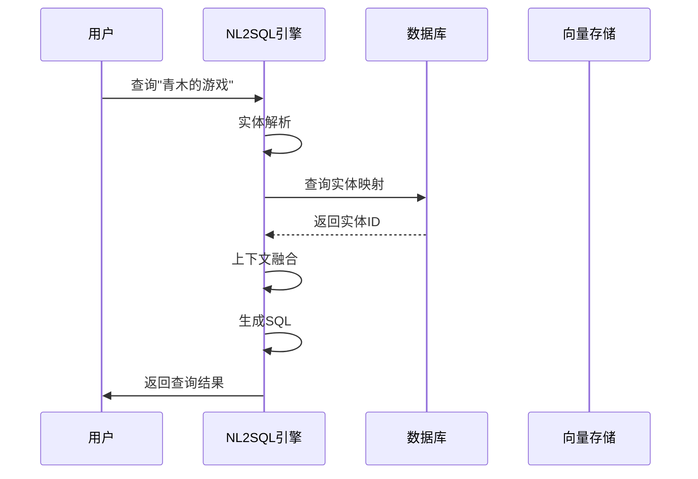

**图表来源**
- [nl2sqlEngine.js:38-104](file://NL2SQL/backend/src/core/nl2sqlEngine.js#L38-L104)

## 配置管理

系统采用集中式配置管理，所有配置项都从环境变量读取并提供默认值。

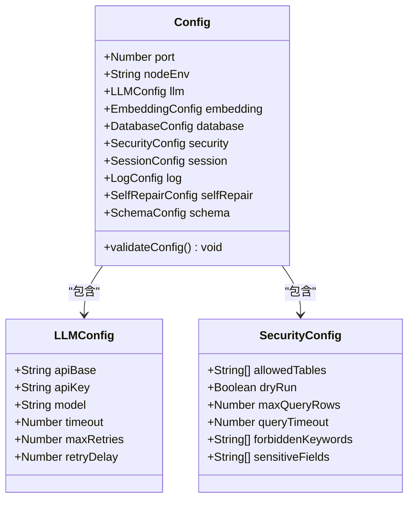

**图表来源**
- [config.js:16-246](file://NL2SQL/backend/src/core/config.js#L16-L246)

**章节来源**
- [config.js:1-289](file://NL2SQL/backend/src/core/config.js#L1-L289)

## 错误处理与监控

### 1. 自修复机制

系统内置自修复机制，实现自动化监控和维护：

**图表来源**
- [selfRepair.js:55-107](file://NL2SQL/backend/src/core/selfRepair.js#L55-L107)

**章节来源**
- [selfRepair.js:1-414](file://NL2SQL/backend/src/core/selfRepair.js#L1-L414)

### 2. 日志系统

统一的日志记录系统支持多级别输出和文件轮转：

**章节来源**
- [logger.js:1-318](file://NL2SQL/backend/src/utils/logger.js#L1-L318)

## 性能优化策略

### 1. 缓存策略

- **Schema缓存**：Schema元数据缓存，支持过期时间控制
- **向量缓存**：向量数据库中的Schema向量缓存
- **会话缓存**：近期会话历史缓存
- **实体缓存**：常用实体映射缓存

### 2. 异步处理

- **批量向量化**：Embedding向量生成采用批次处理
- **流式响应**：WebSocket支持流式数据传输
- **并发控制**：连接级别的并发请求控制
- **异步实体解析**：数据库查询采用异步处理

### 3. 资源管理

- **连接池**：数据库连接池管理
- **内存监控**：定期内存使用检查
- **超时控制**：各类操作的超时设置
- **向量数据库优化**：LanceDB索引和查询优化

## 部署与运维

### 1. 前端部署

前端使用Vite构建工具，支持开发和生产两种模式：

**章节来源**
- [package.json:1-31](file://NL2SQL/frontend/package.json#L1-L31)

### 2. 后端部署

后端采用Node.js环境，支持多种部署方式：

**章节来源**
- [package.json:1-29](file://NL2SQL/backend/package.json#L1-L29)

### 3. 环境配置

系统支持通过环境变量进行灵活配置，包括：

- LLM API配置
- 数据库连接配置  
- 安全策略配置
- 性能参数配置
- 向量数据库配置

## 总结

NL2SQL系统采用模块化架构设计，具有以下特点：

### 技术优势

1. **架构清晰**：层次分明的模块化设计，职责分离明确
2. **扩展性强**：插件化设计支持功能扩展
3. **可靠性高**：完善的错误处理和自修复机制
4. **性能优秀**：多层缓存和异步处理优化
5. **智能增强**：新增实体解析和上下文理解能力
6. **语义理解**：基于向量数据库的语义匹配能力

### 应用价值

1. **降低门槛**：非技术人员也能进行复杂数据分析
2. **提高效率**：自动化SQL生成减少人工编写
3. **增强体验**：自然语言交互提升用户体验
4. **保障安全**：多层安全防护保护数据安全
5. **智能推理**：支持模糊查询和上下文理解

### 发展方向

1. **模型优化**：持续改进LLM模型效果
2. **功能扩展**：支持更多数据库类型和查询场景
3. **性能提升**：优化大规模数据处理能力
4. **生态建设**：构建完整的工具链和插件体系
5. **智能增强**：进一步提升上下文理解和实体解析能力

该系统为自然语言数据查询提供了一个完整、可靠、易用的解决方案，适合在企业级环境中部署和使用。