# NL2SQL系统架构设计

<cite>
**本文档引用的文件**
- [app.js](file://NL2SQL/backend/src/app.js)
- [routes.js](file://NL2SQL/backend/src/core/routes.js)
- [nl2sqlEngine.js](file://NL2SQL/backend/src/core/nl2sqlEngine.js)
- [llmService.js](file://NL2SQL/backend/src/core/llmService.js)
- [database.js](file://NL2SQL/backend/src/core/database.js)
- [vectorStore.js](file://NL2SQL/backend/src/memory/vectorStore.js)
- [schemaLoader.js](file://NL2SQL/backend/src/core/schemaLoader.js)
- [config.js](file://NL2SQL/backend/src/core/config.js)
- [logger.js](file://NL2SQL/backend/src/utils/logger.js)
- [wsHandler.js](file://NL2SQL/backend/src/core/wsHandler.js)
- [selfRepair.js](file://NL2SQL/backend/src/core/selfRepair.js)
- [main.js](file://NL2SQL/frontend/src/main.js)
- [package.json](file://NL2SQL/backend/package.json)
- [package.json](file://NL2SQL/frontend/package.json)
- [README.md](file://README.md)
- [longTermMemory.js](file://NL2SQL/backend/src/memory/longTermMemory.js)
- [summarizer.js](file://NL2SQL/backend/src/memory/summarizer.js)
- [tokenBudget.js](file://NL2SQL/backend/src/utils/tokenBudget.js)
- [context-management.test.js](file://NL2SQL/backend/test/context-management.test.js)
- [evaluation.js](file://NL2SQL/backend/src/utils/evaluation.js)
</cite>

## 更新摘要
**变更内容**
- 架构优化：从字段级向量化转向表级向量化，提升搜索精度和性能
- 增强智能搜索能力：新增searchSchemaSmart方法，支持查询意图识别和智能重排序
- 完善性能监控系统：新增evaluation.js模块，提供向量化质量评估和运行时统计
- 优化向量数据库结构：Schema向量表和查询历史向量表分离，支持元数据过滤
- 增强平台术语解析机制，支持"新平台"/"老平台"等业务术语到数据库标识的映射
- 增强澄清上下文处理，实现多轮对话状态管理和智能澄清
- 完善长期记忆系统，支持字段别名学习和即时映射提取
- 优化对话摘要和历史压缩机制，提升长对话处理能力
- 增强实体解析和上下文理解的智能化水平

## 目录
1. [项目概述](#项目概述)
2. [系统架构总览](#系统架构总览)
3. [核心组件分析](#核心组件分析)
4. [数据流分析](#数据流分析)
5. [配置管理](#配置管理)
6. [错误处理与监控](#错误处理与监控)
7. [性能优化策略](#性能优化策略)
8. [部署与运维](#部署与运维)
9. [总结](#总结)

## 项目概述

NL2SQL系统是一个基于人工智能技术的自然语言到SQL查询转换平台。该系统允许用户通过自然语言查询数据库，系统自动将其转换为标准SQL语句并执行，最终将结果以自然语言形式反馈给用户。

### 系统特性

- **多模态交互**：支持HTTP REST API和WebSocket实时通信
- **智能查询转换**：基于LLM的自然语言到SQL转换
- **语义检索**：利用向量数据库实现Schema语义匹配
- **会话管理**：完整的对话历史和状态管理
- **安全防护**：多层SQL安全验证和访问控制
- **自修复机制**：自动健康检查和故障恢复
- **实体解析**：支持模糊描述到具体ID的智能映射
- **平台术语解析**：支持业务术语到数据库标识的智能映射
- **澄清上下文处理**：实现多轮对话状态管理和智能澄清
- **性能监控**：全面的向量化质量评估和运行时统计

## 系统架构总览

```mermaid
graph TB
subgraph "前端层"
FE[Vue.js前端应用]
WS[WebSocket客户端]
end
subgraph "后端服务层"
APP[NL2SQL服务主入口]
ROUTES[REST API路由]
WS_HANDLER[WebSocket处理器]
ENGINE[NL2SQL核心引擎]
END
subgraph "业务逻辑层"
LLM[LLM服务模块]
SCHEMA[Schema加载器]
DATABASE[SQLite数据库]
VECTOR[向量存储]
ENTITIES[实体解析模块]
CONTEXT[上下文理解模块]
LONG_TERM_MEM[长期记忆系统]
SUMMARIZER[对话摘要模块]
TOKEN_BUDGET[Token预算管理]
EVAL[性能监控评估]
end
subgraph "基础设施层"
CONFIG[配置管理]
LOGGER[日志系统]
SELF_REPAIR[自修复机制]
end
FE --> ROUTES
WS --> WS_HANDLER
APP --> ROUTES
APP --> WS_HANDLER
APP --> ENGINE
ENGINE --> LLM
ENGINE --> SCHEMA
ENGINE --> DATABASE
ENGINE --> VECTOR
ENGINE --> ENTITIES
ENGINE --> CONTEXT
ENGINE --> LONG_TERM_MEM
ENGINE --> SUMMARIZER
ENGINE --> TOKEN_BUDGET
ENGINE --> EVAL
ROUTES --> DATABASE
WS_HANDLER --> ENGINE
WS_HANDLER --> DATABASE
ENGINE --> LOGGER
ROUTES --> LOGGER
WS_HANDLER --> LOGGER
SELF_REPAIR --> LOGGER
SELF_REPAIR --> DATABASE
SELF_REPAIR --> VECTOR
SELF_REPAIR --> ENTITIES
SELF_REPAIR --> LONG_TERM_MEM
EVAL --> LOGGER
EVAL --> VECTOR
EVAL --> LONG_TERM_MEM
```

**图表来源**
- [app.js:117-190](file://NL2SQL/backend/src/app.js#L117-L190)
- [routes.js:1-538](file://NL2SQL/backend/src/core/routes.js#L1-L538)
- [wsHandler.js:1-451](file://NL2SQL/backend/src/core/wsHandler.js#L1-L451)
- [evaluation.js:1-488](file://NL2SQL/backend/src/utils/evaluation.js#L1-L488)

## 核心组件分析

### 1. 应用主入口 (app.js)

应用主入口负责整个服务的启动和初始化，采用模块化设计确保各组件的独立性和可维护性。

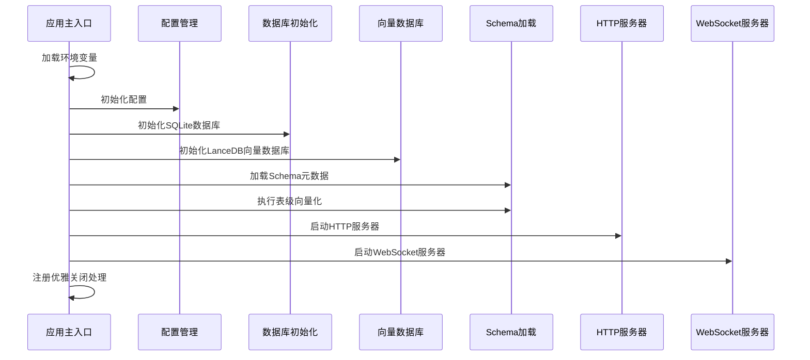
```mermaid
sequenceDiagram
participant Main as 应用主入口
participant Config as 配置管理
participant DB as 数据库初始化
participant Vector as 向量数据库
participant Schema as Schema加载
participant Server as HTTP服务器
participant WS as WebSocket服务器
Main->>Main : 加载环境变量
Main->>Config : 初始化配置
Main->>DB : 初始化SQLite数据库
Main->>Vector : 初始化LanceDB向量数据库
Main->>Schema : 加载Schema元数据
Main->>Schema : 执行表级向量化
Main->>Server : 启动HTTP服务器
Main->>WS : 启动WebSocket服务器
Main->>Main : 注册优雅关闭处理
```

**图表来源**
- [app.js:121-190](file://NL2SQL/backend/src/app.js#L121-L190)

**章节来源**
- [app.js:1-266](file://NL2SQL/backend/src/app.js#L1-L266)

### 2. NL2SQL核心引擎 (nl2sqlEngine.js)

核心引擎实现了完整的自然语言到SQL转换流程，包含意图识别、澄清机制、SQL生成、验证和结果格式化等关键步骤。**更新**：增强了上下文理解和实体解析能力，新增平台术语解析和澄清上下文处理机制。

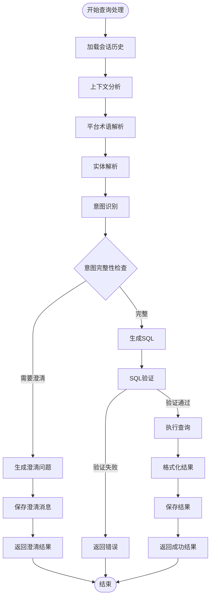
```mermaid
flowchart TD
Start([开始查询处理]) --> LoadHistory[加载会话历史]
LoadHistory --> ContextAnalysis[上下文分析]
ContextAnalysis --> PlatformResolve[平台术语解析]
PlatformResolve --> EntityResolve[实体解析]
EntityResolve --> AnalyzeIntent[意图识别]
AnalyzeIntent --> CheckCompleteness{意图完整性检查}
CheckCompleteness --> |需要澄清| GenerateClarification[生成澄清问题]
CheckCompleteness --> |完整| GenerateSQL[生成SQL]
GenerateClarification --> SaveClarification[保存澄清消息]
SaveClarification --> ReturnClarification[返回澄清结果]
GenerateSQL --> ValidateSQL[SQL验证]
ValidateSQL --> |验证失败| ReturnError[返回错误]
ValidateSQL --> |验证通过| ExecuteQuery[执行查询]
ExecuteQuery --> FormatResult[格式化结果]
FormatResult --> SaveResult[保存结果]
SaveResult --> ReturnSuccess[返回成功结果]
ReturnError --> End([结束])
ReturnClarification --> End
ReturnSuccess --> End
```

**图表来源**
- [nl2sqlEngine.js:596-778](file://NL2SQL/backend/src/core/nl2sqlEngine.js#L596-L778)

**章节来源**
- [nl2sqlEngine.js:1-829](file://NL2SQL/backend/src/core/nl2sqlEngine.js#L1-L829)

### 3. 平台术语解析模块 (nl2sqlEngine.js)

**新增**：专门负责将"新平台"/"老平台"等业务术语映射到具体数据库标识的平台术语解析功能。

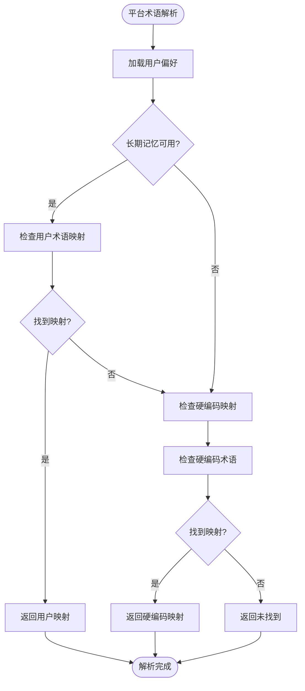
```mermaid
flowchart TD
PlatformStart([平台术语解析]) --> LoadUserPrefs[加载用户偏好]
LoadUserPrefs --> CheckMemory{长期记忆可用?}
CheckMemory --> |是| CheckUserTerm[检查用户术语映射]
CheckMemory --> |否| CheckHardcoded[检查硬编码映射]
CheckUserTerm --> FoundUserPref{找到映射?}
FoundUserPref --> |是| ReturnUserPref[返回用户映射]
FoundUserPref --> |否| CheckHardcoded
CheckHardcoded --> CheckHardcodedTerms[检查硬编码术语]
CheckHardcodedTerms --> FoundHardcoded{找到映射?}
FoundHardcoded --> |是| ReturnHardcoded[返回硬编码映射]
FoundHardcoded --> |否| ReturnNone[返回未找到]
ReturnUserPref --> End([解析完成])
ReturnHardcoded --> End
ReturnNone --> End
```

**图表来源**
- [nl2sqlEngine.js:302-383](file://NL2SQL/backend/src/core/nl2sqlEngine.js#L302-L383)

**章节来源**
- [nl2sqlEngine.js:302-383](file://NL2SQL/backend/src/core/nl2sqlEngine.js#L302-L383)

### 4. 澄清上下文处理模块 (nl2sqlEngine.js)

**新增**：实现多轮对话的状态管理和上下文融合，支持澄清问题的智能处理和默认选项确认。

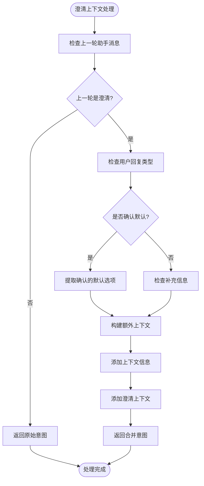
```mermaid
flowchart TD
ClarifyStart([澄清上下文处理]) --> CheckLastAssistant[检查上一轮助手消息]
CheckLastAssistant --> IsClarify{上一轮是澄清?}
IsClarify --> |否| ReturnOriginal[返回原始意图]
IsClarify --> |是| CheckReplyType[检查用户回复类型]
CheckReplyType --> IsAffirmative{是否确认默认?}
IsAffirmative --> |是| ExtractDefaults[提取确认的默认选项]
IsAffirmative --> |否| CheckSupplement[检查补充信息]
ExtractDefaults --> BuildExtraContext[构建额外上下文]
CheckSupplement --> BuildExtraContext
BuildExtraContext --> AddContextInfo[添加上下文信息]
AddContextInfo --> AddClarificationContext[添加澄清上下文]
AddClarificationContext --> ReturnMerged[返回合并意图]
ReturnOriginal --> End([处理完成])
ReturnMerged --> End
```

**图表来源**
- [nl2sqlEngine.js:443-482](file://NL2SQL/backend/src/core/nl2sqlEngine.js#L443-L482)

**章节来源**
- [nl2sqlEngine.js:443-482](file://NL2SQL/backend/src/core/nl2sqlEngine.js#L443-L482)

### 5. 长期记忆系统 (longTermMemory.js)

**更新**：增强了长期记忆系统，新增即时映射提取功能，支持从用户文本中自动学习字段别名和映射关系。

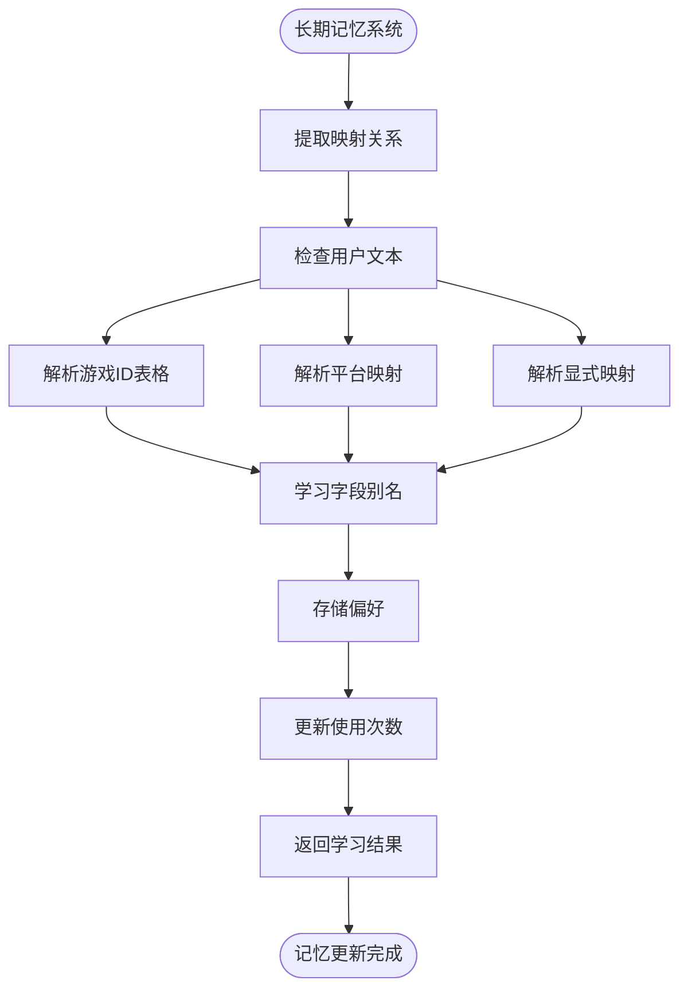
```mermaid
flowchart TD
LongTermStart([长期记忆系统]) --> ExtractMappings[提取映射关系]
ExtractMappings --> CheckText[检查用户文本]
CheckText --> ParseGameTable[解析游戏ID表格]
CheckText --> ParsePlatformMap[解析平台映射]
CheckText --> ParseExplicitMap[解析显式映射]
ParseGameTable --> LearnFieldAlias[学习字段别名]
ParsePlatformMap --> LearnFieldAlias
ParseExplicitMap --> LearnFieldAlias
LearnFieldAlias --> StorePreference[存储偏好]
StorePreference --> UpdateUsage[更新使用次数]
UpdateUsage --> ReturnResult[返回学习结果]
ReturnResult --> End([记忆更新完成])
```

**图表来源**
- [longTermMemory.js:844-965](file://NL2SQL/backend/src/memory/longTermMemory.js#L844-L965)

**章节来源**
- [longTermMemory.js:1-1134](file://NL2SQL/backend/src/memory/longTermMemory.js#L1-L1134)

### 6. 对话摘要模块 (summarizer.js)

**更新**：增强了对话摘要功能，支持智能压缩和缓存管理，提升长对话处理效率。

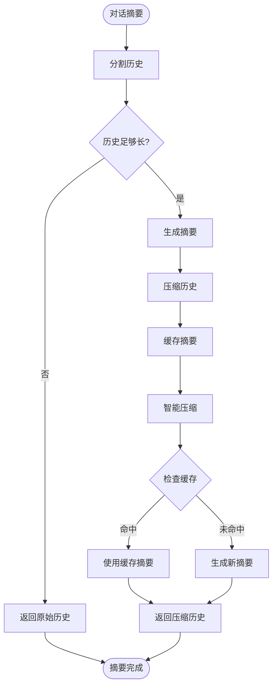
```mermaid
flowchart TD
SummarizerStart([对话摘要]) --> SplitHistory[分割历史]
SplitHistory --> CheckEnoughData{历史足够长?}
CheckEnoughData --> |否| ReturnOriginal[返回原始历史]
CheckEnoughData --> |是| SummarizeDialogue[生成摘要]
SummarizeDialogue --> CompressHistory[压缩历史]
CompressHistory --> CacheSummary[缓存摘要]
CacheSummary --> SmartCompress[智能压缩]
SmartCompress --> CheckCache{检查缓存}
CheckCache --> |命中| UseCache[使用缓存摘要]
CheckCache --> |未命中| GenerateNew[生成新摘要]
UseCache --> ReturnCompressed[返回压缩历史]
GenerateNew --> ReturnCompressed
ReturnOriginal --> End([摘要完成])
ReturnCompressed --> End
```

**图表来源**
- [summarizer.js:264-492](file://NL2SQL/backend/src/memory/summarizer.js#L264-L492)

**章节来源**
- [summarizer.js:1-518](file://NL2SQL/backend/src/memory/summarizer.js#L1-L518)

### 7. Token预算管理 (tokenBudget.js)

**新增**：专门负责对话历史的Token估算和预算管理，确保上下文长度控制在合理范围内。

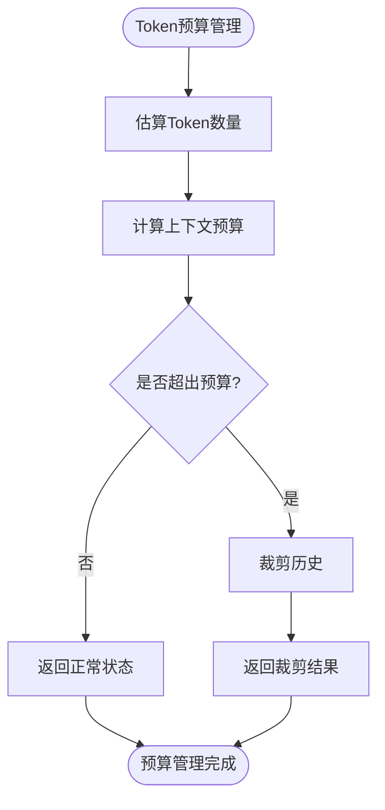
```mermaid
flowchart TD
TokenStart([Token预算管理]) --> EstimateTokens[估算Token数量]
EstimateTokens --> CalculateBudget[计算上下文预算]
CalculateBudget --> CheckBudget{是否超出预算?}
CheckBudget --> |否| ReturnOK[返回正常状态]
CheckBudget --> |是| TrimHistory[裁剪历史]
TrimHistory --> ReturnTrimmed[返回裁剪结果]
ReturnOK --> End([预算管理完成])
ReturnTrimmed --> End
```

**图表来源**
- [tokenBudget.js:1-200](file://NL2SQL/backend/src/utils/tokenBudget.js#L1-L200)

**章节来源**
- [tokenBudget.js:1-200](file://NL2SQL/backend/src/utils/tokenBudget.js#L1-L200)

### 8. LLM服务模块 (llmService.js)

LLM服务模块提供了与外部语言模型的统一接口，支持聊天、嵌入向量生成等功能，并具备完善的错误处理和重试机制。

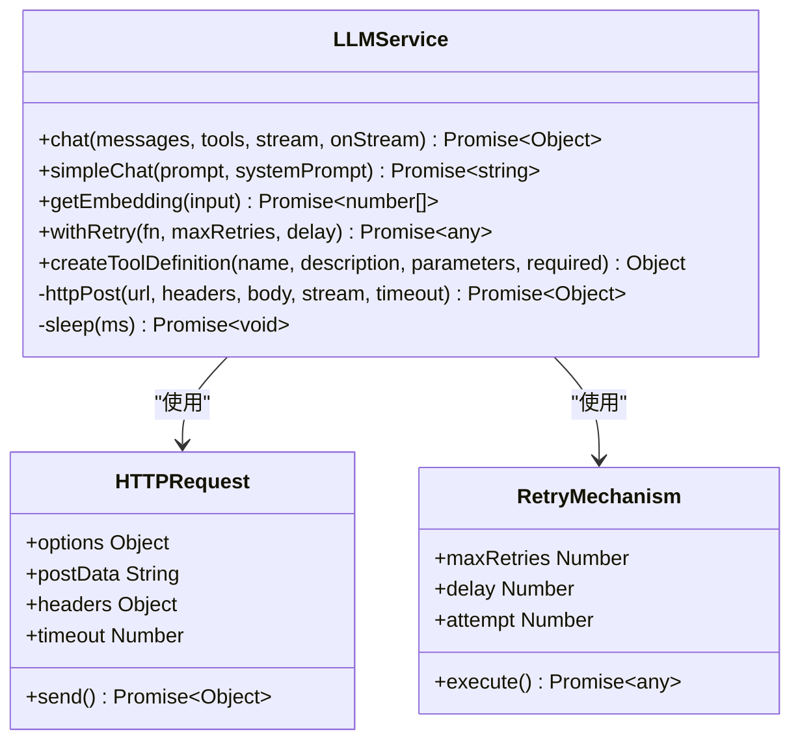
```mermaid
classDiagram
class LLMService {
+chat(messages, tools, stream, onStream) Promise~Object~
+simpleChat(prompt, systemPrompt) Promise~string~
+getEmbedding(input) Promise~number[]~
+withRetry(fn, maxRetries, delay) Promise~any~
+createToolDefinition(name, description, parameters, required) Object
-httpPost(url, headers, body, stream, timeout) Promise~Object~
-sleep(ms) Promise~void~
}
class HTTPRequest {
+options Object
+postData String
+headers Object
+timeout Number
+send() Promise~Object~
}
class RetryMechanism {
+maxRetries Number
+delay Number
+attempt Number
+execute() Promise~any~
}
LLMService --> HTTPRequest : "使用"
LLMService --> RetryMechanism : "使用"
```

**图表来源**
- [llmService.js:1-432](file://NL2SQL/backend/src/core/llmService.js#L1-L432)

**章节来源**
- [llmService.js:1-432](file://NL2SQL/backend/src/core/llmService.js#L1-L432)

### 9. 数据库管理系统 (database.js)

SQLite数据库管理系统负责会话历史、查询日志等数据的持久化存储，采用事务处理确保数据一致性。

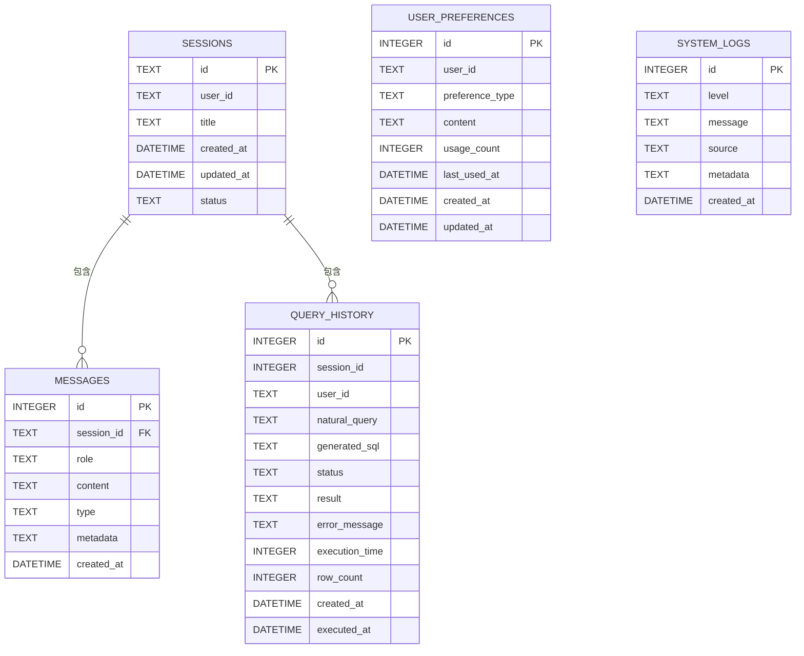
```mermaid
erDiagram
SESSIONS {
TEXT id PK
TEXT user_id
TEXT title
DATETIME created_at
DATETIME updated_at
TEXT status
}
MESSAGES {
INTEGER id PK
TEXT session_id FK
TEXT role
TEXT content
TEXT type
TEXT metadata
DATETIME created_at
}
QUERY_HISTORY {
INTEGER id PK
INTEGER session_id
TEXT user_id
TEXT natural_query
TEXT generated_sql
TEXT status
TEXT result
TEXT error_message
INTEGER execution_time
INTEGER row_count
DATETIME created_at
DATETIME executed_at
}
USER_PREFERENCES {
INTEGER id PK
TEXT user_id
TEXT preference_type
TEXT content
INTEGER usage_count
DATETIME last_used_at
DATETIME created_at
DATETIME updated_at
}
SYSTEM_LOGS {
INTEGER id PK
TEXT level
TEXT message
TEXT source
TEXT metadata
DATETIME created_at
}
SESSIONS ||--o{ MESSAGES : "包含"
SESSIONS ||--o{ QUERY_HISTORY : "包含"
```

**图表来源**
- [database.js:39-187](file://NL2SQL/backend/src/core/database.js#L39-L187)

**章节来源**
- [database.js:1-531](file://NL2SQL/backend/src/core/database.js#L1-L531)

### 10. 向量存储系统 (vectorStore.js)

**更新**：基于LanceDB的向量存储系统，支持Schema信息和查询历史的向量化存储，实现语义相似度搜索。**核心优化**：从字段级向量化转向表级向量化，每个表只生成一个向量，显著提升搜索精度和性能。

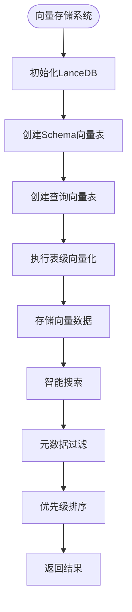
```mermaid
flowchart TD
VectorStart([向量存储系统]) --> InitLanceDB[初始化LanceDB]
InitLanceDB --> CreateSchemaTable[创建Schema向量表]
CreateSchemaTable --> CreateQueryTable[创建查询向量表]
CreateQueryTable --> VectorizeSchema[执行表级向量化]
VectorizeSchema --> StoreVectors[存储向量数据]
StoreVectors --> SmartSearch[智能搜索]
SmartSearch --> MetaFilter[元数据过滤]
MetaFilter --> PrioritySort[优先级排序]
PrioritySort --> ReturnResults[返回结果]
```

**图表来源**
- [vectorStore.js:231-759](file://NL2SQL/backend/src/memory/vectorStore.js#L231-L759)

**章节来源**
- [vectorStore.js:1-759](file://NL2SQL/backend/src/memory/vectorStore.js#L1-L759)

### 11. Schema管理器 (schemaLoader.js)

**更新**：Schema加载器负责管理数据表的元数据信息，提供Schema查询、匹配和验证功能。**核心优化**：实现了表级向量化，将每个表的核心业务含义浓缩为单一向量表示，包含域标签、数据类型和核心特征词等元数据。

**章节来源**
- [schemaLoader.js:1-1071](file://NL2SQL/backend/src/core/schemaLoader.js#L1-L1071)

### 12. WebSocket处理器 (wsHandler.js)

WebSocket处理器实现了实时双向通信，支持查询处理、历史获取、连接管理和心跳检测等功能。

**章节来源**
- [wsHandler.js:1-451](file://NL2SQL/backend/src/core/wsHandler.js#L1-L451)

### 13. 性能监控评估系统 (evaluation.js)

**新增**：全面的性能监控和评估系统，提供向量化质量评估、运行时统计和历史记忆命中率统计功能。

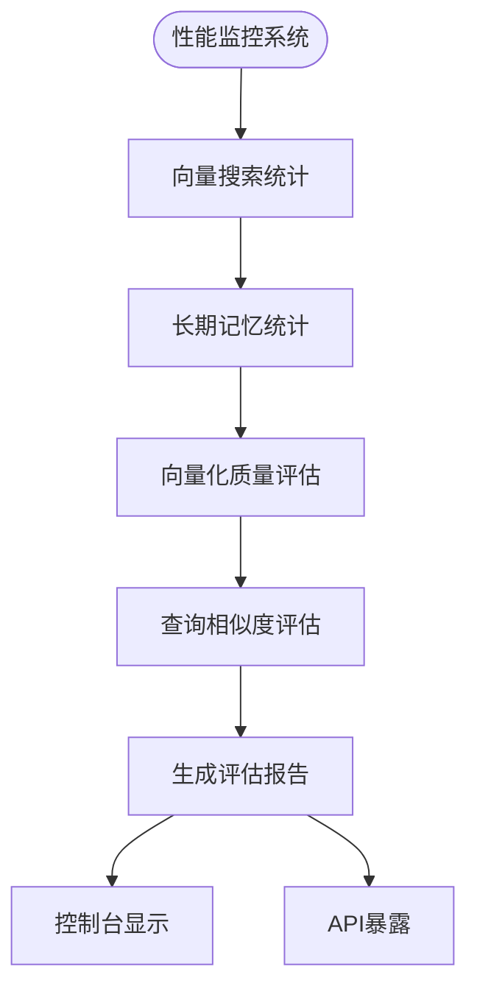
```mermaid
flowchart TD
EvalStart([性能监控系统]) --> VectorSearchStats[向量搜索统计]
VectorSearchStats --> MemoryStats[长期记忆统计]
MemoryStats --> QualityEval[向量化质量评估]
QualityEval --> SimilarityEval[查询相似度评估]
SimilarityEval --> ReportGen[生成评估报告]
ReportGen --> ConsoleDisplay[控制台显示]
ReportGen --> APIExpose[API暴露]
```

**图表来源**
- [evaluation.js:344-488](file://NL2SQL/backend/src/utils/evaluation.js#L344-L488)

**章节来源**
- [evaluation.js:1-488](file://NL2SQL/backend/src/utils/evaluation.js#L1-L488)

## 数据流分析

### 1. HTTP API数据流

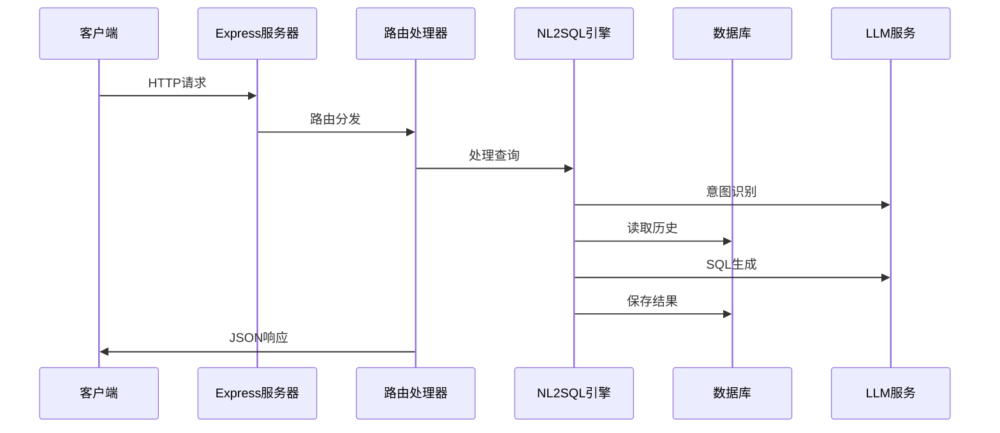
```mermaid
sequenceDiagram
participant Client as 客户端
participant Express as Express服务器
participant Routes as 路由处理器
participant Engine as NL2SQL引擎
participant DB as 数据库
participant LLM as LLM服务
Client->>Express : HTTP请求
Express->>Routes : 路由分发
Routes->>Engine : 处理查询
Engine->>LLM : 意图识别
Engine->>DB : 读取历史
Engine->>LLM : SQL生成
Engine->>DB : 保存结果
Routes->>Client : JSON响应
```

**图表来源**
- [routes.js:264-340](file://NL2SQL/backend/src/core/routes.js#L264-L340)
- [nl2sqlEngine.js:596-778](file://NL2SQL/backend/src/core/nl2sqlEngine.js#L596-L778)

### 2. WebSocket数据流

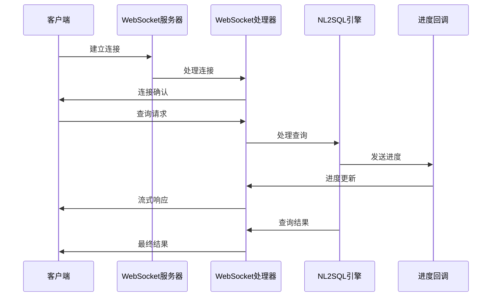
```mermaid
sequenceDiagram
participant Client as 客户端
participant WS as WebSocket服务器
participant Handler as WebSocket处理器
participant Engine as NL2SQL引擎
participant Progress as 进度回调
Client->>WS : 建立连接
WS->>Handler : 处理连接
Handler->>Client : 连接确认
Client->>Handler : 查询请求
Handler->>Engine : 处理查询
Engine->>Progress : 发送进度
Progress->>Handler : 进度更新
Handler->>Client : 流式响应
Engine->>Handler : 查询结果
Handler->>Client : 最终结果
```

**图表来源**
- [wsHandler.js:197-247](file://NL2SQL/backend/src/core/wsHandler.js#L197-L247)

### 3. 平台术语解析数据流

**新增**：展示平台术语解析的完整流程。

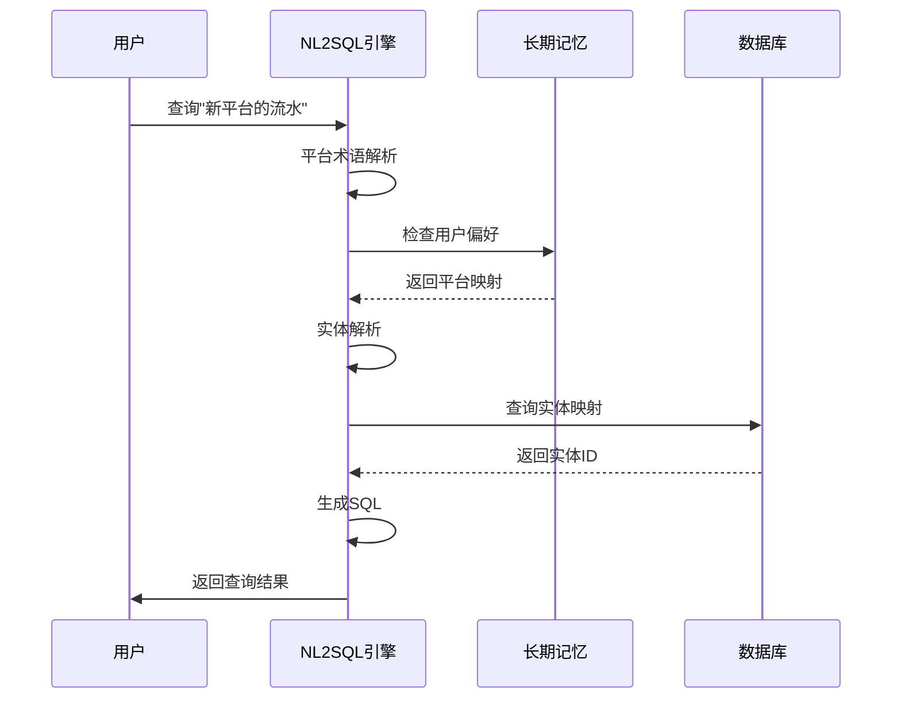
```mermaid
sequenceDiagram
participant User as 用户
participant Engine as NL2SQL引擎
participant LongTermMem as 长期记忆
participant DB as 数据库
User->>Engine : 查询"新平台的流水"
Engine->>Engine : 平台术语解析
Engine->>LongTermMem : 检查用户偏好
LongTermMem-->>Engine : 返回平台映射
Engine->>Engine : 实体解析
Engine->>DB : 查询实体映射
DB-->>Engine : 返回实体ID
Engine->>Engine : 生成SQL
Engine->>User : 返回查询结果
```

**图表来源**
- [nl2sqlEngine.js:302-383](file://NL2SQL/backend/src/core/nl2sqlEngine.js#L302-L383)

### 4. 澄清上下文处理数据流

**新增**：展示澄清上下文处理的完整流程。

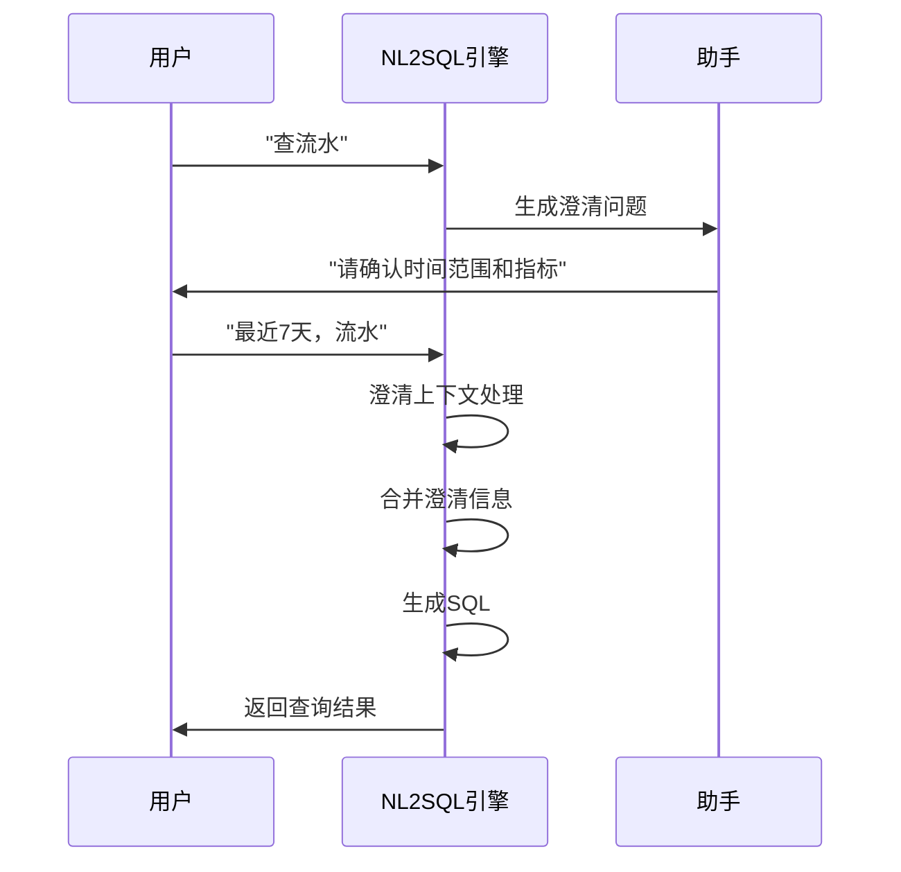
```mermaid
sequenceDiagram
participant User as 用户
participant Engine as NL2SQL引擎
participant Assistant as 助手
User->>Engine : "查流水"
Engine->>Assistant : 生成澄清问题
Assistant->>User : "请确认时间范围和指标"
User->>Engine : "最近7天，流水"
Engine->>Engine : 澄清上下文处理
Engine->>Engine : 合并澄清信息
Engine->>Engine : 生成SQL
Engine->>User : 返回查询结果
```

**图表来源**
- [nl2sqlEngine.js:443-482](file://NL2SQL/backend/src/core/nl2sqlEngine.js#L443-L482)

### 5. 表级向量化数据流

**新增**：展示表级向量化的完整流程。

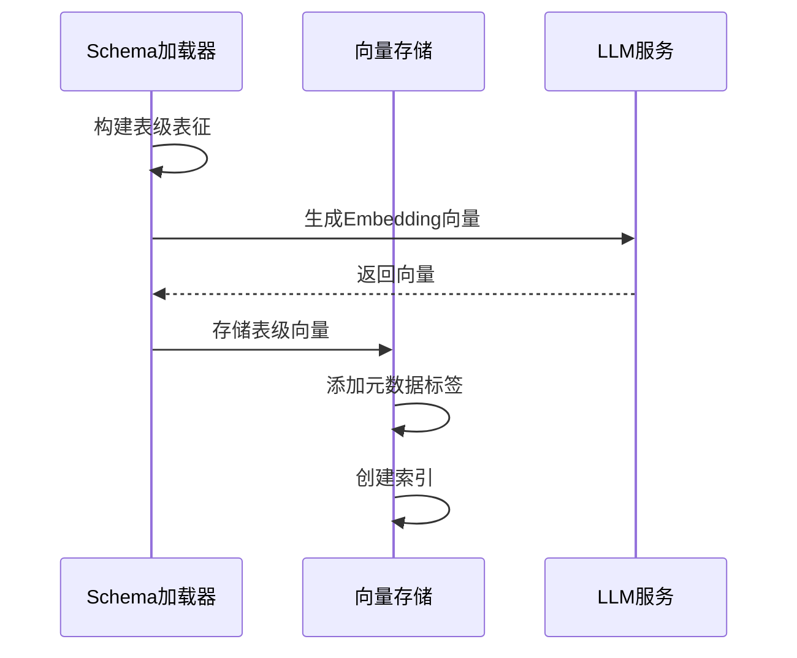
```mermaid
sequenceDiagram
participant SchemaLoader as Schema加载器
participant VectorStore as 向量存储
participant LLM as LLM服务
SchemaLoader->>SchemaLoader : 构建表级表征
SchemaLoader->>LLM : 生成Embedding向量
LLM-->>SchemaLoader : 返回向量
SchemaLoader->>VectorStore : 存储表级向量
VectorStore->>VectorStore : 添加元数据标签
VectorStore->>VectorStore : 创建索引
```

**图表来源**
- [schemaLoader.js:201-281](file://NL2SQL/backend/src/core/schemaLoader.js#L201-L281)
- [vectorStore.js:336-435](file://NL2SQL/backend/src/memory/vectorStore.js#L336-L435)

### 6. 智能搜索数据流

**新增**：展示searchSchemaSmart智能搜索的完整流程。

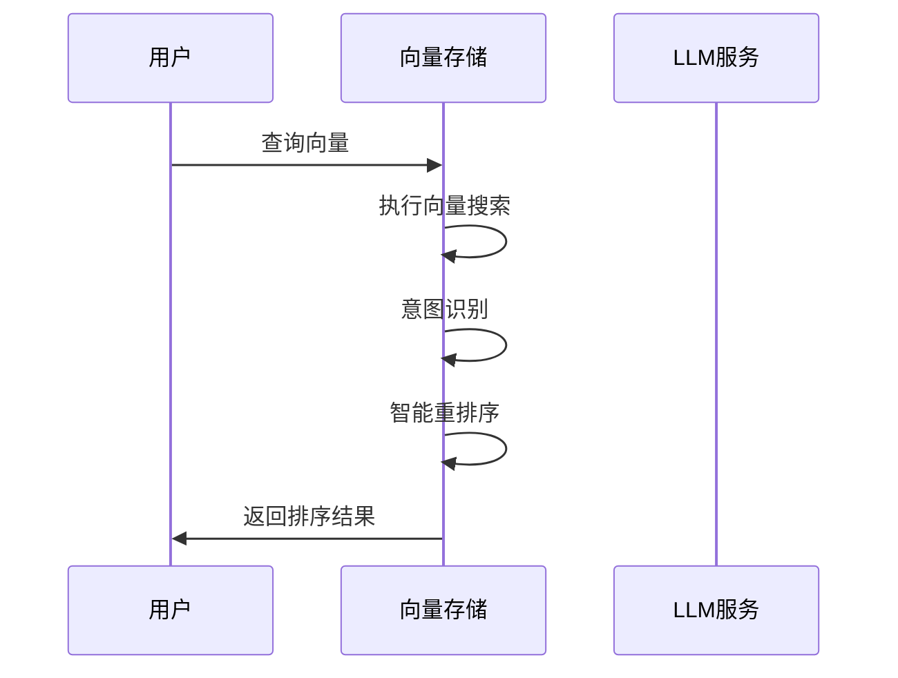
```mermaid
sequenceDiagram
participant User as 用户
participant VectorStore as 向量存储
participant LLM as LLM服务
User->>VectorStore : 查询向量
VectorStore->>VectorStore : 执行向量搜索
VectorStore->>VectorStore : 意图识别
VectorStore->>VectorStore : 智能重排序
VectorStore->>User : 返回排序结果
```

**图表来源**
- [vectorStore.js:450-536](file://NL2SQL/backend/src/memory/vectorStore.js#L450-L536)

## 配置管理

系统采用集中式配置管理，所有配置项都从环境变量读取并提供默认值。

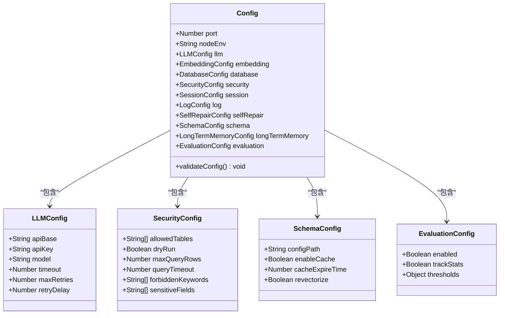
```mermaid
classDiagram
class Config {
+Number port
+String nodeEnv
+LLMConfig llm
+EmbeddingConfig embedding
+DatabaseConfig database
+SecurityConfig security
+SessionConfig session
+LogConfig log
+SelfRepairConfig selfRepair
+SchemaConfig schema
+LongTermMemoryConfig longTermMemory
+EvaluationConfig evaluation
+validateConfig() void
}
class LLMConfig {
+String apiBase
+String apiKey
+String model
+Number timeout
+Number maxRetries
+Number retryDelay
}
class SecurityConfig {
+String[] allowedTables
+Boolean dryRun
+Number maxQueryRows
+Number queryTimeout
+String[] forbiddenKeywords
+String[] sensitiveFields
}
class SchemaConfig {
+String configPath
+Boolean enableCache
+Number cacheExpireTime
+Boolean revectorize
}
class EvaluationConfig {
+Boolean enabled
+Boolean trackStats
+Object thresholds
}
Config --> LLMConfig : "包含"
Config --> SecurityConfig : "包含"
Config --> SchemaConfig : "包含"
Config --> EvaluationConfig : "包含"
```

**图表来源**
- [config.js:16-355](file://NL2SQL/backend/src/core/config.js#L16-L355)

**章节来源**
- [config.js:1-398](file://NL2SQL/backend/src/core/config.js#L1-L398)

## 错误处理与监控

### 1. 自修复机制

系统内置自修复机制，实现自动化监控和维护：

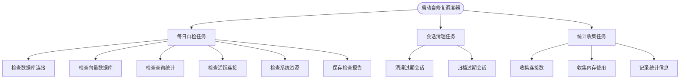
```mermaid
flowchart TD
Start([启动自修复调度器]) --> DailyCheck[每日自检任务]
Start --> SessionCleanup[会话清理任务]
Start --> StatsCollection[统计收集任务]
DailyCheck --> CheckDB[检查数据库连接]
DailyCheck --> CheckVectorDB[检查向量数据库]
DailyCheck --> CheckQueries[检查查询统计]
DailyCheck --> CheckConnections[检查活跃连接]
DailyCheck --> CheckSystem[检查系统资源]
DailyCheck --> SaveReport[保存检查报告]
SessionCleanup --> CleanupExpired[清理过期会话]
SessionCleanup --> ArchiveSessions[归档过期会话]
StatsCollection --> CollectConnections[收集连接数]
StatsCollection --> CollectMemory[收集内存使用]
StatsCollection --> LogStats[记录统计信息]
```

**图表来源**
- [selfRepair.js:55-107](file://NL2SQL/backend/src/core/selfRepair.js#L55-L107)

**章节来源**
- [selfRepair.js:1-414](file://NL2SQL/backend/src/core/selfRepair.js#L1-L414)

### 2. 性能监控评估

**新增**：全面的性能监控和评估系统，提供向量化质量评估、运行时统计和历史记忆命中率统计功能。

```mermaid
flowchart TD
EvalStart([性能监控]) --> RuntimeStats[运行时统计]
RuntimeStats --> VectorSearchStats[向量搜索统计]
RuntimeStats --> MemoryStats[长期记忆统计]
VectorSearchStats --> DistanceDist[距离分布统计]
DistanceDist --> HitRateCalc[命中率计算]
MemoryStats --> TypeBreakdown[类型分解]
TypeBreakdown --> OverallRate[总体命中率]
EvalStart --> QualityEval[质量评估]
QualityEval --> SchemaEval[Schema向量化评估]
QualityEval --> QueryEval[查询向量化评估]
SchemaEval --> TestQueries[测试查询]
TestQueries --> PrecisionRecall[F1分数计算]
QueryEval --> SimilarityPairs[相似度对]
SimilarityPairs --> CosineSimilarity[余弦相似度]
EvalStart --> ReportGen[报告生成]
ReportGen --> ConsoleDisplay[控制台显示]
ReportGen --> APIExpose[API暴露]
```

**图表来源**
- [evaluation.js:344-488](file://NL2SQL/backend/src/utils/evaluation.js#L344-L488)

**章节来源**
- [evaluation.js:1-488](file://NL2SQL/backend/src/utils/evaluation.js#L1-L488)

### 3. 日志系统

统一的日志记录系统支持多级别输出和文件轮转：

**章节来源**
- [logger.js:1-318](file://NL2SQL/backend/src/utils/logger.js#L1-L318)

## 性能优化策略

### 1. 缓存策略

- **Schema缓存**：Schema元数据缓存，支持过期时间控制
- **向量缓存**：向量数据库中的Schema向量缓存
- **会话缓存**：近期会话历史缓存
- **实体缓存**：常用实体映射缓存
- **摘要缓存**：对话摘要缓存，支持智能更新
- **偏好缓存**：用户偏好缓存，提升响应速度
- **评估缓存**：性能统计缓存，避免重复计算

### 2. 异步处理

- **批量向量化**：Embedding向量生成采用批次处理
- **流式响应**：WebSocket支持流式数据传输
- **并发控制**：连接级别的并发请求控制
- **异步实体解析**：数据库查询采用异步处理
- **异步摘要生成**：对话摘要采用异步生成
- **异步评估**：性能评估采用异步执行

### 3. 资源管理

- **连接池**：数据库连接池管理
- **内存监控**：定期内存使用检查
- **超时控制**：各类操作的超时设置
- **向量数据库优化**：LanceDB索引和查询优化
- **Token预算控制**：对话历史长度控制
- **评估开关控制**：性能监控的启用/禁用

### 4. 智能压缩

- **对话历史压缩**：长对话自动压缩为摘要
- **缓存管理**：智能缓存策略，避免重复计算
- **增量更新**：支持摘要的增量更新
- **轮数控制**：基于对话轮数的压缩触发
- **评估统计清理**：定期清理过期的统计信息

### 5. 架构优化

- **表级向量化**：从字段级向量化转向表级向量化，每个表只生成一个向量
- **智能搜索**：searchSchemaSmart方法支持查询意图识别和智能重排序
- **元数据过滤**：支持基于scope和data_type的元数据过滤
- **优先级排序**：基于业务规则的智能排序算法
- **性能监控**：全面的运行时统计和质量评估

## 部署与运维

### 1. 前端部署

前端使用Vite构建工具，支持开发和生产两种模式：

**章节来源**
- [package.json:1-31](file://NL2SQL/frontend/package.json#L1-L31)

### 2. 后端部署

后端采用Node.js环境，支持多种部署方式：

**章节来源**
- [package.json:1-29](file://NL2SQL/backend/package.json#L1-L29)

### 3. 环境配置

系统支持通过环境变量进行灵活配置，包括：

- LLM API配置
- 数据库连接配置  
- 安全策略配置
- 性能参数配置
- 向量数据库配置
- 长期记忆配置
- 摘要缓存配置
- 评估监控配置
- 表级向量化配置

### 4. 监控配置

**新增**：支持性能监控的环境变量配置：

- EVALUATION_ENABLED：启用/禁用评估功能
- EVALUATION_TRACK_STATS：启用/禁用运行时统计
- SCHEMA_REVECTORIZE：启用/禁用强制重新向量化

## 总结

NL2SQL系统采用模块化架构设计，具有以下特点：

### 技术优势

1. **架构清晰**：层次分明的模块化设计，职责分离明确
2. **扩展性强**：插件化设计支持功能扩展
3. **可靠性高**：完善的错误处理和自修复机制
4. **性能优秀**：多层缓存和异步处理优化
5. **智能增强**：新增实体解析、平台术语解析和澄清上下文处理能力
6. **语义理解**：基于向量数据库的语义匹配能力
7. **多轮对话**：支持复杂的多轮对话管理和上下文理解
8. **长期记忆**：智能学习用户偏好和业务术语映射
9. **性能监控**：全面的向量化质量评估和运行时统计
10. **架构优化**：从字段级向量化转向表级向量化，显著提升搜索精度

### 应用价值

1. **降低门槛**：非技术人员也能进行复杂数据分析
2. **提高效率**：自动化SQL生成减少人工编写
3. **增强体验**：自然语言交互提升用户体验
4. **保障安全**：多层安全防护保护数据安全
5. **智能推理**：支持模糊查询和上下文理解
6. **业务适配**：支持业务术语的智能映射和学习
7. **质量保证**：全面的性能监控确保系统稳定性

### 发展方向

1. **模型优化**：持续改进LLM模型效果
2. **功能扩展**：支持更多数据库类型和查询场景
3. **性能提升**：优化大规模数据处理能力
4. **生态建设**：构建完整的工具链和插件体系
5. **智能增强**：进一步提升上下文理解和实体解析能力
6. **多模态支持**：支持语音、图像等多种输入方式
7. **架构演进**：持续优化表级向量化策略和智能搜索算法

该系统为自然语言数据查询提供了一个完整、可靠、易用的解决方案，适合在企业级环境中部署和使用。通过表级向量化和智能搜索能力的引入，系统在保持高性能的同时，显著提升了查询精度和用户体验。