# 数据流分析

<cite>
**本文档引用的文件**
- [README.md](file://README.md)
- [llm.py](file://llm.py)
- [router.py](file://router.py)
- [memory.py](file://memory.py)
- [scheduler.py](file://scheduler.py)
- [tools.py](file://tools.py)
- [xiaowang.py](file://xiaowang.py)
- [mcp_client.py](file://mcp_client.py)
- [self_check_tool.py](file://self_check_tool.py)
- [config.example.json](file://config.example.json)
</cite>

## 目录
1. [简介](#简介)
2. [项目结构](#项目结构)
3. [核心组件](#核心组件)
4. [架构概览](#架构概览)
5. [详细组件分析](#详细组件分析)
6. [依赖关系分析](#依赖关系分析)
7. [性能考虑](#性能考虑)
8. [故障排除指南](#故障排除指南)
9. [结论](#结论)

## 简介

724 Office是一个生产级的AI智能体系统，采用纯Python实现（约3500行代码），无任何框架依赖。该系统实现了完整的自进化AI代理功能，包括多租户路由、工具使用循环、三层记忆系统、MCP/插件系统、运行时工具创建、自我修复、定时调度等核心功能。

该系统的核心目标是通过清晰的数据流设计，实现从消息平台回调到最终用户响应的完整自动化流程，同时提供强大的扩展性和自维护能力。

## 项目结构

系统采用模块化设计，每个核心功能都封装在独立的模块中：

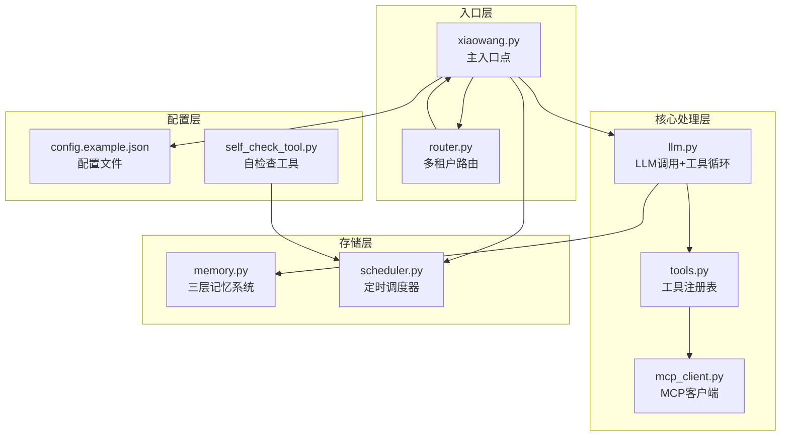

**图表来源**
- [xiaowang.py:1-626](file://xiaowang.py#L1-L626)
- [router.py:1-493](file://router.py#L1-L493)
- [llm.py:1-401](file://llm.py#L1-L401)
- [memory.py:1-361](file://memory.py#L1-L361)
- [scheduler.py:1-219](file://scheduler.py#L1-L219)
- [tools.py:1-1153](file://tools.py#L1-L1153)
- [mcp_client.py:1-334](file://mcp_client.py#L1-L334)
- [config.example.json:1-61](file://config.example.json#L1-L61)

**章节来源**
- [README.md:1-162](file://README.md#L1-L162)
- [config.example.json:1-61](file://config.example.json#L1-L61)

## 核心组件

### 主要数据流组件

1. **消息输入流** - 处理来自消息平台的回调，包含去抖动、多媒体处理、ASR语音转文字等功能
2. **工具使用流** - 实现LLM工具定义、执行和结果返回的完整循环
3. **记忆处理流** - 三层记忆系统：会话压缩、向量存储、相似度检索
4. **任务执行流** - 定时触发、LLM处理、工具调用、通知用户

### 数据存储位置

- **会话存储**：`./sessions/`目录下的JSON文件，每用户一个会话文件
- **文件存储**：`./workspace/files/`目录，按年月组织文件
- **记忆数据库**：`./memory_db/`目录下的LanceDB向量数据库
- **作业存储**：`./jobs.json`文件，持久化定时任务配置

**章节来源**
- [xiaowang.py:45-47](file://xiaowang.py#L45-L47)
- [llm.py:89-91](file://llm.py#L89-L91)
- [memory.py:70-81](file://memory.py#L70-L81)
- [scheduler.py:26](file://scheduler.py#L26)

## 架构概览

系统采用分层架构设计，确保各组件职责清晰、耦合度低：

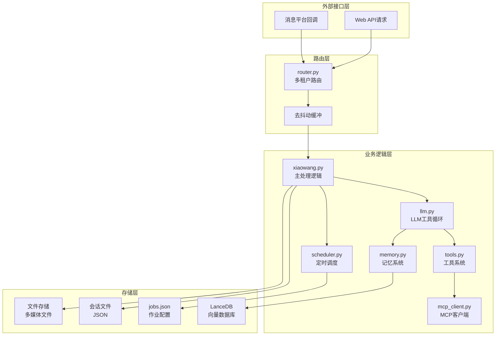

**图表来源**
- [router.py:308-425](file://router.py#L308-L425)
- [xiaowang.py:490-588](file://xiaowang.py#L490-L588)
- [llm.py:317-401](file://llm.py#L317-L401)
- [memory.py:40-86](file://memory.py#L40-L86)
- [scheduler.py:30-43](file://scheduler.py#L30-L43)

## 详细组件分析

### 消息输入流分析

消息输入流是整个系统的核心入口，负责处理来自消息平台的各种类型消息：

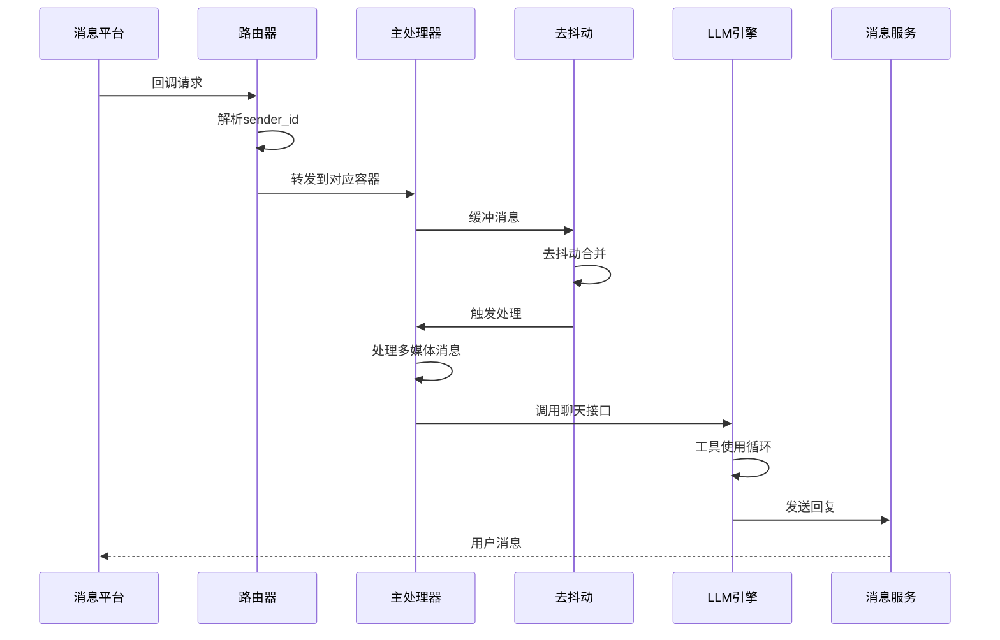

**图表来源**
- [router.py:358-418](file://router.py#L358-L418)
- [xiaowang.py:365-378](file://xiaowang.py#L365-L378)
- [xiaowang.py:489-588](file://xiaowang.py#L489-L588)
- [llm.py:317-401](file://llm.py#L317-L401)

#### 去抖动机制

去抖动系统通过线程安全的缓冲区管理多个消息片段：

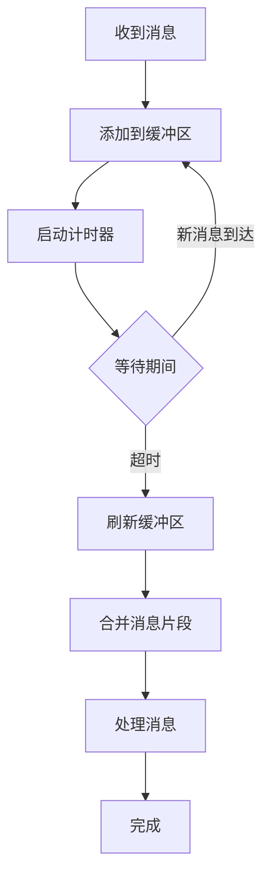

**图表来源**
- [xiaowang.py:316-378](file://xiaowang.py#L316-L378)

#### 多媒体处理流程

系统支持多种媒体类型的处理，包括图片、视频、文件和语音：

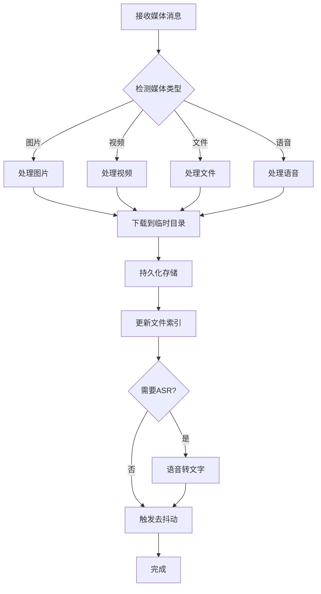

**图表来源**
- [xiaowang.py:383-487](file://xiaowang.py#L383-L487)
- [xiaowang.py:99-131](file://xiaowang.py#L99-L131)

**章节来源**
- [xiaowang.py:316-378](file://xiaowang.py#L316-L378)
- [xiaowang.py:383-487](file://xiaowang.py#L383-L487)
- [xiaowang.py:99-131](file://xiaowang.py#L99-L131)

### 工具使用流分析

工具使用流是LLM与外部系统交互的核心机制：

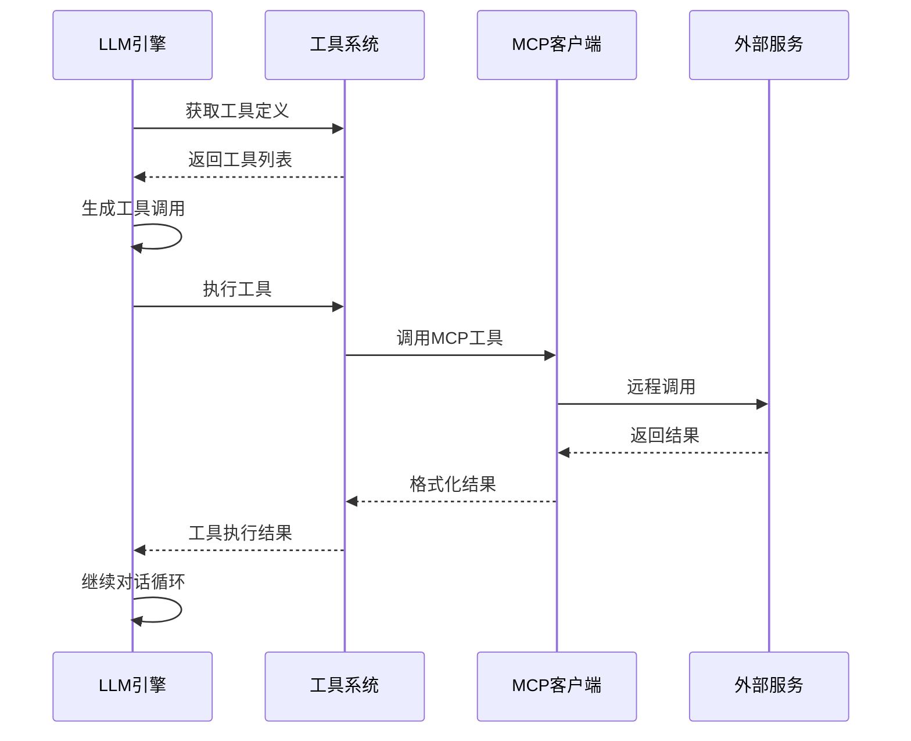

**图表来源**
- [llm.py:356-395](file://llm.py#L356-L395)
- [tools.py:63-74](file://tools.py#L63-L74)
- [mcp_client.py:296-310](file://mcp_client.py#L296-L310)

#### 工具注册与执行机制

工具系统采用装饰器模式实现动态注册：

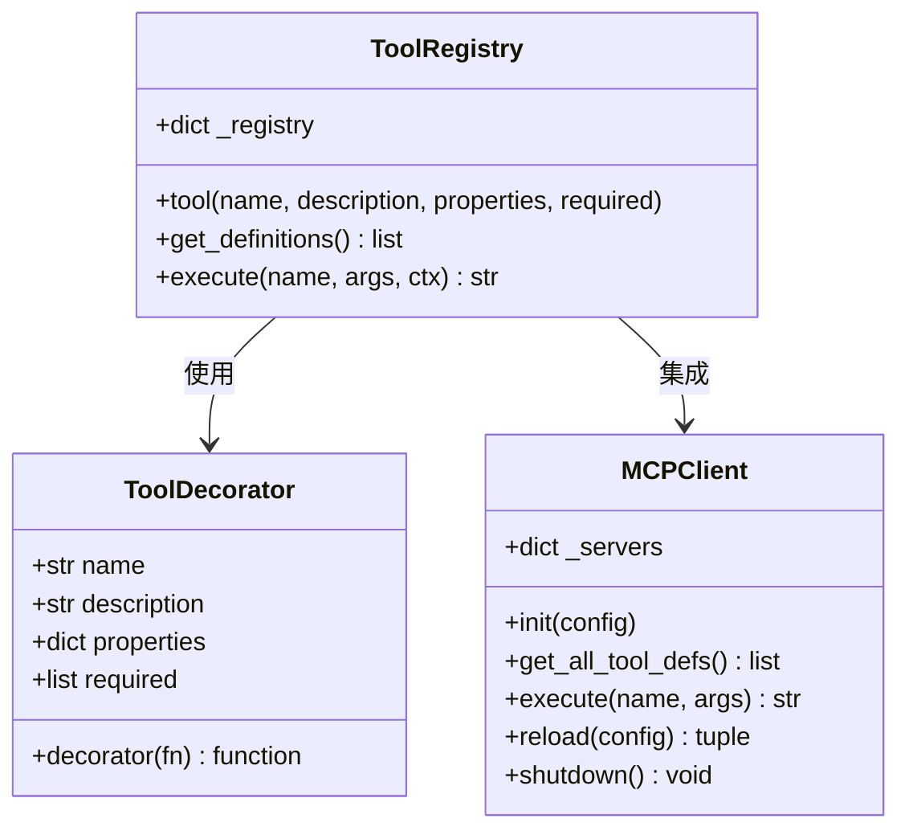

**图表来源**
- [tools.py:36-74](file://tools.py#L36-L74)
- [mcp_client.py:272-334](file://mcp_client.py#L272-L334)

**章节来源**
- [llm.py:356-395](file://llm.py#L356-L395)
- [tools.py:36-74](file://tools.py#L36-L74)
- [mcp_client.py:272-334](file://mcp_client.py#L272-L334)

### 记忆处理流分析

记忆系统采用三层架构设计，实现从短期到长期的完整记忆管理：

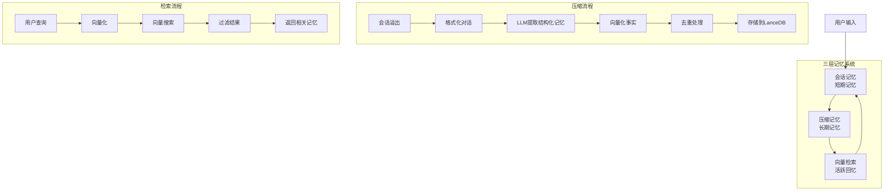

**图表来源**
- [memory.py:121-146](file://memory.py#L121-L146)
- [memory.py:294-361](file://memory.py#L294-L361)
- [memory.py:88-119](file://memory.py#L88-L119)

#### 记忆生命周期管理

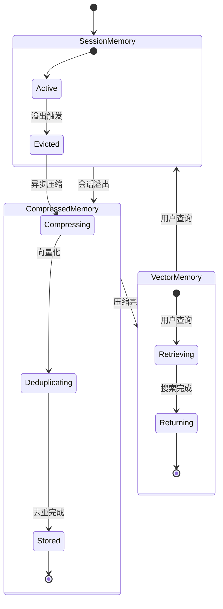

**图表来源**
- [llm.py:94-160](file://llm.py#L94-L160)
- [memory.py:121-146](file://memory.py#L121-L146)
- [memory.py:294-361](file://memory.py#L294-L361)

**章节来源**
- [memory.py:121-146](file://memory.py#L121-L146)
- [memory.py:294-361](file://memory.py#L294-L361)
- [llm.py:94-160](file://llm.py#L94-L160)

### 任务执行流分析

任务执行流实现了从时间触发到用户通知的完整自动化流程：

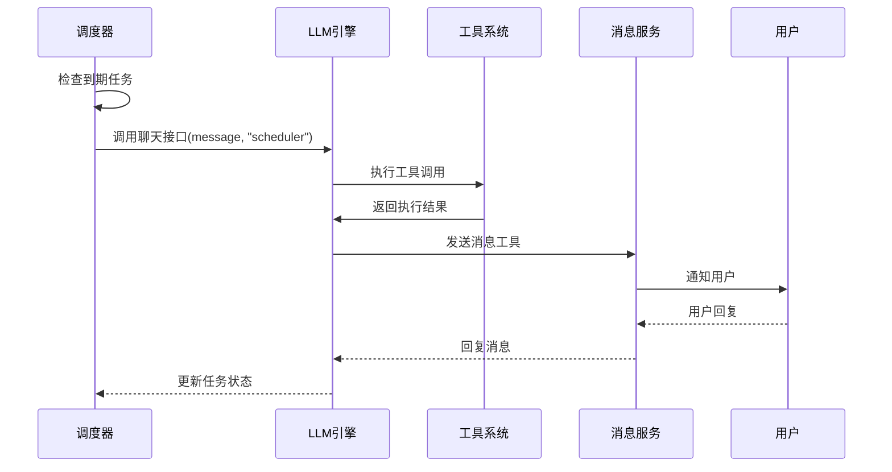

**图表来源**
- [scheduler.py:130-186](file://scheduler.py#L130-L186)
- [llm.py:317-401](file://llm.py#L317-L401)
- [tools.py:138-146](file://tools.py#L138-L146)

#### 自我修复机制

系统实现了完整的自我修复循环：

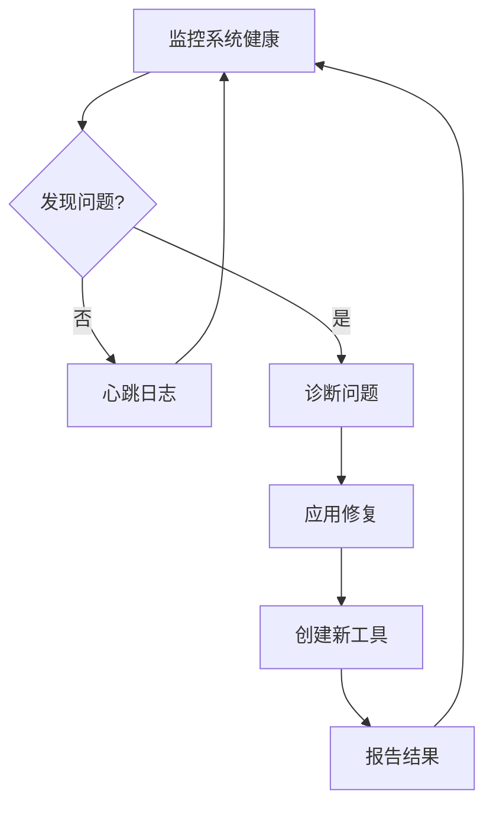

**图表来源**
- [self_check_tool.py:44-57](file://self_check_tool.py#L44-L57)
- [scheduler.py:171-186](file://scheduler.py#L171-L186)

**章节来源**
- [scheduler.py:130-186](file://scheduler.py#L130-L186)
- [self_check_tool.py:44-57](file://self_check_tool.py#L44-L57)

## 依赖关系分析

系统采用松耦合的设计，通过明确的接口边界实现模块间通信：

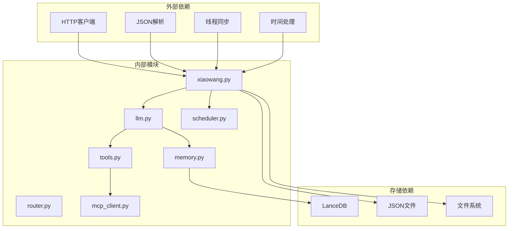

**图表来源**
- [llm.py:17-20](file://llm.py#L17-L20)
- [router.py:9-21](file://router.py#L9-L21)
- [memory.py:58-86](file://memory.py#L58-L86)

### 关键依赖关系

1. **LLM依赖**：依赖tools模块获取工具定义，依赖memory模块进行记忆检索
2. **工具系统**：依赖mcp_client模块调用外部MCP服务器工具
3. **记忆系统**：依赖LanceDB进行向量存储和检索
4. **调度系统**：依赖llm模块进行消息处理

**章节来源**
- [llm.py:105-150](file://llm.py#L105-L150)
- [tools.py:81-83](file://tools.py#L81-L83)
- [memory.py:58-86](file://memory.py#L58-L86)

## 性能考虑

### 缓存策略

系统实现了多层次的缓存机制：

1. **零延迟缓存**：硬件/语音通道的记忆摘要预计算缓存
2. **会话缓存**：线程锁保护的会话状态缓存
3. **向量缓存**：内存中的向量搜索结果缓存

### 存储优化

1. **异步压缩**：会话溢出时异步压缩到长期记忆，避免阻塞主线程
2. **批量存储**：向量数据库支持批量插入操作
3. **文件索引**：维护文件访问索引，避免全盘扫描

### 并发控制

1. **线程安全**：使用锁机制保护共享资源
2. **异步处理**：大量I/O操作采用异步方式
3. **连接池**：MCP服务器连接支持自动重连

## 故障排除指南

### 常见问题诊断

1. **消息丢失**：检查去抖动配置和网络连接
2. **工具调用失败**：验证MCP服务器连接和权限设置
3. **记忆检索异常**：确认向量数据库初始化和嵌入API配置
4. **定时任务失效**：检查crontab配置和日志输出

### 错误处理机制

系统实现了完善的错误处理和恢复机制：

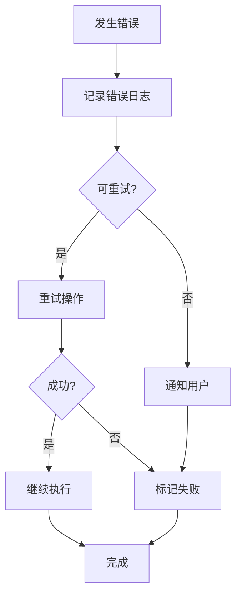

**图表来源**
- [llm.py:365-373](file://llm.py#L365-L373)
- [tools.py:69-74](file://tools.py#L69-L74)

**章节来源**
- [llm.py:365-373](file://llm.py#L365-L373)
- [tools.py:69-74](file://tools.py#L69-L74)

## 结论

724 Office系统通过精心设计的数据流架构，实现了从消息平台回调到最终用户响应的完整自动化流程。系统的核心优势包括：

1. **清晰的数据流设计**：每个组件都有明确的职责和数据流向
2. **强大的扩展性**：MCP系统和插件机制支持无限扩展
3. **完善的自维护能力**：自我修复和诊断机制确保系统稳定运行
4. **高效的性能表现**：多层缓存和异步处理保证系统响应速度

该系统为构建生产级AI代理提供了优秀的参考架构，其模块化设计和清晰的数据流管理值得其他类似项目借鉴。