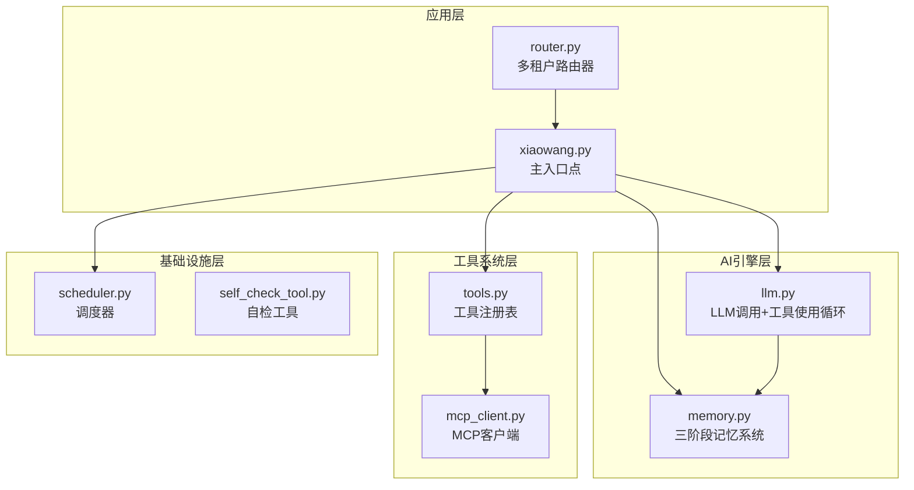
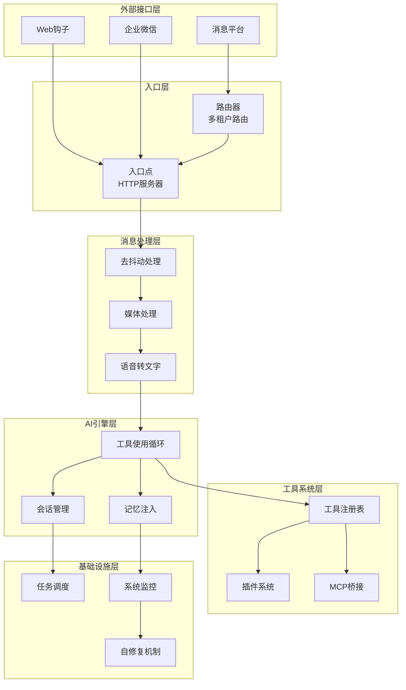
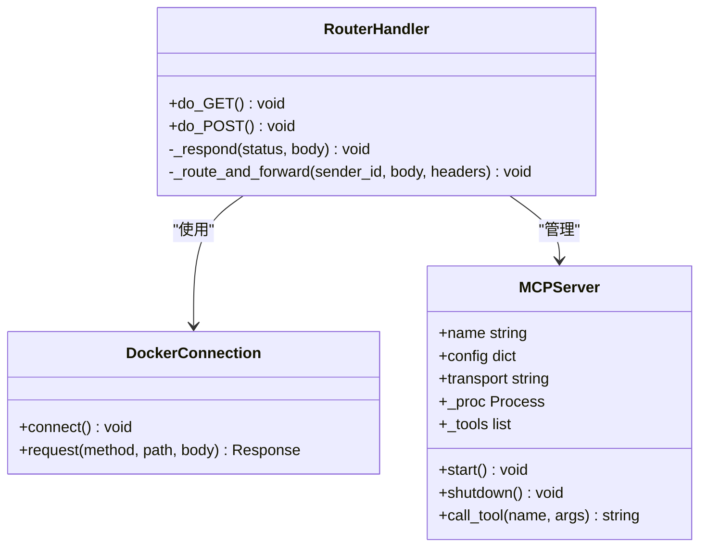
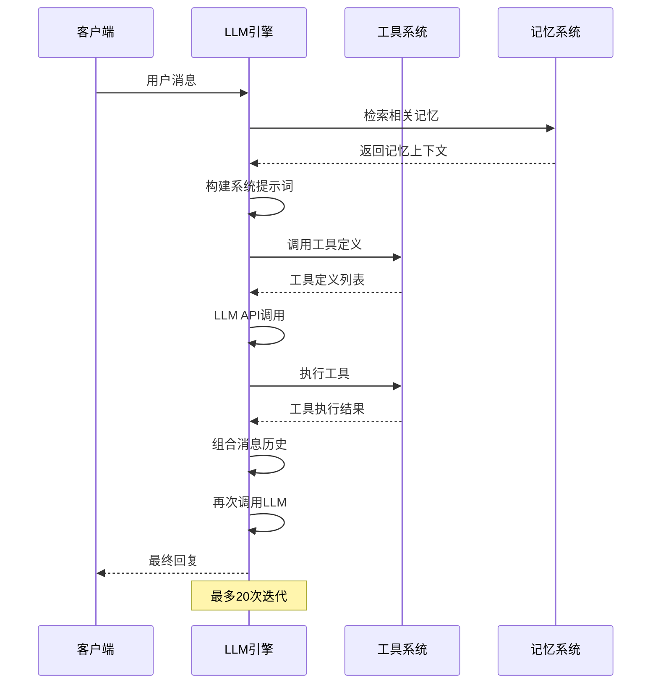
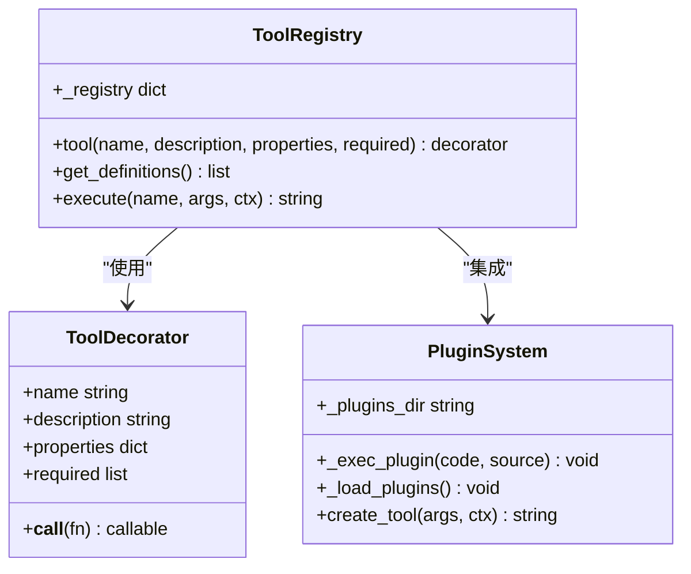
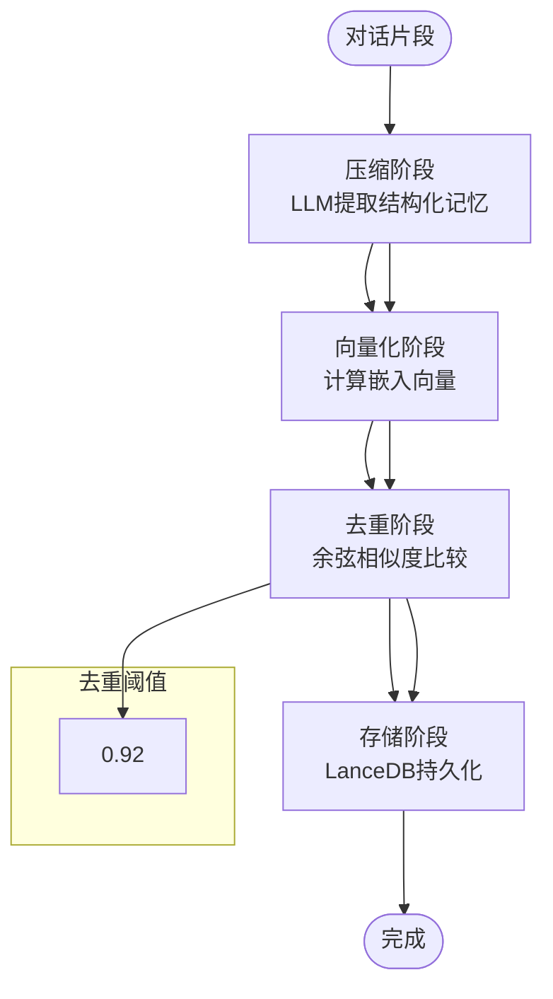
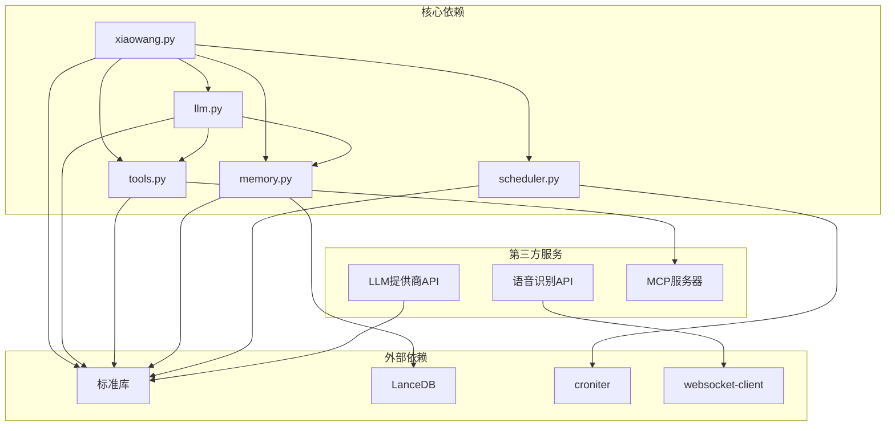

# 整体架构概览

<cite>
**本文档引用的文件**
- [README.md](file://README.md)
- [xiaowang.py](file://xiaowang.py)
- [router.py](file://router.py)
- [llm.py](file://llm.py)
- [tools.py](file://tools.py)
- [memory.py](file://memory.py)
- [scheduler.py](file://scheduler.py)
- [mcp_client.py](file://mcp_client.py)
- [self_check_tool.py](file://self_check_tool.py)
</cite>

## 目录
1. [引言](#引言)
2. [项目结构](#项目结构)
3. [核心组件](#核心组件)
4. [架构总览](#架构总览)
5. [详细组件分析](#详细组件分析)
6. [依赖关系分析](#依赖关系分析)
7. [性能考虑](#性能考虑)
8. [故障排除指南](#故障排除指南)
9. [结论](#结论)

## 引言

724 Office是一个生产级的AI智能体系统，采用纯Python实现（约3500行代码），实现了零框架依赖的设计理念。该系统通过分层架构模式构建，包含五大核心层次：入口层、消息处理层、AI引擎层、工具系统层和基础设施层。系统支持多租户架构、事件驱动机制、自修复能力，并提供了完整的AI代理功能生态系统。

该系统的核心设计理念包括：
- **零框架依赖**：每个代码行都可直接查看和调试，避免魔法代码
- **单文件工具**：添加新功能只需在tools.py中添加一个带@tool装饰器的函数
- **边缘部署友好**：专为Jetson Orin Nano等资源受限设备设计
- **自我进化**：代理能够创建新工具、诊断自身问题并通知所有者
- **离线可用**：核心功能可在无云API情况下运行

## 项目结构

系统采用模块化设计，每个核心功能被组织在独立的模块中：

**图表来源**
- [xiaowang.py:1-626](file://xiaowang.py#L1-L626)
- [router.py:1-493](file://router.py#L1-L493)
- [llm.py:1-401](file://llm.py#L1-L401)
- [tools.py:1-1153](file://tools.py#L1-L1153)
- [memory.py:1-361](file://memory.py#L1-L361)
- [scheduler.py:1-219](file://scheduler.py#L1-L219)
- [mcp_client.py:1-334](file://mcp_client.py#L1-L334)

**章节来源**
- [README.md:1-162](file://README.md#L1-L162)
- [xiaowang.py:1-626](file://xiaowang.py#L1-L626)

## 核心组件

### 入口层（HTTP服务器）
- **主要职责**：接收消息平台回调、启动HTTP服务器、处理多媒体消息
- **关键特性**：支持文本、图片、视频、语音、文件等多种消息类型
- **安全机制**：具备单用户模式保护，防止未授权访问

### 消息处理层
- **主要职责**：消息去抖动、媒体文件下载与持久化、ASR语音转文字
- **关键特性**：支持消息合并、文件索引管理、语音识别集成

### AI引擎层
- **主要职责**：LLM API调用、工具使用循环、会话管理、多模态处理
- **关键特性**：支持最多20次迭代的工具使用循环、会话持久化、多模态输入

### 工具系统层
- **主要职责**：工具注册表、插件系统、MCP协议桥接、自扩展能力
- **关键特性**：26个内置工具、热重载支持、运行时工具创建

### 基础设施层
- **主要职责**：任务调度、系统监控、自修复机制、内存管理
- **关键特性**：Cron调度、心跳检测、错误日志分析、磁盘空间监控

**章节来源**
- [xiaowang.py:1-626](file://xiaowang.py#L1-L626)
- [llm.py:1-401](file://llm.py#L1-L401)
- [tools.py:1-1153](file://tools.py#L1-L1153)
- [memory.py:1-361](file://memory.py#L1-L361)
- [scheduler.py:1-219](file://scheduler.py#L1-L219)

## 架构总览

系统采用分层架构模式，通过清晰的职责分离实现松耦合设计：

**图表来源**
- [router.py:1-493](file://router.py#L1-L493)
- [xiaowang.py:1-626](file://xiaowang.py#L1-L626)
- [llm.py:1-401](file://llm.py#L1-L401)
- [tools.py:1-1153](file://tools.py#L1-L1153)
- [memory.py:1-361](file://memory.py#L1-L361)
- [scheduler.py:1-219](file://scheduler.py#L1-L219)

## 详细组件分析

### 多租户路由器组件

路由器实现了Docker容器化的多租户架构，为每个用户自动创建独立的容器实例：

**图表来源**
- [router.py:310-425](file://router.py#L310-L425)
- [router.py:87-116](file://router.py#L87-L116)
- [mcp_client.py:27-91](file://mcp_client.py#L27-L91)

路由器的关键特性：
- **自动容器创建**：未知用户触发时自动创建Docker容器
- **健康检查**：容器启动后进行健康状态检查
- **路由管理**：维护sender_id到容器URL的映射表
- **负载均衡**：支持最大容器数量限制

**章节来源**
- [router.py:1-493](file://router.py#L1-L493)

### LLM工具使用循环组件

LLM引擎实现了核心的工具使用循环，支持最多20次迭代：

**图表来源**
- [llm.py:317-401](file://llm.py#L317-L401)
- [llm.py:356-396](file://llm.py#L356-L396)

**章节来源**
- [llm.py:1-401](file://llm.py#L1-L401)

### 工具注册表组件

工具系统采用了装饰器模式实现动态注册：

**图表来源**
- [tools.py:36-74](file://tools.py#L36-L74)
- [tools.py:518-545](file://tools.py#L518-L545)

**章节来源**
- [tools.py:1-1153](file://tools.py#L1-L1153)

### 记忆系统组件

记忆系统实现了三阶段处理管道：

**图表来源**
- [memory.py:121-146](file://memory.py#L121-L146)
- [memory.py:294-361](file://memory.py#L294-L361)

**章节来源**
- [memory.py:1-361](file://memory.py#L1-L361)

## 依赖关系分析

系统采用松耦合设计，通过清晰的接口边界实现模块间通信：

**图表来源**
- [README.md:3](file://README.md#L3)
- [README.md:115](file://README.md#L115)

**章节来源**
- [README.md:1-162](file://README.md#L1-L162)

## 性能考虑

### 内存优化策略
- **会话截断**：每会话保留最多40条消息，超出部分异步压缩
- **图像处理优化**：历史消息中仅保存文本标记而非原始图像
- **缓存机制**：硬件/语音通道使用零延迟缓存

### 并发处理
- **线程安全**：每个会话使用独立锁，确保并发安全性
- **异步操作**：记忆压缩、文件下载等操作使用后台线程
- **连接池**：MCP服务器连接复用，减少启动开销

### 网络优化
- **请求合并**：短时间内到达的消息进行去抖动合并
- **流式传输**：ASR使用WebSocket实时传输音频数据
- **超时控制**：所有网络请求设置合理超时时间

## 故障排除指南

### 常见问题诊断

**LLM API错误**
- 检查API密钥配置
- 验证模型提供商连接性
- 查看HTTP 400/422错误响应体

**工具执行失败**
- 使用`diagnose`工具检查会话文件完整性
- 验证MCP服务器连接状态
- 检查最近错误日志

**内存系统异常**
- 确认LanceDB数据库文件权限
- 检查嵌入API配置
- 验证相似度阈值设置

**章节来源**
- [llm.py:74-83](file://llm.py#L74-L83)
- [tools.py:929-1019](file://tools.py#L929-L1019)
- [memory.py:84-86](file://memory.py#L84-L86)

## 结论

724 Office系统展现了优秀的软件架构设计，通过分层架构模式实现了高度模块化的系统设计。系统的核心优势包括：

1. **设计理念先进**：零框架依赖、单文件工具、边缘部署友好
2. **架构设计优雅**：分层架构、事件驱动、松耦合设计
3. **功能完整丰富**：多租户支持、自修复能力、自我进化
4. **性能优化到位**：内存管理、并发处理、网络优化

该系统为AI代理开发提供了一个完整的参考实现，展示了如何在保持代码简洁性的同时实现复杂的功能需求。其模块化设计使得系统易于扩展和维护，为未来的功能增强奠定了良好的基础。