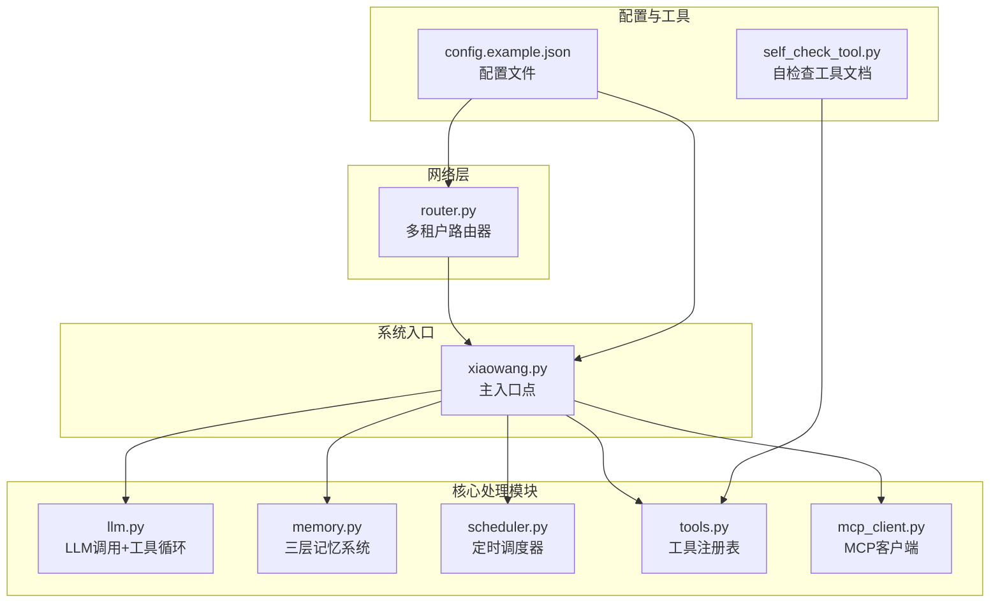
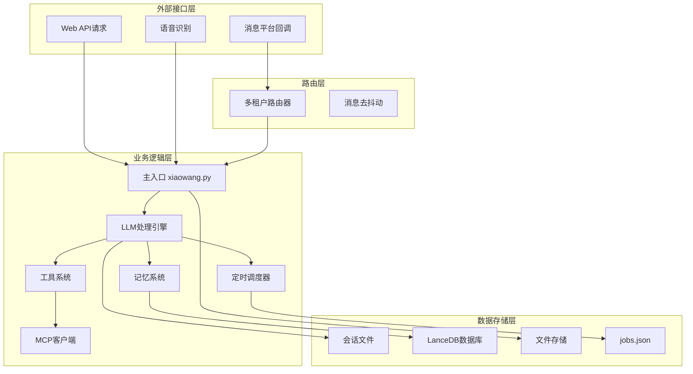
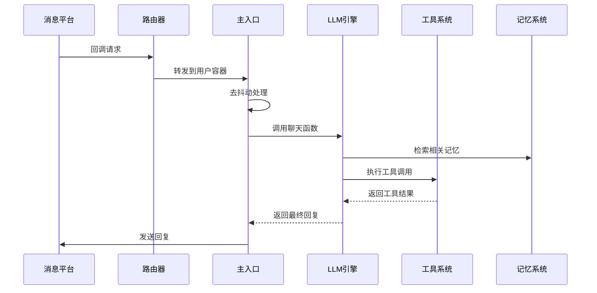
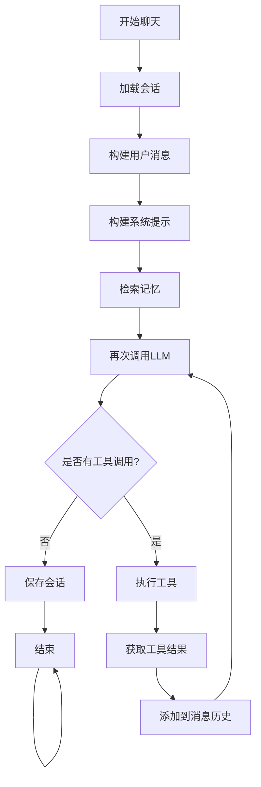
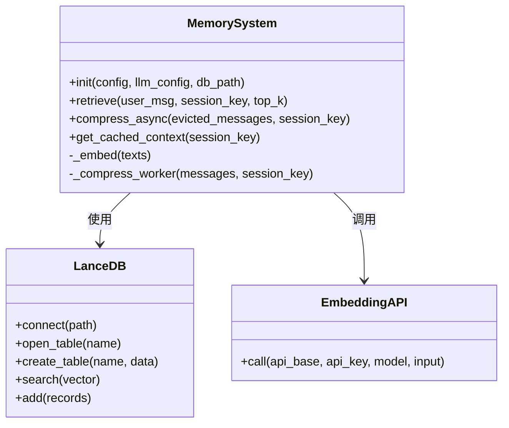
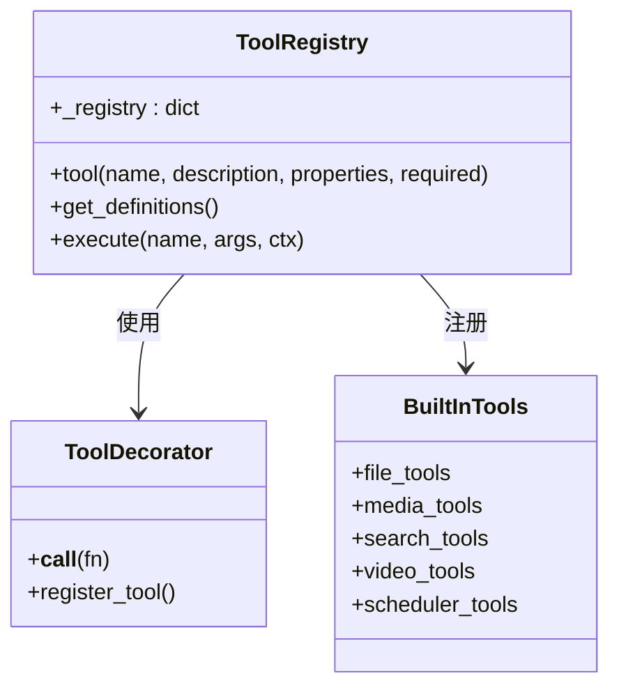
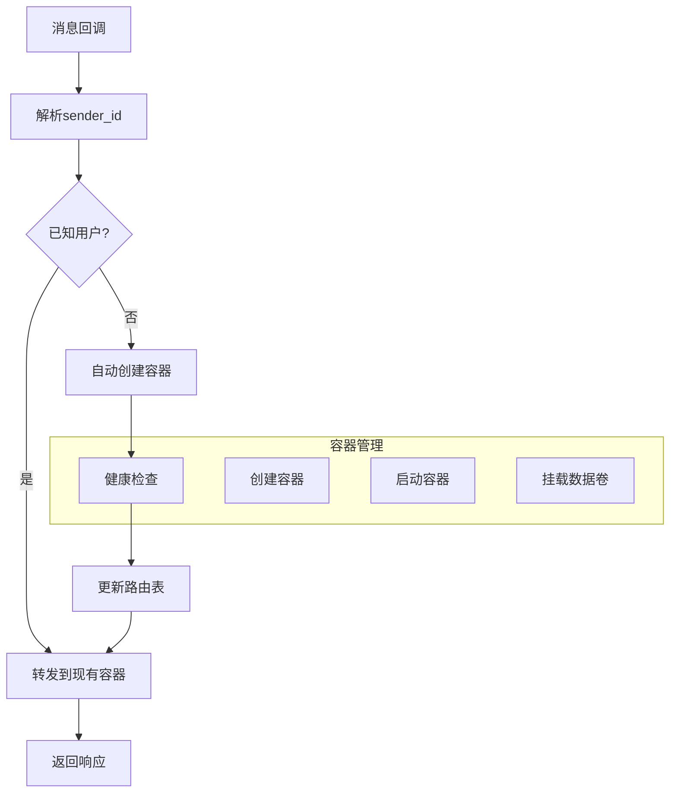
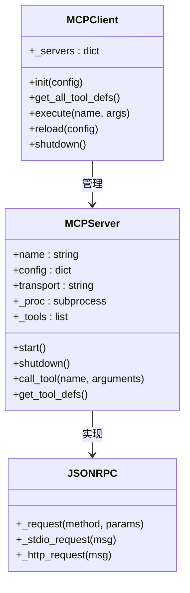
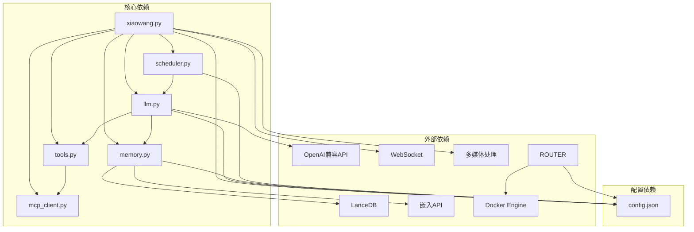

# 架构设计

<cite>
**本文档引用的文件**
- [README.md](file://README.md)
- [llm.py](file://llm.py)
- [router.py](file://router.py)
- [memory.py](file://memory.py)
- [scheduler.py](file://scheduler.py)
- [tools.py](file://tools.py)
- [xiaowang.py](file://xiaowang.py)
- [self_check_tool.py](file://self_check_tool.py)
- [mcp_client.py](file://mcp_client.py)
- [config.example.json](file://config.example.json)
</cite>

## 目录
1. [引言](#引言)
2. [项目结构](#项目结构)
3. [核心组件](#核心组件)
4. [架构概览](#架构概览)
5. [详细组件分析](#详细组件分析)
6. [依赖关系分析](#依赖关系分析)
7. [性能考虑](#性能考虑)
8. [故障排除指南](#故障排除指南)
9. [结论](#结论)

## 引言

724 Office是一个基于纯Python实现的生产级AI智能体系统，采用零框架依赖的设计理念。该系统在约3500行纯Python代码中实现了完整的AI代理功能，包括工具使用循环、三层记忆系统、MCP/插件系统、运行时工具创建、自修复机制、定时调度、多租户路由器、多模态处理等核心功能。

该系统的核心设计理念是"可见性和可调试性"，每个代码行都是透明的，没有魔法般的抽象层。系统支持24/7运行，具备自进化能力，能够创建新工具、诊断自身问题并向所有者报告。

## 项目结构

系统采用模块化设计，每个核心功能都封装在独立的模块中：



**图表来源**
- [xiaowang.py:1-626](file://xiaowang.py#L1-L626)
- [llm.py:1-401](file://llm.py#L1-L401)
- [router.py:1-493](file://router.py#L1-L493)

**章节来源**
- [README.md:1-162](file://README.md#L1-L162)
- [config.example.json:1-61](file://config.example.json#L1-L61)

## 核心组件

### LLM处理引擎
LLM处理引擎是系统的核心，负责：
- LLM API调用和响应处理
- 工具使用循环的执行
- 会话管理（最多40条消息）
- 多模态消息构建（文本+图像）
- 系统提示词构建和注入

### 记忆系统
三层记忆架构提供了完整的长期记忆解决方案：
- **会话记忆**：短期记忆，保存最近40条消息
- **压缩记忆**：通过LLM提取结构化事实
- **检索记忆**：基于向量搜索的主动回忆

### 工具系统
系统内置26个工具，涵盖文件操作、媒体发送、视频处理、搜索、调度等多个领域。所有工具都通过装饰器注册，支持运行时动态加载。

### 定时调度器
提供一次性任务和周期性任务的调度功能，支持CST时区和持久化存储。

### 多租户路由器
基于Docker的自动扩缩容架构，为每个用户创建独立容器，实现完全的租户隔离。

**章节来源**
- [llm.py:1-401](file://llm.py#L1-L401)
- [memory.py:1-361](file://memory.py#L1-L361)
- [tools.py:1-800](file://tools.py#L1-L800)
- [scheduler.py:1-219](file://scheduler.py#L1-L219)
- [router.py:1-493](file://router.py#L1-L493)

## 架构概览

系统采用分层架构和事件驱动模式的混合设计：



**图表来源**
- [xiaowang.py:1-626](file://xiaowang.py#L1-L626)
- [router.py:1-493](file://router.py#L1-L493)
- [llm.py:1-401](file://llm.py#L1-L401)

### 分层架构设计

系统采用清晰的分层架构：

1. **表示层**：HTTP服务器和消息回调处理
2. **业务逻辑层**：LLM处理、工具执行、调度管理
3. **数据访问层**：文件系统、数据库、外部API
4. **基础设施层**：Docker容器、网络通信、系统服务

### 事件驱动模式

系统广泛采用事件驱动模式：
- 消息回调触发处理流程
- 定时器触发调度任务
- 文件变更触发内存更新
- 工具执行结果触发后续动作

**章节来源**
- [README.md:23-66](file://README.md#L23-L66)

## 详细组件分析

### 主入口组件 (xiaowang.py)

主入口组件是整个系统的协调中心，负责：



**图表来源**
- [xiaowang.py:489-588](file://xiaowang.py#L489-L588)
- [llm.py:317-401](file://llm.py#L317-L401)

主要职责包括：
- HTTP服务器启动和请求处理
- 消息去抖动和合并
- 多媒体消息处理（下载、转码、存储）
- ASR语音识别集成
- 会话管理和状态维护

**章节来源**
- [xiaowang.py:1-626](file://xiaowang.py#L1-L626)

### LLM处理引擎 (llm.py)

LLM处理引擎实现了完整的工具使用循环：



**图表来源**
- [llm.py:324-401](file://llm.py#L324-L401)

关键特性：
- 支持最多20次迭代的工具使用循环
- 线程安全的会话锁机制
- 多模态输入支持（文本+图像）
- 自动压缩过长的会话历史

**章节来源**
- [llm.py:1-401](file://llm.py#L1-L401)

### 记忆系统 (memory.py)

三层记忆系统提供了完整的长期记忆解决方案：



**图表来源**
- [memory.py:40-86](file://memory.py#L40-L86)
- [memory.py:158-188](file://memory.py#L158-L188)

记忆处理流程：
1. **压缩阶段**：从会话历史中提取结构化事实
2. **去重阶段**：使用余弦相似度避免重复存储
3. **检索阶段**：基于向量搜索返回相关记忆

**章节来源**
- [memory.py:1-361](file://memory.py#L1-L361)

### 工具系统 (tools.py)

工具系统采用装饰器模式实现：



**图表来源**
- [tools.py:36-74](file://tools.py#L36-L74)

工具分类：
- **核心工具**：exec、message
- **文件工具**：read_file、write_file、edit_file、list_files
- **媒体工具**：send_image、send_file、send_video、send_link
- **视频工具**：trim_video、add_bgm、generate_video
- **搜索工具**：web_search（多引擎支持）
- **调度工具**：schedule、list_schedules、remove_schedule
- **诊断工具**：self_check、diagnose

**章节来源**
- [tools.py:1-800](file://tools.py#L1-L800)

### 定时调度器 (scheduler.py)

调度器提供了灵活的任务调度能力：

```mermaid
sequenceDiagram
participant USER as 用户
participant SCHED as 调度器
participant FILE as jobs.json
participant LOOP as 检查循环
participant LLM as LLM引擎
participant MSG as 消息系统
USER->>SCHED : 添加任务
SCHED->>FILE : 写入任务
LOOP->>SCHED : 定期检查
SCHED->>LOOP : 触发到期任务
LOOP->>LLM : 调用聊天函数
LLM->>MSG : 发送通知
MSG-->>USER : 推送消息
```

**图表来源**
- [scheduler.py:130-186](file://scheduler.py#L130-L186)

支持的任务类型：
- **一次性任务**：延迟执行的任务
- **周期性任务**：使用cron表达式定期执行
- **单次周期任务**：执行一次后转换为普通周期任务

**章节来源**
- [scheduler.py:1-219](file://scheduler.py#L1-L219)

### 多租户路由器 (router.py)

路由器实现了基于Docker的自动扩缩容：



**图表来源**
- [router.py:397-418](file://router.py#L397-L418)

关键特性：
- **自动扩缩容**：根据用户数量动态创建容器
- **租户隔离**：每个用户独立的Docker容器
- **健康监控**：容器健康检查和自动恢复
- **资源限制**：容器内存限制和数量控制

**章节来源**
- [router.py:1-493](file://router.py#L1-L493)

### MCP客户端 (mcp_client.py)

MCP客户端实现了外部工具系统的集成：



**图表来源**
- [mcp_client.py:27-91](file://mcp_client.py#L27-L91)
- [mcp_client.py:272-334](file://mcp_client.py#L272-L334)

支持的传输方式：
- **stdio传输**：通过标准输入输出进行进程间通信
- **HTTP传输**：通过REST API进行网络通信

**章节来源**
- [mcp_client.py:1-334](file://mcp_client.py#L1-L334)

## 依赖关系分析

系统采用松耦合的设计，模块间依赖关系清晰：



**图表来源**
- [xiaowang.py:59-75](file://xiaowang.py#L59-L75)
- [llm.py:17-39](file://llm.py#L17-L39)
- [memory.py:40-86](file://memory.py#L40-L86)

**章节来源**
- [config.example.json:1-61](file://config.example.json#L1-L61)

## 性能考虑

### 内存优化
- **会话截断**：保持最多40条消息，超出部分异步压缩
- **零延迟缓存**：硬件/语音通道的记忆摘要缓存
- **线程池管理**：合理的线程使用避免资源浪费

### I/O优化
- **批量写入**：jobs.json使用原子写入避免损坏
- **文件索引**：多媒体文件使用索引文件快速检索
- **向量搜索**：LanceDB提供高效的向量相似度搜索

### 并发处理
- **线程安全**：会话级别的锁确保并发安全性
- **异步处理**：内存压缩和工具执行使用后台线程
- **非阻塞I/O**：HTTP服务器使用线程池处理并发请求

## 故障排除指南

### 常见问题及解决方案

**LLM调用失败**
- 检查API密钥配置
- 验证网络连接
- 查看超时设置

**内存系统异常**
- 确认嵌入API配置正确
- 检查LanceDB数据库权限
- 验证磁盘空间充足

**Docker容器问题**
- 检查Docker守护进程状态
- 验证网络配置
- 查看容器日志

**章节来源**
- [self_check_tool.py:1-57](file://self_check_tool.py#L1-L57)

## 结论

724 Office系统展现了优秀的软件架构设计，通过以下关键设计决策实现了高度的可靠性、可扩展性和可维护性：

### 技术决策权衡

**纯Python实现的优势**
- 完全的代码可见性和可调试性
- 最小化的依赖和部署复杂度
- 跨平台兼容性
- 易于理解和修改

**自修复机制的设计**
- 基于定时调度的自我诊断
- 可执行的修复命令
- 运行时工具创建能力
- 透明的问题报告机制

**多模态处理方案**
- 统一的消息构建器
- 灵活的媒体处理管道
- ASR集成的语音处理
- 多种传输方式支持

### 架构优势

**高可用性设计**
- Docker容器化部署提供进程隔离
- 健康检查和自动重启机制
- 多租户隔离确保安全性
- 异步处理提高系统吞吐量

**扩展性考虑**
- 模块化设计便于功能扩展
- 插件系统支持第三方集成
- MCP协议提供标准化接口
- 配置驱动的灵活性

**维护性保障**
- 清晰的代码结构和文档
- 完整的日志记录机制
- 自我诊断和修复能力
- 版本友好的配置管理

该系统为AI代理应用提供了一个完整、可靠且易于扩展的参考实现，展示了如何在生产环境中构建高质量的AI系统。