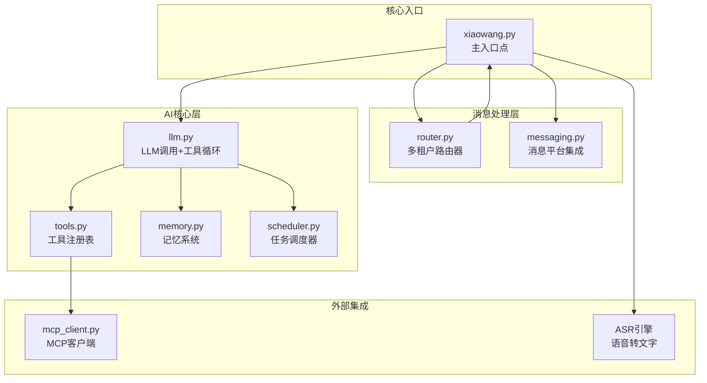
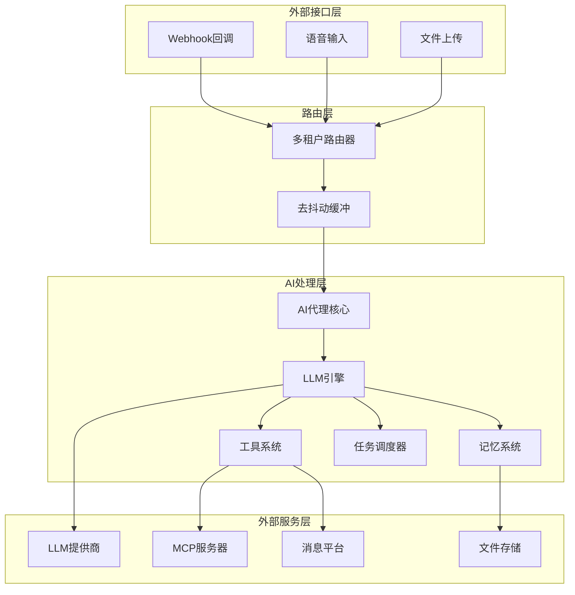
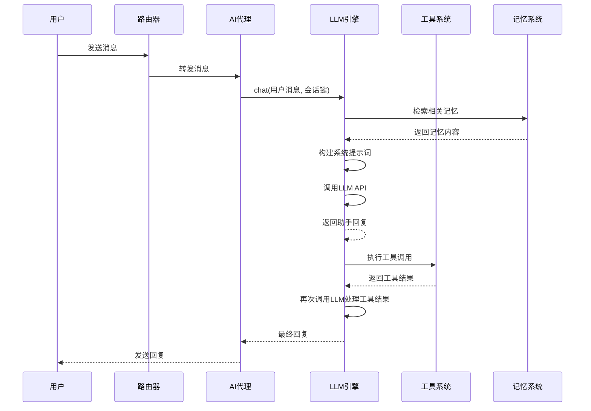
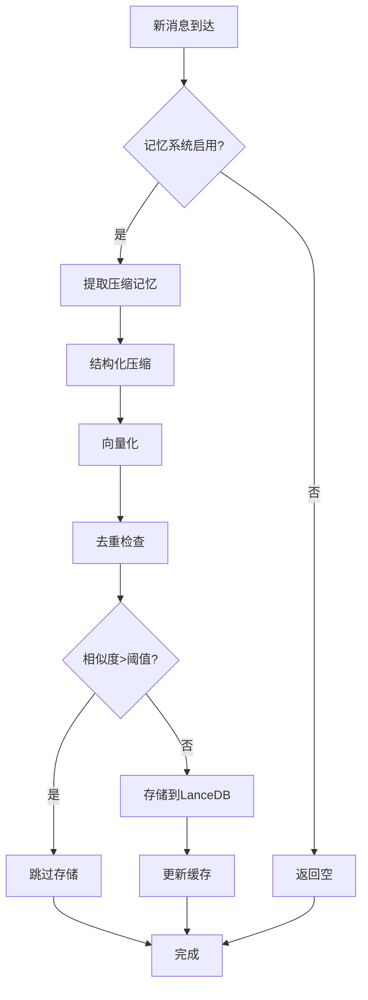
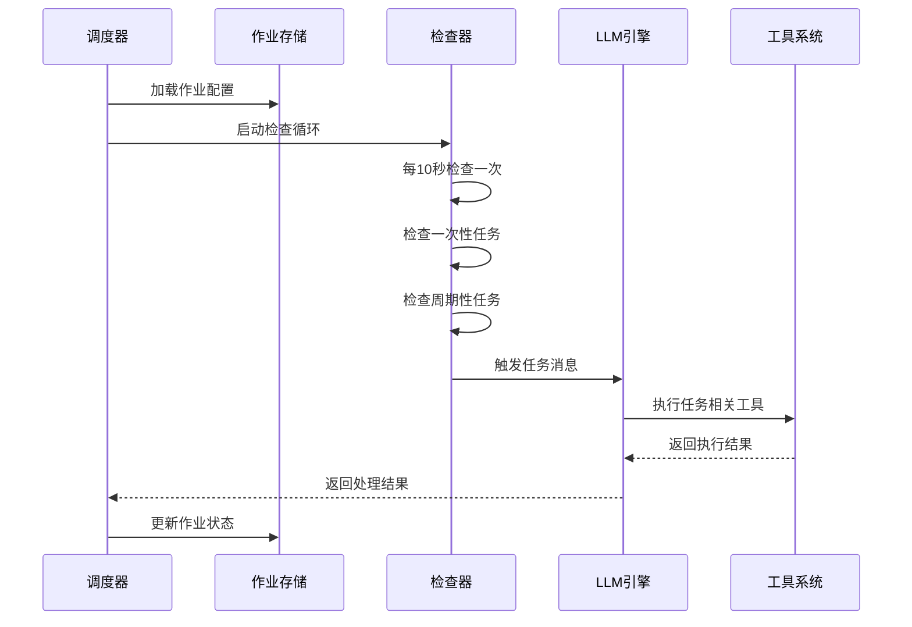
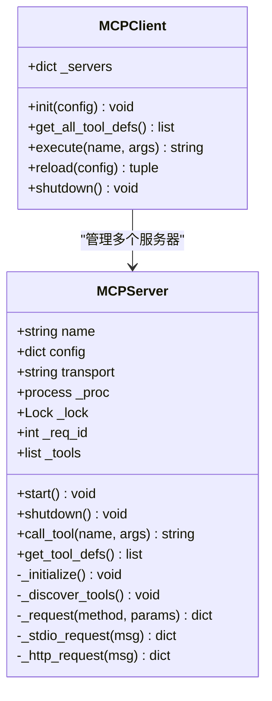
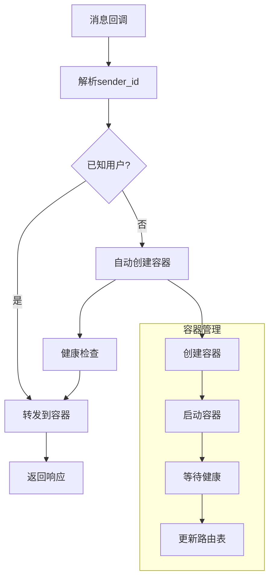
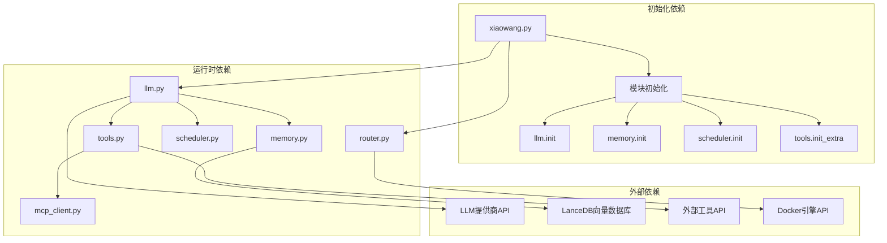

# 组件交互机制

<cite>
**本文档引用的文件**
- [llm.py](file://llm.py)
- [mcp_client.py](file://mcp_client.py)
- [memory.py](file://memory.py)
- [router.py](file://router.py)
- [scheduler.py](file://scheduler.py)
- [self_check_tool.py](file://self_check_tool.py)
- [tools.py](file://tools.py)
- [xiaowang.py](file://xiaowang.py)
- [README.md](file://README.md)
</cite>

## 目录
1. [简介](#简介)
2. [项目结构](#项目结构)
3. [核心组件](#核心组件)
4. [架构概览](#架构概览)
5. [详细组件分析](#详细组件分析)
6. [依赖关系分析](#依赖关系分析)
7. [性能考虑](#性能考虑)
8. [故障排除指南](#故障排除指南)
9. [结论](#结论)

## 简介

724 Office是一个自演进的AI代理系统，采用纯Python实现（约3500行代码），无需任何框架依赖。该系统实现了完整的工具使用循环机制，支持多模态输入处理、记忆系统、任务调度、MCP插件系统等功能。系统设计的核心目标是提供一个可扩展、自修复、24/7运行的智能代理平台。

## 项目结构

系统采用模块化设计，每个核心功能都封装在独立的Python文件中：

**图表来源**
- [xiaowang.py:1-626](file://xiaowang.py#L1-L626)
- [router.py:1-493](file://router.py#L1-L493)
- [llm.py:1-401](file://llm.py#L1-L401)

**章节来源**
- [README.md:23-66](file://README.md#L23-L66)
- [xiaowang.py:35-76](file://xiaowang.py#L35-L76)

## 核心组件

### LLM核心引擎
LLM组件是整个系统的心脏，负责：
- LLM API调用和响应处理
- 工具使用循环的执行
- 会话管理和状态持久化
- 多模态消息处理（文本、图像、视频）

### 记忆系统
实现三层记忆架构：
1. **短期记忆**：最近40条对话消息
2. **长期记忆**：通过LLM结构化提取的事实
3. **检索记忆**：基于向量相似度的语义搜索

### 工具系统
提供26个内置工具，涵盖：
- 文件操作工具
- 媒体发送工具
- 视频处理工具
- 搜索工具
- 调度工具
- 自诊断工具

### 任务调度器
支持一次性任务和周期性任务，具有：
- 持久化作业管理
- 时区感知的时间计算
- 异步触发机制

### MCP客户端
实现MCP协议的JSON-RPC通信：
- 支持stdio和HTTP传输
- 自动重连机制
- 工具定义转换

**章节来源**
- [llm.py:1-401](file://llm.py#L1-L401)
- [memory.py:1-361](file://memory.py#L1-L361)
- [tools.py:1-800](file://tools.py#L1-L800)
- [scheduler.py:1-219](file://scheduler.py#L1-L219)
- [mcp_client.py:1-334](file://mcp_client.py#L1-L334)

## 架构概览

系统采用分层架构设计，确保各组件间的松耦合和高内聚：

**图表来源**
- [router.py:308-425](file://router.py#L308-L425)
- [xiaowang.py:489-588](file://xiaowang.py#L489-L588)
- [llm.py:317-401](file://llm.py#L317-L401)

## 详细组件分析

### LLM工具使用循环机制

LLM的工具使用循环是系统的核心交互模式：

**图表来源**
- [llm.py:317-401](file://llm.py#L317-L401)
- [llm.py:324-399](file://llm.py#L324-L399)

#### 工具使用循环的关键特性

1. **线程安全保证**：每个会话使用独立锁，确保同一会话的消息按顺序处理
2. **最大迭代限制**：防止无限循环，设置为20次迭代
3. **错误处理机制**：工具调用失败时返回错误信息而非中断整个流程
4. **会话持久化**：每次迭代后保存会话状态

**章节来源**
- [llm.py:306-401](file://llm.py#L306-L401)

### 记忆系统交互机制

记忆系统采用三阶段管道处理：

**图表来源**
- [memory.py:121-361](file://memory.py#L121-L361)
- [memory.py:294-361](file://memory.py#L294-L361)

#### 记忆系统的关键特性

1. **异步压缩**：后台线程处理压缩任务，不影响主线程响应
2. **相似度阈值**：使用余弦相似度进行去重，阈值为0.92
3. **零延迟缓存**：为硬件/语音通道提供预计算的记忆摘要
4. **向量检索**：基于嵌入模型的语义相似度搜索

**章节来源**
- [memory.py:1-361](file://memory.py#L1-L361)

### 任务调度器协调机制

调度器实现了一次性任务和周期性任务的统一管理：

**图表来源**
- [scheduler.py:208-219](file://scheduler.py#L208-L219)
- [scheduler.py:130-186](file://scheduler.py#L130-L186)

#### 调度器的关键特性

1. **持久化存储**：作业配置存储在jobs.json文件中
2. **时区感知**：使用CST时区进行时间计算
3. **异步触发**：任务触发时启动独立线程
4. **错误通知**：任务失败时自动通知所有者

**章节来源**
- [scheduler.py:1-219](file://scheduler.py#L1-L219)

### MCP客户端通信机制

MCP客户端实现了标准的MCP协议JSON-RPC通信：

**图表来源**
- [mcp_client.py:27-262](file://mcp_client.py#L27-L262)
- [mcp_client.py:269-334](file://mcp_client.py#L269-L334)

#### MCP客户端的关键特性

1. **双传输模式**：支持stdio和HTTP两种传输方式
2. **自动重连**：服务器断开后自动尝试重新连接
3. **工具命名空间**：使用"servername__toolname"格式避免冲突
4. **热重载支持**：无需重启即可重新连接MCP服务器

**章节来源**
- [mcp_client.py:1-334](file://mcp_client.py#L1-L334)

### 多租户路由器机制

路由器实现了基于sender_id的多租户容器管理：

**图表来源**
- [router.py:397-418](file://router.py#L397-L418)
- [router.py:141-250](file://router.py#L141-L250)

#### 路由器的关键特性

1. **自动容器管理**：未知用户的首次消息触发容器自动创建
2. **健康检查**：容器启动后进行健康检查确保可用性
3. **路由表持久化**：路由配置存储在JSON文件中
4. **并发处理**：使用线程池处理多个并发请求

**章节来源**
- [router.py:1-493](file://router.py#L1-L493)

## 依赖关系分析

系统采用松耦合的设计，主要依赖关系如下：

**图表来源**
- [xiaowang.py:59-76](file://xiaowang.py#L59-L76)
- [llm.py:17-31](file://llm.py#L17-L31)
- [tools.py:80-83](file://tools.py#L80-L83)

### 组件间数据流

系统中的数据流遵循以下模式：

1. **消息输入流**：消息平台回调 → 路由器 → 去抖动缓冲 → AI代理
2. **处理输出流**：AI代理 → LLM引擎 → 工具系统 → 外部服务
3. **记忆反馈流**：用户消息 → 记忆检索 → 系统提示词 → LLM响应
4. **调度触发流**：定时器 → 调度器 → LLM处理 → 工具执行

**章节来源**
- [xiaowang.py:489-588](file://xiaowang.py#L489-L588)
- [llm.py:317-401](file://llm.py#L317-L401)

## 性能考虑

### 并发控制策略

系统采用了多层次的并发控制机制：

1. **会话级锁**：每个会话使用独立锁，确保消息处理的有序性
2. **全局锁保护**：共享资源访问使用全局锁保护
3. **线程池管理**：使用守护线程避免阻塞进程退出
4. **超时控制**：所有外部调用都有明确的超时设置

### 内存管理优化

1. **会话截断**：超过40条消息时自动截断并压缩历史
2. **异步压缩**：后台线程处理压缩任务，不影响前台响应
3. **缓存机制**：记忆摘要缓存减少重复计算
4. **文件清理**：临时文件及时清理，避免磁盘占用

### 网络通信优化

1. **批量处理**：语音消息通过去抖动机制合并处理
2. **连接复用**：MCP客户端支持连接复用和自动重连
3. **超时重试**：网络请求设置合理的超时和重试机制
4. **错误隔离**：单个组件故障不影响其他组件运行

## 故障排除指南

### 常见问题及解决方案

#### LLM调用失败
- **症状**：AI服务暂时不可用
- **原因**：网络连接问题、API密钥错误、服务端错误
- **解决方案**：检查网络连接、验证API密钥、查看日志详情

#### 工具执行错误
- **症状**：工具调用返回错误信息
- **原因**：权限不足、参数错误、外部服务不可用
- **解决方案**：检查工具权限、验证参数格式、确认外部服务状态

#### 记忆系统异常
- **症状**：记忆检索失败或存储异常
- **原因**：向量数据库连接问题、嵌入模型API错误
- **解决方案**：检查数据库连接、验证API密钥、确认网络连通性

#### 容器启动失败
- **症状**：新用户无法获得服务
- **原因**：Docker引擎问题、镜像拉取失败、资源不足
- **解决方案**：检查Docker服务状态、验证镜像配置、释放系统资源

**章节来源**
- [llm.py:369-372](file://llm.py#L369-L372)
- [tools.py:63-74](file://tools.py#L63-L74)
- [memory.py:84-86](file://memory.py#L84-L86)
- [router.py:247-249](file://router.py#L247-L249)

### 日志监控建议

系统提供了丰富的日志信息，建议重点关注：

1. **性能日志**：记录LLM调用耗时、工具执行时间
2. **错误日志**：记录所有异常和错误信息
3. **内存日志**：记录内存使用情况和压缩效果
4. **网络日志**：记录外部API调用状态

## 结论

724 Office系统通过精心设计的组件交互机制，实现了高度模块化的AI代理平台。系统的核心优势包括：

1. **清晰的架构层次**：从消息处理到AI决策再到工具执行的完整链路
2. **强大的扩展能力**：MCP插件系统和运行时工具创建支持
3. **可靠的稳定性**：多层错误处理和自愈机制
4. **高效的性能**：异步处理和缓存优化
5. **良好的可维护性**：模块化设计和完善的日志系统

该系统为构建生产级AI代理应用提供了完整的参考实现，其设计理念和架构模式可以应用于各种智能代理场景。